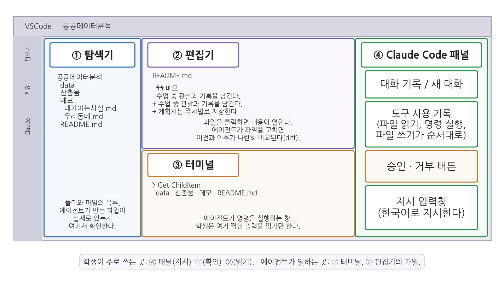
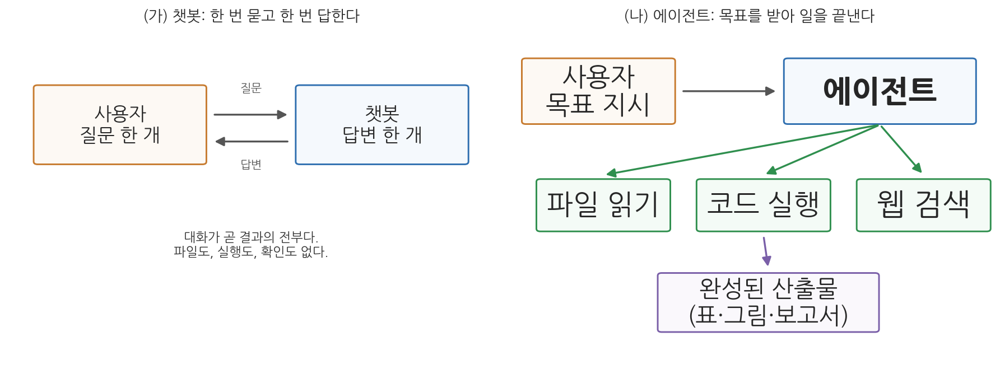
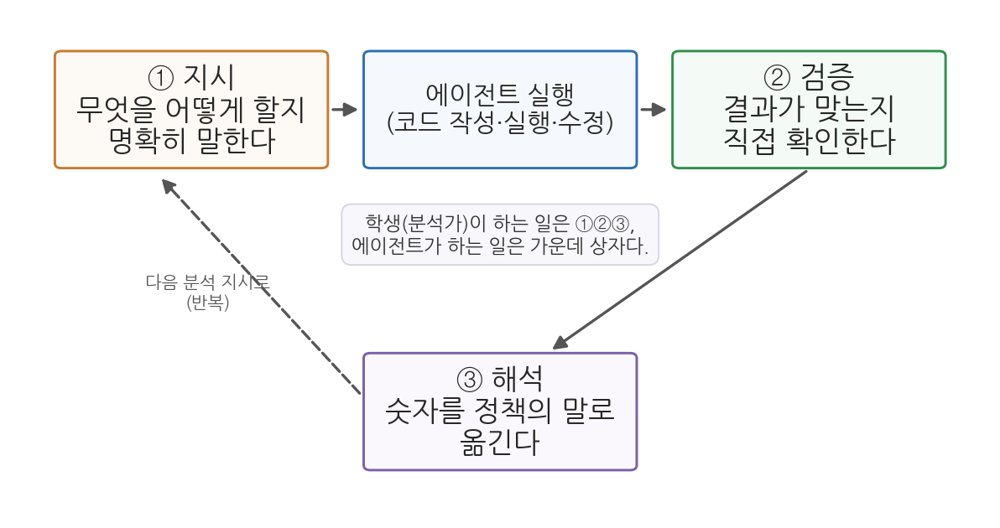

# 1주차 2회차. 첫 만남: VSCode와 Claude Code

## 이 실습에서 하는 것

1회차에서 우리는 에이전트가 "행동하는 AI"라는 것을 개념으로 배웠다. 이번 회차에는 그 에이전트를 내 노트북에 실제로 설치하고, 첫 일을 시켜 본다. 1회차에서 배운 개념은 그것이 필요한 단계에서 화면에 나온 결과를 놓고 다시 짚는다. 단계마다 있는 "먼저 알아 둘 것"과 "짚고 가기"가 그 자리다. 이 실습이 끝나면 다음이 갖추어진다.

- 내 노트북에 설치된 VSCode와 Claude Code 확장
- 한 학기 동안 쓸 작업 폴더 (`공공데이터분석`)와 그 안의 세 하위 폴더(data, 산출물, 메모), 그리고 README.md
- 에이전트의 파일 수정 제안을 비교 화면에서 읽고, 한 번은 거부하고 한 번은 승인해 본 경험
- 말로 정한 폴더 규칙이 새 대화에서 어떻게 되는지 직접 확인한 경험
- 에이전트에게 지시해서 만든 첫 산출물 (우리 동네 소개 문서, 목차와 요약표 포함)
- "에이전트가 무엇을 하고 무엇을 못 하는지"를 네 가지 시험으로 확인한 경험

오늘의 목표는 분석이 아니다. 도구의 화면 구성에 익숙해지고, 지시하고 결과를 받는 조작을 손에 익히는 것이다. 서두를 필요 없다. 오늘 익힌 조작(폴더 열기, 대화창에 지시 입력, 결과 확인)은 앞으로 13주 내내 매주 반복된다. 새 도구를 처음 만나는 날에 권하는 태도가 하나 있다. 에이전트가 "무엇을 했다"고 말한 것과 화면에 실제로 생긴 것을 짝지어 보는 것이다. 이 짝짓기가 오늘의 모든 단계에 들어 있고, 다음 주(2주차)의 관찰 실습으로 그대로 이어진다.

## 준비물

| 구분 | 내용 |
|------|------|
| 컴퓨터 | 본인 노트북 (Windows 기준으로 설명, macOS도 흐름은 같음) |
| 계정 | Claude 유료 구독 계정 (수강 안내에 따라 가입을 마쳤다고 가정) |
| 네트워크 | 강의실 Wi-Fi (설치 파일 다운로드와 에이전트 사용에 필요) |
| 데이터 | 없음. 오늘은 데이터 파일을 다루지 않는다 (data 폴더는 비운 채로 만든다) |
| 선수 내용 | 1주차 1회차 (챗봇과 에이전트의 차이, 지시·검증·해석) |

## 2.1 VSCode 설치와 화면 구성

**무엇을 왜 하는가.** VSCode(Visual Studio Code)는 마이크로소프트가 만든 무료 편집기다. 1회차에서 말했듯, 우리는 VSCode를 코드를 직접 작성하는 곳이 아니라 에이전트가 일하는 작업 환경으로 쓴다. 에이전트를 쓰려면 이 작업 환경이 먼저 갖추어져야 하므로, 첫 단계는 VSCode를 설치하고 화면의 어느 구역이 무슨 일을 하는지 눈에 익히는 것이다. 이 단계에는 아직 에이전트가 없다. 그래서 오늘 유일하게 지시문 없이 손으로만 하는 단계다.

### 설치

공식 사이트(code.visualstudio.com)에서 "Download for Windows"를 눌러 설치 파일을 받고, 실행해서 기본 설정 그대로 "다음"을 눌러 설치를 마친다. 한 가지만 신경 쓰자. 설치 중 "추가 작업 선택" 화면이 나오면 "PATH에 추가" 항목이 체크되어 있는지 확인한다(기본값으로 체크되어 있다). 지금은 "체크되어 있으면 된다"만 기억하면 충분하다.

### 화면 구성 익히기

VSCode를 처음 열면 영어 화면에 낯선 아이콘이 가득하다. 우리가 쓸 부분은 네 곳뿐이다. 그림 1-4가 그 네 구역을 한 화면에 그린 것이다.



그림 1-4를 읽는 법은 이렇다. 바깥의 큰 사각형이 VSCode 창 하나이고, 그 안이 ① 탐색기, ② 편집기, ③ 터미널, ④ Claude Code 패널의 네 구역으로 나뉜다. 각 구역 안에는 오늘 실제로 보게 될 내용을 미리 그려 두었다. 맨 아래 상자가 이 그림의 요지다. 학생이 주로 쓰는 곳은 ④(지시)·①(확인)·②(읽기)이고, 에이전트가 일하는 곳은 ③과 ②의 파일이다. 여기서 알 수 있는 것은 사람과 에이전트가 같은 창을 쓰되 맡은 구역이 다르다는 점이다. 오늘 하루 여러분의 손은 주로 오른쪽 패널에, 눈은 주로 왼쪽과 가운데에 가 있게 된다.

- **① 탐색기(왼쪽)**: 맨 왼쪽 세로 막대(활동 막대)의 맨 위, 문서 두 장 겹친 아이콘을 누르면 열린다. 열어 둔 폴더의 파일 목록이 여기 보인다. 오늘 이 구역의 용도는 하나다. 에이전트가 "만들었다"고 한 파일이 실제로 있는지 확인하는 곳.
- **② 편집기(가운데 위)**: 탐색기의 파일을 클릭하면 내용이 여기 열린다. 에이전트가 기존 파일을 고치면 고치기 전과 후를 나란히 비교하는 화면(diff)도 여기 나타난다.
- **③ 터미널(가운데 아래)**: 컴퓨터에 문자로 명령을 내리는 창구다. 이 과목에서는 명령 실행을 에이전트에게 맡기므로 여러분이 직접 칠 일은 거의 없고, 에이전트가 여기서 일하는 모습과 출력 결과를 확인하는 창으로 쓰면 된다. 평소에는 접혀 있다가 에이전트가 명령을 실행하면 나타나며, 메뉴 View → Terminal로 직접 열어 볼 수도 있다. 이 창의 정체(셸)는 3주차에서 배운다.
- **④ Claude Code 패널(오른쪽)**: 다음 단계에서 확장을 설치하면 생긴다. 지시를 입력하는 창, 에이전트가 어떤 도구를 썼는지 보여 주는 기록, 승인·거부 버튼이 모두 여기 있다.

**표 1-2. VSCode 네 구역과 오늘의 용도**

| 구역 | 위치 | 누가 쓰는가 | 오늘 할 일 |
|------|------|------|------|
| ① 탐색기 | 왼쪽 | 학생(확인) | 에이전트가 만든 폴더·파일이 실제로 있는지 본다. 파일을 손으로 만들고 이름을 바꿔 본다 |
| ② 편집기 | 가운데 위 | 학생(읽기), 에이전트(쓰기) | 파일 내용을 열어 읽고, 수정 비교 화면을 본다 |
| ③ 터미널 | 가운데 아래 | 에이전트(실행) | 에이전트가 실행한 명령과 그 출력을 읽는다 |
| ④ Claude Code 패널 | 오른쪽 | 학생(지시·승인), 에이전트(보고) | 지시를 입력하고, 도구 사용 기록을 읽고, 승인·거부를 누른다 |

**예상되는 화면과 결과.** 설치 직후 VSCode는 폴더가 열리지 않은 상태로 시작한다. 탐색기에는 "Open Folder" 버튼만 보이고, 편집기 자리에는 환영(Welcome) 페이지가 떠 있다. 터미널과 Claude Code 패널은 아직 보이지 않는다. 정상이다. 패널은 2.2에서, 폴더는 2.3에서 생긴다.

**검증.** 두 가지 조작을 해 본다. (1) 활동 막대의 탐색기 아이콘을 눌렀다가 다시 누르면 왼쪽 구역이 접혔다 펼쳐지는가. (2) 메뉴 View → Terminal을 눌러 아래쪽에 터미널 창이 나타나는가. 나타나면 아무것도 입력하지 말고 닫는다. 이 두 조작이 되면 화면 구성은 익힌 것이다.

<div style="border:1px solid #e0d8ea;border-left:5px solid #7a5fa8;background:#faf8fc;padding:12px 16px;margin:18px 0;border-radius:4px;">
<strong>왜 하필 VSCode인가?</strong><br>
Claude Code는 터미널 단독으로도, 다른 편집기에서도 쓸 수 있다. 그런데도 VSCode를 표준으로 삼는 이유는 세 가지다. 첫째, 무료이고 어느 운영체제에서나 같다. 둘째, 탐색기 덕분에 에이전트가 만들거나 고친 파일을 바로 눈으로 확인할 수 있다. 셋째, 에이전트가 파일을 고칠 때 무엇이 어떻게 바뀌는지 나란히 비교 화면(diff)으로 보여 주어, 우리 과목의 핵심 습관인 "검증"에 유리하다.
</div>

<div style="border:1px solid #ecd9c6;border-left:5px solid #c77b2f;background:#fdf9f4;padding:12px 16px;margin:18px 0;border-radius:4px;">
<strong>유의 · 한글 이름과 경로</strong><br>
작업 폴더 이름은 <code>공공데이터분석</code>처럼 한글이어도 된다. 이 교재는 일부러 한글 이름을 쓰며, 3주차에서 한글 폴더 이름 때문에 생기는 오류를 에이전트가 어떻게 넘기는지 관찰하게 된다. 다만 Windows 사용자 이름(C:\Users\ 아래 폴더 이름)이 한글이면 일부 도구가 경로를 제대로 읽지 못하는 경우가 있다. 오늘 실습에서는 문제가 되지 않으므로 지금 바꿀 필요는 없고, 3주차 환경 구축에서 오류가 나면 그때 다룬다.
</div>

## 2.2 Claude Code 확장 설치와 로그인

**무엇을 왜 하는가.** VSCode의 기능을 넓혀 주는 부가 프로그램을 확장(extension)이라 한다. Claude Code는 이 확장의 형태로 VSCode 안에 들어온다. 에이전트를 VSCode 안에서 쓸 수 있게 되는 단계다. 설치와 로그인은 처음 한 번만 하면 되고, 끝나면 그림 1-4의 ④ 구역이 생긴다. 끝에서 첫 인사를 건네며, 에이전트의 말과 화면의 사실을 처음으로 나란히 놓아 본다.

### 확장 설치

활동 막대에서 네모 블록 아이콘(확장)을 누르고, 검색창에 "Claude Code"를 입력한다. 제작자가 Anthropic으로 표시된 것을 확인하고 "Install"을 누른다.

<div style="border:1px solid #ecd9c6;border-left:5px solid #c77b2f;background:#fdf9f4;padding:12px 16px;margin:18px 0;border-radius:4px;">
<strong>유의 · 비슷한 이름의 확장</strong><br>
검색 결과에는 이름에 "Claude"가 들어간 제3자 확장이 여럿 나온다. 반드시 제작자(Publisher)가 <strong>Anthropic</strong>인 것을 설치한다. 제3자 확장은 이 교재의 설명과 화면이 다르고, 계정 정보를 요구하는 경우 보안 위험도 있다.
</div>

### 로그인

설치가 끝나면 활동 막대에 Claude 아이콘이 생긴다. 아이콘을 눌러 나오는 안내에 따라 로그인하면 브라우저가 열리며 Claude 계정 인증을 요청한다. 수강 안내에 따라 만든 구독 계정으로 로그인하고 승인하면, VSCode로 돌아와 대화창이 활성화된다. 이 과정은 처음 한 번만 하면 된다.

로그인이 끝나면 Claude Code 패널이 열린다. 화면 한쪽에 세로로 붙어 나타나며, 그림 1-4에서는 오른쪽에 그렸다. 왼쪽에 열렸다면 그대로 써도 되고, 패널 제목 부분을 끌어다 오른쪽에 놓아 옮길 수도 있다. 패널을 한 번 훑어 두자. 맨 아래가 지시 입력칸이고, 위쪽에 새 대화 버튼과 이전 대화 목록 버튼이 있다. 아이콘 모양은 버전에 따라 다르므로 마우스를 올려 설명 풍선을 읽어 찾는다.

### 첫 인사

<div style="border:1px solid #cfe3d4;border-left:5px solid #2f8f4e;background:#f4fbf6;padding:12px 16px;margin:18px 0;border-radius:4px;">
<strong>지시문 예시</strong><br>
"안녕. 너는 지금 어느 폴더에서 일하고 있어? 열려 있는 폴더가 없으면 없다고 말해 줘. 그리고 네가 할 수 있는 일을 다섯 가지만 한 줄씩 한국어로 알려 줘."
</div>

**예상되는 에이전트의 행동과 결과.** 에이전트가 짧게 답한다. 아직 폴더를 열지 않았으므로 "현재 열린 작업 폴더가 없다"고 하거나, VSCode가 기본으로 잡아 둔 어떤 경로(예: 사용자 홈 폴더)를 알려 줄 것이다. 이어서 파일 읽기와 쓰기, 명령 실행, 웹 검색, 코드 작성 같은 항목이 나열된다. 대화창에는 대략 다음과 비슷한 모양이 보인다.

```text
● 현재 VSCode에 열려 있는 작업 폴더가 없습니다.
  폴더를 열면 그 안에서 파일을 읽고 쓸 수 있습니다.

  제가 할 수 있는 일:
  1. 폴더 안의 파일을 읽고 요약하기
  2. 새 파일과 폴더 만들기
  3. 터미널에서 명령을 실행하기
  4. 웹에서 자료를 검색하기
  5. 코드를 작성하고 실행하기
```

첫 대화에서 에이전트가 영어로 답하는 일이 흔하다. 지시문에 "한국어로"를 넣었는데도 영어가 섞여 나오면 "한국어로 다시 답해 줘"라고 한 번 더 말하면 된다.

**검증.** 확인할 것은 두 가지다. (1) 답이 한국어인가. (2) 에이전트가 말한 폴더가 화면의 사실과 맞는가. 지금은 아무 폴더도 열지 않았으므로 "없다"거나 홈 폴더를 말하는 답이 맞고, 탐색기에 "Open Folder" 버튼만 보이는 화면이 그 증거다. 에이전트가 나열한 다섯 가지는 자기소개이지 약속이 아니며, 무엇이 실제로 되는지는 2.7에서 시험한다.

## 2.3 첫 대화: 작업 폴더 열기, 파일 만들기, 지시하기

**무엇을 왜 하는가.** 에이전트는 "열어 둔 폴더" 안에서 일한다. 한 학기 동안 쓸 폴더를 하나 만들고, 그 안에 세 개의 하위 폴더를 에이전트에게 시켜 만든다. 세 폴더의 역할은 다르다. data에는 원본 데이터 파일을 두고 손대지 않는다. 산출물에는 에이전트가 만든 표·그림·보고서가 쌓인다. 메모에는 계획서처럼 사람이 쓰는 문서를 둔다. 이렇게 나누는 이유는 3주차에서 원리로 배우고, 오늘은 나누어 두는 것으로 충분하다. 첫 지시의 목적은 폴더 세 개가 아니라, 지시 → 승인 요청 → 실행 → 보고 → 확인이라는 한 번의 순환을 처음으로 거쳐 보는 데 있다.

### 작업 폴더 만들기와 열기

바탕화면에 `공공데이터분석`이라는 폴더를 만들고, VSCode 메뉴에서 File → Open Folder로 그 폴더를 연다. "이 폴더의 작성자를 신뢰합니까?"라고 물으면 "예"를 선택한다. 이제 탐색기에 (아직 텅 빈) 폴더가 보인다.

앞으로 매 실습의 시작은 언제나 같다. VSCode를 열고 → 이 폴더를 열고 → Claude Code 패널을 연다.

### 첫 지시

대화창에 첫 지시를 입력해 보자.

<div style="border:1px solid #cfe3d4;border-left:5px solid #2f8f4e;background:#f4fbf6;padding:12px 16px;margin:18px 0;border-radius:4px;">
<strong>지시문 예시</strong><br>
"안녕. 이 폴더는 한 학기 동안 공공데이터 분석 수업에 쓸 작업 폴더야. 폴더 안에 data, 산출물, 메모 세 개의 하위 폴더를 만들고, 폴더 맨 위에 README.md 파일을 만들어서 각 폴더의 용도를 두 줄씩 설명해 줘. 모든 설명은 한국어로."
</div>

**예상되는 에이전트의 행동과 결과.** 대화창에 에이전트의 작업 과정이 차례로 나타난다. 폴더를 만드는 명령을 실행하겠다며 승인을 요청하고, README.md를 쓰겠다며 다시 승인을 요청할 수 있다. 패널에는 대략 이런 순서로 기록이 쌓인다.

```text
● 세 개의 하위 폴더와 README.md를 만들겠습니다.
  Bash(mkdir data 산출물 메모)            ← 승인 요청
● Write(README.md)                       ← 승인 요청
● 완료했습니다. data, 산출물, 메모 폴더와 README.md를 만들었고,
  README.md에 각 폴더의 용도를 두 줄씩 한국어로 적었습니다.
```

기록의 각 줄 앞에 붙은 영어 낱말은 에이전트가 쓴 도구의 이름이다. 오늘은 네 개만 알면 된다. Bash는 터미널에서 명령을 실행한 것, Write는 새 파일을 쓴 것, Read는 파일을 읽은 것, Edit는 있는 파일을 고친 것이다. 괄호 안은 그 대상이다. 이 네 낱말만 읽을 줄 알면 에이전트의 보고문을 읽기 전에 무엇을 했는지 알 수 있다. 도구 기록을 본격적으로 읽는 연습은 2주차에서 한다.

승인 요청에는 에이전트가 실행하려는 명령이나 만들려는 파일의 내용이 문자로 보인다. 읽고 나서 승인한다. 폴더 세 개를 만드는 명령(`mkdir`)은 위험할 것이 없으므로 승인하면 된다. 왜 에이전트가 사소한 일에도 묻는지, 어떤 요청은 거부해야 하는지는 2주차(권한 모드)에서 다룬다. 잠시 뒤 탐색기에 세 개의 폴더와 README.md가 나타나고, README.md는 대략 다음과 같은 모양이다.

```markdown
# 공공데이터분석 작업 폴더

## data
분석에 쓸 원본 데이터 파일을 두는 곳이다.
원본은 고치지 않고 그대로 보관한다.

## 산출물
에이전트가 만든 표와 그림을 저장하는 곳이다.
파일 이름에 만든 날짜나 주차를 넣어 구분한다.

## 메모
수업에서 쓰는 문서를 두는 곳이다.
계획서, 보고서처럼 사람이 읽는 문서를 둔다.
```

**짚고 가기: 대화가 아니라 폴더가 결과다.** 방금 한 줄을 입력했더니 탐색기에 폴더 세 개와 파일 하나가 생겼다. 이것이 챗봇과 에이전트를 가르는 지점이다. 같은 부탁을 챗봇에게 했다면 돌아오는 것은 "탐색기에서 마우스 오른쪽 버튼을 눌러 새 폴더를 만드십시오"라는 안내문이거나 `mkdir data 산출물 메모`라는 명령 한 줄이었을 것이다. 그 안내문을 읽고 폴더를 만드는 일, 명령을 어디에 칠지 찾는 일은 모두 내 몫으로 남는다. 방금 화면에서는 그 일을 에이전트가 했다. 에이전트가 터미널에서 `mkdir`을 직접 실행했고(Bash 줄), README.md를 직접 썼다(Write 줄).



그림 1-1을 지금 화면과 짝지어 보자. 왼쪽 (가)의 챗봇은 질문 한 개와 답변 한 개를 주고받는 것이 전부이고, 그림 아래에 적힌 대로 파일도 실행도 확인도 없다. 오른쪽 (나)에서 에이전트는 목표를 받아 파일 읽기와 코드 실행 같은 도구를 골라 쓰고 완성된 산출물을 남긴다. 방금 패널에 찍힌 Bash와 Write가 바로 (나)의 가운뎃줄 상자들이고, 탐색기에 생긴 폴더 세 개와 README.md가 맨 아래 상자다. 여기서 알 수 있는 것은 오늘부터 우리가 확인할 대상이 대화창의 문장이 아니라 폴더에 남은 물건이라는 점이다. 다음 문단의 검증이 곧 그 확인이다. (자세한 설명은 1회차 1.2)

**검증.** 에이전트의 보고만 믿지 말고 눈으로 확인한다. 세 가지다. (1) 탐색기에서 폴더 세 개가 실제로 생겼고 이름이 지시한 그대로(data, 산출물, 메모)인가. (2) README.md를 클릭해 열어 보면 설명이 한국어로, 폴더마다 두 줄씩 적혀 있는가. (3) 부탁하지 않은 것이 덧붙지는 않았는가. 예를 들어 폴더 안에 이름이 점으로 시작하는 빈 파일이 생겼거나, README에 "사용법" 같은 절이 추가되어 있을 수 있다. 이 "보고 따로, 실물 확인 따로"가 우리 과목의 기본 동작이다.

### 에이전트가 틀리는 장면 1: 시킨 대로 되지 않았다

첫 지시가 그대로 이루어지지 않는 일은 드물지 않다. 실제로 자주 보이는 어긋남은 세 종류다. 폴더 이름을 `output`, `notes`처럼 영문으로 바꿔 만들거나, README의 설명이 어떤 폴더는 두 줄이고 어떤 폴더는 한 줄이거나, 설명 문장 일부가 영어로 남는 경우다. 이런 어긋남은 사고가 아니라 오늘의 관찰 대상이다. 잡는 순서는 네 단계다.

1. **틀림.** 에이전트는 "각 폴더의 용도를 두 줄씩 적었다"고 보고했다.
2. **검증에서 발견.** README.md를 열어 세어 보니 메모 폴더의 설명이 한 줄뿐이다. 보고와 실물이 다르다.
3. **재지시.** 무엇이 어떻게 다른지 짚어서 다시 시킨다. 이때 "다른 부분은 바꾸지 마"를 붙인다. 에이전트는 고치라는 곳을 고치면서 다른 곳까지 손대는 경우가 있기 때문이다.
4. **수정 확인.** 고친 뒤 파일을 다시 열어 두 줄이 되었는지, 다른 절이 그대로인지 본다.

<div style="border:1px solid #cfe3d4;border-left:5px solid #2f8f4e;background:#f4fbf6;padding:12px 16px;margin:18px 0;border-radius:4px;">
<strong>지시문 예시</strong><br>
"README.md에서 메모 폴더의 설명이 한 줄뿐이야. 두 줄로 채워 줘. data와 산출물 절을 포함해서 다른 부분은 한 글자도 바꾸지 마."
</div>

**예상되는 에이전트의 행동과 결과.** 에이전트가 README.md를 다시 읽고 메모 절에 한 줄을 더하는 수정을 제안한다. 이번에는 새 파일을 만드는 것이 아니라 있는 파일을 고치는 것이므로, 편집기에 고치기 전과 후를 나란히 비교하는 화면이 나타난다. 이 화면을 읽는 법은 바로 다음 단계(2.4)에서 익힌다.

**검증.** 승인한 뒤 README.md를 열어 메모 절이 두 줄인지, data와 산출물 절의 문장이 이전과 같은지 본다. 여러분의 README가 처음부터 지시대로 되어 있었다면 이 장면은 건너뛰어도 좋다. 다만 "이번에는 맞았다"는 것과 "확인하지 않아도 된다"는 것은 다르다는 점을 기억해 두자.

## 2.4 네 구역 돌아보기: 파일 읽기, 수정 제안, 승인과 거부

**무엇을 왜 하는가.** 그림 1-4의 네 구역을 한 번씩 손으로 다뤄 본다. 특히 익힐 것은 에이전트의 수정 제안을 보여 주는 비교 화면(diff)과 승인·거부 버튼이다. 승인만 눌러 본 사람은 거부가 무엇을 막는지 모른다. 그래서 오늘은 같은 수정 제안을 일부러 한 번 거부하고 한 번 승인해서, 거부하면 파일이 그대로이고 승인하면 바뀐다는 사실을 눈으로 확인한다. 이 감각이 있어야 앞으로 에이전트가 데이터 파일이나 코드를 고치겠다고 할 때 제안 내용을 읽고 판단할 수 있다.

### 읽고, 요약하고, 수정을 제안하게 하기

<div style="border:1px solid #cfe3d4;border-left:5px solid #2f8f4e;background:#f4fbf6;padding:12px 16px;margin:18px 0;border-radius:4px;">
<strong>지시문 예시</strong><br>
"README.md를 읽고 한 줄로 요약해 줘. 그다음 README.md의 메모 폴더 설명 끝에 '계획서는 계획서_N주차.md 형식으로 저장한다.'라는 한 줄을 덧붙이는 수정을 제안해 줘. 내가 승인하기 전에는 파일을 바꾸지 마."
</div>

**예상되는 에이전트의 행동과 결과.** 패널의 도구 사용 기록에 파일 읽기가 한 번 나타나고, 요약 한 줄이 이어진다. 그다음 README.md를 고치겠다는 제안이 뜨면서 편집기 구역에 비교 화면이 열린다. 비교 화면은 대략 다음과 같은 모양이다. 새로 들어가는 줄에 더하기 기호(+)와 초록 배경이 붙는다.

```text
  ## 메모
  수업에서 쓰는 문서를 두는 곳이다.
  계획서, 보고서처럼 사람이 읽는 문서를 둔다.
+ 계획서는 계획서_N주차.md 형식으로 저장한다.
```

패널에는 이 수정을 받아들일지 묻는 승인·거부 버튼이 나타난다. 여기서 두 번에 나누어 한다.

**첫 번째는 거부한다.** 거부를 누르면 에이전트가 "수정을 적용하지 않았다"는 취지로 짧게 보고한다. 탐색기에서 README.md를 열어 본다. 메모 절은 두 줄 그대로다. 거부는 제안을 없던 일로 만든다.

**두 번째는 승인한다.** "방금 제안한 수정을 다시 해 줘"라고 말하면 같은 비교 화면이 다시 뜬다. 이번에는 내용을 읽고 승인한다. 편집기의 README.md에 새 줄이 들어간다.

**짚고 가기: 승인 버튼은 위임의 범위를 정하는 조작이다.** 방금 누른 두 버튼이 1회차에서 말한 위임(delegation)의 실물이다. 위임은 어떤 일을 에이전트에게 맡기고 어떤 일을 내가 할지 정하는 능력이며, AI 플루언시의 네 기둥 가운데 첫째다. 방금 화면에서 맡긴 일은 "README.md의 어느 자리에 어떤 줄을 넣을지 찾아 문장을 만드는 일"이고, 내가 맡는 일은 "그 줄이 들어가도 되는지 판정하는 일"이다. 거부를 눌렀을 때 파일이 한 글자도 바뀌지 않은 것이 그 판정이 실제로 힘을 가진다는 증거다.

위임은 맡기느냐 마느냐의 이분법이 아니라 맡기는 범위를 여러 단계로 조절하는 일이다. 1회차에서 자율성을 단계별로 조절한다고 한 것이 이 뜻이다. 오늘 우리는 그 범위를 가장 좁게 두었다. 파일 한 줄을 고치는 데도 에이전트가 멈추어 묻고, 우리는 비교 화면의 초록 줄을 읽고 나서 누른다. 뒤로 갈수록 위임의 범위는 일의 성격에 따라 달라진다. 폴더 목록을 출력하는 명령처럼 되돌릴 것이 없는 일은 범위를 넓혀 크게 맡기고, 원본 데이터 파일을 고치거나 지우는 일은 오늘처럼 좁게 둔다. 읽지 않고 누르는 습관이 들면 승인이 판정으로서 의미를 잃으므로, 승인 요청이 떴을 때 무엇을 승인하는 것인지 한 번 읽는 것이 오늘 익힐 조작이다. 위임의 범위를 설정으로 조절하는 방법(권한 모드)은 2주차에서 배운다. (자세한 설명은 1회차 1.3, 1.4, 표 1-1)

### 터미널 구역: 에이전트가 실행한 명령 읽기

<div style="border:1px solid #cfe3d4;border-left:5px solid #2f8f4e;background:#f4fbf6;padding:12px 16px;margin:18px 0;border-radius:4px;">
<strong>지시문 예시</strong><br>
"터미널에서 이 폴더 안의 폴더와 파일 목록을 출력해서 보여 줘. 결과를 요약하지 말고 터미널에 찍힌 그대로 알려 줘."
</div>

**예상되는 에이전트의 행동과 결과.** 목록을 출력하는 명령(Windows의 PowerShell에서는 `Get-ChildItem` 또는 `dir`)의 실행 승인을 요청하고, 승인하면 아래쪽 터미널 구역이 열리면서 출력이 찍힌다. 날짜와 시각, 파일 크기는 각자 다르다.

```text
    디렉터리: C:\Users\<사용자 이름>\Desktop\공공데이터분석

Mode                 LastWriteTime         Length Name
----                 -------------         ------ ----
d-----      2026-09-03   오후 2:10                data
d-----      2026-09-03   오후 2:10                메모
d-----      2026-09-03   오후 2:10                산출물
-a----      2026-09-03   오후 2:31            380 README.md
```

맨 앞의 `d`는 폴더(directory), `-a`로 시작하는 줄은 파일이다. 지금은 이 정도만 읽을 수 있으면 된다. 명령 자체를 읽는 법은 3주차에서 배운다.

**검증.** 세 구역을 대조한다. 터미널에 찍힌 목록, 탐색기에 보이는 목록, 에이전트가 패널에 보고한 목록이 서로 같은가. 세 곳이 같은 내용을 보여 주면 오늘 익힐 화면 읽기는 끝난 것이다. 하나라도 다르다면(예: 터미널에는 있는데 탐색기에 안 보인다) 탐색기 위쪽의 새로고침 아이콘을 눌러 본다.

### 대화 기록 구역: 지나간 대화 다시 열기

마지막으로 패널 위쪽의 이전 대화 목록 버튼을 눌러 본다. 오늘 나눈 대화가 시간 순으로 저장되어 있고, 하나를 고르면 그 대화로 돌아갈 수 있다. 새 대화 버튼을 눌러 새 대화를 열어도 이전 대화는 목록에 그대로 남는다. 이 기능은 2.5의 새 대화 시험과 2.7의 첫 시험에서 바로 쓴다.

<div style="border:1px solid #cdd9e5;border-left:5px solid #2f6fb0;background:#f5f9fd;padding:12px 16px;margin:18px 0;border-radius:4px;">
<strong>정의 · 비교 화면(diff)과 승인 요청</strong><br>
<strong>비교 화면</strong>(diff)은 파일의 고치기 전과 후를 줄 단위로 나란히 보여 주는 화면이다. 지워지는 줄은 빼기 기호와 붉은색, 새로 들어가는 줄은 더하기 기호와 초록색으로 표시된다. 에이전트가 기존 파일을 고칠 때마다 나타나며, 새 파일을 만들 때는 비교할 이전 내용이 없으므로 나타나지 않는다.<br>
<strong>승인 요청</strong>은 에이전트가 파일을 바꾸거나 명령을 실행하기 전에 "이렇게 해도 되는가"를 사람에게 묻는 절차다. 승인하면 실행되고, 거부하면 아무것도 바뀌지 않는다. 승인 요청은 에이전트가 지금 무엇을 하려는지 알려 주는 창이기도 하다. 요청의 종류와 범위를 조절하는 방법(권한 모드)은 2주차에서 배운다.
</div>

## 2.5 말로 정한 규칙은 어디까지 지켜지는가

**무엇을 왜 하는가.** 2.3에서 폴더 세 개를 만들었지만 폴더는 아직 이름만 붙은 빈 저장 공간일 뿐이다. 어느 파일이 어느 폴더에 들어가는지는 정해지지 않았다. 이번 단계에서는 그 규칙을 말로 정해 주고, 그 규칙이 어디까지 지켜지는지 관찰한다. 관찰의 결과는 "지킨다"와 "안 지킨다" 둘 중 하나가 아니다. 규칙을 정한 직후의 같은 대화에서는 대개 잘 지켜지지만, 대화를 새로 열면 아예 사라진다. 이 차이를 각자의 화면에서 확인해 두면, 2주차에 배울 CLAUDE.md가 왜 필요한지를 설명을 듣기 전에 알게 된다. 오늘은 일부러 규칙을 파일로 고정하지 않고 말로만 정한다. 말로만 정했을 때 무슨 일이 생기는지가 오늘의 관찰 대상이기 때문이다.

### 규칙 네 가지 정해 주기

<div style="border:1px solid #cfe3d4;border-left:5px solid #2f8f4e;background:#f4fbf6;padding:12px 16px;margin:18px 0;border-radius:4px;">
<strong>지시문 예시</strong><br>
"지금부터 이 폴더에서 지킬 규칙 네 가지를 정할게. (1) data 폴더에는 내가 넣은 원본 데이터 파일만 둔다. 너는 data 폴더 안에 파일을 만들지 않는다. (2) 네가 만든 표와 그림은 산출물 폴더에 넣는다. (3) 보고서, 메모, 계획서처럼 사람이 읽는 문서는 메모 폴더에 넣는다. (4) 파일을 만들거나 고칠 때마다 보고의 마지막 줄에 '만든 파일: 전체 경로' 형식으로 한 줄을 적는다. 지금은 파일을 만들지 말고, 이 네 규칙을 네 말로 다시 정리해서 보여 줘. 규칙만으로는 판단이 어려운 경우가 있으면 그것도 함께 물어봐."
</div>

**예상되는 에이전트의 행동과 결과.** 이 지시에는 만들 파일이 없다. 그래서 승인 요청도, 도구 사용 기록도 나타나지 않고 대화창에 정리된 문장만 돌아온다.

```text
● 규칙을 다음과 같이 이해했습니다.
  1. data 폴더: 사용자가 넣은 원본 데이터만 둡니다. 제가 파일을 만들지 않습니다.
  2. 산출물 폴더: 제가 만든 표와 그림을 넣습니다.
  3. 메모 폴더: 보고서, 메모, 계획서처럼 사람이 읽는 문서를 넣습니다.
  4. 파일을 만들거나 고친 뒤 보고의 마지막 줄에 전체 경로를 한 줄 적습니다.

  한 가지 확인하고 싶습니다. 제가 원본을 가공해서 새로 만든 데이터
  파일은 1번의 data 폴더와 2번의 산출물 폴더 중 어디에 넣을까요?
```

이런 되물음이 오면 그 자리에서 답을 정해 준다. "네가 만든 파일은 data 폴더에 두지 않고 산출물 폴더에 둔다"라고 한 줄로 답하면 규칙이 사실상 다섯 개가 된 셈이다. 되묻지 않고 정리만 해 주는 경우도 많다. 어느 쪽이든 다음으로 넘어간다. 정리된 내용이 여러분이 말한 것과 다르면(예: 규칙 4를 "필요할 때 경로를 적는다"로 바꿔 적었다면) 지금 고쳐 둔다. 규칙을 어겼는지 판정하려면 규칙의 문장이 먼저 분명해야 한다.

**짚고 가기: 되물음은 내 지시에 빠진 부분을 보여 준다.** 화면에 돌아온 되물음은 에이전트가 모자라서 나온 것이 아니라 내가 준 규칙에 답이 없어서 나온 것이다. 규칙 1은 data 폴더에 원본만 둔다고 했고 규칙 2는 표와 그림을 산출물에 넣는다고 했는데, 원본을 가공해 만든 데이터 파일은 원본도 아니고 표나 그림도 아니다. 네 문장 사이에 정해지지 않은 부분이 있었던 것이고, 에이전트는 그 부분을 찾아내 물은 것이다. 1회차에서 에이전트는 여러분이 말하지 않은 의도를 알지 못한다고 한 것이 이 장면이다. 에이전트는 정해지지 않은 부분을 만나면 묻거나 짐작하는데, 짐작한 경우는 겉으로 드러나지 않으므로 나중에야 발견된다.

여기서 쓰고 있는 능력이 네 기둥의 둘째인 기술(description), 곧 원하는 것을 명확하게 설명하는 능력이다. 기술은 말솜씨가 아니라 판정할 수 있게 쓰는 일이다. 방금 규칙 4를 보라. "파일을 만들거나 고칠 때마다 보고의 마지막 줄에 '만든 파일: 전체 경로' 형식으로 한 줄을 적는다"는 지켰는지 안 지켰는지 화면을 보면 바로 갈린다. 반면 "파일을 잘 정리해 줘"라면 무엇을 보고 지켰다고 할지 정할 수가 없다. 카파시가 새 프로그래밍 언어는 영어라고 말한 것도 유창한 문장을 쓰라는 뜻이 아니라, 컴퓨터에 시킬 일을 이렇게 어긋남 없이 적는 일이 이제 말로 이루어진다는 뜻이다. 우리에게는 한국어다. 좋은 지시의 다섯 요소로 이 능력을 본격적으로 훈련하는 것은 2주차다. (자세한 설명은 1회차 1.3, 1.4)

**검증.** 이 단계에서 확인할 것은 화면에 아무 변화가 없다는 사실이다. 탐색기를 보라. 새 파일도 새 폴더도 생기지 않았어야 한다. "파일을 만들지 말고 정리만 해 줘"라고 했는데 규칙을 적은 파일이 생겼다면, 그것이 오늘의 관찰거리 하나다. 지시의 "하라"는 부분만이 아니라 "하지 마라"는 부분이 지켜지는지도 앞으로 계속 볼 지점이다.

### 새 대화에서 같은 규칙 시험하기

패널 위쪽의 새 대화 버튼을 눌러 대화를 새로 연다. 폴더는 그대로 열려 있고 파일도 그대로지만, 지금까지 나눈 말은 이 대화에 없다.

<div style="border:1px solid #cfe3d4;border-left:5px solid #2f8f4e;background:#f4fbf6;padding:12px 16px;margin:18px 0;border-radius:4px;">
<strong>지시문 예시</strong><br>
"우리 작업 폴더의 구조를 표로 정리한 파일을 만들어 줘. 이름은 '폴더구조.md'야. 저장 위치는 아까 정한 규칙대로 하고, 규칙 4도 지켜 줘."
</div>

**예상되는 에이전트의 행동과 결과.** 두 갈래가 있다. 하나는 규칙을 모른다고 되묻는 것이다.

```text
● 말씀하신 "아까 정한 규칙"의 내용을 제가 가지고 있지 않습니다.
  이 대화는 방금 시작되었습니다. 규칙을 다시 알려 주시겠습니까?
```

이것이 기대되는 바른 반응이다. 다른 하나는 되묻지 않고 그럴듯하게 짐작해서 만드는 것이다.

```text
● 규칙에 따라 작업 폴더 맨 위에 정리하겠습니다.
  Write(폴더구조.md)                               ← 승인 요청
● 폴더구조.md를 만들었습니다.
```

"규칙에 따라"라는 말이 붙어 있지만 그 규칙이 무엇인지는 어디에도 없다. 파일은 폴더 맨 위에 생기고 경로 보고 줄도 없다. 다만 폴더 맨 위에 있는 README.md나 폴더 이름을 읽고 산출물 폴더를 골라 맞히는 경우도 있다. 맞혔더라도 그것은 규칙을 기억한 것이 아니라 눈앞의 파일을 보고 추측한 것이다.

### 에이전트가 틀리는 장면 2: 새 대화는 아까의 약속을 모른다

새 대화에서 두 번째 반응이 나왔다면 그것이 오늘의 두 번째 틀리는 장면이다. 잡는 순서는 앞과 같다.

1. **틀림.** 에이전트가 "규칙에 따라" 파일을 만들었다고 보고했다. 그러나 이 대화에는 규칙이 전달된 적이 없다.
2. **검증에서 발견.** 탐색기를 보니 폴더구조.md가 산출물 폴더가 아니라 폴더 맨 위에 있다. 보고에 경로 줄도 없다. 규칙 2와 4가 함께 어긋났다.
3. **재지시.** 규칙을 다시 말해 주고 고치게 한다. "이 대화에는 규칙을 말한 적이 없어. 규칙은 이렇다. (네 규칙을 다시 붙여 넣는다) 폴더구조.md를 규칙에 맞는 폴더로 옮기고 경로를 마지막 줄에 적어 줘."
4. **수정 확인.** 탐색기에서 파일이 산출물 폴더로 옮겨졌는지, 폴더 맨 위에 남아 있지 않은지 확인한다.

여기서 중요한 것은 에이전트를 탓하는 대목이 아니다. 규칙을 매번 말로 다시 붙여 넣는 이 번거로움이 문제의 핵심이다. 대화를 새로 열 때마다 네 줄을 다시 치는 일이 한 학기 동안 반복된다면 언젠가는 빠뜨린다. 규칙을 사람의 기억이 아니라 파일에 적어 두고 에이전트가 매번 읽게 하는 방법이 2주차의 CLAUDE.md다. 오늘은 그 파일을 만들지 않는다. 없을 때의 불편을 먼저 겪어 두는 것이 오늘의 몫이다.

<div style="border:1px solid #e0d8ea;border-left:5px solid #7a5fa8;background:#faf8fc;padding:12px 16px;margin:18px 0;border-radius:4px;">
<strong>왜 말로 한 규칙은 사라지는가?</strong><br>
에이전트는 대화 하나를 통째로 다시 읽으면서 다음 답을 만든다. 그래서 방금 정한 규칙은 잘 지켜진다. 그런데 대화가 길어지면 읽어야 할 양이 늘고, 앞쪽의 말은 뒤로 밀린다. 새 대화를 열면 읽을 것 자체가 없어진다. 이 성질을 다루는 이름과 원리(맥락창)는 2주차 1회차에서 배우고, 규칙을 파일에 적어 매번 읽히는 방법(CLAUDE.md)은 2주차 2회차에서 만든다. 오늘 여러분이 확인한 것은 그 설명을 듣기 전의 관찰 자료다. 관찰이 먼저 있고 이름이 나중에 붙는 순서가 이 교재의 방식이다.
</div>

## 2.6 미니 실습: 에이전트로 "우리 동네 소개 문서" 만들기

**무엇을 왜 하는가.** 이제 조금 더 실질적인 일을 시켜 보자. 자기가 사는(또는 잘 아는) 시군구를 하나 골라, 그 지역을 소개하는 문서를 에이전트와 함께 만든다. 주제를 "우리 동네"로 잡은 이유가 있다. 여러분이 이미 사실을 아는 대상이어야, 에이전트의 서술이 맞는지 여러분 스스로 판정할 수 있기 때문이다. 오늘은 두 판을 만든다. 1판은 세 항목을 조사해 출처와 함께 적은 문서이고, 2판은 거기에 목차와 표를 더한 문서다.

### 1판: 세 항목과 출처

**먼저 알아 둘 것.** 아래 지시문에서 한 줄만 미리 봐 두자. "확인되지 않는 내용은 지어내지 말고 '확인 불가'라고 적어"라는 마지막 문장이다. 이 한 줄이 없으면 에이전트는 내용을 비워 두는 대신 그럴듯한 문장으로 채울 수 있다. 에이전트의 중심 구성요소인 언어모델은 다음에 올 말로 자연스러운 것을 이어 붙이도록 만들어져 있어서, 근거를 찾았을 때와 찾지 못했을 때의 문장이 겉보기에 똑같이 매끄럽게 나온다. 1회차에서 에이전트가 확인할 길이 없는 답을 단정적인 어조로 내놓기도 한다고 한 것이 이 성질이다. 그래서 답이 없을 때 적을 자리를 지시문에 미리 만들어 둔다. 오늘 만드는 문서에 "확인 불가"가 몇 개 있다면 그것은 실패가 아니라 근거 없는 내용을 적지 않은 결과다. (자세한 설명은 1회차 1.2)

<div style="border:1px solid #cfe3d4;border-left:5px solid #2f8f4e;background:#f4fbf6;padding:12px 16px;margin:18px 0;border-radius:4px;">
<strong>지시문 예시</strong><br>
"메모 폴더에 '우리동네.md' 파일을 만들어 줘. 주제는 ○○시 ○○구(각자 선택)야. 웹을 검색해서 다음 세 가지를 조사해 담아 줘. (1) 인구 규모와 최근 증감 경향, (2) 행정동 개수, (3) 이 지역의 대표적인 행정 이슈 한 가지. 각 항목마다 정보의 출처(사이트 이름과 주소)를 반드시 함께 적어 줘. 확인되지 않는 내용은 지어내지 말고 '확인 불가'라고 적어."
</div>

**예상되는 에이전트의 행동과 결과.** 에이전트가 웹 검색 도구를 사용하는 과정이 대화창에 보인다. 검색어를 넣어 결과 목록을 받고, 그중 몇 페이지를 열어 읽는 기록이 몇 차례 반복된 뒤, 파일을 쓰겠다는 승인 요청이 온다. 웹 검색과 페이지 열람도 승인을 요구할 수 있다. 완성된 우리동네.md는 대략 다음과 같은 모양이다.

```markdown
# ○○구 소개

## 1. 인구 규모와 최근 경향
○○구의 주민등록 인구는 약 ○○만 명이다(○○○○년 ○월 기준).
최근 몇 년간 ... 경향을 보인다.
출처: ○○구청 통계 페이지 (https://...)

## 2. 행정동
○○구는 ○○개의 행정동으로 이루어져 있다.
출처: ... (https://...)

## 3. 대표 행정 이슈
...
출처: ○○신문 ○○○○년 ○월 ○일 기사 (https://...)
```

**검증.** 문서가 열리면 다음을 확인한다.

1. 출처가 항목마다 실제로 붙어 있는가. 출처 없는 단정이 있다면 그 부분을 지적하고 고치게 하라. ("두 번째 항목에 출처가 없어. 출처를 찾아 붙이고, 못 찾으면 확인 불가로 바꿔 줘.")
2. 출처 링크를 하나 골라 브라우저에서 직접 열어 보라. 정말 그 내용이 있는가. 인구 수치가 문서의 수치와 일치하는가.
3. 수치의 기준 시점이 적혀 있는가. "인구 45만 명"은 언제 기준인가.
4. 에이전트에게 같은 대화에서 재검산을 시켜 보라. "문서의 세 항목 각각에 대해 출처 페이지를 다시 열어서 문서의 서술과 일치하는지 대조하고, 항목·문서의 서술·출처 페이지의 서술·일치 여부 네 열의 표로 보여 줘." 이 표에서 "불일치"가 나오는 항목이 있으면 그것이 오늘의 관찰 결과다.

**짚고 가기: 방금 지시, 실행, 검증의 순환을 한 번 거쳤다.** 여기서 1회차의 개념이 그대로 손에 잡힌다. 지시(원하는 항목과 형식, 지어내지 말라는 제약을 명시) → 에이전트의 실행(검색·작성) → 검증(출처 대조). 특히 "지어내지 말고 확인 불가라고 적어"라는 한 줄이 답을 검증 가능하게 만드는 검증 조건의 하나다(2주차에서 검증 조건이라는 이름으로 배운다). 위 검증 4번처럼 검증 자체를 에이전트에게 따로 시키는 방법도 2주차에서 다시 정리한다.



그림 1-2를 방금 한 일과 짝지어 보자. ① 지시 상자는 여러분이 입력한 지시문 박스이고, 가운데 상자(에이전트 실행)는 대화창에 찍힌 검색과 페이지 열람과 파일 쓰기이며, ② 검증 상자는 조금 전 링크를 열어 수치를 맞춰 본 일이다. 그림의 설명대로 학생이 하는 일은 ①②③이고 에이전트가 하는 일은 가운데 상자 하나뿐이다. 오늘 화면에서 여러분의 손이 움직인 곳을 떠올려 보면 실제로 그랬다. 남은 ③ 해석 상자는 우리동네.md가 여러분이 아는 우리 동네와 맞는지 판정하는 일이고, 바로 다음 장면에서 다룬다. 왼쪽 아래의 점선은 해석에서 새 질문이 생기면 다시 지시로 돌아간다는 뜻인데, 이 점선이 오늘 2판을 만드는 지시로 이어진다. 여기서 알 수 있는 것은 이 순환에서 에이전트가 맡는 칸이 넷 중 하나뿐이라는 점이다. (자세한 설명은 1회차 1.3)

### 2판: 목차와 표 넣기

<div style="border:1px solid #cfe3d4;border-left:5px solid #2f8f4e;background:#f4fbf6;padding:12px 16px;margin:18px 0;border-radius:4px;">
<strong>지시문 예시</strong><br>
"우리동네.md를 고쳐 줘. (1) 제목 바로 아래에 세 항목의 목차를 넣고, (2) 세 항목의 핵심 내용을 '항목·내용·출처·기준 시점' 네 열의 표로 정리해서 문서 끝에 붙여 줘. 본문의 수치와 표의 수치가 서로 달라서는 안 돼. 기준 시점을 모르는 항목은 표에 '확인 불가'라고 적어. 고치기 전에 수정 내용을 먼저 제안하고 내 승인을 기다려."
</div>

**예상되는 에이전트의 행동과 결과.** 파일을 읽은 뒤 수정 제안이 비교 화면으로 뜬다. 제목 아래에 목차 세 줄이 초록으로 추가되고, 문서 끝에 표가 초록으로 추가된 모습이 보인다. 승인하면 문서 끝에 대략 다음과 같은 표가 들어간다.

```markdown
## 요약표

| 항목 | 내용 | 출처 | 기준 시점 |
|------|------|------|------|
| 인구 | 약 ○○만 명, 최근 ... 경향 | ○○구청 통계 페이지 | ○○○○년 ○월 |
| 행정동 수 | ○○개 | ○○구청 행정동 안내 | 확인 불가 |
| 행정 이슈 | ... | ○○신문 기사 | ○○○○년 ○월 |
```

**검증.** 두 가지를 본다. (1) 본문의 수치와 표의 수치가 같은가. 에이전트가 표를 만들면서 본문과 다른 값을 적는 일이 실제로 있다. 인구 수치 하나를 골라 본문의 숫자와 표의 숫자를 눈으로 대조한다. (2) 기준 시점 열이 비어 있지 않은가. 비어 있다면 "확인 불가"로 채우라고 지시한 것이 지켜지지 않은 것이다.

### 에이전트가 틀리는 장면 3: 내가 아는 사실과 다르다

오늘 실습에서 가장 중요한 관찰은 문서의 어느 문장이 여러분이 아는 사실과 어긋나는 것을 발견할 때다. 가상의 예를 들면 이렇다. 문서에는 구청이 어느 동에 있다고 적혀 있는데 여러분은 구청이 몇 해 전 다른 동으로 옮긴 것을 안다. 행정동 목록에 이미 다른 동과 합쳐져 없어진 옛 동 이름이 남아 있다. 대표 행정 이슈로 적힌 사업이 실은 옆 구의 사업이다. 인구 수치의 기준 시점이 몇 년 전인데 문서는 "최근"이라고 쓰고 있다. 이런 어긋남은 웹에 오래된 페이지가 남아 있거나 이름이 비슷한 지역의 정보가 섞여 들어올 때 생긴다. 잡는 순서는 앞 단계와 같은 네 단계다.

1. **틀림.** 문서가 "○○구청은 ○○동에 있다"고 서술했다.
2. **검증에서 발견.** 여러분은 그 서술이 지금과 다르다는 것을 안다. 이 발견은 링크를 열어 보는 확인과는 종류가 다르다. 출처 페이지가 실제로 그렇게 적혀 있더라도, 그 페이지 자체가 오래되었을 수 있기 때문이다.
3. **재지시.** 무엇이 어떻게 다른지 말하고, 근거를 다시 찾게 한다. "3번 항목의 구청 위치는 내가 알기로 ○○동이야. 다시 확인해서 현재 기준의 근거 페이지 주소를 보여 주고, 확인이 안 되면 그 문장을 '확인 불가'로 바꿔 줘."
4. **수정 확인.** 새로 붙은 출처를 직접 열어 보고, 문서의 서술이 바뀌었는지 본다.

**짚고 가기: 이 어긋남은 아는 사람만 본다.** 방금의 발견은 출처 링크를 여는 확인과 종류가 다르다. 링크 확인은 문서와 페이지를 맞춰 보는 일이라 누구나 할 수 있지만, "구청은 몇 해 전에 옮겼는데"는 그 동네를 아는 사람의 지식에서만 나온다. 1회차에서 해석을 데이터 바깥의 지식, 곧 제도와 현장에 대한 이해를 요구하는 일이라고 한 것이 이 자리다. 오늘 주제를 굳이 "우리 동네"로 잡은 이유도 여기에 있다. 여러분이 이미 사실을 아는 대상이라야 에이전트의 서술을 판정할 수 있고, 그 판정은 검색을 더 잘하는 것으로 대신할 수 없다. 앞으로 시군구 데이터를 다룰 때 평균이 이상하다거나 어느 지역이 유독 튄다는 것을 알아보는 눈도 같은 종류의 지식에서 나온다. (자세한 설명은 1회차 1.3)

한 가지 주의할 점이 있다. 여러분의 기억도 틀릴 수 있다. 1회차의 시청 회의실 장면에서 국장과 과장은 둘 다 진심이었지만 근거는 둘 다 "내 주변"이었다. 내 주변은 전체가 아니므로 같은 도시를 보고도 정반대 진단이 나왔다. 지금 여러분의 기억도 그 "내 주변"에 해당한다. 에이전트의 서술과 여러분의 기억이 다를 때 판단 기준은 둘 중 하나가 아니라 공식 출처(구청 누리집, 행정안전부 자료 등)의 현재 페이지다. 재지시의 요지가 "내 말대로 고쳐"가 아니라 "다시 확인해서 근거를 보여 줘"인 이유가 여기 있다. 확인 결과 여러분의 기억이 틀렸다면 그것도 오늘의 발견이다.

### 에이전트가 틀리는 장면 4: 지적하면 근거 없이 사과하고 바꾼다

틀렸다고 말했을 때 에이전트가 보이는 반응 중에 조심해야 할 것이 있다. 확인하지 않고 사과부터 한 다음 여러분의 말을 그대로 문서에 옮겨 적는 반응이다.

1. **틀림.** "죄송합니다. 말씀하신 대로 수정했습니다"라는 보고와 함께 문서의 문장이 여러분이 말한 내용으로 바뀌었다. 그런데 도구 사용 기록에는 검색도 페이지 열람도 없다. 근거를 찾은 적이 없다는 뜻이다.
2. **검증에서 발견.** 고친 문장 뒤에 붙은 출처를 본다. 주소가 없거나, 고치기 전과 같은 주소가 그대로 붙어 있다. 같은 주소가 붙어 있다면 그 페이지를 열어 본다. 새 문장의 내용은 그 페이지에 없을 것이다.
3. **재지시.** 근거의 출처를 분명히 지정해 다시 시킨다. "내 말은 근거가 아니야. 공식 페이지에서 확인한 뒤 그 페이지 주소를 붙여 줘. 확인이 안 되면 내 말도 반영하지 말고 문장 끝에 '(확인 불가)'만 붙여."
4. **수정 확인.** 도구 사용 기록에 검색과 페이지 열람이 새로 생겼는지 보고, 붙은 주소를 직접 연다.

이 장면이 중요한 이유는 결과가 우연히 맞을 수도 있기 때문이다. 여러분의 기억이 옳았다면 문서는 결과적으로 바르게 고쳐진다. 그러나 그것은 확인을 거쳐 바르게 된 것이 아니라 여러분의 말을 옮겨 적어 우연히 바르게 된 것이다. 다음번에 여러분의 기억이 틀렸을 때는 그대로 틀린 문장이 들어간다. 앞에서 말한 것처럼 판단 기준은 여러분도 에이전트도 아니고 공식 출처의 현재 페이지다. 그래서 재지시의 요지는 언제나 "내 말대로 고쳐"가 아니라 "다시 확인해서 근거를 보여 줘"가 된다.

<div style="border:1px solid #ecd9c6;border-left:5px solid #c77b2f;background:#fdf9f4;padding:12px 16px;margin:18px 0;border-radius:4px;">
<strong>유의 · 출처가 있다고 최신은 아니다</strong><br>
출처 링크가 붙어 있고 그 페이지에 정말 그 내용이 있어도, 그 페이지가 언제 작성되었는지는 별개의 문제다. 검색 결과에는 몇 해 전 페이지가 섞여 있고, 에이전트는 오래된 페이지와 새 페이지를 늘 구별해 주지는 않는다. 그래서 출처를 확인할 때는 "있는가"에 더해 "언제 것인가"를 본다. 지시문에 기준 시점을 적으라고 요구한 것이 바로 이 확인을 위한 장치다.
</div>

## 2.7 무엇이 되고 무엇이 안 되나: 첫 한계 관찰

**무엇을 왜 하는가.** 마지막으로, 에이전트의 한계를 건드려 본다. 네 가지 시험을 한다. 각 시험에서 볼 것은 "된다, 안 된다"만이 아니다. 더 중요한 것은 그 답을 여러분이 확인할 수 있는가다. 답이 나왔는데 어디서 온 것인지 알 수 없다면, 그 답은 맞더라도 쓸 수 없다. 이 관점이 2주차의 주제(검증 가능성)로 이어진다. 시험 1과 2는 지시문 없이 대화창에서 바로 하고, 시험 3과 4는 아래 지시문을 차례로 입력한다.

**시험 1. 방금 대화의 기억.** 패널의 새 대화 버튼을 눌러 새 대화를 연 뒤 "아까 만든 문서 제목이 뭐였지?"라고 물어보라. 에이전트는 이전 대화의 내용을 기억하지 못한다. 다만 폴더의 파일을 읽어 보고 답할 수는 있다. "폴더를 살펴봐도 돼"라고 덧붙이면 메모 폴더의 우리동네.md를 열어 제목을 찾아낼 것이다. 기억(대화)과 기록(파일)의 차이를 관찰하라. 이 차이는 2주차 1회차(맥락창)에서 원리로 설명된다. 시험이 끝나면 이전 대화 목록에서 원래 대화로 돌아갈 수 있다.

**시험 2. 한국어 고정.** 에이전트가 영어로 답하는 순간이 있었다면 "앞으로 이 폴더에서는 항상 한국어로 답해 줘"라고 지시해 보라. 그 대화 안에서는 지켜지지만, 새 대화에서는 다시 잊힌다. 매번 말하지 않고 영구히 고정하는 방법(CLAUDE.md)은 2주차에서 배운다.

<div style="border:1px solid #cfe3d4;border-left:5px solid #2f8f4e;background:#f4fbf6;padding:12px 16px;margin:18px 0;border-radius:4px;">
<strong>지시문 예시</strong><br>
시험 3: "오늘 우리 학교가 있는 도시의 날씨를 알려 줘. 답을 어디서 가져왔는지도 함께 말해 줘."<br><br>
시험 4: "1부터 99까지 홀수의 제곱을 모두 더하면 얼마야? 먼저 코드를 쓰지 말고 답하고, 그다음 코드를 실행해서 다시 답해 줘. 두 답이 다르면 어느 쪽을 믿어야 하는지도 말해 줘."
</div>

**예상되는 에이전트의 행동과 결과.** 시험마다 결과의 갈래가 둘 이상이다. 어느 갈래가 나오든 관찰 대상이다.

시험 3(오늘 날씨)에서 에이전트는 스스로 날씨를 알지 못한다. 에이전트의 중심 구성요소인 언어모델은 정해진 시점까지의 자료로 만들어졌고 지금의 날씨를 관측할 수 없기 때문이다. 그래서 갈래가 둘로 나뉜다. 하나는 "실시간 정보는 알 수 없다"고 답하는 것이고, 다른 하나는 웹 검색 도구를 써서 일기예보 페이지를 열고 그 내용을 알려 주는 것이다. 후자라면 패널의 도구 사용 기록에 검색과 페이지 열람이 남는다. 반대로 검색 기록 없이 날씨를 단정하는 답이 나왔다면, 그것은 확인할 수 없는 답이다.

시험 4(긴 계산)에서는 두 답을 받는다. 코드 없이 답한 값과 코드를 실행해 얻은 값이다. 정답은 166,650이다. 코드로 계산한 답은 코드와 실행 결과가 기록으로 남아 누구든 다시 돌려 확인할 수 있지만, 코드 없이 답한 값은 맞더라도 확인할 길이 없다. 두 답이 같았다면 "이번에는 맞았다"는 것이고, 달랐다면 어느 쪽을 믿을지에 대한 에이전트의 설명이 "코드 쪽"인지 본다. 코드를 실행하는 장면은 대략 다음과 같다.

```text
● 먼저 계산해 보면 166,650입니다.
● 코드로 확인하겠습니다.
  Bash(python -c "print(sum(k*k for k in range(1, 100, 2)))")   ← 승인 요청
  166650
● 두 답이 같습니다. 다르다면 실행 결과를 믿어야 합니다.
  실행 결과는 코드가 남아 있어 다시 확인할 수 있기 때문입니다.
```

**짚고 가기: 분별은 오늘 이렇게 나타났다.** 네 기둥의 셋째인 분별(discernment)은 결과의 품질과 정확성을 비판적으로 평가하는 능력이다. 방금 네 시험에서 분별이 실제로 무엇을 보는 일인지가 화면에 드러났다. 시험 3에서 볼 것은 날씨가 맞았는지가 아니라 도구 사용 기록에 검색이 남아 있는지였고, 시험 4에서 볼 것은 166,650이라는 숫자가 아니라 그 숫자가 어디서 나왔는지였다. 두 답이 같았더라도 코드 없이 답한 값은 다시 확인할 길이 없고, 코드로 얻은 값은 코드와 실행 결과가 남아 있어 누구든 다시 돌려 볼 수 있다. 분별의 첫 질문이 "맞았는가"가 아니라 "확인할 수 있는가"인 이유가 여기 있다. 유창한 문장과 깔끔한 표는 정확함의 증거가 아니며, 답을 확인할 수 있게 물었는지가 증거다.

오늘 하루를 네 기둥으로 되짚으면 이렇다. 승인과 거부를 나누어 눌러 본 2.4가 위임이고, 규칙 네 가지를 판정할 수 있게 적어 본 2.5가 기술이며, 방금 네 시험이 분별이다. 남은 하나인 성실(diligence)은 책임 있고 투명하게 쓰는 일인데, 오늘도 그 요소가 들어 있었다. 2.6에서 항목마다 출처와 기준 시점을 적게 하고 확인되지 않는 것은 확인 불가라고 적게 한 것이 그것이다. 분석 보고서에 AI를 어떻게 썼고 무엇을 검증했는지 밝히는 일은 14주차에서 본격적으로 다룬다. (자세한 설명은 1회차 1.4, 표 1-1)

**검증.** 시험별로 확인할 것이 다르다. 시험 3은 도구 사용 기록에 검색이 있는가, 답에 출처와 시각이 있는가를 본다. 시험 4는 코드가 실제로 실행되었는지 터미널 또는 도구 기록에서 확인하고, 두 답이 다르다면 코드 답을 기준으로 삼는다. 네 시험에서 무엇을 보아야 하는지는 표 1-3에 모아 두었다.

**표 1-3. 첫 한계 관찰에서 볼 것**

| 시험 | 시킨 것 | 되는가 | 관찰 포인트 |
|------|------|------|------|
| 1 기억 | 새 대화에서 "아까 만든 문서 제목" | 대화는 잊는다. 파일을 읽으면 답한다 | 기억(대화)과 기록(파일)의 차이. 2주차 맥락창 |
| 2 한국어 고정 | "항상 한국어로" | 그 대화 안에서만 지켜진다 | 영구 고정은 CLAUDE.md. 2주차 |
| 3 오늘 날씨 | "오늘 날씨와 출처" | 스스로는 모른다. 검색 도구를 쓰면 출처 있는 답 | 답의 출처가 도구 기록에 남아 있는가 |
| 4 긴 계산 | "홀수 제곱의 합, 코드 없이와 코드로" | 코드로 계산하면 확인 가능한 답 | 코드 없이 한 답과 코드로 한 답의 비교. 어느 쪽이 확인 가능한가 |

<div style="border:1px solid #e0d8ea;border-left:5px solid #7a5fa8;background:#faf8fc;padding:12px 16px;margin:18px 0;border-radius:4px;">
<strong>왜 "안 되는 것"을 일부러 확인하는가?</strong><br>
2.4에서 승인 버튼을 놓고 짚었듯 네 기둥의 첫째는 위임이다. 위임의 판단은 에이전트가 무엇을 못 하는지 알아야 가능하다. 오늘 시험한 네 가지는 이 판단의 첫 근거 자료다. 대화를 기억하지 못하므로 규칙은 파일(CLAUDE.md)에 적어야 하고, 실시간 정보는 스스로 모르므로 도구와 출처를 요구해야 하며, 계산은 코드로 시켜야 확인할 수 있다. "안 된다"의 목록은 에이전트의 결함이 아니라, 여러분이 지시문을 어떻게 써야 하는지 알려 주는 정보다.
</div>

## 검증 체크리스트

실습을 마치기 전에 다음을 모두 확인한다. 1회차에서 이 교재로 공부하는 법의 셋째로 검증 체크리스트를 건너뛰지 않는 것을 들었다. 결과가 그럴듯할수록 더 확인한다는 뜻이고, 오늘처럼 산출물이 문서 몇 개뿐인 날에도 마찬가지다. 항목을 읽기만 하고 넘어가지 말고 화면과 파일에서 하나씩 짚는다.

- [ ] VSCode에서 `공공데이터분석` 폴더가 열려 있고, 탐색기에 data / 산출물 / 메모 폴더와 README.md가 보인다
- [ ] README.md의 내용이 내가 지시한 대로(한국어, 폴더마다 두 줄) 작성되어 있고, 부탁하지 않은 내용이 덧붙지 않았다
- [ ] 에이전트의 수정 제안을 비교 화면에서 읽고, 거부했을 때 파일이 그대로였고 승인했을 때 바뀌는 것을 확인했다
- [ ] 터미널에 찍힌 파일 목록, 탐색기의 목록, 에이전트의 보고가 서로 같았다
- [ ] 우리동네.md의 모든 항목에 출처가 붙어 있고, 목차와 요약표가 들어 있으며, 본문 수치와 표의 수치가 같다
- [ ] 출처 중 최소 1개를 브라우저로 직접 열어 수치와 기준 시점을 대조했다
- [ ] 문서의 서술 중 내가 아는 사실과 다른 것이 있는지 읽어 보고, 발견한 문장은 고치게 한 뒤 비교 화면에서 그 문장만 바뀌었는지와 새로 붙은 근거 페이지를 확인했다
- [ ] 표 1-3의 네 시험을 모두 해 보았다
- [ ] 규칙 네 개를 말로 정한 뒤, 새 대화에서 같은 규칙이 지켜지는지 탐색기로 확인했다
- [ ] 규칙을 어겨 엉뚱한 폴더에 만들어진 파일을 재지시로 제자리에 옮겼다
- [ ] 에이전트가 승인을 요청했을 때, 무엇을 승인하는 것인지 읽고 눌렀다 (읽지 않고 누른 적이 있다면 스스로 표시해 둘 것). 특히 파일을 지우는 요청은 대상 파일 이름을 읽고 눌렀다

## 자주 겪는 문제

| 증상 | 원인 | 해결 |
|------|------|------|
| 확장 설치 버튼이 눌리지 않는다 | VSCode가 구버전이거나 네트워크 차단 | VSCode를 최신으로 업데이트, Wi-Fi 변경 후 재시도 |
| 확장을 설치했는데 활동 막대에 Claude 아이콘이 없다 | 설치 직후 화면이 갱신되지 않았거나, 확장이 비활성 상태 | VSCode를 완전히 닫았다 다시 연다. 확장 목록에서 Claude Code가 "Enabled"인지 확인. 활동 막대에서 오른쪽 버튼을 눌러 숨겨진 항목이 없는지 본다 |
| 로그인 브라우저 창이 안 뜬다 | 팝업 차단 또는 기본 브라우저 문제 | 대화창의 로그인 링크를 복사해 브라우저에 직접 붙여넣기 |
| 로그인은 됐는데 구독이 필요하다는 안내가 뜬다 | 구독 계정이 아닌 다른 계정(무료 계정, 다른 이메일)으로 로그인함 | 로그아웃한 뒤 수강 안내에 따라 만든 구독 계정으로 다시 로그인 |
| 에이전트가 영어로 답한다 | 첫 대화의 기본 언어 설정 | "한국어로 답해 줘"라고 지시 (2주차에서 영구 고정법을 배움) |
| "폴더를 신뢰하느냐"는 물음이 계속 나온다 | 매번 다른 폴더를 열고 있음 | 항상 같은 `공공데이터분석` 폴더를 열 것 |
| 파일이 만들어졌다는데 탐색기에 안 보인다 | 다른 폴더에 만들어졌거나 새로고침 필요 | 에이전트에게 "방금 만든 파일의 전체 경로를 알려 줘"라고 확인. 탐색기 위쪽의 새로고침 아이콘을 누른다 |
| 승인을 눌렀는데 아무 일도 안 일어나는 것 같다 | 명령이 터미널에서 실행 중이거나 웹 검색이 오래 걸리는 중 | 패널의 진행 표시를 보며 기다린다. View → Terminal로 터미널을 열어 무엇이 돌고 있는지 본다 |
| 비교 화면이 뜨지 않고 파일이 바로 바뀌었다 | 새 파일을 만들 때는 비교할 이전 내용이 없어 비교 화면이 없다. 기존 파일인데도 묻지 않고 바뀐다면 승인 설정이 바뀐 것 | 새 파일이면 정상. 기존 파일이 묻지 않고 바뀐다면 2주차의 권한 모드 설명을 참고해 설정을 확인 |
| 터미널 출력의 한글이 물음표나 네모로 깨져 보인다 | 터미널의 문자 인코딩이 한글과 맞지 않음 | 에이전트에게 "터미널 출력 인코딩을 UTF-8로 맞춰 줘"라고 지시하거나, 결과를 파일로 저장하게 해서 편집기에서 확인 |
| 우리동네.md의 검색이 계속 실패하거나 검색을 하지 않는다 | 웹 검색 승인을 거부했거나 네트워크 문제 | 승인 요청을 다시 읽고 승인. 그래도 안 되면 "검색이 안 되면 그 항목을 확인 불가로 적어 줘"라고 지시해 문서를 일단 완성 |
| 규칙을 정해 줬는데 두세 번째 지시부터 무시한다 | 대화가 길어지면 앞서 말한 내용이 뒤로 밀린다 (2주차 맥락창에서 원리를 배움) | 어긴 규칙의 번호를 짚어 재지시. 영구 고정은 2주차의 CLAUDE.md |
| 에이전트가 파일을 지우겠다는 승인을 요청한다 | 옮기기·정리 작업에 삭제가 따라온다 | 대상 파일의 이름과 폴더를 읽고, 내가 시킨 바로 그 파일일 때만 승인. 여러 파일을 한꺼번에 지우는 명령(별표 *가 든 명령)은 거부하고 하나씩 시킨다 |
| 규칙을 정리만 하라고 했는데 파일을 만들어 버린다 | 지시의 금지 부분("지금은 파일을 만들지 말고")을 놓침 | 승인 요청 단계에서 거부한다. 이미 만들어졌으면 어느 폴더에 생겼는지 확인한 뒤 다음 단계로 넘어간다 |
| 파일은 제자리에 만들었는데 경로 한 줄이 계속 빠진다 | 형식에 관한 규칙은 위치에 관한 규칙보다 먼저 잊힌다 | "방금 만든 파일의 전체 경로를 규칙 4대로 한 줄 적어 줘"라고 그때마다 재지시. 반복되는 것이 정상이며, 이것이 2주차에 CLAUDE.md를 쓰는 이유다 |
| 틀렸다고 말하자마자 사과하고 고쳐 버린다 | 확인 없이 사용자의 말을 근거로 삼음 | 도구 사용 기록에 검색·페이지 열람이 새로 생겼는지 확인. 없으면 "내 말은 근거가 아니야. 공식 페이지에서 확인하고 주소를 붙여 줘"라고 재지시 |

## 혼자서 해 보는 실습

**혼자 해 보기 1-A. 우리 동네 소개 문서 완성.** 2.6절의 우리동네.md를 2판(목차와 요약표 포함)까지 완성해 본다. 스스로 확인할 것은 문서의 화려함이 아니라 (1) 모든 항목에 출처와 기준 시점이 있는가, (2) 출처와 본문 수치가 일치하는가, (3) 본문과 요약표의 수치가 일치하는가이다.

**혼자 해 보기 1-B. 다섯 번째 시험.** 2.7절의 네 시험 외에 에이전트의 한계를 건드리는 시험을 하나 직접 설계해 실제로 해 보고, 입력한 지시문과 그 답을 무엇으로 확인할 수 있는지를 세 문장 안으로 적어 남겨 둔다(예: 오늘 날짜 묻기, 긴 문서 요약시키기). 스스로 확인할 것은 시험의 독창성이 아니라, 확인 방법이 화면과 파일에서 실제로 밟을 수 있는 절차로 적혀 있는가이다.
