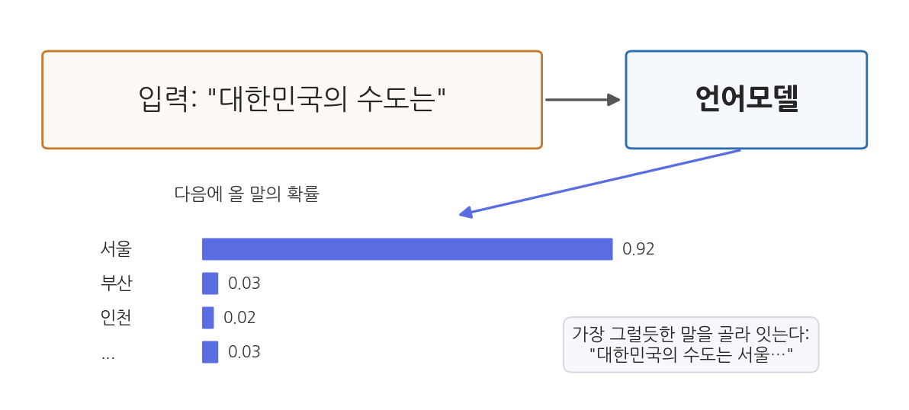
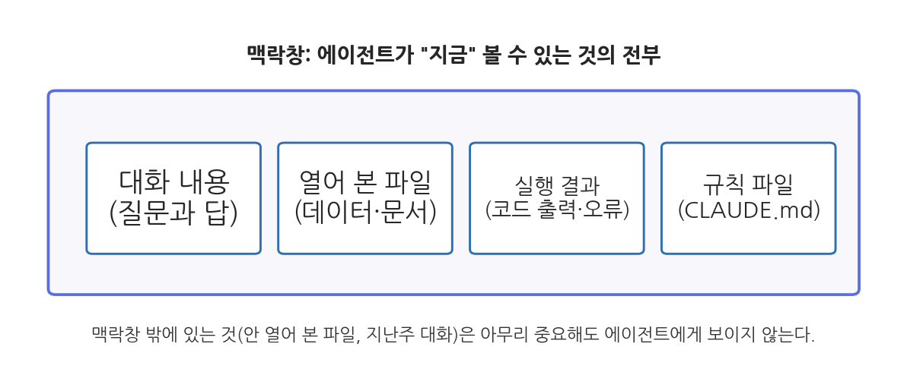
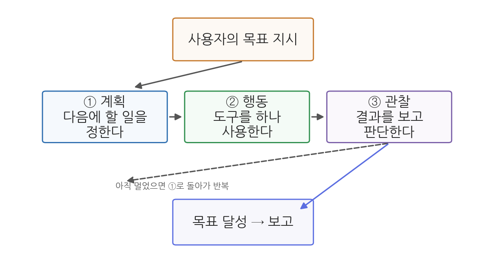
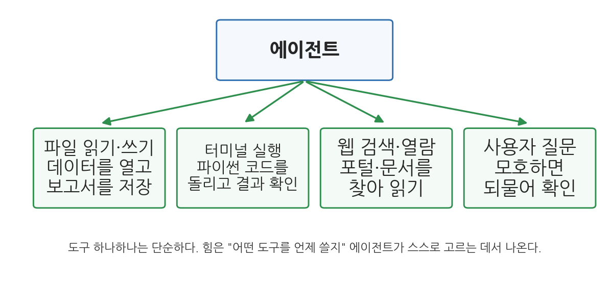
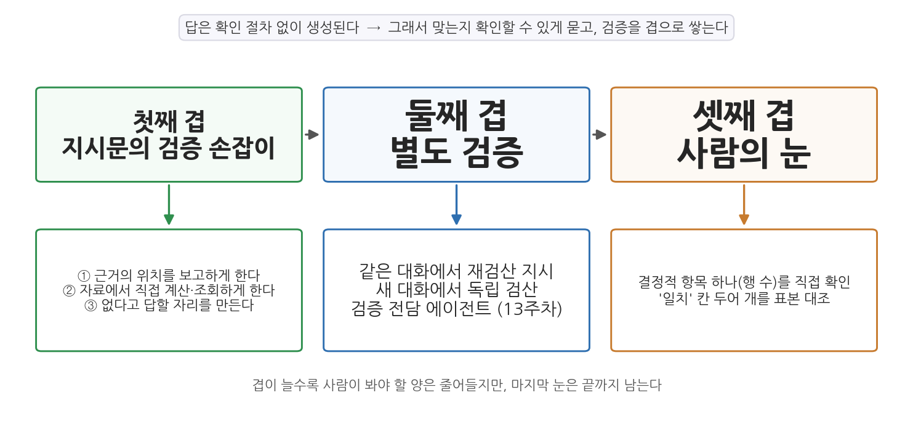
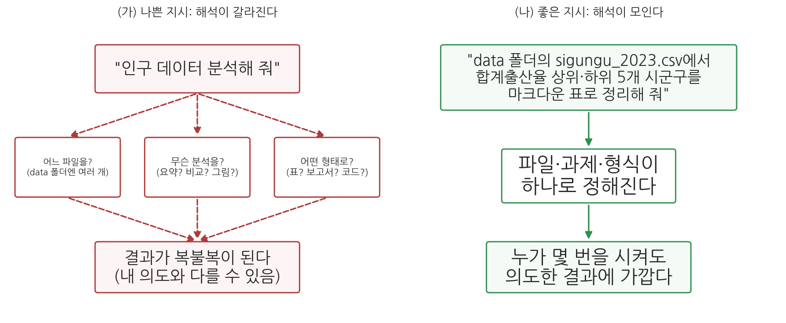
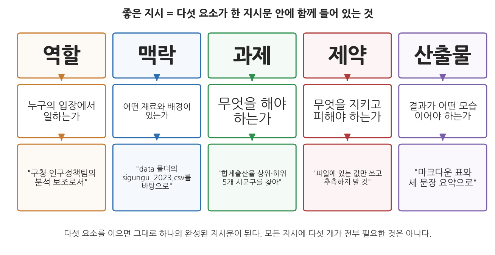
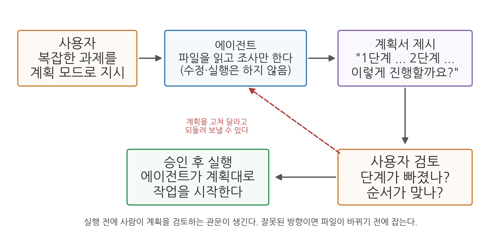
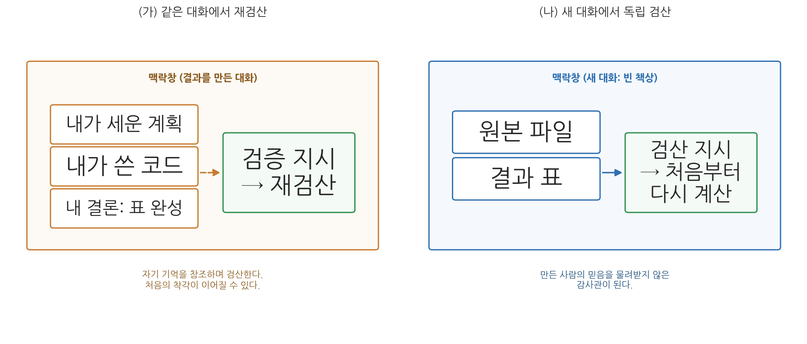

# 2주차 1회차. AI 에이전트의 작동 원리와 지시 설계

> 프로그램은 사람이 읽을 수 있도록 쓰여야 하며, 기계가 실행하는 것은 부차적이다.
> (해럴드 에이벌슨·제럴드 서스먼, 『컴퓨터 프로그램의 구조와 해석』)

## 이 장에서 배우는 것

1주차에 우리는 에이전트가 "행동하는 AI"라는 것을 배웠고, 실습에서 VSCode 안의 Claude Code와 첫 대화를 나누었다. 아마 두 가지 상반된 인상을 받았을 것이다. "생각보다 훨씬 잘한다"는 놀라움과 "가끔 이상한 소리를 자신 있게 한다"는 당혹감이다. 이 장의 앞부분은 그 두 인상을 모두 설명한다. 에이전트가 왜 잘하는지, 그리고 왜 이상해지는지는 같은 원리에서 나오기 때문이다. 자동차 정비사가 될 것이 아니어도 엔진의 원리를 알면 이상한 소리가 날 때 무엇을 의심할지 알 수 있듯이, 에이전트의 속을 한 번 들여다보면 언제 믿고 언제 의심할지 감이 잡힌다.

뒷부분은 그 원리를 지시문으로 옮긴다. 첫 출근한 인턴에게 과장이 "그거 좀 정리해 줘"라고만 말하고 자리를 뜬다면 어떻게 될까. 인턴은 "그거"가 무엇인지, "정리"가 파일 정돈인지 요약 보고인지, 언제까지 어떤 형태로 내야 하는지를 전부 혼자 짐작해야 한다. 운이 좋으면 과장이 원한 것이 나오고, 운이 나쁘면 하루를 통째로 버린다. 일이 잘못된 것은 인턴이 무능해서가 아니라 지시가 비어 있었기 때문이다. 에이전트에게 일을 시킬 때도 똑같은 일이 벌어진다. 1주차에서 배운 분석가의 세 역할(지시·검증·해석) 중 첫 번째인 지시는 타고난 말재주가 아니라 배울 수 있는 기술이며, AI 플루언시의 네 기둥 중 위임(무엇을 맡길지 정하기)과 기술(원하는 것을 명확히 설명하기)을 실제로 실행하는 방법이기도 하다. 그래서 이 장은 하나의 질문을 더 안고 간다. 같은 에이전트를 쓰는데 왜 어떤 사람은 원하는 결과를 얻고 어떤 사람은 얻지 못하는가.

이 장에서는 수식 없이, 예시만으로 다음을 이해한다.

- 언어모델(LLM)이 "다음에 올 말"을 예측하는 방식으로 글을 만든다는 것
- 맥락창이라는 작업 기억의 크기와 한계
- 에이전트가 계획 → 행동 → 관찰을 반복하는 루프로 일한다는 것과, 에이전트가 쓰는 도구들(파일, 터미널, 웹)의 의미
- 답이 확인 절차 없이 생성된다는 것, 그래서 검증 가능하게 묻는 법(검증 손잡이, 검증의 세 겹)
- 이 원리들에서 나오는 실천 수칙, 곧 "검증 가능한 단위로 맡기기"
- 챗봇 시대의 "프롬프트"와 에이전트 시대의 "지시 설계"가 어떻게 다른지, 그리고 프롬프트 엔지니어링 이후 유행처럼 쏟아지는 "○○ 엔지니어링" 용어들의 지형
- 좋은 지시를 이루는 다섯 요소: 역할, 맥락, 과제, 제약, 산출물
- 큰 일을 단계로 쪼개는 법과, 실행 전에 계획을 검토하는 계획 모드
- 에이전트에게 맥락(파일, 예시)을 건네는 방법: 경로 명시와 @멘션
- 매번 반복하는 규칙을 영구 고정하는 파일, CLAUDE.md
- 검증 절차를 지시문 안에 미리 심고, 검증 자체를 별도 작업으로 시키는 법

<strong>이 장의 로드맵</strong> 
이 장은 안쪽에서 바깥쪽으로 나아간 뒤, 그 원리를 지시문으로 옮긴다. <em>"말을 만드는 엔진(LLM)은 어떻게 작동하며, 그 엔진에 어떻게 일을 시켜야 원하는 결과를 얻는가?"</em>  
<strong>1.1</strong> 엔진과 작업 기억 (LLM, 맥락창) →
<strong>1.2</strong> 손발과 루프 (도구, 에이전트 루프) →
<strong>1.3</strong> 원칙: 맞는지 확인할 수 있게 묻는다 (검증 가능성) →
<strong>1.4</strong> 관점의 전환: 프롬프트에서 지시 설계로 →
<strong>1.5</strong> 좋은 지시의 다섯 요소 →
<strong>1.6</strong> 큰 일을 쪼개는 계획 모드와 맥락 제공 →
<strong>1.7</strong> CLAUDE.md와 검증을 내장한 지시.

## 1.1 LLM은 어떻게 말을 만드는가: 토큰, 확률, 맥락창

### 스마트폰 자동완성의 아주 거대한 버전

에이전트의 심장에는 대형 언어모델(LLM, large language model)이 있다. 거창한 이름이지만, 하는 일의 뼈대는 스마트폰 키보드의 자동완성과 닮았다. "안녕하"까지 치면 키보드가 "세요"를 제안한다. 수많은 입력 기록에서 "안녕하" 다음에 "세요"가 올 확률이 압도적으로 높다는 것을 학습했기 때문이다. LLM은 이 "다음 말 맞히기"를 상상하기 어려운 규모로 키운 것이다. 인터넷의 문서, 책, 코드 등 방대한 텍스트에서 "이런 말 뒤에는 이런 말이 온다"는 패턴을 학습한 결과, "대한민국의 수도는"이라는 입력을 받으면 다음에 올 말로 "서울"이 압도적으로 그럴듯하다고 계산해 낸다.

그림 2-1을 읽어 보자. 모델은 "대한민국의 수도는"이라는 입력을 받고, 다음에 올 수 있는 말 후보들에 확률을 매긴다. "서울"이 0.92로 압도적이고 "부산", "인천"은 미미하다. 모델은 이 중 가장 그럴듯한 말을 골라 문장에 잇고, 늘어난 문장을 다시 입력으로 삼아 그다음 말을 예측한다. 이 과정을 수백, 수천 번 반복하면 문단이 되고 보고서가 된다. 여기서 알 수 있는 것은, LLM이 만드는 긴 글이 사실은 "한 번에 한 조각씩" 이어 붙인 예측의 연쇄라는 점이다.

이때 말의 "조각"은 단어와 정확히 일치하지는 않는다. 모델은 텍스트를 토큰(token)이라는 단위로 쪼개어 다룬다. 짧은 단어는 토큰 하나, 긴 단어는 토큰 여러 개로 쪼개진다. 대략 "토큰은 단어보다 조금 작은 조각"이라고만 알아 두면 이 과목에서는 충분하다.

<strong>정의 · 대형 언어모델(LLM)과 토큰</strong> 
<strong>대형 언어모델</strong>(LLM)은 방대한 텍스트에서 말의 패턴을 학습하여, 주어진 글 다음에 올 말을 확률적으로 예측하는 방식으로 글을 생성하는 인공지능 모델이다. Claude, GPT, Gemini가 모두 LLM이다. 
<strong>토큰</strong>(token)은 모델이 텍스트를 다루는 최소 단위로, 단어보다 조금 작은 조각이다. 모델의 처리 용량과 비용은 토큰 수로 계산된다.

### 확률이라서 생기는 두 가지 성질

"다음 말을 확률로 예측한다"는 원리에서, 사용자가 꼭 알아야 할 두 가지 성질이 바로 따라 나온다.

**첫째, 답이 매번 조금씩 다르다(비결정성).** 계산기에 2+3을 넣으면 언제나 5가 나온다. 그러나 LLM에게 같은 질문을 두 번 하면 표현이, 때로는 내용까지 달라질 수 있다. 모델이 항상 확률 1등 후보만 고르는 것이 아니라 약간의 무작위성을 섞어 고르기 때문이다. 무작위성 덕분에 글이 다채로워지지만, 대신 "아까는 이렇게 답했는데 지금은 다르게 답하는" 일이 자연스럽게 생긴다. 다음 회차 실습 2.3절에서 같은 지시를 여러 번 보내 직접 확인해 본다.

**둘째, "그럴듯함"과 "옳음"은 다르다.** 모델이 최적화하는 것은 어디까지나 말의 그럴듯함이다. 세상 지식의 대부분에서는 그럴듯한 말이 옳은 말과 일치한다("수도는 서울"). 그러나 둘이 갈라지는 지점이 반드시 있고, 그 지점에서 확인할 수 없는 답이 태어난다. 1.3절에서 자세히 본다.

### 학습데이터의 그림자

LLM의 지식은 학습에 쓰인 텍스트에서 온다. 여기서 세 가지 한계가 나온다. 첫째, 지식의 마감일이 있다. 학습데이터가 어느 시점까지의 텍스트라면 그 뒤에 일어난 일(작년의 인구 통계, 지난달의 법 개정, 이번 달에 새로 나온 통계표)은 모델 안에 없다. 둘째, 텍스트가 적은 영역에서는 약하다. 영어 자료가 풍부한 주제에 비해, 한국의 특정 시군구 조례나 소규모 통계처럼 문서 자체가 드문 주제에서는 패턴 학습이 얕다. 공공데이터 분석은 바로 이 얕은 영역을 자주 건드린다. 셋째, 학습데이터의 편향이 스며든다. 데이터에 많이 등장한 관점이 "그럴듯한 답"이 되기 쉬우므로, 어떤 정책을 두고 의견이 갈리는 주제에서는 모델의 답이 특정 관점으로 기운 요약일 수 있다.

다행히 에이전트는 이 한계를 도구로 보완할 수 있다. 최신 통계가 필요하면 웹을 검색하거나 국가데이터처(옛 통계청)의 통계 포털에서 데이터를 받아 오면 되고(1.2절의 도구, 6주차의 MCP), 특정 문서에 근거해야 하면 그 문서를 직접 읽히면 된다(12주차의 그라운딩). 중요한 것은 "모델의 기억"과 "방금 확인한 사실"을 구별하는 감각이다. 이 감각이 1.3절의 검증 가능성으로 이어진다.

### 맥락창: 지금 책상 위에 놓인 것만 보인다

LLM에게는 사람의 장기 기억 같은 것이 없다. 대화를 하면 할수록 나를 알아 가는 친구를 기대하기 쉽지만, 실제 구조는 다르다. 모델이 답을 만들 때 참고할 수 있는 것은 맥락창(context window)이라 부르는 한정된 공간에 지금 들어 있는 내용뿐이다.

그림 2-2가 보여 주듯, 맥락창 안에는 지금까지의 대화 내용, 에이전트가 열어 본 파일, 코드 실행 결과, 그리고 규칙 파일(1.7절에서 배울 CLAUDE.md) 같은 것이 담긴다. 이 공간은 책상에 비유할 수 있다. 책상 위에 올려 둔 서류는 볼 수 있지만, 서랍이나 옆 방 캐비닛의 서류는 아무리 중요해도 보이지 않는다. 여기서 알 수 있는 것은 두 가지다.

첫째, **에이전트는 내 컴퓨터의 파일을 "다" 알고 있지 않다.** 폴더에 데이터 파일이 있어도, 에이전트가 그 파일을 열어 읽기 전에는 내용을 모른다. "분석해 줘"라고만 하고 어떤 파일인지 알려 주지 않으면, 에이전트는 먼저 폴더를 뒤져 파일을 찾는 일부터 해야 한다. 지시할 때 "data 폴더의 sigungu_2023.csv를 읽고"처럼 재료를 짚어 주는 것이 좋은 이유이며, 이것이 1.5절에서 다섯 요소의 하나로 다시 등장하는 맥락이다.

둘째, **대화가 아주 길어지면 앞부분이 잊힐 수 있다.** 맥락창은 유한하다. 긴 작업에서 대화가 한도에 가까워지면 오래된 내용부터 요약되거나 밀려난다. 학기 프로젝트처럼 여러 주에 걸친 작업에서 "지난번에 말했잖아"가 통하지 않는 이유이며, 중요한 규칙은 대화가 아니라 파일에 적어 두어야 하는 이유다. 그 파일이 1.7절의 CLAUDE.md다.

<strong>정의 · 맥락창</strong> 
<strong>맥락창</strong>(context window)은 모델이 답을 생성할 때 참고할 수 있는 텍스트의 최대 분량이다(토큰 수로 잰다). 대화, 읽은 파일, 실행 결과가 모두 이 안에 들어가야 하며, 맥락창 밖의 정보는 모델에게 존재하지 않는 것과 같다.

<strong>유의 · "말했으니 알겠지"라는 착각</strong> 
어제의 대화창을 닫고 오늘 새 대화를 열면, 에이전트는 어제의 내용을 전혀 모른다. 새 대화는 빈 책상에서 시작한다. 어제 정한 규칙("표는 항상 천 단위 쉼표로")을 오늘도 지키게 하려면, 다시 말해 주거나 CLAUDE.md에 적어 두어야 한다. 이 착각은 초보자가 가장 자주 겪는 혼란이므로 미리 알아 두자.

## 1.2 에이전트 루프와 도구 사용

### 엔진에 손발을 달면 에이전트가 된다

여기까지의 LLM은 아직 "말을 만드는 엔진"일 뿐이다. 이 엔진이 어떻게 파일을 읽고 코드를 돌리는 에이전트가 되는가. 답은 의외로 단순하다. 모델에게 도구 사용권을 주고, 목표가 달성될 때까지 같은 순환을 반복시키는 것이다. 이 순환을 에이전트 루프(agent loop)라 부른다.

그림 2-3의 순환을 하나씩 보자. 사용자의 목표 지시를 받으면 에이전트는 ① 계획 단계에서 "다음에 할 일 하나"를 정한다("먼저 데이터 파일을 열어 봐야겠다"). ② 행동 단계에서 도구를 하나 사용한다(파일 읽기). ③ 관찰 단계에서 도구가 돌려준 결과를 보고 판단한다("열 이름이 예상과 다르네. 계획을 수정하자"). 목표에 이르지 못했으면 ①로 돌아가고, 이르렀으면 사용자에게 보고한다. 여기서 알 수 있는 것은 에이전트와 챗봇의 차이가 모델의 크기가 아니라 이 순환의 유무에 있다는 점이다.

### 실제 예: 평균 하나를 구하는 데 다섯 걸음

"data 폴더의 sigungu_2023.csv에서 시군구별 고령인구비율의 평균을 구해 줘"라는 지시를 받은 에이전트의 속마음을 재구성하면 대략 이렇다.

1. (계획) 파일이 실제로 있는지, 구조가 어떤지부터 봐야겠다. → (행동) data 폴더의 파일 목록을 조회 → (관찰) sigungu_2023.csv가 있다.
2. (계획) 파일의 앞부분을 읽어 열 이름을 확인하자. → (행동) 파일 앞 몇 줄 읽기 → (관찰) "고령인구비율"이라는 열이 있고, 값은 숫자로 보인다.
3. (계획) pandas로 평균을 내는 코드를 짜서 실행하자. → (행동) 터미널에서 파이썬 코드 실행 → (관찰) 오류 발생. 한글 인코딩 문제로 파일을 못 읽었다.
4. (계획) 인코딩 옵션을 바꿔 다시 시도하자. → (행동) 수정한 코드 실행 → (관찰) 평균 24.98이 출력되었다.
5. (계획) 목표 달성. 결과를 보고하자. → "전국 229개 시군구의 고령인구비율 평균은 약 25.0%입니다."

주목할 점이 세 가지다. 첫째, 에이전트는 큰 목표를 잘게 쪼개 한 걸음씩 나아간다. 사람이 "평균을 구하라"는 한 문장으로 떠올리는 일이 실제로는 목록 조회, 열 확인, 코드 작성, 실행, 재시도의 다섯 걸음으로 풀린다. 둘째, 3번 걸음처럼 실패가 일어나도 관찰 단계에서 이를 인지하고 계획을 수정한다. 오류가 났다고 멈추거나 사용자에게 떠넘기지 않고 스스로 재시도하는 것, 이것이 에이전트의 실용적 가치의 큰 부분이다. 셋째, 그럼에도 각 걸음은 여전히 LLM의 "다음 말 예측"이다. 계획도, 코드도, 판단도 결국은 확률적으로 생성된 텍스트이므로, 1.1절의 한계(비결정성, 확인 절차 없는 생성)가 루프의 매 걸음에 스며 있다. 걸음이 늘어날수록 어딘가에서 어긋날 기회도 함께 늘어난다는 뜻이며, 그래서 1.3절의 "검증 가능한 단위로 맡기기"가 필요해진다.

<strong>정의 · 에이전트 루프</strong> 
<strong>에이전트 루프</strong>(agent loop)는 에이전트가 목표를 이룰 때까지 반복하는 "계획 수립 → 도구 사용(행동) → 결과 관찰"의 순환이다. 사람의 개입 없이 여러 걸음을 이어 갈 수 있다는 점이 에이전트를 챗봇과 구별 짓는 핵심 구조다.

### 루프를 지켜보는 사람의 자리

1주차 실습에서 보았듯, Claude Code는 이 루프를 화면에 그대로 보여 준다. 어떤 파일을 읽었는지, 무슨 명령을 실행하려 하는지, 결과가 무엇이었는지가 대화창에 차례로 나타난다. 위험할 수 있는 행동(파일 삭제, 프로그램 설치)의 앞에서는 멈추어 사용자의 승인을 구한다. 이것이 권한(permission) 절차다. 루프가 투명하게 공개되고 중요한 길목마다 사람의 승인이 끼어드는 구조, 이것이 "에이전트에게 일을 맡기되 통제를 잃지 않는" 장치다. 승인 버튼은 형식적인 절차가 아니라 사람이 루프에 들어가 앉는 자리이므로, 무엇을 하겠다는 것인지 읽지 않고 누르는 습관이 들면 이 장치가 사실상 사라진다. 다음 회차 실습 2.1절에서 요약 작업을 시켜 놓고 이 도구 호출 로그를 읽는 연습을 하고, 2.3절에서 권한 모드를 다룬다.

### 네 가지 기본 도구

그림 2-4는 Claude Code 같은 에이전트가 쓰는 대표적 도구들이다. 하나씩 뜯어 보면 어느 것도 신비롭지 않다.

- **파일 읽기·쓰기.** 폴더 안의 파일을 열어 내용을 맥락창에 담고(읽기), 새 파일을 만들거나 고친다(쓰기). 데이터를 읽고 보고서를 저장하는 일의 기초다.
- **터미널 실행.** 컴퓨터에 명령을 내리는 문자 기반 창구인 터미널에서 명령을 실행한다. 파이썬 코드 실행, 프로그램 설치가 모두 이 도구로 이루어진다. 터미널 자체는 3주차에서 차분히 배운다.
- **웹 검색·열람.** 인터넷을 검색하고 웹페이지를 읽는다. 모델의 지식 마감일 이후의 정보, 학습데이터에 없는 좁은 정보를 보완한다.
- **사용자 질문.** 지시가 모호할 때 되묻는다. 이것도 도구다. 좋은 에이전트는 짐작으로 내달리기 전에 확인한다.

도구 하나하나는 단순하지만, 그림 2-4의 요점은 아래쪽 문장에 있다. 힘은 개별 도구가 아니라 "어떤 도구를 언제 쓸지"를 에이전트가 상황에 맞게 스스로 고르는 데서 나온다. 열 이름이 궁금하면 파일을 읽고, 계산이 필요하면 터미널을 열고, 최신 수치가 필요하면 웹을 검색한다. 이 선택 능력이 루프와 결합할 때 "어린이집 현황을 분석해 줘" 같은 큰 목표가 수십 걸음의 작은 행동으로 풀려 나간다. 6주차에서 배울 MCP는 이 도구 상자에 통계 포털 조회 같은 외부 도구를 더 꽂아 주는 장치다.

### 도구는 검증의 발판이기도 하다

도구 사용에는 사용자에게 중요한 부수 효과가 있다. 행동의 흔적이 남는다는 것이다. 챗봇의 답변은 머릿속에서 나와 근거를 확인할 수 없지만, 에이전트의 결과물 뒤에는 읽은 파일, 실행한 코드, 그 코드의 출력이 로그로 남는다. "평균이 25.0%"라는 보고가 미덥지 않으면, 에이전트가 실행한 코드를 열어 어느 열로 계산했는지 볼 수 있다. 코드가 남아 있으므로 같은 계산을 한 번 더 돌려 볼 수도 있고, 다른 사람에게 "이렇게 계산했다"고 보일 수도 있다. 1주차에서 말한 검증이 가능해지는 것은 바로 이 흔적 덕분이며, 다음 절은 이 흔적을 처음부터 남기게 만드는 방법을 다룬다.

## 1.3 검증 가능성: 맞는지 확인할 수 있게 묻는다

### 확인 절차가 없는 답

1.1절의 원리를 한 번 더 따라가 보자. 모델은 "다음에 올 그럴듯한 말"을 만들 뿐, 답을 내놓기 전에 어딘가를 조회해 확인하는 절차가 없다. 에이전트에게 "의성군의 2023년 고령인구비율을 알려 줘"라고 도구 없이 물으면, 모델은 학습데이터에 남은 패턴에서 가장 그럴듯한 숫자를 생성한다. 그 숫자는 맞을 수도 틀릴 수도 있는데, 문제는 어느 쪽인지를 답변 자체로는 알 수 없다는 점이다. 자릿수도 말투도 완벽하게 자연스럽기 때문이다.

이 현상에는 환각(hallucination)이라는 이름이 붙어 있다. AI가 사실이 아닌 내용을 사실처럼 자신 있게 말하는 일을 가리키는 말인데, 최근 모델들은 모르는 것을 지어내는 일이 크게 줄었고 "확실하지 않다"고 답하는 경우도 많아졌다. 그런데 이 교재가 붙드는 문제는 모델이 얼마나 자주 틀리는가가 아니다. 틀리는 빈도는 모델이 바뀔 때마다 달라지고, 우리가 어찌할 수 없는 변수다. 우리 손에 있는 변수는 따로 있다. 답을 받았을 때 맞는지 확인할 수 있는가, 곧 검증 가능성이다. 확인 절차가 없는 답은 정답이어도 정답임을 보일 수 없다. 그 숫자를 보고서에 옮겨 적는 순간, 근거는 "AI가 그렇게 말했다"는 말뿐이다.

<strong>정의 · 검증 가능성</strong> 
<strong>검증 가능성</strong>(verifiability)은 에이전트의 답이 맞는지 사람이 독립적으로 확인할 수 있는 정도다. 답과 함께 근거의 위치(파일·행·출처), 계산 경로, 확인 방법이 제시되어 있을수록 검증 가능성이 높다. 이 교재의 기본 원칙은 검증 가능한 답을 받도록 처음부터 묻는 것이다.

### 확인 없이 받아들이기 어려운 질문

검증 손잡이가 없는 질문이라고 모두 같은 정도로 위험한 것은 아니다. "평균과 중앙값의 차이를 설명해 줘" 같은 개념 설명은 교과서에 널려 있는 내용이라 그럴듯한 답과 옳은 답이 거의 겹친다. 반면 다음 세 곳은 특히 확인 절차 없이는 답을 받아들이기 어렵다.

- **구체적인 숫자와 고유명사.** 특정 연도·지역의 통계값, 법 조항 번호, 논문 제목과 저자. 경향은 맞아도 정확한 값이 어긋나기 쉽고, 어긋나도 티가 나지 않는다.
- **자료가 드문 좁은 주제.** 전국 통계보다 읍면동 통계, 유명한 법률보다 지자체 조례. 학습데이터에 관련 텍스트가 적을수록 생성된 답을 대조할 기준이 필요하다.
- **존재 여부가 불확실한 자료.** 있는지 없는지부터 확인해야 하는 통계나 문서. "없다"는 답과 그럴듯한 답을 가려낼 방법이 지시 안에 있어야 한다.

세 곳의 공통점은 답의 옳고 그름이 겉모습에 드러나지 않는다는 것이다. 그래서 대응도 겉모습을 의심하는 쪽이 아니라, 확인할 방법을 미리 마련하는 쪽이어야 한다. 공공데이터 분석의 재료는 대부분 이 세 곳에 걸쳐 있다는 점도 기억해 두자. 우리가 다루는 것은 대개 특정 연도의 특정 시군구 숫자이고, 그 숫자는 보고서에 그대로 실린다.

### 검증 손잡이를 지시문에 단다

에이전트는 챗봇보다 확인 수단이 많다. 1.2절에서 보았듯 파일을 읽고, 코드를 돌리고, 외부 시스템을 조회할 수 있다. 그러니 원리는 하나다. **기억에서 답하게 두지 말고, 확인하게 시키고, 확인한 흔적을 함께 내놓게 한다.** 이 교재는 이를 지시문에 검증 손잡이를 단다고 부른다. 결과를 받아 든 사람이 붙잡고 따라갈 수 있는 손잡이라는 뜻이다. 기본형은 세 가지다.

첫째, **근거의 위치를 함께 보고하게 한다.** "의성군 고령인구비율을 알려 줘" 대신 "data 폴더의 sigungu_2023.csv에서 의성군을 찾아 고령인구비율을 알려 주고, 몇 번째 행의 어느 열에서 찾았는지도 밝혀 줘"라고 쓴다. 답에 행 번호가 붙어 오면, 파일을 열어 그 행으로 가서 대조하는 데 몇 초면 된다.

둘째, **자료에서 직접 계산하거나 조회하게 한다.** 통계값을 물어보는 대신 데이터 파일을 주고 그 파일에서 계산하게 하면, 결과는 코드와 함께 남고 코드는 다시 실행해 볼 수 있다. 6주차에서 배울 MCP는 통계 포털을 직접 조회하는 도구를 더해 주어 같은 효과를 낸다.

셋째, **모르면 없다고 답할 자리를 만든다.** "파일에 없는 값을 물으면 없다고 답하고, 추측으로 채우지 마"라는 한 줄이다. 확인 절차 없이 생성되는 답에는 원래 "모른다"가 설 자리가 없다. 그 자리를 지시문이 미리 만들어 준다.

### 검증의 세 겹

손잡이는 첫 번째 겹이다. 이 교재는 검증을 세 겹으로 쌓는다.

그림 2-5를 왼쪽부터 읽어 보자. 첫째 겹은 방금 본 손잡이로, 지시문 안에 심는 장치다. 둘째 겹은 검증 자체를 하나의 일로 시키는 것이다. 결과를 받은 뒤 "방금 만든 표를 원자료에서 처음부터 다시 계산해 대조하고, 차이가 있으면 보고해 줘"라고 따로 지시할 수도 있고, 결과를 만든 대화가 아닌 새 대화나 검증만 맡는 별도의 에이전트에게 원자료와 결과만 주고 검산시킬 수도 있다. 셋째 겹은 사람의 눈이다. 행 수처럼 결정적인 항목 하나와 표본 몇 칸을 직접 대조한다. 여기서 알 수 있는 것은 겹이 늘수록 사람이 봐야 할 양은 줄어들지만 마지막 눈은 끝까지 남는다는 점이다. 데이터 파일을 줘도 엉뚱한 열을 읽고 계산하거나, 계산은 맞게 해 놓고 해석 문장에서 숫자를 잘못 옮겨 적는 일이 있기 때문이다. 손잡이와 별도 검증은 검증을 대신하는 것이 아니라 검증을 가능하게 만드는 것이며, 1주차에서 말한 분별이 마지막 겹에서 작동한다.

세 겹은 이 교재 전체에 걸쳐 조금씩 두꺼워진다. 첫째 겹은 1.7절에서 성공 기준 명시와 이상 상황 보고까지 더한 다섯 손잡이로 확장되고, 둘째 겹은 1.7절에서 지시의 형태로, 13주차에서 검증 전담 서브에이전트의 형태로 배운다. 12주차에서는 문서에 근거해 인용과 함께 답하게 하는 그라운딩으로 발전한다. 다음 회차 실습 2.2절에서는 같은 질문을 손잡이 없이, 그리고 손잡이를 달아 물어 두 답의 차이를 직접 확인한다.

<strong>왜 "틀리지 않는 모델"보다 "확인할 수 있는 지시"인가?</strong> 
모델의 정확도는 세대마다 오르내리고, 사용자는 그것을 통제할 수 없다. 반면 지시문에 근거 요구와 확인 경로를 넣는 일은 전적으로 사용자의 손에 있다. 공공부문에서는 이 차이가 더 무겁다. 보고서의 숫자는 "이 숫자를 어떻게 얻었는가"라는 질문에 답할 수 있어야 하고, 그 답은 "모델이 정확하다"가 아니라 "이 파일의 이 행에서, 이 명령으로 확인했다"여야 한다. 검증 가능성은 모델의 성능이 아니라 <strong>일하는 방식</strong>의 문제이며, 그래서 배울 수 있고 습관으로 만들 수 있다.

### 신뢰의 원칙: 검증 가능한 단위로 일을 맡긴다

여기까지 본 원리들을 한 줄씩 실천 수칙으로 바꾸면 이 과목의 작업 방식이 된다.

**표 2-1. 원리에서 수칙으로**

| 원리 (이 장에서 배운 것) | 실천 수칙 |
|------|------|
| 답은 확률적 예측이라 매번 다를 수 있다 (1.1) | 중요한 결과는 재현 가능하게 만든다. 말로 받은 답이 아니라 코드와 데이터로 남긴다 |
| 맥락창 밖은 보이지 않는다 (1.1) | 재료(파일, 기준, 규칙)를 지시에 명시한다. 오래 쓸 규칙은 파일로 고정한다 |
| 루프의 매 걸음이 생성이다 (1.2) | 큰일은 잘게 나눠 맡기고, 걸음마다 중간 결과를 확인한다 |
| 행동은 흔적을 남긴다 (1.2) | 로그와 코드를 열어 보는 습관을 들인다. 승인 요청을 습관적으로 누르지 않는다 |
| 그럴듯함과 옳음은 다르다 (1.3) | 기억이 아니라 출처에서 답하게 시킨다. 숫자는 데이터에서 계산시킨다 |

이를 관통하는 한 문장이 이 과목의 표어다. **에이전트에게는 "검증 가능한 단위"로 일을 맡긴다.** 한 번에 "보고서 다 써 줘"라고 맡기면 어디가 틀렸는지 찾기 어렵다. "데이터를 읽고 요약표를 만들어 줘 → (확인) → 이 표로 그래프를 그려 줘 → (확인) → 그래프를 해석하는 문단을 써 줘 → (확인)"처럼 나누어 맡기면, 각 단계의 산출물을 눈으로 확인하며 나아갈 수 있다. 카파시가 "짧은 목줄(short leash)"이라 부른 작업 방식이다. 익숙해지고 작업이 단순해지면 목줄을 조금씩 늘려도 되며, 그 조절 감각이 1주차에서 말한 자율성 조절이다. 표 2-1의 오른쪽 칸을 다시 보면 수칙의 대부분이 결국 "지시를 어떻게 쓰는가"의 문제라는 것을 알 수 있다. 그래서 이 장의 나머지 절은 지시문 자체를 다룬다.

## 1.4 프롬프트 엔지니어링에서 지시 설계로

### "마법의 주문"을 찾던 시대

챗봇에 입력하는 글을 프롬프트(prompt)라 부른다. 챗봇이 널리 퍼지면서 "프롬프트를 잘 쓰는 요령"도 함께 유행했다. "단계별로 생각해 보세요"라고 덧붙이면 답이 좋아진다더라, 전문가인 척 시키면 더 잘한다더라 하는 식이다. 이런 요령을 모아 프롬프트 엔지니어링(prompt engineering)이라 불렀다. 마치 정답 주문이 어딘가에 있고, 그것을 찾아내면 되는 것처럼 들리던 시절이다.

이런 요령이 무의미한 것은 아니다. 그러나 챗봇 시대의 프롬프트는 기본적으로 한 번의 질문이었다. 질문 하나를 던지고 답 하나를 받는 구조에서는 "질문 문장을 어떻게 다듬을까"가 고민의 전부였다.

### 에이전트에게 건네는 것은 질문이 아니라 업무다

에이전트는 다르다. 1.2절에서 본 것처럼 에이전트는 지시 하나를 받으면 계획을 세우고, 도구를 쓰고, 결과를 확인하는 루프를 여러 바퀴 돈다. 파일을 열고, 명령을 실행하고, 새 파일을 만든다. 즉 여러분이 건네는 것은 질문 한 개가 아니라 업무 한 건이다. 업무를 맡길 때 필요한 것은 문장 다듬기 요령이 아니라, 신입 직원에게 일을 시킬 때와 같은 업무 설계다. 무엇을(과제), 무엇으로(맥락), 어떤 조건에서(제약), 어떤 형태로(산출물) 해야 하는지를 정하는 일이다. 이 교재는 이것을 지시 설계라 부른다.

<strong>정의 · 프롬프트와 지시 설계</strong> 
<strong>프롬프트</strong>(prompt)는 AI에 입력하는 글 전체를 가리키는 일반 용어다. 
<strong>지시 설계</strong>(instruction design)는 에이전트에게 맡길 업무를 설계하는 일이다. 문장을 예쁘게 쓰는 것이 아니라, 에이전트가 스스로 짐작해야 할 빈칸을 줄이도록 업무의 내용·재료·조건·완성 기준을 정해 주는 것이 핵심이다.

### 쏟아지는 "엔지니어링"들: 이름은 달라도 같은 질문이다

프롬프트 엔지니어링은 시작일 뿐이었다. 그 뒤로 업계에서는 비슷한 조어가 유행처럼 잇달아 만들어지고 있다. 모델의 맥락창에 무엇을 넣고 무엇을 뺄지를 설계하자는 컨텍스트 엔지니어링(context engineering), 에이전트를 감싸는 작업 환경(규칙·절차·도구) 전체를 설계하자는 하네스 엔지니어링(harness engineering), 에이전트가 도는 계획-행동-관찰의 순환이 스스로 굴러가도록 설계하자는 루프 엔지니어링(loop engineering), 그리고 최근에는 여러 에이전트와 작업 단계를 점과 연결선의 그래프로 잇는 흐름을 설계하자는 그래프 엔지니어링(graph engineering)이라는 말까지 등장했다. 표 2-2가 이 용어들의 지형이다.

**표 2-2. 프롬프트 엔지니어링 이후의 "엔지니어링"들과 이 교재의 배치**

| 용어 | 설계하려는 것 | 이 교재에서 배우는 곳 |
|------|------|------|
| 프롬프트 엔지니어링 | 모델에 입력하는 문장 | 이 장 1.4-1.5(지시 설계로 확장) |
| 컨텍스트 엔지니어링 | 맥락창에 들어가는 재료 전체 | 이 장 1.1(맥락창)과 1.6-1.7(맥락 제공·CLAUDE.md), 4-5주차(Skill), 12주차(그라운딩·RAG), 13주차(서브에이전트) |
| 하네스 엔지니어링 | 에이전트를 감싸는 작업 환경 | 이 장 1.7(CLAUDE.md), 4-5주차(Skill), 6주차(MCP), 13주차(서브에이전트·검문소) |
| 루프 엔지니어링 | 계획-행동-관찰 순환의 굴러가는 방식 | 이 장 1.2(에이전트 루프)와 1.7(검증 내장), 13주차(파이프라인·재현성) |
| 그래프 엔지니어링 | 여러 에이전트·단계를 잇는 작업 흐름 | 13주차(파이프라인 설계)와 닿아 있음 |

이 표를 미리 보여 주는 이유는 두 가지다. 첫째, 이 용어들은 엄밀히 구분되는 학술 분류가 아니다. 서로 겹치고 경계가 흐리다. 예컨대 1.7절에서 배울 CLAUDE.md에 프로젝트 규칙을 적는 일은 맥락창에 재료를 넣는 일이므로 컨텍스트 엔지니어링이고, 동시에 에이전트의 작업 환경을 만드는 일이므로 하네스 엔지니어링이기도 하다. 4주차에서 배울 Skill도 마찬가지여서, 자주 쓰는 절차를 파일로 고정해 작업 환경을 만든다는 점에서는 하네스 엔지니어링이지만 그 파일이 결국 맥락창에 실려 읽힌다는 점에서는 컨텍스트 엔지니어링이다. 새 이름이 나올 때마다 새 학문이 생기는 것이 아니라, "AI에게 일을 잘 시키려면 무엇을 설계해야 하는가"라는 같은 질문의 강조점이 문장에서 재료로, 환경으로, 순환으로, 흐름으로 옮겨 다니며 유행하는 것이다.

둘째, 그래서 이 교재는 유행어를 목차의 축으로 삼지 않았다. 표의 오른쪽 칸이 보여 주듯, 각 용어의 알맹이는 그것이 실제로 필요해지는 자리에 흩어 배치되어 있다. 학기를 마칠 때쯤 여러분은 어떤 새 "엔지니어링"을 만나든 "이번에는 무엇을 설계하자는 이야기인가"로 번역해 들을 수 있게 된다. 그 첫걸음이 이 장의 지시 설계다. 이제 본론으로 돌아가자.

## 1.5 좋은 지시의 다섯 요소: 역할, 맥락, 과제, 제약, 산출물

### 나쁜 지시는 빈칸을 에이전트에게 떠넘긴다

지시 설계의 핵심이 빈칸 줄이기라고 했다. 왜 빈칸이 문제인가. 그림 2-6을 보자.

왼쪽(가)의 "인구 데이터 분석해 줘"라는 지시에는 빈칸이 세 개나 있다. 어느 파일인지, 무슨 분석인지, 어떤 형태로 내놓을지가 모두 비어 있다. 에이전트는 이 빈칸을 스스로 메워야 하는데, 1.1절에서 배웠듯 LLM의 출력에는 비결정성이 있어서 빈칸을 메우는 방식이 매번 달라질 수 있다. 오늘은 표가 나오고 내일은 긴 보고서가 나온다. 결과가 복불복이 되는 것이다. 오른쪽(나)처럼 파일·과제·형식을 지시문 안에서 정해 주면 에이전트의 해석이 한 곳으로 모이고, 누가 몇 번을 시켜도 의도한 결과에 가까워진다.

여기서 알 수 있는 것은 비결정성 자체는 없앨 수 없지만, 지시가 구체적일수록 그것이 결과에 미치는 영향은 줄어든다는 점이다. 다음 회차 실습 2.3절에서 이 원리를 직접 확인한다. "흥미로운 사실 세 가지를 골라 줘" 같은 열린 지시는 여러 번 보낼 때마다 고르는 사실이 달라지지만, "총인구가 가장 많은 시군구 1곳"처럼 닫힌 지시는 표현만 다를 뿐 내용이 같다. 같은 모델, 같은 데이터인데 결과의 안정성이 달라지는 원인은 모델이 아니라 지시에 있다.

한 가지 균형을 잡아 두자. 모든 지시가 빈틈없이 촘촘해야 하는 것은 아니다. "이 데이터에서 눈에 띄는 점을 자유롭게 말해 봐"처럼 일부러 열어 두는 지시가 유용한 순간도 있다(9주차의 탐색적 분석이 그렇다). 문제는 여는 것 자체가 아니라, 닫아야 할 것(파일, 기준, 형식)을 무심코 열어 두는 것이다.

### 다섯 개의 질문에 답한다

그러면 지시문에 무엇을 담아야 하는가. 다섯 개의 질문에 답하면 된다. 그림 2-7이 그 다섯 요소다.

그림 2-7의 다섯 칸은 각각 하나의 질문에 대응한다. 누구로서(역할), 무엇을 가지고(맥락), 무엇을(과제), 무엇을 지키며(제약), 어떤 모습으로(산출물) 일할 것인가다. 여기서 알 수 있는 것은 다섯 요소가 문서 서식이 아니라 점검 목록이라는 점이다. 표 2-3은 각 요소가 답하는 질문과 예시 문구다.

**표 2-3. 다섯 요소와 각 요소가 답하는 질문**

| 요소 | 답하는 질문 | 예시 문구 |
|------|------|------|
| 역할 | 누구의 입장에서 일하는가 | "구청 인구정책팀의 분석 보조로서" |
| 맥락 | 어떤 재료와 배경이 있는가 | "data 폴더의 sigungu_2023.csv를 바탕으로" |
| 과제 | 무엇을 해야 하는가 | "합계출산율 상위·하위 5개 시군구를 찾아" |
| 제약 | 무엇을 지키고 피해야 하는가 | "파일에 있는 값만 쓰고 추측하지 말 것" |
| 산출물 | 결과가 어떤 모습이어야 하는가 | "마크다운 표와 세 문장 요약으로" |

하나씩 보자.

### 역할: 눈높이와 관점을 정한다

역할은 에이전트에게 "누구로서" 일할지를 알려 준다. 같은 데이터를 요약해도 "통계학 교수로서"와 "중학생 눈높이의 설명자로서"는 결과의 어휘와 깊이가 달라진다. 공공데이터 분석에서는 "구청 인구정책팀의 분석 보조", "시의회 보고서를 준비하는 연구원"처럼 업무 상황을 담은 역할이 유용하다. 역할이 정해지면 에이전트는 어떤 어휘로, 얼마나 신중하게, 무엇을 중요하게 다룰지의 기본값을 잡는다.

<strong>왜 역할 한 줄이 결과를 바꾸는가?</strong> 
1.1절에서 LLM은 "다음에 올 말"을 확률로 고른다고 배웠다. 앞에 어떤 글이 있느냐에 따라 다음 말의 확률 분포가 달라진다. "구청 인구정책팀의 분석 보조로서"라는 문구가 앞에 있으면, 그 뒤에 이어질 말로는 행정 실무의 어휘와 신중한 표현이 확률적으로 더 자주 뽑힌다. 역할 지정은 마법이 아니라, 확률 분포를 원하는 방향으로 기울이는 장치다. 같은 원리로, 지시문에 담긴 모든 단어가 조금씩 결과를 기울인다. 지시문을 "에이전트가 이어 쓸 글의 첫머리"라고 생각하면 왜 표현 하나하나가 중요한지 이해된다.

### 맥락: 재료와 배경을 건넨다

맥락은 두 가지다. 첫째는 재료, 곧 어떤 파일·데이터를 쓸 것인지다. 1.1절에서 배운 맥락창을 떠올리자. 에이전트는 내 컴퓨터의 폴더를 전부 자동으로 아는 것이 아니라, 열어 본 것만 안다. "인구 데이터"라고 말하면 에이전트가 어느 파일을 열지 알 수 없지만, "data 폴더의 sigungu_2023.csv"라고 말하면 정확히 그 파일을 연다. 둘째는 배경, 곧 이 일이 왜 필요한지다. "다음 주 팀 회의에서 저출산 대응 예산을 논의하는 데 참고할 자료다"라는 한 문장이 들어가면, 에이전트는 어떤 지표를 앞세울지, 어느 수준으로 요약할지를 훨씬 잘 잡는다. 맥락을 건네는 구체적 방법(@멘션 등)은 1.6절에서 따로 다룬다.

### 과제: 동사로, 확인 가능하게

과제는 지시의 몸통이다. 요령은 두 가지다. 첫째, 뭉뚱그린 명사("분석", "정리")가 아니라 구체적 동사로 쓴다. "찾아라", "세어라", "비교해라", "표로 만들어라". 둘째, 했는지 안 했는지 확인할 수 있게 쓴다. "출산율을 분석해 줘"는 완료 여부를 판정할 수 없지만, "합계출산율 상위 5개와 하위 5개 시군구를 찾아 값과 함께 표로 만들어 줘"는 표가 나왔는지, 10곳이 다 있는지로 판정할 수 있다. 과제를 확인 가능하게 쓰는 습관은 1.7절의 검증 내장으로 자연스럽게 이어진다.

### 제약: 하지 말 것과 지킬 것

제약은 에이전트가 벗어나기 쉬운 길목에 미리 세우는 표지판이다. 공공데이터 분석에서 자주 쓰는 제약은 이런 것들이다.

- **출처 제약.** "파일에 있는 값만 사용하고, 파일에 없는 숫자는 지어내지 말 것." 1.3절에서 본 "확인 절차 없이 생성되는 답"을 지시 단계에서 막는 가장 직접적인 방법이다.
- **범위 제약.** "수도권(서울·경기·인천)만 대상으로 할 것." 범위를 정하지 않으면 에이전트가 임의로 정한다.
- **행동 제약.** "data 폴더의 원본 파일은 수정하지 말 것." 되돌리기 어려운 행동을 막는다.
- **방법 제약.** "웹 검색은 하지 말 것" 또는 반대로 "반드시 출처 확인 후 답할 것".

### 산출물: 완성된 모습을 그려 준다

마지막으로, 결과가 어떤 모습이어야 하는지를 말한다. 형식(마크다운 표, 줄글 요약, 별도 파일), 분량(세 문장, 반 쪽), 저장 위치(산출물 폴더에 파일로), 언어(한국어)가 여기에 든다. 산출물을 지정하지 않으면 한 번은 표로, 한 번은 줄글로 나온다. 특히 "파일로 저장해 줘"와 "대화창에 보여 줘"는 이후 작업의 흐름을 완전히 바꾸므로 꼭 구분해 말한다. 대화창의 표는 대화창을 닫으면 사라지지만, 파일로 저장된 표는 다음 단계의 재료가 되고 검증의 대상으로 남는다.

### 다섯 요소를 조립하면 지시문이 된다

표 2-3의 예시 문구를 그대로 이으면 이렇게 된다.

> "구청 인구정책팀의 분석 보조로서, data 폴더의 sigungu_2023.csv를 바탕으로 합계출산율 상위 5개와 하위 5개 시군구를 찾아 줘. 파일에 있는 값만 쓰고 추측하지 말고, 결과는 마크다운 표와 세 문장 요약으로 정리해 줘."

특별한 양식 없이 자연스러운 한국어 두 문장이다. 다섯 요소는 문서 서식이 아니라 점검 목록이다. 지시문을 쓰고 나서 "역할·맥락·과제·제약·산출물 중 빠진 것이 있나, 빠졌다면 일부러 뺀 것인가"를 스스로 물어보는 용도로 쓴다. 다음 회차 실습 2.4절에서 같은 과제를 나쁜 지시와 좋은 지시로 각각 시켜 결과를 비교한다.

<strong>유의 · 다섯 요소가 언제나 전부 필요한 것은 아니다</strong> 
"data 폴더에 어떤 파일이 있는지 알려 줘" 같은 짧은 과제에 역할과 제약까지 붙이면 오히려 어색하다. 간단한 일은 과제와 맥락만으로 충분하다. 다섯 요소를 전부 채우는 것이 목표가 아니라, <strong>빈칸을 의식하고 남기는 것</strong>이 목표다. 지시가 길수록 좋은 것도 아니다. 서로 모순되는 요구를 잔뜩 담은 긴 지시는 짧고 명확한 지시보다 나쁘다.

## 1.6 큰 일은 쪼갠다: 계획 모드와 맥락 제공

### 한 번에 시키면 안 되는 일이 있다

다섯 요소를 갖췄다 해도, 일 자체가 크면 지시 한 번으로 끝내기 어렵다. 예를 들어 이런 과제를 생각해 보자. "sigungu_2023.csv를 바탕으로 우리 지역 인구 현황 보고서를 만들어 줘." 이 안에는 사실 여러 단계가 숨어 있다. 데이터 구조 파악, 지표 선택, 계산, 비교 대상 선정, 해석, 문서 작성. 이것을 한 번에 시키면 두 가지 문제가 생긴다.

첫째, 검증할 수 없다. 1.3절에서 "검증 가능한 단위로 일을 맡긴다"는 신뢰의 원칙을 배웠다. 30분짜리 작업이 끝난 뒤에 받아 든 완성 보고서는 어디부터 확인해야 할지 막막하다. 중간 단계(예: 지표 계산)에서 생긴 오류가 최종 문장 속에 녹아 들어가면 찾아내기가 훨씬 어렵다.

둘째, 방향이 틀렸을 때 손실이 크다. 에이전트가 첫 단추(예: 어떤 지표를 쓸지)를 내 의도와 다르게 끼우면, 그 위에 쌓은 모든 작업이 헛일이 된다. 잘못된 방향으로 오래 달리게 두는 것이 가장 비싼 실패다.

해법은 사람의 업무 관리와 같고, 1.3절의 신뢰의 원칙 그대로다. 큰 일을 단계로 쪼개고, 단계마다 확인 지점을 둔다.

> 1단계: "sigungu_2023.csv의 구조(행 수, 열 목록, 값이 비어 있는 곳)를 알려 줘." → 내가 확인
> 2단계: "강원 지역 시군구만 추려서 총인구·고령인구비율·합계출산율을 표로 정리해 줘." → 내가 확인
> 3단계: "이 표에서 눈에 띄는 점 세 가지를 골라 근거 숫자와 함께 설명해 줘." → 내가 확인
> 4단계: "확인이 끝난 내용만으로 반 쪽짜리 요약문을 만들어 줘."

단계 사이사이의 "내가 확인"이 핵심이다. 각 단계의 산출물이 작고 명확하기 때문에 검증이 쉽고, 방향이 틀렸으면 다음 단계로 가기 전에 바로잡을 수 있다.

### 계획 모드: 실행 전에 계획을 검토하는 관문

단계를 어떻게 쪼갤지 자체가 막막할 때도 있다. 그럴 때 쓰라고 Claude Code에는 계획 모드(plan mode)가 있다.

<strong>정의 · 계획 모드</strong> 
<strong>계획 모드</strong>(plan mode)는 Claude Code의 작동 모드 중 하나로, 에이전트가 파일을 읽고 조사하는 것까지만 하고 파일을 만들거나 고치지는 않는 상태다. 에이전트는 조사를 마친 뒤 "이런 단계로 진행하겠다"는 계획을 제시하고 사용자의 승인을 기다린다. 사용자는 계획을 승인할 수도, 고쳐 달라고 되돌려 보낼 수도 있다. 승인하면 그때부터 에이전트가 계획대로 실행을 시작한다.

그림 2-8이 이 흐름이다. 평소(기본 모드)에는 에이전트가 지시를 받으면 곧바로 작업에 들어가고, 파일 수정 같은 행동마다 승인을 구한다(1.2절의 권한 절차). 계획 모드에서는 순서가 다르다. 에이전트가 먼저 읽기와 조사만으로 상황을 파악해 계획서를 내놓고, 사람이 그 계획을 검토하는 관문이 실행 앞에 하나 생긴다. 여기서 알 수 있는 것은 단계가 빠졌는지, 순서가 맞는지, 내 의도와 방향이 같은지를 파일이 하나도 바뀌기 전에 확인할 수 있다는 점이다.

VSCode의 Claude Code 확장에서는 지시 입력창 아래에 현재 모드가 표시되며, 이것을 눌러 계획 모드로 바꿀 수 있다. 계획이 완성되면 문서 형태로 열려서 차분히 읽어 볼 수 있고, 의견을 달아 계획을 다듬은 뒤 승인할 수도 있다. 조작 방법의 세부는 버전에 따라 조금씩 달라지므로, 다음 회차 실습 2.5절에서 화면을 직접 보며 복잡한 과제를 계획 모드로 쪼개 본다.

언제 계획 모드를 쓰는가. 대략 이런 기준이 유용하다.

- 작업이 세 단계 이상으로 쪼개질 것 같을 때
- 파일을 여러 개 만들거나 고치는 작업일 때
- 내가 원하는 방향을 나 스스로도 아직 확정하지 못했을 때 (계획서를 보며 생각을 정리한다)
- 반대로 "파일 하나 읽고 값 하나 알려 줘" 수준의 일에는 계획 모드가 과하다

계획 모드의 가치는 1주차에서 배운 자율성 조절과 잇닿아 있다. 판단이 필요한 갈림길(무엇을 어떤 순서로 할 것인가)에서는 사람이 고삐를 잡고, 확정된 계획의 실행은 에이전트에게 맡기는 것이다.

### 맥락 제공: 경로 명시, @멘션, 예시 제시

1.5절에서 맥락이 다섯 요소의 하나라고 했다. 여기서는 맥락을 건네는 구체적인 손기술을 본다.

**방법 1. 경로를 정확히 쓴다.** 가장 기본은 지시문 안에 파일 경로를 정확히 적는 것이다. "인구 파일"이 아니라 "data 폴더의 sigungu_2023.csv"라고 쓴다. 폴더 이름과 파일 이름을 정확히 쓰면 에이전트가 다른 파일을 여는 사고가 줄어든다. 파일 이름이 기억나지 않으면 먼저 "data 폴더에 어떤 파일이 있는지 알려 줘"라고 물어서 목록부터 확인한다.

**방법 2. @멘션으로 파일을 지목한다.** VSCode의 Claude Code 확장에는 더 편한 방법이 있다. 입력창에 @를 입력하고 파일이나 폴더 이름을 이어 쓰면, 해당 파일을 에이전트가 읽을 맥락으로 직접 지목할 수 있다. 이름의 일부만 입력해도 비슷한 이름의 파일을 찾아 주는 방식이라(예: "sigungu"까지만 쳐도 후보가 뜬다), 긴 경로를 외울 필요가 없다. 폴더를 지목할 때는 이름 뒤에 /를 붙인다. 또한 편집기에서 텍스트를 드래그해 선택해 두면 에이전트가 그 선택 부분을 볼 수 있어서, "지금 선택한 이 부분을 설명해 줘" 같은 지시가 가능하다. @멘션과 경로 명시는 하는 일이 같다. 에이전트의 맥락창 안에 "이 파일을 봐라"라는 표지를 세우는 것이다. 어느 쪽을 쓰든, 중요한 것은 에이전트가 알아서 찾아 주겠지 하고 파일 지정을 생략하지 않는 것이다.

<strong>유의 · 맥락은 많을수록 좋은 것이 아니다</strong> 
1.1절에서 맥락창은 유한한 작업 기억이라고 배웠다. 폴더의 파일을 몽땅 읽게 하면 정작 중요한 정보가 잡동사니에 묻히고, 맥락창이 빨리 차서 대화가 길어질수록 앞의 내용을 잃는다. 지금 과제에 필요한 파일만 골라 지목하는 것이 좋은 맥락 제공이다. 신입에게 서고 전체를 통째로 안기는 상사보다, 필요한 서류철 두 개를 뽑아 주는 상사가 유능한 것과 같다.

**방법 3. 원하는 결과의 예시를 보여 준다.** 말로 설명하기 어려운 형식은 예시 한 개가 문장 열 개보다 낫다. 예를 들어 시군구 요약표의 모양을 원하는 대로 받고 싶다면 이렇게 지시한다.

> "시도별 요약표를 만들어 줘. 형식은 이 예시처럼:
> | 시도 | 시군구 수 | 총인구 | 합계출산율 평균 |
> |------|------|------|------|
> | 강원 | 18 | 1,536,498 | 0.982 |
> (강원 행은 형식을 보여 주는 예시다. 모든 시도의 값을 파일에서 직접 계산해 채울 것)"

예시를 주면 열 구성, 단위 표기, 자릿수 같은 세부가 한 번에 전달된다. 이렇게 예시로 의도를 전달하는 방식은 AI 활용 전반에서 널리 쓰이는 기법이다. 단, 예시 행을 에이전트가 "이미 확정된 값"으로 오해해 계산 없이 베낄 수 있으므로, 위처럼 예시의 지위(형식 안내용이며 값은 다시 계산할 것)를 못 박아 두는 것이 안전하다.

## 1.7 CLAUDE.md와 검증을 내장한 지시

### 매번 같은 말을 반복하고 있다면

몇 번 실습을 해 보면 곧 알게 된다. 지시할 때마다 반복하는 말이 생긴다는 것을. "답은 한국어로", "data 폴더의 원본은 건드리지 말고", "숫자는 파일에서 확인한 것만". 문제는 에이전트가 이것을 기억해 주지 않는다는 데 있다. 1.1절에서 배웠듯 맥락창은 대화(세션)가 새로 시작되면 비워진다. 어제 열 번을 말했어도 오늘 새 대화를 열면 처음부터 다시 말해야 한다.

이 반복을 없애는 장치가 CLAUDE.md다.

<strong>정의 · CLAUDE.md</strong> 
<strong>CLAUDE.md</strong>는 프로젝트 폴더에 두는 마크다운 문서로, Claude Code가 대화를 시작할 때마다 자동으로 읽어 들이는 지속 지침 파일이다. 여기에 적힌 규칙(폴더 구조, 데이터 설명, 금지 사항, 답변 언어 등)은 매 세션의 맥락창에 처음부터 들어간 채로 대화가 시작된다. 한 번 적어 두면 세션이 바뀌어도 유지되므로, "반복해서 말하게 되는 규칙의 영구 저장소"라고 생각하면 된다.

파일 이름 그대로 CLAUDE.md라는 파일을 프로젝트 폴더(우리의 경우 '공공데이터분석' 폴더)의 맨 위에 만들어 두면 된다. 내용은 특별한 문법 없이, 제목과 목록으로 정리한 보통의 마크다운 글이면 된다. Claude Code에는 프로젝트를 살펴보고 CLAUDE.md 초안을 대신 만들어 주는 기능(/init 명령)도 있는데, 초안을 받은 뒤 내 규칙을 덧붙이는 식으로 쓰면 편하다.

### 무엇을 적는가

CLAUDE.md에 어울리는 내용은 "다음 세션에서도 똑같이 적용될 사실과 규칙"이다.

- **프로젝트 소개.** 이 폴더가 무엇을 위한 것인지, 사용자는 누구인지 (예: "프로그래밍을 배우지 않은 학부생이다. 쉬운 한국어로 설명하라.")
- **폴더 구조.** 어디에 무엇이 있고, 새 파일은 어디에 만들지
- **데이터 설명.** 주요 데이터 파일의 내용, 출처, 알려진 특이점 (예: "군위군은 합계출산율 값이 비어 있다.")
- **작업 규칙.** 원본 수정 금지, 숫자는 파일에서 확인한 것만, 답변은 한국어로

반대로 어울리지 않는 내용도 있다. 한 번만 쓸 지시("출산율 상위 5곳을 찾아 줘")는 그때그때 대화로 하면 되고, 특정 실습에만 해당하는 세부 절차도 CLAUDE.md에 넣으면 다른 작업 때 방해가 된다.

CLAUDE.md는 프로젝트 폴더 말고 다른 위치에도 둘 수 있다. 사용자 홈 폴더 쪽에 두면 모든 프로젝트에 공통으로 적용되는 개인 규칙이 되는데, 위치별 차이는 지금 외울 필요 없다. 이 과목에서는 "프로젝트 폴더의 CLAUDE.md 하나"로 충분하다. 다음 회차 실습 2.6절에서 직접 만들고, 자주 쓰는 지시문을 모아 두는 지시문 라이브러리도 함께 꾸린다.

<strong>유의 · CLAUDE.md는 법이 아니라 지침이다</strong> 
CLAUDE.md의 내용은 에이전트가 참고하는 맥락이지, 어기는 것이 불가능한 강제 장치가 아니다. 규칙이 모호하거나 서로 모순되면 에이전트가 따르지 못할 수 있다. 그래서 두 가지 요령이 중요하다. 첫째, 짧고 구체적으로 쓴다. "데이터를 잘 다룰 것" 같은 두루뭉술한 문장보다 "data 폴더의 파일은 수정·삭제하지 않는다"가 훨씬 잘 지켜진다. 둘째, CLAUDE.md에 적었다고 해서 검증을 생략하지 않는다. 규칙은 실수의 확률을 낮출 뿐 없애지 못한다.

<strong>왜 CLAUDE.md가 "지시 설계의 완성"인가?</strong> 
잘 쓴 CLAUDE.md는 다섯 요소 중 <strong>역할·맥락·제약을 프로젝트 수준에서 미리 채워 두는 것</strong>과 같다. "나는 이런 사용자다"(역할의 상대), "데이터는 이런 것이 있다"(맥락), "이것은 하지 마라"(제약)가 이미 깔려 있으니, 매번의 지시문에는 과제와 산출물만 담으면 된다. 지시문이 짧아지는데 결과는 더 일관되어진다. 다음 학기, 다음 프로젝트에서도 CLAUDE.md부터 만드는 습관을 들이면 에이전트 활용의 수준이 달라진다. 4주차에서 배울 Skill은 여기서 한 걸음 더 나아가, 자주 쓰는 작업 절차 자체를 파일로 고정하는 장치다.

### 검증은 지시가 끝난 뒤에 시작되지 않는다: 다섯 손잡이

1주차 이후 매 실습에서 "에이전트가 한 일은 반드시 검증한다"를 반복해 왔다. 그런데 검증을 잘하는 사람은 결과를 받아 든 뒤가 아니라 지시를 쓰는 순간부터 검증을 시작한다. 지시문 안에 "무엇이 되어야 성공인지"와 "스스로 확인할 것"을 심어 두는 것이다. 1.3절의 세 손잡이가 바로 그 심는 장치였고, 여기에 두 가지를 더하면 이 교재가 말하는 다섯 손잡이가 완성된다. 다섯 요소로 말하면 이 손잡이들은 제약과 산출물 칸에 들어간다.

**첫째, 근거를 함께 보고하게 한다.** "값만 말하지 말고, 어느 파일의 어느 열에서 어떻게 구했는지 함께 밝혀 줘"라고 쓴다. 근거가 붙어 있으면 검증할 때 같은 경로를 따라가며 대조할 수 있다. 답에 파일 이름과 행 번호가 붙어 오면 확인에 몇 초밖에 걸리지 않지만, 붙어 오지 않으면 확인 자체를 처음부터 다시 설계해야 한다.

**둘째, 자료에서 직접 계산하거나 조회하게 한다.** 기억에서 꺼낸 숫자와 파일에서 계산한 숫자는 겉모습이 같다. 그래서 애초에 계산의 출발점을 지시가 정해 준다. 데이터 파일을 주고 그 파일에서 계산하게 하면 결과는 코드와 함께 남고, 코드는 다시 실행해 볼 수 있다. 6주차에서 배울 MCP는 통계 포털을 직접 조회하는 도구를 더해 주어 같은 효과를 낸다.

**셋째, 모르면 없다고 답할 자리를 만든다.** "파일에 없는 값을 물으면 없다고 답해 줘. 추측으로 채우지 마." 1.3절에서 확인 절차 없이 생성되는 답에는 "모른다"가 설 자리가 없다고 배웠다. 이 한 줄은 "모른다"라는 답의 자리를 지시문 안에 미리 만들어 주는 것이다. 자리를 만들어 두면 에이전트가 빈칸을 그럴듯한 숫자로 메우는 대신 빈칸이라고 보고할 여지가 생긴다.

**넷째, 성공 기준을 숫자로 명시한다.** "요약해 줘"가 아니라 "229개 시군구가 빠짐없이 집계에 포함되어야 한다"라고 쓴다. 성공 기준이 있으면 에이전트도 그것을 향해 일하고, 나도 그 기준으로 결과를 판정하면 된다. 검증 항목을 지시 시점에 미리 정해 두는 셈이다. 1.5절에서 과제를 확인 가능한 동사로 쓰라고 한 것이 여기서 성공 기준이라는 이름으로 다시 나타난다.

**다섯째, 이상 상황을 보고하게 한다.** 데이터에는 함정이 있다. 실제로 sigungu_2023.csv에는 값이 비어 있는 칸이 있다. 군위군의 합계출산율과 출생아수가 비어 있어서, "합계출산율" 열에 값이 있는 시군구는 229곳 중 228곳뿐이다. "값이 비어 있거나 이상해 보이는 곳이 있으면 계산 전에 보고해 줘"라는 한 줄이 있으면, 에이전트가 이런 함정을 조용히 지나치는 대신 수면 위로 올린다. 없으면 어떻게 되는가. "합계출산율 평균을 구해 줘"라고만 하면 에이전트는 빈칸을 뺀 228곳 평균(0.823)을 아무 설명 없이 "전국 평균"처럼 보고할 수 있다. 게다가 이 값은 시군구를 하나씩 똑같이 세어 낸 단순평균이라 인구 규모를 반영한 공식 전국 통계와도 다르다. 이런 미묘한 어긋남은 결과만 봐서는 알 수 없고, 계산 과정을 보고하게 해야 드러난다.

**표 2-4. 검증 없는 지시와 검증을 내장한 지시**

| | 검증 없는 지시 | 검증을 내장한 지시 |
|------|------|------|
| 지시문 | "sigungu_2023.csv에서 합계출산율 평균을 구해 줘" | "sigungu_2023.csv에서 합계출산율 평균을 구해 줘. 값이 비어 있는 시군구가 있으면 몇 곳인지 먼저 보고하고, 몇 곳의 값으로 평균을 냈는지 밝혀 줘" |
| 예상 답변 | "평균은 0.823입니다" | "군위군 1곳이 비어 있어 228곳으로 계산했습니다. 평균은 0.823입니다" |
| 내가 알게 되는 것 | 숫자 하나 | 숫자 + 계산 범위 + 데이터의 함정 |
| 검증 난이도 | 무엇을 확인할지부터 막막함 | 보고된 근거를 따라 대조하면 됨 |

두 지시의 차이는 몇 글자에 불과하지만, 받아 드는 결과의 검증 가능성은 완전히 다르다. 왼쪽 답변은 맞는지 틀리는지 판단할 실마리가 없고, 오른쪽 답변은 "군위군이 정말 비어 있나"부터 파일을 열어 확인해 들어갈 수 있다.

### 검증을 별도 작업으로 시킨다

다섯 손잡이는 지시문 안에 심는 장치, 곧 그림 2-5의 첫째 겹이다. 둘째 겹은 검증 자체를 하나의 일거리로 떼어 내는 것이며, 형태는 둘이다.

첫째는 **검증 지시**다. 결과를 받은 직후 같은 대화에서 "방금 만든 표를 원본 파일에서 처음부터 다시 계산해 대조하고, 한 칸이라도 다르면 어디가 왜 다른지 보고해 줘"라고 시킨다. 산출과 검증을 한 지시에 뭉뚱그리지 않고 둘로 나누면, 에이전트는 결과를 만들 때와 다른 경로로 다시 계산하게 된다. 한 지시 안에서 "만들고 검산까지 해 줘"라고 하면 만드는 흐름의 연장선에서 자기 결과를 그대로 옮겨 적을 여지가 남는다.

둘째는 **독립 검증**이다. 그림 2-9를 보자.

그림 2-9의 왼쪽(가)은 결과를 만든 대화에 검산을 시키는 경우다. 그 대화의 맥락창에는 자기가 세운 계획, 자기가 쓴 코드, 자기가 내린 결론이 그대로 들어 있어서, 검산도 그 기억에 기대어 이루어진다. 처음의 착각이 그대로 이어질 수 있는 구조다. 오른쪽(나)은 새 대화를 여는 경우다. 1.1절에서 배웠듯 새 대화는 빈 맥락창에서 시작하므로, 원자료와 결과 파일만 주고 "이 결과가 이 자료에서 나올 수 있는지 검산하라"고 시키면 만든 사람의 믿음을 물려받지 않은 감사관이 된다. 여기서 알 수 있는 것은 독립성이 에이전트의 능력이 아니라 맥락창의 구성에서 나온다는 점이다. 13주차에서는 이 감사관을 검증 전담 서브에이전트(verifier)로 등록해 두고 파이프라인의 검문소에 세운다. 다음 회차 실습 2.7절에서 재검산 지시와 새 대화의 독립 검산을 둘 다 해 본다.

한 가지만 잊지 말자. 검증 지시에도 앞의 손잡이를 그대로 적용한다. "검산해 줘"가 아니라, 무엇을 어느 원본과 어떤 방법으로 대조하고 결과를 어떤 표로 보고할지를 적는다. 검증 보고 역시 에이전트의 산출물이므로, 그 보고에도 손잡이(행 번호, 다시 계산한 값)가 달려 있어야 사람이 마지막 확인, 곧 셋째 겹을 할 수 있다.

여기서 이 장의 처음으로 돌아가 보자. 좋은 지시란 결국 에이전트를 위한 것이 아니라 나를 위한 것이다. 다섯 요소는 에이전트의 해석이 갈라질 빈칸을 줄이고, 단계 나누기와 계획 모드는 검증 가능한 크기로 일을 자르고, CLAUDE.md는 그 규칙을 고정하고, 검증 내장은 결과를 따져 볼 손잡이를 미리 달아 둔다. 지시를 잘 쓰는 사람이 검증도 잘하고, 검증을 염두에 둔 사람이 지시도 잘 쓴다. 그리고 이 모두는 확률로 말을 만들고 맥락창 안의 것만 보는 엔진에 일을 시키려면 재료를 짚어 주고 확인할 수 있게 물어야 한다는, 이 장 앞부분의 원리에서 곧장 나온 것이다.

## 요약

에이전트의 심장인 LLM은 방대한 텍스트에서 학습한 패턴으로 "다음에 올 말"을 확률적으로 예측하여 글을 만든다. 그래서 답이 매번 조금씩 다르고(비결정성), 그럴듯함이 옳음을 보장하지 않는다. 지식은 학습에 쓰인 텍스트에서 오므로 지식의 마감일이 있고, 문서가 드문 좁은 주제에서는 얕으며, 학습데이터의 편향이 스며든다. 모델이 참고할 수 있는 것은 맥락창에 지금 들어 있는 내용뿐이며, 대화창을 닫으면 잊히고 열지 않은 파일은 보이지 않는다. LLM에 도구(파일, 터미널, 웹, 되묻기)를 주고 계획 → 행동 → 관찰을 반복시킨 것이 에이전트이며, 어떤 도구를 언제 쓸지 스스로 고르는 능력이 루프와 결합해 큰 목표를 수십 걸음으로 풀어낸다. 그 걸음마다 행동의 로그가 남아 검증이 가능해진다. 답은 확인 절차 없이 생성되므로 맞는지를 답변 자체로는 알 수 없고, 특히 구체적 숫자, 좁은 주제, 존재가 불확실한 자료에서 그렇다. 대응은 지시문에 검증 손잡이를 달고, 검증 자체를 별도 지시나 검증 에이전트에게 맡기며, 마지막에 사람이 결정적 항목과 표본을 눈으로 확인하는 세 겹의 검증이다. 이 원리들은 검증 가능한 단위로 맡기고 단계마다 확인한다는 표어로 모인다(표 2-1).

그 표어를 지시문으로 옮기면 지시 설계가 된다. 챗봇 시대의 프롬프트가 한 번의 질문 문구를 다듬는 일이었다면, 에이전트 시대의 지시는 업무 한 건을 설계하는 일이다. 컨텍스트·하네스·루프·그래프 엔지니어링 같은 조어는 서로 엄밀히 구분되는 분류가 아니라 "무엇을 설계할 것인가"라는 같은 질문의 강조점 이동이며, 그 알맹이는 여러 주차에 흩어 배치되어 있다(표 2-2). 나쁜 지시는 파일·기준·형식 같은 빈칸을 에이전트의 짐작에 떠넘기고, 비결정성 때문에 그 짐작은 매번 달라져 결과가 복불복이 된다. 좋은 지시는 역할(누구로서), 맥락(무슨 재료로), 과제(무엇을), 제약(무엇은 하지 말고), 산출물(어떤 모습으로)의 다섯 요소를 의식적으로 채우거나 의식적으로 비운다(표 2-3). 큰 일은 검증 가능한 단위로 쪼개어 단계마다 확인 지점을 두며, 계획 모드를 쓰면 에이전트가 실행 전에 계획서를 제시하므로 파일이 바뀌기 전에 방향을 검토할 수 있다. 맥락은 경로 명시나 @멘션으로 필요한 파일만 지목해 건네고, 형식은 예시로 보여 준다. 반복 규칙은 프로젝트 폴더의 CLAUDE.md에 적어 두면 세션이 바뀌어도 유지되며, 이는 다섯 요소 중 역할·맥락·제약을 프로젝트 수준에서 미리 채워 두는 것과 같다. 근거 위치 보고·자료에서 직접 계산·없다고 답할 자리·성공 기준·이상 상황 보고의 다섯 손잡이를 지시문 안에 내장하고(표 2-4), 검증 자체를 별도 지시나 새 대화(13주차에서는 검증 전담 서브에이전트)에 맡기면 검증이 쉬운 결과를 받게 된다. 다음 회차 실습에서 도구 호출 로그 읽기부터 별도 검증까지 이 장의 내용을 차례로 손에 익힌다.

## 연습문제

**2-1. 맥락창 추론.** 어제 에이전트와 두 시간 동안 인구 데이터를 분석하고 대화창을 닫았다. 오늘 새 대화를 열고 "어제 만든 그래프를 조금 수정해 줘"라고 지시하면 어떤 일이 벌어질지 1.1절의 원리로 예측하고, 오늘 작업을 순조롭게 시작하기 위한 더 나은 첫 지시문을 써 보라. 이런 일이 되풀이되지 않도록 CLAUDE.md에 적어 둘 만한 내용이 있는지도 생각해 보라. (힌트: 어제의 산출물은 파일로 폴더에 남아 있다.)

**2-2. 루프 재구성.** "data 폴더의 CSV에서 인구가 가장 많은 시군구 5곳을 찾아 표로 만들어 줘"라는 지시를 받은 에이전트가 밟을 걸음을, 1.2절의 예시처럼 (계획)-(행동)-(관찰) 형식으로 5걸음 이상 써 보라. 중간에 오류가 한 번 일어나 스스로 고치는 걸음을 반드시 포함하라.

**2-3. 검증 손잡이 달기.** 다음 네 질문을 에이전트에게 도구 없이 물었을 때 확인 없이 답을 받아들이기 어려운 순서대로 배열하고, 1.3절의 "확인 없이 받아들이기 어려운 질문" 세 유형을 근거로 이유를 쓰라. 그런 다음 가장 위험한 두 질문을 검증 손잡이(근거 위치 보고, 자료에서 직접 계산·조회, 없으면 없다고 답하기) 중 두 가지 이상을 단 지시문으로 고쳐 써 보라.
(a) "평균과 중앙값의 차이를 설명해 줘"
(b) "2024년 강원도 양구군의 합계출산율을 알려 줘"
(c) "한국의 저출산 경향을 개괄해 줘"
(d) "『지방자치법』 제3조 2항의 내용을 알려 줘"

**2-4. 다섯 요소로 지시문 고쳐 쓰기.** 다음 두 지시문에서 비어 있는 요소(역할·맥락·과제·제약·산출물)를 찾고, 다섯 요소를 갖춘 지시문으로 다시 써 보라. 상황은 자유롭게 상상하되 실제로 입력 가능한 완결된 문장으로 쓸 것. 다섯 요소 중 일부러 비워 둔 칸이 있다면 왜 비웠는지도 한 줄로 적으라.
(a) "우리 동네 자료 좀 정리해 줘"
(b) "출산율이 왜 낮은지 분석해 줘"

**2-5. 지시문 진단하기.** "우리 시 인구가 요즘 어떤지 분석해서 보고서 완성해 줘"라는 지시가 있다. 이 지시가 1.1절과 1.5절의 원리에 비추어 왜 문제인지를, 에이전트가 이 지시를 받고 어떤 빈칸을 어떻게 메우게 될지 예상하는 방식으로 설명하고, 고쳐 쓴 지시문을 제시하라. 고쳐 쓴 지시문에는 1.7절의 다섯 손잡이 중 최소 하나가 들어가야 한다.

**2-6. 단계 나누기와 계획 모드.** "sigungu_2023.csv로 수도권과 비수도권의 인구 지표를 비교하는 두 쪽짜리 보고서 만들기"라는 과제가 있다. (1) 이 과제를 확인 지점이 있는 3-5개의 단계로 쪼개 보라. 각 단계마다 "내가 확인할 것"을 한 줄씩 함께 적을 것. (2) 이 과제에 계획 모드를 쓰는 것이 적절한지, 1.6절의 기준 네 가지를 들어 판단해 보라.

**2-7. 검증 내장하기.** "sigungu_2023.csv에서 고령인구비율이 가장 높은 시군구를 알려 줘"라는 지시에 1.7절의 다섯 손잡이 중 두 가지 이상을 적용해 지시문을 다시 써 보라. 그리고 에이전트의 답을 받았다고 가정할 때, 그 답을 어떻게 손으로 검증할지(그림 2-5의 셋째 겹) 한 문장으로 써 보라.
