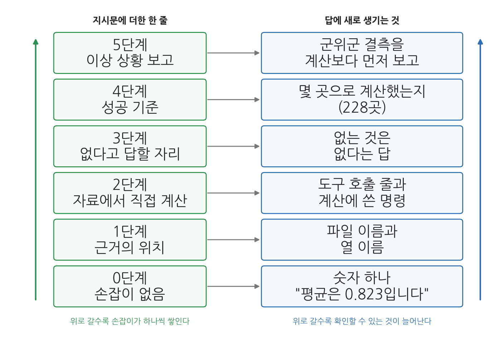
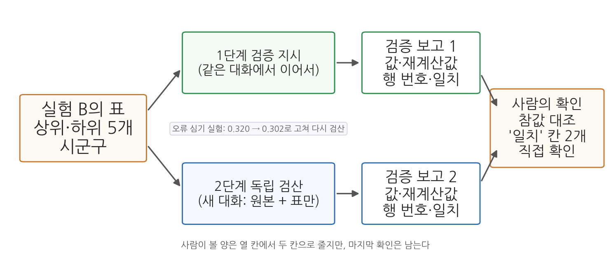

# 2주차 2회차. 에이전트 관찰과 지시문 워크숍

## 이 실습에서 하는 것

1회차에서 에이전트의 속(LLM과 맥락창, 에이전트 루프와 도구, 검증 가능성)과 에이전트에게 일을 시키는 법(좋은 지시의 다섯 요소, 계획 모드, CLAUDE.md, 검증을 내장한 지시)을 원리로 배웠다. 이번 실습은 그 원리를 내 눈으로 목격하고 손으로 해 보는 워크숍이다. 전반부(2.1-2.3)는 관찰 실험이다. 과학 시간의 관찰 실험처럼 예상을 적고, 실험하고, 관찰을 기록한다. 후반부(2.4-2.8)는 지시문 워크숍이며, 그 가운데 2.6절은 맥락창을 다시 관찰하는 자리다. 같은 데이터에 다른 지시를 주어 결과가 어떻게 달라지는지 확인하고, 학기 내내 쓸 CLAUDE.md와 지시문 라이브러리를 만든다.

오늘의 재료는 sigungu_2023.csv 하나뿐이다. 데이터가 같으니 결과의 차이는 온전히 지시의 차이에서 나온다. 오늘은 분석 결과를 만드는 날이 아니라 에이전트라는 도구의 성질을 실험하는 날이다.

이 실습이 끝나면 다음이 남는다.

- 에이전트 루프(계획 → 행동 → 관찰)가 대화창 로그에 그대로 드러난다는 관찰 기록
- 같은 질문을 검증 손잡이 없이 물었을 때와 달아서 물었을 때의 차이, 손잡이 다섯 가지를 하나씩 붙였다 떼며 답이 달라지는 자리를 적은 실험표
- 같은 지시를 세 번 주었을 때 무엇이 달라지고 무엇이 같은지의 기록(비결정성), 승인 거부의 관찰 기록
- 같은 과제를 나쁜 지시와 좋은 지시로 시켰을 때의 결과 비교 기록과, 지시문을 항목별로 매긴 채점표
- 계획 모드로 계획서를 받아 검토·수정·승인해 본 경험과, 계획을 일부러 망가뜨려 무엇이 사라지는지 본 기록
- 새 대화가 무엇을 잊는지, 재료를 올려 주는 세 가지 방법이 어떻게 다른지에 대한 관찰 기록
- 내 프로젝트 폴더에 설치된 CLAUDE.md와 나만의 지시문 라이브러리 파일 (앞으로 학기 내내 쓰고 키운다)
- 같은 대화의 재검산과 새 대화의 독립 검산을 해 본 경험, 에이전트가 틀리는 조건을 정리한 관찰 일지

아직 파이썬 환경(3주차)을 갖추기 전이므로, 에이전트가 하는 계산의 정밀함보다 일하는 방식과 지시-결과의 관계에 집중한다. 에이전트는 파일 읽기와 간단한 명령 실행만으로 오늘의 과제를 모두 처리할 수 있다. 단계가 아홉 개로 많으니, 수업 시간에는 2.8까지 마치고 2.9는 시간이 남거나 과제로 할 때 한다. 단계 안에도 실험이 여럿인 곳이 있다. 시간이 빠듯하면 2.2절의 실험 C(손잡이 사다리), 2.4절의 실험 C(세 번째 과제), 2.5절의 계획 망가뜨리기는 과제 2-G와 함께 집에서 해도 된다. 다만 각 단계의 검증만은 수업 시간에 반드시 한 번씩 해 본다. 오늘 익히는 것은 실험의 개수가 아니라 결과를 파일에서 확인하는 손동작이다.

## 준비물

| 구분 | 내용 |
|------|------|
| 폴더 | 1주차에 만든 `공공데이터분석` 폴더 (data, 산출물, 메모 하위 폴더 포함. VSCode로 열어 둘 것) |
| 데이터 | 수업 자료실에서 받은 `sigungu_2023.csv`를 data 폴더에 넣어 둘 것. 전국 229개 시군구의 인구 지표 12개 열(시도, 시군구, 총인구, 면적, 인구밀도, 인구증가율, 고령, 생산가능, 유소년, 고령인구비율, 합계출산율, 출생아수). 출처는 행정안전부 주민등록인구통계·국가데이터처(옛 통계청) 인구동향조사, KOSIS에서 수집 |
| 도구 | VSCode + Claude Code 확장 (1주차 2회차에서 설치) |
| 선수 내용 | 2주차 1회차 (1.1 맥락창과 비결정성, 1.2 에이전트 루프와 도구, 1.3 검증 가능성, 1.5 다섯 요소, 1.6 계획 모드와 맥락 제공, 1.7 CLAUDE.md와 다섯 손잡이) |

## 2.1 요약 작업을 시키고 도구 호출 로그 읽기

**무엇을 왜 하는가.** 첫 실험은 평범한 요약 작업이다. 다만 오늘은 결과가 아니라 과정을 본다. 1회차 1.2절에서 에이전트는 계획하고, 도구로 행동하고, 결과를 관찰해 다음 행동을 정하는 루프를 돈다고 배웠다. 그 루프는 이론 속의 그림이 아니라 대화창에 그대로 찍히는 로그다. 앞으로 매주 에이전트가 무엇을 근거로 답했는지 확인해야 하는데, 그 확인의 첫 단서가 이 로그다.

<div style="border:1px solid #cfe3d4;border-left:5px solid #2f8f4e;background:#f4fbf6;padding:12px 16px;margin:18px 0;border-radius:4px;">
<strong>지시문 예시</strong><br>
"data 폴더의 sigungu_2023.csv 파일을 살펴보고, (1) 몇 개 시군구가 들어 있는지, (2) 어떤 항목(열)들이 있는지, (3) 총인구가 가장 많은 시군구 3곳과 가장 적은 시군구 3곳을 알려 줘. 어떤 방법으로 확인했는지도 함께 설명해 줘."
</div>

**예상되는 에이전트의 행동과 결과.** 대화창에 세 종류의 행동이 순서대로 나타난다. 첫째, 파일 읽기다. 파일 이름이 붙은 접힌 줄이 생기고, 펼치면 열 이름 줄과 강원 강릉시부터 시작하는 데이터 줄이 보인다. 둘째, 세기와 정렬이다. 파일이 230줄이라 한 번에 다 읽지 못하면, 줄 수를 세거나 총인구 열로 정렬하는 짧은 명령을 실행하겠다며 승인을 요청한다. 승인 창에 실행할 명령이 적혀 있으니 읽고 승인한다. 셋째, 보고다.

화면에 찍히는 모양을 미리 익혀 두면 로그를 읽기가 쉬워진다. 도구 호출은 접힌 한 줄로 나타나고, 줄 앞의 표시(점, 화살표, 도구 이름)와 접힌 줄의 문구는 확장 버전에 따라 조금씩 다르다. 아래는 그 줄들만 뽑아 옮긴 것이다.

```text
● 읽기  data/sigungu_2023.csv (1-100줄)
  └ 100줄 읽음. 열 이름: 시도, 시군구, 총인구, 면적, 인구밀도, ...

● 실행  파일의 줄 수 세기
  └ 실행할 명령: wc -l data/sigungu_2023.csv
  └ [승인]  [항상 허용]  [거부]

  (승인을 누른 뒤)
  └ 230 data/sigungu_2023.csv

● 실행  총인구 열로 정렬해 위아래 3줄씩 보기
  └ 실행 완료 (6줄 출력)
```

이 네 줄이 오늘 볼 로그의 기본형이다. 첫 줄은 읽기 도구, 셋째 줄은 실행 도구이고, 각 도구 호출 아래에 결과가 한두 줄로 요약되어 붙는다. 접힌 줄을 클릭하면 읽은 내용 전문이나 명령의 출력 전문이 펼쳐진다. 승인 창의 "항상 허용"은 같은 종류의 명령을 다음부터 묻지 않겠다는 뜻이므로, 오늘은 누르지 말고 매번 읽고 "승인"을 누른다. 이렇게 도구를 두세 번 부른 뒤 에이전트가 최종 보고를 내놓는다. 보고는 대략 다음과 같은 꼴이다.

```text
- 시군구 수: 229개 (첫 줄은 열 이름이므로 제외)
- 열 12개: 시도, 시군구, 총인구, 면적, 인구밀도, 인구증가율, 고령,
  생산가능, 유소년, 고령인구비율, 합계출산율, 출생아수
- 총인구 상위 3: 경기 수원시 1,190,964 / 경기 고양시 1,076,535 / 경기 용인시 1,074,971
- 총인구 하위 3: 경북 울릉군 8,996 / 경북 영양군 16,022 / 인천 옹진군 20,613
- 확인 방법: 파일 전체를 읽어 줄 수를 세고, 총인구 열을 기준으로 정렬했습니다.
```

1회차 1.2절의 루프가 화면에 그대로 펼쳐지는 셈이다. 읽기가 행동이고, 읽은 내용이 관찰이며, "다 못 읽었으니 명령으로 세자"가 관찰에 따른 다음 계획이다.

보고 앞뒤로 에이전트가 덧붙이는 설명 문장도 함께 읽어 두자. "먼저 파일의 앞부분을 읽어 구조를 파악하겠습니다", "파일이 230줄이라 한 번에 다 읽는 대신 명령으로 세는 편이 정확합니다", "정렬 결과 상위 세 곳은 모두 경기도의 시입니다" 같은 문장들이다. 첫째와 둘째는 계획을 말하는 문장이고 셋째는 관찰을 말하는 문장이다. 이 문장들이 곧 루프의 자막이다.

**관찰 과제.** 대화창을 위로 스크롤하며 다음에 답해 보라. (1) 에이전트가 가장 먼저 한 행동은 무엇인가. 바로 답했는가, 파일부터 열었는가. (2) 도구 사용이 몇 번 있었고 각각 무엇을 하는 행동이었는가. (3) 중간에 계획을 바꾸거나 재시도한 흔적이 있는가.

답을 표 2-5에 옮겨 적는다. 이 표는 오늘 여러 번 쓰게 되므로 메모 폴더에 만들어 두면 좋다. 도구 호출 줄을 하나씩 짚어 가며 채우되, "무엇을 알아내려고"는 에이전트의 설명 문장에서 찾고, "무엇을 알아냈나"는 접힌 줄을 펼쳐 출력에서 찾는다.

**표 2-5. 도구 호출 로그 기록표 (2.1)**

| 순서 | 도구 종류 | 무엇을 알아내려고 | 무엇을 알아냈나 | 승인을 물었나 |
|------|------|------|------|------|
| 1 | 읽기 | 파일 구조 | 열 12개, 첫 데이터는 강원 강릉시 | 아니오 |
| 2 | | | | |
| 3 | | | | |

표를 다 채우면 마지막 칸을 확인하라. 읽기에는 승인을 묻지 않고 실행에는 물었을 것이다. 읽기는 되돌릴 수 있고 실행은 되돌리기 어렵기 때문이며, 이 경계가 2.3절 실험 3의 주제다.

**검증.** 보고된 숫자를 파일에서 직접 확인한다. VSCode 탐색기에서 sigungu_2023.csv를 클릭하면 쉼표로 구분된 글줄이 열리고 왼쪽에 줄 번호가 붙어 있다. 첫째, Ctrl+End로 파일 끝에 가면 마지막 줄 번호가 230이고 1번째 줄은 열 이름이므로 시군구는 229개다. 둘째, Ctrl+F로 "수원시"를 찾으면 32번째 줄이고 세 번째 칸이 1190964.0이다. 셋째, "울릉군"은 85번째 줄이고 값은 8996.0이다. 파일을 직접 열어 볼 수 있다는 것, 이것이 여러분의 검증 수단이다.

**에이전트가 틀리는 장면 1: 세는 기준.** 첫 실험에서 볼 수 있는 틀림은 "시군구는 230개입니다"라는 보고다. (1) 틀림: 줄 수를 세는 명령이 센 것은 열 이름 줄을 포함한 230이고, 에이전트가 그 숫자를 시군구 수로 옮겨 적었다. (2) 발견: 위의 검증에서 1번째 줄이 "시도,시군구,총인구,…"임을 보면 229가 맞다는 것이 곧 드러난다. (3) 재지시: "첫 줄은 열 이름이야. 열 이름 줄을 빼고 데이터 줄만 세어서 다시 알려 줘". (4) 수정: 229로 고쳐 보고한다. 계산은 틀리지 않았고, 무엇을 세는지의 기준이 지시문에 없었던 것이다. 이런 기준 문제는 2.9절에서 유형으로 정리한다.

## 2.2 검증 손잡이 달기: 같은 질문, 확인할 수 있는 지시

**무엇을 왜 하는가.** 이제 1회차 1.3절의 검증 가능성을 직접 실험한다. 같은 질문을 두 번 묻되, 한 번은 손잡이 없이, 한 번은 검증 손잡이를 달아서 묻는다. 관찰할 것은 답이 맞는지가 아니라 답을 받은 내가 확인할 수 있는지다. 1.3절의 세 손잡이는 근거의 위치를 함께 보고하게 하는 것, 자료에서 직접 계산하거나 조회하게 하는 것, 모르면 없다고 답할 자리를 만드는 것이었다. 실험 B의 지시문에 이 셋이 전부 들어간다.

**실험 A. 손잡이 없이 묻기.**

<div style="border:1px solid #cfe3d4;border-left:5px solid #2f8f4e;background:#f4fbf6;padding:12px 16px;margin:18px 0;border-radius:4px;">
<strong>지시문 예시</strong><br>
"웹 검색이나 파일 확인 없이, 기억만으로 답해 줘. 2023년 경상북도 의성군의 65세 이상 인구 비율이 정확히 몇 퍼센트였지? 소수점 둘째 자리까지 알려 줘."
</div>

**예상되는 에이전트의 행동과 결과.** 도구 사용 없이 곧바로 답이 온다. 그럴듯한 숫자를 내놓을 수도 있고, "정확한 값은 기억만으로 확신할 수 없다"며 대략의 범위만 말하고 확인을 권할 수도 있다. 최근의 모델은 후자가 많다. 어느 쪽이든 답변 안에 출처도, 계산 경로도, 확인 방법도 없다. 답을 받았으면 잠시 멈추고 적어 보라. 이 숫자가 맞는지 확인하려면 나는 무엇을 해야 하는가. 아마 적을 것이 없을 것이다. 에이전트가 정답을 말했더라도 사정은 같다.

**실험 B. 검증 손잡이를 달아 묻기.** 새 지시로 같은 것을 다시 묻되, 세 손잡이를 모두 단다.

<div style="border:1px solid #cfe3d4;border-left:5px solid #2f8f4e;background:#f4fbf6;padding:12px 16px;margin:18px 0;border-radius:4px;">
<strong>지시문 예시</strong><br>
"data 폴더의 sigungu_2023.csv에서 의성군을 찾아 고령인구비율 값을 알려 줘. 파일의 몇 번째 줄, 어느 열에서 찾았는지 함께 밝혀 줘. 파일에 의성군이 없으면 없다고 답하고 추측하지 마."
</div>

**예상되는 에이전트의 행동과 결과.** 이번에는 도구 사용이 보인다. 파일에서 "의성군"을 찾는 명령을 실행하거나 파일을 읽어 해당 줄을 골라낸다. 보고는 대략 이렇다.

```text
경북 의성군의 고령인구비율은 45.28%입니다 (파일의 값: 45.27756744908939).
- 위치: 파일의 87번째 줄 (1번째 줄이 열 이름), 10번째 열 "고령인구비율"
- 같은 줄의 다른 값: 총인구 50186, 합계출산율 1.406
```

**검증.** 값 옆에 붙은 좌표가 손잡이다. 그 손잡이를 잡고 직접 확인하라. VSCode에서 CSV를 열고 Ctrl+G를 눌러 87을 입력하면 커서가 87번째 줄로 간다. 그 줄이 "경북,의성군,50186.0,…"으로 시작하고 열 번째 칸이 45.27756744908939인지 본다. 확인에 몇 초가 걸리는지 재 보라. 실험 A의 답은 맞았을 수도 틀렸을 수도 있지만 확인할 길이 없었고, 실험 B의 답은 확인하는 데 1분이 걸리지 않았다. 두 답의 차이는 에이전트의 능력이 아니라 지시문의 몇 글자에서 나왔다.

**에이전트가 틀리는 장면 2: 좌표가 어긋난다.** 실험 B에서 자주 보는 틀림은 값은 맞는데 위치가 다른 경우다. (1) 틀림: 에이전트가 "85번째 행"이라고 보고한다. 파일을 읽는 프로그램은 대개 열 이름 줄을 빼고 데이터 줄을 0부터 세는데, 그 기준으로 의성군은 85번이다. (2) 발견: Ctrl+G로 85번째 줄에 가면 의성군이 아니라 "경북,울릉군,8996.0,…"이 있다. 손잡이 덕분에 어긋남이 즉시 드러난다. 손잡이가 없었다면 값 45.28%만 받고 넘어갔을 것이고, 다음번에 값이 틀렸을 때 잡을 방법도 없었을 것이다. (3) 재지시: "네가 말한 행 번호는 어떤 기준으로 센 거야? VSCode에서 파일을 열었을 때의 줄 번호로, 열 이름 줄을 1번째로 세어서 다시 알려 줘". (4) 수정: 에이전트가 세는 기준을 밝히고 87로 고친다. 2.1과 같은 성질의 틀림이다. 세는 기준이 둘일 때 지시문이 어느 쪽인지 말해 주지 않으면 에이전트는 사람과 다른 쪽을 고를 수 있다.

**한 걸음 더: 없는 것을 묻기.** "우리 대학교가 있는 구의 2023년 1인 가구 행복지수를 알려 줘" 같은 질문을 해 보라. 행복지수라는 공식 통계는 그런 이름으로는 없다. 먼저 손잡이 없이 묻고, 다음에는 "공식 통계로 존재하는지 먼저 확인하고, 없으면 없다고 답해 줘"를 붙여 다시 물어 보라. 손잡이 없이 물었을 때 비슷한 이름의 다른 조사를 끌어와 답하는지, 손잡이를 달았을 때 "그런 이름의 공식 통계는 확인되지 않는다"로 바뀌는지가 관찰 지점이다.

**실험 C. 손잡이를 하나씩 붙였다 떼기.** 실험 A와 B는 손잡이가 아예 없는 지시와 다 있는 지시를 비교한 것이었다. 이제 그 사이를 채운다. 1회차 1.7절에서 손잡이는 다섯 가지로 확장되었다. 근거의 위치를 함께 보고하게 하기, 자료에서 직접 계산하거나 조회하게 하기, 모르면 없다고 답할 자리 만들기, 성공 기준을 숫자로 명시하기, 이상 상황을 보고하게 하기다. 이 다섯을 한꺼번에 다는 것이 정답이지만, 하나씩 붙여 가며 답이 어디서 달라지는지 보면 각 손잡이가 무슨 일을 하는지 몸에 남는다.

과제는 "sigungu_2023.csv에서 합계출산율 평균을 구해 줘" 하나로 고정한다. 이 과제를 고른 이유는 데이터에 함정이 하나 심어져 있기 때문이다. 군위군의 합계출산율 칸이 비어 있어서, 값이 있는 시군구는 229곳이 아니라 228곳이다. 손잡이가 없으면 이 사실이 답에 드러나지 않는다.

새 대화를 여섯 번 열고, 아래 여섯 지시문을 하나씩 준다. "1단계는 0단계 더하기 무엇"이라고 적은 것은 앞 단계의 지시문을 그대로 두고 그 뒤에 새 문장을 이어 붙이라는 뜻이다. 5단계에 이르면 한 지시문 안에 손잡이 다섯 개가 모두 들어간다. 매번 새 대화를 여는 이유는 앞 대화의 답이 다음 답에 영향을 주지 않게 하기 위해서다(1회차 1.1절의 맥락창).

<div style="border:1px solid #cfe3d4;border-left:5px solid #2f8f4e;background:#f4fbf6;padding:12px 16px;margin:18px 0;border-radius:4px;">
<strong>지시문 예시</strong><br>
0단계: "sigungu_2023.csv에서 합계출산율 평균을 구해 줘."<br>
1단계: 0단계 + "어떤 파일의 어느 열로 구했는지 함께 밝혀 줘."<br>
2단계: 1단계 + "기억이나 짐작으로 답하지 말고 파일을 직접 읽어 계산하고, 계산에 쓴 명령을 보여 줘."<br>
3단계: 2단계 + "파일에 그 열이 없으면 없다고 답하고 다른 열로 대신하지 마."<br>
4단계: 3단계 + "이 파일의 시군구 229곳이 빠짐없이 계산에 들어가야 한다. 몇 곳의 값으로 평균을 냈는지 숫자로 적어 줘."<br>
5단계: 4단계 + "값이 비어 있거나 이상해 보이는 칸이 있으면 계산 전에 먼저 보고해 줘."
</div>

**예상되는 에이전트의 행동과 결과.** 답이 단계마다 길어지는데, 늘어나는 것은 수식어가 아니라 확인 경로다. 0단계의 답은 "합계출산율 평균은 0.823입니다" 한 줄로 끝난다. 2단계쯤부터 도구 호출 줄이 화면에 나타나고, 4단계에서 처음으로 228이라는 숫자가 답에 등장하며, 5단계에서는 군위군이라는 이름이 계산보다 먼저 나온다. 5단계의 답은 대략 이렇다.

```text
계산 전 보고: 합계출산율 열에 값이 비어 있는 시군구가 1곳 있습니다.
  - 경북 군위군 (파일 73번째 줄). 출생아수 칸도 함께 비어 있습니다.

계산: data/sigungu_2023.csv의 11번째 열 "합계출산율"을 사용했습니다.
  - 값이 있는 228곳의 단순평균: 0.823
  - 참고로 중앙값은 0.790입니다.
  - 지시하신 229곳 기준은 충족하지 못했습니다. 1곳이 결측이라
    228곳으로 계산했습니다.
```

마지막 두 줄이 4단계 손잡이(성공 기준)가 만들어 낸 문장이다. 성공 기준을 숫자로 못 박아 두면 에이전트는 기준을 채우지 못했을 때 그 사실을 말해야 한다. 기준이 없으면 228로 계산하고도 아무 말 없이 넘어갈 수 있다. 여섯 단계에서 무엇이 쌓이는지를 한 장으로 정리한 것이 그림 2-10이다.



그림 2-10을 아래에서 위로 읽어 보자. 맨 아래 칸은 손잡이가 하나도 없는 지시문이고, 그때 돌아오는 답은 숫자 하나뿐이다. 한 칸 올라갈 때마다 지시문에 한 줄이 더해지고(왼쪽), 그 한 줄 때문에 답에 무언가가 새로 생긴다(오른쪽). 파일 이름과 열 이름이 생기고, 도구 호출 줄과 명령이 생기고, 없는 것은 없다는 답이 생기고, 몇 곳으로 계산했는지가 생기고, 마지막에는 결측 보고가 계산보다 앞에 온다. 여기서 알 수 있는 것은 두 가지다. 첫째, 왼쪽 칸의 문장은 모두 짧다. 지시문이 길어져서 답이 좋아지는 것이 아니라, 비어 있던 자리 하나가 채워져서 좋아진다. 둘째, 오른쪽에 쌓이는 것은 답의 내용이 아니라 답을 확인할 경로다. 다섯 칸을 다 올라가도 평균값은 여전히 0.823이다. 여섯 대화를 모두 마친 뒤에는 이 그림과 자신의 여섯 답을 나란히 놓고, 오른쪽 칸에 적힌 것이 내 답에도 실제로 나타났는지 한 줄씩 짚어 보라.

결과를 표 2-6에 정리하라.

**표 2-6. 손잡이를 하나씩 붙였을 때 답에 생기는 것 (2.2 실험 C)**

| 단계 | 더한 손잡이 | 답에 새로 생긴 것 | 내가 확인할 수 있게 된 것 |
|------|------|------|------|
| 0 | 없음 | 숫자 하나 | 없음 |
| 1 | 근거의 위치 | 파일 이름과 열 이름 | 어느 열을 봤는지 |
| 2 | 자료에서 직접 계산 | 도구 호출 줄, 명령 | 같은 명령을 다시 돌려 볼 수 있음 |
| 3 | 없다고 답할 자리 | | |
| 4 | 성공 기준 | | |
| 5 | 이상 상황 보고 | | |

3단계 칸을 채울 때 당황할 수 있다. 이 과제에서는 3단계 손잡이를 달아도 답이 거의 달라지지 않기 때문이다. 합계출산율 열이 실제로 파일에 있으니 "없으면 없다고 답하라"는 문장이 작동할 자리가 없다. 손잡이가 놀고 있는 것이 정상이며, 그 칸에는 "달라진 것 없음"이라고 적으면 된다. 이 손잡이가 일하는 모습을 보고 싶으면 새 대화를 하나 더 열어 3단계 지시문의 열 이름만 바꿔 보라. "합계출산율" 대신 "출산율지수"처럼 파일에 없는 이름을 넣는 것이다. 손잡이가 없으면 에이전트가 이름이 비슷한 다른 열(예를 들어 출생아수)을 골라 계산해 버리는 일이 있고, 손잡이가 있으면 "그런 이름의 열은 파일에 없습니다"라고 답한다. 손잡이의 값어치는 평소가 아니라 어긋난 상황에서 드러난다.

**떼기 실험.** 이번에는 반대로 간다. 5단계 지시문에서 손잡이 하나만 지우고 새 대화에서 다시 물어, 답에서 무엇이 사라지는지 본다. 시간이 없으면 4단계 손잡이(성공 기준) 하나만 지워 보라. "229곳이 빠짐없이"라는 문장을 지우면, 결측 보고는 남더라도 "228곳으로 계산했다"는 확인 문장이 답에서 빠지는 경우가 많다. 손잡이 하나가 답의 한 줄과 맞바꿔진다는 것을 눈으로 확인하는 것이 이 실험의 목적이다.

**검증.** 여섯 답이 말하는 숫자가 서로 같은지 먼저 본다. 0단계부터 5단계까지 평균값은 모두 0.823이어야 한다. 손잡이는 값을 바꾸는 장치가 아니라 값을 확인할 수 있게 만드는 장치이기 때문이다. 다음으로 5단계 답의 결측 보고를 파일에서 확인한다. Ctrl+G로 73번째 줄에 가면 "경북,군위군,23340.0,…"으로 시작하는 줄이 있고, 줄 끝에 쉼표 두 개가 연달아 나온다(`…,44.177378…,,`). 값이 있어야 할 자리가 비어 있다는 뜻이다. 마지막으로 4단계 답이 229와 228을 구분해 말했는지 확인한다. 구분하지 않고 "229곳의 평균"이라고 답했다면 그것이 오늘 볼 수 있는 또 하나의 이름표 오류다.

<div style="border:1px solid #ecd9c6;border-left:5px solid #c77b2f;background:#fdf9f4;padding:12px 16px;margin:18px 0;border-radius:4px;">
<strong>유의 · 이 실험의 교훈을 거꾸로 새기지 말 것</strong><br>
이 실험의 교훈은 "에이전트는 못 믿을 물건"이 아니다. 실험 A의 답이 맞았을 수도 있다. 교훈은 <strong>묻는 방식이 답의 검증 가능성을 결정한다</strong>는 것이다. 손잡이 없는 답은 맞아도 쓸 수 없고, 손잡이 있는 답은 틀려도 잡아낼 수 있다. 틀리는 장면 2가 그 증거다. 행 번호가 어긋났다는 사실 자체가 손잡이 덕분에 보였다. 앞으로 모든 실습에서 숫자가 필요할 때는 실험 B의 방식으로 묻는다.
</div>

## 2.3 같은 지시, 다른 답: 비결정성과 권한 모드

**무엇을 왜 하는가.** 세 번째 실험은 1회차 1.1절의 비결정성과 1.2절의 도구 사용·권한을 한 절에서 관찰한다. 앞의 것은 "같은 지시를 두 번 주면 같은 답이 오는가"이고, 뒤의 것은 "에이전트가 행동하기 전에 왜 나에게 묻는가"이다. 둘 다 오늘 여러 번 스쳐 지나갔을 현상이지만 일부러 만들어 보아야 성질이 보인다.

**실험 1. 열린 지시 두 번.** 새 대화를 열고 다음 지시를 입력한 뒤, 대화를 닫고 또 새 대화를 열어 완전히 같은 지시를 한 번 더 입력한다. 새 대화는 맥락창이 비워진 상태이므로 두 번째 대화는 첫 번째 답을 모른다.

<div style="border:1px solid #cfe3d4;border-left:5px solid #2f8f4e;background:#f4fbf6;padding:12px 16px;margin:18px 0;border-radius:4px;">
<strong>지시문 예시</strong><br>
"data 폴더의 sigungu_2023.csv를 보고, 이 데이터에서 읽어 낼 수 있는 흥미로운 사실을 세 가지만 골라 한 문장씩 알려 줘."
</div>

**예상되는 에이전트의 행동과 결과.** 두 대화 모두 파일을 읽고 세 문장을 내놓지만 고른 사실이 다르다. 예를 들어 첫 번째 대화가 "총인구가 가장 많은 수원시(1,190,964명)는 가장 적은 울릉군(8,996명)의 130배가 넘는다", "고령인구비율이 가장 높은 의성군(45.3%)은 가장 낮은 울산 북구(10.7%)의 네 배 이상이다", "합계출산율 1위 영광군(1.651)과 꼴찌 부산 중구(0.320)는 다섯 배 넘게 차이 난다"를 골랐다면, 두 번째 대화는 그중 하나만 겹치고 "시도별 시군구 수는 경기가 31곳으로 가장 많고 세종은 1곳뿐이다"처럼 다른 것을 고를 수 있다. 같은 사실을 골랐더라도 표현은 달라진다. "흥미로운 것을 고르라"는 열린 지시일수록 답의 편차가 커진다.

**세 번째 대화까지 열어 기록하기.** 두 번으로는 "우연히 달랐다"와 "원래 매번 다르다"를 가릴 수 없다. 세 번째 새 대화를 열어 같은 지시를 한 번 더 주고, 세 답을 표 2-7에 나란히 옮긴다. 답 전문을 옮길 필요는 없다. 고른 사실을 주제어 한 단어로 줄이고(예: 인구 격차, 고령화, 출산율, 시도별 개수), 그 문장에 나온 숫자만 그대로 적는다.

**표 2-7. 같은 지시 세 번의 결과 기록표 (2.3 실험 1)**

| 회차 | 사실 1 (주제어) | 사실 2 | 사실 3 | 답에 나온 숫자 | 형식 |
|------|------|------|------|------|------|
| 1차 | 인구 격차 | 고령화 | 출산율 | 1,190,964 / 8,996 / 45.3 / 1.651 | 줄글 세 문장 |
| 2차 | | | | | |
| 3차 | | | | | |

표를 채운 뒤 두 종류의 차이를 갈라서 본다. 첫째는 **달라져도 되는 것**이다. 어떤 사실을 골랐는지, 어떤 순서로 늘어놓았는지, 문장을 어떻게 썼는지, 줄글인지 목록인지가 여기 속한다. 세 번 다 다를 수 있고, 다르다고 해서 틀린 것이 아니다. 둘째는 **달라지면 안 되는 것**이다. 파일에서 읽어 온 숫자다. 세 답 가운데 두 개 이상에 같은 시군구가 등장했다면, 그 숫자가 회차마다 같은지 대조하라. 1차와 3차가 모두 수원시를 골랐다면 두 답의 인구는 똑같이 1,190,964명이어야 한다. 한쪽이 1,190,964이고 다른 쪽이 1,190,000이면 그것은 비결정성이 아니라 오류이고, 대개 반올림하거나 "약 119만"으로 바꾸어 적는 과정에서 생긴다.

여기서 오늘의 판정 규칙 하나가 나온다. **문장이 다른 것은 정상, 숫자가 다른 것은 사건.** 이 규칙을 관찰 일지에 적어 두고, 앞으로 같은 작업을 두 번 시켰을 때마다 이 기준으로 나누어 보라. 숫자가 다르면 어느 쪽이 맞는지 파일에서 확인하고, 틀린 쪽이 왜 그렇게 나왔는지(반올림인지, 다른 열을 읽었는지, 다른 연도를 말한 것인지) 대화로 물어본다.

**에이전트가 틀리는 장면 3: 세 번 중 한 번만 다른 숫자.** (1) 틀림: 1차와 2차는 고령인구비율 1위를 "의성군 45.3%"라고 했는데 3차만 "의성군 45%"도 아닌 "군위군 44.2%"라고 한다. (2) 발견: 표 2-7의 숫자 칸을 세로로 읽으면 한 줄만 다르다는 것이 곧 보인다. (3) 재지시: "고령인구비율이 가장 높은 시군구를 파일에서 다시 확인하고, 1위와 2위의 값과 줄 번호를 함께 알려 줘". (4) 수정: 1위는 87번째 줄의 경북 의성군 45.28%, 2위는 73번째 줄의 경북 군위군 44.18%로 정리된다. 두 값의 차이가 1.1퍼센트포인트에 불과해 정렬 결과를 눈으로 훑다가 1위와 2위를 바꿔 읽기 쉬운 자리였던 것이다. 이런 자리는 값이 서로 가까운 곳에서 반복해서 나타나며, 2.7절의 라이브러리 검증에서 한 번 더 만나게 된다.

**실험 2. 닫힌 지시 두 번.** 반대 실험도 해 보자. "총인구가 가장 많은 시군구 1곳의 이름과 인구를 알려 줘"처럼 답이 하나로 정해지는 지시를 두 번 새 대화에서 주면, 표현은 달라도 내용은 같다. 두 번 모두 경기 수원시, 1,190,964명이어야 한다. 지시가 닫혀 있을수록 비결정성이 결과에 미치는 영향이 작아진다. 재현 가능해야 하는 분석 작업에서 지시를 구체적으로 쓰는 이유가 하나 더 늘었다.

**검증.** 비결정성 실험에서도 검증은 빠지지 않는다. 표현이 다른 것과 사실이 다른 것을 구분해야 하기 때문이다. 두 대화의 답에서 숫자가 들어간 문장을 하나씩 골라 파일과 대조한다. "의성군 45.3%"는 87번째 줄의 45.27756744908939를 반올림한 값인지, "수원시 1,190,964명"은 32번째 줄의 값과 같은지 본다. 두 답이 같은 사실을 다른 문장으로 말한 것은 비결정성이고, 다른 숫자를 말한 것은 오류다. 관찰 일지에는 이 둘을 따로 적는다.

**실험 3. 승인을 거부해 보기.** 오늘 에이전트가 여러 번 "이 명령을 실행해도 될까요?"라며 멈췄을 것이다. 귀찮게 느껴졌다면 정상이다. 그러나 이 절차는 에이전트에게 행동력을 준 대가로 필요해진 안전장치다. 챗봇은 말만 하니 사고를 칠 수 없지만, 에이전트는 파일을 지우거나 프로그램을 설치할 수 있다. 거부가 어떻게 작동하는지 안전한 재료로 실험한다. 먼저 지울 것을 만든다.

<div style="border:1px solid #cfe3d4;border-left:5px solid #2f8f4e;background:#f4fbf6;padding:12px 16px;margin:18px 0;border-radius:4px;">
<strong>지시문 예시</strong><br>
"프로젝트 폴더 맨 위에 '임시'라는 폴더를 만들고, 그 안에 '테스트.txt' 파일을 만들어서 '삭제 실험용'이라고 한 줄 적어 줘."
</div>

탐색기에 임시 폴더와 테스트.txt가 생겼으면 "임시 폴더 안의 파일을 모두 삭제해 줘"라고 시킨다.

**예상되는 에이전트의 행동과 결과.** 삭제 명령을 실행하겠다는 승인 요청이 뜨고, 승인 창에 실행하려는 명령이 그대로 적혀 있다. 이번에는 거부를 눌러 보라. 에이전트는 명령을 실행하지 않고 멈춘 뒤 "삭제가 승인되지 않았습니다. 다른 방법을 원하시면 알려 주세요"처럼 대안을 묻거나 중단을 보고한다. 다른 방법으로 우회해 지우려 하지는 않아야 정상이다. 관찰이 끝났으면 같은 지시를 다시 주고 승인해 파일이 실제로 지워지는 것까지 본 뒤, "임시 폴더도 삭제해 줘"로 뒷정리한다.

**검증.** 거부 직후 탐색기에서 임시 폴더를 펼쳐 테스트.txt가 그대로 있는지 확인한다. 거부가 실제로 행동을 막았다는 증거다. 승인 뒤에는 폴더가 비었는지 확인한다. 1주차에 만든 메모 폴더의 파일로 이 실험을 하지 않는 이유는 실수로 승인을 누르면 돌이키기 어렵기 때문이다. 삭제처럼 되돌리기 어려운 행동일수록 승인 단계에서 한 번 더 생각하는 습관을 오늘 들인다.

<div style="border:1px solid #e0d8ea;border-left:5px solid #7a5fa8;background:#faf8fc;padding:12px 16px;margin:18px 0;border-radius:4px;">
<strong>왜 "다 승인"으로 두지 않는가?</strong><br>
Claude Code에는 권한 모드가 여럿 있다. 기본 모드는 파일을 바꾸거나 명령을 실행할 때마다 승인을 구하고, 편집을 자동 승인하는 모드는 그 절차를 줄여 주며, 계획 모드는 반대로 읽기만 허용하고 어떤 변경도 하지 않는다(2.5절에서 쓴다). 모드는 지시 입력창 근처의 표시를 눌러 바꾸며, 이름과 위치는 확장 버전에 따라 조금 다르다. 숙련된 사용자는 단순 반복 작업에서 자율성을 높여 쓰기도 한다(1주차의 자율성 조절). 그러나 지금 단계에서는 기본 모드에서 모든 승인 요청을 읽고 누르는 것을 원칙으로 한다. 승인 요청은 귀찮은 팝업이 아니라 에이전트가 지금 무엇을 하려는지 알려 주는 창이다. 2.1에서 줄 수를 세는 명령을 승인 창에서 읽었다면, "230개"라는 보고가 오기 전에 그 숫자가 어디서 올지 짐작할 수 있었을 것이다.
</div>

## 2.4 같은 과제, 다른 지시: 나쁜 지시 vs 좋은 지시 비교 실험

**무엇을 왜 하는가.** 후반부 워크숍의 첫 실험은 통제된 비교다. 같은 데이터, 같은 에이전트, 다른 지시. 과제는 "sigungu_2023.csv에서 합계출산율이 높은 곳과 낮은 곳 파악하기"로 고정한다. 1회차 1.5절의 다섯 요소(역할·맥락·과제·제약·산출물)와 1.7절의 검증 내장이 결과를 어떻게 바꾸는지 눈으로 본다.

**실험 A. 나쁜 지시.** 새 대화를 열고 일부러 빈칸투성이로 만든 지시를 입력한다.

<div style="border:1px solid #cfe3d4;border-left:5px solid #2f8f4e;background:#f4fbf6;padding:12px 16px;margin:18px 0;border-radius:4px;">
<strong>지시문 예시</strong><br>
"인구 데이터 분석해 줘."
</div>

**예상되는 에이전트의 행동과 결과.** 에이전트는 폴더를 뒤져 파일을 찾고, 무엇을 할지 스스로 정한다. 열 몇 개의 요약을 내놓을 수도 있고, 흥미로운 사실 목록을 만들 수도 있고, "어떤 분석을 원하시나요?"라고 되물을 수도 있다. 되묻는 것은 좋은 반응이지만 어느 쪽이 나올지는 복불복이다. 요약을 내놓는 경우 대략 이런 모양이다.

```text
데이터 개요: 229개 시군구, 12개 열
- 총인구: 최대 경기 수원시 1,190,964명, 최소 경북 울릉군 8,996명
- 고령인구비율: 평균 24.98%, 최고 경북 의성군 45.28%
- 합계출산율: 평균 0.823, 최고 전남 영광군 1.651, 최저 부산 중구 0.320
```

결과가 무엇이든 지우지 말고 그대로 두라. 비교 자료다.

**실험 B. 좋은 지시.** 대화를 닫고 새 대화를 연 뒤, 다섯 요소와 검증 내장을 갖춘 지시를 입력한다.

<div style="border:1px solid #cfe3d4;border-left:5px solid #2f8f4e;background:#f4fbf6;padding:12px 16px;margin:18px 0;border-radius:4px;">
<strong>지시문 예시</strong><br>
"구청 인구정책팀의 분석 보조로서 일해 줘. data 폴더의 sigungu_2023.csv를 읽고, 합계출산율 상위 5개와 하위 5개 시군구를 찾아 줘. 파일에 있는 값만 사용하고 추측은 하지 마. 합계출산율 값이 비어 있는 시군구가 있으면 몇 곳인지 먼저 보고해 줘. 결과는 시도·시군구·합계출산율 세 열의 마크다운 표 두 개(상위, 하위)와 세 문장 요약으로 대화창에 보여 줘."
</div>

**예상되는 에이전트의 행동과 결과.** 파일을 읽고, 결측(빈 값)을 확인해 보고하고, 표 두 개와 요약을 내놓는다. 실험 A보다 도구 사용 로그가 목적 지향적으로 짧다. 첫 줄에 "합계출산율이 비어 있는 시군구는 1곳(경북 군위군)이며, 아래 표는 나머지 228곳 기준입니다"가 오고, 상위 표는 전남 영광군 1.651부터, 하위 표는 부산 중구 0.320부터 시작한다.

**관찰 과제.** 두 결과를 나란히 놓고 네 기준으로 비교해 메모하라. (1) 과제 일치: 내가 원한 것(출산율 상·하위 파악)을 해 주었는가. (2) 형식: 결과의 형태를 내가 예측할 수 있었는가. (3) 근거: 어떤 파일과 열에서 나온 결과인지 드러나는가. (4) 함정 처리: 값이 비어 있는 시군구의 존재를 알려 주었는가.

**검증.** 실험 B의 표를 파일과 직접 대조한다. 미리 계산해 둔 참값은 이렇다. 상위 5곳은 전남 영광군(1.651, 180번째 줄), 전남 강진군(1.468, 167번째 줄), 경북 의성군(1.406, 87번째 줄), 전북 김제시(1.367, 191번째 줄), 전남 해남군(1.356, 187번째 줄)이고, 하위 5곳은 부산 중구(0.320, 124번째 줄), 서울 관악구(0.394, 130번째 줄), 서울 종로구(0.406, 148번째 줄), 서울 광진구(0.449, 131번째 줄), 대구 서구(0.474, 102번째 줄)다. 경북 군위군(73번째 줄)은 합계출산율 칸이 비어 있어 줄 끝에 쉼표가 연달아 나온다. 열 칸을 전부 보지 않아도 된다. 상위 1위와 하위 1위, 그리고 군위군 줄, 이 세 곳을 Ctrl+G로 찾아 눈으로 대조한다. 에이전트의 표가 참값과 다르면 무엇이 왜 다른지 대화로 추궁해 보라.

<div style="border:1px solid #ecd9c6;border-left:5px solid #c77b2f;background:#fdf9f4;padding:12px 16px;margin:18px 0;border-radius:4px;">
<strong>유의 · 에이전트가 틀리는 장면 4: 이름표가 틀린다</strong><br>
실험 A에서 에이전트가 "전국 합계출산율은 0.823"이라고 말하는 장면을 볼 수도 있다. 이 숫자는 시군구 228곳(군위군 결측 제외)의 값을 똑같이 하나씩 세어 낸 단순평균이다. 인구가 119만 명인 수원시와 9천 명인 울릉군을 같은 무게로 섞은 값이므로, 총인구를 가중치로 다시 계산하면 0.744로 내려가고, 인구 규모를 반영해 산출하는 공식 전국 통계와는 또 다른 숫자다. 계산 자체는 맞지만 이름표("전국 합계출산율")가 틀린, 검증하기 가장 까다로운 유형의 오류다. 발견에서 수정까지는 이렇다. 발견은 "그 평균은 어떻게 계산한 값인가?"라는 되물음이고, 재지시는 "228개 시군구의 단순평균이라고 이름을 고쳐 쓰고, 전국 값이라고 부르지 마"이며, 수정된 문장에는 계산 방식이 붙는다. 이런 장면을 목격했다면 오늘 실습의 가장 값진 수확이니 그대로 기록해 두라.
</div>

여유가 있으면 실험 A의 나쁜 지시를 새 대화에서 한 번 더 입력해 보라. 2.3의 비결정성 실험처럼, 나쁜 지시일수록 두 번의 결과 차이가 크다는 것을 확인할 수 있다.

**실험 C. 세 번째 과제로 같은 비교를 반복하기.** 한 과제만으로는 "이번 과제가 유난히 어려웠다"는 반론이 남는다. 성격이 다른 과제로 같은 비교를 한 번 더 한다. 새 과제는 "시도별로 시군구가 몇 곳씩 있는지 세기"다. 앞의 과제가 값을 정렬해 뽑는 일이었다면 이번 과제는 세는 일이고, 세는 일에는 2.1절에서 본 기준 문제가 따라붙는다.

먼저 나쁜 지시부터 새 대화에서 준다.

<div style="border:1px solid #cfe3d4;border-left:5px solid #2f8f4e;background:#f4fbf6;padding:12px 16px;margin:18px 0;border-radius:4px;">
<strong>지시문 예시</strong><br>
"시도별로 몇 개인지 세 줘."
</div>

무엇을 세라는 것인지, 어느 파일에서 세라는 것인지, 결과를 어떤 모습으로 달라는 것인지가 모두 비어 있다. 에이전트는 파일을 찾아 시군구를 세거나, 인구를 합하거나, 되물을 것이다. 결과를 지우지 말고 두라. 이어서 대화를 닫고 새 대화에서 좋은 지시를 준다.

<div style="border:1px solid #cfe3d4;border-left:5px solid #2f8f4e;background:#f4fbf6;padding:12px 16px;margin:18px 0;border-radius:4px;">
<strong>지시문 예시</strong><br>
"구청 인구정책팀의 분석 보조로서 일해 줘. data 폴더의 sigungu_2023.csv에서 시도별 시군구 개수를 세어 줘. 세는 기준은 '데이터 줄 하나가 시군구 한 곳'이고, 첫 줄인 열 이름 줄은 세지 않는다. 시군구 이름이 같아도 시도가 다르면 다른 곳으로 센다. 결과는 시도·시군구 수 두 열의 마크다운 표로 시군구 수가 많은 순으로 보여 주고, 표 아래에 17개 시도의 합계를 적어 줘. 합계는 229가 되어야 한다. 229가 아니면 어디서 어긋났는지 먼저 알려 줘."
</div>

**예상되는 에이전트의 행동과 결과.** 파일을 읽거나 시도 열을 세는 명령을 실행한 뒤 표를 내놓는다. 화면에는 대략 이렇게 보인다.

```text
● 실행  시도 열의 값을 세기
  └ 17개 값, 합계 229행

| 시도 | 시군구 수 |
|------|------|
| 경기 | 31 |
| 서울 | 25 |
| 경북 | 23 |
| 전남 | 22 |
| ... (아래로 13개 시도가 이어짐) ...
| 제주 | 2 |
| 세종 | 1 |

합계: 17개 시도, 229곳입니다. 지시하신 229와 일치합니다.
```

참값 전체는 다음과 같다. 경기 31, 서울 25, 경북 23, 전남 22, 강원 18, 경남 18, 부산 16, 충남 15, 전북 14, 충북 11, 인천 10, 대구 8, 광주 5, 대전 5, 울산 5, 제주 2, 세종 1이고 모두 더하면 229다. 에이전트의 표가 이와 다른 곳이 있으면 그 시도부터 확인한다.

**검증.** 이 과제는 검증이 유난히 쉽다. 파일이 시도 가나다순으로 정렬되어 있어 한 시도의 시군구가 연속한 줄 덩어리를 이루기 때문이다. 표에서 네 시도를 골라 줄 번호로 확인하라. 강원은 2번째 줄부터 19번째 줄까지이므로 19 빼기 2 더하기 1은 18곳이다. 경기는 20번째 줄부터 50번째 줄까지로 31곳이다. 세종은 151번째 줄 한 줄뿐이고, 그 줄의 시군구 칸에는 "세종특별자치시"가 들어 있다. 마지막 시도인 충북은 220번째 줄부터 파일 끝인 230번째 줄까지로 11곳이다. Ctrl+G로 이 네 자리만 확인하면 표 전체를 신뢰할 근거가 생긴다.

**에이전트가 틀리는 장면 5: 이름으로 세기.** (1) 틀림: 합계가 229가 아니라 207로 나온다. (2) 발견: 좋은 지시에 "합계는 229가 되어야 한다"는 성공 기준을 넣어 두었기 때문에, 에이전트 스스로 "합계가 207로 기준과 다릅니다"라고 알려 오거나, 알려 오지 않더라도 표 아래 합계를 읽는 순간 드러난다. (3) 재지시: "시군구 이름을 유일값으로 세지 말고, 데이터 줄 수로 세어 줘. 이름이 같은 시군구가 여러 시도에 있는지도 알려 줘". (4) 수정: 229로 고쳐지고, 이름이 겹치는 곳의 목록이 함께 온다. 이 파일에서 이름이 겹치는 시군구는 동구 6곳, 중구 6곳, 서구 5곳, 남구 4곳, 북구 4곳, 강서구 2곳, 고성군 2곳이다. 중구만 보아도 대구·대전·부산·서울·울산·인천에 하나씩 있고, 합계출산율은 부산 중구 0.320(124번째 줄)부터 인천 중구 0.764(166번째 줄)까지 두 배 넘게 벌어진다. 앞으로 시군구를 지시문에 적을 때는 "부산 중구"처럼 시도를 반드시 붙여야 하는 이유가 여기 있다.

**채점표로 정리하기.** 세 번의 비교(실험 A, 실험 B, 실험 C의 나쁜 지시와 좋은 지시)를 표 2-8으로 채점한다. 인상으로 "좋았다"고 적는 대신 항목별 점수로 적으면, 어느 요소가 어느 차이를 만들었는지가 남는다.

**표 2-8. 지시문 채점표 (2.4)**

| 채점 항목 | 0점 | 1점 | 2점 |
|------|------|------|------|
| 과제 일치 | 내가 원한 것과 다른 일을 했다 | 일부만 했다 | 원한 것을 정확히 했다 |
| 형식 | 어떤 모습으로 올지 예측할 수 없었다 | 대략 맞다 | 지시한 형식 그대로다 |
| 근거 | 어디서 나온 값인지 알 수 없다 | 파일 이름만 밝혔다 | 파일·열·줄 번호까지 밝혔다 |
| 함정 처리 | 결측이나 세는 기준을 언급하지 않았다 | 물어보니 답했다 | 시키지 않아도 먼저 보고했다 |
| 재현성 | 새 대화에서 다시 시키면 숫자가 다르다 | 숫자는 같고 형식이 다르다 | 숫자와 형식이 모두 같다 |

한 지시문이 10점 만점이다. 나쁜 지시는 대개 2-4점, 좋은 지시는 8-10점에 놓인다. 점수를 매긴 뒤 한 문장으로 답해 보라. 실험 C의 좋은 지시에서 점수를 가장 크게 올린 문장은 어느 것이었는가. 대개는 "합계는 229가 되어야 한다"는 성공 기준 한 줄이다. 그 한 줄이 함정 처리와 재현성 두 항목을 동시에 올린다.

## 2.5 계획 모드로 복잡한 과제 쪼개기

**무엇을 왜 하는가.** 이번에는 지시 한 번으로 끝나지 않는 큰 과제를 계획 모드로 다룬다. 과제는 "내가 고른 시도의 인구 프로필 문서 만들기"다. 1회차 1.6절에서 본 것처럼 이 안에는 구조 파악·추출·요약·해석·문서화의 여러 단계가 숨어 있다. 먼저 계획 모드로 전환한다. Claude Code 확장의 지시 입력창 아래에 현재 모드 표시가 있고, 이것을 눌러 계획 모드(Plan mode)를 선택한다. 화면 구성은 버전에 따라 조금 다르니 보이지 않으면 입력창 주변에서 모드 선택 표시를 찾아보라.

<div style="border:1px solid #cfe3d4;border-left:5px solid #2f8f4e;background:#f4fbf6;padding:12px 16px;margin:18px 0;border-radius:4px;">
<strong>지시문 예시</strong><br>
"data 폴더의 sigungu_2023.csv를 바탕으로 '강원 인구 프로필'이라는 마크다운 문서를 만들고 싶어. 문서에는 강원 시군구들의 총인구·고령인구비율·합계출산율 현황과, 눈에 띄는 점 세 가지가 들어가야 해. 산출물은 메모 폴더에 저장할 거야. 어떤 단계로 진행할지 계획을 먼저 세워 줘."
</div>

강원 자리에는 각자 관심 있는 시도를 넣으면 된다(이 데이터의 시도는 17개다).

**예상되는 에이전트의 행동과 결과.** 계획 모드이므로 에이전트는 파일을 읽고 조사만 한다. 문서를 바로 만들지 않고 계획서를 제시한 뒤 진행 여부를 묻는다. VSCode에서는 계획이 문서 형태로 열려 차분히 읽을 수 있다. 대략 이런 꼴이다.

```text
계획: 강원 인구 프로필
1. sigungu_2023.csv의 열 구조 확인
2. 시도 열이 "강원"인 행 추출 (18곳)
3. 시군구별 총인구·고령인구비율·합계출산율 표 작성
4. 눈에 띄는 점 세 가지 도출
5. 메모/강원_인구프로필.md 저장
이대로 진행할까요?
```

**검토 과제.** 계획서를 받으면 바로 승인하지 말고 세 가지를 따져 보라. (1) 단계가 빠지지 않았는가. 특히 검증 단계(중간 결과를 나에게 보여 주고 확인받는 단계)가 들어 있는가. 위의 예시 계획에는 없다. (2) 산출물의 위치와 형식이 내 지시와 일치하는가(메모 폴더, 마크다운). (3) 내가 시키지 않은 일(예: 다른 파일 수정)이 끼어 있지 않은가.

**계획 보완 체험.** 검증 단계가 계획에 없다면(없는 경우가 많다) 승인하지 말고 되돌려 보낸다.

<div style="border:1px solid #cfe3d4;border-left:5px solid #2f8f4e;background:#f4fbf6;padding:12px 16px;margin:18px 0;border-radius:4px;">
<strong>지시문 예시</strong><br>
"계획에 한 단계를 추가해 줘. 문서를 쓰기 전에, 추출한 시군구 표를 먼저 대화창에 보여 주고 내 확인을 받은 다음에 문서 작성으로 넘어가."
</div>

수정된 계획이 오면 승인한다. 승인하면 에이전트가 실행 모드로 전환되어 계획대로 작업한다. 중간에 표를 보여 주며 확인을 구하면, 파일을 직접 열어 시군구 수(강원이라면 18곳)와 값 한두 개를 대조한 뒤 진행시키라.

**검증.** 완성된 문서에 대해 세 가지를 확인한다. (1) 메모 폴더에 마크다운 파일이 실제로 생겼는가. (2) 문서 속 숫자 두 개를 sigungu_2023.csv에서 직접 찾아 대조한다. 강원을 골랐다면 시군구는 18곳(파일의 2번째 줄부터 19번째 줄까지), 총인구 1위는 원주시 360,807명(10번째 줄)이다. 고령인구비율이 가장 높은 곳은 횡성군(34.47%), 합계출산율이 가장 높은 곳은 인제군(1.355), 가장 낮은 곳은 태백시(0.698)다. (3) "눈에 띄는 점 세 가지"에 근거 숫자가 붙어 있는가. 근거 없는 해석 문장이 있으면 "이 문장의 근거가 파일의 어느 값인지 알려 줘"라고 추궁한다.

**에이전트가 틀리는 장면 6: 지나친 일반화.** 해석 문장에서 나오는 틀림이다. (1) 틀림: 문서의 눈에 띄는 점에 "강원의 군 지역은 모두 고령인구비율이 30%를 넘는다"고 적혀 있다. 그럴듯하고 대체로 맞는 인상이다. (2) 발견: 위의 검증 (3)에서 근거를 요구하면 드러난다. 강원의 11개 군 가운데 인제군(23.68%), 양구군(24.68%), 화천군(26.24%), 철원군(26.25%) 네 곳은 30%에 못 미친다. 파일의 11번째, 7번째, 18번째, 13번째 줄에서 직접 볼 수 있다. (3) 재지시: "이 문장의 근거를 파일의 값으로 하나씩 보여 주고, 예외가 있으면 문장을 고쳐 줘". (4) 수정: "강원의 11개 군 가운데 7곳은 고령인구비율이 30%를 넘고, 접경지역인 철원·화천·양구·인제군은 그보다 낮다"처럼 예외를 담은 문장으로 바뀐다. "모두", "대부분", "항상" 같은 말이 해석 문장에 보이면 근거 숫자를 요구하는 것이 검증의 요령이다.

**실험. 계획을 일부러 망가뜨려 보기.** 잘 짠 계획을 승인해 본 것만으로는 계획서의 각 단계가 무엇을 막아 주는지 실감하기 어렵다. 한 단계를 빼거나 순서를 바꿔 승인해 보면, 빠진 단계가 하던 일이 결과에서 사라지는 것이 눈에 보인다. 새 대화를 열고 계획 모드에서 같은 지시(다른 시도를 골라도 좋다)를 준 뒤, 계획서를 받으면 아래 둘 중 하나로 답한다.

<div style="border:1px solid #cfe3d4;border-left:5px solid #2f8f4e;background:#f4fbf6;padding:12px 16px;margin:18px 0;border-radius:4px;">
<strong>지시문 예시</strong><br>
방법 1 (단계 빼기): "3단계인 시군구별 표 작성은 건너뛰고, 나머지 단계만 그대로 진행해 줘."<br>
방법 2 (순서 바꾸기): "내 확인을 받는 단계를 문서 저장 다음으로 옮겨 줘. 문서를 먼저 저장하고, 그다음에 표를 보여 주면서 확인받아."
</div>

**예상되는 에이전트의 행동과 결과.** 방법 1에서는 표를 만드는 단계가 없으므로 문서에 수치 표가 들어가지 않는다. 그런데 "눈에 띄는 점 세 가지"는 여전히 요구되어 있으니 에이전트는 표 없이 해석 문장을 쓴다. 그 결과 근거 숫자가 아예 붙지 않거나, 파일을 훑어 얻은 인상을 그대로 문장으로 옮긴 대목이 생긴다. "강원은 고령화가 심각한 편이다"처럼 값이 없는 문장이 그것이다. 방법 2에서는 확인을 요청받는 시점에 이미 메모 폴더에 파일이 저장되어 있다. 이때 표에서 잘못을 발견하면 문서를 고쳐 다시 저장해야 하고, 잘못된 판이 한 번은 디스크에 남는다.

두 경우를 표 2-9에 기록한다.

**표 2-9. 계획을 망가뜨렸을 때 사라지는 것 (2.5)**

| 바꾼 것 | 계획서에서 없어진 단계 | 결과에서 없어진 것 | 내가 더 해야 할 일 |
|------|------|------|------|
| 방법 1 단계 빼기 | 시군구별 표 작성 | 해석 문장의 근거 숫자 | 문장마다 근거를 따로 물어야 한다 |
| 방법 2 순서 바꾸기 | (없어지지 않고 뒤로 감) | 저장 전에 잘못을 잡을 기회 | 잘못된 파일을 지우고 다시 만들어야 한다 |

**검증.** 두 가지를 눈으로 확인한다. 첫째, 방법 1로 만들어진 문서를 열어 "눈에 띄는 점" 세 문장에 숫자가 몇 개나 붙어 있는지 센다. 앞서 제대로 승인해 만든 문서와 나란히 놓고 세면 차이가 분명해진다. 둘째, 방법 2에서 에이전트가 표를 보여 주며 확인을 구하는 그 순간에 탐색기의 메모 폴더를 본다. 파일이 이미 만들어져 있으면 확인 단계가 너무 늦은 자리에 놓였다는 증거다. 아직 확인해 주기 전인데 파일이 있다는 사실 자체가 이 실험의 결과다.

여기서 알 수 있는 것은 계획의 단계가 작업의 목록일 뿐 아니라 확인 지점의 배치라는 점이다. 방법 1은 근거를 만드는 단계를 빼면 근거 없는 문장이 남는다는 것을 보여 주고, 방법 2는 같은 단계라도 어디에 놓느냐에 따라 막아 주는 범위가 달라진다는 것을 보여 준다. 확인 단계는 되돌리기 어려운 행동(파일 저장, 파일 덮어쓰기, 삭제) 앞에 두어야 값어치가 있다. 실험이 끝나면 망가진 판으로 만들어진 문서는 지우고, 앞서 제대로 승인해 만든 문서만 남긴다.

<div style="border:1px solid #e0d8ea;border-left:5px solid #7a5fa8;background:#faf8fc;padding:12px 16px;margin:18px 0;border-radius:4px;">
<strong>왜 계획서 검토가 "검증의 앞당김"인가?</strong><br>
지금까지의 검증은 결과가 나온 뒤에 했다. 계획 모드는 검증의 시점을 실행 앞으로 당긴다. 잘못된 방향(엉뚱한 지표, 엉뚱한 저장 위치)을 파일이 하나도 바뀌기 전에 잡을 수 있고, 계획서에 검증 단계를 심어 두면 실행 중간에도 확인 지점이 생긴다. 분량이 큰 작업일수록 이 관문의 값어치가 커진다. 13주차에 파이프라인 전체를 설계할 때 이 감각을 다시 쓰게 된다.
</div>

## 2.6 맥락창 관찰: 새 대화는 무엇을 잊는가

**무엇을 왜 하는가.** 오늘 여러 번 "새 대화를 열라"는 말을 따랐다. 이제 왜 새 대화여야 하는지를 직접 확인한다. 1회차 1.1절에서 맥락창은 에이전트가 지금 볼 수 있는 것의 전부이며 대화창을 닫으면 비워진다고 배웠고, 1.6절에서는 그 빈 책상 위에 재료를 올려 주는 방법(경로 명시, @멘션, 예시 제시)을 배웠다. 두 원리를 한 단계에서 실험한다. 이 실험은 다음 단계로 넘어가는 다리이기도 하다. 매번 재료와 규칙을 손으로 올려 주는 일이 번거롭다는 것을 몸으로 느껴야, 2.7절에서 만들 CLAUDE.md가 왜 필요한지가 납득된다.

**실험 1. 잊는다는 것을 확인한다.** 2.5절에서 인구 프로필 문서를 만든 대화가 아직 열려 있으면 닫는다. 새 대화를 열고 아래를 입력한다. 일부러 나쁘게 쓴 지시다.

<div style="border:1px solid #cfe3d4;border-left:5px solid #2f8f4e;background:#f4fbf6;padding:12px 16px;margin:18px 0;border-radius:4px;">
<strong>지시문 예시</strong><br>
"아까 만든 인구 프로필 문서에서 표 부분만 다시 보여 줘."
</div>

**예상되는 에이전트의 행동과 결과.** 세 가지 반응 가운데 하나가 온다. 첫째는 되묻기다. "어떤 문서를 말씀하시는지 확인되지 않습니다. 파일 경로를 알려 주시겠습니까?"처럼 답한다. 가장 바람직한 반응이다. 둘째는 탐색이다. 메모 폴더를 뒤져 이름이 비슷한 파일을 찾아 연다. 폴더에 파일이 하나뿐이면 운 좋게 맞지만, 여러 개면 엉뚱한 것을 열 수 있다. 화면에는 폴더 목록을 보는 줄과 파일을 읽는 줄이 차례로 나타난다.

```text
● 실행  메모 폴더의 파일 목록 보기
  └ 강원_인구프로필.md, 관찰일지_1주차.md, 관찰일지_양식.md,
    규칙실험_1주차.md, 내가아는사실.md, 대조표_1주차.md,
    대화기록_1주차.md, 버전비교_1주차.md, 연습_1주차.md,
    오늘의관찰.md, 우리동네.md, 우리동네_검색없음.md

● 읽기  메모/강원_인구프로필.md
  └ 42줄 읽음

  "메모 폴더에서 이름이 가장 가까운 강원_인구프로필.md를 찾았습니다.
   이 문서의 표는 다음과 같습니다." (표가 이어짐)
```

1주차 실습에서 만든 파일 열한 개가 메모 폴더에 그대로 쌓여 있어 목록이 길다(폴더구조.md와 폴더구조_2.md는 규칙대로 산출물 폴더에 있으므로 이 목록에 없다). 에이전트는 그 가운데 이름이 가장 그럴듯한 것을 골랐다. 이번에는 운 좋게 맞았지만 "이름이 가장 가까운"이라는 말이 답에 들어 있다는 점을 보라. 고르는 일이 일어났다는 뜻이고, 고르는 일이 일어난 곳에는 잘못 고를 여지도 있다. 이 목록에서 그 여지를 직접 볼 수 있다. 만약 "아까 만든 일지 보여 줘"라고 물었다면 에이전트는 관찰일지_1주차.md와 관찰일지_양식.md 가운데 하나를 골라야 했을 것이고, 어느 쪽을 골라도 그것이 내가 말한 일지라는 근거는 없다.

셋째는 지어내기다. 도구 호출 줄이 하나도 없이 "아까 만든 표는 다음과 같습니다"라며 표가 곧바로 나온다. 셋째 반응이 나왔다면 로그를 위로 스크롤해 확인하라. 파일을 읽은 줄이 정말 없는지가 관찰 지점이다.

**에이전트가 틀리는 장면 7: 기억하는 척하기.** (1) 틀림: 새 대화가 도구 호출 없이 표를 내놓는다. (2) 발견: 표의 값 하나를 파일과 대조하면 드러난다. 강원을 골랐다면 원주시 총인구가 360,807명(10번째 줄)이어야 한다. 값이 다르면 파일에서 읽은 표가 아니다. 값이 맞더라도 도구 호출이 없었다면 근거는 여전히 없다. 파일의 표와 우연히 같은 표를 만들어 낸 것과 파일을 읽어 온 것은 다른 일이다. (3) 재지시: "메모 폴더의 강원_인구프로필.md 파일을 직접 읽고, 그 파일에 있는 표를 그대로 보여 줘. 파일을 읽은 다음에 답해 줘". (4) 수정: 읽기 도구 호출 줄이 생기고, 파일에 실제로 있는 표가 나온다. 이 장면의 교훈은 "새 대화는 앞의 대화를 모른다"가 아니다. 그것은 이미 아는 사실이다. 교훈은 **모른다는 사실이 답의 겉모습에 드러나지 않을 수 있다**는 것이다.

**실험 2. 재료를 올려 주는 세 가지 방법.** 같은 요청을 세 가지 방식으로 다시 해 본다. 방법마다 새 대화를 연다.

<div style="border:1px solid #cfe3d4;border-left:5px solid #2f8f4e;background:#f4fbf6;padding:12px 16px;margin:18px 0;border-radius:4px;">
<strong>지시문 예시</strong><br>
방법 가 (경로 명시): "메모 폴더의 강원_인구프로필.md를 읽고, 그 안의 표를 그대로 보여 줘."<br>
방법 나 (@멘션): 입력창에 @를 치면 파일 목록이 뜬다. 강원_인구프로필.md를 골라 넣고 이어서 "이 파일의 표를 그대로 보여 줘"라고 쓴다.<br>
방법 다 (붙여넣기): 문서의 표를 복사해 대화창에 그대로 붙여 넣고, 그 아래에 "이 표에서 총인구가 가장 많은 세 곳만 남겨 줘"라고 쓴다.
</div>

**예상되는 에이전트의 행동과 결과.** 세 방법 모두 답을 얻지만 화면의 모양이 다르다. 가와 나는 읽기 도구 호출 줄이 생긴다. 나에서는 입력창에 파일이 붙은 표시가 먼저 보인다. 다는 도구 호출 없이 곧바로 답이 온다. 재료가 이미 맥락창 안에 들어와 있어 읽을 것이 없기 때문이다. 세 방법의 성질을 표 2-10에 정리했다. "화면에 생기는 것" 칸은 여러분이 관찰한 대로 고쳐 적어도 좋다.

**표 2-10. 재료를 맥락창에 올리는 세 가지 방법 (2.6)**

| 방법 | 화면에 생기는 것 | 좋은 점 | 주의할 점 |
|------|------|------|------|
| 가. 경로 명시 | 읽기 도구 호출 줄 | 무엇을 읽혔는지가 지시문에 글로 남는다 | 경로를 틀리면 다른 파일을 읽거나 못 찾는다 |
| 나. @멘션 | 입력창의 첨부 표시 + 읽기 줄 | 파일 이름을 정확히 몰라도 고를 수 있고 오타가 없다 | 큰 파일을 통째로 올리면 맥락창을 많이 차지한다 |
| 다. 붙여넣기 | 도구 호출 없음 | 가장 빠르고, 파일이 아닌 것도 올릴 수 있다 | 붙여 넣은 것이 원본과 같은지 확인할 길이 대화 안에 없다 |

세 방법의 차이는 결국 검증 가능성에서 갈린다. 붙여넣기는 편하지만 붙여 넣은 내용이 원본과 같다는 보장이 내 손끝에만 있고 대화에는 남지 않는다. 파일을 읽게 하면 그 보장이 로그에 남는다. 그렇다고 붙여넣기가 나쁜 방법인 것은 아니다. 2.8절의 독립 검산에서는 일부러 표만 붙여 넣는다. 원본 파일과 검산 대상 표를 갈라 놓아야 검산이 성립하기 때문이다. 같은 방법이 상황에 따라 약점도 되고 장점도 된다.

**실험 3. 반대쪽 관찰: 같은 대화는 기억한다.** 방법 가로 파일을 읽힌 대화를 닫지 말고, 그 대화에서 이어서 지시한다.

<div style="border:1px solid #cfe3d4;border-left:5px solid #2f8f4e;background:#f4fbf6;padding:12px 16px;margin:18px 0;border-radius:4px;">
<strong>지시문 예시</strong><br>
"방금 그 표에서 총인구가 가장 적은 두 곳만 알려 줘."
</div>

**예상되는 에이전트의 행동과 결과.** 이번에는 파일을 다시 읽지 않고 곧바로 답이 온다. "방금 그 표"가 무엇인지 맥락창 안에 있기 때문이다. 강원이라면 양구군 21,383명과 화천군 23,388명이 답이다. 도구 호출 줄이 없다는 것이 이번에는 문제가 아니라 정상이다. 재료가 이미 책상 위에 있기 때문이다.

여기서 오늘의 실용 규칙 하나가 나온다. **이어지는 작업은 같은 대화에서 하고, 앞의 결과를 검산할 때는 새 대화를 연다.** 편의와 독립성이 서로 반대 방향이라는 것을 알고 골라 쓰는 것이 요령이다. 같은 대화는 앞의 재료를 다시 올리지 않아도 되어 편하지만, 앞의 착각도 함께 물려받는다. 새 대화는 매번 재료를 올려 주어야 해서 번거롭지만, 앞의 착각에서 자유롭다. 2.8절에서 이 둘을 나란히 놓고 비교한다.

**검증.** 세 가지를 확인한다. 첫째, 실험 1의 답 위에 파일을 읽은 도구 호출 줄이 있었는지 로그를 위로 올려 확인한다. 없었다면 그 표는 파일에서 온 것이 아니다. 둘째, 실험 2의 세 방법 각각을 실행하며 표 2-10의 "화면에 생기는 것" 칸을 자기가 본 대로 채운다. 셋째, 실험 3의 답에 나온 두 시군구의 총인구를 파일에서 대조한다. Ctrl+G로 7번째 줄에 가면 "강원,양구군,21383.0,…"이 있고, 18번째 줄에 "강원,화천군,23388.0,…"이 있다. 값이 다르면 에이전트가 표가 아니라 기억에서 답한 것이므로, "그 두 곳의 총인구를 파일의 몇 번째 줄에서 확인했는지 함께 알려 줘"라고 되물어 손잡이를 달아 다시 받는다.

<div style="border:1px solid #ecd9c6;border-left:5px solid #c77b2f;background:#fdf9f4;padding:12px 16px;margin:18px 0;border-radius:4px;">
<strong>유의 · 맥락창은 무한하지 않다</strong><br>
한 대화가 편하다고 해서 모든 일을 한 대화에 몰아넣으면 다른 문제가 생긴다. 맥락창에는 넣을 수 있는 양의 한계가 있고, 오래 이어진 대화일수록 앞부분의 내용이 뒤로 밀려난다. 오늘의 데이터는 230줄짜리 파일 하나라 넉넉하지만, 다음 주차부터는 파일이 커지고 대화도 길어진다. 그래서 습관을 지금 들여 둔다. 필요한 파일만, 필요한 만큼만 읽히고(경로 명시나 @멘션으로 지목한다), 주제가 바뀌면 새 대화를 연다. 대화가 길어져 에이전트가 앞의 지시를 놓치는 느낌이 들면, 그것을 에이전트의 성의 문제로 여기지 말고 맥락창의 문제로 보고 새 대화에 재료를 다시 올리는 편이 빠르다.
</div>

## 2.7 CLAUDE.md 작성과 지시문 라이브러리 시작

**무엇을 왜 하는가.** 오늘 실습에서 여러분은 이미 같은 말을 반복했다. "data 폴더의", "파일에 있는 값만", "메모 폴더에 저장". 이 반복을 1회차 1.7절에서 배운 CLAUDE.md로 고정할 차례다. 파일의 자리는 `공공데이터분석` 폴더의 맨 위이고 이름은 대문자 그대로 `CLAUDE.md`다. 오늘 승인 요청에서 "항상 허용"을 눌렀다면 폴더 맨 위에 `.claude`라는 숨은 폴더가 생겨 있을 수 있는데(권한 설정 저장용), CLAUDE.md는 그 안이 아니라 폴더 맨 위에 둔다. 아래 내용을 기초로 작성하되, 폴더 구성이나 규칙이 자신의 상황과 다르면 맞게 고친다. 타이핑은 에이전트에게 맡겨도 좋으나 내용의 결정은 여러분 몫이다.

<div style="border:1px solid #cfe3d4;border-left:5px solid #2f8f4e;background:#f4fbf6;padding:12px 16px;margin:18px 0;border-radius:4px;">
<strong>지시문 예시</strong><br>
"프로젝트 폴더 맨 위에 CLAUDE.md 파일을 만들고, 내가 아래에 붙여 주는 내용을 한 글자도 바꾸지 말고 그대로 넣어 줘. 같은 이름의 파일이 이미 있으면 덮어쓰기 전에 나에게 알려 줘."
</div>

```markdown
# 공공데이터분석 프로젝트 규칙

## 프로젝트 소개
- 이 폴더는 「AI 기반 공공데이터 분석」 수업의 실습 폴더다.
- 사용자는 프로그래밍을 배우지 않은 행정학과 학부생이다.
  전문 용어를 쓸 때는 쉬운 한국어 설명을 붙인다.

## 폴더 구조
- data/: 원본 데이터. 이 폴더의 파일은 절대 수정하거나 삭제하지 않는다.
- 메모/: 관찰 일지, 실습 기록, 에이전트가 만드는 문서의 저장 위치
- 새 파일은 시키지 않는 한 만들지 않고, 만들 때는 메모 폴더에 만든다.

## 데이터 설명
- data/sigungu_2023.csv: 2023년 전국 229개 시군구의 인구 지표.
  출처는 행정안전부 주민등록인구통계와 국가데이터처 인구동향조사(KOSIS 수집).
- 이 파일에서 경북 군위군은 합계출산율과 출생아수 값이 비어 있다.

## 작업 규칙
- 모든 답변과 문서는 한국어로 쓴다.
- 숫자를 보고할 때는 data 폴더의 파일에서 확인한 값만 쓴다.
  파일에 없는 숫자를 물으면 추측하지 말고 "파일에 없다"고 답한다.
- 계산 결과를 보고할 때는 어떤 파일의 어떤 열로 어떻게 계산했는지 밝힌다.
- 값이 비어 있는 칸을 계산에서 제외했다면 그 사실을 반드시 알린다.
- 파일 삭제는 어떤 경우에도 실행 전에 사용자에게 확인을 받는다.
```

내용을 뜯어 보면 1회차에서 배운 것이 그대로 들어 있다. 프로젝트 소개는 역할(의 상대방), 폴더 구조와 데이터 설명은 맥락, 작업 규칙은 제약과 검증 내장(근거 보고, 결측 보고, 모름의 허용)이다. 매번의 지시문에서 반복하던 부분을 프로젝트 수준으로 올려 둔 것이다.

**예상되는 에이전트의 행동과 결과.** 파일 생성 승인 뒤 탐색기 맨 위에 CLAUDE.md가 나타난다. CLAUDE.md는 새 대화부터 적용되므로, 저장한 뒤 반드시 새 대화를 열고 두 가지를 시험한다. 첫째는 적용 확인이다. "이 프로젝트에서 지켜야 할 작업 규칙을 아는 대로 말해 줘"라고 물으면 방금 작성한 규칙들이 답에 나와야 한다. 둘째는 동작 확인이다. CLAUDE.md 작성 전에는 길게 지시해야 했던 것을 짧게 시켜 본다.

<div style="border:1px solid #cfe3d4;border-left:5px solid #2f8f4e;background:#f4fbf6;padding:12px 16px;margin:18px 0;border-radius:4px;">
<strong>지시문 예시</strong><br>
"sigungu_2023.csv에서 합계출산율 평균을 구해 줘."
</div>

규칙이 작동한다면 따로 시키지 않아도 "군위군 1곳은 값이 비어 있어 제외했고, 나머지 228곳의 합계출산율을 더해 228로 나눈 단순평균은 0.823입니다"처럼 결측과 계산 방식을 함께 밝힌다. 2.4의 실험 A에서 봤던 무단정한 보고와 비교해 보라.

**검증.** 탐색기에서 파일이 폴더 맨 위에, 이름이 정확히 CLAUDE.md인지 본다. 두 시험의 결과를 관찰 일지에 적는다. 여기서 틀리는 장면 8을 볼 수 있다. (1) 틀림: 동작 확인에서 에이전트가 "합계출산율 평균은 0.823입니다"라고만 답하고 군위군 제외 사실을 말하지 않는다. 규칙이 있는데 일부만 지킨 것이다. (2) 발견: 답에 결측 언급이 없다는 것을 시험 결과와 대조하면 바로 보인다. (3) 재지시: 이때 할 일은 에이전트를 꾸짖는 것이 아니라 규칙 문장을 고치는 것이다. "값이 비어 있는 칸을 계산에서 제외했다면 그 사실을 반드시 알린다"를 "평균·합계 같은 계산 결과를 보고할 때는 첫 문장에 몇 개 값으로 계산했는지와 제외한 시군구 이름을 적는다"처럼 행동이 보이는 문장으로 바꾼다. (4) 수정: 새 대화에서 같은 지시를 다시 주어 첫 문장에 228과 군위군이 나오는지 본다. 1회차에서 강조했듯 CLAUDE.md는 참고 맥락이지 강제 장치가 아니므로, 지켜지는 정도를 관찰하며 문장을 다듬는 과정 자체가 지시 설계 연습이다. 3주차 실습에서 여기에 실행 규칙을 덧붙이게 된다.

**규칙 한 줄의 효과를 재는 실험.** 위의 두 시험은 CLAUDE.md 전체가 작동하는지를 본 것이다. 이번에는 규칙 한 줄이 결과를 얼마나 바꾸는지를 통제된 방식으로 잰다. 2.4절의 비교 실험과 같은 방법인데, 이번에는 지시문이 아니라 규칙을 바꾸는 것이 다르다.

먼저 지금의 CLAUDE.md 상태에서 새 대화를 열고 아래를 입력한다. 결과를 지우지 말고 메모해 둔다.

<div style="border:1px solid #cfe3d4;border-left:5px solid #2f8f4e;background:#f4fbf6;padding:12px 16px;margin:18px 0;border-radius:4px;">
<strong>지시문 예시</strong><br>
"고령인구비율이 가장 높은 시군구를 알려 줘."
</div>

지시문이 짧고 손잡이가 없다는 점을 눈여겨보라. 지금의 CLAUDE.md에는 "계산 결과를 보고할 때는 어떤 파일의 어떤 열로 어떻게 계산했는지 밝힌다"는 규칙이 있으므로 파일과 열은 답에 나오겠지만, 줄 번호는 나오지 않을 것이다. 그 자리를 규칙으로 채운다. CLAUDE.md의 작업 규칙에 아래 한 줄을 더한다.

<div style="border:1px solid #cfe3d4;border-left:5px solid #2f8f4e;background:#f4fbf6;padding:12px 16px;margin:18px 0;border-radius:4px;">
<strong>지시문 예시</strong><br>
"CLAUDE.md의 '작업 규칙' 목록 맨 끝에 다음 한 줄을 그대로 추가해 줘. 다른 줄은 건드리지 마. 추가할 줄: '데이터 파일의 값을 인용할 때는 그 값이 있는 줄 번호를 함께 적는다. 줄 번호는 VSCode에서 파일을 열었을 때의 번호이며 열 이름 줄을 1번째 줄로 센다.'"
</div>

**예상되는 에이전트의 행동과 결과.** 파일 수정 승인 요청이 뜨고, VSCode의 diff 패널에 바뀐 부분이 초록색으로 표시된다. 승인한 뒤 새 대화를 열어 같은 지시("고령인구비율이 가장 높은 시군구를 알려 줘")를 다시 준다. 이번 답에는 줄 번호가 붙는다.

```text
(규칙 추가 전)
고령인구비율이 가장 높은 시군구는 경북 의성군으로 45.28%입니다.
data/sigungu_2023.csv의 "고령인구비율" 열을 기준으로 정렬했습니다.

(규칙 추가 후)
고령인구비율이 가장 높은 시군구는 경북 의성군으로 45.28%입니다
(파일 87번째 줄, "고령인구비율" 열). 2위는 경북 군위군 44.18%
(73번째 줄)입니다.
```

두 답의 차이를 표 2-11에 적는다. 지시문은 한 글자도 바뀌지 않았고 규칙 한 줄만 늘었다는 점이 핵심이다.

**표 2-11. 규칙 한 줄을 넣기 전과 후 (2.7)**

| 보는 곳 | 규칙 추가 전 | 규칙 추가 후 |
|------|------|------|
| 값 | 45.28% | 45.28% |
| 근거의 범위 | 파일과 열 | 파일, 열, 줄 번호 |
| 내가 확인하는 데 걸리는 시간 | 열을 찾아 229줄을 훑어야 한다 | Ctrl+G로 87을 치면 끝난다 |
| 지시문 길이 | 그대로 | 그대로 |

**검증.** 규칙 추가 후의 답에 나온 87번째 줄을 파일에서 확인한다. "경북,의성군,50186.0,…"으로 시작하는 줄이고 열 번째 칸이 45.27756744908939다. 그리고 CLAUDE.md 파일 자체도 확인한다. 작업 규칙 목록의 맨 끝에 새 줄이 붙었는지, 기존 다섯 줄이 그대로인지 눈으로 본다. 에이전트에게 파일을 고치게 할 때는 "다른 줄은 건드리지 마"라고 적어도 실제로 다른 줄이 바뀌는 일이 있으므로, 수정 승인 창의 diff를 읽는 습관을 여기서 들인다. 초록색 줄이 하나뿐이어야 정상이다.

이 실험에서 얻은 것이 하나 더 있다. 앞으로 지시문에 매번 "몇 번째 줄인지 알려 줘"를 쓰지 않아도 된다는 것이다. 지시문에서 규칙으로 올라간 손잡이는 그 프로젝트의 모든 대화에 자동으로 달린다. 반복되는 손잡이를 발견할 때마다 CLAUDE.md로 옮기는 것이 이 파일을 키우는 방법이다.

**지시문 라이브러리 시작하기.** 오늘 만든 좋은 지시문을 일회용으로 버리지 않기 위한 장치도 만든다. 요리사가 레시피를 모으듯 분석가는 검증된 지시문을 모은다. 메모 폴더에 `지시문라이브러리.md`를 만들고(에이전트에게 "메모 폴더에 지시문라이브러리.md를 만들고 아래 내용을 그대로 넣어 줘"라고 시켜도 된다) 다음 형식으로 시작하라.

```markdown
# 나의 지시문 라이브러리

## 1. CSV에서 상위·하위 찾기
- 상황: 데이터 파일에서 어떤 지표의 상위·하위 항목을 표로 받고 싶을 때
- 지시문: "data 폴더의 [파일명]을 읽고, [열 이름] 상위 5개와 하위 5개
  [단위]를 찾아 줘. 파일에 있는 값만 사용하고, 값이 비어 있는 곳이
  있으면 몇 곳인지 먼저 보고해 줘. 결과는 마크다운 표와 세 문장
  요약으로 보여 줘."
- 검증 방법: 표의 1위 값을 파일에서 직접 찾아 대조
- 개선 메모: (다시 써 보고 느낀 점을 적는다)

## 2. 계획 먼저 받기
- 상황: 단계가 세 개 이상인 문서 작성을 맡길 때
- 지시문: (계획 모드에서) "[파일명]을 바탕으로 [문서명]을 만들고 싶어.
  문서에는 [들어갈 내용]이 들어가야 해. 산출물은 [위치]에 저장할 거야.
  어떤 단계로 진행할지 계획을 먼저 세워 줘."
- 검증 방법: 계획서에 검증 단계가 있는지 확인, 없으면 추가 요청
- 개선 메모:

## 3. 집단별로 개수 세기
- 상황: 데이터를 어떤 기준(시도, 연도, 유형)으로 나누어 개수를 셀 때
- 지시문: "data 폴더의 [파일명]에서 [기준 열]별 [단위] 개수를 세어 줘.
  세는 기준은 '데이터 줄 하나가 [단위] 한 곳'이고, 첫 줄인 열 이름 줄은
  세지 않는다. 이름이 같아도 [기준 열]이 다르면 다른 것으로 센다.
  결과는 두 열의 마크다운 표로 많은 순으로 보여 주고, 표 아래에 합계를
  적어 줘. 합계는 [참값]이 되어야 한다. 아니면 어디서 어긋났는지
  먼저 알려 줘."
- 검증 방법: 표에서 두세 항목을 골라, 파일에서 그 덩어리의 첫 줄과
  마지막 줄 번호를 확인해 개수를 산수로 맞춰 본다
- 개선 메모:

## 4. 결과를 검산시키기
- 상황: 에이전트가 만든 표나 숫자를 받아 든 직후, 그리고 새 대화에서
- 지시문: "다음은 [파일명]에서 뽑았다는 [내용]이야. [표를 붙여 넣는다]
  이 결과가 그 파일에서 나올 수 있는지 검산해 줘. 파일을 직접 읽어 다시
  계산하고, 각 칸에 대해 (1) 원래 값, (2) 다시 계산한 값, (3) 그 값이
  있는 줄 번호, (4) 일치 여부를 표로 보고해 줘. 한 칸이라도 다르면
  어디가 왜 다른지 적어 줘. 값이 비어 있는 곳이 있으면 그것도 알려 줘."
- 검증 방법: "일치"로 표시된 칸 두 개를 골라 보고된 줄 번호로 파일을
  열어 직접 대조. 일부러 값 하나를 틀리게 바꾸어 넣고 잡아내는지 시험
- 개선 메모:
```

네 개의 출처를 짚어 두자. 1번은 2.4절 실험 B에서, 2번은 2.5절 계획 모드에서, 3번은 2.4절 실험 C의 시도별 개수 세기에서, 4번은 곧 할 2.8절의 검산 지시에서 나온다. 오늘 한 번 잘 작동한 지시문을 그 자리에서 틀로 바꿔 두는 것이 라이브러리를 만드는 방법이다. 3번과 4번은 아직 해 보지 않은 2.8절의 내용을 미리 담고 있으므로, 2.8절을 마친 뒤 실제로 써 보고 개선 메모를 채운다.

[대괄호] 부분만 바꾸면 다른 데이터, 다른 과제에 재사용할 수 있는 틀(템플릿)이다. 앞으로 매주 실습에서 잘 작동한 지시문을 하나 이상 이 파일에 추가한다. "개선 메모" 칸이 이 라이브러리의 핵심이다. 같은 지시문을 다시 썼을 때 무엇이 아쉬웠고 어떻게 고쳤는지가 쌓이면 그것이 곧 여러분의 지시 설계 실력의 기록이 된다. 4주차에는 이렇게 모은 지시문 가운데 반복되는 것을 Skill로 올린다.

**라이브러리 검증.** 1번 지시문을 실제로 재사용해 본다. [열 이름]에 "고령인구비율"을 넣어 새 대화에서 실행하면, 상위는 경북 의성군 45.28%(87번째 줄), 경북 군위군 44.18%, 전남 고흥군 43.73%, 경남 합천군 42.53%, 경북 청도군 41.67%이고, 하위는 울산 북구 10.68%(154번째 줄), 경기 화성시 10.69%(50번째 줄), 광주 광산구 11.07%, 세종특별자치시 11.10%, 경기 시흥시 11.65%로 나와야 한다. 상위 1위와 하위 1위의 줄을 Ctrl+G로 찾아 대조한다. 하위 1위와 2위는 파일의 값이 10.676818950930626과 10.687473으로 0.01 차이여서, 에이전트가 소수 첫째 자리로 반올림한 뒤 정렬하면 둘 다 10.7이 되어 순서가 바뀔 수 있다. 순위는 반올림 전의 원래 값으로 확인한다. 템플릿이 다른 열에서도 그대로 작동하면 성공이다. 흥미로운 점 하나. 의성군은 고령인구비율이 전국에서 가장 높으면서 합계출산율(1.406)은 상위 3위 안에 든다. 2.4에서 만든 표와 연결해 보면, 하나의 시군구도 지표에 따라 전혀 다른 얼굴을 보인다는 것을 알 수 있다.

## 2.8 검증을 별도로 시키기: 재검산 지시와 독립 검산

**무엇을 왜 하는가.** 1회차 1.7절에서 검증을 별도 작업으로 시키는 법을 배웠다. 재료는 2.4 실험 B에서 받은 상위·하위 5개 시군구 표다. 2.4의 검증 단계에서는 이 표를 여러분이 눈으로 참값과 대조했다. 이번에는 그 검증을 에이전트에게 별도의 일거리로 시키되, 같은 대화에서 한 번, 새 대화에서 한 번 시켜 두 결과를 비교한다. 그림 2-11이 이 단계의 흐름이다.



그림 2-11을 읽어 보자. 왼쪽의 실험 B 표가 위아래 두 갈래로 검산된다. 위는 표를 만든 대화에 이어서 시키는 검증 지시, 아래는 원본과 표만 주는 새 대화의 독립 검산이다. 두 갈래 모두 값·다시 계산한 값·행 번호·일치 여부가 적힌 검증 보고를 내놓고, 오른쪽에서 사람이 그 보고를 참값과 대조하되 전부가 아니라 표본 두 칸만 파일에서 직접 확인한다. 여기서 알 수 있는 것은 사람이 볼 양이 열 칸에서 두 칸으로 줄되, 사라지지는 않는다는 점이다.

**1단계. 검증 지시.** 실험 B를 수행한 그 대화에서 이어서 지시한다.

<div style="border:1px solid #cfe3d4;border-left:5px solid #2f8f4e;background:#f4fbf6;padding:12px 16px;margin:18px 0;border-radius:4px;">
<strong>지시문 예시</strong><br>
"방금 만든 상위·하위 5개 표를 검증해 줘. sigungu_2023.csv를 처음부터 다시 읽어서 합계출산율을 독립적으로 다시 정렬하고, 표의 열 칸 각각에 대해 (1) 표의 값, (2) 다시 계산한 값, (3) 그 값이 있는 파일의 줄 번호(열 이름 줄을 1번째로), (4) 일치 여부를 표로 보고해 줘. 한 칸이라도 다르면 어디가 왜 다른지 적어 줘."
</div>

**예상되는 에이전트의 행동과 결과.** 에이전트가 파일을 다시 읽어 합계출산율을 정렬하는 명령을 실행하고(승인 요청이 올 수 있다), 다음과 같은 꼴의 검증 보고를 내놓는다.

| 구분 | 시군구 | 표의 값 | 다시 계산한 값 | 파일 줄 번호 | 일치 |
|------|------|------|------|------|------|
| 하위 1 | 부산 중구 | 0.320 | 0.320 | 124 | 일치 |
| 상위 1 | 전남 영광군 | 1.651 | 1.651 | 180 | 일치 |
| ... | | | | | |

열 칸이 모두 "일치"라면 실험 B의 표는 1단계를 통과한 것이다. 줄 번호 열이 비어 있거나 "다시 계산한 값"이 표의 값을 그대로 베낀 것처럼 보이면, "파일을 다시 읽어 계산했는지, 어느 줄에서 읽었는지 보여 줘"라고 되묻는다. 손잡이가 없는 검증 보고는 "맞습니다"라는 말 한마디와 다를 바 없다.

**2단계. 독립 검산.** 새 대화를 연다. 이 대화는 실험 B를 모른다. 원본 파일과 결과만 준다.

<div style="border:1px solid #cfe3d4;border-left:5px solid #2f8f4e;background:#f4fbf6;padding:12px 16px;margin:18px 0;border-radius:4px;">
<strong>지시문 예시</strong><br>
"다음은 누군가가 data/sigungu_2023.csv에서 뽑았다는 합계출산율 상위 5개·하위 5개 시군구 표야. [실험 B의 표를 붙여 넣는다] 이 표가 그 파일에서 나올 수 있는 결과인지 검산해 줘. 파일을 직접 읽어 다시 정렬하고, 표의 각 칸에 대해 일치 여부와 파일의 줄 번호를 보고해 줘. 값이 비어 있는 시군구가 있으면 그것도 알려 줘."
</div>

**예상되는 에이전트의 행동과 결과.** 새 대화의 에이전트는 실험 B의 코드도 결론도 모르는 채 파일을 처음부터 읽어 정렬하고, 1단계와 같은 꼴의 대조표를 만든다. 군위군의 합계출산율이 비어 있다는 점도 함께 보고해야 정상이다. 지시문에 "값이 비어 있는 시군구가 있으면 알려 줘"라는 손잡이를 달아 두었기 때문이다.

**오류 심기 실험.** 검증 절차가 진짜로 작동하는지는 오류가 없는 표로는 알 수 없다. 열 칸이 모두 "일치"로 돌아왔을 때, 그것이 표가 옳아서인지 검산이 대충이어서인지 구분할 방법이 없기 때문이다. 그래서 답을 아는 오류를 일부러 심는다. 두 가지 유형을 차례로 해 본다. 값을 바꾸는 것과 행을 빼는 것이며, 뒤쪽이 훨씬 어렵다.

**유형 1. 값 바꾸기.** 이제 실험 B의 표에 일부러 오류를 하나 심어 2단계를 한 번 더 한다. 하위 1위 부산 중구의 값을 0.320에서 0.302로 고쳐 넣고 새 대화에서 같은 지시를 준다. 독립 검산이 제대로 작동하면 보고의 그 줄이 "표의 값 0.302, 다시 계산한 값 0.320, 124번째 줄, 불일치"로 바뀌고, 나머지 아홉 칸은 일치로 남는다. 반대로 열 칸 모두 "일치"라고 오면, 에이전트가 파일을 다시 읽지 않고 표의 값을 믿고 넘어간 것이다. 이것이 틀리는 장면 9, 베끼는 검산이다. 발견은 심어 둔 오류가 보고에 없다는 사실 자체이고, 재지시는 "부산 중구의 값을 파일 124번째 줄에서 직접 읽어 다시 비교해 줘"이며, 수정된 보고에는 불일치가 나타나야 한다. 오류를 심어 보는 이 방법은 검증 절차 자체를 검증하는 방법으로, 13주차에서 검증 에이전트를 시험할 때 다시 쓴다.

**유형 2. 행 빼기.** 값을 바꾼 오류는 대조표의 같은 자리에서 두 숫자가 어긋나므로 비교적 잘 잡힌다. 훨씬 어려운 것은 있어야 할 것이 없는 오류다. 이번에는 실험 B의 상위 5개 표에서 2위 전남 강진군(1.468) 줄을 통째로 지워 네 줄짜리 표로 만든다. 유형 2만 따로 보고 싶으면 부산 중구의 값을 0.320으로 되돌려 놓고, 두 유형을 한 번에 보고 싶으면 0.302인 채로 둔다. 아래 표 2-12는 두 오류를 함께 심은 경우의 예다. 이렇게 만든 표를 새 대화에 붙여 넣고 2단계와 같은 지시를 준다. 다만 지시문 끝에 한 줄을 더한다.

<div style="border:1px solid #cfe3d4;border-left:5px solid #2f8f4e;background:#f4fbf6;padding:12px 16px;margin:18px 0;border-radius:4px;">
<strong>지시문 예시</strong><br>
"표에 있는 값을 대조하는 것만으로 끝내지 말고, 파일에서 상위 5개와 하위 5개를 새로 뽑아 표와 항목 단위로 맞춰 봐. 표에 빠진 시군구나 표에만 있고 파일 순위에는 없는 시군구가 있으면 그것도 알려 줘."
</div>

**예상되는 에이전트의 행동과 결과.** 이 손잡이가 있으면 대개 잡아낸다. 보고에 "상위 표가 4행뿐이며, 파일 기준 2위인 전남 강진군 1.468(167번째 줄)이 빠져 있습니다"라는 줄이 생긴다. 손잡이 없이 앞의 지시문만 주었을 때는 표에 적힌 네 칸만 대조하고 "네 칸 모두 일치합니다"로 끝나는 경우가 많다. 틀린 말은 아니다. 있는 것은 다 맞았기 때문이다. 그러나 검산의 목적에는 미치지 못한다. 없는 것을 찾는 일은 있는 것을 대조하는 일보다 어렵고, 그래서 지시문이 그 일을 따로 시켜야 한다.

검증 보고는 표 2-12 같은 꼴로 온다. 두 오류를 함께 심었을 때 검산이 제대로 작동한 경우의 예이며, 상위 2행의 "누락"과 하위 1행의 "불일치" 두 줄이 이 실험에서 나와야 할 답이다.

**표 2-12. 오류를 심은 표에 대한 검증 보고의 예 (2.8)**

| 구분 | 표의 항목 | 표의 값 | 파일에서 다시 뽑은 값 | 파일 줄 번호 | 판정 |
|------|------|------|------|------|------|
| 상위 1 | 전남 영광군 | 1.651 | 전남 영광군 1.651 | 180 | 일치 |
| 상위 2 | (표에 없음) | | 전남 강진군 1.468 | 167 | 누락 |
| 상위 3 | 경북 의성군 | 1.406 | 경북 의성군 1.406 | 87 | 일치 |
| 상위 4 | 전북 김제시 | 1.367 | 전북 김제시 1.367 | 191 | 일치 |
| 상위 5 | 전남 해남군 | 1.356 | 전남 해남군 1.356 | 187 | 일치 |
| 하위 1 | 부산 중구 | 0.302 | 부산 중구 0.320 | 124 | 불일치 |
| 하위 2 | 서울 관악구 | 0.394 | 서울 관악구 0.394 | 130 | 일치 |

보고 아래에는 "합계출산율 값이 비어 있는 시군구가 1곳(경북 군위군, 73번째 줄) 있어 228곳으로 정렬했습니다"라는 문장이 함께 와야 한다. 지시문에 이상 상황 보고 손잡이를 달아 두었기 때문이다.

**세 갈래 판정.** 오류 심기의 결과는 셋 중 하나다. 첫째, 심은 오류를 정확히 짚는다. 검증 절차가 작동한 것이다. 둘째, 심은 오류를 놓친다. 절차가 형식만 갖춘 것이므로 손잡이를 보강해 다시 시킨다. 셋째, 심지 않은 곳을 틀렸다고 한다. 이 경우가 가장 헷갈리는데, 대개 순위가 미묘한 자리에서 나온다. 이 데이터에서 상위 5위 전남 해남군(1.356)과 6위 강원 인제군(1.355)의 차이는 0.001이고, 하위 5위 대구 서구(0.474)와 6위 서울 마포구(0.476)의 차이는 0.002다. 소수 둘째 자리로 반올림해 정렬하면 두 쌍의 순서가 뒤집힐 수 있다. 검증 보고가 이 자리를 "불일치"라고 하면 파일의 원래 값(1.356과 1.355)을 직접 확인하고 "반올림 전 값으로 다시 판정해 줘"라고 되물어야 한다. 검증 보고도 산출물이므로 검증의 대상이라는 것을 이 자리에서 다시 확인하게 된다.

**검증.** 검증 보고 자체도 에이전트의 산출물이다. 보고가 "일치"라고 표시한 칸 중 두 개를 골라, 보고된 줄 번호로 파일을 직접 열어 값을 눈으로 확인한다. 이것이 그림 2-11의 마지막 칸이다. 검증을 에이전트에게 시켜도 사람의 마지막 확인이 사라지지 않는 이유가 여기서 실감된다. 다만 확인해야 할 양은 크게 줄었다. 열 칸을 전부 대조하는 대신 두 칸만 표본으로 보면 된다. 두 검증 보고를 2.4의 참값과 나란히 놓고, 두 보고가 참값과 일치하는지, 두 보고에 손잡이(줄 번호, 다시 계산한 값)가 붙어 있는지, 심은 오류가 잡혔는지를 관찰 일지에 적는다.

<div style="border:1px solid #e0d8ea;border-left:5px solid #7a5fa8;background:#faf8fc;padding:12px 16px;margin:18px 0;border-radius:4px;">
<strong>왜 새 대화가 "독립"인가?</strong><br>
결과를 만든 대화의 맥락창에는 자기가 세운 계획과 코드와 결론이 들어 있어서, 그 대화에 "검산해 줘"라고 하면 에이전트는 그 기억을 참조하며 검산한다. 처음의 착각이 그대로 이어질 수 있다. 새 대화는 1회차 1.1절에서 배운 대로 빈 책상에서 시작한다. 원본과 결과만 주면 에이전트는 결과를 만든 사람의 믿음을 물려받지 않은 감사관이 된다. 13주차에서는 이 감사관을 `.claude/agents/verifier.md` 파일로 등록해 두고 필요할 때마다 부르는 검증 전담 서브에이전트로 만든다. 그때까지는 오늘처럼 새 대화를 여는 것으로 충분하다.
</div>

## 2.9 선택 심화: 관찰 일지로 에이전트가 틀리는 조건 정리하기

**무엇을 왜 하는가.** 오늘의 실험들을 관찰 일지로 정리한다. 일지의 첫 표는 실험별 예상과 관찰을 1회차 원리에 잇는 것이고, 둘째 표는 오늘 본 틀리는 장면 아홉 개를 유형별로 정리하는 것이다. 아홉 장면을 나란히 놓으면 공통점이 보인다. 에이전트가 틀린 자리는 모두 지시문이 비워 둔 자리였다. 세는 기준, 줄 번호의 기준, 회차 사이의 대조, 평균의 이름표, 세는 단위, 해석의 예외, 재료의 출처, 규칙의 행동 표현, 검산의 방법. 틀리는 조건을 유형으로 적어 두면 다음 지시문에서 그 자리를 미리 채울 수 있다. 그 채움이 답을 어떻게 바꾸는지는 2.2절의 그림 2-10에 이미 나와 있다.

일지를 쓰기 전에 그림 2-10으로 한 번 돌아가 보라. 오늘 본 아홉 장면 가운데 일곱 개는 그 사다리의 어느 칸이 비어 있을 때 일어난 일이다. 시군구를 230개로 센 것(2.1)과 이름으로 세어 207이 나온 것(2.4)은 성공 기준 칸이 비어 있던 자리다. 세어야 할 것이 무엇이고 합계가 얼마여야 하는지를 지시문이 말해 주지 않았다. 85번째 행이라고 보고한 것(2.2), 세 번 중 한 번만 다른 숫자를 말한 것(2.3), 도구 호출 없이 표를 내놓은 것(2.6)은 근거의 위치 칸과 자료에서 직접 계산 칸이 비어 있던 자리다. 값이 어디서 왔는지를 물어 두지 않으면 값이 어디서 왔는지 알 수 없다. 결측 제외를 말하지 않은 것(2.7)과 심은 오류를 못 잡은 것(2.8)은 이상 상황 보고 칸이 비어 있던 자리다.

나머지 두 장면은 사다리의 어느 칸에도 딱 들어맞지 않는다. 단순평균을 전국 값이라 부른 것(2.4)과 강원의 군 지역이 "모두" 30%를 넘는다고 쓴 것(2.5)이다. 이 둘은 값이 아니라 값에 붙인 말이 틀린 경우다. 계산은 맞았고 근거도 있었으며 결측도 처리되었는데, 그 값을 부르는 이름과 그 값으로 만든 문장이 실제보다 넓었다. 그래서 이 둘은 여섯째 손잡이라 할 만한 한 줄, 곧 "계산 방식과 예외를 값의 이름에 함께 적어 달라"는 요구로만 막을 수 있다. 둘째 표의 마지막 열에 적을 문장이 바로 이렇게 빈칸을 채우는 한 줄이다.

<div style="border:1px solid #cfe3d4;border-left:5px solid #2f8f4e;background:#f4fbf6;padding:12px 16px;margin:18px 0;border-radius:4px;">
<strong>지시문 예시</strong><br>
"메모 폴더에 '관찰일지_2주차.md'를 만들어 줘. 아래 두 표를 빈 양식으로 넣되, 칸은 채우지 말고 비워 둬. 판단은 내가 직접 적을 거야."
</div>

첫 표의 양식은 다음과 같다. "1회차 원리와의 연결" 칸이 이 일지의 핵심이다. 관찰한 현상이 어느 원리의 사례인지 자기 말로 잇는 순간, 원리는 암기 대상에서 예측 도구로 바뀐다.

| 실험 | 내 예상 | 실제 관찰 | 1회차 원리와의 연결 |
|------|------|------|------|
| 2.1 로그 읽기 | | | 에이전트 루프, 도구 사용 |
| 2.2 검증 손잡이 다섯 개 붙였다 떼기 | | | 검증 가능성, 다섯 손잡이 |
| 2.3 같은 지시 세 번, 승인 거부 | | | 비결정성, 권한 |
| 2.4 나쁜 지시 vs 좋은 지시 (세 과제) | | | 다섯 요소, 검증 내장 |
| 2.5 계획 모드와 계획 망가뜨리기 | | | 큰 일 쪼개기 |
| 2.6 맥락창 관찰 | | | 맥락창, 맥락 제공 |
| 2.7 CLAUDE.md와 지시문 라이브러리 | | | 반복 규칙의 고정 |
| 2.8 재검산과 독립 검산 | | | 검증의 세 겹 |

둘째 표는 틀림 사례 카드다. 오늘 실제로 목격한 장면만 적되, 목격하지 못한 장면은 "이번에는 보지 못함"으로 표시한다. 예시로 두 줄을 채워 보면 이렇다.

| 사례 | 유형 | 어느 검증 겹이 잡았나 | 다음 지시문에 넣을 한 줄 |
|------|------|------|------|
| 시군구 230개로 보고 (2.1) | 세는 기준 누락 | 사람의 눈 (파일 끝 줄 번호와 첫 줄 대조) | "열 이름 줄을 빼고 데이터 줄만 센다" |
| 단순평균을 전국 값이라 부름 (2.4) | 이름표 오류 | 되물음 ("어떻게 계산한 값인가") | "계산 방식을 값의 이름에 붙인다" |
| 85번째 행이라고 보고 (2.2) | | | |
| 세 번 중 한 번만 다른 숫자 (2.3) | | | |
| 시군구를 이름으로 세어 207 (2.4) | | | |
| 군 지역 "모두" 30% 초과 (2.5) | | | |
| 도구 호출 없이 표를 내놓음 (2.6) | | | |
| 결측 제외를 말하지 않음 (2.7) | | | |
| 심은 오류를 못 잡음 (2.8) | | | |

**예상되는 에이전트의 행동과 결과.** 메모 폴더에 파일이 생기고 두 표가 빈 양식으로 들어 있다. 에이전트가 표의 빈칸을 스스로 채워 넣는 일이 있는데(예: "내 예상" 칸에 그럴듯한 문장을 써 넣음), 이것 자체가 오늘의 작은 틀리는 장면이다. 지시문에 "칸은 채우지 말고"가 있었으므로 규칙 불이행 유형에 해당한다.

**검증.** 파일을 열어 표의 칸이 정말 비어 있는지 본다. 채워져 있으면 "표의 내용 칸을 모두 비워 줘"라고 시키고, 판단(예상과 달랐는가, 왜 그런가, 어느 원리의 사례인가)은 반드시 자기 문장으로 쓴다. 다 채운 뒤에는 둘째 표의 넷째 열만 따로 읽어 보라. 그것이 다음 주부터 여러분의 지시문 첫 줄에 들어갈 문장들이다. 4주차에 Skill을 만들 때 이 문장들이 절차의 "규칙" 항목이 된다.

## 검증 체크리스트

- [ ] 2.1에서 에이전트가 보고한 시군구 수와 총인구 1위 값을 파일을 직접 열어 대조했다 (마지막 줄 번호 230, 32번째 줄 수원시)
- [ ] 2.2 실험 B의 답에 붙은 줄 번호로 파일을 찾아 값을 대조했고, 실험 A의 답은 왜 확인할 수 없었는지 한 문장으로 말할 수 있다
- [ ] 2.2에서 보고된 행 번호가 파일의 줄 번호와 어긋났는지 확인했고, 어긋났다면 세는 기준을 밝히게 했다
- [ ] 2.2 실험 C에서 손잡이를 0단계부터 5단계까지 붙여 표 2-6을 채웠고, 여섯 답의 평균값이 모두 0.823으로 같은 것을 확인했다
- [ ] 2.2에서 군위군의 결측을 파일 73번째 줄에서 눈으로 확인했다 (줄 끝에 쉼표 두 개)
- [ ] 2.3에서 같은 지시를 세 번 주고 표 2-7을 채웠으며, 표현의 차이와 숫자의 차이를 구분해 적었다
- [ ] 2.3에서 승인 요청을 최소 1회 거부해 보았고, 거부 뒤 파일이 남아 있는 것을 확인했다
- [ ] 2.4에서 나쁜 지시와 좋은 지시의 결과를 네 기준(과제 일치, 형식, 근거, 함정 처리)으로 비교해 기록했다
- [ ] 2.4에서 상위 1위·하위 1위·군위군 줄을 파일에서 찾아 참값과 대조했고, 군위군의 결측을 에이전트가 알려 줬는지 확인했다
- [ ] 2.4 실험 C에서 시도별 시군구 수를 받아 합계가 229인지 확인했고, 강원(2-19줄)·경기(20-50줄)·세종(151줄)·충북(220-230줄)을 줄 번호로 대조했다
- [ ] 2.4의 채점표(표 2-8)로 세 지시문을 항목별로 채점했다
- [ ] 2.5에서 계획서를 받아 검토했고, 최소 1회 계획 보완을 요청한 뒤 승인했다
- [ ] 2.5에서 완성된 문서의 숫자 두 개를 파일과 대조했고, 해석 문장 하나의 근거를 요구해 보았다
- [ ] 2.5에서 계획을 일부러 망가뜨려(단계 빼기 또는 순서 바꾸기) 결과에서 무엇이 사라지는지 표 2-9에 적었다
- [ ] 2.6 실험 1에서 새 대화의 답 위에 파일을 읽은 도구 호출 줄이 있었는지 로그로 확인했다
- [ ] 2.6에서 재료를 올리는 세 방법(경로 명시, @멘션, 붙여넣기)을 모두 해 보고 표 2-10을 채웠다
- [ ] 2.7에서 CLAUDE.md를 만들었고, 새 대화에서 적용 확인과 동작 확인 두 시험을 통과했다
- [ ] 2.7에서 규칙 한 줄을 넣기 전과 후의 답을 표 2-11로 비교했고, 수정 승인 창의 diff에서 바뀐 줄이 하나뿐인지 확인했다
- [ ] 2.7에서 지시문라이브러리.md를 만들었고, 템플릿 하나를 고령인구비율 열에 재사용해 상위 1위·하위 1위를 대조했다
- [ ] 2.8에서 재검산 지시와 새 대화 독립 검산을 각각 수행했고, 검증 보고의 두 칸을 파일에서 직접 확인했다
- [ ] 2.8에서 오류를 하나 심어 독립 검산이 잡아내는지 확인했다 (유형 1: 값 바꾸기)
- [ ] 2.8에서 행을 하나 빼는 오류도 심어, 없는 것을 찾아내는지 확인했다 (유형 2: 전남 강진군 줄 제거)
- [ ] (선택) 관찰일지_2주차.md의 "연결" 칸과 틀림 사례 카드를 자기 문장으로 채웠다

## 자주 겪는 문제

| 증상 | 원인 | 해결 |
|------|------|------|
| CSV의 한글이 깨져 보인다 | 파일 인코딩 문제 | 에이전트에게 "인코딩을 확인해서 UTF-8로 변환한 사본을 만들어 줘"라고 지시 (원본은 보존) |
| 에이전트가 시군구 수를 230이라고 한다 | 줄 수를 세는 명령이 열 이름 줄을 포함함 | "열 이름 줄을 빼고 데이터 줄만 세어 줘"로 재지시. 앞으로 세는 기준을 지시문에 적는다 |
| 보고된 행 번호로 갔더니 다른 시군구가 있다 | 에이전트가 데이터 줄을 0부터 센 번호를 보고함 | "VSCode 줄 번호로, 열 이름 줄을 1번째로 세어서"라고 기준을 명시해 재지시 |
| 실험 A에서 에이전트가 자꾸 웹을 검색하거나 파일을 열려 한다 | "기억만으로"라는 제약을 놓침 | 지시문에 "웹 검색이나 파일 확인 없이"를 명시했는지 확인, 검색 승인 요청이 오면 거부 |
| 같은 지시인데 한 번은 표로, 한 번은 줄글로 답한다 | 출력 형식을 지정하지 않음 | 이것 자체가 비결정성의 관찰 사례다. 형식까지 같게 하려면 지시에 형식을 명시 |
| 실수로 파일을 삭제했다 | 승인을 읽지 않고 눌렀음 | 휴지통 확인. 그리고 이 경험을 관찰 일지에 기록할 것 (좋은 교재다) |
| 나쁜 지시를 줬는데 결과가 꽤 좋다 | 에이전트가 빈칸을 운 좋게 내 의도대로 메움 | 실험 실패가 아니다. 같은 지시를 새 대화에서 한 번 더 줘 보라. 편차가 드러난다. "한 번 잘 나옴"과 "언제나 잘 나옴"의 차이가 오늘의 학습 목표다 |
| 계획 모드 표시를 못 찾겠다 | 확장 버전에 따라 화면 구성이 다름 | 입력창 아래나 주변의 모드 표시를 찾아 클릭. 그래도 없으면 확장을 최신으로 업데이트 |
| 계획 모드인데 에이전트가 바로 실행해 버린 것 같다 | 계획 모드가 아닌 상태에서 지시함 | 입력창의 모드 표시가 계획 모드인지 확인하고 새로 지시. 계획 모드에서는 파일 생성·수정이 일어나지 않는 것이 정상이다 |
| 승인했더니 중간 표를 보여 주지 않고 문서까지 써 버렸다 | 보완 요청이 계획에 반영되지 않은 채 승인함 | 승인 전에 수정된 계획서에 확인 단계가 실제로 들어갔는지 읽는다. 이미 실행됐다면 문서를 열어 시군구 수부터 대조 |
| CLAUDE.md를 만들었는데 적용이 안 된다 | 진행 중이던 대화에서 시험함, 또는 파일 위치·이름 문제 | 새 대화를 열어야 적용된다. 파일이 프로젝트 폴더 맨 위에 있는지, 이름이 정확히 CLAUDE.md인지 확인 |
| CLAUDE.md 규칙 중 일부만 지켜진다 | 문장이 모호하거나 규칙끼리 충돌 | 안 지켜지는 규칙을 더 구체적인 행동 문장으로 고친다 ("데이터를 조심히 다룰 것" 대신 "data 폴더 파일은 수정·삭제하지 않는다") |
| 에이전트가 결측을 알려 주지 않았다 | 지시문이나 CLAUDE.md에 결측 보고 규칙이 없음 | 지시문에 "값이 비어 있는 곳이 있으면 먼저 보고해 줘"를 추가. 이 경험 자체를 지시문라이브러리의 개선 메모에 기록 |
| 심어 둔 오류를 독립 검산이 잡지 못했다 | 파일을 다시 읽지 않고 표의 값을 베낌 | "표의 값을 믿지 말고 파일의 해당 줄을 직접 읽어 비교해 줘"로 재지시. 검산 지시에도 줄 번호 손잡이를 단다 |
| 손잡이를 다 달았는데도 답이 짧다 | 지시문이 길어져 뒤쪽 요구가 묻힘 | 손잡이를 문장 하나에 몰아넣지 말고 줄을 나눠 쓴다. 그래도 빠지면 빠진 것만 골라 "이것도 함께 알려 줘"로 이어서 요청 |
| 세 번 돌렸는데 숫자가 매번 다르다 | 파일을 읽지 않고 기억으로 답하거나, 반올림 자리를 매번 달리함 | 지시문에 "파일을 직접 읽어 계산하고 소수 셋째 자리까지 그대로 적어 줘"를 추가. 그래도 다르면 어느 줄에서 읽었는지 물어 확인 |
| 시도별 개수의 합계가 229가 아니다 | 시군구 이름을 유일값으로 셈 (이름이 겹치는 곳이 있다) | "데이터 줄 수로 세고, 시도가 다르면 이름이 같아도 다른 곳으로 센다"고 기준을 명시해 재지시 |
| "중구를 찾아 줘"라고 했더니 엉뚱한 곳을 준다 | 이 파일에 중구가 6곳, 동구가 6곳 있다 | 시군구 이름 앞에 시도를 붙여 지시한다 ("부산 중구"). 이름만으로 지목하지 않는다 |
| 계획 모드에서 승인했는데 파일이 안 생겼다 | 계획만 승인하고 실행 지시를 하지 않았거나, 계획 모드가 풀리지 않음 | 모드 표시를 확인하고 "승인한 계획대로 진행해 줘"라고 이어서 지시. 그래도 안 되면 계획 내용을 그대로 새 지시로 붙여 넣는다 |
| 새 대화가 "아까 그 표"를 아는 것처럼 답한다 | 파일을 읽지 않고 그럴듯한 표를 만들어 냄 | 답 위에 읽기 도구 호출 줄이 있는지 확인. 없으면 파일 경로를 명시하거나 @멘션으로 파일을 지목해 다시 지시 |
| @를 눌러도 파일 목록이 안 뜬다 | 작업 폴더가 열려 있지 않거나 파일이 폴더 밖에 있음 | VSCode에서 공공데이터분석 폴더를 열었는지 확인. 폴더 밖 파일은 경로를 직접 적어 지시 |
| CLAUDE.md를 고치라고 했더니 다른 줄도 바뀌었다 | 에이전트가 파일 전체를 다시 쓰는 방식으로 수정함 | 수정 승인 창의 diff를 읽고 초록·빨강 줄이 예상과 다르면 거부. "그 한 줄만 추가하고 나머지는 그대로 두라"고 다시 지시 |
| 검증 보고가 심지 않은 곳을 틀렸다고 한다 | 값이 아주 가까운 순위 자리를 반올림해 비교함 | 파일의 원래 값을 확인하고 "반올림 전 값으로 다시 판정해 줘"로 재지시. 상위 5-6위(1.356과 1.355)가 그런 자리다 |

## 제출 과제

**과제 2-A. 관찰 일지.** '관찰일지_2주차.md'를 제출한다. 첫 표(실험별 예상·관찰·원리 연결)는 필수이고 둘째 표(틀림 사례 카드)는 선택이다. 평가 기준은 관찰의 정확성과 "원리와의 연결" 칸의 설득력이다.

**과제 2-B. 검증 손잡이 고쳐 쓰기.** 이번 주에 수업 밖에서(챗봇이든 에이전트든) AI에게 사실을 물어 받은 답변을 하나 골라, (1) 원래 질문과 답, (2) 그 답을 확인할 수 없었던 이유, (3) 검증 손잡이 세 가지를 달아 고쳐 쓴 지시문과 그 결과, (4) 손잡이를 잡고 실제로 확인한 내용(출처 포함)을 반 쪽 이내로 정리한다.

**과제 2-C. 비교 실험 보고.** 2.4의 실험 A와 B의 결과를 네 기준으로 비교한 표와, 어느 쪽 지시의 어떤 요소가 어떤 차이를 만들었는지에 대한 자기 분석 반 쪽을 '메모/비교실험_2주차.md'로 제출한다. 평가 기준은 비교의 구체성(결과 원문 인용 포함)과 다섯 요소 개념의 정확한 사용이다.

**과제 2-D. CLAUDE.md와 시험 기록.** 작성한 CLAUDE.md 전문과, 2.7의 두 가지 시험(적용 확인, 동작 확인) 결과 기록을 제출한다. 규칙이 지켜지지 않아 문장을 고친 경우, 고치기 전후의 문장과 결과 변화를 함께 적으면 가산점이 있다.

**과제 2-E. 지시문 라이브러리.** 지시문라이브러리.md를 제출한다. 수업에서 만든 네 개 외에, 자신의 관심사(동아리, 아르바이트, 다른 과목)에서 쓸 법한 지시문 템플릿 한 개를 스스로 설계해 추가할 것. 3번과 4번 템플릿에는 실제로 써 본 뒤의 개선 메모를 한 줄 이상 채울 것. 평가 기준은 다섯 요소의 반영과 검증 방법의 구체성이다.

**과제 2-F. 확장 과제: 틀리는 조건 재현하기.** 2.9의 틀림 유형 가운데 하나를 골라, 그 틀림이 나오도록 일부러 빈칸을 둔 지시문과 그 자리를 채운 지시문을 각각 설계한다. 두 지시문을 새 대화에서 각각 실행해 결과를 받고, (1) 두 지시문 전문, (2) 두 결과에서 달라진 부분, (3) 파일에서 직접 확인한 근거(줄 번호와 값), (4) 이 유형을 막는 한 줄을 지시문라이브러리의 어느 항목에 넣었는지를 한 쪽 이내로 정리한다. 평가 기준은 틀림이 재현되었는지가 아니라, 어느 검증 겹이 그것을 잡았는지를 설명할 수 있는가이다.

**과제 2-G. 손잡이 계량 보고.** 2.2 실험 C의 표 2-6을 끝까지 채워 제출한다. 여섯 답에서 평균값이 모두 같았는지, 답의 길이가 어떻게 달라졌는지를 함께 적고, 떼기 실험에서 손잡이 하나를 지웠을 때 답에서 사라진 문장을 그대로 인용한다. 마지막에 한 문장으로 답하라. 다섯 손잡이 가운데 이 과제에서 가장 큰 차이를 만든 것은 무엇이었고 왜 그렇게 생각하는가. 평가 기준은 표의 완성도와 마지막 한 문장의 근거다.

**과제 2-H. 확장 과제: 검증 절차 시험 보고.** 2.8의 오류 심기를 두 유형 모두 수행하고 결과를 '메모/검증시험_2주차.md'로 제출한다. (1) 심은 오류의 내용(어느 칸의 값을 무엇으로 바꿨는지, 어느 줄을 뺐는지), (2) 각 유형에 대한 검증 보고 원문, (3) 세 갈래 판정(정확히 짚음, 놓침, 심지 않은 곳을 지적함) 가운데 어디에 해당하는지와 그 근거, (4) 놓친 경우 손잡이를 어떻게 보강해 다시 시켰고 결과가 어떻게 바뀌었는지를 한 쪽 이내로 정리한다. 평가 기준은 두 유형의 난이도 차이를 자기 말로 설명할 수 있는가이다.

