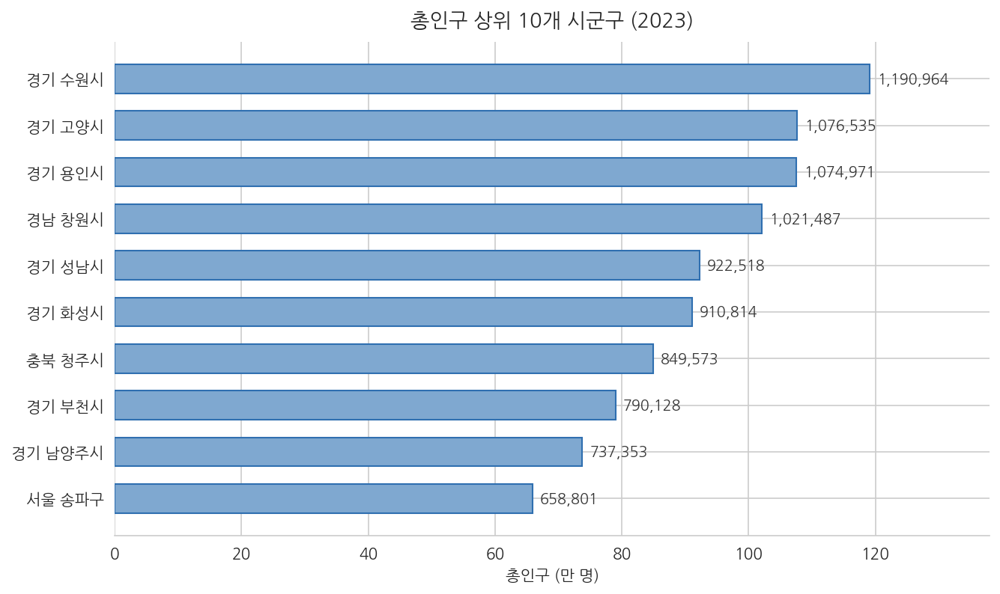
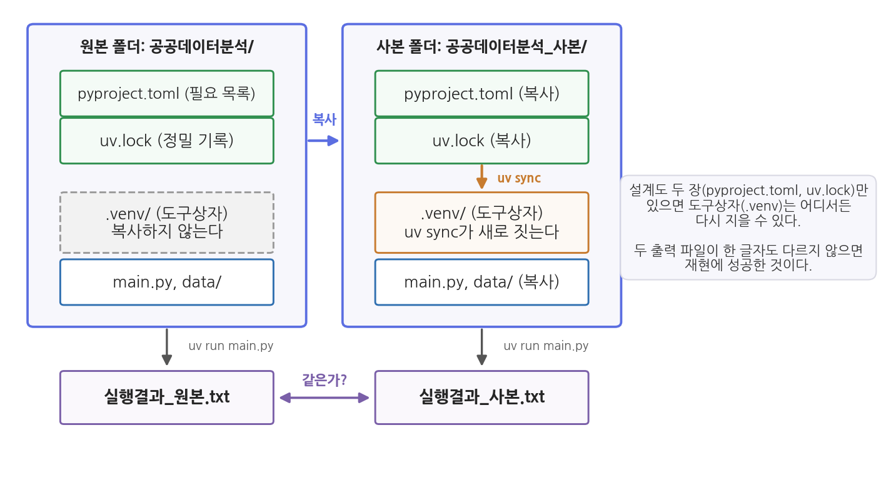

# 3주차 2회차. 에이전트로 분석 환경 구축하기

## 이 실습에서 하는 것

1회차에서 분석 환경의 설계도(로컬, 터미널, 파이썬과 패키지, uv, 폴더 구조)를 이해했다. 오늘은 그 설계도대로 여러분의 노트북에 실제 환경을 짓는다. 단, 짓는 것은 에이전트다. 여러분은 설치 명령을 한 줄도 외우지 않는다. 대신 에이전트에게 지시하고, 에이전트가 명령을 실행하는 과정을 관찰하고, 완성된 환경을 검증한다. 오늘 만든 환경 위에서 남은 학기의 모든 분석이 돌아간다. 다음 주(4주차)의 첫 Skill도, 6주차의 MCP 수집도 이 환경에서 실행된다.

이 실습이 끝나면 다음이 갖춰진다.

- 노트북에 설치된 uv (버전 확인까지 완료)
- 공공데이터분석 폴더의 uv 프로젝트 (pyproject.toml, uv.lock, .venv)
- 설치된 분석 패키지 4종 (pandas, matplotlib, seaborn, koreanize-matplotlib)과 뒤 주차를 위해 추가한 2종 (scipy, scikit-learn)
- 첫 분석 실행 결과: sigungu_2023.csv의 요약통계 출력과 산출물 폴더의 요약통계 표 파일
- 산출물 폴더의 첫 그림 파일 (총인구 상위 10개 시군구 막대그래프)
- 사본 폴더에서 환경을 다시 지어 같은 결과가 나오는지 확인한 재현 테스트
- 메모 폴더의 '환경보고서_3주차.md', 새로 만든 code 폴더, CLAUDE.md에 추가된 실행 규칙·폴더 규칙

## 준비물

| 구분 | 내용 |
|------|------|
| 폴더 | 1주차에 만든 `공공데이터분석` 폴더 (VSCode로 열어 둘 것) |
| 데이터 | `data/sigungu_2023.csv` (2주차 실습에서 넣어 둔 그대로. 전국 229개 시군구 인구 지표, 출처: 행정안전부 주민등록인구통계·국가데이터처(옛 통계청) 인구동향조사, KOSIS에서 수집) |
| 도구 | VSCode + Claude Code, 인터넷 연결 (설치 파일과 패키지를 내려받는다) |
| 선수 내용 | 3주차 1회차 (uv의 세 명령, 가상환경, 폴더 구조), 2주차 (CLAUDE.md, 검증 손잡이) |

## 2.1 에이전트에게 uv 설치를 지시한다

**무엇을 왜 하는가.** uv는 파이썬 패키지가 아니라 컴퓨터에 한 번 설치해 두는 프로그램이다. 공식 문서(docs.astral.sh/uv)에 Windows용 설치 방법이 안내되어 있지만, 우리는 그 문서를 읽고 따라 하는 대신 에이전트에게 통째로 맡긴다. 다만 지시문에 두 가지 안전장치를 넣는다. 설치 전에 이미 설치되어 있는지 먼저 확인하게 하고(같은 것을 두 번 설치하는 헛수고 방지), 공식 문서의 방법을 쓰도록 못 박는다(출처를 알 수 없는 설치법 방지).

<div style="border:1px solid #cfe3d4;border-left:5px solid #2f8f4e;background:#f4fbf6;padding:12px 16px;margin:18px 0;border-radius:4px;">
<strong>지시문 예시</strong><br>
"이 컴퓨터에 uv가 설치되어 있는지 먼저 확인해 줘. 설치되어 있지 않으면, uv 공식 문서(docs.astral.sh/uv)에 나온 Windows 표준 방법으로 설치해 줘. 끝나면 uv --version을 실행해서 설치된 버전을 알려 줘."
</div>

**예상되는 에이전트의 행동과 결과.** 에이전트가 먼저 터미널에서 `uv --version` 같은 확인 명령을 실행한다(승인 요청이 뜬다). 설치되어 있지 않은 컴퓨터에서는 터미널에 "The term 'uv' is not recognized"(uv라는 명령을 모른다)라는 붉은 문구가 찍히고, 이를 읽은 에이전트가 공식 설치 명령의 실행 승인을 요청한다. 공식 문서의 Windows 설치 명령은 다음과 같은 모습이다.

```
powershell -ExecutionPolicy ByPass -c "irm https://astral.sh/uv/install.ps1 | iex"
```

패널에는 다음과 같은 순서로 줄이 쌓인다. 1주차에서 익힌 그 모양이다.

```
● 먼저 uv가 설치되어 있는지 확인하겠습니다.
  Bash(uv --version)                         ← 승인 요청
  ⎿ The term 'uv' is not recognized ...
● 설치되어 있지 않습니다. 공식 설치 방법으로 설치하겠습니다.
  Bash(powershell -ExecutionPolicy ByPass -c "irm https://astral.sh/uv/install.ps1 | iex")
                                             ← 승인 요청
```

확인 명령이 설치 명령보다 먼저 온 이유를 눈여겨보자. 지시문에 "먼저 확인해 줘"라고 적었기 때문이다. 이 한마디가 없으면 이미 설치된 컴퓨터에서도 설치부터 시도하는 일이 있다. 지시문의 한 문장이 에이전트의 행동 순서를 바꾸는 것을 여기서 처음 눈으로 보게 된다.

이번 승인은 여느 때보다 꼼꼼히 읽자. 이 명령은 "인터넷 주소 astral.sh에서 설치 스크립트를 내려받아(irm) 즉시 실행하라(iex)"는 뜻이다. 인터넷에서 받은 것을 곧바로 실행하는 일은 위험할 수 있는 행동이며, 주소가 공식 사이트일 때만 승인해야 한다. astral.sh는 uv를 만든 회사의 공식 주소이므로 승인해도 된다. 설치는 보통 1분 안에 끝나고, 완료 메시지가 터미널에 출력된다. 이미 설치된 컴퓨터라면 첫 확인 명령에서 바로 버전이 찍히고, 에이전트는 설치를 건너뛰고 그 버전을 보고한다. 이 경우에도 아래 검증은 그대로 한다.

**검증.** 확인 실행도 에이전트에게 시키되, 확인의 눈은 여러분이 맡는다. "새 터미널을 열어서 uv --version을 실행하고 결과를 보여 줘"라고 지시하자(설치 직후에는 새로 연 터미널이어야 uv를 인식한다). 여기서 요령이 하나 있다. 에이전트의 요약 보고("정상 설치되었습니다")만 읽고 넘어가지 말고, 아래쪽 터미널 패널에 실제로 찍힌 출력 원문을 직접 눈으로 확인하는 것이다.

```
uv 0.10.2
```

같은 버전 문구가 터미널에 남아 있으면 성공이다. 컴퓨터에 따라 `uv 0.10.2 (a788db7e5 2026-02-10)`처럼 괄호 안에 빌드 식별자와 날짜가 더 붙어 나오기도 하는데, 앞의 세 자리 숫자가 버전이므로 같은 것으로 보면 된다. 별것 아닌 확인이지만 의미가 있다. 에이전트의 말이 아니라, 에이전트가 일한 바로 그 통로(터미널)에 남은 출력을 여러분이 재확인한 것이다. 1회차 그림 3-1에서 본 "사람과 에이전트가 같은 문으로 드나든다"를 눈으로 확인한 셈이다. 터미널에 `uv --version`을 직접 타이핑해 보고 싶다면 해 보아도 좋지만, 이 과목의 기본 방식은 실행은 에이전트, 확인은 사람이다.

<div style="border:1px solid #ecd9c6;border-left:5px solid #c77b2f;background:#fdf9f4;padding:12px 16px;margin:18px 0;border-radius:4px;">
<strong>유의 · 설치 명령의 승인 기준</strong><br>
프로그램 설치는 파일 생성과 달리 컴퓨터 전체에 영향을 주는 행동이다. 승인 전에 최소 두 가지를 확인하는 습관을 들이자. (1) 명령 속의 인터넷 주소가 공식 사이트인가. (2) 에이전트가 설치하려는 것이 내가 지시한 바로 그 프로그램인가. 에이전트가 공식 문서와 다른 우회 방법(예: 다른 도구를 먼저 설치해서 그걸로 설치)을 제안한다면, 거부하고 "공식 문서의 표준 방법을 써 줘"라고 다시 지시하면 된다.
</div>

## 2.2 분석 프로젝트 생성과 패키지 설치

**무엇을 왜 하는가.** uv가 준비되었으니 공공데이터분석 폴더를 uv 프로젝트로 만들고(uv init), 분석 패키지 4종을 설치한다(uv add). 1회차 표 3-3에서 본 두 명령이 실전에 등장하는 순간이다.

<div style="border:1px solid #cfe3d4;border-left:5px solid #2f8f4e;background:#f4fbf6;padding:12px 16px;margin:18px 0;border-radius:4px;">
<strong>지시문 예시</strong><br>
"지금 열려 있는 이 폴더를 uv 프로젝트로 만들어 줘. 그다음 pandas, matplotlib, seaborn, koreanize-matplotlib 네 개 패키지를 uv add로 설치해 줘. 기존에 있던 파일(README.md, data 폴더 등)은 건드리지 말 것. 끝나면 (1) 새로 생긴 파일과 폴더의 목록, (2) pyproject.toml의 내용을 보여 줘."
</div>

**예상되는 에이전트의 행동과 결과.** 에이전트가 `uv init`을 실행하면 높은 확률로 오류가 하나 난다.

```
error: The current directory (`공공데이터분석`) is not a valid package name.
Please provide a package name with `--name`.
```

uv는 폴더 이름으로 프로젝트 이름을 지으려 하는데, 한글 폴더 이름은 파이썬 프로젝트 이름 규칙(영문·숫자)에 맞지 않아 거절당한 것이다. 당황할 필요 없다. 그리고 관찰하라. 에이전트는 이 오류 문구를 읽고, 스스로 `uv init --name public-data` 같은 영문 이름을 붙인 명령으로 고쳐서 재시도할 것이다. 2주차에서 배운 에이전트 루프(행동 → 관찰 → 계획 수정)가 오류 앞에서 작동하는 생생한 장면이다. 만약 에이전트가 헤매면 "영문 프로젝트 이름을 지정해서 다시 시도해 줘"라고 거들면 된다.

재시도가 성공하면 터미널에는 짧은 한 줄만 찍힌다.

```
Initialized project `public-data`
```

오류는 길고 성공은 짧다. 터미널의 일반적인 성질이며, 그래서 성공을 확인하는 자리는 이 한 줄이 아니라 탐색기에 새로 생긴 파일들이다.

`uv init`이 성공하면 pyproject.toml, main.py, .python-version, .gitignore 등이 생긴다(기존 README.md는 그대로 남는다). 이어지는 `uv add`에서는 터미널에 다운로드 기록이 줄줄이 흐른 뒤, 설치된 패키지 목록이 출력된다. 이 교재를 준비하며 실행했을 때의 출력은 다음과 같았다(버전 숫자는 설치 시점에 따라 달라진다).

```
Resolved 16 packages in 193ms
Installed 15 packages in 1.60s
 + contourpy==1.3.3
 + koreanize-matplotlib==0.1.1
 + matplotlib==3.11.1
 + numpy==2.5.2
 + pandas==3.0.5
 + pillow==12.3.0
 ...
```

가운데를 생략하지 않으면 다음 15줄이 전부다. 알파벳 순서로 정렬되어 있어 눈으로 찾기 쉽다.

```
 + contourpy==1.3.3
 + cycler==0.12.1
 + fonttools==4.64.0
 + kiwisolver==1.5.1
 + koreanize-matplotlib==0.1.1
 + matplotlib==3.11.1
 + numpy==2.5.2
 + packaging==26.3
 + pandas==3.0.5
 + pillow==12.3.0
 + pyparsing==3.3.2
 + python-dateutil==2.9.0.post0
 + seaborn==0.13.2
 + six==1.17.0
 + tzdata==2026.3
```

처음 내려받는 컴퓨터에서는 Resolved 줄과 Installed 줄 사이에 Prepared라는 줄이 하나 더 보인다. 인터넷에서 파일을 받아 설치할 준비를 마쳤다는 뜻이다. 두 번째부터는 uv가 보관해 둔 것을 다시 쓰므로 이 줄이 사라지고 시간도 짧아지는데, 2.9절의 재현 테스트에서 이 차이를 눈으로 확인하게 된다.

여기서 이상한 점을 하나 발견할 것이다. 분명 4개를 시켰는데 목록에는 numpy, pillow 등 처음 보는 이름까지 15개가 찍힌다. 오류가 아니다. pandas가 일하려면 numpy(수치 계산 패키지)가 필요하고, matplotlib가 그림을 저장하려면 pillow(이미지 패키지)가 필요하다. 이렇게 패키지가 기대는 다른 패키지를 의존성(dependency)이라 하며, uv가 필요한 의존성을 알아서 함께 설치해 준 것이다. 탐색기에는 .venv 폴더와 uv.lock 파일도 새로 보인다.

**검증.** 세 군데를 눈으로 확인한다.

1. 탐색기에서 pyproject.toml을 클릭해 열고, `dependencies` 항목에 지시한 4개 패키지 이름이 모두 들어 있는지 확인한다.
2. 탐색기에 .venv 폴더와 uv.lock 파일이 생겼는지 확인한다. (uv.lock을 열어 보면 수백 줄의 버전 기록이 보인다. 읽는 법은 다음 단계에서 배운다.)
3. 1주차에 만든 README.md와 data 폴더가 그대로인지 확인한다. "건드리지 말 것"이라는 제약이 지켜졌는가도 검증 대상이다.

## 2.3 설계도 읽기: pyproject.toml과 uv.lock

**무엇을 왜 하는가.** 1회차 1.4절에서 pyproject.toml은 재료 목록, uv.lock은 상표와 중량까지 적은 영수증이라고 배웠다. 두 파일은 uv가 관리하므로 고칠 일은 없지만 읽을 줄은 알아야 한다. "이 패키지가 설치되어 있나", "어떤 버전인가"라는 질문은 전부 이 두 파일에서 확인하기 때문이다. 설명은 에이전트에게 시키되, 그 설명이 파일 내용과 맞는지는 여러분이 파일을 열어 대조한다.

<div style="border:1px solid #cfe3d4;border-left:5px solid #2f8f4e;background:#f4fbf6;padding:12px 16px;margin:18px 0;border-radius:4px;">
<strong>지시문 예시</strong><br>
"pyproject.toml과 uv.lock 두 파일을 읽고 처음 보는 사람에게 설명해 줘. (1) pyproject.toml의 dependencies에 적힌 각 줄이 무슨 뜻인지, 특히 >= 기호의 의미, (2) uv.lock에 기록된 패키지가 모두 몇 개인지 파일에서 직접 세어서, (3) 그중 pandas와 numpy의 정확한 버전, (4) 내가 numpy를 설치하라고 한 적이 없는데 왜 들어 있는지를 uv.lock의 어느 부분을 근거로 답할 수 있는지 알려 줘. 두 파일에 없는 내용은 없다고 답해 줘."
</div>

**예상되는 에이전트의 행동과 결과.** 이번에는 터미널 대신 파일 읽기 도구가 두 번 쓰인다. 에이전트는 먼저 pyproject.toml의 dependencies 부분을 인용한다.

```
dependencies = [
    "koreanize-matplotlib>=0.1.1",
    "matplotlib>=3.11.1",
    "pandas>=3.0.5",
    "seaborn>=0.13.2",
]
```

그리고 `>=`가 "이 버전 이상이면 된다"는 느슨한 조건이며, 실제로 무엇이 설치되었는지는 uv.lock이 정확히 못 박는다고 설명한다. uv.lock에 대해서는 `[[package]]`로 시작하는 덩어리를 세어 개수를 보고하는데, 이 교재를 준비하며 실행했을 때는 16개였다. 15개 패키지에 프로젝트 자신(public-data)이 하나의 덩어리로 더해진 수다. 이어서 pandas 덩어리를 인용한다.

```
[[package]]
name = "pandas"
version = "3.0.5"
dependencies = [
    { name = "numpy" },
    { name = "python-dateutil" },
    ...
]
```

이 덩어리의 dependencies 줄이 (4)번의 답이다. numpy는 여러분이 아니라 pandas가 요구한 것이고, 그 사실이 uv.lock에 적혀 있다.

**검증.** 에이전트의 설명을 파일에서 확인한다. (1) pyproject.toml을 열어 dependencies가 4줄이고 알파벳순임을 본다. (2) uv.lock을 열고 찾기(Ctrl+F)로 `name = "pandas"`를 검색해 바로 아랫줄의 version 값이 에이전트가 말한 버전과 같은지 대조한다. (3) 같은 찾기 창에 `[[package]]`를 넣으면 검색 결과 개수가 표시된다. 에이전트가 보고한 개수와 같은가. (4) pandas 덩어리 안의 dependencies에 numpy가 정말 있는지 본다. 에이전트가 "pandas가 numpy를 씁니다"라고 상식으로 답했는지, 파일을 근거로 답했는지는 이 줄을 가리켰는가로 구분된다.

<div style="border:1px solid #ecd9c6;border-left:5px solid #c77b2f;background:#fdf9f4;padding:12px 16px;margin:18px 0;border-radius:4px;">
<strong>유의 · uv.lock은 손으로 고치지 않는다</strong><br>
두 파일 모두 uv가 관리한다. 특히 uv.lock은 실제 설치 내용과 한 글자도 어긋나면 안 되는 기록이므로, 읽는 것은 좋지만 편집기에서 고치지 않는다. 패키지를 넣고 빼는 방법은 uv add와 uv remove뿐이며, 그때 두 파일은 uv가 알아서 고쳐 쓴다. 에이전트가 이 파일들을 직접 편집하려 하면 거부하고 uv 명령을 쓰게 한다.
</div>

**버전을 못 박는다는 것.** uv.lock을 조금만 더 파 보자. 방금 본 pandas 덩어리에는 버전과 의존성 말고도 한 가지가 더 적혀 있다. 이 패키지의 실제 파일을 어디서 받았고, 받은 파일이 정말 그 파일인지 확인하는 값이다.

<div style="border:1px solid #cfe3d4;border-left:5px solid #2f8f4e;background:#f4fbf6;padding:12px 16px;margin:18px 0;border-radius:4px;">
<strong>지시문 예시</strong><br>
"uv.lock에서 pandas 덩어리를 다시 찾아, version 줄과 source 줄, 그리고 wheels 목록에서 파일 이름에 win_amd64가 들어간 줄 하나를 그대로 인용해 줘. 그다음 그 줄의 hash가 무엇을 보증하는 값인지 두 문장으로 설명해 줘. 파일에 없는 내용은 지어내지 말고 없다고 답할 것."
</div>

에이전트가 인용해 오는 부분은 다음과 같은 모습이다. 주소가 길어 가운데를 줄였다.

```
[[package]]
name = "pandas"
version = "3.0.5"
source = { registry = "https://pypi.org/simple" }
wheels = [
    { url = ".../pandas-3.0.5-cp314-cp314-win_amd64.whl",
      hash = "sha256:cd8f7c6dc98527058ee6264219343f5392240a6f1bfa654fc5d79023020d0c92",
      size = 9951806 },
]
```

세 가지가 적혀 있다. version은 무슨 버전인지, source는 어디서 받았는지(PyPI, 곧 1회차에서 본 파이썬의 앱스토어), hash는 받은 파일이 그때 그 파일이 맞는지 확인하는 지문이다. 파일이 한 글자라도 다르면 이 지문이 달라지므로, 다른 컴퓨터에서 uv가 정말 같은 파일을 받았는지 대조할 수 있다. 파일 이름 속의 win_amd64는 Windows용이라는 뜻이고, 같은 pandas 3.0.5라도 운영체제마다 다른 파일이 준비되어 있어서 목록이 그렇게 길다. 여러분의 노트북에 실제로 설치된 것은 그중 win_amd64 한 줄이다.

확인은 손으로 한다. uv.lock을 열고 찾기(Ctrl+F)에 `win_amd64`를 넣어 pandas 덩어리 안의 줄로 이동한 뒤, 파일 이름 안의 3.0.5와 hash의 앞 여덟 자리(cd8f7c6d)를 눈으로 대조해 보라. 이 여덟 자리를 외울 필요는 없다. 다만 uv.lock이 "pandas가 필요하다" 수준이 아니라 "이 파일을 받아서 넣었다" 수준의 기록이라는 것은 한 번 눈으로 봐 두어야 한다.

<div style="border:1px solid #e0d8ea;border-left:5px solid #7a5fa8;background:#faf8fc;padding:12px 16px;margin:18px 0;border-radius:4px;">
<strong>왜 버전을 숫자 하나까지 적어 두는가?</strong><br>
지나쳐 보일 수 있다. 그러나 패키지는 계속 개량되고, 그 과정에서 계산의 기본값이나 결과를 보여 주는 방식이 바뀌기도 한다. 같은 코드가 1년 뒤에 조금 다른 숫자나 다른 모양의 표를 내놓는 일이 그래서 생긴다. 보고서나 논문이라면 이것은 곧 재현 실패다. uv.lock은 "그때 그 도구로 계산했다"를 파일 한 장으로 증명하는 장치이며, 14주차에 제출할 재현 꾸러미의 핵심이 여기에 있다. 거꾸로 말하면 이 파일을 빼놓고 코드만 건네주는 것은 재료 이름만 적어 주고 조리법을 다 넘긴 척하는 것과 같다.
</div>

## 2.4 첫 실행: CSV를 읽고 요약통계 출력

**무엇을 왜 하는가.** 환경이 완성되었는지는 목록이 아니라 실행으로 증명된다. 첫 과제는 소박하게, sigungu_2023.csv를 읽어 기초 정보와 요약통계를 출력하는 것이다. 2주차에는 에이전트가 이 파일을 "눈으로 훑어" 답했다면, 오늘은 pandas로 "계산해서" 답한다.

<div style="border:1px solid #cfe3d4;border-left:5px solid #2f8f4e;background:#f4fbf6;padding:12px 16px;margin:18px 0;border-radius:4px;">
<strong>지시문 예시</strong><br>
"main.py를 다음 내용으로 다시 작성해 줘. data 폴더의 sigungu_2023.csv를 pandas로 읽어서 (1) 행과 열의 개수, (2) 열 이름 목록, (3) 총인구·고령인구비율·합계출산율 세 열의 요약통계(개수, 평균, 최솟값, 최댓값 포함), (4) 총인구가 가장 많은 시군구와 가장 적은 시군구를 출력할 것. 코드 각 부분에 한국어 주석을 달고, uv run main.py로 실행해서 결과를 보여 줘."
</div>

**예상되는 에이전트의 행동과 결과.** 에이전트가 main.py를 고쳐 쓰고(원래 들어 있던 "Hello from ..." 인사 코드를 지우고 새 코드를 넣는다), `uv run main.py`의 실행 승인을 요청한다. 실행 결과는 대략 다음과 같은 모습이어야 한다(소수점 자리수는 코드에 따라 다를 수 있다).

```
행과 열의 개수: (229, 12)
               총인구   고령인구비율    합계출산율
count      229.000  229.000  228.000
mean    224624.620   24.980    0.823
min       8996.000   10.677    0.320
max    1190964.000   45.278    1.651
총인구 최대: 경기 수원시 1190964
총인구 최소: 경북 울릉군 8996
```

- 행과 열: 229행, 12열
- 총인구: 평균 약 224,625명, 최댓값 1,190,964명(경기 수원시), 최솟값 8,996명(경북 울릉군)
- 고령인구비율: 평균 약 25.0%, 최댓값 약 45.3%(경북 의성군)
- 합계출산율: 평균 약 0.823, 최솟값 0.320(부산 중구), 최댓값 1.651(전남 영광군)

실제 화면에는 위의 예시보다 줄이 조금 더 많다. pandas의 요약통계는 여덟 줄이 기본이기 때문이다. 코드에 따라 반올림 자리수는 달라지지만 줄의 구성은 다음과 같다.

```
             총인구  고령인구비율   합계출산율
count       229.000   229.000   228.000
mean     224624.620    24.980     0.823
std      223012.333     8.851     0.213
min        8996.000    10.677     0.320
25%       50186.000    17.519     0.688
50%      146701.000    22.707     0.790
75%      337416.000    32.206     0.916
max     1190964.000    45.278     1.651
```

여덟 줄의 이름은 차례로 개수, 평균, 표준편차, 최솟값, 25% 지점, 50% 지점(중앙값), 75% 지점, 최댓값이다. 오늘 쓰는 것은 첫 줄(count)과 mean, min, max 네 줄이고, 나머지 네 줄은 9주차 EDA에서 분포를 다룰 때 본격적으로 쓴다. 다만 한 줄만 미리 짚어 두자. 총인구의 50% 지점은 146,701명인데 평균은 224,625명이다. 절반이 넘는 시군구가 평균보다 작다는 뜻이며, 수원시처럼 큰 곳 몇 군데가 평균을 끌어올렸기 때문이다. 평균 하나만 보고 "보통의 시군구는 22만 명쯤"이라고 말하면 틀린 그림을 그리게 된다는 것을 여기서 미리 만나 둔다.

**검증.** 두 가지를 한다.

**검증 1: 아는 값과 대조.** 행 수 229는 2주차 실습에서 확인했던 시군구 수와 같은가. 총인구 1위로 보고된 시군구를 탐색기에서 CSV를 직접 열어 찾아본다. 찾기(Ctrl+F)로 "수원시"를 검색하면 파일의 32번째 줄(첫 줄은 열 이름)에 `경기,수원시,1190964.0,...`이 나온다. 화면의 값과 일치하는가.

**검증 2: 이상한 숫자 하나를 추궁한다.** 출력된 요약통계에서 "개수(count)" 줄을 보라. 총인구는 229인데 합계출산율은 228이다. 시군구는 229개인데 왜 출산율 값은 228개뿐인가. 에이전트가 이 차이를 먼저 언급했는가? 대부분 언급 없이 지나간다. 더 나쁜 경우에는 요약 문장에 "229개 시군구의 합계출산율 평균은 0.823"이라고 적기도 한다. 표는 그럴듯하게 뽑지만 그 안의 이상 신호까지 챙겨 보고하지는 않는 것, 이것이 에이전트 보고의 전형적인 빈틈이다. 다음 지시로 추궁해 보자.

<div style="border:1px solid #cfe3d4;border-left:5px solid #2f8f4e;background:#f4fbf6;padding:12px 16px;margin:18px 0;border-radius:4px;">
<strong>지시문 예시</strong><br>
"요약통계에서 합계출산율의 개수가 228로 총인구(229)보다 1 적다. 어느 시군구의 값이 비어 있는지 데이터에서 직접 확인해서 알려 줘. 추측하지 말고 코드로 확인할 것."
</div>

에이전트가 결측값을 찾는 코드를 실행하면, 경북 군위군의 합계출산율(과 출생아수)이 비어 있다는 답이 나온다. CSV 파일의 73번째 줄을 열어 보면 군위군 행의 끝이 쉼표 두 개로 끝나 있다. 값이 비어 있는 칸을 결측값(missing value)이라 부르는데, 왜 생기고 어떻게 다루는지는 7주차의 주제다. 오늘 기억할 것은 하나다. 평균 0.823은 229개가 아니라 228개의 평균이며, 그 사실은 검증하는 사람의 눈에만 보였다는 것.

## 2.5 산출물 남기기: 요약통계를 표 파일로 저장

**무엇을 왜 하는가.** 화면에 찍힌 출력은 대화가 끝나면 사라진다. 1회차 1.5절의 원칙대로 산출물은 코드가 만들고 산출물 폴더에 모아야 하므로, 방금의 요약통계를 파일로 저장하게 한다. 이번 지시문에는 저장할 폴더를 일부러 적지 않는다. 지시에 없는 것을 에이전트가 어떻게 정하는지 관찰하기 위해서다.

<div style="border:1px solid #cfe3d4;border-left:5px solid #2f8f4e;background:#f4fbf6;padding:12px 16px;margin:18px 0;border-radius:4px;">
<strong>지시문 예시</strong><br>
"방금 출력한 세 열의 요약통계를 CSV 파일로도 저장하도록 main.py를 고쳐 줘. 파일 이름은 요약통계_3주차.csv로 하고, 고친 뒤 uv run main.py를 다시 실행해서 파일이 어디에 생겼는지 전체 경로를 알려 줘."
</div>

**예상되는 에이전트의 행동과 결과.** 에이전트가 main.py에 저장 코드 한 줄(`to_csv`)을 보태고 다시 실행한 뒤 파일 경로를 보고한다. 여기서 에이전트가 틀리는 장면이 흔히 나온다. 폴더를 지정하지 않았으므로 파일을 프로젝트 폴더 맨 위에 만들거나, 심지어 원본이 있는 data 폴더 안에 넣기도 한다. 저장된 파일의 내용은 다음과 같다.

```
,총인구,고령인구비율,합계출산율
count,229.0,229.0,228.0
mean,224624.62,24.98,0.823
min,8996.0,10.677,0.32
max,1190964.0,45.278,1.651
```

**검증.** 탐색기에서 파일이 어디에 생겼는지부터 본다. 산출물 폴더가 아니면 재지시한다. "요약통계_3주차.csv를 산출물 폴더로 옮기고, main.py의 저장 경로도 산출물/요약통계_3주차.csv로 고쳐서 다시 실행해 줘. data 폴더에는 원본 파일만 둔다." 에이전트가 고친 뒤 탐색기를 다시 보아 산출물 폴더에만 파일이 있고 엉뚱한 자리의 파일은 지워졌는지 확인한다. 이 장면의 교훈은 에이전트의 잘못이라기보다 지시의 빈자리다. 지시에 없는 것은 에이전트가 정하고, 그 결정은 여러분의 폴더 규칙과 다를 수 있으며, 이 빈자리는 2.10절에서 CLAUDE.md의 영구 규칙으로 메운다. 위치가 바로잡혔으면 파일을 열어 count 줄이 229, 229, 228인지, max 줄의 총인구가 1190964.0으로 2.4절에서 본 수원시 값과 같은지 대조한다.

## 2.6 패키지 추가하기: 필요 목록은 자란다

**무엇을 왜 하는가.** 환경은 한 번 짓고 끝나는 것이 아니라 필요할 때 늘려 간다. 10주차의 통계 검정에는 scipy가, 11주차의 텍스트 분석에는 scikit-learn이 필요하다. 지금 두 패키지를 추가하면서, 추가 전후로 pyproject.toml과 uv.lock이 어떻게 달라지는지 대조해 본다. 2.3절에서 읽는 법을 배운 두 파일이 검증의 근거다.

<div style="border:1px solid #cfe3d4;border-left:5px solid #2f8f4e;background:#f4fbf6;padding:12px 16px;margin:18px 0;border-radius:4px;">
<strong>지시문 예시</strong><br>
"scipy와 scikit-learn 두 패키지를 이 프로젝트에 추가해 줘. 반드시 uv add를 쓸 것. 추가하기 전에 pyproject.toml의 dependencies 부분과 uv.lock의 패키지 개수를 먼저 보여 주고, 추가한 뒤에 같은 두 가지를 다시 보여 줘서 무엇이 달라졌는지 비교해 줘. 끝나면 uv run으로 두 패키지를 import해서 설치된 버전을 출력해 줘."
</div>

**예상되는 에이전트의 행동과 결과.** 에이전트가 두 파일을 읽어 "추가 전" 상태(dependencies 4줄, 패키지 16개)를 보고한 뒤 `uv add scipy scikit-learn`의 승인을 요청한다. 실행 출력은 2.2절과 같은 꼴이다.

```
Resolved 22 packages in 137ms
Installed 6 packages in 1.37s
 + joblib==1.6.0
 + scikit-learn==1.9.0
 + scipy==1.18.1
 + threadpoolctl==3.6.0
 ...
```

"추가 후" 보고에는 dependencies가 6줄로, uv.lock의 패키지가 22개로 늘었다고 나온다. 시킨 것은 2개인데 6개가 설치된 이유는 2.2절에서 본 의존성이다. 버전 출력에서 한 가지를 눈여겨보자. 설치할 때의 이름은 scikit-learn이지만 코드에서 부를 때의 이름은 sklearn이다. 에이전트가 쓴 코드에 `import sklearn`이 보여도 오타가 아니다.

지시문에 "반드시 uv add를 쓸 것"을 넣은 데는 이유가 있다. 이 문구 없이 "설치해 줘"라고만 하면 에이전트가 `uv pip install scipy`를 쓰는 경우가 있다. 앞에 uv가 붙어 있어 승인 창에서 지나치기 쉽지만, 이 명령은 도구상자(.venv)에 패키지를 넣기만 하고 pyproject.toml과 uv.lock에는 아무것도 적지 않는다. 당장은 import가 되므로 틀린 줄 모르지만, 2.9절의 재현 테스트에서 사본 폴더를 지으면 scipy가 빠져 있다. 설치는 됐지만 기록이 안 된 상태이며, 아래 검증 (1)이 이것을 잡아낸다.

**검증.** (1) pyproject.toml을 열어 dependencies에 scikit-learn과 scipy 줄이 생겨 6줄인지 본다. 없다면 기록 없는 설치가 일어난 것이므로 "pyproject.toml에 기록되지 않았다. uv add scipy scikit-learn으로 다시 해 줘"라고 재지시하고 다시 확인한다. (2) uv.lock에서 `name = "scipy"`를 찾아 아랫줄의 버전이 에이전트가 출력한 버전과 같은지 대조한다. (3) 찾기 창의 `[[package]]` 개수가 추가 전보다 6 늘었는지 본다.

## 2.7 첫 그림 그려 보기: 총인구 상위 10개 시군구

**무엇을 왜 하는가.** 지금까지의 산출물은 숫자와 표였다. 이제 그림을 한 장 만든다. 그림 그리기는 환경 점검의 마지막 관문이기도 하다. 표 하나를 만드는 데는 pandas 하나면 되지만, 그림 한 장에는 값을 고르는 pandas, 그리는 matplotlib, 한글 글꼴을 붙여 주는 koreanize-matplotlib, 그림을 파일로 저장하는 pillow가 함께 움직인다. 2.2절에서 4개를 시켰더니 15개가 설치된 이유가 여기서 드러난다. 그림 파일이 산출물 폴더에 제대로 떨어지면 그 15개가 서로 맞물려 돌아간다는 뜻이다. 주제는 총인구 상위 10개 시군구다. 2.4절에서 1위 수원시와 최하위 울릉군만 보았으니, 위쪽 열 곳의 모습을 한눈에 보는 셈이다.

<div style="border:1px solid #cfe3d4;border-left:5px solid #2f8f4e;background:#f4fbf6;padding:12px 16px;margin:18px 0;border-radius:4px;">
<strong>지시문 예시</strong><br>
"main.py에 그림 그리는 부분을 추가해 줘. sigungu_2023.csv에서 총인구가 많은 상위 10개 시군구를 골라 가로 막대그래프를 그리고, 산출물 폴더에 상위10_총인구.png로 저장할 것. 조건은 네 가지야. (1) 막대 이름표에 시도와 시군구를 함께 적을 것. 같은 이름의 구가 여러 시도에 있기 때문이야. (2) 한글이 깨지지 않도록 koreanize-matplotlib를 쓸 것. (3) 막대 끝에 총인구 값을 숫자로 적을 것. (4) 저장이 끝나면 저장한 파일의 전체 경로와, 그림에 쓴 열 곳의 이름과 값을 순서대로 출력해서 내가 그림과 대조할 수 있게 해 줘."
</div>

**예상되는 에이전트의 행동과 결과.** 에이전트가 main.py에 matplotlib를 쓰는 부분을 붙이고 `uv run main.py`를 다시 실행한다. 화면에 그림 창이 뜨는 것이 아니라 파일이 저장되고, 터미널에는 지시한 대조용 목록이 찍힌다.

```
저장: C:\Users\사용자이름\Desktop\공공데이터분석\산출물\상위10_총인구.png
 1. 경기 수원시 1,190,964
 2. 경기 고양시 1,076,535
 3. 경기 용인시 1,074,971
 4. 경남 창원시 1,021,487
 5. 경기 성남시 922,518
 6. 경기 화성시 910,814
 7. 충북 청주시 849,573
 8. 경기 부천시 790,128
 9. 경기 남양주시 737,353
10. 서울 송파구 658,801
```

탐색기에서 산출물 폴더의 PNG 파일을 클릭하면 VSCode 안에서 그림이 열린다. 다음과 같은 모습이어야 한다.



그림 3-4를 읽는 법은 이렇다. 가로축은 총인구이고 단위는 만 명이며, 막대 끝에 붙은 숫자는 명 단위의 실제 값이다. 세로축은 시군구이고 위에서 아래로 인구가 많은 순서다. 여기서 알 수 있는 것은 세 가지다. 첫째, 1위 수원시(1,190,964명)와 10위 송파구(658,801명)의 차이가 1.81배로 상위권 안에서도 격차가 작지 않다. 둘째, 열 곳 가운데 일곱 곳이 경기도이고 서울은 송파구 한 곳뿐이다. 셋째, 100만 명을 넘는 곳이 수원시, 고양시, 용인시, 창원시 네 곳이다. 2.4절에서 본 최솟값 8,996명(경북 울릉군)을 옆에 놓으면, 같은 시군구라는 이름으로 불리는 행정단위 사이의 규모 차이가 얼마나 큰지 짐작할 수 있다.

그림을 보았으면 한 걸음 더 물어본다. 그림은 눈으로 보는 요약이고, 수치는 문장으로 쓸 수 있는 요약이다.

<div style="border:1px solid #cfe3d4;border-left:5px solid #2f8f4e;background:#f4fbf6;padding:12px 16px;margin:18px 0;border-radius:4px;">
<strong>지시문 예시</strong><br>
"방금 그린 상위 10개 시군구의 총인구를 모두 더하면 229개 시군구 총인구 합계의 몇 퍼센트인지 계산해 줘. 상위 10개의 합과 전체 합 두 값을 함께 보여 주고, 추측하지 말고 데이터에서 직접 계산할 것."
</div>

답은 9,233,144명과 51,439,038명, 곧 17.9%다. 시군구 개수로는 전체 229개의 4.4%에 해당하는 열 곳에 인구의 5분의 1 가까이가 모여 있는 셈이다. 이런 한 문장이 9주차 EDA에서 다루는 분포의 쏠림 이야기의 출발점이 된다.

**여기서 틀리는 장면.** 그림을 열었더니 시군구 이름 자리에 네모(□□ □□□)만 늘어서 있는 경우가 흔하다. 에이전트는 "그림을 저장했습니다"라고 정상 보고한다. 파일은 실제로 만들어졌고 크기도 정상이므로 그 보고가 거짓은 아니다. 다만 그림 안의 한글이 깨졌을 뿐이다. 원인은 대개 두 가지다. 코드에 `import koreanize_matplotlib` 줄이 아예 빠졌거나, 그 줄은 있는데 뒤에 그래프 스타일을 설정하는 줄(예: seaborn의 스타일 지정)이 와서 글꼴 설정을 원래대로 되돌린 것이다. 발견하는 방법은 그림을 눈으로 여는 것뿐이다. 터미널 출력도, 파일 크기도, 에이전트의 보고도 이 문제를 알려 주지 않는다.

<div style="border:1px solid #cfe3d4;border-left:5px solid #2f8f4e;background:#f4fbf6;padding:12px 16px;margin:18px 0;border-radius:4px;">
<strong>지시문 예시</strong><br>
"그림의 한글이 네모로 깨져 있어. 코드에서 koreanize_matplotlib를 가져오는 줄이 그래프 스타일을 설정하는 줄보다 뒤에 오도록 고치고, 다시 실행해서 저장해 줘. 무엇을 어떻게 바꿨는지도 알려 줘."
</div>

고친 뒤 그림을 다시 열어 이름이 제대로 보이는지 확인한다. 틀림, 발견, 재지시, 수정의 한 바퀴를 또 돈 것인데, 이번 틀림은 사람의 눈으로만 발견되는 종류였다는 점이 요지다.

**검증.** 네 가지를 확인한다. (1) 탐색기에서 산출물 폴더에 상위10_총인구.png가 있는가. 폴더 맨 위나 data 폴더에 생겼다면 2.5절과 같은 방식으로 재지시한다. (2) 그림을 열어 시군구 이름이 한글로 보이는가. (3) 그림의 1위 막대에 적힌 값(1,190,964)이 2.4절 요약통계의 총인구 최댓값과 같은가. 같은 파일에서 나온 값이므로 달라질 수 없고, 다르다면 다른 파일을 읽은 것이다. (4) 목록에서 한 곳을 골라 원본과 대조한다. 7위 충북 청주시는 CSV의 229번째 줄에 있고 총인구는 849573.0이다. 마지막 데이터 줄이 230번째 줄이니 청주시는 파일 거의 끝에 있는 셈인데, 그림에서는 7위에 놓여 있다. 파일 안의 순서(시도 이름 순)와 그림의 순서(인구 순)가 다르다는 것, 곧 정렬은 파일이 아니라 코드가 한 일이라는 것도 이 대조에서 함께 확인된다.

## 2.8 오류가 나면: 에이전트와 함께 디버깅하기

**무엇을 왜 하는가.** 오류는 분석 작업의 일상이므로 만났을 때의 절차를 미리 정해 둔다. 오늘 여기까지 오는 동안 붉은 글자를 한 번도 못 보았더라도, 남은 학기의 어느 날에는 반드시 만난다. 프로그래머들은 오류를 찾아 고치는 일을 디버깅(debugging)이라 부르는데, 에이전트 시대의 디버깅은 오류문을 읽고, 원인 설명과 수정안을 에이전트에게 시키고, 고쳐진 것을 확인하는 순환이다. 이 절은 그 순환을 정리해 둔 곳이니 지금 읽어 두었다가 실제로 오류를 만난 날 다시 펴 보면 된다.

먼저 읽는 법이다. 파이썬 오류문은 아래에서 위로 읽는다. 화면이 길고 험하게 생겼어도 오류의 이름과 핵심 메시지는 맨 마지막 줄에 있고, 그 한 줄에 원인이 그대로 적혀 있는 경우가 많다. 예를 들어 `FileNotFoundError: [Errno 2] No such file or directory: 'data/sigungu_2024.csv'`는 "그런 파일이나 폴더가 없다"는 뜻이며, 없다고 말하는 그 경로까지 함께 알려 준다. pandas처럼 여러 겹으로 된 패키지에서는 "The above exception was the direct cause of the following exception"이라는 문장을 사이에 두고 Traceback이 두 번 나오기도 하는데, 안쪽에서 난 오류를 잡아 다시 던졌기 때문이며 읽을 곳은 여전히 맨 아래다. 오류문은 컴퓨터의 비명이 아니라 진단서다.

다음은 에이전트에게 넘기는 방법이다. 요약하지 말고 화면에 찍힌 오류 메시지 전문을 그대로 붙여 준다. 에이전트가 직접 실행한 명령에서 난 오류라면 에이전트도 그 화면을 보고 있지만, "오류가 났어"라고만 하면 짐작으로 답할 여지가 생긴다. 그리고 고치는 것을 곧바로 시키지 않고 원인과 수정안을 먼저 요구한다. 무엇을 어떻게 바꿀지 듣고 나서 승인하는 것이 2주차에서 배운 계획 모드의 습관이다.

<div style="border:1px solid #cfe3d4;border-left:5px solid #2f8f4e;background:#f4fbf6;padding:12px 16px;margin:18px 0;border-radius:4px;">
<strong>지시문 예시</strong><br>
"방금 실행에서 아래 오류가 났어.<br>
(터미널에 찍힌 오류 메시지 전문을 그대로 붙여넣기)<br>
이 오류의 원인을 한 문장으로 설명하고, 어느 파일의 어느 부분을 무엇으로 바꿀 것인지 먼저 알려 줘. 고치는 것은 내가 좋다고 한 다음에 해 줘. 부탁하지 않은 다른 부분은 건드리지 말 것."
</div>

**예상되는 에이전트의 행동과 결과.** 에이전트는 마지막 줄을 짚어 원인을 말하고, 고칠 자리와 바꿀 내용을 알려 준다. 위의 예라면 "코드가 읽으려는 data/sigungu_2024.csv가 폴더에 없다"고 설명하고, data 폴더의 파일 목록을 확인한 뒤 코드의 파일 이름을 실제로 있는 sigungu_2023.csv로 바로잡겠다고 제안하는 식이다. 여기서 여러분이 판단할 것은 그 수정이 원인을 없애는가, 아니면 증상만 가리는가다. 예를 들어 열 이름을 찾지 못한다고 해서 그 열을 계산에서 빼 버리는 수정은 오류 메시지는 사라지게 하지만 결과를 바꾼다. 자주 있는 일이 하나 더 있다. 먼저 알려 달라고 했는데도 오류를 보자마자 고쳐 버리는 경우다. 오류를 고치려는 습성이 지시보다 강하게 작동한 것이며, 이럴 때는 "방금 무엇을 어떻게 고쳤는지 알려 줘"라고 되물어 바뀐 내용을 확인한다.

오류의 이름만 보고도 어디부터 볼지 짐작할 수 있으면 이 과정이 빨라진다. 자주 만나는 여섯 가지를 표 3-4로 정리해 둔다. 지금 외울 필요는 없고, 오류를 만난 날 이름으로 찾아보면 된다.

**표 3-4. 오류 메시지 읽는 법 (마지막 줄만 보면 된다)**

| 오류 이름 | 마지막 줄의 뜻 | 흔한 원인 | 가장 먼저 볼 곳 |
|------|------|------|------|
| FileNotFoundError | 그런 파일이나 폴더가 없다 | 파일 이름이나 확장자 오타, 폴더 위치 착각 | 메시지에 적힌 경로를 탐색기와 대조 |
| KeyError | 그런 이름의 열이 없다 | 열 이름 오타, 띄어쓰기 차이, 원본의 열 이름이 바뀜 | 열 이름 목록을 출력해 CSV 첫 줄과 대조 |
| UnicodeDecodeError | 지정한 문자 방식으로 이 파일을 풀 수 없다 | 파일은 UTF-8인데 EUC-KR로 읽음(또는 그 반대) | 인코딩 지정을 바꿔 다시 읽기 (utf-8-sig, cp949) |
| ModuleNotFoundError | 그런 패키지가 없다 | uv run 없이 실행했거나 uv add를 빠뜨림 | 실행에 쓰인 파이썬 경로에 .venv가 있는지 |
| ValueError | 이 값을 숫자로 바꿀 수 없다 | 숫자 열에 천 단위 쉼표나 기호가 섞임 | 그 열의 값 몇 개를 그대로 출력해 확인 (7주차) |
| PermissionError | 이 파일에 접근할 수 없다 | 엑셀 등 다른 프로그램이 그 파일을 열어 두고 있음 | 파일을 닫고 다시 실행 |

수정안이 납득되면 그때 고치게 하고, 고친 뒤에는 반드시 같은 지시를 다시 실행시킨다. 오류가 사라졌다는 말이 아니라 원래 하려던 일이 되었다는 것을 확인해야 하기 때문이다.

<div style="border:1px solid #cfe3d4;border-left:5px solid #2f8f4e;background:#f4fbf6;padding:12px 16px;margin:18px 0;border-radius:4px;">
<strong>지시문 예시</strong><br>
"그렇게 고쳐 줘. 고친 다음에는 아까와 같은 명령(uv run main.py)을 그대로 다시 실행해서 결과를 보여 주고, 실제로 바꾼 부분이 어디인지 알려 줘."
</div>

**검증.** 두 가지를 확인한다. (1) 실제로 바뀐 곳이 설명한 곳과 같은가. 편집기의 diff 화면에서 초록색 추가 줄과 붉은색 삭제 줄을 보면 알 수 있다. 오류를 고치면서 부탁하지 않은 다른 부분까지 함께 손보는 경우가 있으므로, 바뀐 줄이 예고된 한두 곳을 넘어서면 되돌리게 한다. (2) 다시 실행한 결과가 오류가 나기 전과 같은가. main.py라면 2.4절에서 본 값(229행, 총인구 최댓값 1190964, 합계출산율 평균 0.823)이 그대로 나와야 한다. 오류는 사라졌는데 숫자가 달라졌다면 원인이 아니라 증상을 고친 것이므로 무엇을 바꿨는지 다시 묻는다.

## 2.9 재현 테스트: 설계도 두 장으로 환경을 다시 짓는다

**무엇을 왜 하는가.** 1회차 1.4절에서 pyproject.toml과 uv.lock을 다른 컴퓨터로 가져가면 같은 환경이 다시 지어진다고 배웠다. 다른 컴퓨터가 없으니 같은 노트북의 다른 폴더로 흉내 낸다. 설계도 파일만 사본 폴더로 복사하고, 도구상자(.venv)는 복사하지 않은 채 uv에게 다시 짓게 한 뒤, 같은 코드가 같은 결과를 내는지 대조한다.

<div style="border:1px solid #cfe3d4;border-left:5px solid #2f8f4e;background:#f4fbf6;padding:12px 16px;margin:18px 0;border-radius:4px;">
<strong>지시문 예시</strong><br>
"재현 테스트를 하자. 바탕화면에 공공데이터분석_사본 폴더를 만들고, 이 프로젝트에서 pyproject.toml, uv.lock, .python-version, main.py 네 파일과 data 폴더만 복사해 줘. .venv 폴더는 절대 복사하지 말 것. 사본 폴더에도 빈 산출물 폴더를 만들어 줘. 그다음 사본 폴더에서 uv sync를 실행해 환경을 새로 만들고, 사본 폴더에서 uv run main.py를 실행한 출력을 사본 폴더의 산출물/실행결과_사본.txt로 저장해 줘. 원본 폴더에서도 같은 명령의 출력을 산출물/실행결과_원본.txt로 저장하고, 두 파일을 비교해서 다른 줄이 있는지, 있다면 몇 번째 줄이 어떻게 다른지 알려 줘."
</div>

**예상되는 에이전트의 행동과 결과.** 에이전트가 폴더 생성과 복사 명령을 실행하고(승인 창의 경로에 .venv가 없는지 읽어 두자), 사본 폴더에서 `uv sync`를 실행한다. 출력은 다음과 같은 모습이다.

```
Using CPython 3.14.3
Creating virtual environment at: .venv
Resolved 22 packages in 1ms
Installed 21 packages in 1.75s
 + numpy==2.5.2
 + pandas==3.0.5
 ...
```

2.2절 때와 달리 다운로드 없이 몇 초 만에 끝나는데, 한 번 내려받은 패키지를 uv가 컴퓨터 안에 보관해 두었다가 다시 쓰기 때문이다. 이어서 두 폴더에서 각각 main.py를 실행해 출력 파일을 만들고, "다른 줄이 없다"고 보고한다.



그림 3-5는 이 단계의 흐름이다. 왼쪽 원본 폴더에서 오른쪽 사본 폴더로 옮겨 가는 것은 초록색 설계도 두 장과 코드·데이터뿐이며, 회색 점선의 .venv는 두고 간다. 사본 폴더의 주황색 .venv는 복사된 것이 아니라 uv sync가 uv.lock을 읽고 새로 지은 것이고, 아래쪽 두 출력 파일이 같으면 재현에 성공한 것이다. 여기서 알 수 있는 것은 재현의 단위가 도구상자가 아니라 설계도라는 점이다. 도구상자는 크고 컴퓨터마다 다르지만 설계도는 작은 텍스트 파일 두 장이면 충분하며, 14주차에 분석 보고서와 함께 재현 꾸러미를 제출할 때 이 두 파일이 들어가는 이유다.

**검증.** (1) 탐색기에서 사본 폴더 안에 .venv가 새로 생겼는지 본다. (2) 두 출력 파일을 VSCode에서 직접 비교한다. 탐색기에서 실행결과_원본.txt를 오른쪽 클릭해 "Select for Compare"를 고르고, 실행결과_사본.txt를 오른쪽 클릭해 "Compare with Selected"를 고르면 두 파일이 나란히 열리며 다른 부분이 색으로 표시된다. 색이 하나도 없어야 하며, 229, 1190964, 0.823 세 값은 눈으로도 짚어 본다. (3) 사본 폴더의 uv.lock에서 `name = "pandas"`를 찾아 원본과 같은 버전인지 대조한다. 사본 폴더는 세 가지 확인이 끝나면 지워도 된다.

<div style="border:1px solid #e0d8ea;border-left:5px solid #7a5fa8;background:#faf8fc;padding:12px 16px;margin:18px 0;border-radius:4px;">
<strong>왜 .venv를 복사하지 않는가?</strong><br>
두 가지 이유다. 첫째, .venv 안에는 도구상자가 놓인 경로가 절대 경로로 박혀 있어 다른 자리로 옮기면 깨지기 쉽다. 둘째, 복사해 버리면 재현 테스트가 아니라 이사다. 오늘 확인하려는 것은 설계도만으로 같은 환경을 다시 지을 수 있는가이며, 그 답은 .venv 없이 지어 봐야 나온다. 거꾸로 uv.lock을 빼고 pyproject.toml만 가져갔다면 어떻게 될까. uv가 느슨한 조건(>=)을 만족하는 최신 버전을 새로 골라 설치하므로, 오늘은 같은 결과가 나오더라도 1년 뒤에는 다른 버전이 설치되어 결과가 달라질 수 있다. 정밀 기록이 재현의 열쇠라는 말은 이 뜻이다.
</div>

## 2.10 환경 검증: 무엇이 어디에 설치되었나 확인

**무엇을 왜 하는가.** 마지막으로 오늘 지은 환경의 준공 검사를 한다. 무엇이 어떤 버전으로 어디에 설치되었는지를 문서로 남겨 두면, 나중에 환경이 이상해졌을 때 비교 기준이 되고, 보고서에 "어떤 환경에서 분석했는가"를 밝힐 때의 근거가 된다.

<div style="border:1px solid #cfe3d4;border-left:5px solid #2f8f4e;background:#f4fbf6;padding:12px 16px;margin:18px 0;border-radius:4px;">
<strong>지시문 예시</strong><br>
"이 프로젝트의 환경을 점검해서 메모 폴더에 '환경보고서_3주차.md' 파일로 저장해 줘. 다음 항목을 포함할 것. (1) uv 버전, (2) 이 프로젝트가 쓰는 파이썬 버전, (3) pandas·matplotlib·seaborn·koreanize-matplotlib·scipy·scikit-learn의 설치된 버전, (4) 가상환경(.venv)의 위치, (5) uv run main.py의 실행 결과 요약, (6) 프로젝트 폴더 구조(.venv 내부는 제외), (7) 재현 테스트 결과 한 줄. 모든 값은 추측하지 말고 실제 명령을 실행해서 확인한 값만 적고, 각 값을 확인할 때 쓴 명령도 함께 기록해 줘."
</div>

**예상되는 에이전트의 행동과 결과.** 에이전트가 버전 확인 명령들을 차례로 실행하고(각각 승인 요청이 올 수 있다), 결과를 모아 마크다운 보고서를 메모 폴더에 저장한다. 보고서는 항목마다 "값"과 "확인 명령"이 짝지어진 모습이어야 한다. 지시문의 마지막 문장이 2주차에서 배운 "검증을 내장한 지시"다. 확인 명령까지 기록하게 하면, 보고서의 어떤 값이든 나중에 같은 명령으로 재확인할 수 있다.

**검증.** 보고서 파일을 열고 세 가지를 확인한다. 첫째, (1)번 uv 버전이 2.1절에서 터미널 출력으로 확인한 값과 같은가. 둘째, (3)번의 버전이 pyproject.toml의 `>=` 뒤 숫자를 베낀 것이 아니라 실제 설치 버전인가. 2.3절에서 배운 대로 uv.lock의 version 줄과 대조하면 구분된다. 셋째, 패키지 버전 하나를 골라 "보고서에 기록된 확인 명령을 다시 실행해서 출력을 보여 줘"라고 시키고, 터미널에 찍힌 출력 원문과 보고서의 값이 같은지 눈으로 대조한다.

**마무리: 오늘의 규칙을 CLAUDE.md에 새긴다.** 2주차에서 CLAUDE.md는 "매번 말하지 않아도 되는 영구 규칙"이라 배웠다. 오늘 확정된 규칙들을 새겨 두자. 2.5절에서 산출물이 엉뚱한 자리에 생긴 것도, 2.6절에서 기록 없는 설치를 걱정한 것도 아래 규칙이 있었다면 처음부터 막혔을 일이다. 규칙 하나는 오늘 새로 정한다. 1회차 1.5절에서 본 방 배치에는 원본(data)과 산출물이 있었는데, 그 둘을 잇는 코드 파일의 자리는 아직 정하지 않았다. 지금 code 폴더를 만들어 두는 이유는 다음 주부터 코드 파일이 빠르게 늘어나기 때문이다. 4주차에는 Skill이 만드는 프로파일링 코드가, 6주차에는 수집 코드가 차례로 쌓인다.

<div style="border:1px solid #cfe3d4;border-left:5px solid #2f8f4e;background:#f4fbf6;padding:12px 16px;margin:18px 0;border-radius:4px;">
<strong>지시문 예시</strong><br>
"먼저 폴더 맨 위에 code 폴더를 만들어 줘. 그다음 CLAUDE.md에 다음 규칙을 추가해 줘. (1) 파이썬 코드 실행은 항상 uv run을 사용할 것. (2) 패키지 추가가 필요하면 uv add를 쓰되, 추가 전에 나에게 무엇을 왜 설치하는지 알릴 것. (3) data 폴더의 원본 데이터 파일은 절대 수정하지 말 것. (4) 표·그림 등 분석 산출물은 산출물 폴더에 저장할 것. (5) 분석에 쓴 파이썬 코드 파일은 code 폴더에 저장할 것. (6) 보고서처럼 사람이 읽는 문서는 메모 폴더에 저장할 것. 추가한 뒤 CLAUDE.md 전체 내용을 보여 주고, 2주차에 적어 둔 기존 규칙이 지워지지 않았는지 함께 확인해 줘."
</div>

파일 수정이므로 편집기에 고치기 전과 후를 나란히 놓은 diff 화면이 뜬다. 2주차에서 익힌 그 화면이다. 초록색으로 표시된 추가 줄이 방금 지시한 여섯 줄인지, 붉은색으로 표시된 삭제 줄이 없는지를 보고 승인한다. 삭제 줄이 있다면 그것이 오늘의 위험 신호다. 파일을 고쳐 달라고 하면 에이전트가 전체를 다시 쓰면서 기존 문장을 요약해 버리는 일이 있기 때문이다. 마지막으로 한 가지만 짚어 두자. main.py는 uv가 프로젝트를 만들 때 함께 만든 시작용 파일이므로 폴더 맨 위에 그대로 둔다. code 폴더에 모으는 것은 오늘 이후로 새로 만드는 분석 코드 파일들이다. 기존 규칙이 보존된 채 새 규칙 여섯 줄이 더해진 것을 확인하면 오늘의 공사가 모두 끝난다.

## 2.11 선택 심화: 새 대화에서 환경보고서 독립 검산

**무엇을 왜 하는가.** 2.10절의 검증은 같은 대화 안에서 했다. 그런데 같은 대화의 에이전트는 방금 쓴 보고서를 기억하고 있어서, 재확인을 시켜도 그 값을 되풀이하기 쉽다. 2주차에서 배운 검증의 두 번째 겹, 곧 별도의 검증을 해 본다. 새 대화의 에이전트는 아까의 기억이 없는 상태에서 처음부터 조사한다. 두 보고서가 일치하면 믿을 근거가 늘고, 다르면 어느 쪽이 맞는지 따질 거리가 생긴다.

<div style="border:1px solid #cfe3d4;border-left:5px solid #2f8f4e;background:#f4fbf6;padding:12px 16px;margin:18px 0;border-radius:4px;">
<strong>지시문 예시</strong><br>
"메모 폴더에 환경보고서_3주차.md가 있는데, 그 파일은 읽지 말고 같은 항목(uv 버전, 파이썬 버전, 설치 패키지 6종의 버전, .venv 위치, 폴더 구조)을 처음부터 직접 명령을 실행해서 조사한 뒤 메모 폴더에 환경보고서_3주차_검산.md로 저장해 줘. 저장이 끝난 뒤에만 원래 보고서를 열어서 항목별로 같은지 다른지 표로 정리하고, 다른 항목이 있으면 어느 쪽이 맞는지 실행한 명령과 출력을 근거로 알려 줘."
</div>

**예상되는 에이전트의 행동과 결과.** 새 대화의 에이전트는 CLAUDE.md만 읽은 상태에서 확인 명령을 처음부터 실행하고 검산 보고서를 저장한 다음, 두 보고서를 항목별로 비교한 표를 보여 준다. 대개는 버전 항목이 모두 일치하고 폴더 구조 항목만 다르다. 검산 시점에는 검산 보고서 자체가 새로 생겨 있기 때문이며, 오류가 아니라 시점 차이다. 반대로 버전 항목이 다르다면 진짜 문제다. 원본 보고서에 pandas가 "3.0.5 이상"으로, 검산에 "3.0.5"로 적혀 있다면 원본은 pyproject.toml의 조건을 베낀 것이고 검산은 설치된 값을 측정한 것이다.

**검증.** 비교 표에서 불일치로 표시된 항목 하나를 골라, 그 항목의 확인 명령을 다시 실행시키고 터미널 원문과 두 보고서를 삼자 대조한다. 이 절차는 사람 손으로 새 대화를 열고, 읽지 말라고 당부하고, 비교시키는 일이었다. 13주차에는 이 검산을 전담하는 검증 서브에이전트(verifier)를 만들어, 당부하지 않아도 독립된 검산이 붙게 한다.

## 검증 체크리스트

- [ ] `uv --version`을 에이전트에게 실행시키고, 터미널에 출력된 버전 문구를 내 눈으로 확인했다
- [ ] pyproject.toml의 dependencies에 패키지 4개가 모두 기록되어 있다
- [ ] .venv 폴더와 uv.lock 파일이 생겼고, 1주차에 만든 README.md와 data 폴더는 변형되지 않았다
- [ ] uv.lock에서 pandas의 version 줄을 찾아 에이전트의 설명과 대조했고, `[[package]]` 개수가 보고와 같았다
- [ ] `uv run main.py`의 출력에서 229행 12열을 확인했고, 총인구 1위 시군구를 CSV 원본(32번째 줄)과 대조했다
- [ ] 합계출산율의 개수가 228인 이유(군위군 결측)를 에이전트를 시켜 확인했다
- [ ] 요약통계_3주차.csv가 산출물 폴더에 있고, max 줄의 총인구가 수원시 값과 같다
- [ ] uv.lock에서 pandas의 Windows용 wheel 줄을 찾아 sha256 값의 앞자리를 눈으로 확인했다
- [ ] scipy와 scikit-learn이 pyproject.toml에 기록되었고, uv.lock의 버전이 출력된 버전과 같다
- [ ] 산출물 폴더의 상위10_총인구.png를 열어 시군구 이름이 한글로 보이고 1위가 경기 수원시임을 확인했다
- [ ] 상위 10개 시군구의 인구 합이 전체 합의 17.9%라는 계산을 에이전트에게 시키고 두 값을 함께 받았다
- [ ] 표 3-4를 한 번 훑어, 오류가 났을 때 마지막 줄부터 읽고 메시지 전문을 에이전트에게 넘기는 절차를 확인했다
- [ ] 사본 폴더의 실행 결과가 원본과 한 줄도 다르지 않음을 비교 화면에서 확인했다
- [ ] 환경보고서_3주차.md의 값 하나를 확인 명령 재실행으로 터미널 출력과 대조했다
- [ ] 폴더 맨 위에 code 폴더가 생겼고, CLAUDE.md에 실행·설치·데이터·산출물·코드·문서 규칙 여섯 줄이 추가되었다
- [ ] CLAUDE.md의 diff 화면에 삭제된 줄이 없음을 확인하고 승인했다 (2주차에 적어 둔 기존 규칙이 보존되었다)

## 자주 겪는 문제

| 증상 | 원인 | 해결 |
|------|------|------|
| 설치 직후 터미널에서 `uv`를 찾을 수 없다고 한다 | 설치 전에 열려 있던 터미널은 새 프로그램을 모른다 | 터미널을 닫고 새로 열거나 VSCode를 재시작한 뒤 다시 시도 |
| uv 설치 명령이 보안 경고로 차단된다 | 백신 프로그램이나 학교·기관 보안 정책이 스크립트 실행을 막음 | 경고 내용을 읽고 판단하되, 학교 관리 노트북이라면 전산 담당자에게 문의 |
| `uv init`이 폴더 이름 오류를 낸다 | 한글 폴더 이름은 프로젝트 이름으로 쓸 수 없음 | 정상적인 상황이다. 에이전트가 `--name 영문이름`으로 재시도하는지 관찰 (2.2절) |
| `ModuleNotFoundError: No module named 'pandas'` | `uv run` 없이 실행해서 도구상자 밖의 파이썬이 나섬 | `uv run main.py`로 실행. CLAUDE.md 규칙이 있는지 확인 |
| `uv add`가 매우 느리거나 실패한다 | 네트워크 문제 (학교 와이파이 등) | 잠시 후 재시도. 에이전트에게 "다시 시도해 줘"라고 지시 |
| 요약통계의 숫자가 교재와 미세하게 다르다 | 다른 데이터 파일을 읽었거나 파일이 수정됨 | 에이전트에게 "읽은 파일의 전체 경로와 행 수를 보여 줘"라고 확인. 229행이 아니면 data 폴더의 파일을 점검 |
| 에이전트가 pip라는 도구로 설치하려 한다 | uv 이전의 전통적 설치 도구를 제안하는 경우가 있음 | 거부하고 "이 프로젝트는 uv만 사용해. uv add로 설치해 줘"라고 재지시 |
| uv.lock의 `[[package]]` 개수가 설치된 패키지 수보다 1 많다 | 프로젝트 자신(public-data)도 한 덩어리로 기록됨 | 정상이다. 설치 목록의 개수에 1을 더한 값과 대조 (2.3절) |
| 패키지가 import는 되는데 pyproject.toml에 없다 | `uv pip install`로 설치되어 기록이 남지 않음 | "uv add로 다시 추가해 줘"라고 재지시. 사본 폴더에서 재현되지 않는 원인이다 (2.6절) |
| 산출물 CSV를 엑셀로 열면 한글이 깨진다 | 엑셀이 파일의 문자 인코딩을 잘못 짐작함 | 에이전트에게 "저장할 때 encoding을 utf-8-sig로 지정해 줘"라고 지시. VSCode에서는 원래 정상으로 보인다 |
| 재현 테스트의 두 출력 파일이 다르다 | 출력에 실행 시각·경로가 포함되었거나, 사본에 uv.lock을 빼고 복사해 다른 버전이 설치됨 | 다른 줄의 내용을 보고 판단. 시각·경로면 무해, 숫자가 다르면 사본의 uv.lock 유무와 pandas 버전부터 대조 |
| 그림의 한글이 네모(□)로 깨진다 | koreanize-matplotlib를 가져오는 줄이 없거나, 스타일 설정 줄이 그 뒤에 와서 글꼴을 되돌림 | "koreanize_matplotlib를 스타일 설정보다 뒤에서 가져오도록 고치고 다시 저장해 줘"라고 재지시 (2.7절) |
| 그림 파일이 산출물 폴더에 없다 | 저장 경로를 지정하지 않아 폴더 맨 위에 생김 | 파일을 옮기게 하고, 코드 안의 저장 경로까지 함께 고쳤는지 확인 (2.7절) |
| 파일 저장에서 `PermissionError`가 난다 | 엑셀 등 다른 프로그램이 그 파일을 열어 두고 있음 | 그 파일을 닫고 다시 실행. 산출물 CSV를 엑셀로 열어 둔 채 재실행할 때 자주 난다 |
| 다음 주에 열어 보니 CLAUDE.md의 규칙이 지켜지지 않는다 | CLAUDE.md가 폴더 맨 위에 없거나 다른 폴더를 열고 작업 중임 | "지금 읽고 있는 CLAUDE.md의 전체 경로를 알려 줘"로 확인한 뒤 규칙을 인용시켜 재지시 (2.10절) |

## 제출 과제

**과제 3-A. 환경보고서.** '환경보고서_3주차.md'를 제출한다. 평가 기준은 일곱 항목이 모두 실측값(확인 명령 포함)으로 채워졌는가, 그리고 그중 한 값에 대해 "직접 재확인한 방법"을 보고서 끝에 한 문단 덧붙였는가다.

**과제 3-B. 예습 질문.** 군위군의 합계출산율은 왜 비어 있을까. 힌트: 2023년 7월에 군위군의 소속 행정구역이 바뀌었다. 어떤 변화였는지 찾아보고 두 문장으로 정리하라(출처 포함). 행정구역 개편이 데이터에 남기는 흔적은 7주차에서 본격적으로 다룬다.

**과제 3-C. 첫 그림.** 2.7절에서 만든 그림을 한 쪽으로 제출한다. (1) 상위10_총인구.png 파일과 그 파일이 저장된 폴더의 경로, (2) 그림에서 읽은 사실 두 문장(예: 1위와 10위의 배수, 상위 10개가 전체 인구에서 차지하는 비중). 두 문장 모두 근거 숫자를 함께 적을 것, (3) 그림을 만드는 과정에서 고쳐야 했던 것이 있었다면 무엇을 어떻게 고쳤는지 한 문장. 평가 기준은 (2)의 근거 숫자가 실제 데이터에서 계산된 값인가다.
