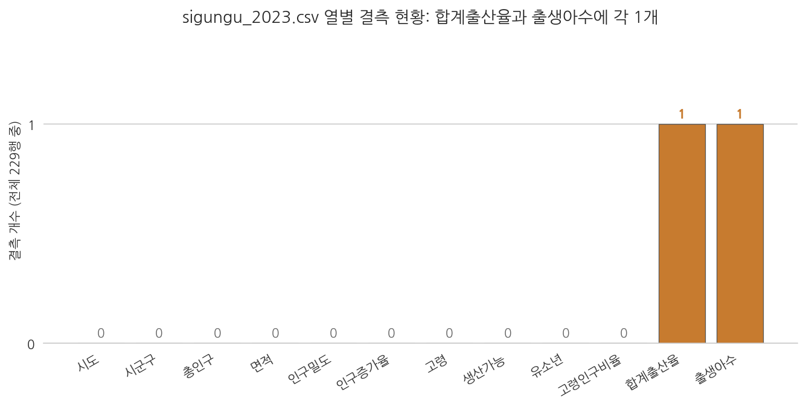
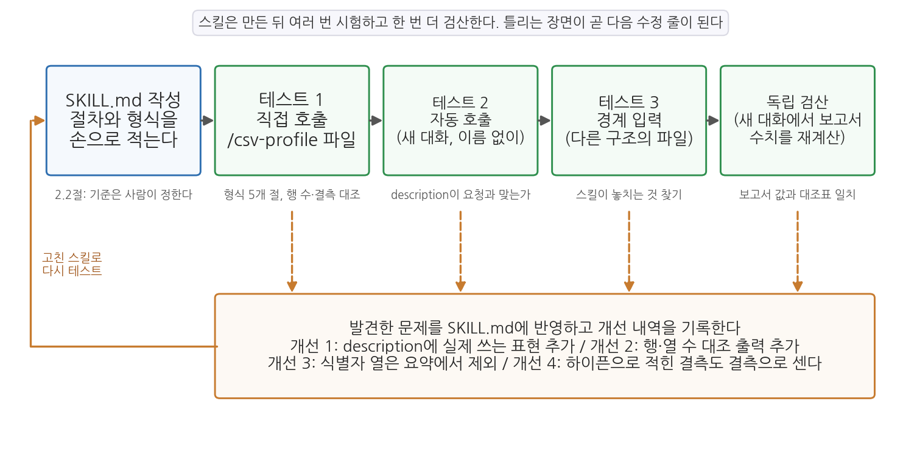

# 4주차 2회차. 나만의 첫 Skill 만들기

## 이 실습에서 하는 것

1회차에서 Skill(반복 절차의 표준화)을 원리로 배웠다. 오늘은 직접 만들어 본다. 재료는 앞으로 학기 내내 반복하게 될 작업, 곧 데이터 프로파일링이다. 새 데이터를 받으면 분석보다 먼저 신상명세(행·열·자료형·결측·요약통계)를 확인해야 하는데, 이 진단 절차가 전형적인 반복 작업이다.

진행은 세 단계다. 전반부에서는 프로파일링을 일회성 지시문으로 한 번 수행하며 절차 자체를 익힌다. 중반부에서는 그 절차를 SKILL.md 파일로 저장해 슬래시 커맨드 한 줄로 실행되게 만들고, 직접 호출과 자동 호출을 시험한다. 후반부에서는 스킬 산출물에 검증을 내장하고, 구조가 다른 데이터를 두 개 더 넣어 스킬이 놓치는 것을 찾아낸 뒤, 새 대화에서 보고서의 수치를 독립적으로 검산한다. 한 번은 손으로, 두 번째부터는 스킬로, 그리고 스킬이 만든 것도 검증한다. 이것이 오늘의 요지다.

이 실습이 끝나면 다음 산출물이 남는다.

- `산출물/` 폴더의 프로파일링 보고서 4개 (수동 실행 1개, 스킬 실행 3개: sigungu_2023, income_dist, sigungu_tfr_2013)
- `.claude/skills/csv-profile/SKILL.md`: 나의 첫 Skill (테스트에서 발견한 문제로 세 번 고친 상태)
- 새 대화에서 만든 독립 검산 대조표
- (선택 심화) 에이전트와 분업으로 만든 두 번째 스킬 `top-bottom`

## 준비물

| 구분 | 내용 |
|------|------|
| 폴더 | 1주차에 만든 `공공데이터분석` 폴더 (3주차에서 uv 환경을 갖춘 상태) |
| 데이터 | `data/sigungu_2023.csv` (전국 229개 시군구 인구 지표. 출처: 행정안전부 주민등록인구통계·국가데이터처(옛 통계청) 인구동향조사, KOSIS에서 수집. 2주차 실습에서 사용한 그 파일), `data/income_dist.csv` (2011-2023년 연도별 소득분배지표. 출처: 국가데이터처 소득분배지표, KOSIS에서 수집. 2.6에서 사용), `data/sigungu_tfr_2013.csv` (2013년 시군구별 합계출산율 264행 3열. 출처: 국가데이터처 인구동향조사, KOSIS에서 수집. 2.7에서 사용) |
| 도구 | VSCode + Claude Code 확장 |
| 선수 내용 | 4주차 1회차 (Skill, SKILL.md, 슬래시 커맨드), 3주차 2회차 (uv 환경, pandas 실행), 2주차 (지시 설계, CLAUDE.md, 지시문 라이브러리, 새 대화 독립 검산) |

## 2.1 반복 작업 고르기: 데이터 프로파일링

**무엇을 왜 하는가.** 스킬을 만들려면 먼저 표준화할 절차가 손에 익어 있어야 한다. 그래서 오늘의 첫 단계는 스킬 없이, 잘 쓴 지시문 하나로 프로파일링을 수행해 보는 것이다. 프로파일링(profiling)은 데이터의 신상명세를 확인하는 일이다. 몇 행 몇 열인지, 각 열의 자료형이 무엇인지, 빈칸(결측)은 어디에 몇 개인지, 값의 범위가 상식적인지. 건강검진처럼, 문제가 있어서 하는 것이 아니라 문제가 있는지 모르기 때문에 한다. 6주차부터 새 데이터를 수집할 때마다 이 진단을 반복하게 된다.

<div style="border:1px solid #cfe3d4;border-left:5px solid #2f8f4e;background:#f4fbf6;padding:12px 16px;margin:18px 0;border-radius:4px;">
<strong>지시문 예시</strong><br>
"data 폴더의 sigungu_2023.csv를 pandas로 열어서 프로파일링 보고서를 만들어 줘. 보고서에는 (1) 행 수와 열 수, (2) 열 이름 목록과 각 열의 자료형, (3) 결측값이 있는 열과 개수, 그리고 결측이 있는 행이 정확히 어느 시군구인지, (4) 주요 수치형 열(총인구, 고령인구비율, 합계출산율)의 최소·최대·평균·중앙값, (5) 값이 이상해 보이는 부분이 있으면 그 목록을 담아 줘. 결과는 '산출물/프로파일링_수동.md' 파일로 저장하고, 요약을 대화창에도 보여 줘."
</div>

**예상되는 에이전트의 행동과 결과.** 에이전트가 짧은 파이썬 코드를 작성해 uv 환경에서 실행한다(3주차에서 구축한 환경이 여기서 쓰인다). 코드 안에는 `df.info()`, `df.isnull().sum()`, `df.describe()` 같은 pandas 명령이 보일 것이다. `df.info()`가 출력하는 내용은 대략 다음과 같은 모양이다.

```text
RangeIndex: 229 entries, 0 to 228
Data columns (total 12 columns):
 #   Column  Non-Null Count  Dtype
---  ------  --------------  -----
 0   시도      229 non-null    str
 1   시군구     229 non-null    str
 2   총인구     229 non-null    float64
 ...
 10  합계출산율   228 non-null    float64
 11  출생아수    228 non-null    float64
```

읽는 법을 짚어 두자. 전체가 229행 12열이고, 열별로 "비어 있지 않은 값의 개수(Non-Null Count)"와 자료형(Dtype)이 나온다. 시도·시군구는 문자열(pandas 버전에 따라 `str` 대신 `object`로 표시된다), 나머지 열은 실수(float64)다. 그리고 결정적인 단서가 하나 있다. 합계출산율과 출생아수만 228이다. 전체 229행 중 한 행이 비어 있다는 뜻이다. 에이전트에게 결측 행을 짚어 달라고 했으므로, 보고서에는 그 행이 경북 군위군이라고 나올 것이다.



그림 4-3은 열별 결측 개수를 막대로 그린 것이다. 읽는 법은 간단하다. 12개 열 중 10개는 결측 0이고, 합계출산율과 출생아수 두 열만 각 1개의 결측(주황 막대)이 있다. 여기서 알 수 있는 것은 이 데이터가 전반적으로 온전하되 특정 지역·특정 항목에 구멍이 있다는 점이다. 에이전트에게 "결측 현황을 막대그래프로도 그려 줘"라고 덧붙이면 이런 그림을 받을 수 있다.

<div style="border:1px solid #ecd9c6;border-left:5px solid #c77b2f;background:#fdf9f4;padding:12px 16px;margin:18px 0;border-radius:4px;">
<strong>유의 · 결측에는 사연이 있다: 군위군</strong><br>
왜 하필 군위군만 비어 있을까. 경상북도 군위군은 2023년 7월 1일자로 대구광역시에 편입되었다. 행정구역이 바뀌는 시기의 데이터라서, 원천 통계에서 이 지역의 일부 값이 온전히 잡히지 않은 것으로 추정할 수 있다. 결측은 대개 이렇게 무작위가 아니라 사건과 겹쳐 있다. 데이터의 기준 시점과 행정구역 개편 문제는 6주차(메타데이터)와 7주차(정제)에서 본격적으로 다룬다.
</div>

대화창의 요약보다 중요한 것은 저장된 파일이다. 탐색기에서 `산출물/프로파일링_수동.md`를 열면 대략 다음과 같은 문서가 보인다. 절 제목과 표의 형식은 에이전트가 정한 것이라 실행마다 조금씩 다르지만, 담긴 사실은 같아야 한다.

```markdown
# sigungu_2023.csv 프로파일링 보고서

## 1. 행 수와 열 수
- 229행, 12열

## 2. 열 이름과 자료형
| 열 이름 | 자료형 |
|---|---|
| 시도, 시군구 | 문자열(object) |
| 총인구, 면적, 인구밀도, 인구증가율 | 실수(float64) |
| 고령, 생산가능, 유소년 | 실수(float64) |
| 고령인구비율, 합계출산율, 출생아수 | 실수(float64) |

## 3. 결측
| 열 | 결측 개수 | 결측이 있는 행 |
|---|---|---|
| 합계출산율 | 1 | 경북 군위군 |
| 출생아수 | 1 | 경북 군위군 |

## 4. 주요 수치형 열 요약
| 열 | 최솟값 | 최댓값 | 평균 | 중앙값 |
|---|---|---|---|---|
| 총인구 | 8,996 | 1,190,964 | 224,624.6 | 146,701 |
| 고령인구비율 | 10.68 | 45.28 | 24.98 | 22.71 |
| 합계출산율 | 0.320 | 1.651 | 0.823 | 0.790 |

## 5. 이상해 보이는 부분
- 총인구 최댓값이 최솟값의 약 132배: 오류가 아니라 실제 격차로 보임
```

이 보고서의 다섯 절이 지시문의 다섯 항목과 하나씩 대응한다는 점을 확인해 두라. 지시문에 "(1) 행 수와 열 수"라고 쓴 것이 1절이 되었고, "(5) 값이 이상해 보이는 부분"이라고 쓴 것이 5절이 되었다. 요청한 항목의 개수와 순서가 그대로 문서의 뼈대가 된 것이다. 2절도 눈여겨보자. 열 열두 개 중 문자열은 시도와 시군구 둘뿐이고 나머지 열 개는 모두 숫자다. 시군구 코드 같은 숫자 식별자가 없다는 뜻인데, 이 사실이 2.6에서 다른 파일을 다룰 때 문제가 된다. 이 파일에는 숫자로 저장된 식별자가 없어서 드러나지 않는 함정이 하나 숨어 있다.

기초통계도 몇 개 확인해 두자. 총인구의 최댓값은 경기 수원시(약 119.1만 명), 최솟값은 경북 울릉군(8,996명)이다. 합계출산율의 최댓값은 전남 영광군(1.651), 최솟값은 부산 중구(0.320)이고, 중앙값은 0.790이다. 고령인구비율은 울산 북구(10.68%)부터 경북 의성군(45.28%)까지 벌어진다. 같은 나라 안의 시군구인데 인구는 130배 넘게, 출산율은 5배 넘게 벌어진다. 프로파일링은 진단이지만, 이렇게 첫 분석 질문("왜 이렇게 다른가")을 낳는 출발점이기도 하다.

**검증.** 에이전트의 보고서에서 최소한 다음 세 가지를 직접 확인한다. 어느 줄을 보는지까지 적어 두었으니 그대로 따라가 보라. VSCode에서 CSV를 열면 왼쪽에 줄 번호가 보이고, 1번째 줄이 열 이름, 2번째 줄부터가 데이터다.

1. **행·열 수 대조.** 첫 줄(열 이름)의 항목을 세어 12개인지 확인한다. 쉼표가 11개면 열은 12개다. 파일 맨 아래로 내려가(Ctrl+End) 마지막 데이터 줄이 230번째 줄인지 본다. 230에서 열 이름 줄 하나를 빼면 229행이다.
2. **결측 위치 육안 확인.** 파일에서 "군위군"을 검색(Ctrl+F)하면 73번째 줄로 이동한다. 그 줄의 끝을 보라. 고령인구비율 값(44.18) 뒤에 쉼표 두 개가 연달아 붙고 아무것도 없다. 합계출산율과 출생아수 자리가 정말 비어 있는 것이다.
3. **통계값 표본 재검산.** 보고된 최댓값 하나를 고른다. "총인구 최대는 수원시"라면 "수원시"를 검색해 32번째 줄의 3번째 값(1190964.0)을 보고서의 수치와 대조한다. 합계출산율 최댓값이라면 180번째 줄(영광군)의 11번째 값 1.651, 최솟값이라면 124번째 줄(부산 중구)의 0.32다. 보고서의 "0.320"과 파일의 "0.32"는 같은 값이다.

한 가지 더, 검증 중에 발견하게 되는 미묘한 함정이 있다. 에이전트가 "합계출산율의 평균은 0.823"이라고 보고했다면 이 평균은 몇 개 값의 평균인가. 229개가 아니라 군위군을 뺀 228개다. pandas는 평균을 낼 때 결측값을 조용히 제외하며, 에이전트도 그 사실을 따로 밝히지 않고 넘어가는 일이 많다. 위의 보고서 예시에서도 3절에 결측이 적혀 있을 뿐, 4절의 평균이 228개로 계산되었다는 말은 어디에도 없다. 에이전트에게 "이 평균은 몇 개 값으로 계산했어?"라고 되물어 보라. 이런 되묻기가 2주차에서 배운 검증 내장 지시의 실전형이다.

이제 방금 입력한 지시문을 다시 보자. 6주차에 새 데이터를 수집하면 이 지시를 또 치게 된다. 그다음 주에도. 1회차의 기준으로 말하면, 여러분은 지금 "같은 지시를 세 번째 치기" 직전에 있다. 아래층으로 내릴 때다.

## 2.2 SKILL.md 작성: csv-profile

**무엇을 왜 하는가.** 2.1의 절차를 SKILL.md로 저장한다. 먼저 프로젝트 폴더 안에 스킬 폴더를 만든다. 에이전트에게 "`.claude/skills/csv-profile/` 폴더를 만들어 줘"라고 시키면 되고, VSCode 탐색기에서 직접 만들어도 된다. 위치는 `.claude/skills/csv-profile/`이다 (`.claude` 폴더는 2주차에 CLAUDE.md를 만들며 이미 생겼을 것이다). 그 안에 `SKILL.md` 파일을 만들고 아래 내용을 그대로 입력한다. 1회차에서 배운 구조 그대로, `---` 사이의 머리말과 그 아래 본문으로 되어 있다.

```markdown
---
name: csv-profile
description: CSV 파일을 받아 표준 형식의 데이터 프로파일링 보고서를 만든다.
  새 데이터 파일을 받았을 때, 데이터 개요·품질 진단·프로파일링을 요청받았을 때 사용.
---

사용자가 말한 CSV 파일의 프로파일링 보고서를 작성한다. 어떤 파일인지 분명하지 않으면 묻는다.

## 절차

1. 파일을 읽기 전에 파일이 실제로 존재하는지 확인한다. 한글이 깨져 보이면
   인코딩을 바꿔 다시 읽는다.
2. 기본 정보를 확인한다: 행 수, 열 수, 열 이름 목록.
3. 열 정보 표를 만든다: 열 이름, 자료형, 결측 개수, 결측 비율(%), 고유값 개수.
4. 수치형 열의 요약표를 만든다: 평균, 표준편차, 최솟값, 중앙값, 최댓값.
   문자로 저장된 숫자(천 단위 쉼표, 단위 문자 포함 등)가 의심되면 지적한다.
5. 문자형 열은 최빈값과 그 빈도를 정리한다.
6. 품질 경고를 모은다: 결측 비율 30% 이상인 열, 값이 하나뿐인 열, 중복 행.
7. 보고서를 산출물/프로파일_<파일이름>.md 로 저장한다. 아래 산출물 형식을
   그대로 따른다.

## 산출물 형식

# 데이터 프로파일링: <파일이름>
- 작성일 / 원본 파일 경로 / 사용한 인코딩

## 1. 기본 정보
## 2. 열 정보 (표)
## 3. 수치형 요약 (표)
## 4. 품질 경고
## 5. 확인 필요 (사람 검토용)

## 규칙

- 모든 수치는 파일에서 직접 계산한 값만 쓴다. 추측으로 채우지 않는다.
- 계산에 사용한 코드는 code/profile_<파일이름>.py 로 저장해 재현 가능하게 한다.
- 판단이 필요한 사항(이상치를 지울지, 결측을 어떻게 처리할지 등)은 결정하지
  말고 "5. 확인 필요" 절에 질문 형태로 남긴다.
```

이 SKILL.md를 뜯어 보자. 머리말의 `description`은 "무엇을 하는지"와 "언제 쓰는지"를 함께 적어, 에이전트가 자동 사용 여부를 판단할 근거를 준다. 본문 첫 줄은 대상 파일을 못 박지 않고 사용자가 말한 파일을 받겠다고 적어 둔 자리다. 파일마다 스킬을 고칠 필요가 없고, 분명하지 않으면 묻게 해 두어 엉뚱한 파일로 진행하는 일도 막는다. "절차"는 2.1에서 방금 수행한 단계들의 표준판이고, "산출물 형식"이 있어 매번 같은 꼴의 보고서가 나온다. 그리고 "규칙"의 마지막 항목이 1회차 1.5절에서 강조한 사람의 확인 지점이다. 스킬은 판단하지 않고, 판단할 거리를 사람 앞에 모아 놓는다.

파일을 저장했으면 에이전트에게 확인을 부탁한다.

<div style="border:1px solid #cfe3d4;border-left:5px solid #2f8f4e;background:#f4fbf6;padding:12px 16px;margin:18px 0;border-radius:4px;">
<strong>지시문 예시</strong><br>
"지금 사용할 수 있는 스킬 목록을 알려 줘. csv-profile이라는 스킬이 보이면, 그 스킬의 설명이 뭐라고 되어 있는지도 알려 줘."
</div>

**예상되는 에이전트의 행동과 결과.** 목록에 csv-profile이 나타나고, 설명이 여러분이 적은 `description`과 같아야 한다. 대화창에 `/`를 입력했을 때 자동완성 목록에 `/csv-profile`이 뜨는지도 확인하라. 자동완성 목록에는 이름 옆에 `description`이 함께 보이므로, 설명을 어떻게 적어 두었는지도 여기서 눈으로 확인할 수 있다.

**검증.** 스킬은 아직 실행하지 않았으므로 여기서 확인할 것은 파일 자체다. 탐색기에서 경로가 정확히 `.claude/skills/csv-profile/SKILL.md`인지(철자, 대문자 SKILL) 본다. 파일을 열어 1번째 줄과 5번째 줄이 `---`인지, 그 사이에 `name`과 `description`이 들어 있는지 본다. `description`의 둘째 줄은 앞에 빈칸 두 개를 두고 이어 쓴 것인데, 이 들여쓰기가 없으면 머리말이 깨져 스킬이 목록에 나타나지 않는다. 에이전트가 알려 준 설명이 여러분이 적은 문장과 다르면 파일이 저장되지 않았거나 다른 위치의 파일을 읽은 것이다.

<div style="border:1px solid #e0d8ea;border-left:5px solid #7a5fa8;background:#faf8fc;padding:12px 16px;margin:18px 0;border-radius:4px;">
<strong>왜 에이전트에게 스킬을 만들게 하지 않았는가?</strong><br>
"프로파일링 스킬 만들어 줘"라고 에이전트에게 통째로 맡길 수도 있고, 실제로 잘 만들어 준다. 그런데 첫 스킬만큼은 손으로 만들어 보길 권한다. 이유는 두 가지다. 첫째, SKILL.md가 신비한 설정 파일이 아니라 <strong>그냥 지시문을 적은 텍스트 파일</strong>임을 몸으로 확인하는 것이 중요하다. 둘째, 스킬의 절차와 규칙은 1회차에서 본 "기준의 설정"에 해당한다. 무엇을 표준으로 삼을지는 사람이 정해서 적어 넣는 것이고, 그 감각은 직접 써 봐야 생긴다. 두 번째 스킬부터는 초안 작성을 에이전트에게 맡기고 여러분이 기준을 다듬는 분업이 효율적이다. 오늘 2.9(선택 심화)에서 그 분업을 해 본다.
</div>

## 2.3 실행과 검증: 슬래시 커맨드로 부르기

**무엇을 왜 하는가.** 스킬은 만들었다고 끝이 아니다. 1회차의 표어를 빌리면, 스킬도 에이전트의 산출물처럼 검증 가능한 단위로 테스트한다. 첫 테스트는 직접 호출이다. 대화창에 `/csv-profile`을 입력해 스킬을 부르고, 이어서 어떤 파일을 볼 것인지 한 문장으로 적는다. 스킬 본문이 대상을 사용자가 말한 파일로 두었으므로, 이 한 문장이 그 자리를 채운다.

<div style="border:1px solid #cfe3d4;border-left:5px solid #2f8f4e;background:#f4fbf6;padding:12px 16px;margin:18px 0;border-radius:4px;">
<strong>지시문 예시</strong><br>
"/csv-profile data/sigungu_2023.csv를 프로파일링해 줘."
</div>

**예상되는 에이전트의 행동과 결과.** 에이전트가 SKILL.md의 절차를 따라 파일을 읽고, 코드를 실행하고, `산출물/프로파일_sigungu_2023.md`를 저장했다고 보고한다. 도구 사용 로그(2주차)에서 절차의 각 단계가 순서대로 실행되는지 지켜보라. 대개 다음 순서다. 먼저 data 폴더를 조회하거나 파일을 읽어 존재를 확인하고(절차 1), `code/profile_sigungu_2023.py`를 작성해 저장한 뒤(규칙 2), uv 환경에서 그 코드를 실행하고(절차 2-6), 마지막으로 보고서를 저장한다(절차 7). 코드 저장이 빠졌다면 절차의 일부가 무시된 것이다. 저장된 보고서를 열면 다음과 같은 모양이다. 2.1의 수동 보고서와 달리 절 제목이 SKILL.md의 산출물 형식과 글자까지 같다.

```markdown
# 데이터 프로파일링: sigungu_2023.csv
- 작성일: (오늘 날짜) / 원본 파일 경로: data/sigungu_2023.csv / 사용한 인코딩: utf-8

## 1. 기본 정보
- 행 수 229, 열 수 12

## 2. 열 정보
| 열 이름 | 자료형 | 결측 개수 | 결측 비율(%) | 고유값 개수 |
|---|---|---|---|---|
| 시도 | object | 0 | 0.00 | 17 |
| 시군구 | object | 0 | 0.00 | 207 |
| 총인구 | float64 | 0 | 0.00 | 229 |
| (중략) |
| 합계출산율 | float64 | 1 | 0.44 | 193 |
| 출생아수 | float64 | 1 | 0.44 | 208 |

## 3. 수치형 요약
| 열 이름 | 평균 | 표준편차 | 최솟값 | 중앙값 | 최댓값 |
|---|---|---|---|---|---|
| 총인구 | 224,624.6 | 223,012.3 | 8,996 | 146,701 | 1,190,964 |
| 고령인구비율 | 24.98 | 8.85 | 10.68 | 22.71 | 45.28 |
| 합계출산율 | 0.823 | 0.213 | 0.320 | 0.790 | 1.651 |
| (이하 생략) |

## 4. 품질 경고
- 결측 비율 30% 이상인 열: 없음 / 값이 하나뿐인 열: 없음 / 중복 행: 0

## 5. 확인 필요 (사람 검토용)
- 군위군의 합계출산율·출생아수 결측을 어떻게 처리할지(제외할지, 다른 출처로 보완할지)?
```

열 정보 표에 낯선 숫자가 하나 있다. 시군구의 고유값 개수가 229가 아니라 207이다. 오류처럼 보이지만 아니다. 파일에서 "동구"를 검색해 보면 대구, 부산, 울산 등 여섯 곳에 동구가 있고, 중구도 여섯 곳이다. 이름이 같은 구가 여러 시도에 있어서 시군구 열만 보면 207가지가 되고, 시도와 시군구를 함께 보면 229개 조합이 모두 다르다. 그래서 품질 경고의 중복 행은 0이다. 숫자 하나가 이상해 보일 때 파일을 열어 이유를 찾는 것, 이것이 프로파일링을 읽는 태도다.

보고서를 처음부터 끝까지 어떻게 읽어야 하는지도 여기서 정해 두자. 앞으로 학기 내내 이 형식의 보고서를 수십 개 받게 되는데, 매번 처음부터 고민하지 않으려면 절마다 무엇을 보는지가 몸에 배어 있어야 한다. 표 4-2가 그 지침이다.

**표 4-2. 스킬 보고서의 다섯 절을 읽는 법**

| 절 | 여기에 적히는 것 | 학생이 확인할 것 | 이상 신호 |
|------|------|------|------|
| 1. 기본 정보 | 행 수, 열 수, 원본 경로, 사용한 인코딩 | 원본 파일의 마지막 줄 번호에서 1을 뺀 값이 행 수와 같은가 | 행 수가 229가 아니면 파일을 덜 읽었거나 다른 파일을 읽은 것이다 |
| 2. 열 정보 | 열별 자료형, 결측 개수, 결측 비율, 고유값 개수 | 숫자여야 할 열이 float64인가, 결측이 있는 열과 개수가 2.1의 결과와 같은가 | 숫자 열의 자료형이 object이면 숫자 아닌 값이 섞여 있다는 뜻이다 |
| 3. 수치형 요약 | 수치형 열의 평균, 표준편차, 최솟값, 중앙값, 최댓값 | 최댓값과 최솟값을 하나씩 골라 파일에서 찾아 대조하고, 평균이 몇 개 값의 평균인지 묻는다 | 뜻이 없는 열(연도, 코드)의 평균이 들어 있으면 식별자를 숫자로 취급한 것이다 |
| 4. 품질 경고 | 결측 비율이 높은 열, 값이 하나뿐인 열, 중복 행 | "없음"이 정말 없음인지, 2절의 결측 개수와 어긋나지 않는지 | 2절에 결측이 있는데 4절이 조용하면 결측이 없어서가 아니라 문턱(30%)에 못 미쳐서다 |
| 5. 확인 필요 | 스킬이 결정하지 않고 사람에게 남긴 질문 | 비어 있지 않은가, 질문이 사람이 답할 수 있는 형태인가 | 비어 있으면 판단할 거리가 없는 것이 아니라 판단할 거리를 못 본 것일 수 있다 |

네 번째 열이 오늘 실습의 뒷부분을 미리 보여 준다. 3절의 이상 신호는 2.6에서 실제로 마주치게 된다. 지금은 정상적으로 나온 보고서를 보고 있으니 신호가 없지만, 신호가 없다는 것도 확인해야 아는 사실이다. 표를 옆에 두고 다섯 절을 순서대로 훑는 데 3분이면 충분하다.

**검증.** 오늘은 비교 기준이 있다. 2.1에서 손으로 만든 보고서다. 세 가지를 대조한다. (1) 행 수가 229로, 결측 행이 군위군으로, 2.1의 결과와 일치하는가. 열 정보 표에서 합계출산율 행의 결측 개수가 1, 결측 비율이 0.44%(1을 229로 나눈 값)인지 본다. (2) 산출물 형식의 다섯 개 절(기본 정보, 열 정보, 수치형 요약, 품질 경고, 확인 필요)이 모두 있는가. 수동 보고서와 달리 스킬 보고서는 형식이 고정되어 있어야 한다. 5절 "확인 필요"가 비어 있지 않은지도 본다. 군위군 결측의 처리 방법은 스킬이 결정할 일이 아니므로 질문으로 남아 있어야 한다. (3) 수치 하나를 골라 재검산한다. 예컨대 보고된 총인구 평균을, "code 폴더에 저장된 profile 코드를 열어 어느 열로 계산했는지 보여 줘"라고 시켜 확인하거나 파일을 직접 열어 몇 행을 눈으로 대조한다. 2.1에서 본 줄 번호(수원시 32번째 줄, 울릉군 85번째 줄, 군위군 73번째 줄)가 그대로 쓰인다.

## 2.4 자동 호출 시험: 이름을 부르지 않고 요청하기

**무엇을 왜 하는가.** 테스트 2는 자동 호출이다. 1회차에서 배웠듯 스킬은 요청이 `description`과 맞으면 에이전트가 스스로 꺼내 쓴다. 이 두 번째 길이 실제로 열려 있는지 확인해야 한다. 6주차부터는 "이 파일 어떤 데이터야?"라고 무심코 묻는 일이 잦을 텐데, 그때마다 스킬이 나서 주어야 표준 형식의 보고서가 쌓인다. 새 대화를 열고, 이번에는 스킬 이름을 말하지 않고 요청한다.

<div style="border:1px solid #cfe3d4;border-left:5px solid #2f8f4e;background:#f4fbf6;padding:12px 16px;margin:18px 0;border-radius:4px;">
<strong>지시문 예시</strong><br>
"data/sigungu_2023.csv가 어떤 데이터인지 개요를 정리해 줘."
</div>

**예상되는 에이전트의 행동과 결과.** 두 갈래다. 첫째, 에이전트가 csv-profile 스킬을 스스로 꺼내 쓰는 경우다. 도구 사용 로그에 스킬(또는 SKILL.md)을 읽는 단계가 나타나고, 2.3과 같은 순서로 코드 저장과 실행이 이어지며, `산출물/프로파일_sigungu_2023.md`가 다시 만들어진다. `description`이 제 역할을 한 것이다. 둘째, 스킬을 쓰지 않고 즉흥적으로 요약하는 경우다. 파일을 읽어 "229개 시군구의 인구·면적·출산율 지표를 담은 데이터로, 12개 열로 구성되어 있습니다" 정도의 문단을 대화창에 적고 끝난다. 표준 형식 보고서는 없고, 산출물 폴더에 새 파일도 생기지 않는다. 오늘의 첫 번째 틀리는 장면이다. 틀린 말은 아니지만, 결측이 어디에 있는지, 평균이 몇 개 값의 평균인지 같은 진단 항목이 빠져 있다.

**검증.** 어느 갈래였는지를 에이전트의 말이 아니라 흔적으로 판단한다. 산출물 폴더에 방금 시각으로 저장된 보고서 파일이 있는가. 있으면 열어서 다섯 절이 갖춰졌는지 본다. 없으면 즉흥 답변이다. 애매하면 "이번 답변에 csv-profile 스킬을 사용했어? 사용했다면 SKILL.md의 어느 단계를 따랐는지, 아니면 왜 그랬는지 알려 줘"라고 되묻는다. 즉흥 답변이었다면 요청의 표현이 설명과 멀었기 때문일 수 있다. 이때가 개선 지점이다. `description`에 "개요", "어떤 데이터인지" 같은, 여러분이 실제로 쓰는 표현을 추가해 저장하고, 새 대화를 열어 같은 요청을 다시 시험해 보라. 스킬 파일의 수정은 보통 대화 중에 바로 반영된다. 이번에는 보고서 파일이 생겼다면 틀림, 발견, 재지시, 수정의 한 바퀴를 돈 것이다.

**description 개선 실험.** 한 번의 성공은 우연일 수 있다. 표현을 바꾸어 세 번 시험해 보아야 설명이 실제로 넓어졌는지 알 수 있다. 여러분이 앞으로 실제로 칠 법한 세 가지 표현을 골랐다. 하나씩 새 대화에서 입력하고, 매번 산출물 폴더에 보고서가 생겼는지 확인한다. 새 대화를 여는 이유는 앞 대화에서 스킬을 이미 썼다는 사실이 다음 판단에 영향을 주기 때문이다.

<div style="border:1px solid #cfe3d4;border-left:5px solid #2f8f4e;background:#f4fbf6;padding:12px 16px;margin:18px 0;border-radius:4px;">
<strong>지시문 예시</strong><br>
(가) "data/sigungu_2023.csv가 어떤 데이터인지 개요를 정리해 줘."<br>
(나) "data/sigungu_2023.csv 이 파일 어떤 데이터야?"<br>
(다) "data/sigungu_2023.csv의 데이터 품질을 확인해 줘."
</div>

세 번을 돌려 보면 대개 (다)에서만 스킬이 불리고 (가)와 (나)는 즉흥 요약에 그친다. 여기서 세 가지가 보인다. 첫째, (다)의 "품질"은 처음부터 되었다. 2.2에서 적은 description에 "품질 진단"이라는 말이 이미 들어 있었기 때문이다. 설명에 있는 낱말이 요청에 나오면 스킬이 불린다는 것이 규칙이다. 둘째, (가)와 (나)는 여러분이 실제로 쓰는 말이 설명에 없어서 실패한다. 스킬을 만든 사람은 정확한 용어("프로파일링", "품질 진단")로 설명을 적지만, 한 달 뒤의 자신은 "이거 뭐야" 같은 일상어로 묻는다. 설명은 만든 사람의 말이 아니라 부르는 사람의 말로 적어야 한다. 실패한 표현의 낱말을 description에 넣고 새 대화에서 같은 요청을 다시 하면 이번에는 보고서가 만들어진다. 셋째, 그렇다고 낱말을 무한정 늘리면 안 된다. 5주차에서 남이 만든 스킬을 설치해 스킬이 여러 개가 되면 설명이 넓은 스킬이 엉뚱한 요청에까지 끼어들게 되고, 그때는 내 스킬의 설명에 "언제 쓰지 않는지"까지 적거나 당분간 쓰지 않을 스킬을 꺼 두게 된다.

## 2.5 산출물에 검증을 내장하기

**무엇을 왜 하는가.** 2.1과 2.3에서 여러분은 행 수와 열 수를 파일에서 직접 세어 보고서와 대조했다. 이 대조는 매번 필요하지만 사람이 하기에는 단순하다. 2주차에서 배운 검증 손잡이 가운데 "자료에서 직접 계산·조회하고 그 결과를 보고하라"를 스킬 절차 안에 심어 두면, 스킬이 보고서를 만들 때마다 스스로 대조 결과를 함께 출력한다. 검증의 첫 겹(지시문의 검증 손잡이)을 스킬에 옮겨 심는 것이다. SKILL.md를 열어 절차의 마지막에 8번 항목을, 산출물 형식의 끝에 6절을 추가한다.

```markdown
8. 보고서 맨 끝에 "6. 대조" 절을 두고, 원본 파일의 줄 수(열 이름 줄을 뺀 값)와
   열 이름 줄의 항목 개수를 pandas가 읽은 행 수·열 수와 각각 대조해
   "일치" 또는 "불일치"로 적는다. 불일치이면 그 사실을 대화창에도 알린다.

## 6. 대조 (자동 검증)
```

<div style="border:1px solid #cfe3d4;border-left:5px solid #2f8f4e;background:#f4fbf6;padding:12px 16px;margin:18px 0;border-radius:4px;">
<strong>지시문 예시</strong><br>
"SKILL.md를 고쳤어. /csv-profile data/sigungu_2023.csv를 다시 프로파일링하고, 이번 보고서에서 새로 생긴 절의 내용을 대화창에 그대로 보여 줘."
</div>

**예상되는 에이전트의 행동과 결과.** 2.3과 같은 순서로 실행되되, 코드에 파일의 줄 수를 세는 부분이 추가되고 보고서 끝에 새 절이 붙는다. 대화창과 파일에 다음과 같은 내용이 보인다.

```text
## 6. 대조 (자동 검증)
- 원본 파일 줄 수 230 (열 이름 줄 1 + 데이터 줄 229) vs 읽은 행 수 229 → 일치
- 열 이름 줄의 항목 개수 12 vs 읽은 열 수 12 → 일치
```

이 두 줄이 하는 일을 정확히 이해해 두자. 파일을 읽을 때 줄이 깨져 행이 합쳐지거나 쉼표 개수가 어긋나면 행 수나 열 수가 원본과 달라지는데, 대조 절은 그런 읽기 오류를 스킬이 스스로 잡아 알리게 만든 장치다. 반대로 행 수가 맞아도 값이 틀릴 수 있고, 평균이 몇 개 값으로 계산되었는지는 대조 절이 말해 주지 않는다. 자동 검증은 사람의 검증을 대신하는 것이 아니라 단순 대조 하나를 덜어 주는 것이다.

**검증.** 대조 절의 숫자를 여러분이 2.1에서 직접 센 값과 맞춰 본다. 마지막 데이터 줄이 230번째 줄이었으므로 "줄 수 230"이 맞고, 열 이름 줄의 항목이 12개였으므로 "항목 개수 12"가 맞다. 분명히 해 둘 것이 있다. 이 장치는 "파일과 읽은 결과의 어긋남"을 잡는 것이지 "파일이 원래와 달라진 것"을 잡는 것이 아니다. 누군가 파일의 마지막 두 줄을 지웠다면 대조 절은 "228 vs 227, 일치"라고 태연히 말한다. 229를 기억하고 있는 것은 여전히 사람이다.

## 2.6 경계 시험: 구조가 다른 두 번째 데이터

**무엇을 왜 하는가.** 테스트 3은 일부러 어려운 입력을 주는 것이다. 표준 절차는 표준적인 입력에서만 검증된다. 지금까지 csv-profile은 시군구 229행짜리 파일 하나만 보았다. 구조가 전혀 다른 파일을 주면 어디가 어긋나는지 드러난다. 두 번째 데이터는 `data/income_dist.csv`다. 먼저 파일을 VSCode에서 직접 열어 보라. 1번째 줄이 열 이름(연도, 지니계수, 소득5분위배율)이고, 2번째 줄이 2011년, 14번째 줄이 2023년이다. 13행 3열의 작은 시계열 데이터로, 각 행이 지역이 아니라 연도다. 지니계수는 0(모두의 소득이 같음)부터 1(한 사람이 모든 소득을 가짐) 사이의 불평등 지표다. 9주차 EDA에서 이 파일로 시계열 그림을 그린다.

<div style="border:1px solid #cfe3d4;border-left:5px solid #2f8f4e;background:#f4fbf6;padding:12px 16px;margin:18px 0;border-radius:4px;">
<strong>지시문 예시</strong><br>
"/csv-profile data/income_dist.csv를 프로파일링해 줘."
</div>

**예상되는 에이전트의 행동과 결과.** 절차대로 실행되어 `산출물/프로파일_income_dist.md`가 만들어진다. 형식은 sigungu 보고서와 똑같고, 내용은 다음과 같다.

```markdown
## 1. 기본 정보
- 행 수 13, 열 수 3 / 열 이름: 연도, 지니계수, 소득5분위배율

## 2. 열 정보
| 열 이름 | 자료형 | 결측 개수 | 결측 비율(%) | 고유값 개수 |
|---|---|---|---|---|
| 연도 | int64 | 0 | 0.00 | 13 |
| 지니계수 | float64 | 0 | 0.00 | 13 |
| 소득5분위배율 | float64 | 0 | 0.00 | 13 |

## 3. 수치형 요약
| 열 이름 | 평균 | 표준편차 | 최솟값 | 중앙값 | 최댓값 |
|---|---|---|---|---|---|
| 연도 | 2,017.0 | 3.894 | 2,011 | 2,017 | 2,023 |
| 지니계수 | 0.349 | 0.022 | 0.323 | 0.350 | 0.387 |
| 소득5분위배율 | 6.715 | 0.872 | 5.72 | 6.81 | 8.25 |

## 4. 품질 경고
- 없음

## 5. 확인 필요 (사람 검토용)
- 없음

## 6. 대조 (자동 검증)
- 원본 파일 줄 수 14 (열 이름 줄 1 + 데이터 줄 13) vs 읽은 행 수 13 → 일치
- 열 이름 줄의 항목 개수 3 vs 읽은 열 수 3 → 일치
```

오늘의 두 번째 틀리는 장면이 여기 있다. 수치형 요약의 첫 행을 보라. 연도의 평균이 2,017.0이고 표준편차가 3.894다. 계산은 정확하다. 2011부터 2023까지 13개 연도를 더해 13으로 나누면 2017이 맞다. 그러나 "연도의 평균"은 아무 의미가 없는 숫자다. 연도는 값이 아니라 각 행이 언제의 기록인지 알려 주는 이름표이고, 이런 열을 식별자(identifier)라 부른다. 시군구 이름이 문자였기 때문에 sigungu 파일에서는 이 문제가 드러나지 않았다. 연도가 숫자로 저장되어 있으니 스킬은 절차 4를 충실히 따라 평균을 냈고, 품질 경고도 없고, 대조 절도 일치이며, 확인 필요 절은 비어 있다. 형식은 완벽하고 내용의 한 줄이 틀렸다. 1회차 1.5절의 "표준 절차는 표준적이지 않은 입력 앞에서 조용히 틀린다"가 바로 이 장면이다. 이런 틀림은 스킬 안의 자동 대조가 잡지 못하고, 사람의 눈에만 잡힌다. 확인 필요 절이 비어 있는 것도 신호다. 판단할 거리를 하나도 남기지 않았다면 판단할 거리를 못 본 것일 수 있다.

발견했으면 고친다. 스킬을 고치는 것이지 이번 보고서만 고치는 것이 아니다.

<div style="border:1px solid #cfe3d4;border-left:5px solid #2f8f4e;background:#f4fbf6;padding:12px 16px;margin:18px 0;border-radius:4px;">
<strong>지시문 예시</strong><br>
"보고서의 수치형 요약에 연도의 평균이 들어 있는데, 연도는 식별자라서 평균이 의미가 없어. SKILL.md의 절차 4에 다음 문장을 추가해 줘. '연도·코드·ID처럼 식별자 역할을 하는 열은 요약통계에서 제외하고, 대신 범위(최솟값-최댓값)와 개수, 빠진 값이 있는지만 별도 줄로 보고한다.' 추가한 뒤 /csv-profile data/income_dist.csv를 다시 프로파일링해서 달라진 부분을 보여 줘."
</div>

재실행하면 수치형 요약표에서 연도 행이 빠지고, 표 아래에 "연도: 식별자 열. 범위 2011-2023, 13개, 빠진 해 없음" 같은 줄이 생긴다. 지니계수와 소득5분위배율의 값은 그대로다. 틀림, 발견, 재지시, 수정의 네 단계가 이번에는 SKILL.md에 한 줄을 남겼다. 다음에 어떤 시계열 파일을 주어도 같은 실수는 반복되지 않는다.

**검증.** 세 가지를 파일에서 확인한다. (1) 지니계수의 최댓값 0.387은 2번째 줄(2011년), 최솟값 0.323은 14번째 줄(2023년)의 값인가. 소득5분위배율도 같은 두 줄에서 8.25와 5.72를 읽어 보고서와 대조한다. (2) 고친 뒤의 보고서에서 연도가 요약표 밖으로 나갔는지, 범위가 2011-2023으로 적혔는지 본다. (3) 대조 절의 "줄 수 14"를 파일의 마지막 줄 번호와 맞춘다. 덧붙여 지니계수가 2011년 0.387에서 2023년 0.323으로 0.064 내려갔다는 사실을 기억해 두자. 이 하락이 얼마나 큰 것인지, 세로축을 어떻게 잡으면 크게 또는 작게 보이는지가 9주차 시각화의 주제다.

<div style="border:1px solid #ecd9c6;border-left:5px solid #c77b2f;background:#fdf9f4;padding:12px 16px;margin:18px 0;border-radius:4px;">
<strong>유의 · 스킬이 있어도 검증은 사라지지 않는다</strong><br>
오늘 테스트를 통과한 스킬이 다음 달 새 파일에서도 맞으리라는 보장은 없다. 1회차에서 배운 자동화 편향을 기억하라. 산출물이 표준 형식으로 말끔하게 나올수록 안을 들여다보는 습관이 무뎌진다. 연도의 평균 2,017.0은 표 안에 얌전히 앉아 있었고, 대조 절은 "일치"라고 안심시켰다. 스킬 산출물에 대한 최소 검증(행 수 대조, 수치 하나 재검산, 확인 필요 절이 비어 있는지 보기)을 여러분의 검증 체크리스트에 상시 항목으로 넣어 두라.
</div>

## 2.7 세 번째 데이터와 형식의 일관성

**무엇을 왜 하는가.** 스킬의 값어치는 세 번째 파일에서 드러난다. 두 번째까지는 "잘 도는구나" 정도지만, 세 번째 보고서가 나오면 세 개를 나란히 놓고 비교할 수 있게 되기 때문이다. 형식이 같아야 비교가 되고, 비교가 되어야 데이터마다 무엇이 다른지가 눈에 들어온다. 오늘의 세 번째 데이터는 `data/sigungu_tfr_2013.csv`다. 2013년 시군구별 합계출산율만 담은 파일로 열이 셋(시도, 시군구, 합계출산율_2013)뿐이다. 2023년 파일과 같은 시군구 단위이면서 열 구성은 income_dist처럼 단순해서, 앞의 두 파일 사이에 놓인 중간 성격을 띤다. 이 파일은 7주차에서 2023년 파일과 이어 붙여 10년 변화를 보는 데 쓰인다.

<div style="border:1px solid #cfe3d4;border-left:5px solid #2f8f4e;background:#f4fbf6;padding:12px 16px;margin:18px 0;border-radius:4px;">
<strong>지시문 예시</strong><br>
"/csv-profile data/sigungu_tfr_2013.csv를 프로파일링해 줘."
</div>

**예상되는 에이전트의 행동과 결과.** 절차대로 실행되어 `산출물/프로파일_sigungu_tfr_2013.md`가 만들어진다. 세 번째 실행이니 이제 화면에 무엇이 나올지 예상할 수 있어야 한다. 저장된 보고서는 다음과 같다.

```markdown
# 데이터 프로파일링: sigungu_tfr_2013.csv

## 1. 기본 정보
- 행 수 264, 열 수 3 / 열 이름: 시도, 시군구, 합계출산율_2013

## 2. 열 정보
| 열 이름 | 자료형 | 결측 개수 | 결측 비율(%) | 고유값 개수 |
|---|---|---|---|---|
| 시도 | object | 0 | 0.00 | 17 |
| 시군구 | object | 0 | 0.00 | 239 |
| 합계출산율_2013 | float64 | 0 | 0.00 | 224 |

## 3. 수치형 요약
| 열 이름 | 평균 | 표준편차 | 최솟값 | 중앙값 | 최댓값 |
|---|---|---|---|---|---|
| 합계출산율_2013 | 1.281 | 0.250 | 0.729 | 1.250 | 2.349 |

## 4. 품질 경고
- 결측 비율 30% 이상인 열: 없음 / 값이 하나뿐인 열: 없음 / 중복 행: 0

## 5. 확인 필요 (사람 검토용)
- 열 이름에 연도가 붙어 있음(합계출산율_2013). 다른 연도의 같은 지표와 합칠 때 이름 규칙을 어떻게 할지?

## 6. 대조 (자동 검증)
- 원본 파일 줄 수 265 (열 이름 줄 1 + 데이터 줄 264) vs 읽은 행 수 264 → 일치
- 열 이름 줄의 항목 개수 3 vs 읽은 열 수 3 → 일치
```

눈여겨볼 값이 셋 있다. 첫째, 행이 264개다. 2023년 파일의 229개보다 35개 많다. 열 해 사이에 시군구가 통합되고 이름이 바뀐 결과인데, 이 차이가 7주차 병합 실습의 출발점이다. 둘째, 결측이 하나도 없다. 2023년 파일에서 비어 있던 군위군이 이 파일에서는 228번째 줄에 1.199라는 값을 갖고 있다. 결측은 그 지역의 성질이 아니라 그 해 그 파일의 사정이다. 셋째, 시군구의 고유값이 239다. 264행 중 스물다섯 행은 다른 시도의 시군구와 이름이 겹친다는 뜻이며, 2.3에서 본 2023년 파일의 207과는 행 수 자체가 달라 생긴 차이다. 두 숫자를 나란히 놓고 "이름이 겹치는 구가 줄었다"라고 읽으면 안 된다.

이제 세 보고서를 나란히 열어 보라. 절 제목 여섯 개가 셋 다 글자까지 같고, 달라진 것은 절 안의 내용뿐이다. 파일마다 사정은 다르지만 절의 자리는 언제나 같다는 것, 이 두 성질이 함께 있어야 표준 형식이라 할 수 있다. 형식이 흔들리면 3절의 행이 10행인지 2행인지가 파일의 성질 때문인지 그날 에이전트의 기분 때문인지 알 수 없게 된다.

<div style="border:1px solid #ecd9c6;border-left:5px solid #c77b2f;background:#fdf9f4;padding:12px 16px;margin:18px 0;border-radius:4px;">
<strong>유의 · 두 파일의 평균을 함부로 빼지 말 것</strong><br>
2013년 파일의 합계출산율 평균은 1.281이고 2023년 파일의 평균은 0.823이다. 두 수를 빼서 "10년간 0.458 내려갔다"라고 적고 싶어지지만, 지금 단계에서 그렇게 쓰면 안 된다. 앞의 평균은 264개 시군구의 평균이고 뒤의 평균은 229개 시군구(그중 하나는 결측)의 평균이라, 서로 다른 대상의 평균을 뺀 값이 되기 때문이다. 두 파일을 시군구 이름으로 맞춰 이어 붙이고, 이름이 달라진 지역을 어떻게 할지 정한 다음에야 변화를 말할 수 있다. 그 작업이 7주차 실습이고, 그때 인천 미추홀구가 이름 불일치로 조용히 탈락하는 장면을 보게 된다.
</div>

**검증.** 파일에서 다섯 가지를 확인한다. VSCode에서 `data/sigungu_tfr_2013.csv`를 연다. (1) 마지막 데이터 줄이 265번째 줄인지 Ctrl+End로 확인한다. 265에서 열 이름 줄 하나를 빼면 264행이고, 이것이 6절 대조의 숫자와 맞는다. (2) 최솟값 0.729는 2번째 줄(서울 종로구)의 세 번째 값이다. 파일의 첫 데이터 줄이라 바로 보인다. (3) 최댓값 2.349는 207번째 줄(전남 해남군)이다. (4) Ctrl+F로 "군위군"을 찾으면 228번째 줄로 이동한다. 값이 1.199로 채워져 있다. 2023년 파일의 73번째 줄과 견주어 보라. 같은 지역이 한 파일에서는 비어 있고 다른 파일에서는 채워져 있다. (5) 세 보고서를 모두 열어 절 제목 여섯 줄이 글자까지 같은지 훑는다. 한 보고서만 제목이 다르면 그 실행에서 산출물 형식이 지켜지지 않은 것이므로, 어느 단계에서 어긋났는지 되물어 확인한다.

## 2.8 새 대화에서 독립 검산

**무엇을 왜 하는가.** 지금까지의 검증은 스킬 안에 심은 자동 대조(첫 겹)와 여러분이 파일을 열어 본 육안 확인(세 번째 겹)이었다. 남은 것은 둘째 겹, 검증을 별도의 대화에 맡기는 것이다. 2주차 실습에서 배운 새 대화 독립 검산을 스킬 보고서에 적용한다. 같은 대화에서 "맞는지 다시 확인해 줘"라고 하면 에이전트는 맥락창에 남은 자기 보고서를 다시 읽고 동의하기 쉽다. 새 대화는 맥락이 비어 있어서 원본에서 다시 계산할 수밖에 없다. 요령이 하나 있다. 검산하는 에이전트에게 보고서의 값을 미리 보여 주지 않는다. 답을 알고 푸는 검산은 검산이 아니다.

<div style="border:1px solid #cfe3d4;border-left:5px solid #2f8f4e;background:#f4fbf6;padding:12px 16px;margin:18px 0;border-radius:4px;">
<strong>지시문 예시</strong><br>
"(새 대화에서) 산출물 폴더의 보고서는 읽지 말고, data/sigungu_2023.csv에서 다음 다섯 값을 직접 계산해 줘. (1) 행 수, (2) 합계출산율의 평균과 그 평균을 계산하는 데 쓴 값의 개수, (3) 총인구 최댓값과 해당 시도·시군구, (4) 합계출산율 최솟값과 해당 시도·시군구, (5) 고령인구비율 최댓값과 해당 시도·시군구. 결과는 '항목 | 재계산 값 | 계산 방법' 표로 주고, 계산 코드는 code/check_sigungu_2023.py로 저장해 줘. 추측하지 말고 코드로 계산할 것."
</div>

**예상되는 에이전트의 행동과 결과.** 에이전트가 짧은 코드를 저장하고 실행해 다음과 같은 표를 준다.

```text
| 항목 | 재계산 값 | 계산 방법 |
|---|---|---|
| 행 수 | 229 | len(df) |
| 합계출산율 평균 (값 개수) | 0.823 (228개) | df["합계출산율"].mean(), .count() |
| 총인구 최댓값 | 1,190,964 (경기 수원시) | idxmax |
| 합계출산율 최솟값 | 0.320 (부산 중구) | idxmin |
| 고령인구비율 최댓값 | 45.28 (경북 의성군) | idxmax |
```

이제 이 표를 2.3의 스킬 보고서와 대조한다. 검산 대화에 보고서의 값을 이제서야 주며 "항목별로 대조해 '항목 | 보고서 값 | 재계산 값 | 일치 여부' 표를 만들어 줘"라고 하면 된다. 다섯 항목이 모두 일치하면 스킬 보고서의 수치는 독립된 계산으로 확인된 것이다.

일치하지 않는 항목이 나오면 그것이 가장 배울 것이 많은 순간이다. 예를 들어 합계출산율 평균이 보고서에는 0.823, 재계산에서는 0.819로 나왔다고 하자. 결측을 뺀 228개의 평균이 0.823이고, 군위군의 빈칸을 0으로 채워 229개로 나누면 0.819가 된다. 차이는 0.004이지만 뜻은 전혀 다르다. 한쪽은 "값이 있는 곳의 평균"이고 다른 쪽은 "군위군의 출산율이 0이라고 가정한 평균"이다. 불일치를 보았다면 어느 쪽이 맞는지 정하기 전에 "몇 개 값으로 어떻게 계산했는가"를 양쪽에 물어야 한다. 그래서 지시문에 "쓴 값의 개수"를 함께 요구한 것이다. 0.790과 0.7895처럼 반올림 자릿수만 다른 것은 불일치가 아니다.

**대화 전문.** 이 검산이 실제로 어떻게 흘러가는지 처음부터 끝까지 보자. 아래는 새 대화 하나의 전문이다. 학생이 두 번 입력했고 에이전트가 두 번 답했다. 표는 위에서 이미 보았으므로 첫 두 줄만 옮겼다.

```text
[학생] 산출물 폴더의 보고서는 읽지 말고, data/sigungu_2023.csv에서 다음 다섯
       값을 직접 계산해 줘. (1) 행 수, (2) 합계출산율의 평균과 그 평균을 계산하는
       데 쓴 값의 개수, (3) 총인구 최댓값과 해당 시도·시군구, (4) 합계출산율
       최솟값과 해당 시도·시군구, (5) 고령인구비율 최댓값과 해당 시도·시군구.
       결과는 '항목 | 재계산 값 | 계산 방법' 표로 주고, 계산 코드는
       code/check_sigungu_2023.py로 저장해 줘. 추측하지 말고 코드로 계산할 것.

[에이전트] code/check_sigungu_2023.py를 작성해 저장하고 uv 환경에서 실행했습니다.
       | 항목 | 재계산 값 | 계산 방법 |
       | 행 수 | 229 | len(df) |
       | 합계출산율 평균 (값 개수) | 0.823 (228개) | mean(), count() |
       | (이하 세 줄 생략) |
       합계출산율은 229행 중 1행이 결측이어서 228개 값으로 평균을 냈습니다.

[학생] 이제 보고서의 값을 알려 줄게. 229행, 합계출산율 평균 0.823, 총인구 최대
       1,190,964(경기 수원시), 합계출산율 최소 0.320(부산 중구), 고령인구비율
       최대 45.28(경북 의성군)이야. 항목별로 대조해서 '항목 | 보고서 값 | 재계산
       값 | 일치 여부' 표를 만들어 줘. 다른 항목이 있으면 어느 쪽이 맞는지 정하지
       말고, 두 값이 왜 다른지 원본 파일에서 확인해서 알려 줘.

[에이전트] | 항목 | 보고서 값 | 재계산 값 | 일치 여부 |
       | 행 수 | 229 | 229 | 일치 |
       | 합계출산율 평균 | 0.823 | 0.823 (228개) | 일치 |
       | (이하 세 줄 생략, 모두 일치) |
       다섯 항목이 모두 일치합니다.
```

이 전문에서 눈여겨볼 것은 순서다. 학생의 첫 입력에는 보고서의 값이 하나도 들어 있지 않다. 값을 알려 준 것은 재계산이 끝난 뒤인 두 번째 입력에서다. 순서를 바꾸어 처음부터 "보고서에 0.823이라고 나왔는데 맞는지 확인해 줘"라고 물으면 에이전트는 그 숫자를 맞다고 확인해 주는 쪽으로 기울기 쉽다. 검산은 답을 모르는 상태에서 시작해야 검산이다. 두 번째로 볼 것은 첫 답변의 마지막 문장이다. 묻지 않았는데도 "229행 중 1행이 결측이어서 228개 값으로"라고 밝힌 것은 지시문에 "쓴 값의 개수"를 요구해 두었기 때문이다. 검증 손잡이 하나가 문장 하나를 더 끌어냈다. 세 번째로, 두 번째 입력의 마지막 문장은 어느 쪽이 맞는지 정하지 말라고 못 박는다. 판정은 사람의 일이고 에이전트에게 맡길 것은 차이의 원인을 찾아 오는 데까지다.

**검증.** 대조표는 에이전트 둘의 합의일 뿐, 아직 사람의 눈은 거치지 않았다. 결정적 항목 하나와 표본 하나를 파일에서 직접 본다. 결정적 항목은 (2)다. 값 개수 228은 2.1에서 확인한 군위군 결측(73번째 줄)과 맞아떨어져야 한다. 표본은 아직 직접 보지 않은 (5)다. "의성군"을 검색해 87번째 줄의 10번째 값이 45.27756…인지 확인한다. 보고서의 45.28은 이 값을 반올림한 것이다. 마지막으로 `code/check_sigungu_2023.py`를 열어 결측을 채우는 코드(`fillna(0)` 같은 것)가 끼어 있지 않은지 훑어본다. 코드를 작성하는 능력이 아니라 알아보는 능력이면 충분하다.

**오늘 바뀐 세 줄.** 오늘 스킬은 세 번 바뀌었다. 자동 호출이 안 되어 description에 실제 쓰는 표현을 추가했고(2.4), 행·열 수 대조 절을 넣었고(2.5), 식별자 열을 요약통계에서 제외했다(2.6). 세 번의 개선은 모두 SKILL.md 안에 문장으로 남아 있다. 스킬은 한 번 만들고 끝나는 완성품이 아니라, 쓰면서 다듬는 살아 있는 매뉴얼이다.



그림 4-4가 오늘 한 일 전체를 한 장으로 보여 준다. 읽는 법은 왼쪽에서 오른쪽으로다. 사람이 손으로 v1을 쓰고(2.2), 직접 호출(2.3), 자동 호출(2.4), 경계 입력(2.6)의 세 테스트를 거쳐, 새 대화의 독립 검산(2.8)으로 수치를 확인한다. 상자 아래의 작은 글씨가 그 단계에서 보는 것이다. 주황 점선은 발견한 문제가 개선 상자로 모이는 길이고, 왼쪽의 화살표는 고친 스킬이 첫 테스트로 돌아가는 길이다. 여기서 알 수 있는 것은 스킬 만들기가 직선이 아니라 순환이라는 점이다. 틀리는 장면이 없으면 고칠 것도 없다. 그래서 구조가 다른 입력을 준다. 세 번째 데이터로 같은 절차를 되풀이한 것(2.7)도 경계 입력 테스트의 변형이어서 이 세 칸 안에 들어간다. 상자의 개수가 아니라 순환의 모양이 이 그림의 요지다.

## 2.9 선택 심화: 두 번째 스킬을 에이전트와 분업으로 만들기

**무엇을 왜 하는가.** 2.2의 보라 박스에서 예고한 분업을 해 본다. 두 번째 스킬부터는 초안을 에이전트에게 맡기고 여러분은 기준을 다듬는 편이 빠르다. 다만 무엇을 표준으로 삼을지, 어디에 사람의 확인 지점을 둘지는 여전히 여러분이 정한다. 재료는 2주차에 만든 지시문 라이브러리의 1번 항목 "CSV에서 상위·하위 찾기"다. 그 템플릿은 대괄호에 파일 이름과 열 이름을 갈아 끼우며 학기 내내 쓰게 되는 것이라, 매번 붙여 넣고 고치는 대신 스킬로 굳혀 두면 `/top-bottom`을 부르고 어느 파일의 어느 열인지만 한 문장으로 말하면 된다. 라이브러리의 한 항목이 아래층으로 내려가는 자리다.

<div style="border:1px solid #cfe3d4;border-left:5px solid #2f8f4e;background:#f4fbf6;padding:12px 16px;margin:18px 0;border-radius:4px;">
<strong>지시문 예시</strong><br>
"CSV 파일의 한 열에서 상위 5개와 하위 5개를 뽑는 스킬을 만들려고 해. .claude/skills/top-bottom/SKILL.md 초안을 작성해 줘. 어느 파일의 어느 열인지는 내가 대화에서 말해 줄 테니, 본문 첫 줄은 사용자가 말한 파일과 열을 대상으로 삼되 분명하지 않으면 묻는다고 적어 줘. 머리말에는 name과 description을, 본문에는 절차와 산출물 형식을 넣어 줘. 절차에는 (1) 그 열의 결측 개수를 먼저 세어 보고하고 결측이 있는 행은 순위에서 제외하는 단계, (2) 상위 5개와 하위 5개를 값과 파일 줄 번호가 함께 보이는 표 두 개로 만드는 단계를 포함할 것. 줄 번호는 열 이름 줄을 1번째 줄로 센다. 초안만 만들고 실행은 하지 마. 다 만들면 파일 전문을 보여 줘."
</div>

**예상되는 에이전트의 행동과 결과.** 에이전트가 폴더와 파일을 만들고 전문을 보여 준다. 초안은 대략 다음과 같은 모양이다.

```markdown
---
name: top-bottom
description: CSV 파일의 한 열에서 상위 5개와 하위 5개를 파일 줄 번호와 함께 표로 뽑는다.
  어떤 지표의 상위·하위, 순위, 가장 높은 곳과 낮은 곳을 물을 때 사용.
---

사용자가 말한 CSV 파일에서 사용자가 말한 열을 골라 상위 5개와 하위 5개를 찾는다.
어떤 파일인지, 어느 열인지 분명하지 않으면 묻는다.

## 절차

1. 파일이 있는지, 지정한 열이 그 파일에 있는지 확인한다. 열이 없으면 열 이름 목록을
   보여 주고 멈춘다.
2. 그 열의 결측 개수를 세어 먼저 보고하고, 결측이 있는 행은 순위에서 제외한다.
3. 그 열이 문자형으로 읽혔으면 숫자가 아닌 값이 무엇인지 알리고 멈춘다.
4. 상위 5개와 하위 5개를 뽑아 시도·시군구·값·줄 번호 네 열의 표 두 개로 만든다.
   줄 번호는 열 이름 줄을 1번째 줄로 세어 계산한다.
5. 계산에 쓴 코드는 code/topbottom_<파일이름>_<열이름>.py 로 저장한다.

## 산출물 형식

# 상위·하위 5: <파일이름> / <열 이름>
- 전체 행 수 / 결측 개수 / 순위에 쓴 행 수

## 1. 상위 5
## 2. 하위 5
## 3. 확인 필요 (사람 검토용)

## 규칙

- 값은 파일에서 직접 계산한 것만 쓰고, 순위는 반올림하기 전의 값으로 정한다.
- 결측을 0으로 채우지 않는다.
- 판단이 필요한 사항은 결정하지 말고 "3. 확인 필요" 절에 질문으로 남긴다.
```

잘 만든 초안이다. 그런데 기준의 눈으로 읽으면 두 군데가 걸린다. 첫째, 절차 2는 결측 행을 제외한다고만 하고 어느 행을 뺐는지 남기라고 하지 않는다. 군위군이 순위에 없는 것과 군위군이 애초에 하위권이 아니었던 것은 전혀 다른 일인데, 산출물만 보아서는 둘을 구별할 수 없다. 절차 2를 "결측이 있는 행은 순위에서 제외하되, 제외한 행의 지역 이름과 줄 번호를 산출물 첫머리에 적는다"로 고친다. 둘째, 절차 4가 "시도·시군구" 두 열을 못 박아 두었다. 2.6에서 본 income_dist.csv에는 그런 열이 없으므로 이 스킬은 시군구 파일에서만 도는 스킬이 된다. 절차 4를 "식별 열은 문자형 열을 앞에서부터 최대 두 개까지 쓰고, 문자형 열이 없으면 줄 번호만 적는다"로 고친다. 두 곳을 고쳐 저장하고 실행한다.

<div style="border:1px solid #cfe3d4;border-left:5px solid #2f8f4e;background:#f4fbf6;padding:12px 16px;margin:18px 0;border-radius:4px;">
<strong>지시문 예시</strong><br>
"/top-bottom data/sigungu_2023.csv의 합계출산율 열에서 상위·하위 5개를 뽑아 줘."
</div>

**예상되는 에이전트의 행동과 결과 (두 번째).** 결측 보고가 먼저 나오고 표 두 개가 따라온다.

```text
전체 행 229 / 합계출산율 결측 1 (경북 군위군, 73번째 줄) / 순위에 쓴 행 228

## 1. 상위 5
| 시도 | 시군구 | 합계출산율 | 줄 번호 |
|---|---|---|---|
| 전남 | 영광군 | 1.651 | 180 |
| 전남 | 강진군 | 1.468 | 167 |
| 경북 | 의성군 | 1.406 | 87 |
| 전북 | 김제시 | 1.367 | 191 |
| 전남 | 해남군 | 1.356 | 187 |

## 2. 하위 5
| 시도 | 시군구 | 합계출산율 | 줄 번호 |
|---|---|---|---|
| 부산 | 중구 | 0.320 | 124 |
| 서울 | 관악구 | 0.394 | 130 |
| 서울 | 종로구 | 0.406 | 148 |
| 서울 | 광진구 | 0.449 | 131 |
| 대구 | 서구 | 0.474 | 102 |
```

2주차에 같은 표를 일회성 지시문으로 받았을 때와 값이 같다. 달라진 것은 두 가지다. 긴 템플릿의 대괄호를 채워 붙여 넣는 대신 명령 한 줄과 짧은 문장으로 불렀다는 것, 그리고 줄 번호 열과 제외 보고가 부탁하지 않아도 매번 따라온다는 것이다. 검증에 필요한 것을 절차에 심어 두면 검증이 습관이 아니라 산출물의 일부가 된다. 다만 대상을 말로 넘길 때 주의할 것이 하나 있다. 열 이름을 "출산율"처럼 줄여 부르면 에이전트가 어느 열인지 짐작해야 하므로, 파일에 적힌 이름 그대로("합계출산율") 말해 주는 편이 안전하다. 절차 1이 지정한 열이 없을 때 멈추고 열 이름 목록을 보여 주게 되어 있는 것도 이 때문이다.

**검증.** 표의 두 값을 파일에서 직접 확인한다. `data/sigungu_2023.csv`를 열고 Ctrl+G로 180번째 줄에 가면 전남 영광군의 11번째 값이 1.651이고, 124번째 줄에는 부산 중구의 0.32가 있다. 보고서의 "0.320"과 파일의 "0.32"는 같은 값이다. 그다음 73번째 줄의 군위군이 두 표 어디에도 없는지, 첫머리의 제외 보고에 그 줄이 적혀 있는지 본다. 이것이 결정적인 확인이다. 결측을 0으로 읽었다면 군위군이 하위 1위로 올라와 있을 것이므로, 하위 표의 첫 줄이 부산 중구인지가 곧 결측 처리가 옳았는지의 답이 된다. 마지막으로 `code/`에 저장된 계산 코드를 열어 `fillna(0)` 같은 줄이 없는지 훑는다.

**사람의 확인 지점.** 이 스킬에서 사람이 판단해야 할 것은 순위에서 빠진 결측 행을 그대로 둘 것인가, 다른 출처로 값을 채운 뒤 순위를 다시 낼 것인가이며, 스킬은 이 질문을 "3. 확인 필요" 절에 남기기만 하고 결정하지 않는다. 이 분업(초안은 에이전트, 기준과 확인 지점은 사람)을 과제 4-A에서 자기 작업에 적용한다.

오늘 만든 스킬은 오늘로 끝나지 않는다. 다음 주(5주차)에는 방향을 바꿔, 남이 GitHub에 공개한 스킬을 설치해 쓴다. 한글 공문서(hwp, hwpx)와 PDF를 Markdown으로 바꿔 주는 kordoc이라는 스킬을 설치해, 오늘 만든 SKILL.md와 같은 구조로 되어 있음을 확인하고 공문서의 표를 데이터로 옮긴다. 오늘 스킬을 손으로 만들어 본 경험이, 남이 만든 스킬을 열어 보고 믿고 쓸 만한지 판단하는 눈이 된다. 6주차에 MCP로 새 데이터를 수집하면 그 데이터의 첫 진단을 `/csv-profile`로 하게 되고, 7주차 정제, 9주차 EDA의 출발점에서도 계속 쓰게 된다. 학기 후반(12주차)에는 오늘 배운 스킬 만들기를 MCP와 결합해 더 큰 절차를 표준화하고, 13주차에는 오늘 손으로 한 독립 검산을 검증 전담 서브에이전트(verifier)에게 맡기는 방법을 배운다.

## 검증 체크리스트

- [ ] 2.1의 수동 프로파일링에서 행 수(229)와 열 수(12)를 파일을 직접 열어 확인했다 (마지막 데이터 줄 230번째 줄)
- [ ] 결측이 있는 행(군위군)을 Ctrl+F로 찾아 73번째 줄 끝의 연속된 쉼표를 눈으로 확인했다
- [ ] 보고된 통계값 하나(예: 총인구 최댓값)를 원본에서 재확인했다 (수원시 32번째 줄)
- [ ] "합계출산율 평균은 몇 개 값의 평균인가"에 답할 수 있다 (답: 결측 1개를 뺀 228개)
- [ ] `.claude/skills/csv-profile/SKILL.md`가 스킬 목록과 `/` 자동완성에 나타난다
- [ ] `/csv-profile`이 만든 보고서가 2.1의 수동 보고서와 같은 사실(229행, 군위군 결측)을 다섯 절의 형식으로 보고하고, 확인 필요 절이 비어 있지 않다
- [ ] 시군구 고유값 207이 오류가 아닌 이유를 설명할 수 있다
- [ ] 자동 호출 테스트를 산출물 폴더의 파일 생성 여부로 판단했고, 결과에 따라 `description`을 한 번 이상 손보았다
- [ ] 대조 절(절차 8)을 추가했고, 출력된 줄 수 230·항목 12가 내가 센 값과 같다
- [ ] income_dist.csv 보고서에서 연도의 평균(2,017.0)이 무의미함을 발견했고, 절차 4에 식별자 열 규칙을 추가해 재실행했다
- [ ] sigungu_tfr_2013.csv 보고서를 만들었고, 세 보고서를 나란히 열어 절 제목 여섯 개가 글자까지 같은지 확인했다
- [ ] 2013년 파일에서 군위군이 228번째 줄에 1.199라는 값을 갖고 있음을 확인했고, 두 해의 평균(1.281과 0.823)을 그대로 빼면 안 되는 이유를 설명할 수 있다
- [ ] 새 대화에서 다섯 값을 독립 재계산했고, 결정적 항목(값 개수 228)과 표본(의성군 87번째 줄)을 파일에서 확인했다
- [ ] SKILL.md를 열어 오늘의 개선 세 건(2.4, 2.5, 2.6)이 모두 문장으로 들어가 있는지 확인했다

## 자주 겪는 문제

| 증상 | 원인 | 해결 |
|------|------|------|
| 프로파일링 코드 실행이 모듈 오류로 실패한다 | 프로젝트 폴더가 아닌 곳에서 실행했거나 uv 환경 문제 | 3주차 실습의 환경 검증 절차를 다시 수행. "이 프로젝트의 uv 환경에서 실행해 줘"라고 명시 |
| 에이전트가 결측이 없다고 보고한다 | 파일 일부만 읽고 판단했거나, 결측이 빈칸이 아닌 다른 표기("-", "X")로 되어 있음 | "파일 전체를 읽었는지, 결측이 특수 문자로 표기되어 있지는 않은지 확인해 줘"라고 재지시 |
| CSV의 한글이 깨져 보인다 | EUC-KR 등 인코딩 차이 | 에이전트에게 "인코딩 확인 후 UTF-8 사본을 만들어 줘"라고 지시 (원본은 보존). 스킬 절차 1이 이 상황을 다룬다 |
| `/csv-profile`이 자동완성에 안 뜬다 | 폴더·파일 이름 오타(`SKILL.md` 철자, 스킬 폴더 위치), 머리말의 `---` 줄이나 description 둘째 줄 들여쓰기 누락, 또는 `.claude/skills` 폴더를 대화 도중 처음 만든 경우 | 경로가 정확히 `.claude/skills/csv-profile/SKILL.md`인지, 머리말이 2.2의 형태와 같은지 확인. 폴더를 새로 만든 경우에는 Claude Code를 재시작하면 인식된다 |
| `/csv-profile`만 입력했더니 어떤 파일을 볼지 되묻는다 | 대상 파일을 말하지 않아 스킬 본문의 "분명하지 않으면 묻는다"가 작동한 것 | 오류가 아니다. 파일 경로를 답해 주면 그대로 이어진다. 되묻지 않게 하려면 명령 뒤에 어떤 파일을 볼 것인지 한 문장으로 적는다 |
| 스킬은 실행되는데 절차 일부(코드 저장 등)를 건너뛴다 | 본문 지시가 길거나 모호해 일부가 무시됨 | 건너뛴 단계를 지적하고 다시 시키면 대개 수행한다. 재발하면 SKILL.md에서 해당 단계를 번호 목록으로 분리하고 "반드시"를 명시 |
| 자동 호출 테스트에서 스킬 대신 즉흥 답변이 나온다 | 요청 표현이 `description`과 동떨어짐 | `description`에 실제로 쓰는 표현(개요, 진단, 프로파일링 등)을 추가. 급하면 `/csv-profile`로 직접 호출 |
| SKILL.md를 고쳤는데 옛 절차대로 실행된다 | 파일을 저장하지 않았거나, 사용자 홈 폴더의 `.claude/skills/`에 같은 이름의 개인 스킬이 있어 그쪽이 우선 적용됨 | 저장 여부 확인 후 "지금 로드된 csv-profile 스킬의 파일 경로와 description을 알려 줘"로 어느 파일이 쓰였는지 확인 |
| 대조 절이 "불일치"로 나오는데 파일은 멀쩡하다 | 파일 끝의 빈 줄을 데이터 줄로 세었거나, 값 안의 쉼표 때문에 항목 수가 다르게 계산됨 | "줄 수를 어떻게 셌는지 코드를 보여 줘"로 계산 방법을 확인. 빈 줄 문제면 절차 8에 "빈 줄은 세지 않는다"를 추가 |
| 독립 검산의 값이 보고서와 미세하게 다르다 | 반올림 자릿수 차이(0.790과 0.7895) 또는 결측 처리 방식 차이(0.823과 0.819) | 자릿수 차이는 불일치가 아니다. 결측 처리 차이면 양쪽에 "몇 개 값으로 계산했는가"를 묻는다 |
| 스킬이 연도·코드 열의 평균을 낸다 | 숫자로 저장된 식별자 열을 수치형으로 취급 | 2.6의 식별자 규칙을 절차 4에 추가. 시군구 코드처럼 숫자 코드가 있는 파일에서도 같은 규칙이 필요하다 |
| 세 번째 보고서의 절 제목이 앞의 두 개와 다르다 | 산출물 형식이 본문에서 멀리 떨어져 있거나 절차와 대응이 흐릿함 | 산출물 형식에 절 제목을 그대로 적어 두고, 절차의 각 단계 끝에 어느 절에 쓰는 내용인지 표시. 세 보고서를 나란히 열어 어긋난 절을 찾는다 |
| 숫자여야 할 열의 자료형이 object로 나온다 | 천 단위 쉼표, 단위 문자, 하이픈 같은 결측 표기가 값에 섞여 있음 | "이 열에 숫자가 아닌 값이 무엇이 들어 있는지 목록으로 보여 줘"로 원인을 확인하고, 그 표기를 결측으로 함께 세도록 SKILL.md 절차 3에 한 줄을 추가. 원본을 고치지 말고 읽는 방법을 바꾼다 |
| 2013년과 2023년 평균을 그대로 빼서 변화를 보고한다 | 두 파일의 행 수와 대상 시군구가 달라 서로 다른 모집단의 평균 | 시군구 이름으로 두 파일을 맞춘 뒤에만 비교한다. 이 작업은 7주차 병합 실습에서 다룬다 (2.7) |
| 새 대화의 검산 값이 보고서와 완전히 똑같아 미심쩍다 | 검산 대화가 산출물 폴더의 보고서를 먼저 읽었을 수 있음 | 도구 사용 로그에서 보고서 파일을 읽었는지 확인. 읽었다면 "산출물 폴더는 읽지 말 것"을 명시해 다시 시킨다 |

## 제출 과제

**과제 4-A. 나만의 두 번째 스킬.** 자신이 반복하는 작업 하나를 골라 스킬로 만들어 제출한다. 이번에는 2.9에서 해 본 분업을 써 보라. 초안 작성은 에이전트에게 맡기고("이런 작업을 하는 SKILL.md 초안을 만들어 줘"), 여러분은 절차와 기준을 다듬는다. 2.9의 top-bottom을 그대로 내도 되지만, 자기 작업(또는 2주차 지시문 라이브러리의 다른 항목)을 고른 경우에 가산점이 있다. 제출물: (1) SKILL.md 전문, (2) 슬래시 커맨드 실행 결과 산출물, (3) 테스트에서 발견한 문제와 수정 내역 한 단락, (4) 이 스킬에서 "사람의 확인 지점"이 어디인지 한 문장. 평가 기준은 절차의 구체성과 확인 지점 설계의 설득력이다.
