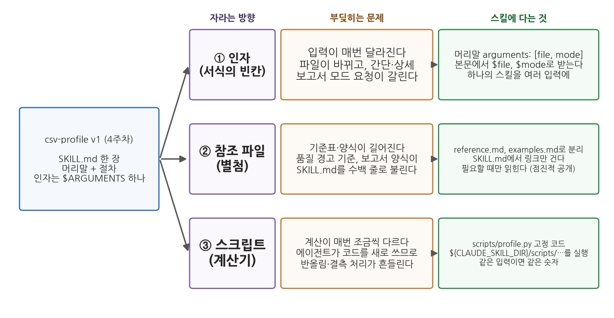
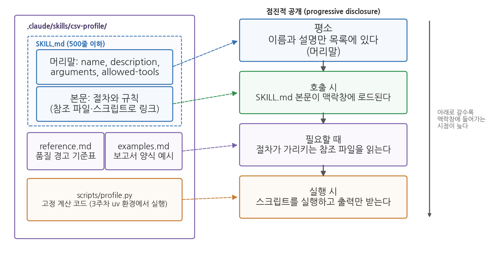
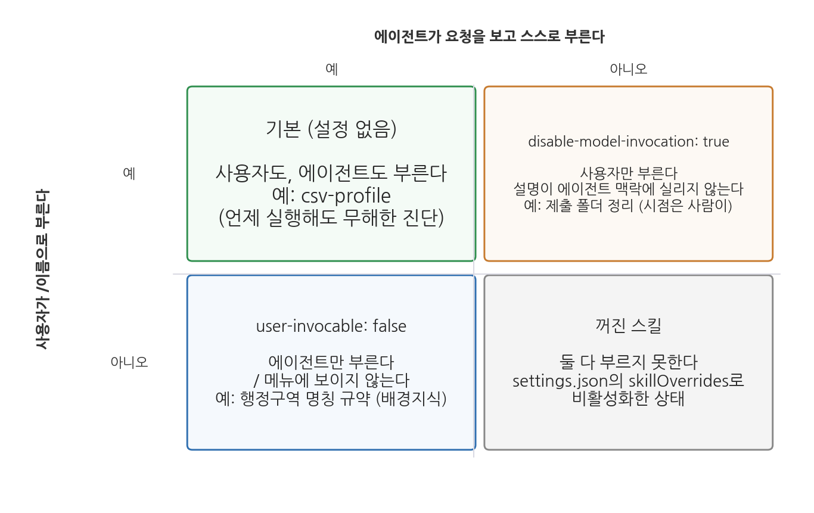

# 5주차 1회차. Skill 심화: 절차에 인자와 도구를 달다

> 단순함은 신뢰성의 전제 조건이다.
> (에츠허르 데이크스트라, 「상처가 될지도 모를 진실을 어떻게 말할 것인가」, 1975)

## 이 장에서 배우는 것

4주차에서 여러분은 첫 스킬 csv-profile을 만들었다. 새 CSV 파일을 받으면 명령 한 줄로 표준 프로파일링 보고서가 나오는, SKILL.md 한 장짜리 스킬이었다. 이 스킬은 6주차의 수집 파일, 7주차의 정제 파일, 9주차의 분석 파일에 학기 내내 쓰이는데, 그렇게 한 달쯤 쓰다 보면 한 장짜리로는 감당하기 어려운 장면들이 나타난다. 파일마다 원하는 보고서 형식이 다르고, 품질 경고 기준표가 자라고, 같은 파일인데 계산 결과가 조금씩 달라진다.

이 장은 그 장면들에 대한 답이다. 스킬에 인자를 달아 여러 입력에 쓰고, 긴 기준표를 참조 파일로 떼어 내고, 계산을 고정된 스크립트에 맡기는 법을 배운다. 설명의 뼈대는 csv-profile로 하되, 절마다 월별 민원 집계와 보도자료 초안 같은 행정 실무의 예를 나란히 놓는다. 같은 장치가 데이터 파일이 아닌 문서 업무에도 그대로 쓰이는 것을 보기 위해서다. 그다음에는 스킬이 여러 개로 늘었을 때 누가 언제 부르게 할지를 설계하고, 스킬 라이브러리를 테스트하고 기록하고 공유하는 방법을 다룬다. 4주차의 원칙은 그대로다. 절차가 정교해져도 검증은 사람의 몫이며, 이 장에서는 그 검증을 절차 안에 넣는 법까지 배운다.

이 장은 구체적으로 다음을 배운다.

- 스킬이 자라는 세 방향(인자, 참조 파일, 스크립트)과 각각이 푸는 문제
- 인자 자리표시자 세 종류와 여러 입력에 쓰이는 스킬의 설계
- 점진적 공개의 원리와 참조 파일의 분리 (2주차 맥락창과 연결)
- 스크립트가 딸린 스킬, 도구 사전 승인, 동적 맥락 주입 (3주차 uv 환경과 연결)
- 호출 주체와 범위의 설계, 그리고 스킬 라이브러리의 테스트·기록·공유·검증 내장

<div style="border:1px solid #d9d9e3;border-left:5px solid #5b6ee1;background:#f7f7fc;padding:12px 16px;margin:18px 0;border-radius:4px;">
<strong>이 장의 로드맵</strong><br>
이 장은 하나의 질문을 따라 전개된다. <em>"한 장짜리 스킬을 어떻게 키우고, 여러 개가 되었을 때 어떻게 다스릴 것인가?"</em><br><br>
<strong>1.1</strong> 스킬이 자라는 세 방향을 확인한다 →
<strong>1.2</strong> 인자를 설계한다 →
<strong>1.3</strong> 참조 파일과 점진적 공개를 배운다 →
<strong>1.4</strong> 스크립트를 달아 계산을 고정한다 →
<strong>1.5</strong> 누가 언제 부르게 할지 설계한다 →
<strong>1.6</strong> 스킬 라이브러리를 관리하고 검증을 내장한다.
</div>

## 1.1 첫 스킬 그다음: 스킬이 자라는 세 방향

### 학기 내내 쓰다 보면 부딪히는 세 장면

4주차의 csv-profile은 머리말에 이름과 설명, 본문에 일곱 단계의 절차와 산출물 형식이 있고 인자는 `$ARGUMENTS` 하나였다. 4주차 도입부의 구청 인턴이 이 스킬을 한 달쯤 쓴 시점을 상상해 보자.

첫째 장면. 과장은 "한 쪽으로 간단히"를 원하고 조교는 "열 정보 표까지 상세히"를 원한다. 파일마다 요청이 갈리는데 스킬은 한 형식만 안다. 그때마다 SKILL.md를 고치거나 명령 뒤에 긴 설명을 덧붙이게 된다. 입력이 매번 달라지는 문제다.

둘째 장면. 품질 경고 기준이 자란다. 4주차에는 결측 비율 30% 이상, 값이 하나뿐인 열, 중복 행의 세 항목이었지만, 7주차를 지나면 문자로 저장된 숫자, 행정구역 개편으로 이름이 갈린 지역, 연도 열의 형식 같은 항목이 붙고 보고서 양식도 간단·상세 두 벌이 된다. SKILL.md가 수백 줄로 불어나 절차의 뼈대가 기준표 속에 파묻힌다. 기준표와 양식이 길어지는 문제다.

셋째 장면. 같은 파일을 두 번 진단했는데 숫자가 조금 다르다. `data/sigungu_2023.csv`의 합계출산율 결측은 229행 중 1건(군위군)인데, 결측 비율이 한 번은 0.4%, 다음에는 0.44%로 나온다. 평균도 어제는 0.823, 오늘은 0.819다. 스킬이 틀린 것이 아니다. 에이전트가 매번 코드를 새로 쓰기 때문에 반올림 자릿수가 달라지고, 평균을 결측을 뺀 228개로 낼지 결측을 0으로 채운 229개로 낼지가 흔들린 것이다(둘 다 이 파일에서 실제로 계산한 값이다). 계산이 매번 조금씩 다르게 나오는 문제다.

### 데이터 진단만의 일이 아니다

세 장면은 csv-profile에서만 일어나지 않는다. 4주차 1.3절에서 스킬 후보로 들었던 월별 민원 집계를 예로 들어 보자. 처음에는 "지난달 민원 파일을 받아 유형별로 세고 표준 집계표를 만든다"는 절차 하나면 충분하다. 그런데 부서마다 따로 집계해 달라는 요청이 오면 환경과용과 교통과용을 나누어 불러야 하고(입력이 달라지는 문제), 민원 유형 분류표가 대분류 여섯에서 중분류 스물넷으로 자라 절차 본문을 뒤덮고(기준표가 길어지는 문제), 같은 달 파일을 두 번 집계했는데 "기타"로 분류된 건수가 서로 다르게 나온다(계산이 흔들리는 문제). 업무가 무엇이든 반복 절차가 실무에 뿌리내리면 같은 세 문제가 순서대로 찾아온다.

이 장에서는 csv-profile과 나란히 이 민원 집계 스킬을 실무 예로 함께 키운다. 출발점인 한 장짜리 판은 4주차의 csv-profile v1과 같은 모양이다.

```markdown
---
name: minwon-count
description: 월별 민원 파일을 유형별로 집계해 표준 집계표를 만든다.
---

민원 원본 파일을 유형별로 집계한다.
1. 파일을 읽어 접수 건수와 접수 기간을 확인한다.
2. 민원 유형 대분류 여섯 가지로 각 건을 분류한다.
3. 유형별 건수와 비율을 표로 만들고, 전월 대비 증감을 덧붙인다.
4. 분류가 애매한 건은 별도 목록으로 뽑아 사람 검토를 요청한다.
```

절차 4는 4주차 1.5절에서 배운 사람의 확인 지점이다. 스킬이 인자와 참조 파일과 스크립트를 갖추며 자라는 동안에도 이 줄은 끝까지 남는다.

### 서식, 별첨, 계산기

4주차의 행정 매뉴얼 비유를 이어 가면 세 장면의 해법이 한눈에 보인다. 매뉴얼에는 빈칸이 있는 서식이 딸려 있어, 담당자와 날짜만 써 넣으면 같은 매뉴얼이 모든 건에 쓰인다. 스킬에서 이 빈칸이 인자다. 긴 기준표와 양식은 본문이 아니라 별첨에 두고, 본문은 절차의 뼈대만 남긴다. 스킬에서 이것이 참조 파일이다. 그리고 매뉴얼은 수수료 계산을 담당자의 암산에 맡기지 않고 산식표나 계산기를 준다. 스킬에서 이것이 스크립트다.

<div style="border:1px solid #cdd9e5;border-left:5px solid #2f6fb0;background:#f5f9fd;padding:12px 16px;margin:18px 0;border-radius:4px;">
<strong>정의 · 인자, 참조 파일, 스크립트</strong><br>
<strong>인자</strong>(argument)는 스킬을 부를 때 함께 넘기는 값으로, 본문의 자리표시자에 끼워진다. <strong>참조 파일</strong>(reference file)은 SKILL.md 옆에 두는 보조 문서(기준표, 양식, 예시)로, 절차가 가리킬 때만 읽힌다. <strong>스크립트</strong>(script)는 스킬 폴더의 <code>scripts/</code>에 넣어 두는 고정된 코드로, 에이전트가 코드를 새로 쓰는 대신 그것을 실행한다.
</div>



그림 5-1을 읽어 보자. 왼쪽이 4주차의 csv-profile이고, 오른쪽으로 세 줄이 뻗어 나간다. 각 줄은 자라는 방향(보라), 그 방향을 택하게 만드는 문제(주황), 스킬에 실제로 다는 것(초록)의 순서다. 여기서 알 수 있는 것은 세 방향이 서로 다른 문제에 대응한다는 점이다. 형식이 갈리면 인자를, 문서가 길어지면 참조 파일을, 숫자가 흔들리면 스크립트를 단다. 셋을 다 달아야 좋은 스킬인 것이 아니라, 부딪힌 문제에 맞는 것만 단다. 1.2-1.4절이 이 세 방향을 차례로 다루고, 다음 회차 실습에서 csv-profile을 이 순서대로 v2로 키운다.

## 1.2 인자 설계: 하나의 스킬을 여러 입력에

### 자리표시자 세 종류

4주차에서 `/csv-profile data/sigungu_2023.csv`의 파일 경로가 본문의 `$ARGUMENTS`에 끼워지는 것을 보았다. 이제 보고서 모드(간단 또는 상세)라는 둘째 인자를 달아 `/csv-profile data/sigungu_2023.csv 간단`으로 부르고 싶다. 이 두 값을 본문에서 받는 방법이 세 가지다.

첫째는 `$ARGUMENTS`로 통째로 받는 것이다. 본문에 "data/sigungu_2023.csv 간단"이 한 덩어리로 들어가고, 무엇이 파일이고 무엇이 모드인지는 에이전트가 문맥으로 가려낸다. 인자가 하나면 충분하지만 둘 이상이면 모호해진다. 둘째는 위치 인자다. 명령 뒤의 값을 띄어쓰기로 나누어 0번부터 센 것이 `$0`, `$1`이며, `$ARGUMENTS[0]`처럼 써도 같다. 셋째는 이름 있는 인자다. 머리말에 `arguments: [file, mode]`라고 선언하면 본문에서 `$file`, `$mode`로 받는다. 본문이 "$file 파일을 $mode 모드로"처럼 읽히므로 몇 달 뒤 고칠 때도 무엇을 적었는지 바로 알 수 있다.

**표 5-1. 인자 자리표시자 비교 (`/csv-profile data/sigungu_2023.csv 간단`을 부른 경우)**

| 자리표시자 | 무엇이 들어가나 | 이 명령에서의 값 | 어울리는 경우 |
|------|------|------|------|
| `$ARGUMENTS` | 명령 뒤의 전체 | `data/sigungu_2023.csv 간단` | 인자가 하나이거나 통째로 넘길 때 |
| `$0`, `$1` (`$ARGUMENTS[0]`과 같음) | 띄어쓰기로 나눈 n번째 값 (0부터) | `$0` = 파일 경로, `$1` = 간단 | 인자가 둘 이상이고 순서가 고정될 때 |
| `$file`, `$mode` (`arguments: [file, mode]` 선언) | 선언한 이름 순서대로 | `$file` = 파일 경로, `$mode` = 간단 | 본문이 이름으로 읽히게 하고 싶을 때 |
| (자리표시자 없음) | 본문 끝에 `ARGUMENTS: <값>`이 덧붙음 | 본문 끝에 한 줄 추가 | 급히 만든 임시 스킬. 권하지 않음 |

마지막 행을 짚어 두자. 자리표시자 없이 인자를 주면 값이 본문 끝에 `ARGUMENTS: <값>` 한 줄로 덧붙는데, 어디에 쓰라는 지시가 없으므로 결과가 들쭉날쭉해진다. 인자를 받을 생각이면 자리표시자를 명시한다.

### csv-profile v2의 머리말

이름 있는 인자로 설계한 v2의 머리말과 본문 첫머리는 다음과 같다. `argument-hint`는 `/csv-profile`을 칠 때 자동완성에 보이는 힌트로, 어떤 인자를 어떤 순서로 주는지 알려 준다.

```markdown
---
name: csv-profile
description: CSV 파일을 받아 표준 형식의 데이터 프로파일링 보고서를 만든다.
  새 데이터 파일을 받았을 때, 데이터 개요·품질 진단·프로파일링을 요청받았을 때 사용.
argument-hint: [CSV 파일 경로] [간단|상세]
arguments: [file, mode]
---

$file 파일의 프로파일링 보고서를 $mode 모드로 작성하라.
$mode 자리에 아무 값도 없으면 간단 모드로 간주한다.

## 절차
1. $file이 실제로 존재하는지 확인한다. 없으면 "파일 없음"이라고 답하고 멈춘다.
2. ... (이하 4주차의 절차)
```

두 줄에 주목하자. 둘째 인자를 빠뜨리고 부르는 일은 흔하므로 "아무 값도 없으면 간단 모드로 간주한다"는 기본값 규칙을 본문에 적어 둔다. 절차 1의 파일 존재 확인은 4주차부터 있었지만 인자가 생기면 더 중요해진다. 인자는 사람이 치는 값이라 오타가 나기 마련이고, 없는 파일을 받았을 때 "없다고 답할 자리"가 있어야 에이전트가 비슷한 이름의 다른 파일을 찾아 진단하는 사고를 막는다. 2주차의 검증 손잡이가 인자 설계에도 그대로 적용되는 것이다.

한 메시지에 `/a /b 인자`처럼 스킬 여러 개를 겹쳐 부를 수도 있다. 가상의 예로 보고서 문체 규약 스킬 `/report-style`이 있다면 `/csv-profile /report-style data/sigungu_2023.csv 간단`으로 둘을 한 번에 부른다. 다음 회차 실습 2.1에서 v2의 인자를 직접 달고, 모드 인자를 바꿔 가며 산출물이 달라지는지 확인한다.

### 실무 예시: 월별 민원 집계에 인자 달기

1.1절의 민원 집계 스킬로 옮겨 보자. 부서별로 따로 집계해야 하고 대상 월도 매번 달라지므로 인자는 둘이다. 대상 월과 부서다.

```markdown
---
name: minwon-count
description: 월별 민원 파일을 유형별로 집계해 표준 집계표를 만든다.
  월간 민원 통계, 부서별 민원 현황을 요청받았을 때 사용.
argument-hint: [YYYY-MM] [부서명 또는 전체]
arguments: [month, dept]
---

$month 접수분 민원을 $dept 기준으로 집계한다.
$dept가 비어 있으면 "전체"로 간주한다.

## 절차
1. data/minwon_$month.csv 가 있는지 확인한다. 없으면 "해당 월 파일 없음"이라고
   답하고 멈춘다. 가장 가까운 달의 파일로 대신하지 않는다.
2. ... (이하 1.1절의 절차)
```

이렇게 하면 어떻게 되는가. `/minwon-count 2026-08 환경과`라고 부르면 본문의 `$month` 자리에 2026-08이, `$dept` 자리에 환경과가 끼워져 "2026-08 접수분 민원을 환경과 기준으로 집계한다"는 지시가 만들어진다. 부서를 빼고 `/minwon-count 2026-08`이라고만 부르면 기본값 규칙이 작동해 전체 집계가 된다. 여기서 인자가 문장 속 낱말로만 쓰이는 것이 아니라 `data/minwon_$month.csv`처럼 파일 이름의 일부로도 쓰인다는 점을 눈여겨보자. 월 하나만 바꿔 부르면 열두 달치 집계가 같은 절차로 나온다.

<div style="border:1px solid #ecd9c6;border-left:5px solid #c77b2f;background:#fdf9f4;padding:12px 16px;margin:18px 0;border-radius:4px;">
<strong>유의 · 인자 순서는 소리 없이 어긋난다</strong><br>
위치가 곧 규칙이므로 <code>/minwon-count 환경과 2026-08</code>처럼 순서를 바꿔 부르면 <code>$month</code> 자리에 "환경과"가 들어가고 에이전트는 <code>data/minwon_환경과.csv</code>를 찾는다. 절차 1의 존재 확인이 있으면 여기서 멈추지만, 없으면 에이전트가 비슷한 파일을 골라 그럴듯한 집계표를 만들어 낸다. 순서를 틀린 호출은 오류 메시지가 아니라 <strong>말이 되는 다른 결과</strong>로 나타나기 때문에 알아채기 어렵다. 대비는 셋이다. <code>argument-hint</code>에 순서를 적고, 본문 첫머리에 받은 인자를 되풀이해 적게 하고("대상 월 $month, 부서 $dept"), 절차 1에 존재 확인을 둔다. 인자가 넷 이상 필요해지면 인자를 더 늘리는 대신 스킬을 나누거나 기본값을 늘리는 편이 낫다.
</div>

## 1.3 참조 파일과 점진적 공개

### 책상에는 지금 필요한 서류만

2주차에서 맥락창을 한정된 작업 기억, 곧 책상에 비유했고, 4주차 1.2절에서는 스킬이 평소에는 이름과 설명만 목록에 있다가 불릴 때만 본문이 책상에 올라온다고 배웠다. 이 원리를 한 층 더 밀고 나간 것이 참조 파일이다. 본문이 올라올 때도 기준표와 양식은 따라 올라오지 않고, 절차가 "이제 기준표를 읽어라"라고 가리키는 시점에야 읽힌다. 공식 문서는 이 방식을 점진적 공개라 부르고, SKILL.md 본문은 500줄 아래로 유지하라고 권한다.

<div style="border:1px solid #cdd9e5;border-left:5px solid #2f6fb0;background:#f5f9fd;padding:12px 16px;margin:18px 0;border-radius:4px;">
<strong>정의 · 점진적 공개</strong><br>
<strong>점진적 공개</strong>(progressive disclosure)는 스킬의 내용을 필요한 시점에 필요한 만큼만 맥락창에 올리는 원리다. 평소에는 이름과 설명만, 호출되면 SKILL.md 본문이, 절차가 가리킬 때 참조 파일이, 실행 시점에 스크립트의 출력이 올라온다. SKILL.md 옆에 <code>reference.md</code>, <code>examples.md</code>, <code>scripts/</code> 같은 보조 파일을 두고 본문에서 링크하는 방식으로 구현한다.
</div>

csv-profile v2에서 떼어 낼 것은 둘이다. 품질 경고 기준표는 `reference.md`로 간다. 4주차의 세 항목에 더해 문자로 저장된 숫자의 패턴(천 단위 쉼표, 단위 문자), 행정구역 개편 지역 목록처럼 자라나는 항목을 여기에 모은다. 보고서 양식은 `examples.md`로 간다. 간단 모드와 상세 모드의 완성 예시를 하나씩 실어 두면 에이전트는 설명을 읽는 것보다 정확하게 양식을 따른다. SKILL.md 본문에는 "품질 경고는 reference.md의 기준표를 읽어 적용한다", "양식은 examples.md에서 $mode에 해당하는 것을 따른다"라는 링크 한 줄씩만 남는다. 파일을 몇 개로 나눌지는 정해진 규칙이 아니라 분량 문제다. 기준표와 양식이 아직 짧다면 `reference.md` 한 파일 안에 절을 나누어 함께 담아도 되고, 어느 한쪽이 자라 읽기 불편해지는 시점에 떼어 내면 된다. 다음 회차 실습에서는 두 자료를 `reference.md` 한 파일에 담는 쪽으로 시작한다.



그림 5-2를 읽어 보자. 왼쪽은 참조 파일까지 갖춘 스킬 폴더의 전형이다. SKILL.md, 참조 파일 두 개, 스크립트가 한 폴더에 있다. 오른쪽은 그 내용물이 맥락창에 들어가는 시점을 위에서 아래로 늘어놓은 것이고, 점선이 파일과 시점을 잇는다. 여기서 알 수 있는 것은 아래로 갈수록 맥락창에 들어가는 시점이 늦다는 점이다. 기준표가 300줄이어도 품질 경고 단계 전까지는 책상을 차지하지 않고, 스크립트는 코드 자체가 아니라 실행 결과만 올라온다. 긴 자료를 스킬에 넣어도 맥락창 낭비가 되지 않는 이유다.

<div style="border:1px solid #e0d8ea;border-left:5px solid #7a5fa8;background:#faf8fc;padding:12px 16px;margin:18px 0;border-radius:4px;">
<strong>왜 그냥 SKILL.md에 다 적으면 안 되는가?</strong><br>
세 가지 이유다. 첫째, <strong>맥락창</strong>이다. 본문에 다 적으면 호출될 때마다 기준표 전체가 책상에 올라온다. 둘째, <strong>유지보수</strong>다. 7주차에 새 경고 항목이 생기면 reference.md 한 곳만 고치고 절차 본문은 손대지 않는다. 셋째, <strong>공유</strong>다. 스킬을 팀에 나눠 줄 때 부서마다 다른 기준표만 교체하고 절차는 공유할 수 있다. 행정 매뉴얼이 본문과 별첨을 나누는 이유와 같다.
</div>

### 실무 예시: 보도자료 양식은 설명보다 예시가 낫다

행정 실무에서 참조 파일이 특히 힘을 발휘하는 것은 보도자료처럼 양식이 굳어 있는 문서다. "제목은 명사형으로 15자 이내", "첫 문단에 육하원칙", "수치는 전년 대비 증감을 괄호에 병기", "부서 연락처는 맨 아래"와 같은 규약을 스무 줄로 풀어 적는 것보다, 실제로 나간 보도자료 두 편을 `examples.md`에 통째로 실어 두고 그것을 가리키는 편이 결과가 낫다. 신입에게 요령을 말로 설명하는 대신 지난달 보도자료를 건네주는 것과 같은 이치다. 그러면 스킬 본문은 네 줄로 줄어든다.

```markdown
## 절차
1. 분석 결과 파일에서 발표할 수치를 세 개 고른다.
2. reference.md의 "숫자 표기 규약"을 읽고 그 규약대로 수치를 적는다.
3. examples.md의 보도자료 두 편과 같은 짜임으로 초안을 쓴다.
4. 인용한 수치마다 원본 파일 이름과 열 이름을 각주로 단다.
```

이렇게 하면 어떻게 되는가. 스킬이 불린 순간 맥락창에 올라오는 것은 이 네 줄뿐이다. 표기 규약은 절차 2에 이르러야, 보도자료 예시 두 편은 절차 3에 이르러야 읽힌다. 규약이 스무 항목으로 늘어도, 예시가 다섯 편으로 늘어도 절차의 뼈대는 네 줄 그대로다. 한 가지 더, 양식이 바뀌었을 때 고칠 곳이 한 군데로 정해진다는 이점도 크다. 부서의 보도자료 서식이 개편되면 `examples.md`의 예시만 새것으로 갈아 끼우면 되고, 절차는 손대지 않는다.

참조 파일에도 검증 손잡이가 필요하다. 본문에 "품질 경고마다 적용한 기준의 출처(reference.md의 항목 번호)를 함께 적으라"는 한 줄을 넣어 두면, 보고서를 읽는 사람이 에이전트가 기준표를 정말 읽고 적용했는지 대조할 수 있다. 다음 회차 실습 2.2에서 기준표를 분리하고, 문턱을 일부러 바꾼 뒤 보고서가 따라 바뀌는지로 참조가 작동하는지 확인한다.

## 1.4 스크립트가 딸린 스킬: 재현 가능한 계산

### 매번 새로 쓰는 코드와 고정된 코드

1.1절의 셋째 장면으로 돌아가자. 평균이 0.823과 0.819로 갈린 것은 결측 처리가, 결측 비율이 0.4%와 0.44%로 갈린 것은 반올림 자릿수가 흔들렸기 때문이다. 하나 더 있다. 시군구 열의 고유값 개수는 207이다. 중구, 동구, 남구처럼 여러 시도에 같은 이름의 구가 있어서인데, 시도와 시군구를 합쳐 세면 229가 된다. 어느 쪽으로 셀지는 그날 짠 코드에 달려 있다. 2주차에서 배운 비결정성이 문장 표현만이 아니라 계산 방식에도 나타나는 것이다.

절차에 "결측은 제외하고 평균을 내라", "비율은 소수 둘째 자리까지"라고 일일이 적어 둘 수도 있지만, 적을 항목은 계속 늘고 적어 두어도 그날의 코드에서 빠질 수 있다. 더 확실한 방법은 계산 코드를 한 번 만들어 스킬 폴더의 `scripts/profile.py`에 고정해 두고, 에이전트에게 코드를 새로 쓰지 말고 그 파일을 실행하라고 지시하는 것이다. 같은 입력이면 같은 숫자가 나온다. 이것이 재현 가능한 계산이며, 13주차 파이프라인의 재현성 시험의 바탕이 된다.

### 경로, 사전 승인, 실행 환경

스크립트는 `${CLAUDE_SKILL_DIR}/scripts/profile.py`처럼 가리킨다. `${CLAUDE_SKILL_DIR}`는 이 스킬의 폴더를 뜻하는 자리표시자로, 스킬이 프로젝트 폴더에 있든 개인 스킬 폴더에 있든 팀원이 복사해 갔든 경로가 맞는다. 절대경로를 적으면 내 노트북에서만 되는 스킬이 된다.

실행에는 권한 문제가 따른다. 2주차에서 보았듯 에이전트가 터미널 명령을 실행하려면 승인이 필요한데, 스킬이 부를 때마다 승인 창이 뜨면 자동화의 의미가 줄어든다. 머리말의 `allowed-tools`에 이 스크립트의 실행을 적어 두면 그 스킬을 부른 턴에 한해 사전 승인된다. 한 턴에 한해서라는 조건이 안전장치다.

```markdown
---
name: csv-profile
description: (1.2절과 같음)
argument-hint: [CSV 파일 경로] [간단|상세]
arguments: [file, mode]
allowed-tools: Bash(${CLAUDE_SKILL_DIR}/scripts/profile.py *)
---

data 폴더의 현재 파일 목록: !`ls data`

## 절차
1. $file이 위 목록에 있는지 확인한다. 없으면 "파일 없음"이라고 답하고 멈춘다.
2. ${CLAUDE_SKILL_DIR}/scripts/profile.py 를 $file, $mode 인자로 실행하고, 보고서의 모든
   수치는 그 출력에서 가져온다. 직접 다시 계산하지 않는다.
3. 실행한 명령과 출력 원문을 보고서 끝 "부록" 절에 그대로 붙인다.
```

`allowed-tools`의 패턴은 "명령의 앞머리 + `*`"의 꼴이며, 에이전트가 실제로 치는 명령의 앞머리와 같아야 한다. 스크립트가 쓰는 pandas는 3주차에 `uv add`로 설치한 프로젝트 환경에 있으므로 절차에는 그 환경에서 실행하라고 적고, 패턴도 그 실제 명령의 앞머리에 맞춘다.

절차 3이 검증 손잡이다. 스크립트가 있어도 에이전트가 건너뛰고 직접 계산해 버릴 수 있다. 실행 명령과 출력 원문을 보고서에 붙이게 하면 도구 사용 로그를 뒤지지 않고도 스크립트가 실제로 실행되었는지, 보고서의 숫자가 출력과 같은지 대조할 수 있다. 그 부록은 다음과 같은 모양이 된다.

```text
## 부록. 실행 기록

uv run python .claude/skills/csv-profile/scripts/profile.py data/sigungu_2023.csv 상세

# 데이터 프로파일링: sigungu_2023.csv (상세 모드)
- 행 수: 229, 열 수: 12
| 열 이름 | 자료형 | 결측 개수 | 결측 비율(%) | ... |
| 합계출산율 | float64 | 1 | 0.4 | ... |
| 열 이름 | 개수 | 평균 | ... | 중앙값 | ... |
| 합계출산율 | 228 | 0.823 | ... | 0.790 | ... |
```

본문에 "합계출산율 평균은 0.823"이라고 적혀 있고 부록의 같은 줄에도 0.823이 있으면 두 숫자가 한 출처에서 나왔다는 뜻이다. 둘이 다르면 에이전트가 스크립트 출력을 옮기지 않고 어딘가에서 다시 계산했다는 뜻이므로, 그 자리에서 절차 2의 "직접 다시 계산하지 않는다"를 지키지 않은 것이 드러난다.

### 실무 예시: 월별 보고의 숫자가 흔들릴 때

민원 집계로 돌아가 보자. 집계표의 "전월 대비 증감"은 매달 사람이 눈으로 훑는 칸이라 틀려도 잘 드러나지 않는다. 어떤 달은 증감을 건수로, 어떤 달은 백분율로 적히고, 백분율의 분모가 전월인지 전년 동월인지도 흔들린다. 열두 달치 보고서를 연말에 나란히 놓았을 때에야 드러나는 종류의 어긋남이다. 이것은 판단이 필요한 일이 아니라 정해진 계산이므로 스크립트로 내리는 것이 맞다. `scripts/count.py`에 분류 집계와 증감 계산을 고정하고, 스킬 절차는 그 파일을 실행하는 한 줄이 된다.

```markdown
## 절차
2. 다음 명령을 실행해 집계표를 만든다. 계산을 직접 코드로 다시 짜지 않는다.
   uv run python ${CLAUDE_SKILL_DIR}/scripts/count.py $month $dept
3. 분류가 애매한 건의 목록만 스크립트 출력에서 그대로 옮겨 "확인 필요" 절에 싣는다.
```

이렇게 하면 어떻게 되는가. 증감의 정의(분모는 전월, 소수 첫째 자리, 부호는 더하기 빼기로 표시)가 문서가 아니라 코드에 못 박히므로 열두 달 내내 같은 방식으로 계산된다. 반대로 스크립트에 넣지 말아야 할 것도 분명해진다. 애매한 민원을 어느 유형으로 볼지, 유형이 여섯 개로 충분한지는 계산이 아니라 판단이므로 스크립트가 정할 일이 아니다. 4주차 1.5절에서 그은 자동화의 경계가 여기서는 스크립트와 절차문의 경계로 나타난다. 계산은 스크립트가, 판단이 필요한 자리를 알아보는 일은 절차문이, 판단 자체는 사람이 한다.

### 동적 맥락 주입

위 본문의 첫 줄, 느낌표 뒤에 백틱으로 감싼 `ls data`가 동적 맥락 주입이다. 스킬 본문이 에이전트에게 전송되기 전에 그 셸 명령이 실행되고 출력이 그 자리에 끼워지므로, 에이전트는 data 폴더의 실제 파일 목록이 박힌 본문을 받아 절차 1의 존재 확인을 목록과 대조해 곧바로 할 수 있다. 세 가지를 알아 두어야 한다. 첫째, 명령이 실패하면 그 줄만 비는 것이 아니라 스킬 호출 전체가 중단된다. 둘째, 이 명령은 승인을 물을 기회 없이 실행되므로 `ls data`도 `allowed-tools`에 함께 적어 미리 승인해 두어야 하며, 파일을 바꾸는 명령은 넣지 않는다. 셋째, 셸이 다르다. 3주차에서 Windows의 기본 셸은 PowerShell이라고 배웠지만, 이 명령은 Windows에서도 bash로 실행되며 Git Bash가 설치되어 있어야 한다. 머리말에 `shell: powershell`을 적으면 PowerShell로 바꿀 수 있으므로, 두 셸에서 모두 통하는 명령을 고르거나 셸을 명시한다.

<div style="border:1px solid #ecd9c6;border-left:5px solid #c77b2f;background:#fdf9f4;padding:12px 16px;margin:18px 0;border-radius:4px;">
<strong>유의 · 스크립트도 검증 대상이다</strong><br>
스크립트를 달면 숫자가 매번 같아진다. 그러나 같다는 것과 맞다는 것은 다르다. 스크립트에 결측을 0으로 채우는 줄이 잘못 들어 있으면 평균 0.819가 매번 똑같이 틀리게 나온다. 스크립트는 처음 만들 때 한 번 검증하고(4주차 실습의 수동 보고서와 대조), 고칠 때마다 다시 검증한다. 한 번 검증했으니 믿는다는 태도가 자동화 편향의 스크립트판이다. 다음 회차 실습 2.3에서 스크립트를 달고 같은 입력을 두 번 실행해 숫자가 같은지, 그 숫자가 4주차 보고서와 같은지 확인하며, 2.4에서 동적 맥락 주입을 실험한다.
</div>

## 1.5 자동 호출 설계: 누가 언제 부르게 할 것인가

### 스킬이 여러 개가 되면

4주차 1.4절에서 스킬을 부르는 두 방법과 주체를 제한하는 설정을 소개했다. 그때는 스킬이 하나였다. 학기가 진행되면 csv-profile 옆에 12주차의 근거 메모 스킬, 정제 로그 스킬, 보고서 양식 스킬이 늘어서고, 요청 하나에 여러 스킬이 후보가 되어 엉뚱한 것이 불리거나, 어느 것도 불리지 않거나, 불리면 안 될 때 불린다.

첫 손잡이는 여전히 `description`이다. 4주차 실습에서 자동 호출이 안 될 때 실제로 쓰는 표현("개요", "어떤 데이터인지")을 설명에 추가했다. 스킬이 여럿일 때는 반대 방향의 다듬기도 필요하다. 근거 메모 스킬의 설명에 "통계"라는 말이 있으면 "이 통계 파일 진단해 줘"에도 후보가 되므로, 무엇을 하는지와 언제 쓰는지에 더해 언제 쓰지 않는지도 적는다. 머리말의 `when_to_use` 필드는 추가 트리거 문구를 설명과 별도로 적는 자리이며, 설명은 1,536자 상한이 있으므로 절차가 아니라 판단 근거만 담는다.

### 호출 주체와 범위

둘째 손잡이는 누가 부를 수 있는지다. 표 5-2와 그림 5-3이 그 조합이다.

**표 5-2. 호출 제어 설정 비교**

| 설정 | 사용자가 `/이름`으로 | 에이전트가 스스로 | 설명이 에이전트 맥락에 | 어울리는 스킬 |
|------|------|------|------|------|
| 기본 (설정 없음) | 부른다 | 부른다 | 실린다 | csv-profile처럼 언제 실행해도 무해한 절차 |
| `disable-model-invocation: true` | 부른다 | 못 부른다 | 실리지 않는다 | 제출 폴더 정리, 원본 덮어쓰기처럼 시점을 사람이 정할 절차 |
| `user-invocable: false` | 못 부른다 (`/` 메뉴에 없음) | 부른다 | 실린다 | 행정구역 명칭 규약처럼 에이전트가 참고할 배경지식 |
| `settings.json`의 `skillOverrides`로 끔 | 못 부른다 | 못 부른다 | 해당 없음 | 팀 공유 스킬 중 내 PC에서 쓰지 않을 것 |



그림 5-3을 읽어 보자. 가로축은 에이전트가 요청을 보고 스스로 부를 수 있는지, 세로축은 사용자가 `/이름`으로 부를 수 있는지다. 왼쪽 위가 기본값, 오른쪽 위가 `disable-model-invocation: true`, 왼쪽 아래가 `user-invocable: false`, 오른쪽 아래가 `skillOverrides`로 끈 상태다. 여기서 알 수 있는 것은 두 설정이 반대 방향이라는 점이다. 하나는 사람의 방아쇠만, 다른 하나는 에이전트의 방아쇠만 남긴다. 부수 효과도 다르다. `disable-model-invocation: true`인 스킬은 설명이 에이전트 맥락에 실리지 않으므로 맥락창을 아끼는 대신 에이전트가 그 스킬의 존재를 모른다. `user-invocable: false`인 스킬은 `/` 메뉴에 보이지 않지만, 시군구 데이터를 다루는 요청마다 에이전트가 군위군의 대구 편입 같은 규약을 참고하게 만들 수 있다. `paths` 필드를 쓰면 특정 파일 패턴(예: data 폴더의 CSV)을 다루는 작업 중에만 자동 로드되도록 범위를 더 좁힐 수 있다.

셋째 손잡이는 스킬을 어디에 두는가다. 프로젝트 폴더의 `.claude/skills/`에 둔 스킬은 그 프로젝트에서만, 홈 폴더의 `.claude/skills/`에 둔 개인 스킬은 모든 프로젝트에서 쓰인다. 같은 이름이 양쪽에 있으면 우선순위는 엔터프라이즈, 개인, 프로젝트 순이다. 개인 스킬이 프로젝트 스킬을 이기므로, 팀 프로젝트의 csv-profile을 내 개인 폴더의 옛 csv-profile이 가리는 사고가 날 수 있다. 프로젝트 고유의 절차(이 데이터, 이 기준표)는 프로젝트에, 어디서나 쓰는 개인 습관은 개인 폴더에 두고, 이름이 겹치지 않게 한다.

### 실무 예시: 양 끝에 놓이는 두 스킬

같은 부서의 스킬이라도 방아쇠는 정반대일 수 있다. 한쪽 끝에 보도자료 초안 스킬이 있다. 외부에 나가는 문서이고 틀렸을 때 피해가 크므로, 4주차 표 4-1의 네 질문에서 "틀렸을 때 피해가 작은가"에 오른쪽으로 답하게 되는 절차다. 이런 스킬이 "이 결과 정리해 줘"라는 말 한마디에 스스로 실행되어 초안이 만들어져 있으면 곤란하다. `disable-model-invocation: true`로 잠가 사람이 시점을 정한다. 설명이 에이전트 맥락에 실리지 않으므로 에이전트는 그런 스킬이 있다는 것조차 모르고, `/press-draft`라고 직접 부를 때만 절차가 시작된다.

반대쪽 끝에는 사람이 부를 일이 없는 스킬이 있다. 부서에서 쓰는 통계 용어와 열 이름의 뜻을 모아 둔 배경지식이 그렇다.

```markdown
---
name: stat-glossary
description: 이 부서가 쓰는 통계 용어와 데이터 열 이름의 뜻. 시군구 데이터의
  열 이름을 해석하거나 지역 이름이 어긋날 때 참고한다.
user-invocable: false
---

- 고령인구비율: 총인구 대비 65세 이상 인구의 비율. 이 자료에는 백분율로 저장되어
  있으므로 다시 100을 곱하지 않는다.
- 합계출산율: 여성 한 명이 평생 낳을 것으로 기대되는 평균 출생아 수.
- 군위군: 2023년 7월 1일 대구광역시로 편입되었다. 2023년 자료에서 일부 값이 비어
  있으면 이 편입 때문일 수 있다.
```

이렇게 하면 어떻게 되는가. 이 스킬은 `/` 메뉴에 나타나지 않으므로 학생이나 담당자가 명령 목록에서 그것을 볼 일이 없다. 대신 시군구 데이터를 다루는 요청이 들어오면 에이전트가 스스로 이 배경지식을 꺼내 읽고, 고령인구비율을 소수 비율로 오해해 100을 곱하거나 군위군의 결측을 자료 오류로 단정하는 일을 줄인다. 사람이 부를 일이 없는 자료를 `/` 메뉴에 늘어놓지 않는 것도 설계다. 명령 목록이 스무 개로 불어나면 정작 자주 쓰는 스킬을 고르기 어려워진다. 여기에 `paths` 필드를 더해 data 폴더의 CSV를 다루는 작업 중에만 이 배경지식이 실리게 하면 범위가 한 겹 더 좁아진다.

<div style="border:1px solid #e0d8ea;border-left:5px solid #7a5fa8;background:#faf8fc;padding:12px 16px;margin:18px 0;border-radius:4px;">
<strong>왜 인터넷 자료에는 "커맨드"라고 나오는가?</strong><br>
4주차 정의 박스에서 보았듯 <code>.claude/commands/</code> 폴더에 파일 하나를 두는 옛 커스텀 커맨드 체계는 스킬로 통합되었고 둘 다 작동한다. 같은 이름의 <code>.claude/commands/x.md</code>와 <code>.claude/skills/x/SKILL.md</code>가 있으면 스킬이 우선한다. 커맨드로 설명된 자료는 스킬로 읽으면 되고, 새로 만드는 것은 참조 파일과 스크립트를 함께 둘 수 있는 스킬 폴더로 만든다. SKILL.md의 수정은 대화 중에 바로 반영되므로 설계를 바꿔 가며 시험하기 쉽다.
</div>

자동 호출은 편리하지만 어느 스킬이 쓰였는지가 보이지 않게 된다. 산출물 형식에 "이 보고서는 csv-profile v2로 생성"이라는 한 줄을 넣어 두면 보고서만 보고도 어느 절차가 적용되었는지 알 수 있다. 다음 회차 실습 2.5에서 설명을 바꾸고 호출 제한을 걸어 가며 에이전트가 무엇을 부르는지 관찰한다.

## 1.6 스킬 라이브러리 관리: 테스트, 기록, 공유, 그리고 검증의 내장

### 테스트

스킬이 여럿 모이면 그것이 스킬 라이브러리다. 2주차의 지시문 라이브러리가 메모 파일이었다면, 스킬 라이브러리는 에이전트가 읽는 매뉴얼 묶음이다. 라이브러리를 유지하는 일은 네 가지다.

첫째는 테스트다. 4주차 실습의 직접 호출, 자동 호출, 어려운 입력에 두 가지가 더해진다. 하나는 기준선 비교로, 같은 요청을 스킬 없이 한 번, 스킬로 한 번, 각각 새 대화에서 실행해 결과를 나란히 놓는 것이다. 스킬이 형식과 내용을 실제로 개선하는지, 아니면 즉흥 답변과 다를 바 없는지가 드러난다. 다른 하나는 오류 심기로, 원본의 사본에 결측을 만들거나 천 단위 쉼표를 넣거나 열 이름을 바꾸어 두고 스킬을 돌려 품질 경고가 그 오류를 잡는지 보는 것이다. 무엇을 심었는지 아는 사람이 채점하므로 결과가 명확하다.

**표 5-3. 스킬 테스트 유형**

| 테스트 | 방법 | 무엇을 확인하나 | 실습 |
|------|------|------|------|
| 직접 호출 | `/이름 인자`로 실행 | 절차의 각 단계가 순서대로 수행되는가 | 4주차 2.3, 이번 2.1 |
| 자동 호출 | 스킬 이름 없이 요청 | `description`이 실제 표현과 맞는가, 엉뚱한 스킬이 불리지 않는가 | 4주차 2.4, 이번 2.5 |
| 재현 | 같은 입력으로 두 번 실행 | 숫자가 같은가 (스크립트의 효과) | 이번 2.3 |
| 기준선 비교 | 같은 요청을 스킬 없이/있이 새 대화에서 | 스킬이 실제로 개선하는가 | 이번 2.6 |
| 오류 심기 | 오류를 심은 사본에 실행 | 품질 경고가 심은 오류를 잡는가 | 이번 2.6 |

### 기록과 공유

둘째는 기록이다. 4주차 실습의 "v2: description에 '개요' 추가" 같은 메모는 라이브러리가 커지면 모자라고, 파일의 변경 이력을 남기는 도구인 git으로 관리한다. 이 과목의 방식대로 "이 스킬 폴더의 변경을 git으로 기록해 줘. 기록 메시지는 무엇을 왜 바꿨는지 한 줄로"라고 에이전트에게 시키면 된다. 이력이 남으면 어느 판의 스킬이 어느 보고서를 만들었는지 추적하고, 잘못 고친 판을 되돌릴 수 있다.

셋째는 공유다. 프로젝트의 `.claude/skills/` 폴더를 통째로 넘기면 팀 전체가 같은 절차로 일한다. 넘기기 전에 넷을 점검한다. 절대경로가 없는가(`${CLAUDE_SKILL_DIR}`를 썼는가), 참조 파일과 스크립트가 폴더 안에 다 있는가, 스크립트가 쓰는 패키지가 3주차의 `pyproject.toml`에 들어 있는가, 설명이 만든 사람 아닌 남에게도 이해되는가. 한 가지 더, 개인 폴더로 옮겨 둔 스킬은 프로젝트 폴더를 통째로 넘겨도 따라가지 않는다. 팀이 함께 쓸 절차라면 개인 폴더로 올리지 않는 편이 안전하다.

### 라이브러리를 한눈에 놓고 보기

이 장에서 다룬 것들이 실무에서 어떻게 한 묶음이 되는지 표 5-4로 모았다. 가상의 예이지만 스킬 하나하나는 이 장에서 이미 다룬 것들이다.

**표 5-4. 어느 구청 데이터 담당자의 스킬 라이브러리 (가상의 예)**

| 스킬 | 하는 일 | 자란 방향 | 호출 설정 | 절차에 넣은 검증 |
|------|------|------|------|------|
| csv-profile | 새 데이터 진단 | 인자, 참조 파일, 스크립트 | 기본 | 행 수·열 수 원본 대조, "확인 필요" 절 |
| minwon-count | 월별 민원 집계 | 인자, 참조 파일, 스크립트 | 기본 | 분류가 애매한 건 별도 목록 |
| press-draft | 보도자료 초안 | 참조 파일(규약, 예시) | `disable-model-invocation: true` | 수치마다 원본 파일과 열 이름 각주 |
| stat-glossary | 용어와 열 이름 배경지식 | 없음(짧은 문서) | `user-invocable: false` | 해당 없음 |
| check-report | 보고서 독립 검산 | 인자 | `context: fork` | 스킬 자체가 검증 절차 |

표를 세로로 읽으면 라이브러리 설계의 규칙 셋이 드러난다. 첫째, 자란 방향은 스킬마다 다르다. 짧은 배경지식에는 아무것도 달지 않았고, 매달 도는 절차에는 셋을 다 달았다. 1.1절에서 말한 대로 부딪힌 문제에 맞는 것만 단다. 둘째, 호출 설정의 기본값을 벗어난 것은 그럴 이유가 있는 셋뿐이다. 잠글 이유가 없는 스킬까지 잠그면 자동 호출의 이점을 버리는 셈이 된다. 셋째, 검증 칸이 빈 것은 산출물을 만들지 않는 stat-glossary 하나다. 무엇인가를 만들어 내놓는 스킬이라면 그 산출물을 확인할 손잡이가 절차 안에 한 줄은 있어야 한다.

라이브러리가 이 정도로 자라면 스킬 목록과 변경 기록을 담은 안내 문서 하나를 폴더에 함께 둔다. 어느 스킬이 어디에 사는지, 무엇이 언제 왜 바뀌었는지가 적혀 있어야 몇 달 뒤의 나와 팀원이 같은 라이브러리를 쓸 수 있다. 다음 회차 실습 2.6에서 기준선 비교와 오류 심기를 직접 해 보고, 2.7에서 스킬의 위치를 정하고 안내 문서를 만들고 공유 전 점검을 수행한다.

### 검증의 내장

넷째가 가장 중요한 항목, 검증을 스킬 절차 안에 넣는 것이다. 4주차 유의 박스에서 "행 수·열 수를 원본과 대조한 결과를 함께 출력하라"를 절차에 넣자고 했다. 그 발상을 체계화하면 셋이 된다. 첫째, 자기 대조다. 스크립트가 낸 행 수를 파일의 줄 수와 다시 세어 대조하고, 대표 수치 하나를 다른 방법으로 다시 계산해 일치 여부를 보고서에 적게 한다. 둘째, 근거 위치의 보고다. 1.3절의 기준표 항목 번호, 1.4절의 실행 명령과 출력 원문이 그것이다. 셋째, "확인 필요" 절이다. 판단이 필요한 사항을 사람 앞에 모으는 4주차의 규칙은 v2에서도 그대로다.

한 걸음 더 나가면, 검산만 하는 별도 스킬을 만들 수 있다. 머리말에 `context: fork`를 적은 스킬은 본 대화가 아니라 격리된 서브에이전트에서 실행된다. 그 서브에이전트는 본 대화가 품은 믿음("이 계산은 맞다")을 물려받지 않고 원본 파일과 보고서만 받아 처음부터 다시 센다. 2주차에서 새 대화를 열어 독립 검산을 시켰던 것을 스킬 한 줄로 부르는 셈이며, `agent` 필드로 어떤 종류의 서브에이전트에서 실행할지 정할 수도 있다. 13주차에서 이 감사관을 `.claude/agents/verifier.md`라는 전담 팀원으로 등록해 파이프라인의 검문소에 세우는데, 이 검산 스킬은 그 구조의 축소판이다. 다음 회차 실습 2.8(선택 심화)에서 만들어 본다.

<div style="border:1px solid #ecd9c6;border-left:5px solid #c77b2f;background:#fdf9f4;padding:12px 16px;margin:18px 0;border-radius:4px;">
<strong>유의 · 라이브러리가 커질수록 자동화 편향도 커진다</strong><br>
인자, 참조 파일, 스크립트, 자동 호출, 검산 스킬까지 갖추면 산출물은 매번 같은 형식으로 말끔하게 나온다. 4주차에서 경고한 자동화 편향이 가장 위험해지는 순간이다. 검산 스킬의 보고 역시 에이전트의 산출물이며, 그 보고의 손잡이(행 번호, 계산 방법)를 잡고 사람이 두어 칸을 확인하는 일은 없어지지 않는다. 이 과목의 세 겹 검증으로 말하면, 이 장은 첫째 겹(지시문의 손잡이)과 둘째 겹(별도 검증)을 스킬에 내장하는 법이고, 셋째 겹(결정적 항목 하나와 표본 몇 개를 파일에서 직접 보는 사람의 눈)은 끝까지 남는다.
</div>

## 요약

SKILL.md 한 장짜리 스킬은 학기 내내 쓰다 보면 입력이 매번 달라지고, 기준표와 양식이 길어지고, 계산이 조금씩 다르게 나오는 세 문제에 부딪히며, 각각의 해법이 인자(서식의 빈칸), 참조 파일(별첨), 스크립트(계산기)다. 인자는 `$ARGUMENTS`(전체), `$0`·`$1`(위치), `arguments: [file, mode]`로 선언한 `$file`·`$mode`(이름)로 받고, 자리표시자가 없으면 본문 끝에 `ARGUMENTS: <값>`이 덧붙는다. 인자는 문장 속 낱말만이 아니라 파일 이름의 일부로도 쓰이며, 순서를 틀린 호출은 오류가 아니라 말이 되는 다른 결과로 나타나므로 `argument-hint`와 존재 확인 절차로 막는다. 참조 파일은 절차가 가리킬 때만 읽히는 점진적 공개의 원리로 맥락창을 아끼며, SKILL.md 본문은 500줄 아래로 유지한다. 스크립트는 `${CLAUDE_SKILL_DIR}/scripts/`로 가리키고 `allowed-tools`로 사전 승인하며, 동적 맥락 주입은 스킬 전송 전에 셸 명령의 출력을 본문에 끼워 넣되 실패하면 호출 전체가 중단된다. 스킬이 여럿이면 `description`과 `when_to_use`, 호출 주체 제어(`disable-model-invocation`, `user-invocable`, `paths`, `skillOverrides`), 범위와 우선순위(엔터프라이즈 > 개인 > 프로젝트)를 설계한다. 라이브러리는 기준선 비교와 오류 심기로 테스트하고, git으로 기록하고, 점검 뒤 공유하며, 자기 대조·근거 위치·확인 필요 절로 검증을 절차 안에 내장한다. 표 5-4처럼 여러 스킬을 한 줄씩 늘어놓고 보면, 자란 방향은 스킬마다 다르고 호출 설정은 기본값을 벗어날 이유가 있을 때만 바꾸며 산출물을 내놓는 스킬에는 예외 없이 검증 한 줄이 붙어 있어야 한다는 것이 드러난다. `context: fork`의 검산 스킬은 13주차 verifier의 축소판이며, 그래도 사람의 눈은 남는다.

## 연습문제

**5-1. 자라는 방향 고르기.** 다음 네 상황에서 csv-profile에 인자, 참조 파일, 스크립트 중 무엇을 다는 것이 적절한지 고르고 이유를 한 문장씩 써 보라. 둘 이상이 필요하면 둘 다 고를 수 있다.
(a) 과에서 쓰는 결측 비율 문턱이 부서마다 달라 매번 SKILL.md를 고친다.
(b) 같은 파일인데 고령인구비율 평균이 실행할 때마다 소수 셋째 자리에서 달라진다.
(c) 보고서를 한글 파일로 낼 때와 마크다운으로 낼 때 양식이 다르다.
(d) 행정구역 개편 지역 목록이 30줄로 늘어 절차가 읽기 어렵다.
(e) 보도자료 초안의 짜임과 문체가 부를 때마다 달라 매번 손으로 고친다.
(f) 민원 집계표의 전월 대비 증감이 어떤 달은 건수로, 어떤 달은 백분율로 나온다.

**5-2. 호출 제어 설계.** 어느 구청이 다음 세 스킬을 만들었다. 표 5-2를 참고해 각각에 기본, `disable-model-invocation: true`, `user-invocable: false` 중 무엇을 적용할지 정하고, 그 이유를 부수 효과(설명이 맥락에 실리는지, `/` 메뉴에 보이는지)까지 들어 설명하라.
(a) 월간 보고서를 결재 폴더로 옮기고 이전 판을 지우는 스킬
(b) 이 구청의 동 이름 표기 규약(옛 이름과 새 이름의 대응표)을 담은 스킬
(c) 민원 파일을 받아 유형별 집계표를 만드는 스킬

이어서 세 스킬을 한 라이브러리에 함께 두었을 때, 담당자가 `/`를 입력하면 목록에 몇 개가 보이는지와 에이전트의 맥락에 설명이 실리는 것은 몇 개인지를 세어 보라. 그리고 (b)의 스킬을 잘못하여 `disable-model-invocation: true`로 잠갔다고 하자. 이 스킬은 실제로 언제 쓰이게 되는지, 그 결과 어떤 실수가 다시 나타날지 한 문장으로 적으라.

**5-3. 검증의 내장.** 어느 학생이 스크립트를 단 뒤 "이제 숫자가 매번 같으니 검증은 필요 없다"라고 말했다. 1.4절 유의 박스와 1.6절을 바탕으로 이 말의 문제를 지적하고, 이 학생의 스킬 절차에 추가할 검증 단계를 두 가지 이상 구체적으로 제안하라. 각 단계가 잡아낼 수 있는 오류의 예를 하나씩 들 것. 답을 쓸 때는 표 5-4의 마지막 열처럼 "무엇을 무엇과 대조하는가"를 한 줄로 적고, 그 한 줄이 산출물의 어느 자리에 남는지(보고서의 어느 절, 대화창의 어느 보고)까지 밝힐 것.
