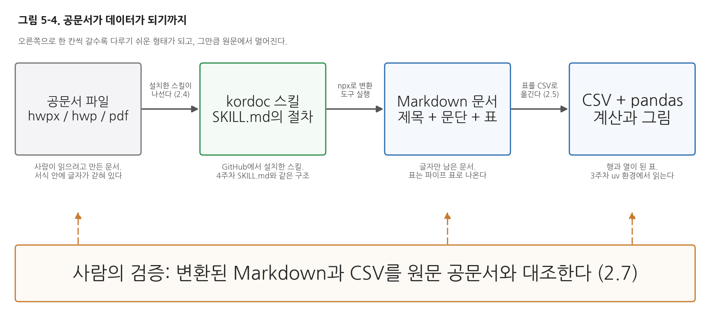

# 5주차 2회차. GitHub의 스킬 설치해 공문서 다루기

## 이 실습에서 하는 것

1회차에서 남이 만든 스킬을 가져다 쓰는 길을 배웠다. 공개된 스킬이 어떤 모양으로 배포되는지(마켓플레이스와 플러그인), 설치하기 전에 무엇을 확인해야 하는지, 설치한 스킬은 어떤 이름으로 불리는지를 다루었다. 오늘은 그 길을 실제로 걸어 본다. GitHub에 공개된 kordoc이라는 플러그인을 설치해서, 한글 공문서 파일을 에이전트가 읽을 수 있는 형태로 바꾸고 그 안의 표를 데이터로 옮긴다.

주제를 공문서로 잡은 이유가 있다. 행정 자료의 상당수는 CSV가 아니라 hwp나 hwpx, PDF 같은 문서 파일로 공개된다. 보도자료, 공고문, 계획서, 회의록이 모두 그렇다. 지금까지 다룬 데이터는 이미 행과 열로 정리된 CSV였지만, 실제로 필요한 숫자가 문서 안의 표에 갇혀 있는 일이 훨씬 흔하다. 그 문을 여는 도구를 오늘 설치한다.

진행은 세 단계다. 앞부분(2.1-2.3)은 설치다. 저장소를 먼저 살펴보고, 마켓플레이스를 등록해 플러그인을 설치하고, 설치된 스킬의 SKILL.md를 열어 4주차에 손으로 만든 파일과 같은 구조임을 확인한다. 가운데(2.4-2.5)는 사용이다. 예시 공문서를 Markdown으로 바꾸고, 그 안의 표를 CSV로 옮겨 pandas로 읽는다. 뒷부분(2.6-2.8)은 관찰과 검증이다. 스킬 이름을 부르지 않아도 에이전트가 스스로 꺼내 쓰는지 보고, 변환 결과가 원문과 같은지 사람이 직접 대조하고, 마지막으로 각자 구한 문서로 같은 절차를 되풀이한다.

이 실습이 끝나면 다음 산출물이 남는다.

- 설치된 kordoc 플러그인 (`/plugin` 화면의 Installed 목록에 보이는 상태)
- `data/docs/인구현황보고_예시.md`: 공문서를 변환해 만든 Markdown 문서
- `data/인구상위5.csv`: 문서 속 표를 옮긴 데이터 파일
- 변환 결과와 원본 데이터를 맞대어 본 대조 결과 (2.7)
- (선택 심화) 각자 내려받은 공문서 한 건과 그 변환 결과



그림 5-4가 오늘의 전체 흐름이다. 읽는 법은 왼쪽에서 오른쪽이다. 맨 왼쪽은 사람이 읽으려고 만든 공문서 파일이고, 그다음이 오늘 설치할 kordoc 스킬이며, 스킬을 거치면 글자만 남은 Markdown 문서가 되고, 표를 따로 떼어 내면 pandas로 계산할 수 있는 데이터가 된다. 상자 아래의 작은 글씨는 그 단계에서 무엇이 달라지는지를 적은 것이고, 상자 사이의 글씨는 그 일을 하는 것이 무엇인지를 적은 것이다. 여기서 알 수 있는 것은 오른쪽으로 갈수록 다루기는 쉬워지지만 원문에서는 멀어진다는 점이다. 맨 아래의 주황 상자가 그래서 있다. 옮겨 적기가 한 번 일어날 때마다 값이 샐 자리가 생기므로, 마지막에는 사람이 원문과 맞대어 본다. 그 대조가 2.7이다.

## 준비물

| 구분 | 내용 |
|------|------|
| 폴더 | 1주차에 만든 `공공데이터분석` 폴더 (3주차에서 uv 환경을 갖춘 상태) |
| 데이터 | `data/docs/인구현황보고_예시.hwpx` (수업용으로 만든 가상의 예시 공문서. 실제 행정기관이 발행한 문서가 아니며, 문서 안의 수치는 수업에서 쓰는 공개 데이터에서 가져온 값이다), `data/sigungu_2023.csv` (2.7의 대조에 쓴다. 4주차와 같은 파일) |
| 도구 | VSCode + Claude Code 확장, 인터넷 연결(설치와 첫 변환에 필요), Node.js 18 이상 |
| 선수 내용 | 5주차 1회차 (마켓플레이스와 플러그인, 설치 전 점검, 플러그인 스킬의 이름), 4주차 2회차 (SKILL.md를 직접 만들어 본 경험), 3주차 2회차 (uv 환경에서 pandas 실행) |

<div style="border:1px solid #ecd9c6;border-left:5px solid #c77b2f;background:#fdf9f4;padding:12px 16px;margin:18px 0;border-radius:4px;">
<strong>유의 · 오늘 쓰는 예시 문서에 대하여</strong><br>
<code>data/docs/인구현황보고_예시.hwpx</code>는 이 수업이 실습용으로 만든 가상의 예시 문서다. 실제 행정기관이 발행한 문서가 아니므로, 문서에 적힌 제목이나 문장을 실제 행정 사실로 인용해서는 안 된다. 다만 문서 안의 수치는 지어낸 값이 아니라 수업에서 쓰는 공개 데이터(<code>data/sigungu_2023.csv</code>)에서 가져온 값이다. 그래서 2.7에서 변환 결과를 원본 데이터와 맞대어 볼 수 있다.
</div>

## 2.1 설치 전에 저장소를 살펴본다

**무엇을 왜 하는가.** 설치는 남이 쓴 파일을 내 컴퓨터로 가져와 내 에이전트가 따르게 하는 일이다. 그러니 설치 버튼을 누르기 전에 저장소를 먼저 본다. 1회차 1.3절에서 확인할 것을 넷으로 정리했다. 누가 만들었는가, 무엇을 하는가, 내 컴퓨터에서 무엇을 실행하는가, 라이선스는 무엇인가. 이 조사는 에이전트에게 시키고 학생은 그 요약을 저장소 화면과 대조한다. 조사를 대신 시켜도 되는 이유는, 조사 결과가 맞는지는 브라우저를 열어 바로 확인할 수 있기 때문이다. 확인할 수 있는 일은 맡기고, 확인은 사람이 한다.

<div style="border:1px solid #cfe3d4;border-left:5px solid #2f8f4e;background:#f4fbf6;padding:12px 16px;margin:18px 0;border-radius:4px;">
<strong>지시문 예시</strong><br>
"https://github.com/chrisryugj/kordoc 저장소를 읽고 다음 다섯 가지를 정리해 줘. (1) 이 도구가 무엇을 하는지 한 문단, (2) 만든 사람의 계정 이름과 라이선스, (3) 설치하면 어떤 스킬이 들어오는지와 그 스킬 파일이 저장소의 어느 경로에 있는지, (4) 이 스킬이 동작하려면 내 컴퓨터에 무엇이 있어야 하는지, (5) 이 스킬이 내 컴퓨터에서 실제로 무엇을 실행하는지. 항목마다 저장소의 어느 파일이나 어느 화면에서 확인했는지 함께 적어 주고, 확인하지 못한 항목은 추측하지 말고 '확인 못 함'이라고 적어 줘."
</div>

**예상되는 에이전트의 행동과 결과.** 에이전트가 웹 페이지를 읽는 도구를 여러 번 호출하고(승인 요청이 올 수 있다) 다음과 같은 요약을 준다. 문장은 실행할 때마다 조금씩 다르지만 담긴 사실은 같아야 한다.

```text
(1) 하는 일: 한국 공문서 파일을 Markdown으로 바꾸는 도구. HWP(3.x/5.x), HWPX,
    HWPML, PDF, DOCX, XLS/XLSX, 이미지(OCR)를 읽어 Markdown으로 내보낸다.
    반대로 Markdown으로 공문서 HWPX를 만드는 기능(기안문·보고서·계획서·통지·
    회의록 프리셋), 서식의 빈칸 채우기, 문서 비교, 구조 검증도 들어 있다.
(2) 만든 이: chrisryugj / 라이선스: MIT   (확인: 저장소 첫 화면, LICENSE)
(3) 스킬: kordoc 하나. 저장소의 plugins/kordoc/skills/kordoc/SKILL.md
    마켓플레이스 정의 파일은 .claude-plugin/marketplace.json이고,
    마켓플레이스 이름은 kordoc, 그 안의 플러그인도 kordoc 하나다.
(4) 필요한 것: Node.js 18 이상. 한컴오피스는 없어도 된다.
(5) 실행하는 것: 스킬 본문이 npx -y kordoc@^4 형태로 변환 도구를 내려받아
    실행한다. 첫 실행은 도구를 받느라 시간이 걸린다.
```

다섯 번째 항목이 오늘 가장 중요한 줄이다. 이 스킬은 문서를 읽어 주는 지시문만 들어 있는 것이 아니라, 내 컴퓨터에서 프로그램 하나를 내려받아 실행한다. 1회차에서 "스킬이 어떤 도구를 부르는지 확인하라"고 한 것이 이 대목이다. 무엇이 실행되는지 모른 채 설치하는 것과, npx로 kordoc이라는 변환 프로그램이 돈다는 것을 알고 설치하는 것은 다른 일이다.

**검증.** 브라우저에서 저장소를 직접 열어 세 가지를 눈으로 확인한다. 첫째, 주소가 `github.com/chrisryugj/kordoc`이고 계정 이름의 철자가 에이전트가 말한 것과 같은가. 비슷한 이름의 다른 저장소를 읽고 온 것은 아닌지 보는 것이다. 둘째, 라이선스가 MIT라고 표시되어 있는가. 셋째, 저장소 안에 `.claude-plugin/marketplace.json` 파일과 `plugins/kordoc/skills/kordoc/SKILL.md` 파일이 실제로 있는가. 앞의 파일이 있어야 마켓플레이스로 등록할 수 있고, 뒤의 파일이 오늘 설치할 스킬의 본체다. 셋 중 하나라도 어긋나면 설치하지 않고 교수자에게 알린다. 그리고 요약에 "확인 못 함"이 있다면 그것부터 사람이 직접 찾아본다. 모른다고 적어 준 항목은 잘못이 아니라 정직한 보고이므로, 그 자리를 채우는 것이 사람의 일이다.

<div style="border:1px solid #ecd9c6;border-left:5px solid #c77b2f;background:#fdf9f4;padding:12px 16px;margin:18px 0;border-radius:4px;">
<strong>유의 · 오늘은 미리 확인된 저장소를 쓴다</strong><br>
수업에서 설치하는 kordoc은 교수자가 미리 살펴본 저장소다. 그러나 학기가 끝나고 각자 다른 스킬을 찾아 설치할 때는 이 확인을 스스로 해야 한다. 별점이 높다거나 소개 글이 그럴듯하다는 것은 확인이 아니다. 만든 이의 계정에 다른 활동이 있는지, 저장소가 최근에도 손질되고 있는지, 스킬 본문이 무엇을 실행하는지를 직접 읽는 것이 확인이다. 잘 모르겠으면 설치하지 않는 쪽이 언제나 안전하다.
</div>

## 2.2 마켓플레이스를 추가하고 설치한다

**무엇을 왜 하는가.** 설치는 두 걸음이다. 먼저 저장소를 스킬 목록으로 등록하고(마켓플레이스 추가), 그다음 그 목록에서 꾸러미 하나를 고른다(플러그인 설치). 1회차 1.2절에서 목록과 꾸러미를 구분한 이유가 여기서 드러난다. 목록 하나에 꾸러미가 여럿 들어 있을 수 있고, 등록만 해 두고 설치하지 않을 수도 있다. kordoc의 경우 목록 이름도 kordoc이고 그 안의 꾸러미도 kordoc 하나뿐이라 두 이름이 겹쳐 보이는데, 자리가 다르다는 것만 기억하면 된다.

이 단계는 오늘 유일하게 학생이 직접 입력하는 대목이다. 지금까지 실습에서 명령을 치는 것은 에이전트의 일이었지만, 아래 두 줄은 터미널 명령이 아니라 대화창에 그대로 입력하는 슬래시 명령이다. Claude Code 자체에게 "이렇게 해 달라"고 말하는 것이라서 사람이 직접 친다.

<div style="border:1px solid #cfe3d4;border-left:5px solid #2f8f4e;background:#f4fbf6;padding:12px 16px;margin:18px 0;border-radius:4px;">
<strong>지시문 예시</strong><br>
(첫째 줄) "/plugin marketplace add chrisryugj/kordoc"<br>
(둘째 줄, 첫째 줄이 끝난 뒤에) "/plugin install kordoc@kordoc"
</div>

**예상되는 에이전트의 행동과 결과.** 첫째 줄을 입력하면 저장소를 받아 와 마켓플레이스 목록에 등록했다는 응답이 온다. `chrisryugj/kordoc`은 GitHub의 계정 이름과 저장소 이름을 빗금으로 이은 것이고, 이 한 줄의 뜻은 "저 저장소를 내 스킬 목록에 올려라"이다.

둘째 줄을 입력하면 설치 확인 화면이 뜬다. `kordoc@kordoc`에서 골뱅이표 앞이 플러그인 이름, 뒤가 마켓플레이스 이름이다. "kordoc 목록의 kordoc 꾸러미를 설치하라"는 뜻이다. 확인 화면에는 설치하기 전에 이 플러그인을 신뢰할 수 있는지 확인하라는 안내와, Anthropic은 플러그인 안에 어떤 MCP 서버나 파일, 소프트웨어가 들어 있는지 관리하지 않는다는 취지의 문구가 함께 뜬다. 문구는 판마다 조금씩 다르므로 화면에 실제로 뜬 것을 읽는다. 2.1에서 저장소를 살펴본 것이 바로 이 화면에서 승인 여부를 판단하기 위해서였다. 읽고 나서 승인한다.

설치가 끝나면 새로 들어온 스킬을 지금 대화에서도 쓸 수 있게 반영해야 한다. 대화창에 `/reload-plugins`를 입력하면 Claude Code를 다시 시작하지 않아도 반영된다. 반영되지 않은 것 같으면 재시작해도 된다.

설치한 뒤에 알아 둘 명령이 몇 개 더 있다. 표 5-4에 모아 두었으니 오늘은 훑어만 보고, 필요할 때 찾아 쓰면 된다.

**표 5-4. 설치한 플러그인을 다루는 명령**

| 명령 | 하는 일 | 언제 쓰나 |
|------|------|------|
| `/plugin` | 대화형 관리 화면을 연다. Discover, Installed, Marketplaces, Errors 네 탭이 있고 Tab 키로 옮겨 다닌다 | 무엇이 설치되어 있는지, 문제가 있는지 한눈에 볼 때 |
| `/plugin list` | 설치된 플러그인 목록을 보여 준다 | 설치 여부만 빠르게 확인할 때 |
| `/plugin marketplace add chrisryugj/kordoc` | 저장소를 스킬 목록으로 등록한다 | 새 마켓플레이스를 처음 쓸 때 (2.2의 첫 줄) |
| `/plugin install kordoc@kordoc` | 목록에서 꾸러미를 설치한다 | 등록한 목록에서 실제로 가져올 때 (2.2의 둘째 줄) |
| `/plugin disable kordoc@kordoc` | 지우지 않고 잠시 끈다 | 다른 스킬과 겹쳐 보일 때, 잠깐 빼고 시험할 때 |
| `/plugin enable kordoc@kordoc` | 꺼 둔 것을 다시 켠다 | 시험이 끝난 뒤 |
| `/plugin uninstall kordoc@kordoc` | 완전히 지운다 | 더 쓰지 않기로 했을 때 |
| `/reload-plugins` | 설치·변경 사항을 재시작 없이 반영한다 | 설치 직후, 목록에 안 보일 때 |

설치가 한 줄이면 제거도 한 줄이라는 점이 중요하다. 남의 스킬을 시험 삼아 설치해 보는 일의 부담이 그만큼 가볍다는 뜻이다. 다만 kordoc은 오늘 이후로도 계속 쓰므로 지우지 않는다.

**검증.** 세 가지를 화면과 파일에서 확인한다. 첫째, `/plugin`을 입력해 관리 화면을 연다. Tab 키로 탭을 옮겨 가며 Installed 탭에 kordoc이 있는지, Marketplaces 탭에 kordoc 목록이 등록되어 있는지, Errors 탭이 비어 있는지 본다. Errors 탭에 뭔가 적혀 있다면 설치 과정에서 문제가 있었다는 뜻이므로 내용을 읽어 본다. 둘째, 대화창에 `/`를 입력해 자동완성 목록에 `/kordoc:kordoc`이 뜨는지 본다. 뜨지 않으면 `/reload-plugins`를 한 번 더 입력하거나 Claude Code를 재시작한다. 셋째, 설치된 파일이 실제로 어디에 놓였는지 눈으로 확인한다. 아래 지시로 확인할 수 있다.

<div style="border:1px solid #cfe3d4;border-left:5px solid #2f8f4e;background:#f4fbf6;padding:12px 16px;margin:18px 0;border-radius:4px;">
<strong>지시문 예시</strong><br>
"방금 설치한 kordoc 플러그인이 내 컴퓨터의 어느 폴더에 설치되었는지 전체 경로를 알려 주고, 그 폴더 안에 어떤 파일과 하위 폴더가 있는지 목록으로 보여 줘. 파일은 읽기만 하고 고치지는 마."
</div>

에이전트가 알려 주는 경로는 사용자 홈 폴더의 `.claude/plugins/cache/` 아래에 마켓플레이스 이름, 플러그인 이름, 버전 순으로 이어진 폴더다. 오늘의 경우 `.claude/plugins/cache/kordoc/kordoc/4.12.0/`과 같은 모양이 되며, 맨 뒤의 숫자는 설치한 시점의 판에 따라 다를 수 있다. 여기서 두 가지를 확인한다. 폴더가 프로젝트 폴더 안이 아니라 사용자 홈 폴더 아래에 있다는 것, 그리고 경로에 버전 번호가 들어 있다는 것이다. 앞의 사실은 이 스킬이 어느 프로젝트를 열든 따라온다는 뜻이고, 뒤의 사실은 나중에 새 판이 나오면 다른 폴더에 따로 놓인다는 뜻이다.

<div style="border:1px solid #e0d8ea;border-left:5px solid #7a5fa8;background:#faf8fc;padding:12px 16px;margin:18px 0;border-radius:4px;">
<strong>왜 마켓플레이스를 거치는가?</strong><br>
스킬 폴더를 사용자 홈 폴더의 <code>.claude/skills/스킬이름/</code>에 그대로 복사해 넣어도 스킬은 인식된다. 재시작도 필요 없다. 그렇다면 마켓플레이스를 거치는 이유는 무엇인가. 첫째, 어디서 온 것인지가 기록된다. 복사해 넣은 폴더는 한 달 뒤에 보면 누가 만든 것인지 알 수 없지만, 마켓플레이스를 통해 설치한 것은 출처가 목록에 남는다. 둘째, 켜고 끄고 지우는 일이 명령 한 줄로 된다. 셋째, 여러 스킬이 한 꾸러미로 묶여 배포될 때 하나씩 옮기지 않아도 된다. 반대로 스킬 하나를 잠깐 시험해 보는 정도라면 폴더 복사가 더 간단하다.
</div>

## 2.3 설치된 스킬을 열어 본다

**무엇을 왜 하는가.** 설치한 스킬이 특별한 무엇이 아니라는 것을 눈으로 확인하는 단계다. 4주차에 여러분은 SKILL.md를 손으로 만들어 보았다. `---` 사이의 머리말에 `name`과 `description`을 적고, 그 아래 본문에 절차와 규칙을 적은 텍스트 파일이었다. 오늘 설치한 kordoc의 스킬도 정확히 같은 모양의 파일이다. 만든 사람이 다르고 폴더가 다를 뿐이다. 이 사실을 확인해 두면 남의 스킬이 뜻대로 움직이지 않을 때 어디를 들여다봐야 하는지 알게 된다.

<div style="border:1px solid #cfe3d4;border-left:5px solid #2f8f4e;background:#f4fbf6;padding:12px 16px;margin:18px 0;border-radius:4px;">
<strong>지시문 예시</strong><br>
"설치된 kordoc 스킬의 SKILL.md 파일을 찾아서 다음 세 가지를 보여 줘. (1) 그 파일의 전체 경로, (2) 머리말(--- 로 둘러싸인 부분) 전문, (3) 본문의 소제목만 뽑은 목록. 그리고 본문에서 실제로 실행되는 명령이 적힌 줄이 있으면 그중 한 줄을 그대로 보여 줘. 파일은 읽기만 하고 절대 고치지 마."
</div>

**예상되는 에이전트의 행동과 결과.** 에이전트가 설치 폴더에서 파일을 찾아 읽고 경로와 내용을 보여 준다. 경로는 2.2에서 확인한 설치 폴더로 시작해 `skills/kordoc/SKILL.md`로 끝나는 자리이며, 2.1에서 저장소 화면으로 확인한 `plugins/kordoc/skills/kordoc/SKILL.md`와 같은 파일이다. 머리말은 다음과 같은 모양이다.

```markdown
---
name: kordoc
description: (한글 공문서 HWP·HWPX와 PDF·DOCX 등을 Markdown으로 바꾸고,
  Markdown으로 공문서 HWPX를 만드는 일을 한다는 설명이 한두 문장 들어 있다)
---
```

`description`의 실제 문장은 판마다 다르므로 화면에 뜬 것을 그대로 읽어 보라. 어떤 낱말이 들어 있는지가 2.6에서 곧바로 쓰인다. 본문은 하는 일별로 절이 나뉘어 있고(변환, 생성, 빈칸 채우기, 비교, 검증 같은 것들), 절마다 `npx -y kordoc@^4 …` 형태의 명령 줄이 들어 있다. 이 줄이 2.1에서 확인한 "내 컴퓨터에서 실제로 실행되는 것"이다.

두 스킬을 나란히 놓고 보면 같은 점과 다른 점이 분명해진다.

**표 5-5. 내가 만든 스킬과 설치한 스킬**

| 항목 | csv-profile (4주차에 직접 만든 것) | kordoc (오늘 설치한 것) |
|------|------|------|
| 파일 이름 | SKILL.md | SKILL.md |
| 머리말 | `name`, `description` | `name`, `description` |
| 본문 | 절차와 산출물 형식과 규칙을 적은 글 | 하는 일별 절차를 적은 글 |
| 놓인 자리 | 프로젝트 폴더의 `.claude/skills/csv-profile/` | 사용자 홈 폴더의 플러그인 설치 폴더 |
| 부르는 이름 | `/csv-profile` | `/kordoc:kordoc` |
| 자동 호출의 근거 | `description` | `description` |
| 본문이 시키는 일 | pandas로 계산하고 보고서를 쓰는 절차 | npx로 변환 도구를 내려받아 실행하는 절차 |
| 고칠 수 있는가 | 내 파일이므로 얼마든지 | 고칠 수 있지만 새 판을 설치하면 덮인다 |

마지막 줄이 남의 스킬을 쓸 때의 핵심이다. 설치한 스킬의 파일도 텍스트라서 열어 고칠 수는 있다. 그러나 그 폴더는 설치 관리의 대상이라 다음 판을 설치하면 고친 내용이 사라진다. 그러니 남의 스킬에 손대고 싶어지면, 그 자리에서 고치는 대신 필요한 부분을 내 스킬로 따로 만드는 편이 낫다. 1회차 1.5절의 "가져다 쓸 것인가, 만들 것인가"가 실제로는 이런 모양으로 온다. 통째로 둘 중 하나를 고르는 것이 아니라, 가져다 쓰되 내 절차는 내가 적는 식이다.

**검증.** 세 가지를 확인한다. 첫째, 화면에 찍힌 파일 경로가 2.2에서 확인한 설치 폴더로 시작하는가. 프로젝트 폴더 안의 다른 파일을 읽어 온 것이라면 경로가 다를 것이다. 둘째, 머리말에 `name`과 `description`이 있고 `name`이 kordoc인가. 셋째, 4주차에 만든 `.claude/skills/csv-profile/SKILL.md`를 VSCode에서 함께 열어 두 파일의 뼈대를 눈으로 견주어 본다. 위쪽에 `---` 사이의 머리말이 있고 아래쪽에 사람이 읽을 수 있는 글이 있다는 점이 같아야 한다. 같다는 것을 확인하는 것이 이 단계의 목적이다.

<div style="border:1px solid #e0d8ea;border-left:5px solid #7a5fa8;background:#faf8fc;padding:12px 16px;margin:18px 0;border-radius:4px;">
<strong>왜 이름이 <code>/kordoc:kordoc</code>인가?</strong><br>
1회차 1.4절에서 배운 대로 플러그인으로 설치한 스킬은 <code>/플러그인이름:스킬이름</code> 형식으로 불린다. 앞의 kordoc은 꾸러미 이름이고 뒤의 kordoc은 그 안에 든 스킬 이름이라, 만든 사람이 둘 다 같은 이름으로 지어서 겹쳐 보이는 것뿐이다. 꾸러미 안에 스킬이 셋이었다면 <code>/kordoc:변환</code>, <code>/kordoc:생성</code>처럼 뒷부분이 달라졌을 것이다. 이름 앞에 꾸러미 이름을 붙이는 이유는 스킬이 여러 곳에서 들어오기 때문이다. 내가 만든 <code>/csv-profile</code>과 남이 만든 스킬의 이름이 우연히 같아도, 꾸러미 이름이 앞에 붙어 있으면 헷갈리지 않는다.
</div>

## 2.4 공문서를 Markdown으로 바꾼다

**무엇을 왜 하는가.** 이제 설치한 스킬을 실제로 쓴다. 재료는 `data/docs/인구현황보고_예시.hwpx`다. 앞서 밝힌 대로 이 문서는 수업용으로 만든 가상의 예시 문서이며 실제 행정기관이 발행한 문서가 아니다. 크기는 약 10만 바이트인데, 안에 든 글자는 몇백 자에 지나지 않는다. hwpx 파일이 글자만 담고 있는 것이 아니라 서식과 설정이 든 여러 파일을 하나로 압축한 꾸러미이기 때문이다. 그래서 이 파일을 그냥 텍스트로 열면 알아볼 수 없는 문자가 쏟아진다. 사람이 읽으려면 한글 프로그램이 필요하고, 에이전트가 읽으려면 변환이 필요하다. 그 변환을 오늘 설치한 스킬이 한다.

<div style="border:1px solid #cfe3d4;border-left:5px solid #2f8f4e;background:#f4fbf6;padding:12px 16px;margin:18px 0;border-radius:4px;">
<strong>지시문 예시</strong><br>
"kordoc 스킬을 써서 data/docs/인구현황보고_예시.hwpx 파일을 Markdown으로 바꿔 줘. 결과는 data/docs/인구현황보고_예시.md로 저장하고, 원본 hwpx 파일은 절대 고치지 마. 변환에 실제로 어떤 명령을 실행했는지 그 줄을 그대로 보여 주고, 저장한 파일의 전체 경로와 변환된 문서 전문을 대화창에도 보여 줘."
</div>

**예상되는 에이전트의 행동과 결과.** 에이전트가 스킬의 절차를 따라 변환 명령을 실행한다. 도구 사용 로그에 다음과 같은 줄이 지나간다. 첫 실행은 변환 도구를 내려받느라 수십 초가 걸릴 수 있으니 멈춘 것처럼 보여도 기다린다. 두 번째부터는 빠르다.

```text
[kordoc] 인구현황보고_예시.hwpx (hwpx) [1/1] OK
  → 인구현황보고_예시.md
```

그리고 변환된 문서 전문이 다음과 같이 나온다.

```markdown
# 2023년 하반기 인구 현황 보고

## □ 개요

이 문서는 「AI 기반 공공데이터 분석」 수업의 실습용으로 만든 가상의 예시 문서다. 실제 행정기관이 발행한 문서가 아니며, 아래 수치는 수업에서 쓰는 공개 데이터에서 가져온 값이다.

## □ 시군구 인구 상위 5곳

| 순위 | 시도 | 시군구 | 총인구 |
| --- | --- | --- | --- |
| 1 | 경기 | 수원시 | 1,190,964 |
| 2 | 경기 | 고양시 | 1,076,535 |
| 3 | 경기 | 용인시 | 1,074,971 |
| 4 | 경남 | 창원시 | 1,021,487 |
| 5 | 경기 | 성남시 | 922,518 |

## □ 합계출산율

전국 229개 시군구 가운데 합계출산율이 가장 높은 곳은 전남 영광군으로 1.651명이고, 가장 낮은 곳은 부산 중구로 0.320명이다. 중앙값은 0.790명이다.

## □ 붙임

붙임 1. 시군구별 인구 자료 1부. 끝.
```

읽는 법을 짚어 두자. 문서의 제목은 `#` 하나가 붙은 큰 제목이 되었고, 절 제목은 `##` 두 개가 붙은 작은 제목이 되었다. 절 제목 앞에 붙은 네모(□)는 변환기가 넣은 기호가 아니라 원문 공문서에 있던 기호가 그대로 옮겨 온 것이다. 공문서에서 항목을 구분할 때 쓰는 그 기호다. 표는 세로 막대로 칸을 나눈 파이프 표가 되었고, 두 번째 줄의 `| --- |`는 여기까지가 열 이름이라는 표시다. 여기서 알 수 있는 것은 변환이 서식을 버리고 구조를 남긴다는 점이다. 글꼴, 글자 크기, 표의 테두리 같은 것은 사라지지만, 무엇이 제목이고 무엇이 표이며 어느 값이 어느 열에 속하는지는 남는다. 에이전트가 문서를 다루는 데 필요한 것이 바로 그 구조다.

**검증.** 두 가지를 확인한다. 첫째, `data/docs/인구현황보고_예시.md` 파일이 실제로 생겼는지 VSCode 탐색기에서 보고 열어 본다. 대화창에 내용이 보였다고 파일이 저장된 것은 아니다. 둘째, 문서의 뼈대가 온전한지 센다. 큰 제목 한 개, 작은 제목 네 개(개요, 시군구 인구 상위 5곳, 합계출산율, 붙임), 표 한 개, 그리고 마지막 줄의 "끝." 표시가 있어야 한다. 공문서는 마지막에 "끝."을 적는 관행이 있으므로, 이 표시가 보이면 문서가 중간에서 잘리지 않았다는 뜻이다. 표의 데이터 행이 다섯 줄인지도 여기서 한 번 센다. 값이 맞는지는 2.7에서 본격적으로 대조한다.

<div style="border:1px solid #ecd9c6;border-left:5px solid #c77b2f;background:#fdf9f4;padding:12px 16px;margin:18px 0;border-radius:4px;">
<strong>유의 · 변환은 사본을 만드는 일이다</strong><br>
변환은 원본을 건드리지 않는다. hwpx 파일은 그대로 있고 옆에 md 파일이 하나 생길 뿐이다. 이 점이 중요한 이유는, 앞으로 변환된 md 파일을 고칠 일이 생기더라도 그것이 원본을 고치는 것은 아니기 때문이다. 원본은 언제나 대조의 기준으로 남겨 둔다. CLAUDE.md에 적어 둔 "data 폴더의 원본 데이터는 수정하지 않는다"는 규칙(2주차)이 문서에도 그대로 적용된다.
</div>

## 2.5 문서 속 표를 데이터로 옮긴다

**무엇을 왜 하는가.** Markdown이 된 표는 아직 문서다. 사람이 읽기에는 편해졌지만 합계를 내거나 그림을 그리려면 행과 열로 된 데이터가 있어야 한다. 그래서 표만 따로 떼어 CSV로 저장하고 pandas로 읽어 본다. 3주차에 만든 uv 환경과 4주차에 배운 프로파일링이 여기서 이어진다. 그림 5-4의 마지막 화살표가 이 단계다.

<div style="border:1px solid #cfe3d4;border-left:5px solid #2f8f4e;background:#f4fbf6;padding:12px 16px;margin:18px 0;border-radius:4px;">
<strong>지시문 예시</strong><br>
"data/docs/인구현황보고_예시.md 안에 있는 표를 data/인구상위5.csv 파일로 저장해 줘. 열은 순위, 시도, 시군구, 총인구 네 개로 하고, 총인구는 천 단위 쉼표를 빼고 숫자만 남겨 줘. 값은 그 문서에 있는 것만 쓰고 다른 데서 가져와 채우지 마. 저장한 뒤에는 그 CSV를 pandas로 읽어서 (1) 행 수와 열 수, (2) 각 열의 자료형, (3) 총인구의 합계와 평균을 출력해 줘. 계산에 쓴 코드는 code 폴더에 저장하고, 원본 표의 행이 몇 개였고 CSV에 몇 행을 적었는지도 함께 알려 줘."
</div>

**예상되는 에이전트의 행동과 결과.** 에이전트가 CSV 파일을 만들고, 짧은 파이썬 코드를 작성해 uv 환경에서 실행한다. 저장된 CSV는 다음과 같은 여섯 줄짜리 파일이다.

```text
순위,시도,시군구,총인구
1,경기,수원시,1190964
2,경기,고양시,1076535
3,경기,용인시,1074971
4,경남,창원시,1021487
5,경기,성남시,922518
```

그리고 화면에는 다음과 같은 출력이 나온다.

```text
 순위 시도 시군구     총인구
  1 경기 수원시 1190964
  2 경기 고양시 1076535
  3 경기 용인시 1074971
  4 경남 창원시 1021487
  5 경기 성남시  922518

순위    int64
시도       str
시군구      str
총인구    int64

행 수: 5  열 수: 4
총인구 합계: 5,286,475
총인구 평균: 1,057,295.0
```

자료형 줄을 눈여겨보라. 순위와 총인구가 정수(int64)로 읽혔다는 것은 쉼표가 제대로 빠졌다는 뜻이다. 시도와 시군구는 문자열인데, pandas 판에 따라 `str`이 아니라 `object`로 표시되기도 한다. 같은 뜻이다. 합계 5,286,475는 다섯 도시를 더한 값으로, 계산기로 직접 더해 확인할 수 있다.

**에이전트가 한 행을 빠뜨린다면.** 문서에서 표를 옮기는 일은 사람이 하든 에이전트가 하든 옮겨 적기다. 옮겨 적기에서 가장 흔한 사고는 한 줄이 빠지는 것이다. 실제로 다섯째 행(성남시)이 빠진 채 저장되는 일이 생길 수 있는데, 문제는 그 결과가 조금도 이상해 보이지 않는다는 점이다.

```text
 순위 시도 시군구     총인구
  1 경기 수원시 1190964
  2 경기 고양시 1076535
  3 경기 용인시 1074971
  4 경남 창원시 1021487

행 수: 4  열 수: 4
총인구 합계: 4,363,957
```

표는 반듯하고, 자료형도 맞고, 합계도 계산되어 있다. 값이 틀린 것이 아니라 하나가 없는 것이라서 파일만 보아서는 알 수 없다. 알아채는 방법은 하나뿐이다. 원문의 표와 개수를 세어 맞춰 보는 것이다. 원문 표의 순위는 5까지인데 CSV의 마지막 순위가 4라면 한 행이 빠진 것이다. 발견했으면 고치라고 지시한다.

<div style="border:1px solid #cfe3d4;border-left:5px solid #2f8f4e;background:#f4fbf6;padding:12px 16px;margin:18px 0;border-radius:4px;">
<strong>지시문 예시</strong><br>
"CSV의 마지막 순위가 4인데 원문 문서의 표는 순위 5까지 있어. 빠진 행이 무엇인지 문서에서 찾아서 CSV에 채워 넣고, 다시 읽어서 행 수와 총인구 합계를 알려 줘. 그리고 원문 표의 행 수와 CSV의 행 수가 같은지 한 줄로 확인해 줘."
</div>

고친 뒤에는 행 수가 5, 합계가 5,286,475가 된다. 빠졌던 성남시의 922,518이 더해진 값이다. 틀림, 발견, 재지시, 수정의 한 바퀴가 여기서도 돈다. 그리고 이 사고를 막는 방법이 지시문 안에 이미 들어 있었다는 점을 확인해 두자. 앞의 지시문 마지막에 "원본 표의 행이 몇 개였고 CSV에 몇 행을 적었는지도 함께 알려 줘"라고 적어 두었는데, 이것이 2주차에서 배운 검증 손잡이다. 두 숫자를 나란히 말하게 하면 어긋남이 말하는 쪽에서 먼저 드러난다.

**검증.** VSCode에서 `data/인구상위5.csv`를 열어 세 가지를 본다. 첫째, 파일이 여섯 줄인가. 첫 줄이 열 이름이고 그 아래 데이터가 다섯 줄이어야 한다. 둘째, 마지막 데이터 줄이 `5,경기,성남시,922518`인가. 셋째, 총인구 값에 쉼표가 남아 있지 않은가. 쉼표가 남아 있으면 pandas가 그 열을 숫자가 아니라 문자열로 읽어, 합계를 내려고 할 때 숫자가 더해지지 않고 글자가 이어 붙는다. 실제로 그런 파일을 읽어 합계를 내면 `1,190,9641,076,5351,074,971…`처럼 값이 줄줄이 이어진 결과가 나온다. 4주차에서 "숫자여야 할 열의 자료형이 문자열이면 숫자 아닌 값이 섞여 있다는 뜻"이라고 한 이상 신호가 이 모양으로 나타난다.

여유가 있으면 4주차에 만든 스킬로 이 파일의 첫 진단을 해 보아도 좋다. "data/인구상위5.csv를 프로파일링해 줘"라고 부탁하면 그 스킬이 나서서 표준 형식의 보고서를 만들어 주는데, 순위 열이 식별자라서 평균이 의미가 없다는 것을 그때 적어 둔 규칙이 잡아내는지 보면 된다. 남이 만든 스킬로 문서를 열고, 내가 만든 스킬로 데이터를 진단하는 것이다. 오늘 배운 것과 지난주에 만든 것이 한 줄기로 이어지는 자리다.

## 2.6 이름을 부르지 않아도 쓴다: 자동 호출 관찰

**무엇을 왜 하는가.** 지금까지는 지시문에 "kordoc 스킬을 써서"라고 이름을 밝혀 주었다. 그런데 1회차 1.4절에서 배웠듯 스킬에는 두 번째 길이 있다. 요청이 `description`과 맞으면 에이전트가 이름을 듣지 않아도 스스로 꺼내 쓴다. 이 원리는 4주차에 자기 스킬로 이미 시험해 보았다. 남이 만든 스킬에서도 같은지 확인한다. 새 대화를 열고, 스킬 이름을 말하지 않은 채 요청한다. 새 대화를 여는 이유는 앞의 대화에서 이미 그 스킬을 썼다는 사실이 판단에 영향을 주기 때문이다.

<div style="border:1px solid #cfe3d4;border-left:5px solid #2f8f4e;background:#f4fbf6;padding:12px 16px;margin:18px 0;border-radius:4px;">
<strong>지시문 예시</strong><br>
"data/docs/인구현황보고_예시.hwpx 이 파일에 무슨 내용이 적혀 있는지 알려 줘."
</div>

**예상되는 에이전트의 행동과 결과.** 두 갈래로 갈린다. 첫째, 에이전트가 kordoc 스킬을 스스로 꺼내 쓰는 경우다. 도구 사용 로그에 스킬을 읽는 단계와 변환 명령을 실행하는 단계가 나타나고, 2.4에서 본 것과 같은 내용의 요약이 나온다. 파일 이름의 확장자가 `.hwpx`라는 것과 스킬 설명에 적힌 낱말이 맞아떨어져 판단이 선 것이다. 둘째, 스킬을 쓰지 않는 경우다. 파일을 그대로 텍스트로 읽으려다 알아볼 수 없는 문자를 만나고, "이 파일은 압축된 형식이라 그대로 읽을 수 없다"고 답하거나 파일 크기 같은 겉정보만 알려 준다. 이때는 이름을 불러 주면 된다. 대화창에 `/kordoc:kordoc`을 입력하고 이어서 무엇을 해 달라고 적는 것이다.

**검증.** 어느 갈래였는지는 에이전트의 말이 아니라 흔적으로 판단한다. 도구 사용 로그를 펼쳐 변환 명령이 실행된 줄이 있는지 본다. 그리고 답변에 나온 숫자를 2.4의 변환 결과와 대조한다. 수원시 1,190,964, 성남시 922,518 같은 값이 정확히 같아야 한다. 값이 어긋나거나 두루뭉술한 요약만 있다면 변환 없이 지어낸 답일 수 있다. 애매하면 되물으면 된다. "이번 답에 kordoc 스킬을 사용했어? 사용했다면 어떤 명령을 실행했는지 그 줄을 그대로 보여 주고, 사용하지 않았다면 파일 내용을 어떻게 알았는지 알려 줘"라고 물으면 흔적이 드러난다.

여기서 내 스킬과 남의 스킬의 실질적인 차이가 나온다. 4주차에는 자동 호출이 안 되면 `description`에 내가 쓰는 표현을 넣어 고쳤다. 오늘은 그 방법을 쓰기 어렵다. 설치본을 고치면 다음 판을 설치할 때 사라지기 때문이다. 대신 두 가지를 할 수 있다. 하나는 요청에 형식을 분명히 밝히는 것이다. "이 hwpx 문서를 Markdown으로 바꿔서 보여 줘"라고 적으면 판단의 근거가 늘어난다. 다른 하나는 이름을 직접 부르는 것이다. 자동 호출은 편의이지 보장이 아니며, 방아쇠는 언제나 사람이 쥐고 있다는 사실은 남의 스킬에서도 그대로다.

## 2.7 검증: 변환 결과가 원문과 같은가

**무엇을 왜 하는가.** 오늘의 작업은 옮겨 적기의 연속이었다. 공문서에서 Markdown으로 한 번, Markdown에서 CSV로 또 한 번 옮겼다. 옮길 때마다 값이 샐 자리가 생기고, 앞 단계에서 샌 값은 뒷 단계에서 그대로 계산에 들어간다. 그래서 마지막에 사람이 원문과 맞대어 본다. 검증의 셋째 겹, 사람이 결정적 항목을 눈으로 확인하는 자리다.

여기서 오늘 쓴 예시 문서의 성질이 도움이 된다. 이 문서의 수치는 지어낸 값이 아니라 `data/sigungu_2023.csv`에서 가져온 값이다. 그래서 변환 결과의 숫자를 원본 데이터와 직접 맞대어 볼 수 있다. 대조는 에이전트에게 시키되, 값을 직접 찾아 계산하게 하고 어디서 찾았는지 보고하게 한다.

<div style="border:1px solid #cfe3d4;border-left:5px solid #2f8f4e;background:#f4fbf6;padding:12px 16px;margin:18px 0;border-radius:4px;">
<strong>지시문 예시</strong><br>
"data/docs/인구현황보고_예시.md의 표에 있는 다섯 시군구의 총인구를 data/sigungu_2023.csv에서 직접 찾아 대조해 줘. 시군구마다 문서의 값과 CSV의 값을 나란히 놓고 같은지 다른지 적고, 그 값이 CSV의 몇 번째 줄에 있는지도 함께 적어 줘. 줄 번호는 열 이름 줄을 1번째 줄로 센다. 그리고 CSV에서 총인구 상위 5곳을 직접 계산해서 문서의 다섯 곳과 순서까지 같은지 확인해 줘. 기억으로 답하지 말고 파일에서 계산할 것. 다른 곳이 있으면 어느 쪽이 다른지만 알려 주고 문서나 데이터를 고치지는 마."
</div>

**예상되는 에이전트의 행동과 결과.** 에이전트가 CSV를 읽는 짧은 코드를 실행하고 다음과 같은 대조표를 준다.

```text
| 시군구 | 문서의 값 | CSV의 값 | 파일 줄 번호 | 일치 |
|---|---|---|---|---|
| 경기 수원시 | 1,190,964 | 1,190,964 | 32 | 일치 |
| 경기 고양시 | 1,076,535 | 1,076,535 | 21 | 일치 |
| 경기 용인시 | 1,074,971 | 1,074,971 | 42 | 일치 |
| 경남 창원시 | 1,021,487 | 1,021,487 | 63 | 일치 |
| 경기 성남시 |   922,518 |   922,518 | 31 | 일치 |

CSV에서 계산한 총인구 상위 5곳: 수원시, 고양시, 용인시, 창원시, 성남시
문서의 표와 순서까지 같음
```

수원시가 32번째 줄이라는 것은 4주차 실습에서 확인한 그 줄이다. 값만 맞는 것이 아니라 순서까지 맞는지 확인하는 이유는, 값 다섯 개를 옮기면서 순서가 바뀌면 "1위 도시"가 달라지기 때문이다. 표의 순위 열은 문서가 정한 것이므로, 그 순위가 데이터의 실제 순위와 같은지는 계산해 보아야 아는 일이다.

문서 본문의 문장에도 숫자가 셋 있다. 합계출산율이 가장 높은 곳이 전남 영광군 1.651명, 가장 낮은 곳이 부산 중구 0.320명, 중앙값이 0.790명이라는 대목이다. 이 셋도 같은 방식으로 확인할 수 있고, 4주차에 프로파일링 보고서에서 본 값과 같다. 영광군은 180번째 줄, 부산 중구는 124번째 줄에 있다. 중앙값 0.790에는 한 가지 단서가 붙는다. 이 값은 229개가 아니라 228개 값의 중앙값이다. 경북 군위군의 합계출산율이 비어 있기 때문인데, 4주차에서 확인한 그 결측이 여기서 다시 나타난다. 문서의 문장에는 "전국 229개 시군구 가운데"라고만 적혀 있고 한 곳이 빠졌다는 말은 없다. 문서를 읽을 때 사람이 알고 있어야 하는 대목이 이런 것이다.

**검증.** 대조표도 결국 에이전트가 만든 것이므로 사람이 표본을 확인한다. VSCode에서 `data/sigungu_2023.csv`를 열고 Ctrl+G로 31번째 줄에 가서 성남시의 총인구가 922518인지 눈으로 본다. 다섯 개를 다 볼 필요는 없고 하나면 된다. 이어서 변환된 md 파일과 CSV 파일에서 그 값을 찾아 세 곳의 숫자가 같은지 본다. 원본 데이터, 변환된 문서, 옮겨 적은 CSV의 셋이 한 줄로 이어지면 오늘의 옮겨 적기는 통과다.

한 가지 정직하게 짚어 둘 것이 있다. 이 대조가 확인해 주는 것은 "문서에 적힌 숫자가 데이터와 같다"는 사실이지 "변환이 원문을 하나도 빠뜨리지 않았다"는 사실이 아니다. 원문에 있었는데 변환에서 통째로 사라진 부분이 있다면 이 대조로는 잡히지 않는다. 그 확인은 2.4에서 한 구조 세기(제목 네 개, 표 하나, 마지막의 "끝." 표시)가 맡고, 한글 프로그램이나 한컴독스로 원문을 열어 볼 수 있는 학생은 원문 화면과 변환 결과를 직접 견주어 보면 가장 확실하다. 검증에는 이렇게 각각 잡아내는 것이 다른 여러 방법이 있고, 어느 하나가 전부를 대신하지 못한다.

오늘 만든 md 파일은 여기서 버려지지 않는다. 12주차에서는 문서를 근거로 답하게 만드는 방법을 배우는데, 그때 이렇게 변환해 둔 공문서가 근거 자료가 된다. 에이전트가 "이 문서의 어느 절에 이렇게 적혀 있다"고 인용하려면 문서가 먼저 읽을 수 있는 형태여야 한다.

## 2.8 선택 심화: 내가 구한 공문서로 해 보기

**무엇을 왜 하는가.** 수업에서 준 문서는 잘 되게 만들어진 문서다. 진짜 시험은 각자 구한 문서에서 시작된다. 사는 지역의 구청이나 시청 누리집, 관심 있는 부처의 누리집에 가서 hwp나 hwpx로 된 공고문이나 보도자료를 하나 내려받아 같은 절차를 밟아 보라. `data/docs/` 폴더에 넣고 시작하면 된다. 이 단계는 수업 시간에 다 하지 못해도 되며, 과제 5-B로 이어진다.

<div style="border:1px solid #cfe3d4;border-left:5px solid #2f8f4e;background:#f4fbf6;padding:12px 16px;margin:18px 0;border-radius:4px;">
<strong>지시문 예시</strong><br>
"data/docs 폴더에 넣어 둔 (내가 받은 파일 이름)을 kordoc 스킬로 Markdown으로 바꿔 줘. 원본 파일은 고치지 말고, 결과는 같은 폴더에 md 파일로 저장해 줘. 변환한 뒤에 (1) 변환 결과에 제목이 몇 개이고 표가 몇 개인지, 표마다 행이 몇 개인지, (2) 변환된 문서에서 글자가 깨졌거나 뜻을 알 수 없는 부분이 있으면 어디인지, (3) 원문에는 있었을 것 같은데 결과에 없어 보이는 것이 있으면 무엇인지 알려 줘. 확실하지 않은 것은 추측하지 말고 '확인 필요'라고 적어 줘."
</div>

**예상되는 에이전트의 행동과 결과.** 결과는 문서마다 다르다. 잘 되는 경우가 대부분이지만 그렇지 않은 경우도 있고, 어느 쪽이든 배울 것이 있다. 흔히 만나는 상황은 셋이다. 첫째, 표가 반듯하게 나오지 않는 경우다. 원문의 표가 값을 담으려고 쓴 표가 아니라 서식을 잡으려고 쓴 표(칸을 나누어 문장을 배치한 것)이거나 셀이 병합되어 있으면 파이프 표로 옮기기 어렵다. 둘째, 그림 안의 글자가 나오지 않는 경우다. 도표나 조직도를 그림으로 넣은 문서라면 그 안의 글자는 문서의 글자가 아니라 그림의 일부다. 셋째, 스캔한 문서를 PDF로 올린 경우다. 종이를 찍은 사진에는 글자 정보가 없어서 글자를 알아보는 별도의 처리가 필요하다.

**검증.** 원문을 열 수 있으면 열어 두고 표 하나를 골라 두 가지를 대조한다. 행이 몇 개인지, 그리고 첫 행과 마지막 행의 값이 같은지다. 2.5에서 본 대로 옮겨 적기에서 빠지는 것은 대개 끝의 한 줄이다. 원문을 열 수 없으면 변환 결과 안에서 앞뒤가 맞는지 본다. 표에 순위나 번호가 있다면 끊긴 곳이 없는지, 합계 행이 있다면 나머지 행의 합과 맞는지 확인한다. 그리고 잘 안 된 문서를 만났다면 그것도 결과다. 어떤 문서였고 무엇이 안 되었는지 알아 두면 과제 5-B에 그대로 쓸 수 있다. 도구가 무엇을 못 하는지 아는 것은 무엇을 하는지 아는 것만큼 쓸모가 있다.

<div style="border:1px solid #e0d8ea;border-left:5px solid #7a5fa8;background:#faf8fc;padding:12px 16px;margin:18px 0;border-radius:4px;">
<strong>다음 주에는 무엇이 달라지는가?</strong><br>
오늘 설치한 kordoc은 에이전트에게 절차를 더해 주었다. 문서를 어떻게 다루는지 적힌 글이 들어온 것이고, 그 글을 따라 에이전트가 일을 했다. 6주차에 배울 MCP는 다른 것을 더해 준다. 에이전트가 바깥 시스템에 직접 말을 거는 도구가 늘어난다. 스킬이 "이렇게 하라"는 절차의 추가라면, MCP는 "여기에 물어볼 수 있다"는 통로의 추가다. 오늘 공문서를 데이터로 바꾸었다면, 다음 주에는 통계 포털에서 데이터를 직접 받아 온다.
</div>

## 검증 체크리스트

- [ ] 저장소 주소, 만든 이 계정 이름, MIT 라이선스를 브라우저에서 직접 확인했다
- [ ] 저장소에 `.claude-plugin/marketplace.json`과 `plugins/kordoc/skills/kordoc/SKILL.md`가 있는 것을 눈으로 확인했다
- [ ] 이 스킬이 내 컴퓨터에서 npx로 변환 도구를 실행한다는 것을 알고 설치를 승인했다
- [ ] 설치 확인 화면의 경고 문구를 읽었다 (넘기지 않고 무슨 말인지 파악했다)
- [ ] `/plugin` 화면의 Installed 탭에 kordoc이 있고 Errors 탭이 비어 있다
- [ ] `/` 자동완성 목록에 `/kordoc:kordoc`이 뜬다
- [ ] 설치 폴더 경로가 사용자 홈 폴더의 `.claude/plugins/cache/` 아래이며 프로젝트 폴더 안이 아님을 확인했다
- [ ] 설치된 SKILL.md의 머리말에 `name`과 `description`이 있고, 4주차에 만든 파일과 뼈대가 같음을 확인했다
- [ ] `data/docs/인구현황보고_예시.md`가 실제로 저장되었고, 제목 네 개와 표 하나, 마지막의 "끝." 표시가 모두 있다
- [ ] `data/인구상위5.csv`가 여섯 줄이고 마지막 데이터 줄이 성남시 922518이다
- [ ] pandas가 읽은 총인구 열의 자료형이 정수이고, 합계 5,286,475를 계산기로 확인했다
- [ ] 자동 호출 시험에서 스킬이 불렸는지 여부를 도구 사용 로그와 값 대조로 판단했다
- [ ] 문서의 다섯 시군구 총인구를 `data/sigungu_2023.csv`와 대조했고, 그중 하나는 파일을 직접 열어 줄 번호까지 확인했다
- [ ] CSV에서 계산한 상위 5곳의 순서가 문서의 순위와 같음을 확인했다
- [ ] 문서 본문의 중앙값 0.790이 229개가 아니라 228개 값의 중앙값이라는 것을 설명할 수 있다

## 자주 겪는 문제

| 증상 | 원인 | 해결 |
|------|------|------|
| `/plugin marketplace add`가 실패한다 | 저장소 이름의 오타이거나 인터넷 연결 문제 | `chrisryugj/kordoc`의 철자를 한 글자씩 대조한다. 브라우저에서 저장소가 열리는지 먼저 확인 |
| 설치는 됐다는데 `/kordoc:kordoc`이 자동완성에 안 뜬다 | 설치가 지금 대화에 아직 반영되지 않음 | `/reload-plugins`를 입력한다. 그래도 없으면 Claude Code를 재시작하고 `/plugin`의 Installed 탭을 확인 |
| `/plugin`의 Errors 탭에 무언가 적혀 있다 | 설치 중 일부가 제대로 들어오지 않음 | 내용을 읽어 본 뒤 `/plugin uninstall kordoc@kordoc`으로 지우고 다시 설치한다 |
| 첫 변환이 한참 걸리거나 멈춘 것처럼 보인다 | 첫 실행에서 변환 도구를 내려받는다 | 기다린다. 두 번째 변환부터는 빠르다. 인터넷이 끊겨 있으면 실패하므로 연결을 확인 |
| 변환 명령이 npx를 찾을 수 없다고 실패한다 | Node.js가 없거나 판이 낮다 | 에이전트에게 "node 버전을 확인해 줘"라고 시켜 18 이상인지 본다. 없으면 교수자의 안내대로 설치 |
| 변환 결과에 표가 표처럼 나오지 않는다 | 원문의 표가 서식용이거나 셀이 병합되어 있다 | 원문을 열어 표의 생김새를 확인한다. 값이 몇 개 안 되면 손으로 옮기고, 옮긴 값은 원문과 하나씩 대조 |
| 변환된 md에 문서의 일부가 보이지 않는다 | 그림 안의 글자이거나 스캔한 이미지다 | 그림 속 글자는 문서의 글자가 아니다. 그 부분은 사람이 읽어 옮기고 어디서 옮겼는지 밝혀 둔다 |
| CSV의 총인구가 숫자가 아니라 문자열로 읽힌다 | 천 단위 쉼표가 그대로 남아 있다 | 쉼표를 빼고 다시 저장하게 지시한다. 합계를 냈을 때 값이 이어 붙어 나오면 이 증상이다 |
| CSV의 행이 원문 표보다 적다 | 옮겨 적으면서 행이 빠졌다 (2.5) | 원문 표의 행 수와 CSV의 행 수를 함께 보고하게 지시하고, 빠진 행을 채운 뒤 합계를 다시 확인 |
| 엑셀에서 CSV의 한글이 깨진다 | 인코딩이 맞지 않는다 | 에이전트에게 utf-8-sig로 다시 저장하게 지시한다 |
| 이름을 부르지 않으면 스킬이 안 불린다 | 요청의 표현이 스킬 설명과 멀다 | 요청에 파일 형식을 밝히거나 `/kordoc:kordoc`으로 직접 부른다. 설치본의 설명을 고치는 것은 권하지 않는다 |
| 설치본의 SKILL.md를 고쳤는데 새 판을 설치하니 사라졌다 | 설치 폴더는 설치 관리의 대상이다 | 고치고 싶은 절차는 내 스킬로 따로 만든다 (1회차 1.5절) |
| 변환된 md를 고쳤는데 원본 hwpx가 그대로다 | 변환은 사본을 만드는 일이다 | 정상이다. 원본은 대조의 기준이므로 그대로 둔다 |
| 예시 문서의 내용을 실제 행정 사실로 인용하고 싶어진다 | 문서의 겉모습이 공문서와 같다 | 이 문서는 수업용으로 만든 가상의 예시다. 인용하지 않는다. 안의 수치만 원본 데이터와 같다 |

## 제출 과제

**과제 5-A. 설치 점검과 변환 산출물.** 오늘 실습의 결과를 묶어 제출한다. 제출물은 넷이다. (1) 2.1에서 확인한 것을 자기 문장으로 다시 쓴 한 문단. 누가 만들었고, 무엇을 하는 도구이며, 내 컴퓨터에서 무엇을 실행하고, 라이선스가 무엇인지가 들어가야 한다. (2) `data/docs/인구현황보고_예시.md`. (3) `data/인구상위5.csv`. (4) 2.7의 대조 결과와, 그중 자신이 파일을 직접 열어 눈으로 확인한 값 하나를 밝힌 한 문장. 평가 기준은 두 가지다. 설치 전 확인이 남의 말이 아니라 자신이 확인한 것으로 적혀 있는가, 그리고 대조에서 사람이 직접 본 지점이 구체적으로 드러나는가.

**과제 5-B. 내가 구한 공문서 한 건.** 2.8에서 각자 내려받은 문서로 같은 절차를 밟아 제출한다. 제출물은 원본 문서 파일과 그 출처 주소, 변환된 md 파일, 그리고 문서에 표가 있었다면 그 표를 옮긴 CSV 하나다. 여기에 한 문단을 덧붙인다. 이 문서에서 변환이 잘된 부분과 잘 안 된 부분이 무엇이었는지, 그리고 안 된 부분을 앞으로 어떻게 다룰 것인지다. 마지막으로 1회차 1.5절의 판단을 한 문장으로 적는다. 앞으로 이런 일을 만날 때 남이 만든 스킬을 가져다 쓸 것인지, 내 절차를 따로 만들 것인지, 그 판단의 근거는 무엇인지다. 평가 기준은 변환이 잘 되었는지가 아니라(문서마다 다르다) 무엇이 되고 무엇이 안 되었는지를 스스로 확인해 적었는가이다.
