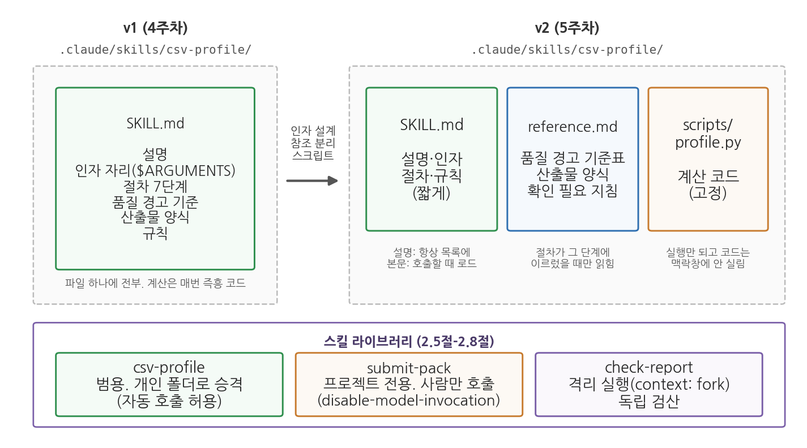
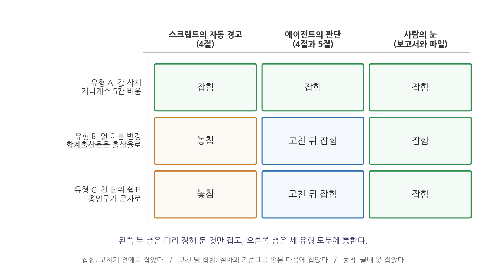

# 5주차 2회차. 스크립트가 딸린 Skill과 나만의 스킬 라이브러리

## 이 실습에서 하는 것

4주차 실습에서 만든 첫 스킬 csv-profile은 SKILL.md 파일 하나짜리였다. 파일 경로 하나만 인자로 받았고, 품질 경고의 기준표와 산출물 양식이 본문에 뒤섞여 있었으며, 무엇보다 계산 코드를 매번 에이전트가 즉흥으로 새로 썼다. 오늘은 그 스킬을 1회차에서 배운 세 방향(1.1절)으로 키운다. 이름 있는 인자를 받고, 참조 파일을 분리하고, 계산을 스크립트로 고정한다. 그리고 스킬이 여럿으로 늘어나는 순간, 그것들을 관리하는 나만의 스킬 라이브러리를 시작한다.

이 실습이 끝나면 다음 산출물이 남는다.

- `.claude/skills/csv-profile/` 폴더가 `SKILL.md` + `reference.md` + `scripts/profile.py`의 세 파일 구조(v2)로 바뀐다
- 새 스킬 `submit-pack`(제출 꾸러미 만들기. 사람만 부를 수 있게 잠근 스킬)과 선택 심화의 `check-report`(독립 검산 스킬)
- 스킬 라이브러리의 안내 문서 `.claude/skills/README.md`와 변경 기록(v1에서 v2로의 이력)
- 세 번째 스킬 `region-note`(사람은 못 부르고 에이전트만 참고하는 배경지식 스킬)와 팀원 공유 전 점검표
- 스킬 테스트 기록표(기준선 비교, 두 번째 데이터, 오류 심기 세 유형, 인자 누락, 없는 파일)
- (선택 심화) 스킬 폴더의 git 변경 이력과 되돌리기 실험 기록

오늘의 순서는 두 부분으로 나뉜다. 앞부분(2.1-2.4)은 스킬 하나를 키우는 일이다. csv-profile에 인자를 달고, 참조 파일을 떼어 내고, 스크립트를 붙이고, 동적 맥락 주입을 넣는데, 하나를 손볼 때마다 그것이 정말 작동하는지 실험으로 확인하고 넘어간다. 뒷부분(2.5-2.9)은 스킬이 여럿이 된 뒤의 일이다. 누가 부를 수 있는지를 설계하고, 스킬을 테스트하고, 라이브러리로 묶어 남에게 넘길 준비를 한다. 2.8과 2.9는 선택 심화라서 수업 시간에 다 하지 못해도 된다.

오늘은 실험이 열 번 넘게 나온다. 인자를 빼고 불러 보기, 기준을 바꿔 보기, 같은 명령을 세 번 실행하기, 스크립트를 일부러 깨뜨리기, 오류를 심은 사본 먹이기, 스킬을 잠그기 전과 후 비교하기 같은 것들이다. 실험마다 "무엇을 기대했고 실제로 무엇이 나왔는가"를 한 줄씩 적어 두면 2.6절의 기록표가 저절로 채워지고, 그 표가 그대로 과제 5-A가 된다. 메모장이든 대화창이든 상관없으니 적을 자리를 하나 열어 두고 시작하자.

## 준비물

| 구분 | 내용 |
|------|------|
| 폴더 | `공공데이터분석` 폴더 (4주차 실습의 `.claude/skills/csv-profile/SKILL.md`가 있는 상태) |
| 데이터 | `data/sigungu_2023.csv` (229개 시군구, 12열. 4주차와 같은 파일), `data/income_dist.csv` (소득분배지표 시계열. 출처: 국가데이터처(옛 통계청) 가계금융복지조사, KOSIS에서 수집. 13행 3열) |
| 도구 | VSCode + Claude Code 확장, uv 환경(3주차), Windows라면 Git Bash(2.4절의 동적 맥락 주입에 필요하며, 2.9절 선택 심화의 git도 여기에 함께 설치된다) |
| 선수 내용 | 5주차 1회차 (인자, 참조 파일, 스크립트, 자동 호출, 라이브러리), 4주차 2회차 (csv-profile v1), 2주차 (검증 손잡이, 독립 검산) |

## 2.1 csv-profile v2: 인자 설계

**무엇을 왜 하는가.** v1은 `$ARGUMENTS` 자리 하나에 파일 경로를 통째로 받았다. 인자가 하나뿐일 때는 충분하지만, 오늘부터는 "어느 파일을"에 더해 "어떤 깊이로"도 받고 싶다. 수업 중 빠르게 훑을 때는 열 정보와 품질 경고만 있는 간단한 보고서면 되고, 보고서에 실을 때는 수치형 요약표까지 있는 상세 보고서가 필요하다. 1회차 1.2절에서 배운 대로 머리말에 `arguments: [file, mode]`를 선언하면 본문에서 `$file`과 `$mode`라는 이름으로 각 인자를 따로 쓸 수 있다. 이름이 있으면 본문을 읽는 사람도, 에이전트도 어느 값이 어디에 쓰이는지 헷갈리지 않는다.

VSCode에서 `.claude/skills/csv-profile/SKILL.md`를 열고 머리말과 본문 첫 부분을 다음과 같이 고친다. 4주차처럼 손으로 고친다. 고칠 줄이 몇 줄 되지 않는다.

```markdown
---
name: csv-profile
description: CSV 파일을 받아 표준 형식의 데이터 프로파일링 보고서를 만든다.
  새 데이터 파일을 받았을 때, 데이터 개요·품질 진단·프로파일링을 요청받았을 때 사용.
argument-hint: [CSV 파일 경로] [간단|상세]
arguments: [file, mode]
---

프로파일링 대상 파일: $file
보고서 모드: $mode (비어 있거나 "간단"·"상세"가 아니면 "간단"으로 간주한다)
```

`argument-hint`는 대화창에서 `/csv-profile`을 고를 때 옆에 뜨는 힌트다. 두 번째 인자가 있다는 사실을 한 달 뒤의 나에게 알려 주는 장치다. 본문 둘째 줄의 괄호가 중요하다. 인자를 빠뜨렸을 때 어떻게 할지를 스킬 안에 적어 두면 에이전트가 되묻거나 멈추지 않고 기본값으로 진행한다. 본문의 나머지(절차, 산출물 형식, 규칙)는 아직 그대로 둔다. 2.2절과 2.3절에서 차례로 손본다.

인자의 이름은 스킬을 만드는 사람이 정한다. `mode` 대신 `format`이나 `depth`라고 적어도 되고, 머리말의 선언과 본문의 자리표시자가 같은 이름이기만 하면 그대로 작동한다. 이 실습에서는 1회차 표 5-1과 1.2절의 머리말 예시에 나온 이름을 글자까지 그대로 가져다 쓴다. 이론에서 읽은 것과 실습에서 만드는 것이 같은 파일이어야 두 장을 오가며 대조할 수 있기 때문이다. 다만 한번 정한 이름은 함부로 바꾸지 않는 편이 좋다. 머리말만 `[file, depth]`로 고치고 본문에 `$mode`가 남아 있으면 그 자리는 채워지지 않은 채 에이전트에게 전달되고, 에이전트는 빈칸을 나름대로 해석해 진행한다. 이름을 바꿀 때는 머리말과 본문을 함께 고치고, 고친 뒤 한 번 불러 값이 제자리에 들어가는지 확인한다.

인자가 어느 자리에 어떻게 들어가는지는 설명을 읽는 것보다 세 방식을 나란히 불러 보는 편이 빠르다. 1회차의 표 5-1이 읽는 표였다면 여기서는 그 표를 직접 채운다. SKILL.md 본문 맨 위에 다음 네 줄을 잠시 얹어 두자. 절차는 손대지 않고, 실험이 끝나면 이 네 줄만 지운다.

```markdown
받은 인자 확인 (실험용. 절차를 시작하기 전에 이 네 줄을 그대로 출력하라)
- 전체: $ARGUMENTS
- 위치: 0번 "$0" / 1번 "$1"
- 이름: file "$file" / mode "$mode"
```

<div style="border:1px solid #cfe3d4;border-left:5px solid #2f8f4e;background:#f4fbf6;padding:12px 16px;margin:18px 0;border-radius:4px;">
<strong>지시문 예시</strong><br>
"/csv-profile data/sigungu_2023.csv 간단"
</div>

**예상되는 에이전트의 행동과 결과.** 4주차와 같은 절차가 실행되되, 첫머리에 두 인자가 채워진 문장이 들어간다. 에이전트의 첫 보고에 "대상 파일 data/sigungu_2023.csv, 모드 간단"과 같은 확인이 나오고, `reports/프로파일_sigungu_2023.md`가 저장된다. 아직 스크립트가 없으므로 계산은 v1처럼 에이전트가 즉석에서 작성한 pandas 코드로 이루어진다. 이어서 `/csv-profile data/sigungu_2023.csv`처럼 모드를 빼고 부르면 기본값 규칙대로 간단 모드로 진행하는지, `/csv-profile`처럼 파일까지 빼면 어떻게 하는지 관찰한다. 파일 인자가 비면 절차 1(파일 존재 확인)에서 걸려 "어느 파일을 프로파일링할까요"라고 되묻는 것이 바람직하다. 되묻지 않고 아무 파일이나 골라 진행했다면, 본문에 "파일이 비어 있으면 멈추고 묻는다"를 추가해야 한다는 신호다.

화면에 찍히는 모양을 미리 익혀 두자. 2주차 실습에서 본 도구 호출 로그와 같은 꼴인데, 맨 위에 스킬이 로드되었다는 줄이 하나 더 붙는다. 줄 앞의 표시와 문구는 확장 버전에 따라 조금씩 다르므로 모양보다 순서를 본다.

```text
> /csv-profile data/sigungu_2023.csv 간단

● 스킬  csv-profile
  └ 인자: file="data/sigungu_2023.csv", mode="간단"

  받은 인자 확인
  - 전체: data/sigungu_2023.csv 간단
  - 위치: 0번 "data/sigungu_2023.csv" / 1번 "간단"
  - 이름: file "data/sigungu_2023.csv" / mode "간단"

● 읽기  data/sigungu_2023.csv
● 실행  프로파일링 계산 (pandas)
● 쓰기  reports/프로파일_sigungu_2023.md
```

첫 줄이 오늘 새로 보게 되는 줄이다. 4주차에는 스킬 이름만 떴지만 이제는 인자가 함께 뜨고, 그 아래에 방금 얹어 둔 네 줄이 그대로 출력된다. 여기서 세 자리표시자가 모두 같은 값을 가리키는 것이 보인다. 인자가 둘뿐이니 아직은 어느 방식이든 결과가 같지만, 다음 실험에서 갈린다.

이어서 같은 스킬을 네 번 부른다. 인자를 하나 빼고, 순서를 바꾸고, 둘 다 빼 본다.

<div style="border:1px solid #cfe3d4;border-left:5px solid #2f8f4e;background:#f4fbf6;padding:12px 16px;margin:18px 0;border-radius:4px;">
<strong>지시문 예시</strong><br>
"/csv-profile data/sigungu_2023.csv 간단"<br><br>
"/csv-profile data/sigungu_2023.csv"<br><br>
"/csv-profile 간단 data/sigungu_2023.csv"<br><br>
"/csv-profile"
</div>

**예상되는 에이전트의 행동과 결과(인자를 빼거나 순서를 바꾸었을 때).** 네 번의 "받은 인자 확인" 출력을 옮겨 적으면 표 5-5가 된다. 왼쪽 다섯 열은 자리표시자에 실제로 무엇이 들어가는지이고, 오른쪽 한 열은 그 인자를 받은 스킬이 해야 할 행동이다.

**표 5-5. 인자 자리표시자 네 가지 호출 (실험 결과를 옮겨 적는 표)**

| 부른 명령 | `$ARGUMENTS` | `$0` | `$1` | `$file` | `$mode` | 스킬이 해야 할 행동 |
|---|---|---|---|---|---|---|
| `/csv-profile data/sigungu_2023.csv 간단` | 두 값 전체 | 파일 경로 | 간단 | 파일 경로 | 간단 | 간단 보고서 |
| `/csv-profile data/sigungu_2023.csv` | 파일 경로 | 파일 경로 | (빔) | 파일 경로 | (빔) | 기본값 규칙대로 간단 보고서 |
| `/csv-profile 간단 data/sigungu_2023.csv` | 두 값 전체 | 간단 | 파일 경로 | 간단 | 파일 경로 | "간단"이라는 파일이 없으므로 멈춤 |
| `/csv-profile` | (빔) | (빔) | (빔) | (빔) | (빔) | 어느 파일인지 되묻고 멈춤 |

셋째 행이 1회차 유의 박스 "인자 순서는 소리 없이 어긋난다"가 말한 그 장면이다. `$file`에 "간단"이 들어가 있으므로 절차 1은 "간단이라는 파일이 없다"고 답하고 멈춰야 맞다. 그런데 에이전트가 "사용자가 파일과 모드를 바꿔 쓴 것 같으니 알아서 바로잡자"라고 판단해 그대로 진행하는 일이 있다. 이번에는 도움이 되지만, 인자 자리를 지키지 않아도 알아서 해 준다는 인상이 남으면 다음번에 진짜로 틀린 경로를 주었을 때도 비슷하게 짐작해 진행하게 된다. 진행했다면 절차 1을 "$file이 실제 파일이 아니면 짐작해서 고치지 말고 멈추고 묻는다"로 고쳐 두자.

<div style="border:1px solid #ecd9c6;border-left:5px solid #c77b2f;background:#fdf9f4;padding:12px 16px;margin:18px 0;border-radius:4px;">
<strong>유의 · 잘못된 경로를 주면 어떻게 되는가</strong><br>
한 번 더 시험해 볼 것이 있다. <code>/csv-profile data/sigugu_2023.csv 간단</code>처럼 파일 이름에 오타를 내 보라(<code>sigungu</code>의 <code>n</code>이 빠졌다). 바람직한 반응은 절차 1에서 "그런 파일이 없다"고 답하고 멈추는 것이다. 그러나 이 시점의 절차 1은 "파일이 존재하는지 확인한다"라고만 되어 있어서, 에이전트가 data 폴더를 훑어보고 가장 비슷한 <code>sigungu_2023.csv</code>를 골라 조용히 진행하는 일이 생긴다. 보고서 파일 이름은 오타 난 이름 그대로일 수도, 바로잡힌 이름일 수도 있다. 어느 쪽이든 여러분이 요청하지 않은 판단이 끼어든 것이다. 2.4절의 동적 맥락 주입이 바로 이 빈틈을 메우는 장치다.
</div>

**검증.** 세 가지를 본다. (1) 보고서 첫 줄의 파일 이름과 모드가 내가 입력한 인자와 같은가. (2) `/csv-profile`을 입력했을 때 자동완성 옆에 `[CSV 파일 경로] [간단|상세]` 힌트가 보이는가. (3) 인자를 뺀 두 번의 실행에서 에이전트가 한 행동을 한 줄씩 메모해 둔다. 이 메모는 2.6절의 테스트 기록표에 들어간다. 인자 순서를 바꿔 `/csv-profile 간단 data/sigungu_2023.csv`로 부르면 `$file`에 "간단"이 들어간다는 점도 기억해 두자. 순서가 곧 규칙이다. (4) 표 5-5의 빈칸을 실제 출력으로 채웠는가. 채우지 못한 칸이 있으면 그 호출만 다시 해 본다. (5) 네 번의 호출을 마치고 `reports/` 폴더를 연다. 새로 생긴 보고서가 몇 개인가. 멈춰야 할 두 호출(셋째, 넷째)에서도 파일이 생겼다면 절차 1이 작동하지 않은 것이다. 탐색기에서 파일의 수정 시각을 함께 보면 어느 호출의 산출물인지 가려낼 수 있다.

실험이 끝나면 "받은 인자 확인" 네 줄을 지우고 저장한다. 실험용 장치를 남겨 두면 다음 주부터 모든 보고서 앞에 이 네 줄이 따라붙는다. 다만 1회차 유의 박스가 권한 세 가지 대비책 가운데 둘은 이미 스킬에 남아 있고, 앞으로도 남겨 둔다. `argument-hint`에 적어 둔 순서가 하나이고, 본문 첫머리의 "프로파일링 대상 파일: $file"과 "보고서 모드: $mode" 두 줄이 다른 하나다. 받은 인자를 되풀이해 적게 하는 이 두 줄이 실험용 네 줄의 상시 축소판인 셈이라, 인자를 잘못 준 호출은 보고서 첫머리에서 바로 눈에 띈다. 남은 하나인 절차 1의 존재 확인은 2.4절에서 목록 대조로 더 튼튼해진다. 스킬을 고쳐 가며 실험할 때는 무엇을 임시로 넣었는지 적어 두고 실험이 끝나면 되돌리는 습관을 들이자. 2.7절에서 만들 변경 기록의 첫 용도가 이것이다.

## 2.2 참조 파일 분리: 기준표와 양식을 reference.md로

**무엇을 왜 하는가.** v1의 SKILL.md에는 절차 6에 품질 경고 기준(결측 30% 이상 등)이, 아래쪽에 산출물 형식이 통째로 들어 있었다. 스킬이 자랄수록 이런 자료가 본문을 길게 만든다. 1회차 1.3절의 점진적 공개(progressive disclosure) 원리대로, 에이전트가 절차의 특정 단계에서만 필요한 자료는 별도 파일로 빼고 SKILL.md에서 그 파일을 가리키게 한다. 그러면 스킬을 부를 때 맥락창에 실리는 것은 짧은 본문뿐이고, 기준표는 절차가 그 단계에 이르렀을 때만 읽힌다. 기준을 고칠 때 SKILL.md를 건드리지 않아도 된다는 실용적 이점도 있다.

`.claude/skills/csv-profile/reference.md`를 새로 만들고 다음 내용을 넣는다.

```markdown
# csv-profile 참조 자료

## 1. 품질 경고 기준표

| 항목 | 기준 | 경고 문구 |
|---|---|---|
| 결측 | 열의 결측 비율 30% 이상 | 결측 비율 30% 이상: <열 이름> (<비율>%) |
| 상수 열 | 값이 하나뿐인 열 | 값이 하나뿐인 열: <열 이름> |
| 중복 | 모든 열의 값이 같은 행 | 중복 행: <n>행 |
| 결측 위치 | 결측이 있는 행의 식별자(문자열 열) | 결측이 있는 행 <n>개 (처음 5개까지): ... |
| 문자로 저장된 숫자 | 숫자 열이 문자열로 읽힘(천 단위 쉼표 등) | 5절에 질문으로 남긴다 |

기준의 숫자(30%)를 바꾸면 scripts/profile.py 안의 같은 숫자도 함께 바꾼다.

## 2. 산출물 양식

# 데이터 프로파일링: <파일이름> (<모드> 모드)
## 1. 기본 정보 (원본 파일, 행 수, 열 수)
## 2. 열 정보 (표: 열 이름, 자료형, 결측 개수, 결측 비율, 고유값 수)
## 3. 수치형 요약 (표. 상세 모드에서만)
## 4. 품질 경고
## 5. 확인 필요 (사람 검토용)

## 3. "5. 확인 필요" 작성 지침

- 4절의 경고 하나마다 질문 하나. 예: "군위군의 합계출산율 결측을 제외할지, 다른 값으로
  채울지 결정이 필요하다." 결정하지 않고 선택지를 나열해 사람이 고르게 한다.
- 경고가 없으면 "없음"이라고 쓰되, 뜻을 알기 어려운 열이 있으면 정의 확인을 요청한다.
```

그다음 SKILL.md에서 옛 절차 6과 "산출물 형식" 절을 지우고, 절차의 해당 자리에 "품질 경고는 reference.md의 기준표를 따른다"와 "산출물 양식과 5절 작성 지침은 reference.md를 따른다"는 두 줄을 넣는다.

1회차 1.3절에서는 기준표를 `reference.md`로, 보고서 양식을 `examples.md`로 나누는 방식을 소개하면서, 다음 회차 실습에서는 두 자료를 한 파일에 담는 쪽으로 시작하겠다고 예고했다. 그 예고대로 여기서는 둘을 `reference.md` 한 파일의 1절과 2절로 합친다. 파일을 몇 개로 나눌지는 정답이 없고, 나눌 이유가 생겼을 때 나누면 된다. 기준표가 부서마다 달라져 그 파일만 교체하게 되는 날, 또는 양식이 한글 보고서용과 마크다운용으로 갈리는 날이 그 이유다. 지금은 스무 줄짜리 자료 하나이므로 파일 하나가 관리하기 쉽다.

한 줄 더 넣을 것이 있다. 1회차 1.3절 끝에서 말한 참조 파일의 검증 손잡이다. 위 기준표의 다섯 행에 위에서부터 Q1에서 Q5까지 번호를 붙이고, SKILL.md에서 품질 경고를 적는 단계에 다음 문장을 더한다.

```markdown
품질 경고를 적을 때마다 적용한 기준의 번호(reference.md 1절의 Q1-Q5)를
경고 문구 끝에 괄호로 함께 적는다.
```

이렇게 해 두면 보고서만 보고도 에이전트가 기준표를 정말 읽고 적용했는지 알 수 있다. 경고 문구는 그럴듯한데 번호가 없거나, 기준표에 없는 번호(Q6)가 붙어 있다면 기준표를 읽지 않고 지어냈다는 뜻이다.

<div style="border:1px solid #cfe3d4;border-left:5px solid #2f8f4e;background:#f4fbf6;padding:12px 16px;margin:18px 0;border-radius:4px;">
<strong>지시문 예시</strong><br>
"/csv-profile data/sigungu_2023.csv 상세"
</div>

**예상되는 에이전트의 행동과 결과.** 도구 사용 로그를 처음부터 끝까지 지켜본다. 스킬이 호출되는 순간 SKILL.md 본문이 로드되지만, reference.md는 그 시점에 읽히지 않는다. 절차가 품질 경고 단계에 이르렀을 때 비로소 로그에 reference.md를 읽는 도구 호출이 나타나고, 그 뒤에 4절과 5절이 작성된다. 반대로 새 대화를 열어 "data/sigungu_2023.csv의 행 수만 알려 줘"처럼 스킬과 무관한 요청을 하면 SKILL.md도 reference.md도 읽히지 않는다. 설명은 항상, 본문은 부를 때, 참조 파일은 필요할 때. 세 층이 로그에서 눈에 보인다.

로그를 옮겨 적으면 다음과 같은 순서다. 굵게 볼 것은 `읽기 reference.md`가 몇 번째 줄에 있느냐다.

```text
● 스킬  csv-profile
  └ 인자: file="data/sigungu_2023.csv", mode="상세"
● 읽기  data/sigungu_2023.csv
● 실행  프로파일링 계산 (pandas)
● 읽기  .claude/skills/csv-profile/reference.md      ← 여기
  └ 품질 경고 기준표와 산출물 양식을 읽음
● 쓰기  reports/프로파일_sigungu_2023.md
```

스킬 로드 줄과 `읽기 reference.md` 사이에 다른 도구 호출이 끼어 있으면 점진적 공개가 작동한 것이다. 두 줄이 붙어 있다면 에이전트가 절차를 시작하기도 전에 참조 파일을 미리 다 읽어 둔 것인데, 오늘처럼 짧은 파일에서는 문제가 되지 않지만 기준표가 300줄로 자라면 부를 때마다 300줄이 맥락창에 올라간다. 그럴 때는 절차 본문에서 파일을 가리키는 문장을 "이 단계에 이르렀을 때 reference.md를 읽는다"처럼 시점이 드러나게 고친다.

기준을 바꿔 보는 실험에는 요령이 하나 있다. `sigungu_2023.csv`에는 결측 비율이 30%를 넘는 열이 아예 없어서(가장 큰 값이 합계출산율과 출생아수의 0.4%다) 문턱을 50%로 올려도 경고는 여전히 "없음"이고, 기준이 바뀌었는지 안 바뀌었는지 알 수가 없다. 반대 방향으로 내려 보아야 변화가 보인다. reference.md 첫 행의 30%를 0.3%로 바꿔 저장하고 같은 명령을 다시 부르면 4절에 두 줄이 새로 나타난다.

```text
## 4. 품질 경고
- 결측 비율 0.3% 이상: 합계출산율 (0.4%) (Q1)
- 결측 비율 0.3% 이상: 출생아수 (0.4%) (Q1)
- 결측이 있는 행 1개 (처음 5개까지): 경북 군위군 (Q4)
```

SKILL.md는 한 글자도 건드리지 않았는데 보고서가 달라졌다. 이것이 분리의 목적이다. 확인했으면 0.3%를 30%로 되돌린다. 되돌리는 것을 잊으면 다음 주 보고서마다 결측이 있는 열이 전부 경고로 뜬다.

**검증.** (1) 로그에서 reference.md 읽기가 절차의 어느 위치에 나타났는지 적어 둔다. 스킬 호출 직후가 아니라 경고 단계 근처여야 점진적 공개가 작동한 것이다. (2) 보고서의 5절을 열어 본다. 군위군 결측에 대해 "제외했다"가 아니라 "제외할지 채울지 결정이 필요하다"로, 곧 결정이 아니라 질문으로 적혀 있어야 한다. (3) reference.md의 30%를 50%로 잠시 바꾸고 같은 명령을 다시 실행해 경고 문구가 새 기준을 따르는지 확인한 뒤 되돌린다. SKILL.md를 건드리지 않고 기준이 바뀌었다면 분리의 목적을 이룬 것이다. 바로 위에서 말했듯 이 파일에서는 문턱을 올리는 방향으로는 변화가 보이지 않으므로 0.3%로 내리는 실험을 함께 해 본다. (4) 4절의 경고마다 기준 번호(Q1-Q5)가 붙어 있는지 본다. 번호가 없으면 절차의 문장이 약한 것이고, 기준표에 없는 번호가 붙어 있으면 읽지 않고 지어낸 것이다. 후자라면 그 경고 문구 자체도 믿을 수 없으므로 기준표와 한 줄씩 대조한다.

(5) 마지막으로 참조 파일을 잠시 감춰 본다. `reference.md`의 이름을 `reference_backup.md`로 바꾸고 같은 명령을 부르면 어떻게 되는가. 여기서 갈리는 두 갈래를 잘 봐 두자. 하나는 에이전트가 "reference.md를 찾을 수 없다"고 알리고 멈추거나 되묻는 경우다. 다른 하나는 파일이 없다는 사실을 한 줄 언급하거나 아예 언급하지 않은 채, 자기가 아는 일반적인 기준(결측이 많으면 경고 같은)으로 4절을 채워 넣는 경우다. 둘째 갈래가 위험한 이유는 보고서의 겉모습이 똑같기 때문이다. 절 제목도 그대로이고 경고 문구도 그럴듯한데 기준만 여러분이 정한 것이 아니다. 이때 기준 번호 손잡이가 값을 한다. 번호가 사라졌거나 엉뚱한 번호가 붙었다면 참조 파일이 읽히지 않았다는 신호다. 확인이 끝나면 파일 이름을 되돌린다. 2.4절에서는 이와 반대로, 실패하면 스킬 전체가 멈춰 버리는 장치를 보게 된다. 조용히 넘어가는 실패와 시끄럽게 멈추는 실패의 차이를 오늘 두 번 다 겪는 셈이다.

## 2.3 스크립트가 딸린 스킬: 계산을 고정하기

**무엇을 왜 하는가.** 여기까지의 csv-profile은 절차와 기준은 고정했지만 계산은 고정하지 못했다. 부를 때마다 에이전트가 pandas 코드를 새로 쓰기 때문이다. 실제로 그런 장면을 보자. 2.2절의 상세 실행을 새 대화에서 한 번 더 했더니 총인구 평균이 225,507명으로 나왔다. 4주차 보고서(그리고 3주차의 첫 실행)에서는 224,625명이었다. 개수 열을 보니 모든 열이 228이다. 4주차에는 총인구가 229, 합계출산율만 228이었다. 차이는 1행, 곧 군위군이다. "이번 코드에서 결측을 어떻게 처리했는지 코드를 보여 줘"라고 물으면 코드 첫머리에 `df = df.dropna()`가 있다. 결측이 있는 행을 통째로 지우고 시작한 것이다. 군위군은 합계출산율만 비어 있는데 총인구까지 빠졌고, 그래서 총인구 평균이 883명 올라갔다. 어느 쪽도 계산 오류는 아니고 결측 처리 방식이 달랐을 뿐이지만, 같은 스킬을 두 번 불렀는데 평균이 다르다면 표준화의 실패다. 1회차 1.4절의 처방대로, 판단이 필요 없는 계산(1절부터 4절)은 스크립트 파일로 고정하고 스킬은 그것을 실행만 하게 한다. 데이터마다 다른 질문을 뽑아야 하는 5절은 에이전트가 reference.md를 읽고 쓰며, 결정은 사람이 한다. 4주차 1회차 1.5절의 자동화 경계가 파일 구조로 구현되는 셈이다.

결측 처리 하나로 값이 얼마나 갈리는지 미리 표로 보아 두자. 아래 셋은 모두 `data/sigungu_2023.csv`에서 실제로 계산한 값이고, 어느 것도 계산 오류가 아니다. 다른 것은 방식뿐이다.

**표 5-6. 결측 처리 방식에 따라 갈리는 값 (data/sigungu_2023.csv)**

| 처리 방식 | 계산에 쓰인 행 수 | 총인구 평균 | 합계출산율 평균 | 고령인구비율 평균 |
|---|---|---|---|---|
| 열마다 결측 제외 (v2 스크립트) | 229 | 224,624.6 | 0.823 (228개) | 24.980 |
| `dropna()`로 결측 행을 지우고 계산 | 228 | 225,507.4 | 0.823 (228개) | 24.895 |
| `fillna(0)`으로 빈칸을 0으로 채움 | 229 | 224,624.6 | 0.819 (229개) | 24.980 |

표를 읽는 법은 이렇다. 세 방식이 갈리는 열이 서로 다르다. `dropna()`는 군위군 한 행을 통째로 지우므로 군위군에 값이 있던 열까지 흔들린다. 군위군의 총인구는 23,340명으로 평균보다 훨씬 적어서 그 행을 빼면 총인구 평균이 883명 올라가고, 군위군의 고령인구비율은 44.18%로 평균보다 훨씬 높아서 그 행을 빼면 고령인구비율 평균이 24.980에서 24.895로 내려간다. 반대로 `fillna(0)`은 행을 지우지 않으므로 총인구와 고령인구비율은 그대로지만, 빈칸이 있던 합계출산율에서 "군위군의 출산율은 0이다"라는 없던 사실을 만들어 내 평균을 0.823에서 0.819로 끌어내린다. 여기서 알 수 있는 것은 결측 처리가 취향의 문제가 아니라는 점이다. 어느 열의 어느 값이 왜 달라지는지 설명할 수 있어야 하고, 그러려면 처리 방식이 매번 같아야 한다.

이번에는 4주차의 분업 원칙을 따라 스크립트 초안을 에이전트에게 맡긴다.

<div style="border:1px solid #cfe3d4;border-left:5px solid #2f8f4e;background:#f4fbf6;padding:12px 16px;margin:18px 0;border-radius:4px;">
<strong>지시문 예시</strong><br>
"csv-profile 스킬에 계산 스크립트를 붙이려고 해. .claude/skills/csv-profile/scripts/profile.py를 만들어 줘. 명령줄 인자로 CSV 경로와 모드(간단 또는 상세, 없으면 간단)를 받고, pandas로 읽어 reference.md의 산출물 양식 1절부터 4절까지를 마크다운으로 출력할 것. 열 정보 표(열 이름, 자료형, 결측 개수, 결측 비율 소수 1자리, 고유값 수), 상세 모드에서만 수치형 요약 표(개수, 평균, 표준편차, 최솟값, 중앙값, 최댓값, 소수 3자리), 품질 경고는 reference.md 기준표의 문구 그대로. 평균 등은 열마다 결측을 제외하고 계산하고 행을 통째로 지우지 말 것. 외부 패키지는 pandas만 쓰고 출력 인코딩은 UTF-8로 고정할 것. 만든 뒤 uv run python으로 data/sigungu_2023.csv 간단 모드를 실행해 출력을 보여 줘."
</div>

**예상되는 에이전트의 행동과 결과.** 에이전트가 `scripts/profile.py`를 만들고 실행한다. 50줄 안팎의 파일이 되며, 핵심은 다음 부분이다(이 장의 계산 코드 `code/ch05_practice.py`의 `profile` 함수가 같은 코드다).

```python
import sys
from pathlib import Path
import pandas as pd

sys.stdout.reconfigure(encoding="utf-8")          # 한글 출력 깨짐 방지
path = Path(sys.argv[1])
mode = "상세" if len(sys.argv) > 2 and sys.argv[2] == "상세" else "간단"
df = pd.read_csv(path, encoding="utf-8-sig")       # 파일 맨 앞의 BOM 처리
# 열 정보 표: df.dtypes, df.isna().sum(), df.isna().mean(), df.nunique()
if mode == "상세":                                  # 열마다 결측을 제외하고 계산
    summ = df.select_dtypes("number").agg(
        ["count", "mean", "std", "min", "median", "max"]).T.round(3)
warns = [f"- 결측 비율 30% 이상: {c} ({r:.1f}%)"
         for c, r in (df.isna().mean() * 100).items() if r >= 30]
```

읽는 요령은 두 군데다. `dropna()`가 없다. `agg(["count", "mean", ...])`는 열마다 결측을 빼고 세므로 총인구는 229개, 합계출산율은 228개의 평균이 된다. 그리고 30이라는 숫자가 reference.md의 기준표와 같은 값으로 박혀 있다. 실행 출력은 다음과 같은 모양이다(중간 행 생략).

```text
# 데이터 프로파일링: sigungu_2023.csv (간단 모드)

## 1. 기본 정보
- 원본 파일: data/sigungu_2023.csv
- 행 수: 229, 열 수: 12

## 2. 열 정보
| 열 이름 | 자료형 | 결측 개수 | 결측 비율(%) | 고유값 수 |
|---|---|---|---|---|
| 시도 | str | 0 | 0.0 | 17 |
| 시군구 | str | 0 | 0.0 | 207 |
| 총인구 | float64 | 0 | 0.0 | 229 |
| 합계출산율 | float64 | 1 | 0.4 | 193 |
| 출생아수 | float64 | 1 | 0.4 | 208 |

## 4. 품질 경고
- 결측이 있는 행 1개 (처음 5개까지): 경북 군위군
```

같은 스크립트에 인자만 "상세"로 바꿔 한 번 더 실행해 보라고 지시한다. 3절 자리에 수치형 요약표가 붙는다. 열 개수가 많아 여기서는 네 행만 옮긴다.

```text
## 3. 수치형 요약
| 열 이름 | 개수 | 평균 | 표준편차 | 최솟값 | 중앙값 | 최댓값 |
|---|---|---|---|---|---|---|
| 총인구 | 229 | 224624.62 | 223012.333 | 8996.0 | 146701.0 | 1190964.0 |
| 고령인구비율 | 229 | 24.98 | 8.851 | 10.677 | 22.707 | 45.278 |
| 합계출산율 | 228 | 0.823 | 0.213 | 0.32 | 0.79 | 1.651 |
| 출생아수 | 228 | 1008.645 | 1139.177 | 26.0 | 631.5 | 6714.0 |
```

"개수" 열을 맨 앞에 둔 이유가 여기서 드러난다. 총인구는 229, 합계출산율은 228이다. 4주차에 "이 평균은 몇 개 값의 평균인가"를 손으로 되물어야 했던 것이 이제 표 안에 항상 적혀 나온다. 검증 손잡이를 산출물 형식에 붙박이로 심은 셈이다. 값도 4주차 보고서와 맞는다. 총인구 평균 224,624.6, 고령인구비율 평균 24.98, 합계출산율 평균 0.823, 최솟값 0.32(부산 중구)와 최댓값 1.651(전남 영광군)이 그대로다.

이제 SKILL.md가 이 스크립트를 실행하도록 절차를 바꾼다. 절차 2를 "다음 명령을 실행해 보고서 1-4절을 만든다. 계산을 직접 코드로 다시 짜지 않는다. `uv run python ${CLAUDE_SKILL_DIR}/scripts/profile.py $file $mode`"로 고치고, 절차 3을 "출력을 그대로 reports/프로파일_<파일이름>.md에 저장한다"로 둔다. `${CLAUDE_SKILL_DIR}`는 이 스킬의 폴더를 가리키는 이름이어서 폴더를 옮겨도(2.7절) 경로가 깨지지 않는다. 머리말에는 `allowed-tools: Bash(uv run python ${CLAUDE_SKILL_DIR}/scripts/profile.py *)`를 추가한다. 스킬을 부른 턴에 한해 이 명령만 승인 없이 실행되게 하는 사전 승인이다.

<div style="border:1px solid #cfe3d4;border-left:5px solid #2f8f4e;background:#f4fbf6;padding:12px 16px;margin:18px 0;border-radius:4px;">
<strong>지시문 예시</strong><br>
"/csv-profile data/sigungu_2023.csv 상세 를 실행한 뒤, 같은 스크립트를 한 번 더 실행해서 출력을 reports/재현_2.md로 저장해 줘. 그리고 reports/프로파일_sigungu_2023.md의 1절부터 4절까지와 재현_2.md를 한 글자씩 비교해서(diff 또는 fc 명령) 다른 곳이 있으면 보여 줘."
</div>

**예상되는 에이전트의 행동과 결과.** 로그에 승인 창 없이 스크립트 실행이 나타나고, 비교 명령의 결과가 "차이 없음"으로 보고된다. 저자가 같은 스크립트를 세 번 실행해 비교했을 때도 세 출력이 글자 하나까지 같았다(간단 모드 733자, 상세 모드 1,408자). 같은 입력에 같은 출력이 나오는 이 성질이 재현성(reproducibility)이며, 이 절 첫머리의 표류가 사라졌다는 뜻이다. 상세 보고서의 수치형 요약표에서 총인구 개수 229와 평균 224624.62, 합계출산율 개수 228과 평균 0.823이 4주차 값과 다시 맞는다.

이제 앞뒤를 나란히 놓아 보자. 즉흥 코드 쪽도 세 번 돌려야 비교가 된다. 스킬 절차 2에서 스크립트를 실행하라는 줄만 잠시 지우고(다른 줄은 그대로 둔다) 같은 명령을 새 대화에서 세 번 부른 다음, 스크립트 줄을 되살려 다시 세 번 부른다. 여섯 번의 3절에서 총인구 평균과 합계출산율 개수만 옮겨 적으면 표 5-7이 채워진다.

**표 5-7. 재현 시험 기록표 (data/sigungu_2023.csv 상세 모드, 각 세 번)**

| 회차 | 즉흥 코드: 총인구 평균 | 즉흥 코드: 합계출산율 개수 | 스크립트: 총인구 평균 | 스크립트: 합계출산율 개수 |
|---|---|---|---|---|
| 1회 | | | 224624.62 | 228 |
| 2회 | | | 224624.62 | 228 |
| 3회 | | | 224624.62 | 228 |

오른쪽 두 열은 저자가 실제로 세 번 실행해 확인한 값이라 미리 채워 두었다. 여러분의 스크립트가 이 값과 다르게 나온다면 스크립트가 다른 것이지 데이터가 다른 것이 아니다. 왼쪽 두 열은 여러분이 채운다. 세 번이 모두 같게 나올 수도 있다. 그래도 실패한 실험이 아니다. "매번 다르다"가 아니라 "같다는 보장이 없다"가 요점이고, 표 5-6에서 보았듯 갈릴 때는 세 번째 자리가 아니라 883명 단위로 갈린다.

<div style="border:1px solid #e0d8ea;border-left:5px solid #7a5fa8;background:#faf8fc;padding:12px 16px;margin:18px 0;border-radius:4px;">
<strong>왜 세 번인가?</strong><br>
두 번이면 같거나 다르거나 둘 중 하나여서 어느 쪽이 우연인지 알기 어렵다. 세 번이면 "세 번 다 같다", "두 번 같고 한 번 다르다", "세 번 다 다르다"로 갈려 판단할 거리가 생긴다. 물론 세 번도 적다. 여기서 배울 것은 몇 번이면 충분한가가 아니라, 재현되는지를 <strong>확인해 보고 넘어간다</strong>는 습관 자체다. 13주차 파이프라인에서는 이 확인을 절차의 한 단계로 못 박는다.
</div>

**에이전트가 틀리는 장면(스크립트를 만들어 놓고 쓰지 않는다).** 스크립트를 붙였다고 해서 에이전트가 반드시 그것을 쓰는 것은 아니다. 네 단계로 겪어 보자. 첫째, 틀림이다. `/csv-profile data/sigungu_2023.csv 상세`를 불렀는데 보고서는 멀쩡히 나오고, 로그를 펼쳐 보니 `profile.py`를 실행한 줄이 없고 대신 새로 작성한 파이썬 코드를 실행한 줄이 있다. 절차 2에 "계산을 직접 코드로 다시 짜지 않는다"고 적어 두었는데도 그렇다. 도구 승인이 어긋났거나, 경로가 맞지 않았거나, 그편이 빠르다고 판단했을 때 생긴다. 둘째, 발견이다. 보고서 3절에서 총인구와 합계출산율의 개수가 둘 다 228이면 `dropna()`가 든 즉흥 코드이고, "개수" 열 자체가 없으면 양식조차 따르지 않은 것이다. 셋째, 재지시다. "이번 보고서의 수치를 어떤 코드로 계산했는지, 실행한 명령 전문을 그대로 보여 줘"라고 묻는다. 즉흥 코드였다면 여기서 드러난다. 넷째, 수정이다. 이번 보고서만 다시 만들게 하고 끝내지 말고 스킬을 고친다. 절차 2 끝에 "실행한 명령 전문을 보고서 끝의 부록 절에 그대로 붙인다"를 더하면(1회차 1.4절의 절차 3이 이것이다) 다음부터는 로그를 뒤지지 않고 보고서만 열어도 스크립트가 실제로 실행되었는지 알 수 있다.

마지막으로 스크립트를 일부러 깨뜨려 본다. 스크립트가 있다는 것과 스크립트가 맞다는 것이 다르다는 사실을, 고장 난 스크립트를 스킬이 어떻게 다루는지 보면서 확인한다.

<div style="border:1px solid #cfe3d4;border-left:5px solid #2f8f4e;background:#f4fbf6;padding:12px 16px;margin:18px 0;border-radius:4px;">
<strong>지시문 예시</strong><br>
"실험을 하나 할 거야. 먼저 .claude/skills/csv-profile/scripts/profile.py를 같은 폴더에 profile_backup.py로 복사해 둬. 그다음 원본에서 pandas를 부르는 이름을 pd에서 pdd로 한 군데만 바꿔 저장하고, /csv-profile data/sigungu_2023.csv 간단 을 실행했을 때 화면에 나오는 것을 고치려 하지 말고 그대로 보여 줘."
</div>

**예상되는 에이전트의 행동과 결과(스크립트를 깨뜨렸을 때).** 스크립트가 실행되자마자 오류로 끝나고 보고서는 만들어지지 않는다. 화면에는 파이썬의 오류 보고(traceback)가 그대로 찍힌다.

```text
● 실행  uv run python .../csv-profile/scripts/profile.py data/sigungu_2023.csv 간단
  └ 실패 (종료 코드 1)

Traceback (most recent call last):
  File ".../csv-profile/scripts/profile.py", line 6, in <module>
    df = pdd.read_csv(path, encoding='utf-8-sig')
         ^^^
NameError: name 'pdd' is not defined. Did you mean: 'pd'?
```

읽는 요령은 아래에서 위로다. 맨 아랫줄이 무엇이 잘못되었는지(`pdd`라는 이름이 없다), 그 위가 어느 파일 몇 번째 줄인지(`profile.py`의 6번째 줄)를 알려 준다. 마지막의 "Did you mean: 'pd'?"까지 친절하다. 이것은 좋은 실패다. 시끄럽게 멈추므로 아무도 틀린 숫자를 받아 가지 않는다. 에이전트가 "제가 고쳐 드릴까요"라고 물으면 아직 고치지 말고 다음 실험을 한 번 더 한다.

반대쪽 실패를 보자. 이번에는 `profile.py`에서 결측 비율을 소수 첫째 자리로 반올림하는 부분(`.round(1)`)을 `.round(0)`으로 한 글자만 바꾸고 저장한 뒤 같은 명령을 부른다. 이번에는 아무 오류도 나지 않고 보고서가 평소처럼 저장된다. 2절 열 정보 표의 마지막 두 행만 이렇게 바뀐다.

```text
| 합계출산율 | float64 | 1 | 0.0 | 193 |
| 출생아수 | float64 | 1 | 0.0 | 208 |
```

결측 개수는 1인데 결측 비율은 0.0%다. 229분의 1은 0.4%이므로 0.0%는 틀린 값이고, 무엇보다 같은 줄 안에서 앞뒤가 맞지 않는다. 그런데 스킬은 멈추지 않았고, 경고도 뜨지 않았고, 보고서는 여느 때와 똑같이 생겼다. 이것이 조용한 실패다. 1회차 유의 박스의 "같다는 것과 맞다는 것은 다르다"가 이 두 줄이다. 스크립트는 이제 매번 똑같이 0.0%를 낸다. 확인이 끝나면 `profile_backup.py`로 원본을 되돌리고, 되돌린 뒤 `/csv-profile data/sigungu_2023.csv 간단`을 한 번 더 실행해 결측 비율이 0.4%로 돌아왔는지 본다. 되돌렸다고 말하는 것과 되돌아간 것을 확인하는 것은 다르다.

**검증.** (1) `reports/프로파일_sigungu_2023.md`를 열어 3절의 총인구 개수(229)와 합계출산율 개수(228)가 서로 다른지 본다. 둘 다 228이면 스크립트 어딘가에 `dropna()`가 남아 있는 것이다. (2) 비교 결과가 정말 "차이 없음"인지, 에이전트의 요약이 아니라 명령 출력 원문으로 확인한다. (3) 로그에서 스크립트 실행에 승인 창이 뜨지 않았는지 본다. 떴다면 `allowed-tools`의 경로 문구와 절차 2의 명령이 글자 단위로 같은지 대조한다. (4) 표 5-7의 왼쪽 여섯 칸을 실제 값으로 채웠는지 본다. 같은 값이 여섯 번 나왔더라도 빈칸으로 두지 말고 그 사실을 적는다. (5) 두 번의 깨뜨리기 실험을 한 문장씩으로 정리해 둔다. "이름 오타는 스크립트가 멈춰서 알았다", "반올림 자릿수는 아무것도 멈추지 않아서 표의 두 열을 대조해서야 알았다" 정도면 된다. 무엇이 잡아 주었고 무엇이 잡아 주지 않았는지가 이 실습의 요점이다. (6) 되돌린 스크립트로 다시 실행한 보고서에서 합계출산율의 결측 비율이 0.4%인지 확인한다. 0.0%가 남아 있으면 되돌리기가 끝나지 않은 것이다.

한 가지 덧붙이면, 스크립트 실행에는 3주차에서 만든 환경이 필요하다. `uv run python`은 이 프로젝트 폴더의 환경에서 파이썬을 실행하라는 뜻이고, 그 환경에 pandas가 들어 있어야 한다. "모듈을 찾을 수 없다"는 오류가 나면 스킬이 아니라 환경 문제이므로 3주차 실습의 환경 확인 절차로 돌아간다. 스킬이 팀원의 컴퓨터에서 깨지는 가장 흔한 이유이기도 해서, 2.7절의 공유 점검표에 이 항목이 다시 나온다.

## 2.4 동적 맥락 주입: data 폴더 목록을 자동으로 싣기

**무엇을 왜 하는가.** 3주차에서 `sigungu_2024.csv`라는 없는 파일을 읽게 해 오류를 본 적이 있다. 스킬에서도 같은 일이 생긴다. 파일 이름 한 글자를 잘못 치면 절차 1에서야 실패하거나, 더 나쁘게는 에이전트가 비슷한 이름의 다른 파일을 골라 진행한다. 1회차 1.4절 끝에서 소개한 동적 맥락 주입을 쓰면, 스킬 본문이 에이전트에게 전달되기 직전에 셸 명령이 실행되어 그 출력이 본문에 끼워진다. data 폴더의 실제 파일 목록을 본문에 실어 두면 에이전트는 인자로 받은 이름을 그 목록과 대조할 수 있다.

SKILL.md 본문의 모드 줄 아래에 다음 두 줄을 넣는다. 느낌표 뒤에 백틱으로 감싼 명령이 그 자리에 출력으로 바뀐다.

```markdown
현재 data 폴더의 파일 목록:
!`ls data`
```

절차 1은 "$file이 위 목록에 있는지 확인한다. 없으면 가장 비슷한 이름을 제안하고 멈춘다"로 고친다. 그리고 머리말의 `allowed-tools`에 `Bash(ls *)`를 덧붙인다. 주입 명령은 승인 창 없이 실행되므로 사전 승인 목록에 있어야 한다.

<div style="border:1px solid #cfe3d4;border-left:5px solid #2f8f4e;background:#f4fbf6;padding:12px 16px;margin:18px 0;border-radius:4px;">
<strong>지시문 예시</strong><br>
"/csv-profile data/sigungu_2024.csv 간단"
</div>

**예상되는 에이전트의 행동과 결과.** 일부러 틀린 이름이다. 에이전트는 스크립트를 실행하기 전에 "data 폴더에 sigungu_2024.csv가 없다. 목록에 있는 sigungu_2023.csv를 말하는 것인가"라고 되묻고 멈춘다. 로그에서 스킬 본문을 펼쳐 보면 목록 자리에 `income_dist.csv`, `sigungu_2023.csv` 같은 실제 파일 이름이 들어가 있다. 이어서 실패도 경험해 본다. `ls data`를 `ls dta`로 잠시 바꿔 저장하고 같은 명령을 부르면, 없는 폴더라 명령이 실패하고 스킬 호출 전체가 오류와 함께 중단된다. 절차는 한 줄도 실행되지 않는다. 주입 명령의 실패는 경고가 아니라 중단임을 확인했으면 `ls data`로 되돌린다.

주입이 일어난 자리를 눈으로 보는 것이 이 절의 핵심이다. 로그에서 스킬 로드 줄을 펼치면 에이전트가 실제로 받은 본문이 보이는데, 파일에 적어 둔 두 줄이 다음과 같이 바뀌어 있다. 왼쪽이 여러분이 저장한 파일이고 오른쪽이 에이전트가 받은 본문이다.

```text
[SKILL.md 파일에 적힌 것]        [에이전트가 받은 본문]
현재 data 폴더의 파일 목록:      현재 data 폴더의 파일 목록:
!`ls data`                       income_dist.csv
                                 sigungu_2023.csv
```

명령 줄이 사라지고 그 자리에 출력이 앉았다. 에이전트는 명령을 실행한 적이 없고, 실행은 스킬이 전송되기 전에 이미 끝나 있었다. 그래서 이 목록은 에이전트가 "아마 이런 파일들이 있을 것"이라고 떠올린 이름이 아니라 그 순간 폴더에 정말 있던 이름이다. 목록에 없는 이름을 인자로 받으면 대조가 곧바로 된다.

실패도 화면으로 확인해 두자. `ls data`를 `ls dta`로 바꾸고 부르면 대략 이런 것이 뜬다.

```text
> /csv-profile data/sigungu_2023.csv 간단

● 스킬  csv-profile
  └ 본문 준비 중 명령 실행 실패: ls dta
     ls: cannot access 'dta': No such file or directory
  └ 스킬 호출을 중단했습니다.
```

멀쩡한 파일 이름을 주었는데도 아무것도 실행되지 않았다는 점이 중요하다. 절차 1도, 스크립트도, 보고서 저장도 시작되지 않았다. 주입 명령은 본문을 만드는 재료라서 재료가 없으면 본문 자체가 만들어지지 않는다. `reports/` 폴더를 열어 새 파일이 없는 것까지 확인하면 중단이 확실하다. 복구는 간단하다. SKILL.md를 열어 `dta`를 `data`로 고치고 저장한 뒤 같은 명령을 다시 부르면 된다. Claude Code를 다시 켜거나 대화를 새로 열 필요는 없다. 스킬 파일의 수정은 대화 중에 바로 반영되기 때문이다.

여기서 오늘 세 번째로 실패의 종류를 구분해 두자. 2.2절에서 참조 파일을 감췄을 때는 스킬이 계속 진행되었고(조용한 실패), 2.3절에서 스크립트를 깨뜨렸을 때는 스크립트만 멈추고 스킬은 오류를 받아 들었으며, 2.4절의 주입 실패는 스킬 자체가 시작조차 하지 않았다. 셋 중 가장 안전한 것이 마지막이고 가장 위험한 것이 첫 번째다. 어디에 무엇을 두느냐가 곧 어떤 실패를 겪을지를 정한다. 반드시 있어야 하는 것은 주입 명령이 걸리는 자리에, 없어도 되는 것은 참조 파일에 둔다.

**검증.** (1) 틀린 이름으로 불렀을 때 `reports/프로파일_sigungu_2024.md`가 만들어지지 않았는지 탐색기에서 확인한다. 만들어졌다면 에이전트가 목록 대조를 건너뛴 것이므로 절차 1에 "반드시"를 넣는다. (2) 에이전트의 답에 실제 파일 이름이 인용되어 있는가. 그것이 주입이 일어났다는 증거다. (3) `ls dta` 실험에서 오류 문구를 한 줄 메모해 둔다. 나중에 같은 문구를 만나면 주입 명령부터 의심할 수 있다. (4) `data`로 되돌린 뒤 `/csv-profile data/sigungu_2023.csv 간단`이 정상으로 돌아왔는지, 보고서가 다시 만들어지는지 확인한다. 되돌리는 것을 잊고 다음 절로 넘어가면 2.5절부터 모든 호출이 중단되어 원인을 찾느라 시간을 쓰게 된다. (5) 마지막으로 사전 승인을 잠시 빼 본다. 머리말 `allowed-tools`에서 `Bash(ls *)`만 지우고 저장한 뒤 같은 명령을 부르면 무슨 일이 생기는가. 승인 창이 뜨는지, 그냥 실행되는지, 아니면 중단되는지를 관찰해 한 줄 적고 원래대로 되돌린다. 이 관찰이 필요한 이유는 사전 승인의 범위가 스킬마다 다르게 설계될 것이기 때문이다. 무엇이 미리 허락되어 있는지 모른 채 남의 스킬을 실행하는 일은 없어야 한다.

<div style="border:1px solid #ecd9c6;border-left:5px solid #c77b2f;background:#fdf9f4;padding:12px 16px;margin:18px 0;border-radius:4px;">
<strong>유의 · Windows에서는 Git Bash가 필요하다</strong><br>
주입 명령은 기본적으로 bash로 실행되므로 Windows에서는 Git Bash가 있어야 하며, 없으면 명령이 실패해 스킬이 중단된다. PowerShell로 실행하려면 머리말에 <code>shell: powershell</code>을 적되, <code>ls</code>의 출력 모양이 달라지므로 절차 1의 문구도 손본다.
</div>

여기까지의 수정을 모두 반영한 SKILL.md v2 전문이다.

```markdown
---
name: csv-profile
description: CSV 파일을 받아 표준 형식의 데이터 프로파일링 보고서를 만든다.
  새 데이터 파일을 받았을 때, 데이터 개요·품질 진단·프로파일링을 요청받았을 때,
  "이 파일 어떤 데이터야", "이 데이터 개요 정리해 줘" 같은 요청에 사용.
when_to_use: 이 파일 어떤 데이터야, 데이터 개요, 프로파일링, 품질 진단, 결측 확인
argument-hint: [CSV 파일 경로] [간단|상세]
arguments: [file, mode]
allowed-tools: Bash(ls *), Bash(uv run python ${CLAUDE_SKILL_DIR}/scripts/profile.py *)
---

프로파일링 대상 파일: $file
보고서 모드: $mode (비어 있거나 "간단"·"상세"가 아니면 "간단"으로 간주한다)

현재 data 폴더의 파일 목록:
!`ls data`

## 절차

1. $file이 위 목록에 있는지 반드시 확인한다. 없으면 가장 비슷한 이름을 제안하고
   멈춘다. $file이 비어 있으면 어느 파일인지 묻고 멈춘다.
2. 다음 명령을 실행해 보고서 1-4절을 만든다. 계산을 직접 코드로 다시 짜지 않는다.
   uv run python ${CLAUDE_SKILL_DIR}/scripts/profile.py $file $mode
3. 출력을 그대로 reports/프로파일_<파일이름>.md 에 저장한다. 한 글자도 고치지 않는다.
4. 4절의 품질 경고를 reference.md의 기준표에 비추어 읽고, 5절 "확인 필요"를
   reference.md의 작성 지침에 따라 써서 같은 파일 끝에 덧붙인다. 경고마다
   적용한 기준의 번호(reference.md 1절의 Q1-Q5)를 문구 끝에 괄호로 적는다.
5. 보고서의 행 수·열 수를 원본 파일과 대조한 결과를 대화창에 한 줄로 보고한다.

## 규칙

- 모든 수치는 스크립트 출력에서 가져온다. 추측으로 채우지 않는다.
- 판단이 필요한 사항(이상치 처리, 결측 처리 등)은 결정하지 말고 5절에 질문으로 남긴다.
- 산출물 양식과 경고 기준은 reference.md를 따른다.
```



그림 5-4는 오늘 한 일을 한 장에 모은 것이다. 왼쪽 v1은 파일 하나에 전부 들어 있고 계산은 매번 즉흥 코드였다. 오른쪽 v2는 세 파일로 나뉘었고, 각 파일 아래에 적힌 것이 맥락창에 실리는 시점이다. 설명은 항상, 본문은 부를 때, reference.md는 필요할 때만, profile.py는 실행만 될 뿐 코드는 맥락창에 실리지 않는다. 여기서 알 수 있는 것은 스킬이 커져도 맥락창의 부담은 커지지 않게 설계할 수 있다는 점이다. 아래 띠는 2.5절부터 만드는 라이브러리의 주요 세 스킬이다. 2.5절에서는 여기에 더해 사람이 아니라 에이전트만 참고하는 네 번째 스킬도 하나 만들어 본다.

## 2.5 자동 호출 설계 실험

**무엇을 왜 하는가.** 스킬을 부르는 주체는 둘이다. 사람의 슬래시 커맨드와, 설명을 보고 스스로 꺼내 쓰는 에이전트. 1회차 1.5절에서 배웠듯 어느 쪽에 열어 둘지는 스킬마다 다르게 설계한다. csv-profile은 자주 쓰고 틀려도 피해가 작은 진단 절차라서 에이전트가 알아서 써 주면 편하다. 반대로 제출 폴더를 정리하는 절차는 타이밍을 사람이 정해야 한다. 오늘은 둘 다 실험한다. 먼저 csv-profile의 자동 호출이다. 4주차의 "개요를 정리해 줘"보다 더 일상적인 말로 새 대화에서 요청한다.

<div style="border:1px solid #cfe3d4;border-left:5px solid #2f8f4e;background:#f4fbf6;padding:12px 16px;margin:18px 0;border-radius:4px;">
<strong>지시문 예시</strong><br>
"data/income_dist.csv 이 파일 어떤 데이터야?"
</div>

**예상되는 에이전트의 행동과 결과.** 2.4절의 v2 전문에는 이미 이 표현이 `description`과 `when_to_use`에 들어 있다. 에이전트가 csv-profile을 스스로 꺼내 쓰면 로그에 스킬 로드와 스크립트 실행이 나타나고 `reports/프로파일_income_dist.md`가 생긴다. 13행 3열(연도, 지니계수, 소득5분위배율), 결측 없음, 품질 경고 없음이 보고될 것이다. 스킬 없이 파일을 훑어 "소득 불평등 지표 시계열입니다"라고만 답했다면, 여러분이 쓴 표현을 `when_to_use`에 추가하고 새 대화에서 다시 시험한다. 설명은 1,536자까지 쓸 수 있으니 실제로 쓰는 말투를 여러 개 넣어도 된다.

두 갈래를 로그로 가려내는 법은 4주차 2.4절과 같되, 이제는 갈림이 더 뚜렷하다. 스킬이 불렸으면 첫 줄에 스킬 이름이 뜨고 그 아래에 스크립트 실행 줄이 따라온다.

```text
> data/income_dist.csv 이 파일 어떤 데이터야?

● 스킬  csv-profile
  └ 인자: file="data/income_dist.csv", mode=(비어 있음 -> 간단)
● 실행  uv run python .../csv-profile/scripts/profile.py data/income_dist.csv 간단
● 쓰기  reports/프로파일_income_dist.md
```

불리지 않았으면 이 세 줄이 없고 파일을 읽은 줄 하나에 이어 문단 하나가 온다. 판단 기준을 하나 더 두자면 `reports/` 폴더다. 스킬이 불렸으면 파일이 생기고, 아니면 생기지 않는다. 에이전트에게 "방금 csv-profile을 썼어?"라고 묻는 것보다 폴더를 여는 편이 확실하다.

다음은 반대 방향이다. 제출 꾸러미를 만드는 두 번째 스킬 submit-pack을 만들되 에이전트의 자동 사용을 막는다.

<div style="border:1px solid #cfe3d4;border-left:5px solid #2f8f4e;background:#f4fbf6;padding:12px 16px;margin:18px 0;border-radius:4px;">
<strong>지시문 예시</strong><br>
".claude/skills/submit-pack/SKILL.md를 만들어 줘. 과제 번호를 인자 task로 받아서, (1) submit/과제번호/ 폴더가 이미 있으면 그 안의 파일을 submit/old/ 아래 과제번호와 오늘 날짜를 붙인 폴더로 옮기고(지우지 말 것), (2) reports 폴더의 md 파일과 .claude/skills 폴더 전체를 submit/과제번호/로 복사하고, (3) 복사한 파일의 이름·크기·원본 경로를 submit/과제번호/목록.md에 표로 적고, (4) 복사한 수와 옮긴 수를 보고하는 절차야. 원본은 절대 건드리지 말 것. 아직 머리말에 disable-model-invocation은 넣지 마. 만든 뒤 전문을 보여 줘."
</div>

에이전트가 만든 초안을 읽고 다음과 같이 다듬는다(잠금 줄은 잠시 뒤에 넣는다).

```markdown
---
name: submit-pack
description: reports 폴더의 보고서와 .claude/skills 폴더를 submit/<과제번호>/로 복사하고
  이전 제출본은 submit/old/로 옮겨 제출 꾸러미를 만든다. 과제 제출 직전에 사용.
argument-hint: [과제 번호, 예 5-A]
arguments: [task]
disable-model-invocation: true
---

과제 $task 의 제출 꾸러미를 만든다. 원본(reports, .claude)은 절대 수정·삭제하지 않는다.

## 절차

1. submit/$task/ 가 이미 있으면 그 안의 파일을 submit/old/ 아래
   "$task 뒤에 오늘 날짜를 붙인 폴더"(예: 5-A_0910)로 옮긴다. 지우지 않는다.
2. reports/ 의 .md 파일과 .claude/skills/ 폴더 전체를 submit/$task/ 로 복사한다.
3. submit/$task/목록.md 에 복사한 파일의 이름, 크기, 원본 경로를 표로 적는다.
4. 복사한 파일 수와 옮긴 파일 수를 대화창에 보고한다.
```

**예상되는 에이전트의 행동과 결과(잠그기 전과 후).** 잠금 줄(`disable-model-invocation: true`)을 아직 넣지 않은 상태에서 새 대화를 열고 "과제 제출 준비 좀 해 줘"라고 말해 본다. 설명이 요청과 맞으므로 에이전트가 submit-pack을 스스로 실행할 수 있다. 실행했다면 여러분이 정하지 않은 시점에 이전 제출본이 옮겨진 것이다. 묻기만 하고 실행하지 않았다면 이번에 운이 좋았을 뿐이다. 이제 잠금 줄을 넣고 저장한 뒤 새 대화에서 같은 말을 다시 해 본다. 잠긴 스킬의 설명은 에이전트의 맥락에 실리지 않으므로 에이전트는 그런 스킬이 있다는 것조차 모르고, `/submit-pack 5-A`라고 직접 부를 때만 실행된다.

같은 다섯 가지를 잠그기 전과 후에 각각 확인해 표 5-8에 적는다. 왼쪽 두 열은 설계상 그래야 하는 값이고, 맨 오른쪽 열은 여러분이 관찰한 것을 적는 자리다. 설계와 관찰이 다르면 그것이 오늘의 발견이다.

**표 5-8. submit-pack 잠그기 전과 후**

| 확인 항목 | 잠그기 전 | 잠근 뒤 (`disable-model-invocation: true`) | 관찰한 것 |
|---|---|---|---|
| `/` 목록에 보이는가 | 보인다 | 보인다 | |
| `/submit-pack 5-A`로 부르면 | 실행된다 | 실행된다 | |
| "과제 제출 준비 좀 해 줘"에 | 스스로 실행하거나 제안할 수 있다 | 그런 스킬을 모른다 | |
| "쓸 수 있는 스킬을 알려 줘"에 | 목록에 넣어 답한다 | 목록에서 빠진다 | |
| 설명이 에이전트 맥락에 | 실린다 | 실리지 않는다 | |

넷째 행이 이 설정의 성격을 잘 보여 준다. 사람에게는 그대로 보이는데 에이전트에게만 안 보인다. `/` 메뉴는 사람의 것이고 설명 목록은 에이전트의 것이어서, 같은 스킬이 두 쪽에서 다르게 존재한다. 다섯째 행에는 실용적인 이득도 있다. 학기말에 스킬이 열 개로 늘면 설명 열 개가 매 대화의 맥락창을 차지하는데, 사람만 부르는 스킬을 잠가 두면 그만큼이 빠진다.

이제 반대쪽 설정을 하나 만들어 본다. 사람은 못 부르고 에이전트만 참고하는 스킬이다. 1회차 표 5-2의 셋째 행에 있던 `user-invocable: false`가 그것이고, 어울리는 재료는 절차가 아니라 배경지식이다. 1회차 표 5-4의 구청 라이브러리에서 이 자리에 있던 것이 `stat-glossary`, 곧 용어와 열 이름을 적어 둔 짧은 문서였다. 자란 방향도 없고 검증 칸도 비어 있던 그 한 줄을 오늘 직접 만들어 본다. 시군구 데이터를 다룰 때마다 반복해서 설명해야 하는 지역 이름 규약을 스킬로 만들어 두면, 앞으로 어느 대화에서 시군구 파일을 다루든 에이전트가 알아서 참고한다.

<div style="border:1px solid #cfe3d4;border-left:5px solid #2f8f4e;background:#f4fbf6;padding:12px 16px;margin:18px 0;border-radius:4px;">
<strong>지시문 예시</strong><br>
".claude/skills/region-note/SKILL.md를 만들어 줘. 절차 스킬이 아니라 배경지식 스킬이야. 머리말에 user-invocable: false를 넣고, description에는 한국 시군구 데이터의 지역 이름 표기 규약이라는 것과 언제 참고해야 하는지를 적어 줘. 본문에는 (1) 중구·동구처럼 같은 이름의 시군구가 여러 시도에 있어서 시군구 이름만으로는 지역을 식별할 수 없다는 것, (2) 경북 군위군이 2023년 7월 1일 대구광역시에 편입되었다는 것, (3) 인천 미추홀구의 옛 이름이 남구라는 것, (4) 이 사항들이 결과에 영향을 주면 보고에 한 줄로 밝힐 것을 번호 목록으로 넣어. 만든 뒤 전문을 보여 줘."
</div>

에이전트가 만든 초안을 다음과 같이 다듬는다. 절차가 없고 확인할 것만 있는, 짧은 스킬이다.

```markdown
---
name: region-note
description: 한국 시군구 데이터의 지역 이름 표기 규약. 시군구 이름이 여러 시도에
  중복되는 문제, 2023년에 대구로 편입된 군위군, 옛 이름이 남구인 인천 미추홀구
  같은 사례를 모아 두었다. 시군구 이름을 다루거나 연도가 다른 두 자료의 지역
  목록을 맞출 때 참고한다.
user-invocable: false
---

## 지역 이름을 다룰 때 확인할 것

1. 시군구 이름만으로 지역을 식별하지 않는다. 중구·동구·남구처럼 같은 이름이
   여러 시도에 있어서, 229개 시군구의 시군구 이름은 207가지뿐이다. 시도와
   시군구를 짝으로 써야 229개가 모두 구별된다.
2. 경북 군위군은 2023년 7월 1일 대구광역시에 편입되었다. 2023년 자료에서
   이 지역의 값이 비어 있거나 소속 시도가 자료마다 다를 수 있다.
3. 인천 미추홀구의 옛 이름은 남구다. 연도가 다른 두 자료를 지역 이름으로
   맞출 때 이런 개명 지역이 조용히 빠질 수 있다.
4. 위 사항이 결과에 영향을 주면 결론에 그 사실을 한 줄로 밝힌다.
```

<div style="border:1px solid #cfe3d4;border-left:5px solid #2f8f4e;background:#f4fbf6;padding:12px 16px;margin:18px 0;border-radius:4px;">
<strong>지시문 예시</strong><br>
"(새 대화에서) data/sigungu_2023.csv에 시군구가 몇 개 들어 있는지 세어 줘. 어떻게 셌는지도 알려 줘."
</div>

**예상되는 에이전트의 행동과 결과(에이전트만 부르는 스킬).** 먼저 `/`를 입력해 보라. 목록에 region-note가 없다. 사람은 이 스킬을 부를 수 없다. 그런데 위 요청을 하면 시군구 파일을 다루는 작업이므로 에이전트가 region-note를 참고할 수 있고, 그러면 답이 이렇게 갈린다. 참고했다면 "시군구 열의 고유값은 207가지이지만 같은 이름이 여러 시도에 있어 시도와 짝으로 세면 229개"라고 두 숫자를 함께 답한다. 참고하지 않았다면 207이나 229 중 하나만 답한다. 4주차 2.3절에서 학생이 파일을 열어 가며 알아냈던 사실이, 이제는 에이전트 쪽에 미리 놓여 있는 셈이다. 두 숫자가 다 나오지 않았다면 `description`에 "시군구 개수", "지역 이름"처럼 실제로 쓰는 표현을 더한다.

이 스킬이 시험대에 오르는 것은 7주차다. 연도가 다른 두 시군구 파일을 지역 이름으로 병합할 때 미추홀구가 조용히 빠지는 장면이 나오는데, 그때 region-note가 실제로 도움이 되는지 보게 된다. 도움이 되지 않는다면 배경지식의 내용이 아니라 설명이 문제일 가능성이 높다.

**검증.** (1) `/`를 입력했을 때 목록에 submit-pack이 보이는가(사용자 호출은 열려 있어야 한다). (2) `/submit-pack 5-A` 실행 뒤 `submit/5-A/목록.md`를 열어 파일 수를 세고, `reports/` 폴더의 원본이 그대로 있는지 확인한다. (3) 한 번 더 실행해 `submit/old/` 아래에 날짜가 붙은 폴더가 생겼는지, 지워진 파일은 없는지 본다. (4) 잠그기 전후의 에이전트 행동을 한 줄씩 기록해 표 5-8의 맨 오른쪽 열을 채운다. 다섯 행 중 설계와 다르게 나온 행이 있으면 그 행에 표시해 둔다. (5) region-note를 `/` 목록에서 찾아본다. 보이면 `user-invocable: false`가 제대로 적히지 않은 것이다. (6) 새 대화에서 시군구 개수를 물은 답에 207과 229가 함께 나왔는지 본다. 하나만 나왔다면 배경지식이 참고되지 않은 것이므로 설명을 손보고 다시 시험한다.

두 스킬을 나란히 놓고 한 문장으로 정리해 보자. submit-pack은 사람만 부르고, region-note는 에이전트만 참고하며, csv-profile은 둘 다 부른다. 스킬 셋의 성격이 다른 것이 아니라 방아쇠를 누구에게 맡길지가 다른 것이고, 그 결정의 기준은 "잘못된 시점에 실행되면 무엇을 잃는가"다. submit-pack은 이전 제출본을 옮기므로 시점을 사람이 정해야 하고, region-note는 참고만 하므로 아무 때나 읽혀도 잃을 것이 없다.

## 2.6 스킬 테스트: 기준선 비교와 오류 심기

**무엇을 왜 하는가.** 스킬이 좋아졌다는 말은 비교 없이는 할 수 없다. 1회차 1.6절이 권한 기준선 비교(baseline comparison)는 같은 요청을 스킬 없이 한 번, 스킬로 한 번 새 대화에서 수행해 나란히 놓는 것이다. 여기에 두 가지를 더한다. 첫 데이터에서만 검증된 스킬은 두 번째 데이터에서 깨질 수 있으므로 `data/income_dist.csv`로 반복하고, 품질 경고가 정말 작동하는지 보려고 일부러 값을 지운 사본을 먹인다. 한 번도 울린 적 없는 경보기는 고장 난 것과 구별할 수 없다.

<div style="border:1px solid #cfe3d4;border-left:5px solid #2f8f4e;background:#f4fbf6;padding:12px 16px;margin:18px 0;border-radius:4px;">
<strong>지시문 예시</strong><br>
"(새 대화에서) 스킬을 쓰지 말고 data/income_dist.csv를 프로파일링해서 reports/기준선_income_dist.md로 저장해 줘. 행 수, 열 정보, 결측, 수치형 요약, 품질 문제를 포함할 것."<br><br>
"(또 다른 새 대화에서) /csv-profile data/income_dist.csv 상세"
</div>

**예상되는 에이전트의 행동과 결과.** 기준선 보고서는 항목 순서와 표 모양이 그때그때 다르고, 지니계수의 추세 해석까지 덧붙이기도 한다. 스킬 보고서는 2.3절과 같은 다섯 절 양식으로 나오며 3절의 수치형 요약은 다음과 같다.

```text
| 열 이름 | 개수 | 평균 | 표준편차 | 최솟값 | 중앙값 | 최댓값 |
|---|---|---|---|---|---|---|
| 연도 | 13 | 2017.0 | 3.894 | 2011.0 | 2017.0 | 2023.0 |
| 지니계수 | 13 | 0.349 | 0.022 | 0.323 | 0.35 | 0.387 |
| 소득5분위배율 | 13 | 6.715 | 0.872 | 5.72 | 6.81 | 8.25 |
```

두 보고서가 같은 사실(13행 3열, 2011년부터 2023년, 지니계수 최댓값 0.387과 최솟값 0.323)을 말하는지 대조하고, 형식과 검증 가능성에서 무엇이 다른지 적는다.

이제 오류를 심는다. 사본을 만드는 것도 에이전트에게 시키되, 지시가 어떻게 어긋날 수 있는지 지켜본다.

<div style="border:1px solid #cfe3d4;border-left:5px solid #2f8f4e;background:#f4fbf6;padding:12px 16px;margin:18px 0;border-radius:4px;">
<strong>지시문 예시</strong><br>
"data/income_dist.csv의 사본 data/income_dist_결측실험.csv를 만들어 줘. 2013, 2015, 2017, 2019, 2021년 행의 지니계수 칸만 비우고, 행은 지우지 말 것. 만든 뒤 사본의 행 수와 지니계수 결측 개수를 세어 보고해 줘. 원본은 건드리지 말 것."
</div>

**예상되는 에이전트의 행동과 결과(틀리는 장면).** 이 지시는 어긋나기 쉽다. "값을 지운다"를 "행을 지운다"로 받아 다섯 해의 행 자체를 없앤 사본이 나올 수 있고, 그러면 보고가 "행 수 8, 결측 0개"로 온다. 지시문에 "행 수와 결측 개수를 보고하라"는 손잡이를 달아 두었기 때문에 이 어긋남은 보고 한 줄에서 잡힌다. 13행이 아니면 "13행을 유지하고 지니계수 칸만 비워서 다시 만들어 줘"라고 재지시한다. 올바른 사본(행 수 13, 지니계수 결측 5개)에 `/csv-profile data/income_dist_결측실험.csv 간단`을 실행하면 4절에 두 줄이 찍힌다.

```text
## 4. 품질 경고
- 결측 비율 30% 이상: 지니계수 (38.5%)
- 결측이 있는 행 5개 (처음 5개까지): 2013, 2015, 2017, 2019, 2021
```

13개 중 5개가 비었으니 38.5%이고 30% 기준을 넘는다. 경보기가 울렸다. 상세 모드로 돌리면 지니계수 개수가 8, 평균이 0.35로 나오는데, 이 평균은 원본의 0.349와 조금 다르다. 8개 값의 평균이기 때문이다. 4주차에 "이 평균은 몇 개 값의 평균인가"를 물었던 이유가 여기서 다시 확인된다.

값을 지우는 것은 스킬이 잡기 가장 쉬운 오류다. 잡기 어려운 것을 두 개 더 심어 보자. 유형 B는 열 이름을 바꾸는 것이고, 유형 C는 숫자를 문자로 만드는 것이다. 둘 다 데이터를 망가뜨렸다는 표시가 겉으로 나지 않는다는 공통점이 있다.

<div style="border:1px solid #cfe3d4;border-left:5px solid #2f8f4e;background:#f4fbf6;padding:12px 16px;margin:18px 0;border-radius:4px;">
<strong>지시문 예시</strong><br>
"data/sigungu_2023.csv의 사본 data/sigungu_2023_열이름실험.csv를 만들어 줘. 열 이름 '합계출산율'만 '출산율'로 바꾸고 값과 행 수, 다른 열 이름은 그대로 둘 것. 만든 뒤 사본의 열 이름 목록과 행 수를 보고해 줘. 원본은 건드리지 말 것."<br><br>
"/csv-profile data/sigungu_2023_열이름실험.csv 간단"
</div>

**예상되는 에이전트의 행동과 결과(유형 B: 열 이름 변경).** 보고서가 아무 문제 없이 만들어진다. 2절 열 정보 표의 끝부분과 4절만 옮기면 이렇다.

```text
## 2. 열 정보
| 열 이름 | 자료형 | 결측 개수 | 결측 비율(%) | 고유값 수 |
|---|---|---|---|---|
| (앞의 아홉 행 생략)
| 고령인구비율 | float64 | 0 | 0.0 | 229 |
| 출산율 | float64 | 1 | 0.4 | 193 |
| 출생아수 | float64 | 1 | 0.4 | 208 |

## 4. 품질 경고
- 결측이 있는 행 1개 (처음 5개까지): 경북 군위군 (Q4)
```

경고는 원본을 돌렸을 때와 똑같이 한 줄뿐이다. 스킬 입장에서는 틀린 것이 없다. 229행 12열짜리 파일에 "출산율"이라는 실수형 열이 있고 결측이 하나 있다는 진단은 정확하다. 문제는 스킬이 이 파일에 어떤 열이 있어야 하는지를 모른다는 데 있다. 그런데 4주차부터 쌓인 보고서, 7주차의 병합, 9주차의 그림은 모두 "합계출산율"이라는 이름에 기대고 있어서, 이름 하나가 바뀌면 그 뒤가 전부 어긋난다. 심은 사람은 알지만 스킬은 모르는 오류다.

고치는 방법은 기대하는 모양을 스킬에 알려 주는 것이다. reference.md에 4절을 만들어 두 파일의 표준 열 구성을 적는다.

```markdown
## 4. 표준 열 구성 (Q6)

| 구성 이름 | 반드시 있어야 하는 열 |
|---|---|
| 시군구 2023 | 시도, 시군구, 총인구, 고령인구비율, 합계출산율, 출생아수 |
| 소득분배 시계열 | 연도, 지니계수, 소득5분위배율 |
```

그리고 SKILL.md 절차 4에 한 줄을 더한다. "$file의 열 이름 목록을 reference.md 4절의 구성들과 견주어 가장 가까운 것을 고르고, 그 구성에 있는데 파일에 없는 열이 있으면 4절에 경고로 적는다. 어느 구성과도 멀면 새 파일이므로 5절에 표준 구성 등록이 필요하다고 남긴다." 이렇게 고치고 다시 실행하면 4절에 한 줄이 늘어난다.

```text
## 4. 품질 경고
- 표준 구성 "시군구 2023"과 다름: '합계출산율'이 없다 (있는 비슷한 열: 출산율) (Q6)
- 결측이 있는 행 1개 (처음 5개까지): 경북 군위군 (Q4)
```

이 줄을 쓴 것은 스크립트가 아니라 에이전트다. "가장 가까운 구성을 고른다"와 "비슷한 열을 찾는다"는 판단이 필요한 일이라 스크립트로 고정하기 어렵다. 계산은 스크립트, 판단은 에이전트, 결정은 사람이라는 2.3절의 세 층이 여기서 한 번 더 갈린다.

<div style="border:1px solid #cfe3d4;border-left:5px solid #2f8f4e;background:#f4fbf6;padding:12px 16px;margin:18px 0;border-radius:4px;">
<strong>지시문 예시</strong><br>
"data/sigungu_2023.csv의 사본 data/sigungu_2023_쉼표실험.csv를 만들어 줘. 총인구 열의 값만 1190964 대신 1,190,964처럼 천 단위 쉼표를 넣은 문자열로 바꾸고, 다른 열과 행 수는 그대로 둘 것. CSV에서 쉼표가 든 값은 큰따옴표로 감싸야 열이 어긋나지 않아. 만든 뒤 사본의 첫 두 줄을 그대로 보여 줘. 원본은 건드리지 말 것."<br><br>
"/csv-profile data/sigungu_2023_쉼표실험.csv 상세"
</div>

**예상되는 에이전트의 행동과 결과(유형 C: 천 단위 쉼표).** 이번에도 보고서는 멀쩡히 나온다. 다만 두 군데가 조용히 달라진다. 2절에서 총인구의 자료형이 `str`로 바뀌고, 3절 수치형 요약표에서 총인구 행이 통째로 사라진다.

```text
## 2. 열 정보
| 열 이름 | 자료형 | 결측 개수 | 결측 비율(%) | 고유값 수 |
|---|---|---|---|---|
| 총인구 | str | 0 | 0.0 | 229 |          <- 원본에서는 float64였다

## 3. 수치형 요약
| 열 이름 | 개수 | 평균 | 표준편차 | 최솟값 | 중앙값 | 최댓값 |
|---|---|---|---|---|---|---|
| 면적 | 229 | 438.643 | 381.897 | 3.013 | 446.694 | 1820.573 |
| (이 표의 첫 행이 총인구가 아니다. 표 전체가 10행에서 9행으로 줄었다)

## 4. 품질 경고
- 결측이 있는 행 1개 (처음 5개까지): 경북 군위군 (Q4)
```

이 데이터에서 가장 중요한 열의 평균과 최댓값이 보고서에서 통째로 빠졌는데 경고는 한 줄도 없다. 쉼표가 들어가는 순간 pandas는 그 열을 숫자가 아니라 글자로 읽고, 스크립트의 수치형 요약은 숫자 열만 골라 계산하므로 총인구를 건너뛴다. 잘못된 값을 내놓은 것이 아니라 아무 값도 내놓지 않은 것이라 더 눈에 띄지 않는다.

reference.md 기준표의 다섯째 행을 다시 보자. "문자로 저장된 숫자"는 처음부터 기준표에 있었고, 경고 문구 자리에 "5절에 질문으로 남긴다"라고 적혀 있다. 곧 이 항목은 스크립트가 아니라 에이전트의 몫으로 설계되어 있었다. 그런데 에이전트가 2절 표의 `str`을 그냥 지나치면 5절도 비어 버린다. 4주차 2.6절에서 "확인 필요 절이 비어 있는 것도 신호"라고 한 그 신호다. 절차 4에 "2절 표에서 숫자여야 할 열이 문자형으로 읽혔으면 4절에 경고로 적고 5절에 질문으로 남긴다"를 더하고 다시 실행하면 두 줄이 나타난다.

```text
## 4. 품질 경고
- 문자로 저장된 숫자 의심: 총인구 (자료형 str, 천 단위 쉼표) (Q5)

## 5. 확인 필요 (사람 검토용)
- 총인구가 문자로 읽혔다. 쉼표를 지우고 숫자로 바꿔 다시 읽을지 결정이 필요하다.
```

세 실험을 표로 정리한다. "에이전트가 5절에 남겼나"와 "고친 뒤"는 여러분이 직접 확인해 채운다.

**표 5-9. 오류 심기 세 유형과 결과**

| 유형 | 심은 오류 | 고치기 전 스크립트가 잡았나 | 고치기 전 5절에 남았나 | 사람이 확인할 곳 | 스킬을 어떻게 고쳤나 |
|---|---|---|---|---|---|
| A 값 삭제 | 지니계수 5칸 비움 | 잡음 (결측 38.5% 경고) | | 5 나누기 13 = 0.385 | 고칠 것 없음 |
| B 열 이름 변경 | 합계출산율을 출산율로 | 못 잡음 | | 2절 표의 열 이름 | reference.md 4절 표준 구성 + 절차 4 대조 |
| C 천 단위 쉼표 | 총인구를 문자로 | 못 잡음 (자료형만 str) | | 3절에 총인구가 있는지 | 절차 4에 문자형 숫자 확인 |

표에서 알 수 있는 것은 스킬이 잡는 오류에 뚜렷한 성격이 있다는 점이다. A는 "값이 비었다"는 사실이 데이터 안에 그대로 남아 있어서 세기만 하면 된다. B와 C는 데이터 안에 이상한 것이 없다. 파일만 보면 완전히 정상이고, 이 파일이 어떠해야 하는지를 아는 바깥의 기준과 견주어야만 이상해진다. 그래서 A는 스크립트가, B와 C는 기준표를 읽는 에이전트가 잡는다. 그리고 셋 다 사람이 보고서를 열어 확인하면 잡힌다.



그림 5-5를 읽어 보자. 세로로 세 유형, 가로로 검증의 세 층이다. 왼쪽 열은 스크립트가 자동으로 내는 경고, 가운데 열은 에이전트가 reference.md를 읽고 쓰는 4절과 5절, 오른쪽 열은 사람이 보고서와 파일을 열어 보는 것이다. 칸 안의 글자는 오늘 실험한 결과이며, "고친 뒤 잡힘"은 절차나 기준표를 손본 다음에야 잡혔다는 뜻이다. 여기서 알 수 있는 것은 오른쪽 열에 "놓침"이 하나도 없다는 점이다. 왼쪽 두 층은 고칠수록 촘촘해지지만 미리 정해 둔 것만 잡고, 오른쪽 층은 느리지만 세 유형 모두에 통한다. 자동화를 아무리 정교하게 다듬어도 사람의 눈을 뺄 수 없는 이유가 이 한 장에 있다.

**검증.** (1) 사본을 VSCode에서 열어 2013년 행(3번째 줄)의 지니계수 자리가 비어 쉼표가 연달아 있는지, 전체가 헤더 포함 14줄인지 본다. (2) 경고의 38.5%를 손으로 확인한다. 5 나누기 13은 0.3846이다. (3) 유형 B의 사본을 열어 첫 줄(열 이름 줄)에서 "합계출산율"이 "출산율"로 바뀌었는지, 데이터 줄은 그대로인지 본다. 유형 C의 사본은 첫 데이터 줄에서 총인구 자리가 `"211,381"`처럼 큰따옴표에 싸여 있는지 본다. 큰따옴표가 없으면 쉼표 때문에 열이 하나 밀려서 다른 실험이 되어 버린다. (4) 유형 C 보고서의 3절에서 표의 행 수를 센다. 원본에서는 수치형 열이 10개였는데 9개면 총인구가 빠진 것이다. 빠진 열이 무엇인지 한 줄 적어 둔다. (5) 실험이 끝나면 사본 세 개를 지운다. 다음 주에 data 폴더를 열었을 때 어느 것이 진짜인지 헷갈리면 안 된다. (6) 오늘의 실험 결과를 표 5-10에 채운다. 이 표가 과제 5-A의 뼈대다.

**표 5-10. 스킬 테스트 기록표 (오른쪽 세 칸은 학생이 채운다)**

| 테스트 | 입력 | 기대한 결과 | 실제 결과 | 판정 | 고친 것 |
|---|---|---|---|---|---|
| 기준선 비교 | income_dist.csv, 스킬 없이/있이 | 같은 사실, 다른 형식 | | | |
| 두 번째 데이터 | income_dist.csv 상세 | 13행 3열, 경고 없음 | | | |
| 오류 심기 A | 결측실험 사본 | 결측 38.5% 경고 | | | |
| 오류 심기 B | 열이름실험 사본 | 고치기 전 경고 없음 | | | |
| 오류 심기 C | 쉼표실험 사본 | 3절에서 총인구가 빠짐 | | | |
| 인자 누락 | 모드 없이 / 파일 없이 (2.1절) | 간단 모드 / 되묻고 멈춤 | | | |
| 인자 순서 바꿈 | 간단을 앞에 (2.1절) | 파일 없음으로 멈춤 | | | |
| 참조 파일 문턱 변경 | 30%를 0.3%로 (2.2절) | 경고 두 줄 추가 | | | |
| 재현 시험 | 같은 명령 세 번 (2.3절) | 세 번 모두 같은 값 | | | |
| 스크립트 깨뜨리기 | pd를 pdd로 / round(1)을 round(0)으로 (2.3절) | 중단 / 조용히 0.0% | | | |
| 없는 파일 | sigungu_2024.csv (2.4절) | 목록 대조 후 멈춤 | | | |
| 주입 명령 실패 | ls dta (2.4절) | 스킬 전체 중단 | | | |
| 호출 잠금 | submit-pack 잠그기 전후 (2.5절) | 잠근 뒤 자동 호출 안 됨 | | | |
| 배경지식 스킬 | region-note (2.5절) | `/` 목록에 없고 207과 229를 함께 답함 | | | |

열네 줄이 많아 보이지만 오늘 실제로 한 실험을 옮겨 적는 것뿐이다. "실제 결과"는 "확인했음"이 아니라 "reports/프로파일_income_dist.md 4절이 비어 있었음"처럼 어느 파일 어느 자리에서 무엇을 보았는지로 적는다. "판정"은 기대와 같으면 일치, 다르면 불일치로 적고, 불일치인 줄에만 "고친 것"을 채운다. 일치한 줄이 많다고 잘한 실습이 아니다. 불일치를 하나도 만나지 못했다면 실험이 너무 쉬웠던 것이다.

## 2.7 스킬 라이브러리 정리: 승격, 기록, 공유

**무엇을 왜 하는가.** 스킬이 둘(선택 심화까지 하면 셋)이 되었다. 1회차 1.6절에서 배운 대로 라이브러리에는 세 가지가 필요하다. 어느 스킬이 어디에 사는지(위치), 무엇이 언제 왜 바뀌었는지(기록), 남에게 줄 때 무엇을 확인할지(공유). 위치부터 정한다. csv-profile은 어떤 CSV에나 쓰는 범용 절차이므로 다른 수업의 폴더에서도 쓰고 싶다. 그런 스킬은 홈 폴더(`C:\Users\사용자이름`) 아래 `.claude\skills\`로 옮기면 모든 프로젝트에서 보인다. 이것을 승격이라 부르자. 반면 submit-pack은 이 수업의 제출 폴더 구조에 묶여 있으므로 프로젝트에 남긴다. 옮기기 전에 우선순위를 실험한다. 같은 이름의 스킬이 개인 폴더와 프로젝트 폴더에 모두 있으면 개인 폴더 쪽이 우선한다(엔터프라이즈, 개인, 프로젝트 순).

<div style="border:1px solid #cfe3d4;border-left:5px solid #2f8f4e;background:#f4fbf6;padding:12px 16px;margin:18px 0;border-radius:4px;">
<strong>지시문 예시</strong><br>
".claude/skills/csv-profile 폴더 전체(SKILL.md, reference.md, scripts)를 홈 폴더의 .claude/skills/csv-profile로 복사해 줘. 복사본의 description 맨 앞에 '(개인)'이라는 표시를 넣고, 프로젝트 쪽 원본은 아직 지우지 마. 그다음 새 대화에서 확인할 수 있게 복사한 경로를 알려 줘."
</div>

**예상되는 에이전트의 행동과 결과.** 복사가 끝나면 새 대화를 열고 "csv-profile 스킬의 설명이 뭐라고 되어 있어?"라고 묻는다. 답에 "(개인)"이 보이면 개인 폴더 쪽이 이긴 것이다. 두 벌을 그대로 두면 나는 개인 폴더의 스킬로, 팀원은 프로젝트 폴더의 스킬로 일하게 되어 같은 이름인데 절차가 다른 두 스킬이 조용히 공존한다. 4주차 1회차에서 경계한 표류가 폴더 차원에서 재발하는 것이다. 규칙은 하나다. 같은 이름을 두 곳에 두지 않는다. "(개인)" 표시를 지우고 프로젝트 쪽 폴더를 삭제하라고 지시한 뒤, `/csv-profile data/sigungu_2023.csv 간단`이 여전히 작동하는지 본다. `${CLAUDE_SKILL_DIR}` 덕분에 스크립트 경로는 깨지지 않는다.

이제 기록이다. 에이전트에게 `.claude/skills/README.md`를 만들게 하고 내용을 다듬는다.

```markdown
# 스킬 라이브러리 (공공데이터분석 프로젝트)

| 스킬 | 위치 | 호출 | 용도 |
|---|---|---|---|
| csv-profile | 개인 폴더 (홈/.claude/skills/) | 사람 + 자동 | CSV 프로파일링 보고서 |
| submit-pack | 이 폴더 | 사람만 | 과제 제출 꾸러미 |
| region-note | 이 폴더 | 에이전트만 | 시군구 지역 이름 표기 규약 |
| check-report | 이 폴더 | 사람 + 자동 (fork) | 보고서 독립 검산 |

## 변경 기록

- csv-profile v1 (4주차): SKILL.md 한 파일. $ARGUMENTS로 경로만 받음. 계산은 즉흥 코드.
- csv-profile v2 (5주차): arguments [file, mode]. 기준표·양식을 reference.md로 분리.
  scripts/profile.py로 계산 고정(dropna로 평균이 달라지던 문제 해결). ls data 동적 주입.
  when_to_use 추가. 개인 폴더로 승격.
- csv-profile v2.1 (5주차): 오류 심기 B·C에서 놓친 것을 보완. reference.md에 표준 열
  구성(4절) 추가, 절차 4에 열 이름 대조와 문자형 숫자 확인 추가.
- submit-pack v1 (5주차): 신설. disable-model-invocation으로 잠금.
- region-note v1 (5주차): 신설. user-invocable: false. 시군구 이름 중복, 군위군 편입,
  미추홀구 개명 세 가지를 배경지식으로 정리.
```

변경 기록은 형식을 정해 두어야 한 달 뒤에도 쓸모가 있다. 이 교재에서는 한 줄에 네 가지를 담기를 권한다. 언제(주차나 날짜), 어느 스킬의 몇 번째 판인지, 무엇을 바꿨는지, 왜 바꿨는지다. 위의 v2.1 줄을 그 순서로 읽어 보면 "5주차에, csv-profile v2.1에서, 표준 열 구성과 두 확인 단계를 더했고, 오류 심기 실험에서 B와 C를 놓쳤기 때문"이 된다. 왜가 가장 중요하다. 무엇은 파일을 열어 보면 알 수 있지만 왜는 적어 두지 않으면 사라진다. 여기에 한 가지를 더 붙이면 좋다. 그 변경이 제대로 되었는지 확인한 방법이다. "열이름실험 사본을 다시 돌려 경고가 나오는 것을 확인"처럼 한 구절을 덧붙이면, 나중에 그 줄만 보고 같은 확인을 다시 할 수 있다.

<div style="border:1px solid #cfe3d4;border-left:5px solid #2f8f4e;background:#f4fbf6;padding:12px 16px;margin:18px 0;border-radius:4px;">
<strong>지시문 예시</strong><br>
"팀원에게 .claude/skills 폴더를 그대로 넘기려고 해. 각 SKILL.md와 스크립트를 읽고, 다른 사람의 컴퓨터에서 깨질 만한 것(절대 경로, 특정 패키지나 Git Bash 전제, 개인 폴더의 스킬을 가리키는 부분)을 표로 정리해 줘. 고치지는 말고 목록만."
</div>

**예상되는 에이전트의 행동과 결과(공유 점검).** 에이전트가 폴더의 파일을 하나씩 읽고 표를 만들어 준다. 그 표를 받아 여러분이 판정 열을 채우면 표 5-11이 된다. 1회차 1.6절은 넷을 점검하라 하고, 개인 폴더로 옮긴 스킬은 프로젝트 폴더를 통째로 넘겨도 따라가지 않는다는 것을 한 가지 더 짚었다. 오늘 실제로 만든 스킬들에 적용해 보면 항목이 거기서 조금 더 늘어난다.

**표 5-11. 팀원에게 넘기기 전 점검표 (오늘의 라이브러리에 적용한 결과)**

| 점검 항목 | 무엇이 문제가 되나 | 오늘의 라이브러리는 | 어떻게 할까 |
|---|---|---|---|
| 절대 경로가 있는가 | 남의 컴퓨터는 폴더 이름이 다르다 | 없음 (`${CLAUDE_SKILL_DIR}`를 씀) | 그대로 넘긴다 |
| 참조 파일과 스크립트가 폴더 안에 다 있는가 | 하나만 빠져도 절차가 멈춘다 | reference.md와 scripts/profile.py 있음 | 폴더째 복사한다 |
| 스크립트가 쓰는 패키지가 갖춰지는가 | pandas가 없으면 실행이 실패한다 | 3주차의 프로젝트 환경에 있음 | README에 "pandas 필요"를 적는다 |
| 셸을 가정하는 명령이 있는가 | `ls data`는 Windows에서 Git Bash가 필요하다 | 있음 (2.4절의 주입 명령) | README에 전제를 적거나 `shell`을 지정한다 |
| 개인 폴더의 스킬을 전제하는가 | 승격한 스킬은 프로젝트 폴더에 없다 | 있음 (csv-profile) | 개인 폴더 사본을 함께 넣는다 |
| 데이터 폴더 구조를 가정하는가 | `data/`가 없으면 주입 명령이 실패해 스킬이 중단된다 | 있음 | README에 폴더 구조를 한 줄로 적는다 |
| 설명이 남에게 이해되는가 | 만든 사람만 아는 줄임말이 섞인다 | 확인 필요 | 짝에게 읽혀 본다 (과제 5-C) |

셋째 행과 넷째 행이 오늘 실제로 겪은 것과 이어진다. 2.3절 끝에서 "모듈을 찾을 수 없다"는 오류를 환경 문제라고 했고, 2.4절에서 주입 명령이 실패하면 스킬 전체가 중단된다고 했다. 내 컴퓨터에서는 둘 다 갖춰져 있어 보이지 않던 전제가, 폴더를 넘기는 순간 상대의 화면에서 오류로 나타난다. 좋은 스킬은 전제가 없는 스킬이 아니라 전제를 적어 둔 스킬이다.

마지막 행은 에이전트가 판정할 수 없는 항목이다. "설명이 남에게 이해되는가"를 에이전트에게 물으면 대개 이해된다고 답하는데, 그 에이전트는 이미 폴더 전체를 읽은 상태라 무엇이든 이해할 수 있다. 아무것도 모르는 사람이 읽어야 알 수 있는 것이고, 그 실험이 과제 5-C다.

**에이전트가 틀리는 장면(제출 꾸러미에서 스킬 하나가 사라진다).** 승격의 파급을 네 단계로 겪어 보자. 첫째, 틀림이다. 승격을 마친 뒤 `/submit-pack 5-A`를 실행하면 "복사한 파일 12개, 옮긴 파일 0개"처럼 그럴듯한 보고가 온다. 오류도 경고도 없다. 둘째, 발견이다. `submit/5-A/목록.md`를 열어 스킬 이름을 세어 보면 submit-pack, region-note, check-report는 있는데 csv-profile이 없다. 오늘 가장 오래 손본 스킬이 제출물에서 빠졌다. submit-pack의 절차 2가 프로젝트의 `.claude/skills/` 폴더를 복사하라고 되어 있고, csv-profile은 조금 전에 개인 폴더로 이사했기 때문이다. 셋째, 재지시다. "개인 폴더의 스킬도 함께 복사하도록 submit-pack의 절차 2를 고쳐 줘. 어느 경로에서 가져왔는지 목록.md의 원본 경로 열에 남길 것"이라고 지시한다. 넷째, 수정이다. 고친 뒤 다시 실행해 목록.md에 csv-profile의 세 파일이 개인 폴더 경로와 함께 나타나는지 확인하고, 이 변경을 README의 변경 기록에도 한 줄 남긴다.

여기서 배울 것은 에이전트가 틀렸다기보다 절차가 낡았다는 점이다. 스킬 하나를 옮겼을 뿐인데 다른 스킬의 절차가 조용히 틀린 절차가 되었고, 그것을 알려 준 것은 오류 문구가 아니라 목록.md를 열어 이름을 세어 본 사람이었다. 라이브러리가 커질수록 스킬들은 서로를 전제하게 되고, 하나를 고칠 때 무엇이 함께 흔들리는지는 README의 위치 열을 보며 사람이 짚어야 한다.

**검증.** (1) README의 위치 열이 실제 폴더 상태와 맞는지 탐색기로 확인한다(프로젝트 폴더에 csv-profile이 남아 있으면 안 된다). (2) 변경 기록의 각 줄이 오늘 한 실험과 대응하는지 2.6절 기록표와 견준다. (3) 에이전트가 정리한 공유 점검표에서 최소 두 항목을 직접 확인한다. 예컨대 submit-pack은 `.claude/skills/` 폴더를 복사하므로 승격된 csv-profile은 제출 꾸러미에 들어가지 않는다. 개인 폴더의 csv-profile도 함께 복사하도록 submit-pack 절차 2에 한 줄을 더하고 그 수정도 변경 기록에 남긴다. 스킬 하나의 이사가 다른 스킬에 파급되는 것, 이것이 라이브러리를 관리해야 하는 이유다. 한 가지 더 기억할 것은 홈 폴더로 승격한 스킬은 프로젝트의 git 관리와 팀 전달에서 빠진다는 점이다. README에 위치를 적고 따로 백업하며, 팀 과제라면 승격보다 프로젝트 폴더에 두는 편이 안전할 때가 많다.

## 2.8 선택 심화: 독립 검산 스킬 만들기

**무엇을 왜 하는가.** 2주차 실습 2.7절에서 배운 독립 검산은 결과를 만든 대화가 아닌 새 대화에서 처음부터 다시 계산하게 하는 것이었다. 앞 대화의 판단이 검산에 스며들지 않게 하려는 것이다. 이 절차 자체를 스킬로 굳힐 수 있다. 머리말에 `context: fork`를 적으면 스킬 본문이 현재 대화가 아니라 격리된 서브에이전트 안에서 실행되고, `agent: general-purpose`는 그 서브에이전트의 종류를 정한다. 서브에이전트는 지금 대화의 내용을 모르므로 앞서 한 판단에 끌려갈 이유가 없다. 13주차에서는 이 역할을 `.claude/agents/verifier.md`라는 검증 전담 서브에이전트로 키우게 되는데, 오늘의 check-report는 그 예고편이다.

<div style="border:1px solid #cfe3d4;border-left:5px solid #2f8f4e;background:#f4fbf6;padding:12px 16px;margin:18px 0;border-radius:4px;">
<strong>지시문 예시</strong><br>
".claude/skills/check-report/SKILL.md를 만들어 줘. 인자는 report(보고서 경로)와 source(원본 CSV 경로) 둘이고, context는 fork, agent는 general-purpose로. 본문은 '너는 보고서를 만든 사람이 아니라 감사하는 사람'이라는 역할 선언으로 시작해서, 원본에서 먼저 다시 계산한 뒤에 보고서를 열어 항목별 대조표를 만드는 절차를 적어 줘. 만든 뒤 전문을 보여 줘."
</div>

에이전트의 초안을 다음과 같이 다듬는다.

```markdown
---
name: check-report
description: 프로파일링 보고서의 수치를 원본 CSV에서 처음부터 다시 계산해 항목별
  대조표를 만든다. 검산, 대조, 검증해 달라는 요청에 사용.
argument-hint: [보고서 경로] [원본 CSV 경로]
arguments: [report, source]
context: fork
agent: general-purpose
---

너는 보고서를 만든 사람이 아니라 감사하는 사람이다. $report 의 값을 베끼지 말고
$source 에서 직접 다시 계산한다.

## 절차

1. $source 를 pandas로 읽어 행 수, 열 수, 열별 결측 개수, 수치형 열의 개수·평균·
   중앙값·최솟값·최댓값을 새로 계산한다. $report 는 이 계산이 끝난 뒤에 연다.
2. $report 의 같은 항목과 나란히 놓은 대조표를 만든다.
   열: 항목 | 보고서 값 | 재계산 값 | 일치 여부
3. 평균은 몇 개 값으로 계산했는지(결측 제외 개수)를 함께 적는다.
4. 차이가 있으면 어느 항목이 얼마나 다른지만 적고 원인은 추측하지 않는다.
   확인할 수 없는 항목은 "확인 불가"라고 쓴다.
5. 대조표를 reports/검산_<보고서 파일이름>.md 로 저장하고 전체를 그대로 보고한다.
```

<div style="border:1px solid #cfe3d4;border-left:5px solid #2f8f4e;background:#f4fbf6;padding:12px 16px;margin:18px 0;border-radius:4px;">
<strong>지시문 예시</strong><br>
"/check-report reports/프로파일_sigungu_2023.md data/sigungu_2023.csv"
</div>

**예상되는 에이전트의 행동과 결과.** 로그에 서브에이전트 실행이 나타나고, 잠시 뒤 대조표가 돌아온다. 원본에서 다시 계산한 값은 다음과 같아야 한다.

```text
| 항목 | 보고서 값 | 재계산 값 | 일치 여부 |
|---|---|---|---|
| 행 수 | 229 | 229 | 일치 |
| 합계출산율 결측 | 1 (경북 군위군) | 1 (경북 군위군) | 일치 |
| 합계출산율 평균 | 0.823 (228개) | 0.823 (228개) | 일치 |
| 총인구 최댓값 | 1190964.0 | 1190964 (경기 수원시) | 일치 |
| 총인구 최솟값 | 8996.0 | 8996 (경북 울릉군) | 일치 |
```

**검증.** (1) 대조표의 재계산 값 중 총인구 최댓값을 CSV에서 수원시 행을 찾아 직접 대조한다. (2) 로그에서 서브에이전트가 원본 CSV를 먼저 읽고 보고서를 나중에 열었는지 순서를 본다. (3) 보고서 사본의 합계출산율 평균을 0.832로 살짝 고친 뒤 그 사본에 check-report를 돌려, 해당 행이 "불일치(보고서 0.832, 재계산 0.823)"로 잡히는지 본다. 검산 스킬이 있어도 결정적 항목 하나와 표본 몇 개는 여전히 사람이 파일에서 본다. 2주차 이래의 세 번째 겹이다.

이 스킬은 오늘 이후에도 쓰인다. 다음 주 6주차에 kosis MCP로 수집한 `data/sido_pop_2023.csv`를 `/csv-profile`로 진단하고, 그 보고서를 `/check-report`로 검산하면 수집, 진단, 검산이 한 흐름으로 이어진다.

## 2.9 선택 심화: 변경 이력을 git으로 남기기

**무엇을 왜 하는가.** 2.7절에서 만든 변경 기록은 사람이 손으로 쓰는 요약이다. 왜 바꿨는지를 남기는 데는 이만한 것이 없지만 두 가지를 못 한다. 무엇이 정확히 어떻게 바뀌었는지를 글자 단위로 남기지 못하고, 잘못 고친 것을 되돌리지 못한다. 오늘 하루만 돌아봐도 SKILL.md를 예닐곱 번 고쳤고 그중 세 번은 실험을 위해 일부러 망가뜨린 뒤 되돌려야 했다. `pdd`를 `pd`로, `round(0)`을 `round(1)`로, `dta`를 `data`로. 손으로 되돌리다 보면 되돌렸다고 생각한 것이 되돌아가지 않은 채 남고, 다음 주에 이상한 값을 보고서야 알게 된다. 1회차 1.6절에서 말한 git이 이 자리를 메운다.

<div style="border:1px solid #cdd9e5;border-left:5px solid #2f6fb0;background:#f5f9fd;padding:12px 16px;margin:18px 0;border-radius:4px;">
<strong>정의 · 변경 이력 관리(git)</strong><br>
<strong>git</strong>은 파일이 언제 어떻게 바뀌었는지를 기록하고 원하는 시점으로 되돌리는 도구다. 폴더 하나를 저장소로 삼아, 그 안의 파일 상태를 기록하고 싶을 때마다 짧은 메시지와 함께 저장한다. 이 저장 한 번을 <strong>기록</strong>(commit)이라 부르고, 기록들이 쌓인 것이 이력이다. 사진첩에 비유하면 기록은 한 장의 사진이고, 이력은 사진첩 전체이며, 되돌리기는 그 사진의 상태로 방을 다시 꾸미는 일이다. 이 과목에서는 명령을 외울 필요가 없다. 무엇을 기록할지와 언제 되돌릴지를 정해 에이전트에게 지시하면 된다.
</div>

<div style="border:1px solid #cfe3d4;border-left:5px solid #2f8f4e;background:#f4fbf6;padding:12px 16px;margin:18px 0;border-radius:4px;">
<strong>지시문 예시</strong><br>
"이 프로젝트 폴더에서 스킬 파일의 변경 이력을 git으로 남기려고 해. 아직 git 저장소가 없으면 만들고, .claude/skills 폴더의 파일만 먼저 기록해 줘. 기록 메시지는 '스킬 라이브러리 5주차 v2 정리'로 하고, 실행한 명령과 화면에 나온 출력을 그대로 보여 줘. data 폴더와 reports 폴더는 이번 기록에 넣지 말 것."
</div>

**예상되는 에이전트의 행동과 결과.** 명령 세 개가 차례로 실행되고, 마지막 출력에 이번 기록에 담긴 파일 목록이 뜬다.

```text
● 실행  git init
  └ Initialized empty Git repository in .../공공데이터분석/.git/
● 실행  git add .claude/skills
● 실행  git commit -m "스킬 라이브러리 5주차 v2 정리"
  └ [master (root-commit) 3f1c2a8] 스킬 라이브러리 5주차 v2 정리
     4 files changed, (더해진 줄 수) insertions(+)
     create mode 100644 .claude/skills/README.md
     create mode 100644 .claude/skills/check-report/SKILL.md
     create mode 100644 .claude/skills/region-note/SKILL.md
     create mode 100644 .claude/skills/submit-pack/SKILL.md
```

읽는 요령이 둘이다. 첫째, 대괄호 안의 일곱 자리 글자(`3f1c2a8`)가 이 기록에 붙은 고유 번호이고 여러분의 화면에서는 다른 값이 나온다. 둘째, 그 아래 목록이 이번에 기록된 파일 전부다. 2.8절을 건너뛰었다면 check-report 줄이 없어 세 파일일 것이다. 그리고 여기서 눈에 띄어야 할 것은 목록에 무엇이 있느냐가 아니라 무엇이 없느냐다. csv-profile이 없다. 2.7절에서 개인 폴더로 승격했으므로 프로젝트의 `.claude/skills/`에는 더 이상 없고, 따라서 프로젝트의 이력에도 남지 않는다. 2.7절 검증에서 "승격한 스킬은 프로젝트의 git 관리와 팀 전달에서 빠진다"고 예고한 일이 화면에 그대로 나타난 것이다. 오늘 가장 많이 고친 스킬이 이력에는 한 줄도 없는 셈이니, 개인 폴더도 따로 기록하든지 프로젝트로 되돌리든지 지금 정해야 한다.

이제 고친 것을 보는 법을 익힌다. 아무 스킬이나 한 줄 고쳐 놓고 지시한다.

<div style="border:1px solid #cfe3d4;border-left:5px solid #2f8f4e;background:#f4fbf6;padding:12px 16px;margin:18px 0;border-radius:4px;">
<strong>지시문 예시</strong><br>
"방금 submit-pack의 절차 2에 개인 폴더의 csv-profile도 함께 복사하라는 줄을 넣었어. 마지막 기록 이후로 무엇이 달라졌는지 git으로 보여 주고, 내가 확인한 다음에 '절차 2에 개인 폴더 스킬 복사 추가'라는 메시지로 기록해 줘. 내가 확인하기 전에는 기록하지 말 것."
</div>

**예상되는 에이전트의 행동과 결과(무엇이 달라졌는지 보기).** 두 명령이 실행된다. 앞의 것은 어느 파일이 바뀌었는지를, 뒤의 것은 그 파일의 어느 줄이 바뀌었는지를 보여 준다.

```text
● 실행  git status --short
  └  M .claude/skills/submit-pack/SKILL.md
● 실행  git diff
  └ diff --git a/.claude/skills/submit-pack/SKILL.md b/.claude/skills/submit-pack/SKILL.md
     @@ -12,6 +12,8 @@
      2. reports/ 의 .md 파일과 .claude/skills/ 폴더 전체를 submit/$task/ 로 복사한다.
     +   개인 폴더(홈/.claude/skills/)의 스킬도 같은 곳에 함께 복사한다.
      3. submit/$task/목록.md 에 복사한 파일의 이름, 크기, 원본 경로를 표로 적는다.
```

읽는 법은 줄 맨 앞의 한 글자다. `+`가 붙은 줄이 더해진 줄, `-`가 붙은 줄이 지워진 줄이고, 아무것도 없는 줄은 앞뒤 맥락을 보여 주려고 함께 띄운 것이다. 파일 이름 왼쪽의 `M`은 고쳐졌다(modified)는 표시다. 여기서 확인할 것은 딱 하나, 내가 의도한 줄만 바뀌었는가다. 의도하지 않은 줄이 함께 바뀌어 있다면 에이전트가 "정리"를 겸했다는 뜻이므로 기록하기 전에 되돌린다. 지시문에 "내가 확인하기 전에는 기록하지 말 것"을 넣은 이유가 이것이다. 기록은 되돌리기의 기준점이라, 확인하지 않은 상태를 기준점으로 삼으면 되돌릴 곳이 사라진다.

마지막으로 되돌리기를 실제로 해 본다. "submit-pack SKILL.md의 절차 3을 통째로 지우고 저장한 다음, 마지막 기록 상태로 되돌려 줘"라고 지시하면 `git status --short`에 `M` 표시가 떴다가 되돌린 뒤에는 아무것도 출력되지 않는다. 빈 출력이 곧 "기록과 파일이 같다"는 뜻이다. 파일을 열어 절차 3이 돌아왔는지 눈으로 확인한다.

<div style="border:1px solid #ecd9c6;border-left:5px solid #c77b2f;background:#fdf9f4;padding:12px 16px;margin:18px 0;border-radius:4px;">
<strong>유의 · 기록되지 않은 것은 되돌릴 수 없다</strong><br>
되돌리기는 마지막 기록 시점으로만 돌아간다. 기록을 하지 않고 세 시간 동안 고쳤다면 되돌릴 곳이 세 시간 전뿐이다. 그래서 실험을 시작하기 전에 한 번, 실험이 끝나 결과가 마음에 들 때 한 번 기록하는 습관이 좋다. 반대로 넣지 말아야 할 것도 있다. 개인정보가 든 파일, 용량이 큰 원본 데이터, 남에게 보이면 안 되는 메모는 기록에 넣지 않는다. 이번 지시에서 data 폴더와 reports 폴더를 빼라고 한 것이 그 연습이다. 무엇을 기록할지 정하는 것은 사람의 몫이며, 이 판단은 13주차에서 분석 파이프라인 전체를 기록할 때 다시 필요해진다.
</div>

**검증.** (1) 에이전트에게 "지금까지의 기록을 한 줄씩 보여 줘"라고 해 목록을 받는다. 기록이 둘 이상 있고, 각 줄의 메시지만 읽어도 무엇을 왜 했는지 짐작되는가. "수정", "업데이트" 같은 메시지만 있다면 2.7절의 변경 기록 형식(언제, 무엇을, 왜)을 메시지에도 적용한다. (2) VSCode 탐색기에서 프로젝트 폴더에 `.git` 폴더가 생겼는지 본다. 숨김 폴더라 보이지 않으면 에이전트에게 물어도 된다. (3) 되돌리기 뒤 SKILL.md를 직접 열어 지웠던 절차 3이 글자 그대로 돌아왔는지 확인한다. 에이전트의 "되돌렸습니다"는 보고이지 확인이 아니다. (4) README의 변경 기록과 git의 이력이 어떻게 다른지 한 문장으로 적어 둔다. 하나는 왜를 남기고 다른 하나는 무엇을 남긴다는 것이 요점이며, 그래서 둘 다 필요하다.

## 검증 체크리스트

- [ ] 보고서 첫 줄에 파일 이름과 모드가 입력한 대로 찍히고, 모드를 뺀 호출은 간단 모드로, 파일까지 뺀 호출은 되묻고 멈춘다
- [ ] reference.md 읽기가 로그에서 품질 경고 단계 근처에 나타났고, 보고서 5절이 "결정"이 아니라 "질문"으로 적혀 있다
- [ ] 상세 보고서에서 총인구 개수 229와 합계출산율 개수 228이 서로 다르게 나온다(`dropna()` 없음)
- [ ] 스크립트를 두 번 실행한 출력의 비교 결과 "차이 없음"을 명령 출력 원문으로 확인했다
- [ ] 없는 파일(sigungu_2024.csv)로 부르면 목록과 대조해 멈추고, `ls dta`로 바꾸면 스킬 전체가 중단된다
- [ ] submit-pack이 `/` 목록에는 보이지만 잠근 뒤에는 에이전트가 스스로 쓰지 않는다
- [ ] 결측실험 사본이 13행이고 경고 38.5%가 찍혔으며, 5 나누기 13을 손으로 확인했다
- [ ] 프로젝트 폴더에 csv-profile이 남아 있지 않고 README의 위치 열이 실제와 맞는다
- [ ] 표 5-5의 네 가지 호출을 모두 해 보았고, 멈춰야 할 두 호출에서는 보고서 파일이 생기지 않았다
- [ ] 4절의 경고마다 기준 번호(Q1-Q6)가 붙어 있고, reference.md를 잠시 감췄을 때 그 번호가 사라지는 것을 보았다
- [ ] 문턱을 0.3%로 내린 실험에서 경고 두 줄이 새로 나타났고, 실험 뒤 30%로 되돌렸다
- [ ] 표 5-7의 재현 시험을 여섯 번(즉흥 코드 세 번, 스크립트 세 번) 실행해 채웠다
- [ ] 스크립트를 두 방식으로 깨뜨려 보았고(`pdd`, `round(0)`), 시끄러운 실패와 조용한 실패의 차이를 한 문장으로 적었다
- [ ] 로그에서 스킬 본문을 펼쳐 주입된 실제 파일 목록을 눈으로 확인했다
- [ ] 표 5-8의 다섯 행을 잠그기 전후로 관찰해 채웠고, region-note가 `/` 목록에 없는 것과 시군구 개수 답에 207과 229가 함께 나오는 것을 확인했다
- [ ] 오류 심기 세 유형을 모두 심었고, B와 C를 잡도록 스킬을 고친 뒤 다시 돌려 경고가 나오는 것을 보았다
- [ ] 실험용 사본 세 개와 SKILL.md에 얹어 둔 임시 줄을 모두 지웠고, 백업본으로 되돌린 스크립트가 정상 값을 내는지 확인했다
- [ ] 표 5-11의 일곱 항목을 오늘의 라이브러리에 적용해 판정했고, 그중 두 항목은 직접 확인했다
- [ ] (선택) check-report의 총인구 최댓값을 CSV의 수원시 행에서 직접 대조했다
- [ ] (선택) git 기록이 둘 이상 남았고, 되돌리기를 한 뒤 파일을 직접 열어 내용이 돌아왔는지 확인했다

## 자주 겪는 문제

| 증상 | 원인 | 해결 |
|------|------|------|
| `$file` 자리에 "간단"이 들어가고 파일을 못 찾는다 | 인자 순서를 바꿔 입력 | `arguments` 순서대로 입력. `argument-hint`에 순서를 적어 둔다 |
| reference.md를 처음부터 읽거나 아예 안 읽는다 | SKILL.md에서 파일을 가리키는 문구가 없거나 모호함 | 절차의 해당 단계에 "reference.md의 기준표를 따른다"를 명시 |
| 스크립트 실행마다 승인 창이 뜬다 | `allowed-tools`의 문구와 실제 명령이 다름 | 두 문구를 글자 단위로 맞춘다. 승인해도 실행 자체는 된다 |
| 스크립트 출력의 한글이 깨진다 | 콘솔 인코딩이 UTF-8이 아님 | 스크립트 첫머리의 `sys.stdout.reconfigure(encoding="utf-8")` 확인 |
| 스킬을 부르자마자 오류로 중단된다 | 동적 주입 명령 실패(폴더 이름 오타, Git Bash 없음) | 명령 철자와 Git Bash 설치 확인. 필요하면 `shell: powershell` |
| 잠근 스킬이 `/` 목록에서 사라졌다 | `disable-model-invocation` 대신 `user-invocable: false`를 씀 | 두 필드의 방향이 반대다. 전자는 사람만, 후자는 에이전트만 |
| 승격 뒤 `/csv-profile`이 두 번 뜨거나 옛 절차로 실행된다 | 개인·프로젝트 폴더에 같은 이름이 공존 | 한 곳만 남긴다. 개인 폴더가 우선하므로 프로젝트 쪽을 지운다 |
| 결측실험 사본이 8행이다 | "값 삭제"를 "행 삭제"로 수행 | 행 수 보고 손잡이로 잡아내고 "칸만 비울 것"으로 재지시 |
| 보고서의 경고에 기준 번호(Q1)가 붙지 않는다 | 절차에 번호를 적으라는 문장이 없거나 약함 | 절차 4에 "적용한 기준 번호를 괄호로 함께 적는다"를 명시. 기준표에 없는 번호가 붙어 있으면 기준표를 읽지 않고 지어낸 것이므로 경고 문구 자체를 대조한다 |
| 문턱을 50%로 올렸는데 보고서가 하나도 달라지지 않는다 | 이 파일에 결측 30%를 넘는 열이 없어 두 기준의 결과가 같음 | 반대로 0.3%까지 내려서 시험한다. 변화가 보이는 방향으로 실험을 설계하는 것도 요령이다 |
| 인자 순서를 바꿔 불렀는데 에이전트가 알아서 바로잡는다 | 절차 1이 짐작을 허용함 | "짐작해 고치지 말고 멈추고 묻는다"로 절차 1을 고친다. 편해 보이지만 진짜 오타를 넘겨 버린다 |
| 열 이름이 바뀐 파일인데 경고가 하나도 없다 | 스킬이 이 파일의 표준 열 구성을 모름 | reference.md에 표준 열 구성을 넣고 절차 4에 대조 단계를 추가 (2.6절 유형 B) |
| 3절 수치형 요약에서 열 하나가 통째로 빠졌다 | 그 열이 문자로 읽힘(천 단위 쉼표, 단위 문자 등) | 2절 표에서 그 열의 자료형이 `str`인지 확인. 절차 4에 문자형 숫자 확인을 추가 (2.6절 유형 C) |
| 스크립트가 오류 없이 도는데 값이 이상하다 | 조용한 실패(반올림 자릿수, 문턱 숫자가 바뀜) | 백업본과 대조하거나 표 5-7처럼 이미 아는 값과 맞춰 본다. 오류가 안 나는 것이 맞다는 뜻은 아니다 |
| region-note가 참고되지 않는다 | 설명이 실제 요청 표현과 멂 | `description`에 실제로 쓰는 표현을 추가한다. `user-invocable: false`라서 `/`로 직접 불러 시험할 수는 없고, 새 대화에서 요청을 바꿔 가며 관찰한다 |
| 실험 사본이 data 폴더에 쌓여 헷갈린다 | 실험이 끝난 뒤 사본을 지우지 않음 | 실험이 끝나면 바로 지운다. 2.4절의 주입 목록에 사본 이름이 섞이면 다음 실험이 어긋난다 |
| git으로 되돌렸는데 옛 내용이 그대로다 | 기록하지 않은 변경은 되돌릴 곳이 없음 | 실험을 시작하기 전에 먼저 기록한다. 되돌린 뒤에는 파일을 직접 열어 확인한다 |

## 제출 과제

**과제 5-A. csv-profile v2 테스트 보고.** 2.6절의 테스트 기록표(표 5-10)를 열네 행 모두 채워 제출한다. "실제 결과"는 "확인했음"이 아니라 파일 이름, 몇 번째 줄, 어떤 값을 보았는지 수준으로 적는다. SKILL.md v2 전문, reference.md, README의 변경 기록을 붙인다. 평가 기준은 기대와 실제의 차이를 얼마나 구체적으로 적었는가와 차이가 났을 때 무엇을 고쳤는가다.

**과제 5-B. 나만의 스크립트 딸린 스킬.** 4주차 과제 4-B의 스킬(또는 새 스킬)에 이름 있는 인자, reference.md 분리, 스크립트 고정, 동적 주입, 호출 잠금 중 둘 이상을 적용한다. 제출물: (1) 폴더 구조와 각 파일 전문, (2) 같은 입력에 두 번 실행한 결과의 비교, (3) 계산이 고정된 부분, 에이전트가 판단하는 부분, 사람이 결정하는 부분을 각각 한 문장. 평가 기준은 세 층의 구분이 설득력 있는가다.

**과제 5-C. 라이브러리 감사.** 짝과 `.claude/skills` 폴더를 교환하고 상대의 README와 변경 기록만 보고 각 스킬을 실행해 본다. (1) 기록만으로 실행할 수 있었는지, (2) 내 컴퓨터에서 깨진 것(경로, 패키지, Git Bash)이 있었는지, (3) 상대의 스킬 하나에 check-report 방식의 독립 검산을 수행한 대조표를 제출한다. 평가 기준은 발견한 문제의 구체성이다. 표 5-11의 일곱 항목을 상대의 폴더에 적용한 결과를 함께 내면 (2)의 근거가 뚜렷해진다.

**과제 5-D. 실패 도감.** 오늘 스킬은 여러 방식으로 실패했다. (가) 참조 파일을 감췄을 때(2.2절), (나) 스크립트의 이름을 틀렸을 때(2.3절), (다) 스크립트의 반올림 자릿수를 바꿨을 때(2.3절), (라) 주입 명령의 폴더 이름을 틀렸을 때(2.4절), (마) 열 이름이 바뀐 파일을 주었을 때(2.6절 유형 B), (바) 천 단위 쉼표가 든 파일을 주었을 때(2.6절 유형 C)의 여섯 가지다. 각각에 대해 세 가지를 한 줄씩 적어 표로 제출한다. (1) 무엇이 멈췄는가(아무것도 멈추지 않음, 스크립트만 멈춤, 스킬 전체가 멈춤 중 하나), (2) 나는 무엇을 보고 알았는가(화면의 오류 문구, 보고서의 어느 줄, 다른 값과의 대조 중 어느 것인지 구체적으로), (3) 다음에 같은 증상을 만나면 어디부터 볼 것인가. 그다음 과제 5-B에서 만든 자기 스킬에 여섯 가지 중 하나를 골라 직접 일으키고 그 결과를 한 행 덧붙인다. 평가 기준은 멈추는 실패와 멈추지 않는 실패를 구분했는가, 그리고 멈추지 않는 실패를 무엇으로 알아차렸는가다. 여섯 행 중 (다), (마), (바)가 멈추지 않는 실패이며, 이 세 줄이 이 과제의 핵심이다.
