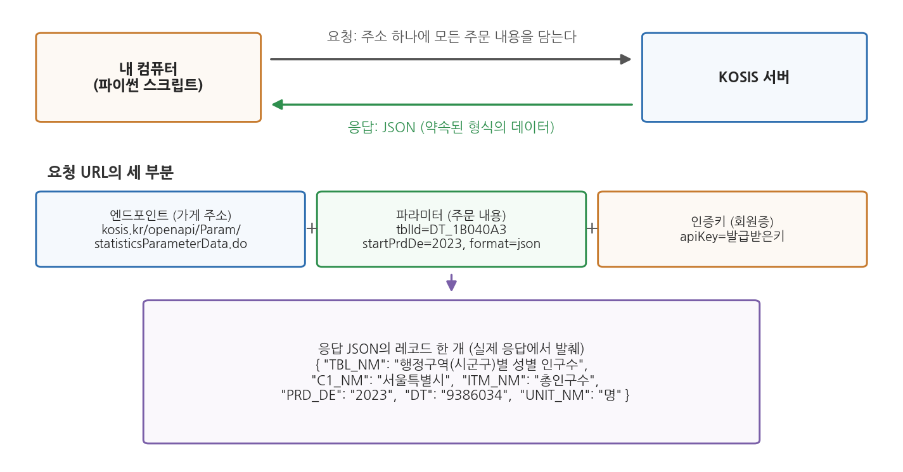
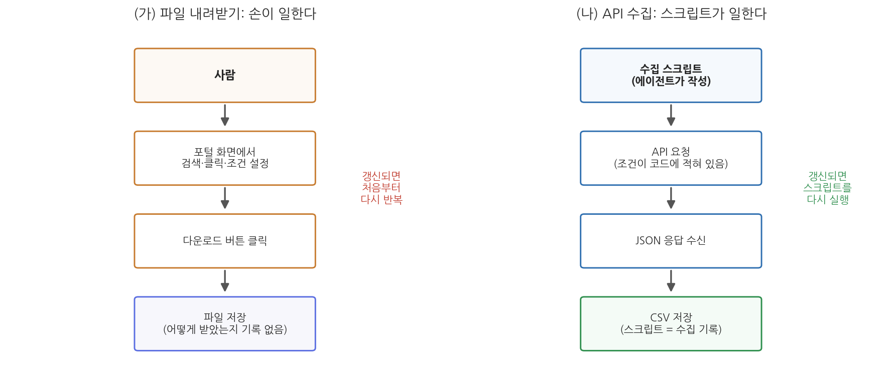

# 6주차 1회차. 오픈API와 자동 수집

> 데이터는 귀중한 것이며, 시스템 자체보다 오래 남을 것이다.
> (팀 버너스리, 월드와이드웹 창시자)

## 이 장에서 배우는 것

5주차 실습에서 여러분은 공공데이터포털과 KOSIS를 뒤져 데이터를 찾고, 파일을 내려받아 프로젝트 폴더에 넣었다. 이번에는 이런 상황을 상상해 보자. 구청 인턴인 여러분에게 과장이 말한다. "지난번에 만든 인구 현황 자료, 매달 초에 최신 숫자로 갱신해서 올려 줄래요?"

첫 달은 할 만하다. 포털에 접속해서, 통계표를 찾고, 조회 조건을 맞추고, 다운로드 버튼을 누르고, 받은 파일을 열어 보고서에 옮긴다. 둘째 달에는 슬슬 귀찮다. 지난달에 조회 조건을 어떻게 맞췄더라. 셋째 달에는 실수가 나온다. 연령 기준을 지난달과 다르게 선택해서, 두 달의 숫자가 서로 비교할 수 없는 것이 되어 버렸다. 문제는 여러분의 성실성이 아니다. 사람 손으로 하는 반복 작업은 원래 이렇게 된다.

이 장에서 배우는 오픈API는 이 문제의 해법이다. 사람이 화면을 클릭하는 대신, 프로그램이 정해진 약속에 따라 데이터를 직접 받아 오게 하는 것이다. 조회 조건은 코드에 글자로 남고, 다음 달에는 같은 코드를 다시 실행하기만 하면 된다. 그리고 4주차까지 배운 대로, 그 코드는 여러분이 아니라 에이전트가 짠다.

이 장은 다음을 배운다.

- API가 무엇인지, 왜 "요청과 응답의 약속"이라 부르는지
- API를 쓸 때 등장하는 세 가지 재료, 곧 인증키·엔드포인트·파라미터
- API가 돌려주는 데이터 형식인 JSON을 읽는 법 (실제 KOSIS 응답으로 연습한다)
- 한국 공공데이터의 양대 창구인 KOSIS와 공공데이터포털의 API 구조
- 파일 내려받기 대신 API를 쓰는 이유 (재현성과 갱신)
- 크롤링과 API의 차이, 그리고 자동 수집의 법적·윤리적 경계

<div style="border:1px solid #d9d9e3;border-left:5px solid #5b6ee1;background:#f7f7fc;padding:12px 16px;margin:18px 0;border-radius:4px;">
<strong>이 장의 로드맵</strong><br>
이 장은 하나의 질문을 따라 전개된다. <em>"프로그램이 사람 대신 데이터를 받아 오게 하려면 무엇을 알아야 하는가?"</em><br><br>
<strong>1.1</strong> API라는 약속의 정체를 식당 주문에 비유해 이해한다 →
<strong>1.2</strong> 요청을 이루는 세 재료(엔드포인트·파라미터·인증키)를 뜯어본다 →
<strong>1.3</strong> 응답으로 오는 JSON을 읽는 법을 익힌다 →
<strong>1.4</strong> KOSIS와 공공데이터포털의 API가 각각 어떻게 생겼는지 본다 →
<strong>1.5</strong> 파일 다운로드 대신 API를 쓰는 이유를 정리한다 →
<strong>1.6</strong> API가 없을 때 쓰는 크롤링의 경계를 확인한다.
</div>

## 1.1 API란 무엇인가: 요청과 응답의 약속

### 식당에서 주문하는 법

동네 식당에 들어갔다고 하자. 여러분은 주방에 직접 들어가 냉장고를 열지 않는다. 자리에 앉아 메뉴판을 보고, 정해진 방식으로 주문한다. "김치찌개 하나, 덜 맵게요." 잠시 뒤 주문한 음식이 정해진 모양(그릇에 담겨, 수저와 함께)으로 나온다.

이 장면에는 세 가지 약속이 숨어 있다.

1. **주문할 수 있는 것이 정해져 있다.** 메뉴판에 없는 음식은 시킬 수 없다.
2. **주문하는 방식이 정해져 있다.** 메뉴 이름을 말하고, 필요하면 옵션(덜 맵게, 곱빼기)을 덧붙인다.
3. **나오는 형식이 정해져 있다.** 김치찌개를 시키면 항상 김치찌개가, 예측 가능한 모양으로 나온다.

이 약속 덕분에 손님은 주방 사정을 몰라도 밥을 먹을 수 있고, 식당은 주방을 손님에게 열어 주지 않아도 장사를 할 수 있다.

API는 컴퓨터 세계의 이 약속이다. KOSIS 서버 안에는 거대한 통계 데이터베이스가 있다. KOSIS는 외부인에게 데이터베이스를 통째로 열어 주는 대신, "이런 형식으로 요청하면, 이런 형식으로 데이터를 돌려주겠다"는 약속을 문서로 공개해 두었다. 내 컴퓨터의 프로그램이 그 약속대로 요청을 보내면, 서버가 약속대로 데이터를 돌려준다. 메뉴판에 해당하는 것이 API 문서이고, 주문이 요청(request), 나온 음식이 응답(response)이다.

<div style="border:1px solid #cdd9e5;border-left:5px solid #2f6fb0;background:#f5f9fd;padding:12px 16px;margin:18px 0;border-radius:4px;">
<strong>정의 · API와 오픈API</strong><br>
<strong>API</strong>(application programming interface)는 한 프로그램이 다른 프로그램의 기능이나 데이터를 사용할 수 있도록 정해 놓은 요청·응답의 규약이다. 무엇을 요청할 수 있고, 어떻게 요청해야 하며, 무엇이 어떤 형식으로 돌아오는지가 문서로 공개된다.<br>
<strong>오픈API</strong>(open API)는 그 규약을 누구나(대개 간단한 등록 절차를 거쳐) 쓸 수 있게 공개한 것이다. KOSIS와 공공데이터포털이 제공하는 것이 바로 오픈API다.
</div>

### 같은 데이터, 두 개의 문

여기서 헷갈리기 쉬운 점 하나를 짚자. 여러분이 5주차에 브라우저로 본 KOSIS 화면과, 이 장에서 배우는 KOSIS 오픈API는 같은 데이터로 통하는 서로 다른 두 개의 문이다.

- **웹페이지는 사람용 문이다.** 표가 보기 좋게 그려져 있고, 마우스로 조건을 고르고, 버튼을 눌러 내려받는다. 사람 눈에는 편하지만, 프로그램이 다루기에는 장식(메뉴, 광고, 디자인)이 너무 많다.
- **API는 프로그램용 문이다.** 화면 장식 없이 데이터만 약속된 형식으로 오간다. 사람 눈에는 밋밋하지만, 프로그램은 정확하고 빠르게 읽을 수 있다.

관공서에 비유하면, 웹페이지는 민원인이 찾아가는 민원 창구이고 API는 기관끼리 공문서를 주고받는 문서 교환 절차다. 둘 다 같은 행정 정보를 다루지만, 상대가 사람이냐 시스템이냐에 따라 창구가 다르다.

"약속"이라는 말이 중요한 이유는 자동화 때문이다. 약속된 형식은 오늘도 내일도 같으므로, 한 번 만들어 둔 프로그램이 계속 통한다. 매달 반복되는 인구 현황 갱신을 프로그램에게 맡길 수 있는 근거가 바로 이 약속의 안정성이다.

## 1.2 인증키, 엔드포인트, 파라미터

이제 주문서를 실제로 써 보자. API 요청은 대개 긴 주소(URL) 하나로 이루어진다. 다음은 이 장의 예시로 계속 쓸, KOSIS에 "행정구역별 성별 인구수 통계표의 2023년 자료를 달라"고 요청하는 실제 주소다 (읽기 좋게 줄을 나누었을 뿐, 실제로는 한 줄이다).

```
https://kosis.kr/openapi/Param/statisticsParameterData.do
    ?method=getList
    &apiKey=발급받은키
    &orgId=101
    &tblId=DT_1B040A3
    &objL1=ALL
    &itmId=ALL
    &prdSe=Y
    &startPrdDe=2023
    &endPrdDe=2023
    &format=json
    &jsonVD=Y
```



그림 6-1을 보자. 위쪽은 큰 그림이다. 내 컴퓨터의 파이썬 스크립트가 주소 하나에 주문 내용을 모두 담아 KOSIS 서버로 보내면(요청), 서버가 JSON이라는 형식의 데이터를 돌려준다(응답). 가운데가 이 절의 핵심으로, 요청 주소가 세 부분으로 나뉜다는 것을 보여 준다. 식당 비유로 하나씩 풀면 이렇다.

**엔드포인트(endpoint)는 가게 주소다.** 물음표(?) 앞부분, 곧 `https://kosis.kr/openapi/Param/statisticsParameterData.do`가 엔드포인트다. "KOSIS의 통계자료 창구"라는 고정된 주소로, 어떤 통계를 요청하든 이 부분은 같다. API 하나가 여러 창구(통계자료 창구, 통계 목록 창구, 통계 설명 창구)를 두기도 하는데, 창구마다 엔드포인트가 다르다.

**파라미터(parameter)는 주문서의 옵션이다.** 물음표 뒤에 `이름=값` 꼴로 붙고, 여러 개일 때는 `&`로 이어진다. "김치찌개 하나, 덜 맵게, 곱빼기"에 해당하는 부분이다. 위 요청의 주요 파라미터를 표로 읽어 보자.

**표 6-1. KOSIS 통계자료 요청의 주요 파라미터**

| 파라미터 | 값 (예시) | 뜻 |
|------|------|------|
| orgId | 101 | 통계 작성 기관의 코드 |
| tblId | DT_1B040A3 | 통계표 ID (행정구역(시군구)별 성별 인구수) |
| objL1 | ALL | 첫째 분류(여기서는 행정구역)에서 무엇을 받을지. ALL은 전체 |
| itmId | ALL | 항목(총인구수·남자·여자)에서 무엇을 받을지. ALL은 전체 |
| prdSe | Y | 자료 주기. Y는 연도별 |
| startPrdDe, endPrdDe | 2023, 2023 | 조회 기간의 시작과 끝 |
| format | json | 응답 형식. JSON으로 달라는 뜻 |

파라미터가 곧 "조회 조건"이라는 점을 눈여겨보라. 5주차에 화면에서 마우스로 골랐던 조건(어느 표, 어느 지역, 어느 연도)이 여기서는 전부 글자로 적혀 있다. 조건이 글자로 남는다는 것, 이것이 1.5절에서 말할 재현성의 씨앗이다.

**인증키(API key)는 회원증이다.** `apiKey=발급받은키` 부분이다. 오픈API는 누구나 쓸 수 있지만 아무나 무제한으로 쓸 수 있는 것은 아니어서, 제공 기관은 사용자를 등록시키고 각자에게 고유한 열쇠 문자열을 발급한다. 요청에 이 열쇠를 함께 담아야 서버가 문을 열어 준다. 헬스장 회원증과 같다. 등록은 무료여도 회원증 없이는 입장이 안 되고, 회원증 덕분에 헬스장은 누가 언제 왔는지 알 수 있다. 발급 절차는 다음 실습(6주차 2회차)에서 직접 밟는다.

<div style="border:1px solid #ecd9c6;border-left:5px solid #c77b2f;background:#fdf9f4;padding:12px 16px;margin:18px 0;border-radius:4px;">
<strong>유의 · 인증키는 비밀번호처럼 다룬다</strong><br>
인증키는 "내 이름으로 서버를 이용할 권리"다. 키가 남에게 새면 그 사람이 내 이름으로 서버에 요청을 퍼부을 수 있고, 그 책임은 키 주인에게 돌아온다. 그러므로 인증키를 보고서·발표자료·공개 저장소에 그대로 붙여 넣지 않는다. 에이전트에게 수집을 지시할 때도 "키는 별도 파일에 두고 코드에는 직접 적지 말라"고 요구하는 습관을 들이자. 실습 장에서 그 방법을 쓴다.
</div>

## 1.3 JSON 읽는 법

요청을 보내면 응답이 온다. 공공데이터 API의 응답은 대부분 JSON(제이슨)이라는 형식이다. 5주차에 데이터 형식을 훑을 때 이름만 만났던 그 JSON을, 이제 직접 읽어 보자.

### 규칙은 두 개뿐이다

JSON(JavaScript Object Notation)은 이름이 거창하지만, 읽는 규칙은 사실상 두 개다.

1. **중괄호 `{ }`는 하나의 묶음이다.** 묶음 안에는 `"이름": 값` 쌍이 쉼표로 나열된다. 이름표가 붙은 서류 봉투라고 생각하면 된다.
2. **대괄호 `[ ]`는 목록이다.** 여러 개의 값(또는 묶음)이 쉼표로 나열된다. 서류 봉투를 차곡차곡 담은 상자다.

가상의 예로 감을 잡자. 어느 학생 한 명의 정보를 JSON으로 쓰면 이렇게 된다 (실제 데이터가 아닌 지어낸 예다).

```json
{"이름": "김하늘", "학년": 1, "전공": "행정학"}
```

중괄호 하나, 곧 묶음 하나가 학생 한 명이다. 학생이 두 명이면 대괄호 목록에 담는다.

```json
[
  {"이름": "김하늘", "학년": 1, "전공": "행정학"},
  {"이름": "이바다", "학년": 2, "전공": "정치외교학"}
]
```

이것이 전부다. 값 자리에 또 다른 묶음이나 목록이 들어가 겹겹이 쌓일 수 있지만, 아무리 복잡한 JSON도 "중괄호는 묶음, 대괄호는 목록"이라는 두 규칙의 반복이다.

### 실제 KOSIS 응답 읽기

이제 진짜를 보자. 다음은 1.2절의 요청을 저자가 실제로 보내고 받은 응답의 일부다. 응답 전체는 대괄호로 시작하는 목록이고, 그 안에 중괄호 묶음(레코드) 870개가 들어 있었다. 그중 서울특별시의 총인구수 레코드 하나를 그대로 옮긴다.

```json
{
  "TBL_ID": "DT_1B040A3",
  "TBL_NM": "행정구역(시군구)별 성별 인구수",
  "C1": "11",
  "C1_NM": "서울특별시",
  "ITM_ID": "T20",
  "ITM_NM": "총인구수",
  "PRD_DE": "2023",
  "DT": "9386034",
  "UNIT_NM": "명",
  "LST_CHN_DE": "2025-03-12"
}
```

(실제 레코드에는 영문 명칭 등 필드가 몇 개 더 있으나 읽기 쉽게 추렸다.)

처음 보면 암호 같지만, 이름표를 하나씩 읽으면 뜻이 드러난다.

**표 6-2. KOSIS 응답 레코드의 주요 필드**

| 필드 | 값 (위 예시) | 뜻 |
|------|------|------|
| TBL_ID, TBL_NM | DT_1B040A3, 행정구역(시군구)별 성별 인구수 | 어느 통계표에서 왔는가 |
| C1, C1_NM | 11, 서울특별시 | 분류(지역)의 코드와 이름 |
| ITM_ID, ITM_NM | T20, 총인구수 | 항목의 코드와 이름 |
| PRD_DE | 2023 | 자료의 시점 |
| DT | 9386034 | 값. 이 레코드의 알맹이다 |
| UNIT_NM | 명 | 값의 단위 |
| LST_CHN_DE | 2025-03-12 | 이 자료가 마지막으로 수정된 날짜 |

그러니까 이 레코드 한 개가 말하는 것은 한 문장이다. "행정구역별 성별 인구수 통계표에서, 서울특별시의, 총인구수는, 2023년에, 9,386,034명이다." 5주차에서 배운 표 데이터로 치면 행 하나에 해당한다. 실제로 다음 주(7주차)부터 늘 쓰게 될 pandas는 이런 레코드 목록을 한 번에 표로 바꿔 준다.

한 가지 함정을 미리 봐 두자. 값 `"9386034"`가 따옴표에 싸여 있다. JSON에서 따옴표에 싸인 것은 숫자가 아니라 글자(문자열)다. 사람 눈에는 900만이 넘는 인구로 보이지만, 컴퓨터에게는 아직 "9386034"라는 글자 나열일 뿐이어서 이대로는 더하거나 평균 낼 수 없다. 분석 전에 숫자로 바꾸는 변환이 필요하며, 이런 자료형의 함정은 7주차(데이터 정제)의 주인공이다.

<div style="border:1px solid #e0d8ea;border-left:5px solid #7a5fa8;background:#faf8fc;padding:12px 16px;margin:18px 0;border-radius:4px;">
<strong>왜 API는 CSV가 아니라 JSON으로 주는가?</strong><br>
CSV는 표 한 장을 담는 데는 좋지만, 첫 줄(열 이름)과 나머지(값)가 분리되어 있어 한 조각만 떼어 보면 뜻을 알 수 없다. 반면 JSON 레코드는 모든 값에 이름표가 붙어 있어 한 개만 떼어 놓아도 자기가 무엇인지 스스로 설명한다. 또 JSON은 묶음 속에 목록을, 목록 속에 묶음을 넣는 겹구조를 담을 수 있어, 표 한 장으로 펴기 어려운 복잡한 정보(예: 한 정류장에 여러 노선, 노선마다 여러 도착 정보)도 표현한다. 프로그램끼리 주고받는 데이터의 표준 포장이 JSON이 된 이유다.
</div>

## 1.4 KOSIS와 공공데이터포털의 API 구조

한국 공공데이터의 양대 창구인 KOSIS와 공공데이터포털(5주차 1.2절의 지도에서 본 그 두 곳)은 둘 다 오픈API를 제공하지만, 구조가 사뭇 다르다. 특징을 알아 두면 에이전트에게 지시할 때 무엇을 챙겨 줘야 하는지가 보인다.

### KOSIS 공유서비스: 창구 하나, 통계표 수십만 개

KOSIS의 오픈API는 공유서비스라는 이름으로 제공된다(kosis.kr/openapi). 회원가입 후 활용신청을 거쳐 인증키를 발급받으면, 통계자료(통계표 내용), 통계 목록, 통계 설명자료 등을 받아 볼 수 있다.

KOSIS 구조의 특징은 표준화다. KOSIS에 실린 통계표는 수십만 개에 이르지만, 그 전부를 1.2절에서 본 단 하나의 요청 형식으로 받는다. 무엇이 달라지는가 하면 파라미터의 값뿐이다. 인구 통계든 사업체 통계든 물가 통계든, `tblId`(통계표 ID)와 분류·항목·기간 파라미터만 바꾸면 같은 창구에서 같은 형식으로 나온다. 식당 비유로는, 메뉴가 수십만 가지인데 주문서 양식은 한 장인 셈이다. 따라서 KOSIS를 다룰 때 핵심 정보는 "내가 원하는 통계표의 ID가 무엇인가"이고, 이는 KOSIS에서 통계표를 검색해 찾아낸다.

### 공공데이터포털: 데이터셋마다 다른 문서

공공데이터포털(data.go.kr)의 오픈API는 반대로 데이터셋 단위다. 버스 도착 정보, 아파트 실거래가, 미세먼지 측정값처럼 개별 기관이 등록한 API가 수천 개 있고, 각각 별도의 요청 명세서(엔드포인트, 파라미터 목록, 응답 필드 설명)를 가진 참고문서가 붙어 있다. 인증키 파라미터의 이름도 KOSIS와 달리 대부분 `serviceKey`다.

이용 절차도 다르다. 포털에서 원하는 API를 찾아 활용신청을 하면 인증키가 발급되는데, 많은 API는 신청 즉시 자동승인되지만 일부는 제공 기관의 심의를 거쳐 며칠 뒤에 승인된다. 개발 단계용 계정과 운영 단계용 계정을 구분하고 하루 요청 횟수(트래픽)에 한도를 두는 것도 특징이다. 세부 절차와 화면은 바뀔 수 있으므로, "검색 → 활용신청 → 승인 → 마이페이지에서 인증키 확인"이라는 흐름으로 기억해 두면 된다.

**표 6-3. KOSIS 공유서비스와 공공데이터포털 오픈API 비교**

| 구분 | KOSIS 공유서비스 | 공공데이터포털 |
|------|------|------|
| 주소 | kosis.kr/openapi | data.go.kr |
| 대상 | 국가승인통계 통계표 | 각 기관이 등록한 데이터셋·API |
| 요청 형식 | 모든 통계표가 하나의 표준 형식 | API마다 별도 명세(참고문서) |
| 핵심 준비물 | 인증키 + 통계표 ID(tblId) | 인증키(serviceKey) + 해당 API의 참고문서 |
| 승인 | 활용신청 후 발급 | 자동승인 즉시 또는 심의 승인 |

에이전트와 일할 때 이 차이는 이렇게 나타난다. KOSIS 수집을 지시할 때는 통계표 ID와 조회 조건을 알려 주면 되고, 공공데이터포털 수집을 지시할 때는 그 API의 참고문서(또는 문서 주소)를 함께 건네야 한다. 에이전트는 문서를 읽고 요청 형식을 파악하는 일을 잘하므로, 사람이 할 일은 올바른 문서를 찾아 건네는 것이다.

## 1.5 파일 내려받기 대신 API를 쓰는 이유: 재현성과 갱신

여기까지 배우고 나면 자연스러운 의문이 든다. 5주차처럼 화면에서 내려받으면 편한데, 왜 굳이 인증키를 발급받고 요청 주소를 만들어야 하는가. 소규모 일회성 분석이라면 실제로 파일 다운로드가 더 빠르다. 그러나 분석이 반복되거나, 결과에 책임을 져야 하거나, 데이터가 계속 갱신된다면 이야기가 달라진다.



그림 6-2를 보자. 왼쪽(가)의 파일 내려받기에서 일하는 것은 사람의 손이다. 검색, 조건 설정, 클릭이 모두 손으로 이루어지고, 끝나면 파일만 남는다. 어떤 조건으로 받았는지는 기억 속에만 있다. 오른쪽(나)의 API 수집에서 일하는 것은 스크립트다. 조회 조건이 코드에 글자로 적혀 있고, 실행하면 JSON을 받아 CSV로 저장한다. 끝나면 데이터와 함께 "데이터를 만든 절차" 자체가 파일로 남는다.

이 차이가 낳는 이점을 두 단어로 정리하면 재현성과 갱신이다.

**재현성(reproducibility)은 같은 절차로 같은 결과를 다시 만들 수 있는 성질이다.** 도입부 인턴의 셋째 달 실수를 떠올려 보자. 연령 기준을 지난달과 다르게 고른 것은 조회 조건이 어디에도 기록되지 않았기 때문이다. API 수집에서는 조건이 파라미터로 코드에 박혀 있으므로, 다음 달에도, 내년에도, 다른 사람이 실행해도 같은 조건으로 수집된다. "이 표의 숫자는 어떻게 얻은 것인가요?"라는 질문에 "이 스크립트를 실행했습니다"라고 답할 수 있는 상태, 그것이 재현 가능한 분석이다.

**갱신은 최신 데이터를 다시 받아 오는 일이다.** 공공데이터는 살아 있다. 1.3절의 실제 응답에서 `LST_CHN_DE`(최종 수정일) 필드가 "2025-03-12"였던 것을 보라. 2023년 통계인데 2025년에도 수정되었다는 뜻이다. 통계는 잠정치가 확정치로 바뀌고, 새 시점 자료가 덧붙고, 오류가 정정된다. 파일 다운로드 방식에서 갱신은 "그 고생을 처음부터 다시"이지만, API 방식에서는 스크립트 재실행 한 번이다. 기간 파라미터만 바꾸면 새 연도 자료도 바로 받는다.

덤으로 규모의 이점도 있다. 17개 시도의 10년치 자료처럼 화면에서 받으려면 수십 번 클릭해야 할 일도, 프로그램에게는 반복문 하나다.

<div style="border:1px solid #e0d8ea;border-left:5px solid #7a5fa8;background:#faf8fc;padding:12px 16px;margin:18px 0;border-radius:4px;">
<strong>왜 공공부문에서 재현성이 더 무거운가?</strong><br>
공공기관의 분석 결과는 예산과 정책의 근거가 되고, 감사와 정보공개청구의 대상이 된다. "작년 보고서의 이 숫자는 어떤 조건으로 뽑은 것인가"에 답하지 못하면 숫자의 신뢰가 무너진다. 담당자가 바뀌어도 분석이 이어져야 한다는 점도 중요하다. 수집 절차가 코드와 기록으로 남아 있으면 후임자는 실행만 하면 되지만, 전임자의 손과 기억에만 있었다면 처음부터 다시 시작해야 한다. 재현성은 학술적 미덕이기 이전에 행정의 연속성 문제다.
</div>

한 가지 균형을 잡아 두자. API가 항상 정답인 것은 아니다. 한 번 보고 말 데이터, API가 제공되지 않는 데이터, 손으로 받는 것이 5분이면 끝나는 데이터까지 API로 받겠다고 반나절을 쓰는 것은 배보다 배꼽이 크다. 1주차에서 배운 위임의 감각처럼, 도구도 일의 성격에 맞게 고른다. 기준은 간단하다. 반복되는가, 갱신되는가, 근거를 남겨야 하는가. 하나라도 "그렇다"면 API를 우선 검토한다.

## 1.6 크롤링과 API의 차이, 법적·윤리적 경계

마지막으로, 프로그램이 데이터를 자동 수집하는 또 하나의 방법인 크롤링을 API와 구별해 두자. 원하는 데이터에 API가 없을 때 사람들이 흔히 떠올리는 방법이기 때문에, 무엇이 다르고 어디까지 허용되는지를 알아야 한다.

<div style="border:1px solid #cdd9e5;border-left:5px solid #2f6fb0;background:#f5f9fd;padding:12px 16px;margin:18px 0;border-radius:4px;">
<strong>정의 · 크롤링과 스크레이핑</strong><br>
<strong>크롤링</strong>(crawling)은 프로그램이 웹페이지들을 자동으로 돌아다니며 내용을 수집하는 일이고, <strong>스크레이핑</strong>(scraping)은 수집한 페이지에서 원하는 데이터를 긁어내는 일이다. 실무에서는 두 말을 묶어 "크롤링"으로 부르는 경우가 많으며, 이 교재도 그렇게 쓴다.
</div>

### 정문과 담장의 차이

API와 크롤링의 차이는 들어가는 문의 차이다. API는 데이터 제공자가 프로그램을 위해 일부러 열어 놓은 정문이다. 요청 형식과 응답 형식이 약속되어 있고, 제공자는 프로그램이 드나들 것을 알고 문을 관리한다. 크롤링은 사람용 화면을 프로그램이 대신 읽는 것이다. 제공자가 프로그램의 방문을 예정하지 않은 통로라는 점에서, 담장 너머로 게시판을 읽는 일에 가깝다.

이 차이는 세 가지 실질적 차이로 이어진다.

첫째, **안정성.** API의 응답 형식은 약속이므로 쉽게 바뀌지 않지만, 웹 화면의 생김새는 예고 없이 개편된다. 화면 구조에 기대어 짠 크롤링 코드는 개편 한 번에 무너진다.

둘째, **허락의 명확성.** API는 인증키 발급 절차 자체가 "써도 좋다"는 명시적 허락이다. 크롤링은 허락 여부가 불분명한 회색 지대에 놓이는 경우가 많다.

셋째, **부하.** API는 제공자가 감당할 수 있게 설계한 창구지만, 크롤링 프로그램이 짧은 시간에 수천 번 접속하면 사이트가 느려지거나 멈출 수 있다. 이는 다른 이용자와 운영 기관에 실제 피해를 준다.

### 지켜야 할 경계

크롤링이 곧 불법인 것은 아니다. 공개된 웹페이지를 적절한 방식으로 수집하는 것은 널리 이루어지는 일이고, 검색엔진도 크롤링으로 작동한다. 그러나 경계가 있다.

- **이용약관.** 많은 웹사이트가 약관에서 자동화된 수집을 금지하거나 제한한다. 약관을 위반한 대량 수집은 분쟁의 사유가 된다.
- **robots.txt.** 사이트 주소 뒤에 `/robots.txt`를 붙이면 그 사이트가 자동 수집 프로그램에게 밝혀 둔 방침(어느 경로는 수집해도 되고 어느 경로는 안 되는지)을 볼 수 있다. 법적 강제력과 별개로, 이를 존중하는 것이 통용되는 규범이다.
- **저작권과 개인정보.** 웹에 보인다고 해서 마음대로 가져다 쓸 수 있는 것이 아니다. 기사·게시글은 저작물이며, 이름·연락처 같은 개인정보는 공개된 것이라도 수집·이용에 개인정보 보호법의 제약이 따른다.
- **서버 부하.** 요청 사이에 충분한 간격을 두고, 필요한 최소한만 수집한다. 상대 시스템을 느리게 만들 정도의 수집은 그 자체로 해악이다.

이 과목의 원칙은 명료하다. **API가 있으면 API를 쓴다.** 크롤링은 API가 없을 때의 차선책이며, 그때도 약관과 robots.txt를 확인하고 부하를 아낀다. 다행히 우리가 다루는 한국 공공데이터는 KOSIS와 공공데이터포털이라는 잘 닦인 정문을 갖추고 있어서, 이 과목의 수집은 거의 전부 API로 해결된다. 크롤링을 도구로 쓰는 구체적 기법은 이 교재의 범위 밖이지만, 11주차(텍스트 데이터)에서 공개 텍스트 자료를 입수할 때 이 절의 경계 감각이 다시 필요해진다.

<div style="border:1px solid #ecd9c6;border-left:5px solid #c77b2f;background:#fdf9f4;padding:12px 16px;margin:18px 0;border-radius:4px;">
<strong>유의 · 에이전트에게 수집을 시킬 때도 경계는 사람의 몫이다</strong><br>
에이전트는 "이 사이트의 데이터를 긁어 와 줘"라는 지시를 받으면 크롤링 코드를 척척 짜 준다. 코드를 짤 수 있다는 것과 그래도 된다는 것은 다른 문제다. 약관 확인, robots.txt 확인, 개인정보 포함 여부 판단은 지시하는 사람의 책임이다. 1주차에서 배운 AI 플루언시의 네 번째 기둥, 성실(책임 있는 사용)이 수집 단계에서 시험대에 오르는 지점이다.
</div>

## 요약

API는 프로그램끼리 데이터를 주고받기 위한 요청·응답의 약속이며, 식당의 메뉴판(API 문서)·주문(요청)·음식(응답)에 비유할 수 있다. 요청 주소는 엔드포인트(가게 주소), 파라미터(주문 옵션), 인증키(회원증)의 세 부분으로 이루어지고, 조회 조건이 파라미터라는 글자로 남는다는 점이 화면 조작과의 근본적 차이다. 응답은 대개 JSON으로 오며, "중괄호는 이름표 달린 묶음, 대괄호는 목록"이라는 두 규칙만 알면 읽을 수 있다. 실제 KOSIS 응답 레코드 하나는 "어느 표의, 어느 지역의, 어느 항목이, 언제, 얼마"라는 한 문장에 해당한다. KOSIS 공유서비스는 수십만 통계표를 하나의 표준 형식으로 제공하므로 통계표 ID가 핵심이고, 공공데이터포털은 API마다 명세가 달라 참고문서를 에이전트에게 건네는 것이 핵심이다. 파일 다운로드 대신 API를 쓰는 이유는 재현성(수집 절차가 코드로 남는다)과 갱신(재실행 한 번으로 최신화)이며, 공공부문에서 재현성은 행정의 연속성과 책임의 문제다. API가 없을 때 쓰는 크롤링은 약속되지 않은 통로인 만큼 이용약관, robots.txt, 저작권·개인정보, 서버 부하라는 경계를 지켜야 하며, 이 과목의 원칙은 "API가 있으면 API"다.

## 연습문제

**6-1. 식당 비유 완성하기.** 다음 API 용어를 식당 주문의 요소와 짝짓고, 각각 한 문장으로 이유를 써 보라.
(a) API 문서 (b) 엔드포인트 (c) 파라미터 (d) 인증키 (e) JSON 응답
(식당 요소: 가게 주소, 메뉴판, 주문 옵션, 회원증, 정해진 그릇에 담겨 나온 음식)

**6-2. JSON 읽기.** 다음은 본문의 요청에서 실제로 받은 또 하나의 레코드다(일부 필드 생략).

```json
{
  "TBL_NM": "행정구역(시군구)별 성별 인구수",
  "C1_NM": "세종특별자치시",
  "ITM_NM": "총인구수",
  "PRD_DE": "2023",
  "DT": "386525",
  "UNIT_NM": "명"
}
```

(a) 이 레코드가 말하는 내용을 한 문장으로 풀어 써 보라. (b) `"DT": "386525"`를 이대로 평균 계산에 쓸 수 없는 이유는 무엇인가. (c) 이 레코드에 시점 정보가 없다면 분석에서 어떤 문제가 생길지 한 가지 써 보라.

**6-3. 수집 방법 고르기.** 다음 세 상황에서 파일 다운로드, API 수집, 크롤링 중 무엇이 적절한지 고르고 이유를 써 보라. 크롤링을 고른 경우 먼저 확인할 것 두 가지를 함께 적어라.
(a) 기말 과제에 한 번 쓸 시군구 재정자립도 표 한 장이 필요하다. 지방재정365에서 엑셀로 받을 수 있다.
(b) 구청 상황판에 관내 미세먼지 측정값을 매시간 최신으로 표시해야 한다. 공공데이터포털에 측정 자료 API가 있다.
(c) 어느 지역 커뮤니티 게시판의 글을 모아 주민 여론을 분석하고 싶다. 그 사이트에는 API가 없다.
