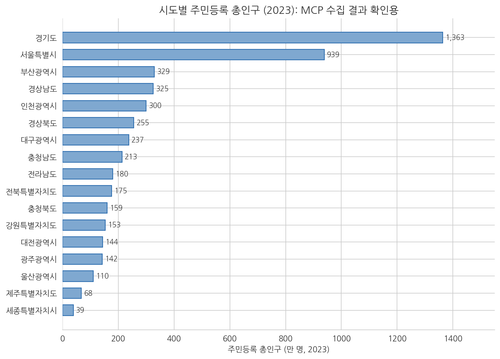

# 6주차 2회차. kosis MCP로 데이터 찾고 수집하기

## 이 실습에서 하는 것

1회차에서 공공데이터의 지도(어디에 있나), 받기 전에 읽을 것(형식·메타데이터·이용허락), 그리고 에이전트에 도구를 꽂는 표준(MCP)을 배웠다. 이번 실습은 그 지도를 들고 실제로 길을 나선다. 전반부에서는 포털과 에이전트의 웹 검색으로 데이터를 찾는 연습을 하고, 후반부에서는 kosis MCP 서버를 주소 한 줄로 등록해 에이전트가 KOSIS 통계를 직접 검색·수집하게 만든다. 수집한 값은 포털 화면과 대조해 검증하고, CSV와 수집기록으로 남긴다.

오늘이 이 과목에서 특별히 중요한 이유가 하나 더 있다. 실습 마지막에 여러분 각자의 학기 프로젝트 주제와 데이터를 정한다. 오늘 정한 주제는 7주차(정제), 9주차(EDA), 10주차(통계 분석), 13주차(파이프라인), 14주차(최종 보고서)에서 계속 같은 데이터로 이어진다. 오늘의 선택이 한 학기 분석의 출발점이다.

이 실습이 끝나면 다음 산출물이 남는다.

- 포털·에이전트 병행 검색으로 찾은 데이터 후보 목록과 링크 검증 기록
- 에이전트에 등록된 kosis MCP 서버 (`/mcp`로 확인 가능한 상태)
- `data/sido_pop_2023.csv`: MCP로 수집한 17개 시도의 2023년 주민등록 총인구
- `수집기록.md`: 언제, 어디서, 어떤 조건으로 받았고 어떻게 검증했는지의 기록
- 학기 프로젝트 계획서 (주제, 질문, 데이터, 확인 사항)

## 준비물

| 구분 | 내용 |
|------|------|
| 폴더 | 1주차에 만든 `공공데이터분석` 폴더 (4주차에서 uv 환경을 갖춘 상태) |
| 데이터 | 실습 중 kosis MCP로 직접 수집 (별도 준비 없음) |
| 도구 | VSCode + Claude Code, 웹 브라우저 (포털 탐색·검증용) |
| 선수 내용 | 6주차 1회차 (포털 지도, 메타데이터, MCP), 5주차 2회차 (csv-profile 스킬), 2주차 (도구 호출 로그 읽기) |

## 2.1 포털에서 데이터 찾기: 사람의 탐색 + 에이전트의 웹 검색

**무엇을 왜 하는가.** 데이터 찾기는 두 경로를 병행할 때 가장 빠르다. 첫째 경로는 사람의 탐색이다. 브라우저로 1회차의 포털들을 직접 열어 검색하는 것으로, 포털의 분류 체계와 메타데이터 화면을 눈으로 익힐 수 있고 "검색하다 우연히 발견하는" 수확이 있다. 둘째 경로는 에이전트의 웹 검색이다. 에이전트에게 주제를 주고 관련 데이터셋을 찾아 오게 하면, 여러 포털을 한꺼번에 훑어 후보 목록을 만들어 준다. 사람은 넓게 감을 잡고, 에이전트는 빠르게 후보를 모으고, 최종 확인은 다시 사람이 한다.

먼저 사람의 탐색부터 해 보자. 브라우저에서 공공데이터포털(data.go.kr)을 열고, 관심 있는 생활어 키워드(예: "어린이집", "무더위쉼터", "청년")로 검색해 보라. 결과 목록에서 데이터셋 하나를 골라 상세 화면으로 들어가서, 1회차에서 배운 메타데이터 항목들(제공 기관, 수정일, 갱신 주기, 이용허락 유형, 파일 형식)이 실제로 어디에 표시되는지 찾아보라. 같은 키워드를 KOSIS(kosis.kr)에서도 검색해서, 두 포털의 성격 차이(개별 기관의 개방 파일 vs 정리된 승인통계)를 몸으로 비교해 본다.

다음은 에이전트의 웹 검색이다.

<div style="border:1px solid #cfe3d4;border-left:5px solid #2f8f4e;background:#f4fbf6;padding:12px 16px;margin:18px 0;border-radius:4px;">
<strong>지시문 예시</strong><br>
"나는 '지방 소멸과 청년 인구 유출'을 주제로 시군구 단위 분석을 해 보려는 행정학과 학생이야. 웹 검색으로 이 주제에 쓸 수 있는 한국 공공데이터셋 후보를 5개 안팎으로 찾아 줘. 후보마다 (1) 데이터셋 이름, (2) 제공 포털과 기관, (3) 파일 형식 또는 API 여부, (4) 시군구 단위인지, (5) 확인한 페이지 링크를 표로 정리해 줘. 확실하지 않은 항목은 추측하지 말고 '확인 필요'라고 적어 줘."
</div>

**예상되는 에이전트의 행동과 결과.** 에이전트가 웹 검색 도구를 여러 번 호출하면서(승인 요청이 올 수 있다) 공공데이터포털, KOSIS 등의 페이지를 확인하고, 요청한 다섯 항목이 채워진 후보 표를 만들어 준다. "확인 필요"가 섞여 있다면 좋은 신호다. 모르는 것을 모른다고 말하고 있다는 뜻이다.

**검증.** 이 단계의 검증이 오늘 전반부에서 가장 중요하다. 에이전트가 준 링크를 하나도 빠짐없이 브라우저에서 직접 클릭해 열어 본다. 실제로 해 보면 세 가지 경우를 만난다. (1) 링크가 정상이고 설명과 일치한다. (2) 페이지는 열리지만 내용이 설명과 다르다(예: 시군구 단위라고 했는데 실제로는 시도 단위다). (3) 링크가 아예 열리지 않거나 엉뚱한 곳으로 간다. 웹 검색 결과를 조합하는 과정에서 에이전트는 오래된 주소를 가져오거나, 그럴듯한 주소를 지어내기도 한다. 2주차에서 배운 환각이 링크의 형태로 나타나는 것이다. (2)나 (3)을 발견했다면 그 사례를 캡처해 두라. 이런 불확실성이야말로, 잠시 뒤 MCP처럼 원천에 직접 연결된 통로가 필요한 이유이기도 하다.

## 2.2 kosis MCP 등록하고 연결 확인하기

**무엇을 왜 하는가.** 이제 1회차 1.5절에서 배운 등록을 실제로 한다. kosis MCP 서버는 KOSIS의 통계를 검색·조회하는 도구들을 에이전트에게 더해 주는 시범서비스로, 인증키 발급도 회원가입도 필요 없이 주소만으로 등록된다.

등록 전에 1회차의 신뢰 점검을 그대로 적용해 보자. ① 운영 주체: 수업에서 안내한, 국가통계포털(KOSIS) 기반으로 운영되는 실습용 시범서비스다. ② 기능 범위: 통계를 검색하고 조회하는 읽기 전용 도구들이다. 내 파일을 고치거나 지우는 능력은 없다. ③ 필요성: 오늘 수집 실습의 핵심 도구다. 세 점검을 통과했으니 꽂는다.

등록도 이 과목의 방식대로 에이전트에게 시킨다. 등록 명령(`claude mcp add`)은 터미널 명령이지만, 터미널을 다루는 것이야말로 에이전트의 일이다(2주차). 대화창에 다음과 같이 지시한다.

<div style="border:1px solid #cfe3d4;border-left:5px solid #2f8f4e;background:#f4fbf6;padding:12px 16px;margin:18px 0;border-radius:4px;">
<strong>지시문 예시</strong><br>
"kosis MCP 서버를 등록해 줘. 원격 HTTP 서버이고, 이름은 kosis, 주소는 https://kosismcp2026.vercel.app/api/mcp 야. claude mcp add 명령으로 등록하고, 실행한 명령과 결과 메시지를 그대로 보여 줘."
</div>

**예상되는 에이전트의 행동과 결과.** 에이전트가 터미널에서 다음 한 줄을 실행한다. 실행 전에 승인 요청이 뜨는데, 4주차에서 기른 승인 기준을 그대로 적용하자. 명령 속 주소가 내가 알려 준 바로 그 주소인지 읽고 승인한다.

```bash
claude mcp add --transport http kosis https://kosismcp2026.vercel.app/api/mcp
```

터미널에 서버가 추가되었다는 확인 메시지가 나온다. 새로 등록한 서버는 새 세션부터 인식되므로 Claude Code를 재시작한다(5주차에서 스킬 폴더를 새로 만들었을 때와 같다). 그다음 대화창에 `/mcp`를 입력하면 등록된 서버 목록에 kosis가 보이고, 연결 상태와 이 서버가 제공하는 도구들(통계 검색, 통계값 조회, 통계표 구조 확인 등)을 확인할 수 있다.

**검증.** ① 에이전트가 실행한 명령을 눈으로 읽는다. 이름(kosis)과 주소가 지시한 그대로인지 확인한다. ② 재시작 후 `/mcp` 화면에서 kosis 서버의 상태가 연결됨으로 표시되는지 확인한다. ③ 도구 목록에 검색과 조회에 해당하는 도구가 보이는지 훑어본다. ④ 마지막으로 등록 명령의 의미를 자기 말로 설명할 수 있는지 점검한다. `kosis`는 내가 붙인 별명이고, 주소는 서버의 위치이며, 이 서버는 읽기 전용 통계 도구를 제공한다. 무엇을 꽂았는지 모른 채 꽂는 것이 1회차에서 경고한 가장 나쁜 습관이다.

## 2.3 MCP로 통계 검색·수집하기

**무엇을 왜 하는가.** 이제 에이전트에게 수집을 시킨다. 연습 주제는 시도별 주민등록 총인구(2023년)로 정한다. 결과를 포털 화면과 대조하기 쉬운, 검증 연습에 알맞은 데이터이기 때문이다. 3주차에서 배운 대로 검증 가능한 단위로 쪼개서, 먼저 "제대로 받아지는가"만 확인하고 저장은 다음 절에서 잇는다.

<div style="border:1px solid #cfe3d4;border-left:5px solid #2f8f4e;background:#f4fbf6;padding:12px 16px;margin:18px 0;border-radius:4px;">
<strong>지시문 예시</strong><br>
"kosis MCP를 써서 2023년 시도별 주민등록 총인구를 수집해 줘. (1) 먼저 어느 통계표를 쓸지 MCP의 검색 도구로 찾아서, 통계표 이름과 ID를 알려 줘. (2) 그 통계표에서 전국과 17개 시도의 총인구수를 조회해 표로 보여 줘. (3) 값의 출처(통계표명과 KOSIS 링크)도 함께 남겨 줘. 아직 파일로 저장하지는 마."
</div>

**예상되는 에이전트의 행동과 결과.** 도구 사용 로그에 kosis 서버의 도구 호출이 나타난다(승인 요청이 올 수 있다). 저자가 이 실습을 실제로 수행했을 때의 흐름은 이랬다. 에이전트가 먼저 검색 도구로 통계표를 찾아 "행정구역(시군구)별 성별 인구수"(통계표 ID DT_1B040A3, 작성 기관 국가데이터처)를 확인하고, 이어서 조회 도구로 2023년 총인구수를 받아 왔다. 결과는 전국과 17개 시도, 합해서 18건이며 단위는 명이다. 표의 첫 부분은 다음과 같은 모양이 된다.

| 지역 | 총인구수 (2023, 명) |
|------|------|
| 전국 | 51,325,329 |
| 서울특별시 | 9,386,034 |
| 부산광역시 | 3,293,362 |
| ... | ... |

6주차 1회차에서 배운 MCP의 약속이 여기서 눈에 보인다. 인증키를 발급받지 않았고, API 문서를 읽지 않았고, 수집 코드를 짜지 않았다. 에이전트가 도구를 골라 쓰는 것을 지켜보고, 결과를 검증하는 것이 사람의 일이다.

<div style="border:1px solid #ecd9c6;border-left:5px solid #c77b2f;background:#fdf9f4;padding:12px 16px;margin:18px 0;border-radius:4px;">
<strong>유의 · 응답 첫머리에 붙는 안내문</strong><br>
kosis MCP를 쓴 답변에는 "시범서비스 안내"라는 문구와 통계표 출처 링크가 함께 붙는 것을 보게 된다. MCP 서버는 데이터만 주는 것이 아니라 그 데이터를 다루는 안내와 지시도 에이전트에게 함께 전달할 수 있고, 에이전트는 그것을 따른다. 지금처럼 출처를 밝히고 한계를 고지하는 안내라면 반가운 일이지만, 뒤집어 생각하면 1회차의 경고 그대로다. 신뢰할 수 없는 서버가 이 통로로 나쁜 지시를 흘려 넣을 수도 있다. 서버를 가려 꽂아야 하는 이유를 실물로 확인해 두자.
</div>

**검증(에이전트가 틀리는 장면 포함).** ① 도구 사용 로그에 kosis 도구 호출이 실제로 있는지 확인한다. 로그에 도구 호출 없이 답이 바로 나왔다면 에이전트가 MCP 대신 기억으로 답한 것이다. 2주차에서 배운 환각의 위험이 그대로 살아 있는 상태이므로, "기억으로 답하지 말고 반드시 kosis MCP 도구로 조회해서 답해 줘"라고 재지시한다. ② 건수가 설명되는지 본다. 전국 1건 + 시도 17건 = 18건인가. 시도가 15개나 20개로 나왔다면 어딘가 새거나 겹친 것이다.

## 2.4 수집 결과 검증과 저장: 화면 대조, CSV, 수집기록

**무엇을 왜 하는가.** 데이터가 왔다. 그러나 2주차의 교훈을 기억하자. 그럴듯함은 옳음의 증거가 아니다. 수집 데이터는 세 겹으로 검증한 뒤에 저장한다. 값 대조, 내적 일관성, 그리고 기록이다.

**첫째, 값이 포털 화면과 같은가.** 같은 데이터로 통하는 두 개의 문을 검증에 활용한다. MCP라는 문으로 받은 값을, 사람용 문인 KOSIS 웹 화면으로 대조하는 것이다. 브라우저에서 KOSIS에 접속해 통계표 "행정구역(시군구)별 성별 인구수"를 검색해 열고, 2023년 서울특별시의 총인구수를 눈으로 확인한다. 저자의 수집 결과에서 이 값은 9,386,034명이었다. 화면의 값과 에이전트가 받은 값이 자릿수 하나까지 같아야 한다. 표본으로 서울 외에 두어 곳(예: 인구가 가장 적은 시도인 세종, 386,525명)을 더 대조하면 좋다.

**둘째, 안에서 아귀가 맞는가.** 이 데이터에는 전국 값과 17개 시도 값이 함께 들어 있으므로, 시도를 다 더하면 전국이 되어야 한다.

<div style="border:1px solid #cfe3d4;border-left:5px solid #2f8f4e;background:#f4fbf6;padding:12px 16px;margin:18px 0;border-radius:4px;">
<strong>지시문 예시</strong><br>
"방금 받은 17개 시도의 총인구수를 모두 더한 값과, 전국의 총인구수 값을 나란히 출력하고 같은지 비교해 줘. 같으면 시도 데이터를 시도·연도·총인구 세 개 열의 표로 정리해서 data/sido_pop_2023.csv 로 저장해 줘. 총인구는 문자열이 아니라 숫자로, 엑셀에서 열어도 한글이 깨지지 않는 인코딩(utf-8-sig)으로 저장하고, 저장 후 파일의 처음 5행을 출력해 줘. 그리고 시도별 총인구를 큰 순서대로 가로 막대그래프로 그려 figures 폴더에 저장해 줘. 제목과 축에 단위(만 명)와 연도(2023)를 표시해 줘."
</div>

저자의 실행에서 17개 시도의 합은 51,325,329명으로 전국 값과 정확히 일치했다. 저장된 CSV의 첫 다섯 행은 다음과 같았다.

**표 6-4. data/sido_pop_2023.csv의 첫 다섯 행 (실제 수집 결과)**

| 시도 | 연도 | 총인구 |
|------|------|------|
| 경기도 | 2023 | 13630821 |
| 서울특별시 | 2023 | 9386034 |
| 부산광역시 | 2023 | 3293362 |
| 경상남도 | 2023 | 3251158 |
| 인천광역시 | 2023 | 2997410 |



그림 6-3을 읽어 보자. 가로 막대는 시도별 주민등록 총인구(만 명)이고, 경기(약 1,363만)와 서울(약 939만)이 압도적으로 크며 세종(약 39만)이 가장 작다. 이 그림의 용도는 분석이 아니라 확인이다. 상식과 크게 어긋나는 막대(예: 서울이 광주보다 작다든가, 음수 막대)가 없는지 훑는 것으로, 수집 단계의 마지막 안전망 역할을 한다. 익숙한 데이터일수록 그림 한 장이 표 백 줄보다 이상을 빨리 드러낸다.

**셋째, 수집 기록을 남긴다.** 1회차에서 메타데이터를 "숫자보다 먼저 읽을 것"이라 배웠다. 이제 여러분이 데이터를 만들었으니, 그 메타데이터를 쓸 차례다. MCP 수집은 코드가 남지 않는 대화형 수집이므로, 기록이 곧 재현의 근거가 된다는 점에서 오히려 더 중요하다.

<div style="border:1px solid #cfe3d4;border-left:5px solid #2f8f4e;background:#f4fbf6;padding:12px 16px;margin:18px 0;border-radius:4px;">
<strong>지시문 예시</strong><br>
"프로젝트 폴더에 수집기록.md 를 만들어 줘. 다음 항목을 표로 정리해 줘. 수집일(오늘 날짜), 수집 경로(kosis MCP)와 원자료 작성 기관, 통계표 이름과 ID, 조회 조건(연도·항목·지역 단위), 수신 건수와 구성(전국 1 + 시도 17), 검증 내용(화면 대조 결과, 시도 합계와 전국 값 비교 결과), 저장 파일 경로, 다시 수집할 때 쓸 지시문 전문. 검증 내용 칸은 비워 두면 내가 채울게."
</div>

검증 내용 칸을 직접 채우라고 한 데는 이유가 있다. 무엇을 어떻게 대조했고 결과가 어땠는지는 검증한 사람만이 쓸 수 있는 문장이다. "KOSIS 화면에서 서울 9,386,034 일치 확인, 시도 합계 51,325,329 = 전국 값 일치"처럼 구체적으로 쓴다. 이 한 줄이 14주차 최종 보고서에서 "이 숫자의 근거는 무엇인가"라는 질문에 대한 답이 된다.

**검증.** ① VSCode에서 data/sido_pop_2023.csv를 열어 헤더 1행 + 데이터 17행인지, 한글이 멀쩡한지 확인한다. ② 수집기록.md의 모든 칸이 채워졌는지, 특히 검증 내용이 자기 문장으로 적혔는지 확인한다. ③ 최종 확인으로 새 대화를 열고, 수집기록에 적어 둔 지시문으로 처음부터 다시 수집해 본다. 같은 18건, 같은 값이 나오면 여러분은 재현 가능한 수집 절차를 갖게 된 것이다. 마지막으로 5주차에 만든 스킬을 새 데이터에 써 보자. `/csv-profile data/sido_pop_2023.csv` 한 줄로 첫 진단까지 마치면, 5주차(절차)와 6주차(수집)가 한 흐름으로 이어진다.

## 2.5 학기 프로젝트: 내 분석 주제와 데이터 정하기

**무엇을 왜 하는가.** 이제 오늘 익힌 검색·수집·검증을 총동원해 자신의 학기 프로젝트를 출범시킨다. 좋은 주제의 조건은 거창함이 아니라 세 가지 현실성이다. (1) 내가 정말 궁금한가(한 학기를 버티게 하는 힘), (2) 데이터가 실제로 존재하고 구할 수 있는가, (3) 범위가 적절한가(전국 시군구 비교, 한 광역시의 자치구 비교, 10-20년의 시계열 정도가 알맞다). "청년 정책의 효과 분석"은 한 학기에 안 되지만, "시군구별 청년인구 순유출과 재정자립도의 관계"는 된다.

주제 후보를 두세 개 적었다면, 에이전트를 벽으로 삼아 두드려 본다. 오늘은 도구가 하나 늘었다. 웹 검색에 더해, KOSIS 쪽 데이터는 kosis MCP로 직접 존재를 확인할 수 있다.

<div style="border:1px solid #cfe3d4;border-left:5px solid #2f8f4e;background:#f4fbf6;padding:12px 16px;margin:18px 0;border-radius:4px;">
<strong>지시문 예시</strong><br>
"학기 프로젝트 주제를 정하려고 해. 후보는 (가) 시군구별 고령화와 지방재정의 관계, (나) 우리 지역 버스 노선과 인구 분포의 미스매치, (다) 시군구 출산지원금과 출산율의 관계야. 각 후보에 대해 (1) 필요한 데이터 목록, (2) 그 데이터의 존재 여부. KOSIS에 있을 만한 통계는 kosis MCP의 검색 도구로, 그 외(지방재정365, 공공데이터포털 등)는 웹 검색으로 확인해 줘. (3) 학부 1학년이 한 학기에 하기에 어려운 점을 정리해 줘. 나에게 결정을 내려 주지는 말고, 판단 재료만 줘."
</div>

**예상되는 에이전트의 행동과 결과.** 후보별로 필요 데이터와 가용성, 난이도가 정리된 비교표가 나온다. KOSIS 통계는 MCP 검색 결과(통계표 이름과 ID)가 근거로 붙고, 그 외 포털은 웹 검색 링크가 붙을 것이다. 지시문의 마지막 문장에 주목하라. 결정은 에이전트의 몫이 아니다. 1주차에서 배운 위임의 원칙 그대로, 재료 조사는 맡기고 판단은 내가 한다.

**검증과 마무리.** 에이전트가 "존재한다"고 한 핵심 데이터는 직접 확인한다. MCP 검색으로 찾은 통계표는 KOSIS에서 열어 분석 단위(시군구인가 시도인가)와 기간(몇 년 치가 있는가)을 확인하고, 웹 검색으로 찾은 것은 2.1에서 한 것처럼 링크를 직접 연다. 단위가 어긋나면 주제 자체를 바꿔야 할 수 있다. 확인이 끝나면 주제를 하나로 정하고, 메모 폴더에 '프로젝트계획서_6주차.md'를 다음 표 형식으로 작성한다. 이 문서는 이후 실습(7·9·13·14주차)에서 계속 꺼내 보고 고쳐 쓰게 된다.

**표 6-5. 프로젝트 계획서 양식**

| 항목 | 내용 (예시) |
|------|------|
| 주제 한 문장 | 시군구별 고령화 수준과 재정자립도의 관계를 살펴본다 |
| 분석 질문 | 고령인구비율이 높은 시군구일수록 재정자립도가 낮은가 |
| 필요한 데이터 | ① 시군구 고령인구비율 (KOSIS, MCP 검색으로 확인 완료) ② 시군구 재정자립도 (지방재정365, 확인 완료) |
| 분석 단위와 기간 | 시군구, 2023년 (가능하면 2013-2023 추이) |
| 예상되는 어려움 | 행정구역 개편(군위군 등)으로 두 데이터의 지역 목록이 다를 수 있음 |
| 이번 주에 확보한 것 | 데이터 후보 링크, kosis MCP 수집·검증 절차 |

"예상되는 어려움" 칸을 성의 있게 쓴 사람일수록 7주차(정제)가 편해진다. 오늘 수집에서 본 검증 절차가 자신의 데이터에서는 어떤 모습으로 나타날지 미리 상상해 보라.

## 검증 체크리스트

- [ ] 2.1에서 에이전트가 제시한 링크를 전부 클릭해 (1) 정상 (2) 불일치 (3) 불통으로 분류했다
- [ ] 등록을 에이전트에게 지시했고, 실행된 명령의 이름·주소가 지시와 일치하는 것을 눈으로 확인했다
- [ ] 재시작 후 `/mcp` 화면에서 kosis 서버가 연결됨 상태이고 도구 목록이 보이는 것을 확인했다
- [ ] 수집 대화의 도구 사용 로그에서 kosis 도구 호출을 확인했다 (기억으로 답하지 않았다)
- [ ] 수신 건수(18)가 전국 1 + 시도 17로 설명됨을 확인했다
- [ ] 값 하나 이상(예: 서울 9,386,034)을 KOSIS 웹 화면과 자릿수까지 대조했다
- [ ] 17개 시도 합계가 전국 값(51,325,329)과 일치함을 확인했다
- [ ] CSV가 17행이고 총인구 열이 숫자이며 한글이 깨지지 않음을 확인했다
- [ ] 수집기록.md의 검증 내용을 내 문장으로 채웠고, 재수집용 지시문을 적어 두었다
- [ ] 프로젝트계획서_6주차.md의 모든 칸을 채웠고, 핵심 데이터의 존재를 직접 확인했다

## 자주 겪는 문제

| 증상 | 원인 | 해결 |
|------|------|------|
| 에이전트가 `claude` 명령을 찾을 수 없다고 보고한다 | Claude Code CLI가 인식되지 않는 터미널 | "새 터미널에서 다시 실행해 줘"라고 지시. 계속 실패하면 1주차 설치 절차를 다시 확인 |
| `/mcp`에 kosis 서버가 안 보인다 | 등록 후 재시작하지 않았거나 이름·주소 오타 | Claude Code를 재시작하고 다시 확인. 그래도 없으면 에이전트에게 "등록된 MCP 서버 목록을 확인해 줘"라고 시켜 등록 여부부터 점검 |
| 서버는 보이는데 연결 실패로 표시된다 | 네트워크 문제 또는 서버 점검 | 인터넷 연결을 확인하고 잠시 뒤 `/mcp`에서 다시 연결을 시도한다 |
| 에이전트가 MCP 도구를 쓰지 않고 기억으로 인구를 답한다 | 지시문에 MCP 사용이 명시되지 않음 | "반드시 kosis MCP 도구로 조회해서 답해 줘"라고 재지시하고, 도구 호출 로그를 확인한다 |
| 조회 결과가 0건이거나 엉뚱한 통계가 나온다 | 검색어가 모호해 다른 통계표를 골랐음 | 통계표 이름과 ID를 확인하고, "통계표 ID ○○○로 다시 조회해 줘"라고 지시 |
| 에이전트가 준 데이터 링크가 열리지 않는다 (2.1) | 오래된 주소를 가져왔거나 주소를 지어냈다(환각) | 데이터셋 이름으로 포털에서 직접 재검색. 이 사례는 버리지 말고 기록해 둔다 |
| 엑셀에서 CSV의 한글이 깨진다 | 인코딩이 utf-8-sig가 아님 | 에이전트에게 인코딩을 utf-8-sig로 바꿔 다시 저장하게 지시 |
| 주제는 정했는데 시군구 데이터가 없고 시도 단위만 있다 | 통계의 공표 단위 제약 | 주제를 시도 단위로 조정하거나, 시군구 단위가 있는 인접 지표로 대체. 결정 전에 교수자와 상의 |

## 제출 과제

**과제 6-A. MCP 수집·검증 세트.** 오늘 만든 두 파일(data/sido_pop_2023.csv, 수집기록.md)을 제출한다. 평가 기준은 세 가지다. ① 수집기록의 지시문만으로 같은 데이터를 다시 수집할 수 있는가, ② 두 겹 검증(화면 대조, 시도 합계와 전국 값 비교)이 수집기록에 구체적으로 적혔는가, ③ 출처(통계표명, 작성 기관)가 정확히 기재되었는가.

**과제 6-B. 내 프로젝트 데이터로 반복.** 오늘 정한 학기 프로젝트 데이터에 같은 절차를 적용한다. 프로젝트 데이터가 KOSIS에 있다면 kosis MCP로 수집하고, 다른 포털에 있다면 파일로 내려받는다. 어느 쪽이든 data 폴더에 저장하고 수집기록.md에 항목을 추가하며, `/csv-profile`로 첫 진단 보고서까지 만든다. 수집기록에는 "이 데이터가 내 프로젝트의 어느 질문에 쓰이는가"를 한 문단 덧붙인다.

**과제 6-C. 프로젝트 계획서.** '프로젝트계획서_6주차.md'를 제출한다. 평가 기준은 (1) 분석 질문이 데이터로 답할 수 있는 형태인지, (2) 핵심 데이터의 존재를 링크 또는 MCP 검색 결과와 함께 직접 확인했는지, (3) "예상되는 어려움"이 구체적인지다. 이 계획서는 7주차 실습의 준비물이므로 제출 후에도 폴더에 보관한다.
