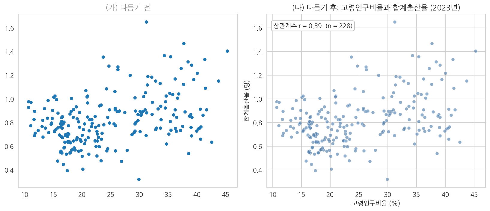
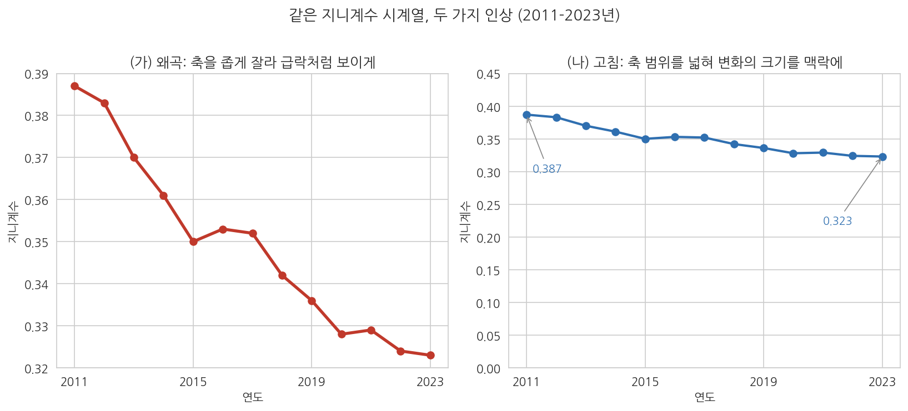

# 9주차 2회차. 에이전트로 EDA 수행하기

## 이 실습에서 하는 것

1회차에서 그림을 읽는 법을 배웠다. 이번 실습에서는 에이전트에게 그림을 그리게 하고, 나온 그림을 내가 읽는다. 1회차에서 정리한 분업(그리는 것은 에이전트, 읽는 것은 나)을 처음부터 끝까지 한 번 완주하는 것이 목표다.

작업 순서는 EDA의 표준 순서를 그대로 따른다. 변수 하나의 분포(히스토그램, 박스플롯)에서 시작해, 변수 두 개의 관계(산점도)로 나아가고, 시간의 흐름(시계열 그림)으로 마친다. 그리고 그림마다 반드시 해석 한 단락을 자기 문장으로 쓴다. 그림 없는 해석이 공허하듯, 해석 없는 그림은 미완성이다.

이 실습이 끝나면 다음이 만들어져 있어야 한다.

- figures 폴더에 저장된 네 개의 완성된 그림 (히스토그램, 박스플롯, 산점도, 시계열)
- 각 그림 아래에 해석 한 단락이 붙은 'EDA보고_9주차.md' 문서
- 일부러 왜곡했다가 바로잡은 그래프 한 쌍과 그 차이에 대한 설명

오늘도 검증이 절반이다. 에이전트는 그림을 빠르게 그려 주지만, 축을 자른 그래프를 아무렇지 않게 내놓기도 하고, 그림에 대한 해설에서 과잉해석을 하기도 한다. 그 순간을 잡아내는 것까지가 오늘의 실습이다.

## 준비물

| 구분 | 내용 |
|------|------|
| 폴더 | 4주차에 만든 uv 기반 분석 프로젝트 폴더 (data, code, figures 하위 폴더) |
| 데이터 | `data/sigungu_2023.csv` (전국 229개 시군구 인구 지표, 출처: 행정안전부 주민등록인구·국가데이터처(옛 통계청) 인구동향조사, KOSIS에서 수집), `data/income_dist.csv` (연도별 소득분배지표, 출처: 국가데이터처 소득분배지표, KOSIS에서 수집) |
| 도구 | VSCode + Claude Code, pandas·matplotlib·seaborn·koreanize-matplotlib가 설치된 uv 환경 (4주차에서 구축) |
| 선수 내용 | 9주차 1회차 (그림의 종류와 읽는 법, 시각화 윤리), 7주차 (결측값, 데이터 정제) |

7주차 실습에서 데이터를 정제하며 확인했듯 sigungu_2023.csv에는 합계출산율이 결측인 시군구가 1곳(경북 군위군) 있다. 오늘 이 결측이 그림에 어떻게 나타나는지도 지켜볼 것이다.

## 2.1 일변량 → 이변량 → 시계열 순서로 그림 만들기

### 첫 번째 그림: 히스토그램 (변수 하나의 분포)

무엇을 왜 하는가. EDA의 출발은 관심 변수 하나의 생김새를 보는 것이다. 고령인구비율의 히스토그램부터 그린다. 지시할 때는 어떤 그림을(히스토그램), 어떤 변수로(고령인구비율), 어떤 요소를 갖춰(제목·축 라벨·단위), 어디에 저장할지(파일 경로)까지 지정한다. 3주차에서 배운 대로, 산출물의 형태를 지시에 못 박아야 검증할 기준이 생긴다.

<strong>지시문 예시</strong> 
"data/sigungu_2023.csv를 읽어 고령인구비율의 히스토그램을 그려 줘. 조건: (1) seaborn 스타일을 쓰고 한글이 깨지지 않게 koreanize-matplotlib를 사용할 것, (2) 제목·가로축 라벨(단위 % 포함)·세로축 라벨을 갖출 것, (3) 중앙값 위치를 세로선으로 표시할 것, (4) 그리는 코드는 code/eda_hist.py로, 그림은 figures/eda_hist.png로 저장할 것. 다 그린 뒤 몇 개 시군구가 사용되었는지와 평균·중앙값을 함께 보고해 줘."

예상되는 에이전트의 행동. 에이전트가 파일을 읽어 열 이름을 확인하고, 파이썬 스크립트를 작성해 실행 승인을 구한 뒤, figures 폴더에 PNG 파일을 만든다. 완료 보고에는 "229개 시군구, 평균 25.0%, 중앙값 22.7%" 수준의 요약과 함께 "오른쪽으로 치우친 분포"라는 해설이 따라올 것이다. 탐색기에서 PNG를 클릭하면 1회차 그림 9-1과 비슷한 모양의 그림이 보여야 한다.

검증. 세 가지를 확인한다. 첫째, 그림 파일이 실제로 figures 폴더에 생겼는가(에이전트가 "저장했다"고 말하는 것과 파일이 실제로 있는 것은 다른 문제다). 둘째, 에이전트가 보고한 관측치 수가 229인가. CSV를 직접 열어 행 수를 확인해 대조한다. 셋째, 그림의 가로축 범위가 상식적인가. 고령인구비율은 비율이므로 0-100% 사이여야 하고, 실제 데이터는 대략 10-45% 사이다. 축에 음수나 100 넘는 값이 보이면 무언가 잘못된 것이다.

### 두 번째 그림: 박스플롯 (집단 비교)

무엇을 왜 하는가. 전국의 분포를 보았으니 "시도별로 다른가"를 본다. 여러 집단의 분포 비교에는 박스플롯이 표준이라는 것을 1회차에서 배웠다. 이번 지시에는 정렬 순서라는 조건을 추가해 본다. 시도를 가나다순으로 늘어놓는 것보다 중앙값 순으로 정렬해야 패턴이 잘 보이기 때문이다.

<strong>지시문 예시</strong> 
"같은 데이터로 시도별 고령인구비율 박스플롯을 그려 줘. 조건: (1) 가로 방향 박스플롯으로, 시도를 중앙값이 낮은 순으로 정렬할 것, (2) 제목과 축 라벨(단위 포함)을 갖출 것, (3) 코드는 code/eda_box.py, 그림은 figures/eda_box.png로 저장할 것. 그린 뒤 시도별 관측치 수(시군구 수)를 표로 함께 보고해 줘."

예상되는 에이전트의 행동. 1회차 그림 9-2와 같은 구도의 그림이 나온다. 함께 요청한 관측치 수 표에는 경기 31, 서울 25부터 제주 2, 세종 1까지 찍힐 것이다.

검증. 박스플롯 검증의 핵심은 상자 하나를 골라 원자료와 대조하는 것이다. 예를 들어 세종의 상자가 선 하나로 나타났는지 확인하라. 1회차에서 배웠듯 관측치가 1개면 상자가 만들어질 수 없다. 만약 세종에 번듯한 상자가 그려져 있다면 데이터가 잘못 붙었다는 신호다. 또 관측치 수 표의 합계가 229인지 확인한다. 시도별 수를 다 더했는데 229가 아니라면 어떤 행이 누락되거나 중복된 것이다.

### 세 번째 그림: 산점도 (두 변수의 관계)

무엇을 왜 하는가. 이제 이변량으로 넘어간다. 1회차에서 본 흥미로운 관계, 곧 고령인구비율과 합계출산율의 산점도를 직접 재현한다. 이 그림에는 결측이 얽혀 있어서 검증 거리가 하나 늘어난다.

<strong>지시문 예시</strong> 
"같은 데이터로 가로축 고령인구비율, 세로축 합계출산율의 산점도를 그려 줘. 조건: (1) 추세선을 함께 표시할 것, (2) 제목과 축 라벨(단위 포함)을 갖출 것, (3) 상관계수를 소수 둘째 자리까지 그림 안에 표시할 것, (4) 코드는 code/eda_scatter.py, 그림은 figures/eda_scatter.png로 저장할 것. 그리고 산점도에 실제로 찍힌 점이 몇 개인지, 제외된 시군구가 있다면 어디이고 왜 제외되었는지 보고해 줘."

예상되는 에이전트의 행동. 오른쪽으로 갈수록 완만히 올라가는 점 구름과 추세선, 그리고 "상관계수 r = 0.39" 표시가 담긴 그림이 나온다. 점 개수 질문에는 "228개, 합계출산율이 결측인 경북 군위군 1곳 제외"라고 보고해야 정상이다.

검증. 이 단계의 검증 포인트가 오늘의 첫 번째 함정이다. 지시문의 마지막 문장(제외된 시군구 보고)을 일부러 빼고 시켜 보면, 에이전트는 결측 1곳을 말없이 빼고 그린 뒤 아무 언급도 하지 않는 경우가 많다. 그림만 봐서는 점이 228개인지 229개인지 알 길이 없으므로, 결측 처리는 그림에서 가장 검증하기 어려운 부분이다. 그래서 산점도를 시킬 때는 "몇 개가 찍혔고 무엇이 왜 빠졌는지"를 보고 항목에 반드시 포함시킨다. 7주차에서 만든 정제 로그(군위군 합계출산율 결측)와 에이전트의 보고가 일치하는지 대조하라.

### 네 번째 그림: 시계열 (시간의 흐름)

무엇을 왜 하는가. 마지막으로 데이터 파일을 바꿔 시간 축을 다룬다. income_dist.csv의 지니계수 추이를 선 그림으로 그린다.

<strong>지시문 예시</strong> 
"data/income_dist.csv를 읽어 연도별 지니계수의 시계열 선 그림을 그려 줘. 조건: (1) 각 연도의 값을 점으로 찍고 선으로 이을 것, (2) 제목에 기간(2011-2023년)을 포함하고 축 라벨을 갖출 것, (3) 첫해와 마지막 해의 값을 그림 안에 숫자로 표시할 것, (4) 코드는 code/eda_line.py, 그림은 figures/eda_line.png로 저장할 것. 세로축 범위를 어떻게 잡았는지도 설명해 줘."

예상되는 에이전트의 행동. 2011년 0.387에서 2023년 0.323으로 내려가는 선 그림이 나온다. 세로축 범위 질문에는 "데이터 범위에 맞춰 0.32-0.39 부근으로 잡았다"거나 "0.30-0.40으로 잡았다"는 답이 올 것이다.

검증. 두 가지다. 첫째, 값 대조. KOSIS에서 소득분배지표를 검색해 포털 화면의 지니계수와 그림의 첫해·마지막 해 값이 일치하는지 확인한다(6주차에서 연습한 원천 대조다). 둘째, 세로축 읽기. 에이전트가 잡은 세로축 범위가 무엇인지 그림에서 직접 읽어 보라. 1회차에서 배웠듯 선 그림의 축 확대는 관행상 허용되지만, 얼마나 확대되었는지에 따라 같은 하락이 완만해 보이기도 급락으로 보이기도 한다. 지금 이 그림은 어느 쪽 인상을 주는가. 이 감각은 2.4에서 본격적으로 다룬다.

## 2.2 그림마다 해석 한 단락: "무엇이 보이는가"

무엇을 왜 하는가. 그림 네 개가 만들어졌다. 이제 이 실습의 진짜 핵심인 읽기로 넘어간다. 'EDA보고_9주차.md' 문서를 만들고, 그림마다 해석을 한 단락씩 자기 문장으로 쓴다. 해석 단락의 틀은 1회차에서 배운 세 층위를 따른다.

1. **무엇이 그려져 있는가.** 축과 점·막대·선이 무엇을 나타내는지 한 문장. (기술적 읽기)
2. **어떤 패턴이 보이는가.** 몰림, 치우침, 이상치, 집단 간 차이, 추세, 상관의 방향과 세기 중 이 그림에서 두드러진 것. (패턴 읽기)
3. **그래서 어떤 질문이 생기는가.** 이 패턴이 정책 맥락에서 뜻할 수 있는 것, 또는 더 파 보고 싶어진 것. (의미 읽기)

에이전트의 해설을 참고하는 것은 좋지만, 문서에 들어가는 문장은 반드시 자기 것이어야 한다. 그 이유를 보여 주는 실험을 하나 한다.

<strong>지시문 예시</strong> 
"figures/eda_scatter.png의 산점도에 대해, 이 그림에서 읽어 낼 수 있는 것을 세 문장으로 요약해 줘."

예상되는 에이전트의 행동과 함정. 에이전트는 유창한 해설을 내놓을 것이다. 그런데 그 안에 "고령화가 진행될수록 출산율이 높아진다" 또는 "고령화가 출산율 상승의 요인으로 작용한다"처럼 상관을 인과로 슬쩍 바꿔 말하는 문장이 섞여 나오는 일이 있다. 1회차에서 배웠듯 산점도와 상관계수는 "함께 움직인다"까지만 말해 줄 수 있고 "때문에"는 말해 주지 못한다. 또 시군구 단위의 관계를 개인의 이야기("고령 지역 주민이 아이를 더 낳는다")로 바꿔 말한다면 생태학적 오류다.

검증. 에이전트의 해설 세 문장을 놓고 문장마다 다음을 따져 보라. (1) 이 문장은 그림에 실제로 보이는 것인가, 그림 밖의 추측인가. (2) "함께 움직인다"를 "때문에"로 바꿔 말한 대목은 없는가. (3) 지역 단위의 사실을 개인 단위로 옮긴 대목은 없는가. 과잉해석을 찾았다면 오늘의 수확이다. 관찰일지에 원문을 기록해 두라. 못 찾았다면 그것대로 좋은 일이지만, 다른 그림의 해설로 한 번 더 시험해 보라.

## 2.3 그래프 다듬기: 제목, 축, 단위, 한글 폰트

무엇을 왜 하는가. 지금까지는 지시문에 조건을 미리 넣어 완성형 그림을 받았다. 그런데 조건 없이 시키면 어떤 그림이 나올까. 그 차이를 눈으로 확인하고, 미완성 그림을 지시로 다듬어 완성하는 연습을 한다. 보고서에 들어갈 그림은 그림만 뚝 떼어 봐도 무엇을 그렸는지 알 수 있어야 한다는 것이 다듬기의 기준이다.

<strong>지시문 예시 (1단계: 일부러 조건 없이)</strong> 
"data/sigungu_2023.csv로 고령인구비율과 합계출산율의 산점도를 그려서 figures/scatter_raw.png로 저장해 줘. 다른 조건은 없어."

예상되는 에이전트의 행동. 조건이 없으므로 에이전트와 그림 도구의 기본값대로 그림이 나온다. 제목이 없거나 영어 변수명이 그대로 박히거나, 축에 단위가 없거나, 한글 라벨이 네모(□□□)로 깨져 있을 수 있다. 어떤 기본값이 나올지는 그때그때 다르다(2주차에서 본 비결정성이다).

그림 9-6은 이 다듬기 전후를 나란히 놓은 것이다.

그림 읽는 법. 왼쪽(가)은 조건 없이 받은 그림의 전형이다. 점은 찍혀 있지만 제목도 축 라벨도 없어서, 이 그림만 받아 든 독자는 가로축이 무엇이고 세로축이 무엇인지조차 알 수 없다. 오른쪽(나)은 같은 데이터에 제목, 단위가 달린 축 라벨, 상관계수 표기를 갖춘 것이다. 두 그림의 데이터는 완전히 같다. 달라진 것은 정보를 읽을 수 있게 하는 장치들뿐인데, 그림의 쓸모는 하늘과 땅 차이다. 왼쪽은 그린 사람만 읽을 수 있는 메모이고, 오른쪽은 처음 보는 독자도 읽을 수 있는 문서다.

이제 미완성 그림을 지시로 다듬는다.

<strong>지시문 예시 (2단계: 다듬기)</strong> 
"방금 그린 scatter_raw.png를 보고서용으로 다듬어 줘. (1) 제목: '고령인구비율과 합계출산율의 관계 (2023년)', (2) 가로축 라벨 '고령인구비율 (%)', 세로축 라벨 '합계출산율 (명)', (3) 한글이 깨지지 않게 koreanize-matplotlib 사용, (4) figures/scatter_final.png로 저장. 완성 후 그림에 제목·축 라벨·단위가 모두 들어갔는지 스스로 점검한 결과를 보고해 줘."

검증. 다듬어진 PNG를 직접 열어 점검표로 확인한다. 제목이 그림의 요지를 말하는가. 두 축에 라벨과 단위가 있는가. 한글이 깨진 곳은 없는가. 글자가 그림 틀에 잘려 나간 곳은 없는가. 특히 한글 깨짐은 에이전트가 자기 점검에서 놓치기 쉽다. 에이전트는 코드가 오류 없이 돌았는지는 알지만, 그려진 그림이 사람 눈에 어떻게 보이는지는 그림 파일을 다시 열어 보지 않는 한 모르기 때문이다. 최종 확인은 반드시 사람의 눈으로 한다.

## 2.4 일부러 왜곡된 그래프 만들어 보고 고치기

무엇을 왜 하는가. 1회차 1.5절에서 시각화 윤리를 배웠다. 왜곡을 가장 확실하게 알아보는 방법은 한 번 직접 만들어 보는 것이다. 백신을 맞듯, 통제된 환경에서 왜곡을 경험해 두면 실전에서 알아보는 눈이 생긴다. 지니계수 시계열로 "불평등이 폭락한 것처럼 보이는" 그래프를 일부러 만들고, 그것을 다시 고친다.

<strong>지시문 예시 (왜곡 만들기)</strong> 
"data/income_dist.csv의 지니계수 시계열로, 하락이 실제보다 훨씬 극적으로 보이도록 일부러 왜곡한 그래프를 만들어 줘. 세로축 범위를 데이터의 최솟값과 최댓값에 딱 붙여 잡고, 선을 굵고 진하게 그려 줘. figures/gini_distorted.png로 저장. 이건 시각화 왜곡을 공부하기 위한 연습이야. 어떤 장치가 왜곡을 만드는지도 설명해 줘."

예상되는 에이전트의 행동. 세로축이 0.32-0.39 부근으로 바짝 좁혀진, 지니계수가 절벽처럼 떨어지는 그림이 나온다. 에이전트에 따라서는 "이 그래프는 오해를 줄 수 있다"는 단서를 함께 달아 줄 것이다. 이어서 고친 버전을 만든다.

<strong>지시문 예시 (고치기)</strong> 
"이제 같은 데이터로 정직한 버전을 만들어 줘. 세로축을 0부터 0.45까지로 잡아 변화의 크기가 맥락 속에서 보이게 하고, 첫해와 마지막 해의 값을 숫자로 표시해 줘. figures/gini_honest.png로 저장. 두 그림을 나란히 놓고 독자가 받는 인상이 어떻게 다른지 두 문장으로 설명해 줘."

그림 9-7이 이 한 쌍의 결과다.

그림 읽는 법. 두 패널의 데이터는 같은 지니계수 13개 값이다. 왼쪽(가)은 세로축을 0.32-0.39로 좁혀 잡아, 12년간 0.064포인트의 하락이 화면 전체를 가로지르는 급전직하로 보인다. 이 그림에 "불평등 붕괴"라는 제목까지 달면 훌륭한 선동 자료가 된다. 오른쪽(나)은 세로축을 0-0.45로 잡았다. 같은 하락이 완만한 기울기로 보이고, 지니계수가 0.3대 초반이라는 수준 정보가 함께 눈에 들어온다. 어느 쪽이 진실인가. 사실 둘 다 같은 숫자를 그렸으므로 거짓말을 한 그림은 없다. 그러나 왼쪽은 변화의 크기에 대한 독자의 인상을 실제보다 크게 부풀리도록 설계되었고, 그 설계 의도가 문제다. 참고로 1회차 그림 9-4는 세로축을 0.30-0.40으로 잡았는데, 이는 두 극단의 중간쯤에 해당한다. 시계열의 축 범위에 유일한 정답은 없지만, "독자가 이 축을 읽고 어떤 인상을 받을까"를 그리는 사람이 책임져야 한다는 원칙에는 예외가 없다.

검증. 스스로에게 두 가지를 묻는다. 첫째, 왜곡 그래프의 어떤 장치(축 시작점, 축 범위, 색과 굵기)가 인상을 부풀렸는지 자기 말로 설명할 수 있는가. 둘째, 앞으로 남이 만든 그래프를 받으면 무엇부터 볼 것인가. 답이 "축의 숫자"라면 오늘 실습의 목표는 달성된 것이다. 마지막으로 두 그림과 설명 단락을 'EDA보고_9주차.md'에 추가하라. 단, 왜곡 버전에는 "연습용 왜곡 예시"라는 표시를 반드시 붙인다. 폴더에 남은 왜곡 그래프가 몇 달 뒤 진짜 보고서에 실수로 들어가는 사고를 막기 위해서다.

## 검증 체크리스트

- [ ] 네 개의 그림 파일(히스토그램, 박스플롯, 산점도, 시계열)이 figures 폴더에 실제로 존재한다
- [ ] 히스토그램: 에이전트가 보고한 관측치 수(229)와 평균·중앙값을 원본 CSV와 대조했다
- [ ] 박스플롯: 시도별 관측치 수의 합이 229임을 확인했고, 세종이 선 하나로 그려진 이유를 설명할 수 있다
- [ ] 산점도: 점이 228개인 이유(군위군 결측)를 에이전트가 보고했는지 확인하고 7주차 정제 로그와 대조했다
- [ ] 시계열: 첫해(0.387)와 마지막 해(0.323)의 값을 KOSIS 화면과 대조했다
- [ ] 모든 최종 그림에 제목, 축 라벨, 단위가 있고 한글이 깨지지 않았음을 내 눈으로 확인했다
- [ ] 에이전트의 그림 해설에서 과잉해석(상관을 인과로, 지역을 개인으로) 여부를 점검했다
- [ ] 왜곡 그래프와 고친 그래프 한 쌍을 만들었고, 왜곡 버전에 연습용 표시를 붙였다

## 자주 겪는 문제

| 증상 | 원인 | 해결 |
|------|------|------|
| 그림의 한글이 네모(□)로 깨진다 | matplotlib 기본 폰트에 한글이 없음 | 에이전트에게 "koreanize-matplotlib를 import에 추가하고 다시 그려 줘"라고 지시. 4주차에 설치한 패키지 목록에 있는지도 확인 |
| "그렸다"고 하는데 figures 폴더에 파일이 없다 | 다른 경로에 저장했거나 저장 코드가 빠짐 | 에이전트에게 "그림을 저장한 정확한 경로를 알려 줘"라고 확인. 지시에 저장 경로를 명시하는 습관 |
| 산점도 실행 중 결측 관련 오류가 난다 | 결측이 있는 채로 상관계수 계산 등을 시도 | 에이전트에게 "결측이 있는 행을 확인해서 처리 방식을 보고하고 다시 실행해 줘"라고 지시. 무엇을 제외했는지 반드시 보고받을 것 |
| 박스플롯의 시도 순서가 뒤죽박죽이다 | 정렬 기준을 지정하지 않음 | "중앙값이 낮은 순으로 정렬해 줘"처럼 정렬 기준을 지시에 명시 |
| 에이전트가 그린 막대그래프의 세로축이 0에서 시작하지 않는다 | 그림 도구의 자동 축 범위 기본값 | 왜곡의 재료다. "세로축을 0부터 시작하게 고쳐 줘"라고 지시하고, 관찰일지에 사례로 기록 |
| 그림이 너무 작거나 글자가 잘린다 | 그림 크기·여백 기본값 | "그림 크기를 키우고 글자가 잘리지 않게 여백을 조정해 줘"라고 지시 |

## 제출 과제

**과제 9-A. EDA 보고서.** 'EDA보고_9주차.md'를 제출한다. 필수 구성: (1) 그림 네 개(히스토그램, 박스플롯, 산점도, 시계열)와 각각의 해석 단락(세 층위 틀: 무엇이 그려져 있나 → 어떤 패턴이 보이나 → 어떤 질문이 생기나), (2) 왜곡 그래프와 고친 그래프 한 쌍, 그리고 어떤 장치가 인상을 바꾸는지에 대한 설명 한 단락. 평가 기준은 그림의 완성도(제목·축·단위)보다 해석 단락의 정확성과 자기 언어다. 에이전트 해설의 복사는 감점 요인이다.

**과제 9-B. 과잉해석 사냥.** 2.2의 실험에서 발견한 에이전트의 과잉해석 문장(또는 다른 그림에 대한 해설로 추가 시험한 결과)을 하나 골라, (1) 에이전트의 원문, (2) 무엇이 문제인지(상관을 인과로 / 생태학적 오류 / 그림에 없는 추측), (3) 바르게 고쳐 쓴 문장을 반 쪽 이내로 정리한다. 과잉해석을 끝내 찾지 못했다면, 시도한 지시문과 에이전트가 절제된 해설을 내놓은 이유에 대한 자기 분석으로 대신할 수 있다.

**과제 9-C (학기 프로젝트 연결).** 5주차에 정한 자기 프로젝트 데이터로 오늘의 순서(일변량 → 이변량 → 시계열 중 가능한 것)를 적용해 그림 두 개 이상과 해석 단락을 만들어 프로젝트 폴더에 추가한다. 여기서 발견한 패턴이 10주차 통계 분석에서 검증할 질문의 후보가 된다.
