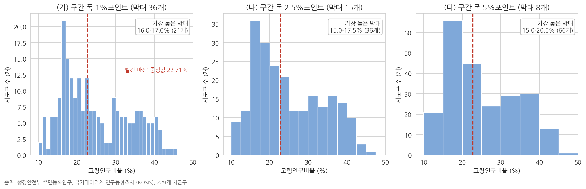
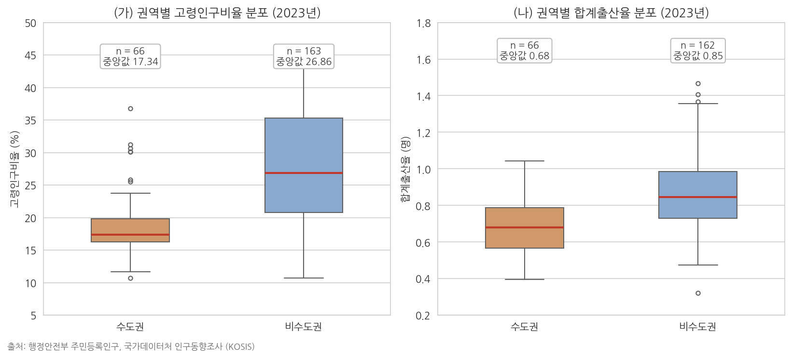
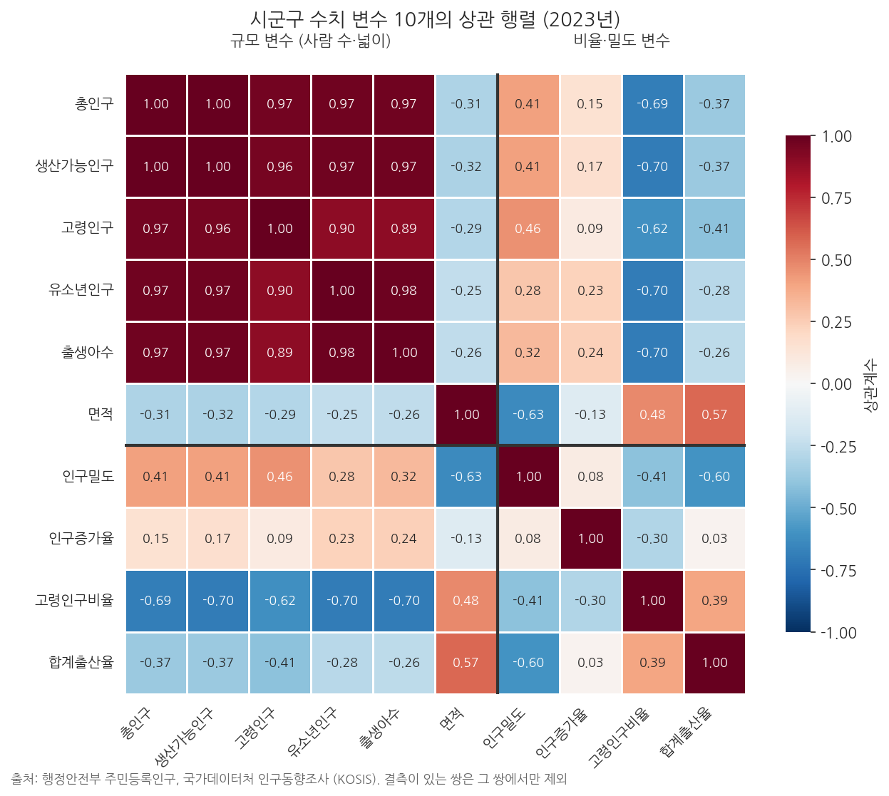
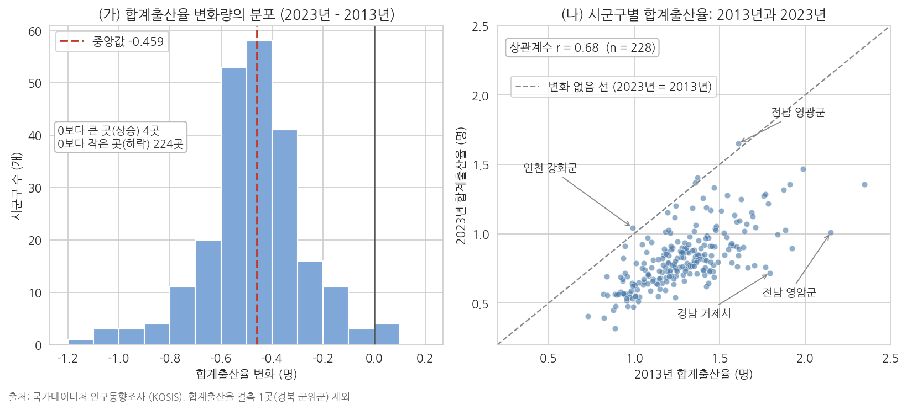

# 9주차 2회차. 에이전트로 EDA 수행하기

## 이 실습에서 하는 것

1회차에서 그림을 읽는 법을 배웠다. 이번 실습에서는 에이전트에게 그림을 그리게 하고, 나온 그림을 내가 읽는다. 1회차에서 정리한 분업(그리는 것은 에이전트, 읽는 것은 나)을 처음부터 끝까지 한 번 완주하는 것이 목표다.

작업 순서는 EDA의 표준 순서를 그대로 따른다. 변수 하나의 분포(히스토그램, 박스플롯)에서 시작해, 변수 두 개의 관계(산점도)로 나아가고, 시간의 흐름(시계열 그림)으로 마친다. 여기에 두 집단의 비교(수도권과 비수도권)와 두 시점의 비교(2013년과 2023년)를 더한다. 그리고 그림마다 반드시 해석 한 단락을 자기 문장으로 쓴다. 그림 없는 해석이 공허하듯, 해석 없는 그림은 미완성이다.

이 실습이 끝나면 다음이 만들어져 있어야 한다.

- figures 폴더에 저장된 여섯 개의 완성된 그림 (히스토그램, 박스플롯, 산점도, 시계열, 권역 비교 박스플롯, 두 시점 비교 그림)
- 각 그림 아래에 해석 한 단락이 붙은 'EDA보고_9주차.md' 문서
- 일부러 왜곡했다가 바로잡은 그래프 한 쌍과 그 차이에 대한 설명
- 그림 점검표(제목·축·단위·범례·출처)와, 새 대화에서 다시 계산해 그림의 숫자와 대조한 독립 검산 기록

여기에 비교 실험의 산출물이 더해진다. 같은 데이터를 세 가지 구간 폭으로 그린 히스토그램 세 쌍둥이, 수치 변수 전체의 상관 행렬 한 장과 거기서 고른 후보의 산점도, 이상치 한 곳을 포함한 그림과 뺀 그림의 짝, 그리고 같은 코드를 다시 돌려 같은 그림이 나오는지 확인한 재현 기록이다. 그림을 많이 그리는 것이 목적이 아니다. 하나의 데이터를 여러 방식으로 그려 보면서 무엇이 데이터에서 오는 것이고 무엇이 내 선택에서 오는 것인지 가려내는 훈련이 목적이다.

오늘도 검증이 절반이다. 에이전트는 그림을 빠르게 그려 주지만, 축을 자른 그래프를 아무렇지 않게 내놓기도 하고, 해설에서 과잉해석을 하기도 하며, 변화량의 부호를 거꾸로 계산해 정반대의 이야기를 만들기도 한다. 그 순간을 잡아내는 것까지가 오늘의 실습이다. 방법은 2주차의 세 겹 그대로다. 지시문에 보고 항목을 못 박고(검증 손잡이), 같은 값을 새 대화에서 다시 계산시키고(독립 검산), 마지막에는 그림 파일을 내 눈으로 연다.

## 준비물

| 구분 | 내용 |
|------|------|
| 폴더 | 3주차에 만든 uv 기반 분석 프로젝트 폴더 (data, code, figures 하위 폴더) |
| 데이터 | `data/sigungu_2023.csv` (전국 229개 시군구 인구 지표, 출처: 행정안전부 주민등록인구·국가데이터처(옛 통계청) 인구동향조사, KOSIS에서 수집), `data/sigungu_tfr_2013_2023.csv` (7주차 실습에서 2013년 합계출산율을 병합한 산출물), `data/income_dist.csv` (연도별 소득분배지표, 출처: 국가데이터처 소득분배지표, KOSIS에서 수집) |
| 도구 | VSCode + Claude Code, pandas·matplotlib·seaborn·koreanize-matplotlib가 설치된 uv 환경 (3주차에서 구축) |
| 선수 내용 | 9주차 1회차 (그림의 종류와 읽는 법, 시각화 윤리), 7주차 (결측값, 병합, 정제 로그), 2주차 (검증 손잡이, 새 대화 독립 검산) |

7주차 실습에서 데이터를 정제하며 확인했듯 sigungu_2023.csv에는 합계출산율이 결측인 시군구가 1곳(경북 군위군) 있다. 오늘 이 결측이 그림에 어떻게 나타나는지도 지켜볼 것이다. 병합 파일에는 7주차의 정제 이력(미추홀구 이름 통일, 청주시의 2013년 값이 통합 전 옛 청주시 값이라는 점)이 그대로 실려 있다는 것도 기억해 두자.

## 2.1 일변량 → 이변량 → 시계열 순서로 그림 만들기

### 첫 번째 그림: 히스토그램 (변수 하나의 분포)

**무엇을 왜 하는가.** EDA의 출발은 관심 변수 하나의 생김새를 보는 것이다. 고령인구비율의 히스토그램부터 그린다. 지시할 때는 어떤 그림을(히스토그램), 어떤 변수로(고령인구비율), 어떤 요소를 갖춰(제목·축 라벨·단위), 어디에 저장할지(파일 경로)까지 지정한다. 2주차에서 배운 대로, 산출물의 형태를 지시에 못 박아야 검증할 기준이 생긴다.

<div style="border:1px solid #cfe3d4;border-left:5px solid #2f8f4e;background:#f4fbf6;padding:12px 16px;margin:18px 0;border-radius:4px;">
<strong>지시문 예시</strong><br>
"data/sigungu_2023.csv를 읽어 고령인구비율의 히스토그램을 그려 줘. 조건: (1) seaborn 스타일을 쓰고 한글이 깨지지 않게 koreanize-matplotlib를 사용할 것, (2) 제목·가로축 라벨(단위 % 포함)·세로축 라벨을 갖출 것, (3) 중앙값 위치를 세로선으로 표시할 것, (4) 그리는 코드는 code/eda_hist.py로, 그림은 figures/eda_hist.png로 저장할 것. 다 그린 뒤 몇 개 시군구가 사용되었는지와 평균·중앙값·최솟값·최댓값(어느 시군구인지 포함)을 함께 보고해 줘."
</div>

**예상되는 에이전트의 행동과 결과.** 에이전트가 먼저 파일을 읽어 열 이름을 확인하고(도구 사용 로그에 파일 읽기가 먼저 찍힌다), 파이썬 스크립트를 작성해 실행 승인을 구한 뒤, figures 폴더에 PNG 파일을 만든다. 화면에는 다음과 같은 순서로 도구 사용 기록이 쌓인다.

```
Read  data/sigungu_2023.csv (1-20행)
  → 열 12개 확인: 시도, 시군구, 총인구, 면적, 인구밀도, 인구증가율, 고령,
    생산가능, 유소년, 고령인구비율, 합계출산율, 출생아수
Write code/eda_hist.py
Bash  uv run python code/eda_hist.py    [실행 승인 요청]
  → figures/eda_hist.png 저장 완료
```

승인 요청이 뜨면 어떤 명령을 실행하려는지 한 줄 읽고 승인한다. 2주차에서 배운 대로 승인 화면은 에이전트가 무엇을 하려는지 마지막으로 확인하는 자리다. 완료 보고는 대략 다음 모양이다.

```
그림 저장: figures/eda_hist.png (코드: code/eda_hist.py)
사용한 시군구: 229개 (고령인구비율 결측 없음)
평균 24.98%, 중앙값 22.71%
최소 10.68% (울산 북구), 최대 45.28% (경북 의성군)
분포는 오른쪽으로 긴 꼬리를 가진 모양입니다.
```

탐색기에서 PNG를 클릭하면 1회차 그림 9-1과 비슷한 모양의 그림이 보여야 한다.

**검증.** 네 가지를 확인한다. 첫째, 그림 파일이 실제로 figures 폴더에 생겼는가(에이전트가 "저장했다"고 말하는 것과 파일이 실제로 있는 것은 다른 문제다). 둘째, 에이전트가 보고한 관측치 수가 229인가. CSV를 직접 열어 맨 아래로 스크롤하면 마지막 행 번호가 230이어야 한다(1행은 열 이름). 셋째, 그림의 가로축 범위가 상식적인가. 고령인구비율은 비율이므로 0-100% 사이여야 하고, 실제 데이터는 대략 10-45% 사이다. 축에 음수나 100 넘는 값이 보이면 무언가 잘못된 것이다. 넷째, 그림에 찍힌 숫자 하나를 파일의 셀 하나와 맞춰 본다. Ctrl+F로 "의성군"을 찾아 그 행의 고령인구비율 칸이 45.28로 시작하는지 읽는다. 이 동작이 오늘 그림 검증의 기본 단위다.

### 두 번째 그림: 박스플롯 (집단 비교)

**무엇을 왜 하는가.** 전국의 분포를 보았으니 "시도별로 다른가"를 본다. 여러 집단의 분포 비교에는 박스플롯이 표준이라는 것을 1회차에서 배웠다. 이번 지시에는 정렬 순서라는 조건을 추가해 본다. 시도를 가나다순으로 늘어놓는 것보다 중앙값 순으로 정렬해야 패턴이 잘 보이기 때문이다.

<div style="border:1px solid #cfe3d4;border-left:5px solid #2f8f4e;background:#f4fbf6;padding:12px 16px;margin:18px 0;border-radius:4px;">
<strong>지시문 예시</strong><br>
"같은 데이터로 시도별 고령인구비율 박스플롯을 그려 줘. 조건: (1) 가로 방향 박스플롯으로, 시도를 중앙값이 낮은 순으로 정렬할 것, (2) 제목과 축 라벨(단위 포함)을 갖출 것, (3) 코드는 code/eda_box.py, 그림은 figures/eda_box.png로 저장할 것. 그린 뒤 시도별 관측치 수(시군구 수)와 중앙값을 그림과 같은 순서의 표로 함께 보고해 줘."
</div>

**예상되는 에이전트의 행동과 결과.** 1회차 그림 9-2와 같은 구도의 그림이 나온다. 함께 요청한 표는 중앙값 순으로 세종에서 시작해 전북에서 끝난다.

```
시도    시군구 수   중앙값(%)
세종        1      11.10
경기       31      16.42
울산        5      16.67
인천       10      17.36
광주        5      17.52
서울       25      18.42
제주        2      19.06
대전        5      19.13
대구        8      19.78
부산       16      22.79
충북       11      25.74
강원       18      27.32
충남       15      29.71
경남       18      31.74
경북       23      32.10
전남       22      34.41
전북       14      35.37
합계      229
```

표를 그림과 나란히 놓고 보면 읽을 거리가 하나 더 생긴다. 상자의 순서는 중앙값이 정하지만, 상자의 길이는 그 시도 안의 다양성이 정한다. 시군구가 하나뿐인 세종은 상자가 아니라 선 하나로 나타나고, 31개 시군구를 가진 경기는 중앙값이 낮은 쪽에 있으면서도 상자가 길게 늘어난다. 도시와 농촌이 한 도 안에 섞여 있기 때문이다. 에이전트가 표에 덧붙이는 설명은 대체로 이런 문장이다. "중앙값이 가장 낮은 곳은 세종(11.10%)이고 가장 높은 곳은 전북(35.37%)으로, 두 시도의 차이는 24.27%포인트입니다."

**검증.** 박스플롯 검증의 핵심은 상자 하나를 골라 원자료와 대조하는 것이다. 예를 들어 세종의 상자가 선 하나로 나타났는지 확인하라. 1회차에서 배웠듯 관측치가 1개면 상자가 만들어질 수 없다. 만약 세종에 번듯한 상자가 그려져 있다면 데이터가 잘못 붙었다는 신호다. 다음으로 관측치 수 표의 합계가 229인지 확인한다. 229가 아니라면 어떤 행이 누락되거나 중복된 것이다. 마지막으로 표의 순서와 그림의 상자 순서가 같은지 위에서 아래로 훑는다. 다르면 둘을 맞대어 읽을 수 없으므로 하나를 다시 시킨다.

### 세 번째 그림: 산점도 (두 변수의 관계)

**무엇을 왜 하는가.** 이제 이변량으로 넘어간다. 1회차에서 본 흥미로운 관계, 곧 고령인구비율과 합계출산율의 산점도를 직접 재현한다. 이 그림에는 결측이 얽혀 있어서 검증 거리가 하나 늘어난다.

<div style="border:1px solid #cfe3d4;border-left:5px solid #2f8f4e;background:#f4fbf6;padding:12px 16px;margin:18px 0;border-radius:4px;">
<strong>지시문 예시</strong><br>
"같은 데이터로 가로축 고령인구비율, 세로축 합계출산율의 산점도를 그려 줘. 조건: (1) 추세선을 함께 표시할 것, (2) 제목과 축 라벨(단위 포함)을 갖출 것, (3) 상관계수를 소수 둘째 자리까지 그림 안에 표시할 것, (4) 코드는 code/eda_scatter.py, 그림은 figures/eda_scatter.png로 저장할 것. 그리고 산점도에 실제로 찍힌 점이 몇 개인지, 제외된 시군구가 있다면 어디이고 왜 제외되었는지 보고해 줘."
</div>

**예상되는 에이전트의 행동과 결과.** 오른쪽으로 갈수록 완만히 올라가는 점 구름과 추세선, 그리고 "상관계수 r = 0.39" 표시가 담긴 그림이 나온다. 보고는 다음처럼 와야 정상이다.

```
그림 저장: figures/eda_scatter.png
찍힌 점: 228개
제외: 경북 군위군 1곳 (합계출산율 결측)
상관계수 r = 0.39
```

**검증.** 이 단계의 검증 포인트가 오늘의 첫 번째 함정이다. 지시문의 마지막 문장(제외된 시군구 보고)을 일부러 빼고 시켜 보면, 에이전트는 결측 1곳을 말없이 빼고 그린 뒤 아무 언급도 하지 않는 경우가 많다. 그림만 봐서는 점이 228개인지 229개인지 알 길이 없으므로, 결측 처리는 그림에서 가장 검증하기 어려운 부분이다. 그래서 산점도를 시킬 때는 "몇 개가 찍혔고 무엇이 왜 빠졌는지"를 보고 항목에 반드시 포함시킨다. 7주차에서 만든 정제 로그(군위군 합계출산율 결측)와 에이전트의 보고가 일치하는지 대조하라.

### 네 번째 그림: 시계열 (시간의 흐름)

**무엇을 왜 하는가.** 마지막으로 데이터 파일을 바꿔 시간 축을 다룬다. income_dist.csv의 지니계수 추이를 선 그림으로 그린다.

<div style="border:1px solid #cfe3d4;border-left:5px solid #2f8f4e;background:#f4fbf6;padding:12px 16px;margin:18px 0;border-radius:4px;">
<strong>지시문 예시</strong><br>
"data/income_dist.csv를 읽어 연도별 지니계수의 시계열 선 그림을 그려 줘. 조건: (1) 각 연도의 값을 점으로 찍고 선으로 이을 것, (2) 제목에 기간(2011-2023년)을 포함하고 축 라벨을 갖출 것, (3) 첫해와 마지막 해의 값을 그림 안에 숫자로 표시할 것, (4) 코드는 code/eda_line.py, 그림은 figures/eda_line.png로 저장할 것. 세로축 범위를 어떻게 잡았는지도 설명해 줘."
</div>

**예상되는 에이전트의 행동과 결과.** 2011년 0.387에서 2023년 0.323으로 내려가는 선 그림이 나온다. 세로축 범위 질문에는 "데이터 범위에 맞춰 0.32-0.39 부근으로 잡았다"거나 "0.30-0.40으로 잡았다"는 답이 올 것이다. 함께 오는 보고는 다음 모양이다.

```
그림 저장: figures/eda_line.png (코드: code/eda_line.py)
연도 13개 (2011-2023년), 결측 없음
첫해 2011년 0.387, 마지막 해 2023년 0.323 (12년간 -0.064)
세로축 범위: 0.30-0.40 (데이터 최솟값 0.323, 최댓값 0.387에 여유를 둔 값)
전반적으로 하락 추세이며 2016년(0.350 → 0.353)과 2021년(0.328 → 0.329)에
소폭 반등이 있습니다.
```

여기에 에이전트가 해석 문단을 덧붙이는 일이 많은데, 그 문장은 대개 다음과 같다. "지니계수는 2011년 이후 꾸준히 하락해 소득 불평등이 완화되는 추세를 보이고 있습니다. 다만 2016년과 2021년의 반등은 경기 상황이나 정책 변화의 영향일 수 있습니다." 앞 문장은 그림에 있는 내용이고, 뒤 문장의 "경기 상황이나 정책 변화의 영향"은 그림에 없는 추측이다. 이런 문장을 어떻게 가려내는지가 2.7의 주제다.

**검증.** 두 가지다. 첫째, 값 대조. KOSIS에서 소득분배지표를 검색해 포털 화면의 지니계수와 그림의 첫해·마지막 해 값이 일치하는지 확인한다(6주차에서 연습한 원천 대조다). 둘째, 세로축 읽기. 에이전트가 잡은 세로축 범위가 무엇인지 그림에서 직접 읽어 보라. 1회차에서 배웠듯 선 그림의 축 확대는 관행상 허용되지만, 얼마나 확대되었는지에 따라 같은 하락이 완만해 보이기도 급락으로 보이기도 한다. 지금 이 그림은 어느 쪽 인상을 주는가. 이 감각은 2.9에서 본격적으로 다룬다.

## 2.2 같은 데이터, 다른 인상: 히스토그램의 구간 폭 바꿔 보기

**무엇을 왜 하는가.** 2.1에서 히스토그램 한 장을 받았다. 그 그림의 모양이 데이터만으로 정해진다고 생각하기 쉽지만 그렇지 않다. 히스토그램은 값을 구간으로 나눠 담아 세는 그림이므로, 구간을 얼마나 넓게 잡느냐에 따라 같은 데이터가 다른 모양으로 보인다. 문제는 이 선택이 대개 눈에 보이지 않는다는 것이다. 지시문에 구간 폭을 적지 않으면 그림 도구가 알아서 정하고, 학생은 선택이 있었다는 사실조차 모른 채 그 모양을 데이터의 모양으로 받아들인다. 그래서 세 가지 폭으로 그려 나란히 놓아 본다. 이 비교의 목적은 어느 폭이 정답인지 고르는 것이 아니라, 무엇이 데이터의 성질이고 무엇이 내 선택의 결과인지 가르는 것이다.

<div style="border:1px solid #cfe3d4;border-left:5px solid #2f8f4e;background:#f4fbf6;padding:12px 16px;margin:18px 0;border-radius:4px;">
<strong>지시문 예시</strong><br>
"data/sigungu_2023.csv의 고령인구비율로 히스토그램을 세 개 그려 한 그림에 가로로 나란히 붙여 줘. 구간 폭은 각각 1%포인트, 2.5%포인트, 5%포인트로 하고 시작점은 10%로 맞출 것. 조건: (1) 패널마다 제목에 구간 폭과 막대 개수를 적을 것, (2) 세 패널 모두 가로축 범위를 같게 잡을 것, (3) 중앙값 위치를 세로선으로 표시할 것, (4) 그림은 figures/eda_hist_binwidth.png, 코드는 code/eda_hist_binwidth.py로 저장할 것. 그린 뒤 폭마다 막대 개수, 가장 높은 막대의 구간과 그 안의 시군구 수, 막대 높이를 모두 더한 값을 표로 보고하고, 세 그림에서 공통으로 보이는 특징과 폭에 따라 달라지는 특징을 나눠서 적어 줘."
</div>

**예상되는 에이전트의 행동과 결과.** 세 패널 그림이 나오고 보고는 다음 모양이다.

```
폭 1.0%포인트: 막대 36개, 가장 높은 막대 16.0-17.0% (21곳), 높이 합계 229
폭 2.5%포인트: 막대 15개, 가장 높은 막대 15.0-17.5% (36곳), 높이 합계 229
폭 5.0%포인트: 막대  8개, 가장 높은 막대 15.0-20.0% (66곳), 높이 합계 229

공통: 왼쪽에 봉우리가 있고 오른쪽으로 꼬리가 긴 모양, 중앙값 22.71%
달라지는 것: 20% 아래 구간의 오르내림, 30-40% 부근이 두 번째 봉우리로 보이는지 여부
```



그림 읽는 법. 세 패널의 데이터는 완전히 같은 229개 시군구의 고령인구비율이다. (가)는 구간 폭 1%포인트로 36개의 막대가 섰다. 16-17% 구간에 21곳이 몰린 뾰족한 봉우리가 있고 바로 옆 15-16%는 9곳으로 뚝 떨어지며, 전체적으로 톱니처럼 들쭉날쭉하다. 이 오르내림에 의미를 붙이기는 어렵다. 229개를 36칸에 나눠 담으면 칸당 평균 여섯 곳뿐이어서, 한두 곳 차이가 막대 높이를 크게 흔들기 때문이다. (다)는 폭 5%포인트로 막대가 8개뿐이다. 15-20% 구간에 66곳이 들어가 매끈한 모양이 되지만, 그 66곳이 구간 안에서 어떻게 퍼져 있는지는 알 수 없게 된다. (나)의 폭 2.5%포인트는 그 중간이다. 이제 세 그림을 함께 놓고 무엇이 살아남는지 본다. 왼쪽의 봉우리와 오른쪽으로 긴 꼬리는 세 폭 모두에서 그대로다. 이것은 데이터의 성질이다. 30-40% 부근에서 막대가 다시 두툼해지는 두 번째 덩어리도 (나)와 (다)에서 함께 보인다((나)에서는 30-32.5%에 16곳, 35-37.5%에 16곳, (다)에서는 30-35%에 29곳, 35-40%에 30곳으로 25-30% 구간의 24곳보다 높다). 반면 (가)의 톱니 모양은 폭을 넓히면 사라진다. 이것은 선택의 결과다. 그림에서 무언가를 읽었을 때 "이것은 폭을 바꿔도 남아 있는가"를 물어보는 습관이 여기서 나온다.

**표 9-2. 구간 폭에 따른 히스토그램의 변화 (고령인구비율, 229개 시군구)**

| 구간 폭 | 막대 개수 | 가장 높은 막대 | 그 안의 시군구 수 | 막대 높이 합계 |
|------|------|------|------|------|
| 1%포인트 | 36 | 16.0-17.0% | 21 | 229 |
| 2.5%포인트 | 15 | 15.0-17.5% | 36 | 229 |
| 5%포인트 | 8 | 15.0-20.0% | 66 | 229 |

**검증.** 세 가지를 확인한다. 첫째, 막대 높이의 합계다. 폭을 어떻게 바꾸든 229개 시군구를 나눠 담은 것이므로 합계는 언제나 229여야 한다. 표의 마지막 열이 셋 다 229인지 본다. 이 값이 228이나 230이면 구간의 경계에서 한 곳이 빠졌거나 두 번 세어진 것이다. 특히 경계에 정확히 걸친 값을 어느 쪽 구간에 넣을지에 따라 흔히 생기는 실수이므로, 합계는 히스토그램 검증의 첫 항목으로 삼는다. 둘째, 그림과 표의 대조다. (다)에서 가장 높은 막대를 눈으로 찾아 세로축 눈금을 읽으면 66 근처여야 하고, 그 막대의 가로 위치가 15에서 20 사이여야 한다. 셋째, 에이전트가 틀리는 장면이 여기서도 나온다. 세 그림을 놓고 요약을 시키면 다음과 비슷한 문장이 오는 일이 있다(가상의 예로 구성했다). "구간 폭 5%포인트 그림에서 두 개의 봉우리가 뚜렷하게 나타나므로, 우리나라 시군구는 젊은 도시와 늙은 농촌이라는 두 집단으로 뚜렷이 나뉜다." 잡아내는 절차는 네 단계다. 첫째, 발견한다. (가)에서는 두 번째 봉우리가 톱니에 묻혀 보이지 않고, (나)에서는 봉우리라기보다 평평한 어깨로 보인다. 같은 데이터에서 폭만 바꿨는데 결론이 나타났다 사라졌다 한다면, 그 결론은 데이터가 아니라 폭이 만든 것이다. "뚜렷이 나뉜다"는 단정은 세 그림 중 하나에서만 지지된다. 둘째, 재지시한다. "세 그림 모두에서 유지되는 특징과 폭에 따라 나타났다 사라지는 특징을 나눠 적어 줘. 한 가지 폭에서만 보이는 특징은 결론 문장에 쓰지 말고, 쓰려면 어느 폭에서 보이는지 밝혀 줘." 셋째, 수정문을 확인한다. "폭을 1, 2.5, 5%포인트로 바꿔도 왼쪽 봉우리와 오른쪽으로 긴 꼬리는 유지된다. 30-40% 부근이 두 번째 덩어리로 보이는지는 폭에 따라 달라지므로, 두 집단으로 나뉜다는 판단은 이 그림만으로 내릴 수 없다." 정도가 되어야 한다. 넷째, 과제 9-B의 재료로 기록해 둔다.

## 2.3 그룹별 분포 비교: 그림에서 읽은 것과 표의 숫자를 맞대기

**무엇을 왜 하는가.** 시도별 박스플롯은 열일곱 개의 상자로 전체 지형을 보여 주지만, 정책의 질문은 흔히 두 집단의 비교로 좁혀진다. "수도권과 비수도권은 다른가"가 대표적이다. 이 단계에서는 집단을 둘로 묶은 박스플롯을 그리고, 그림에서 눈으로 읽은 것과 표로 뽑은 숫자를 맞대어 본다. 박스플롯은 다섯 숫자(최소, 1사분위, 중앙값, 3사분위, 최대)를 그림으로 바꾼 것이므로, 그 다섯 숫자를 표로 받으면 그림을 숫자로 되돌려 검증할 수 있다. 10주차에서 같은 두 집단을 t검정으로 비교하므로 오늘 본 차이가 다음 주 검정의 재료가 된다. 수도권의 정의(서울·경기·인천)는 에이전트에게 맡기지 않고 지시문에 직접 적는다.

<div style="border:1px solid #cfe3d4;border-left:5px solid #2f8f4e;background:#f4fbf6;padding:12px 16px;margin:18px 0;border-radius:4px;">
<strong>지시문 예시</strong><br>
"data/sigungu_2023.csv에서 시도가 서울·경기·인천이면 수도권, 나머지는 전부 비수도권으로 나눠 줘. (1) 고령인구비율과 합계출산율 각각에 대해 두 권역의 박스플롯을 나란히 그리고, 상자마다 관측치 수와 중앙값을 그림 안에 적을 것, (2) 제목·축 라벨(단위)·출처를 갖추고 koreanize-matplotlib를 쓸 것, (3) 코드는 code/eda_box_region.py, 그림은 figures/eda_box_region.png로 저장할 것. 그린 뒤 변수와 권역별로 관측치 수, 최소, 1사분위, 중앙값, 3사분위, 최대를 표로 보고하고, 최소와 최대는 어느 시군구인지도 적어 줘. 마지막으로 그림에서 읽히는 것을 세 문장으로 요약해 줘."
</div>

**예상되는 에이전트의 행동과 결과.** 그림 9-7과 같은 두 패널 그림이 나오고, 다음과 같은 표가 따라온다.

```
변수          권역      n    최소    Q1    중앙값   Q3    최대
고령인구비율   수도권    66   10.69  16.28  17.34  19.84  36.81
고령인구비율   비수도권  163  10.68  20.76  26.86  35.30  45.28
합계출산율     수도권    66   0.394  0.567  0.679  0.787  1.043
합계출산율     비수도권  162  0.320  0.730  0.846  0.985  1.651
```

최소·최대 시군구도 함께 온다. 고령인구비율은 수도권 최소 경기 화성시·최대 인천 강화군, 비수도권 최소 울산 북구·최대 경북 의성군이다.



그림 읽는 법. 왼쪽(가)은 고령인구비율, 오른쪽(나)은 합계출산율이다. 상자 가운데 빨간 선이 중앙값, 상자의 위아래가 3사분위와 1사분위, 수염 끝이 극단값을 뺀 최소와 최대, 동그라미가 멀리 떨어진 시군구다. (가)에서 비수도권 상자는 수도권보다 위에 있고 훨씬 길다. 중앙값은 17.3% 대 26.9%로 9.5%포인트 차이가 나고, 비수도권은 1사분위 20.8%에서 3사분위 35.3%까지 퍼져 있어 한 권역 안에 젊은 도시와 늙은 농촌이 함께 들어 있다. 그런데 두 상자의 세로 범위는 크게 겹친다. 수도권의 동그라미 다섯 개(인천 강화군 36.8% 등)는 비수도권 중앙값 위에 있고, 비수도권 수염의 아래 끝(울산 북구 10.7%)은 수도권 최솟값과 거의 같다. (나)도 같은 구조다. 비수도권 중앙값(0.85명)이 수도권(0.68명)보다 높지만 상자가 넓게 겹치고, 전국 최저(부산 중구 0.32명)는 비수도권에 있다. 여기서 알 수 있는 것은 권역 사이의 차이와 권역 안의 다양성이 동시에 크다는 사실이다. 중앙값만 보고 "비수도권은 늙었다"고 말하면 그림의 절반만 읽은 것이다.

**검증.** 이 단계에서 에이전트가 틀리는 장면을 하나 만나 보자. 세 문장 요약에 다음과 비슷한 문장이 섞여 나오는 일이 있다(가상의 예로 구성했다). "수도권 시군구는 예외 없이 비수도권보다 젊고, 비수도권의 어느 시군구도 수도권 수준으로 젊지 않다." 유창하지만 그림에 없는 주장이다. 잡아내는 절차는 네 단계다. 첫째, 표로 발견한다. 관측치 수부터 본다. 66 + 163 = 229이고, 합계출산율은 66 + 162 = 228이다(군위군이 비수도권이므로 그쪽이 하나 준다). 그다음 문장과 표를 맞댄다. "예외 없이"는 수도권 최댓값(36.81)이 비수도권 중앙값(26.86)보다 크다는 숫자와 모순되고, "어느 시군구도"는 비수도권 최솟값(10.68)이 수도권 최솟값(10.69)과 같은 수준이라는 숫자와 모순된다. 둘째, 재지시한다. "방금 요약 가운데 표의 최솟값·최댓값과 모순되는 문장을 찾아 표의 숫자로 고쳐 써 줘. 비수도권 중앙값보다 고령인구비율이 높은 수도권 시군구와 수도권 중앙값보다 낮은 비수도권 시군구가 각각 몇 곳인지도 세어 줘." 셋째, 수정문을 확인한다. "중앙값 기준으로 수도권이 9.5%포인트 젊지만 두 권역의 범위는 크게 겹친다. 수도권에도 인천 강화군(36.8%) 등 비수도권 중앙값을 넘는 곳이 5곳 있고, 비수도권에도 울산 북구(10.7%) 등 수도권 중앙값보다 젊은 곳이 22곳 있다." 넷째, 사람의 눈으로 마감한다. CSV에서 "강화군"을 찾아 고령인구비율 칸이 36.8로 시작하는지 확인한다. 이 왕복(틀림, 발견, 재지시, 수정)을 기록해 둔다. 과제 9-B의 재료다.

## 2.4 상관 행렬로 관계 후보 고르기: 45가지 짝에서 셋을 고르는 법

**무엇을 왜 하는가.** sigungu_2023.csv에는 수치가 담긴 열이 10개 있다. 총인구, 면적, 인구밀도, 인구증가율, 고령인구, 생산가능인구, 유소년인구, 고령인구비율, 합계출산율, 출생아수다. 이 가운데 둘씩 짝지으면 45가지 조합이 나온다. 45장의 산점도를 다 그려 놓고 고르는 것은 시간 낭비이고, 그렇다고 처음부터 두 개만 찍어서 보는 것은 나머지 43가지를 안 본 채 결론을 내리는 일이다. 그래서 EDA에는 후보를 좁히는 단계가 따로 있다. 모든 짝의 상관계수를 한 판에 늘어놓은 것을 상관 행렬(correlation matrix)이라 하고, 그 값의 크기를 색의 진하기로 칠한 그림을 히트맵(heatmap)이라 한다. 상관 행렬은 지도이고 산점도는 현장 답사다. 지도로 갈 곳을 정하고 정한 곳만 답사한다. 다만 1회차에서 배운 경고를 잊지 않는다. 모양이 전혀 다른 관계도 같은 상관계수를 낼 수 있으므로, 후보로 고른 짝은 반드시 산점도로 눈으로 확인해야 한다.

<div style="border:1px solid #cfe3d4;border-left:5px solid #2f8f4e;background:#f4fbf6;padding:12px 16px;margin:18px 0;border-radius:4px;">
<strong>지시문 예시</strong><br>
"data/sigungu_2023.csv의 수치형 열 전체에 대해 상관 행렬을 만들어 줘. 조건: (1) 값을 색으로 칠한 히트맵으로 그리되 각 칸에 상관계수를 소수 둘째 자리까지 숫자로 적을 것, (2) 사람 수와 넓이를 나타내는 규모 변수(총인구, 생산가능인구, 고령인구, 유소년인구, 출생아수, 면적)를 앞쪽에, 비율·밀도 변수(인구밀도, 인구증가율, 고령인구비율, 합계출산율)를 뒤쪽에 모아 배치할 것, (3) 그림은 figures/eda_corr.png, 코드는 code/eda_corr.py로 저장할 것. 그린 뒤 어떤 열을 썼는지 목록, 결측이 있는 짝을 어떻게 처리했는지, 그리고 상관계수 절댓값이 큰 상위 6개 짝을 표로 보고해 줘."
</div>

**예상되는 에이전트의 행동과 결과.** 히트맵과 함께 다음과 같은 목록이 온다.

```
사용한 열 10개 (총인구, 면적, 인구밀도, 인구증가율, 고령인구, 생산가능인구,
  유소년인구, 고령인구비율, 합계출산율, 출생아수)
결측 처리: 짝별 제외. 합계출산율·출생아수가 걸린 짝은 n = 228, 나머지는 n = 229

절댓값 상위 6개 짝
  총인구 - 생산가능인구      r = +0.999
  유소년인구 - 출생아수      r = +0.984
  생산가능인구 - 출생아수    r = +0.974
  생산가능인구 - 유소년인구  r = +0.972
  총인구 - 유소년인구        r = +0.970
  총인구 - 출생아수          r = +0.969
```



그림 읽는 법. 가로와 세로에 같은 변수 이름이 같은 순서로 늘어서 있고, 두 이름이 만나는 칸에 그 짝의 상관계수가 적혀 있다. 붉을수록 양의 상관, 푸를수록 음의 상관, 흰색에 가까울수록 관계가 없다는 뜻이다. 대각선은 자기 자신과의 상관이라 언제나 1.00이고 정보가 없다. 행렬은 대각선을 기준으로 위아래가 거울처럼 같으므로 절반만 읽으면 된다. 검은 선으로 나눈 왼쪽 위 구역이 규모 변수끼리의 칸이다. 사람 수를 세는 다섯 변수가 만나는 부분은 통째로 진한 붉은색이어서, 총인구와 생산가능인구가 1.00(반올림하기 전 0.999), 유소년인구와 출생아수가 0.98이다. 여기서 알 수 있는 것은 하나다. 사람이 많이 사는 시군구에는 노인도 아이도 많고 태어나는 아기도 많다. 이것은 발견이 아니라 규모가 만든 당연한 결과이며, 이 부분의 진한 색은 데이터의 성질이 아니라 변수를 세는 방식의 성질이다. 같은 구역 안에서 면적만 옅은 파랑(-0.25에서 -0.32)으로 혼자 다른데, 땅이 넓은 시군구일수록 사람이 적게 산다는 뜻이다. 오른쪽 아래 구역, 곧 비율·밀도 변수끼리의 칸에는 흰색과 옅은 색이 섞여 있다. 인구밀도와 합계출산율이 -0.60, 고령인구비율과 합계출산율이 +0.39, 고령인구비율과 인구증가율이 -0.30이고, 인구증가율과 합계출산율은 +0.03으로 사실상 관계가 없다. 두 구역이 만나는 오른쪽 위 칸들도 읽을 거리다. 고령인구비율은 사람 수 변수들과 -0.62에서 -0.70 사이의 음의 값을 보이고, 면적과 합계출산율은 +0.57로 이 부분에서 가장 큰 값이다. 큰 시군구일수록 젊고 땅이 넓은 시군구일수록 출산율이 높다는 것, 곧 도시와 농촌의 대비가 여러 칸에 나뉘어 적혀 있는 셈이다.

**검증.** 이 단계에서 오늘 세 번째 틀리는 장면을 만난다. 지시문에 후보를 고르는 기준을 적지 않고 "상관이 강한 셋을 골라 산점도로 확인해 줘"라고만 시키면, 에이전트는 위 목록의 맨 위 세 짝을 그대로 고른 뒤 이런 요약을 붙인다(가상의 예로 구성했다). "인구 규모가 클수록 출생아수가 많다는 매우 강한 관계(r = 0.97)를 확인했다. 인구 규모가 출생아수를 결정하는 가장 중요한 요인으로 보인다." 잡아내는 절차는 네 단계다. 첫째, 발견한다. 고른 세 짝이 모두 규모 변수끼리라는 것을 그림 9-8의 왼쪽 위 구역이 통째로 진한 것에서 알 수 있다. 사람이 100만 명인 도시에 아기가 많이 태어나는 것은 조사해서 알아낸 사실이 아니라 세는 방식에서 나온 것이다. "가장 중요한 요인"이라는 문장은 상관을 인과로, 그것도 정의에 가까운 관계를 인과로 바꿔 말한 것이다. 둘째, 재지시한다. "규모 변수끼리의 짝은 후보에서 빼 줘. 비율·밀도 변수가 적어도 한쪽에 들어가는 짝 중에서 절댓값이 큰 다섯 개를 다시 뽑고, 각각 왜 흥미로운지 또는 왜 당연한지를 한 줄씩 붙여 줘." 셋째, 수정 결과를 확인한다. 표 9-3과 같은 목록이 와야 한다.

**표 9-3. 규모 변수끼리의 짝을 뺀 상위 다섯 짝**

| 두 변수 | 상관계수 r | 짝의 수 | 어떤 관계인가 |
|------|------|------|------|
| 유소년인구 - 고령인구비율 | -0.702 | 229 | 아이가 많은 곳일수록 고령 비율이 낮다. 두 변수 모두 인구 구성에서 나오므로 부분적으로 겹친다 |
| 생산가능인구 - 고령인구비율 | -0.699 | 229 | 위와 같은 이야기. 일하는 인구가 많은 도시일수록 고령 비율이 낮다 |
| 출생아수 - 고령인구비율 | -0.696 | 228 | 위와 같은 이야기 |
| 총인구 - 고령인구비율 | -0.693 | 229 | 위와 같은 이야기 |
| 면적 - 인구밀도 | -0.634 | 229 | 인구밀도는 인구를 면적으로 나눈 값이므로 계산식에서 이미 이어져 있다 |

넷째, 표를 다시 심사한다. 규모 변수를 걷어냈는데도 상위 다섯 짝 가운데 넷이 "고령인구비율과 규모 변수"의 변주이고, 다섯째는 계산식에서 이미 얽힌 짝이다. 상관 행렬의 위쪽은 이렇게 당연한 관계로 채워지기 쉽다. 그래서 후보를 고르는 마지막 판단은 사람이 한다. 서로 다른 자료에서 온 변수, 계산식으로 이어져 있지 않은 변수를 고르는 것이 요령이다. 그 기준으로 다시 보면 흥미로운 짝은 인구밀도와 합계출산율(-0.60)이다. 앞의 것은 행정안전부 주민등록인구와 면적에서, 뒤의 것은 국가데이터처 인구동향조사에서 온 서로 다른 계열의 값이다.

### 후보를 산점도로 답사하기

**무엇을 왜 하는가.** 후보를 골랐으니 답사한다. 상관계수 -0.60이라는 숫자 뒤에 어떤 모양이 있는지는 산점도를 봐야 안다.

<div style="border:1px solid #cfe3d4;border-left:5px solid #2f8f4e;background:#f4fbf6;padding:12px 16px;margin:18px 0;border-radius:4px;">
<strong>지시문 예시</strong><br>
"가로축 인구밀도, 세로축 합계출산율의 산점도를 그려 줘. 제목·축 라벨·단위·출처를 갖추고 상관계수를 그림 안에 표시할 것. figures/eda_density_tfr.png, code/eda_density_tfr.py로 저장. 그린 뒤 점들이 가로축에서 어떻게 퍼져 있는지(고르게 퍼졌는지 한쪽에 몰렸는지) 설명하고, 인구밀도의 최솟값·중앙값·평균·최댓값을 함께 보고해 줘."
</div>

**예상되는 에이전트의 행동과 결과.** 점들이 왼쪽 세로줄에 뭉쳐 붙고 오른쪽으로 몇 개만 멀리 흩어진 그림이 나온다. 보고에는 인구밀도의 중앙값이 제곱킬로미터당 491.5명인데 평균은 3,711.3명, 최댓값은 서울 양천구의 25,050.4명이라는 숫자가 함께 온다. 평균이 중앙값의 일곱 배가 넘는다는 것은 1회차에서 배운 오른쪽으로 심하게 치우친 분포의 신호다. 이런 변수는 가로축을 로그 눈금으로 바꿔 그린다. 로그 눈금은 1, 10, 100, 1000처럼 열 배씩 건너뛰는 축이어서, 한쪽에 뭉친 점들을 넓게 펼쳐 준다. 로그 눈금을 왜 쓰는지는 1회차 1.3절에 설명해 두었으니 다시 읽어 보아도 좋다.

<div style="border:1px solid #cfe3d4;border-left:5px solid #2f8f4e;background:#f4fbf6;padding:12px 16px;margin:18px 0;border-radius:4px;">
<strong>지시문 예시 (로그 축으로 다시)</strong><br>
"같은 산점도를 가로축만 로그 눈금으로 바꿔 다시 그려 줘. figures/eda_density_tfr_log.png로 저장하고, 로그를 취한 인구밀도와 합계출산율의 상관계수도 함께 계산해 줘. 원래 값의 상관계수와 나란히 보고할 것."
</div>

**검증.** 두 상관계수를 대조한다. 원래 값으로는 -0.599, 로그를 취하면 -0.676이 나와야 한다. 값이 커졌다고 해서 로그 쪽이 더 진실인 것은 아니다. 상관계수는 직선 관계의 세기를 재는 자이므로, 관계가 원래 곡선이었다면 축을 바꿔 곡선을 곧게 편 만큼 값이 올라간다. 두 그림을 나란히 놓고 어느 쪽이 점들의 모양을 더 정직하게 보여 주는지 눈으로 판단하는 것이 학생의 몫이다. 참고로 1회차에서 인구밀도(로그)와 고령인구비율의 상관계수를 -0.74로 소개했는데, 그 값도 같은 방법으로 계산한 것이다. 새 대화에서 이 두 값을 독립 검산하는 방법은 2.11에서 다룬다. 마지막으로 해석 문장 하나를 점검한다. 에이전트가 "인구가 밀집한 도시일수록 주거비 부담이 커서 출산율이 낮다"처럼 원인을 넣은 문장을 붙였다면, 그 원인은 이 그림 어디에도 없다. 그림이 말할 수 있는 것은 "밀도가 높은 시군구일수록 합계출산율이 낮은 경향이 있다"까지다. 이 구분을 훈련하는 것이 바로 다음 2.7의 주제다.

## 2.5 두 시점 비교: 2013년과 2023년의 합계출산율

**무엇을 왜 하는가.** 시계열 그림은 지표 하나의 흐름을 보여 주지만, 시군구 229곳의 10년 변화를 선 229개로 그릴 수는 없다. 시점이 둘뿐일 때의 표준 그림은 두 가지다. 변화량(2023년 값에서 2013년 값을 뺀 것)의 히스토그램으로 "얼마나, 어느 방향으로" 변했는지 보고, 2013년 값을 가로축에·2023년 값을 세로축에 놓은 산점도로 "어디가 많이 변했는지" 본다. 데이터는 7주차에서 병합한 파일이다. 변화의 정의(무엇에서 무엇을 빼는가)를 지시문에 직접 적는 것이 요령이다. 맡기면 부호가 뒤집힐 수 있다.

<div style="border:1px solid #cfe3d4;border-left:5px solid #2f8f4e;background:#f4fbf6;padding:12px 16px;margin:18px 0;border-radius:4px;">
<strong>지시문 예시</strong><br>
"data/sigungu_tfr_2013_2023.csv를 읽어 합계출산율의 2013년 대비 2023년 변화를 그려 줘. 변화는 반드시 2023년 값(합계출산율 열)에서 2013년 값(합계출산율_2013 열)을 뺀 것으로 정의할 것(양수가 상승). (1) 변화량의 히스토그램에 0의 위치와 중앙값을 세로선으로 표시, (2) 가로축 2013년·세로축 2023년의 산점도에 '변화 없음' 대각선을 긋고 상관계수를 표시, (3) 두 그림을 한 파일 figures/eda_tfr_change.png로, 코드는 code/eda_tfr_change.py로 저장. 보고 항목: 두 해 값이 모두 있는 시군구 수, 제외된 시군구와 이유, 변화량의 평균·중앙값·최소·최대, 상승한 곳과 하락한 곳의 수, 하락 폭 상위 5곳과 상승 폭 상위 5곳의 표(2013년 값, 2023년 값, 변화 포함)."
</div>

**예상되는 에이전트의 행동과 결과.** 그림 9-9와 같은 두 패널 그림이 나오고, 보고는 다음 모양이다.

```
두 해 모두 값이 있는 시군구: 228개 (경북 군위군은 2023년 결측으로 제외)
변화량(2023 - 2013): 평균 -0.467, 중앙값 -0.459, 최소 -1.141, 최대 +0.052
하락 224곳, 상승 4곳
하락 폭 상위: 전남 영암군 2.150 → 1.009 (-1.141), 경남 거제시 1.794 → 0.717 (-1.077),
  경기 연천군 1.922 → 0.895 (-1.027), 충남 청양군 1.767 → 0.759 (-1.008), 전남 해남군 2.349 → 1.356 (-0.993)
상승: 인천 강화군 +0.052, 전남 영광군 +0.042, 경북 의성군 +0.035, 전북 김제시 +0.010
```



그림 읽는 법. 왼쪽(가)은 변화량의 히스토그램이다. 가로축의 0이 변화 없음, 왼쪽이 하락, 오른쪽이 상승이다. 막대 거의 전부가 0의 왼쪽에 있고, 빨간 파선의 중앙값은 -0.459명이다. 228곳 가운데 224곳이 하락했고 153곳은 0.4명 이상 하락했다. 하락은 특정 지역의 일이 아니라 전국 시군구 대부분이 비슷한 폭으로 겪은 일이었다. 오른쪽(나)은 2013년 값(가로축)과 2023년 값(세로축)을 시군구마다 점 하나로 찍은 것이다. 회색 대각선은 두 해의 값이 같은 자리이므로 대각선 아래의 점이 하락한 시군구다. 점 대부분이 대각선 아래에, 그것도 대각선과 나란히 놓여 있다. 2013년에 높았던 곳이 2023년에도 높은 경향(상관계수 0.68)이 유지되었다는 뜻이다. 그런데 2013년에 2명을 넘던 영암군과 해남군은 대각선에서 가장 멀리 떨어진 점이 되었고, 영광군과 강화군은 대각선 위에 살짝 올라 있다. 여기서 생기는 질문은 "왜 하락 폭이 2013년에 높았던 곳에서 크게 나타나는가"이다. 그림은 이 질문에 답하지 않는다. 답의 후보(높았던 만큼 내려올 여지가 컸다는 통계적 설명, 젊은 인구의 유출이라는 실질적 설명)를 가리는 일은 10주차 이후의 몫이다.

**검증.** 이 단계에도 에이전트가 틀리는 장면이 있다. 지시문에서 변화의 정의 문장을 빼고 시켜 보면, 변화를 2013년 값에서 2023년 값을 뺀 것으로 계산해 "평균 +0.467, 상승 224곳"이라고 보고하는 일이 있다. 히스토그램도 0의 오른쪽에 몰린 모양으로 나온다. 표만 보면 "10년 새 출산율이 오른 시군구가 대부분"이라는 정반대의 이야기가 된다. 잡아내는 절차는 네 단계다. 첫째, 표본 한 곳을 직접 계산해 발견한다. VSCode에서 병합 파일을 열어 "강릉시" 행을 찾으면 합계출산율 0.846, 합계출산율_2013 1.173이다. 0.846 - 1.173 = -0.327이므로 강릉시의 변화는 음수여야 한다. 보고서의 강릉시가 +0.327이면 부호가 뒤집힌 것이다. 전국 합계출산율이 2013년보다 2023년에 낮다는 상식으로도 잡힌다. 둘째, 재지시한다. "변화의 정의를 2023년 값 빼기 2013년 값으로 다시 정하고 표와 그림을 다시 만들어 줘. 강원 강릉시의 변화가 -0.327로 나오는지 확인해서 함께 보고해 줘." 셋째, 수정 결과를 확인한다. 강릉시 -0.327, 평균 -0.467, 하락 224곳이면 바로잡힌 것이다. 넷째, 관측치 수 228과 군위군의 제외 사유가 보고되었는지 본다. 마지막으로 해석 단락에 7주차의 청주시 주석을 옮겨 적는다. 청주시의 2013년 값 1.341은 통합 전 옛 청주시의 값이므로, 청주시의 변화(-0.461)는 관할 범위가 다른 두 값의 차이다. 그림은 그것을 표시해 주지 않는다.

## 2.6 이상치 한 곳을 빼고 다시 그려 보기

**무엇을 왜 하는가.** 2.1에서 그린 산점도의 오른쪽 위에는 다른 점들과 뚝 떨어져 혼자 높이 올라간 점이 하나 있다. 합계출산율 1.651명의 전남 영광군이다. 이런 점을 보면 자연스럽게 의심이 생긴다. 저 점 하나 때문에 오른쪽으로 올라가는 관계가 만들어진 것은 아닐까. 의심에 답하는 방법은 간단하다. 그 점을 빼고 한 번 더 그려 두 그림을 나란히 놓는 것이다. 여기서 원칙 하나를 못 박아 둔다. 빼는 것은 그림에서지 데이터에서가 아니다. 7주차에서 배웠듯 값이 유별나다는 이유만으로 원본에서 행을 지우면 그것은 정제가 아니라 훼손이다. 영광군의 1.651명은 오류가 아니라 사실이고 전국에서 가장 높은 실제 값이다. 원본은 그대로 두고, 그리는 코드 안에서만 한 곳을 제외한 그림을 하나 더 만든다.

<div style="border:1px solid #cfe3d4;border-left:5px solid #2f8f4e;background:#f4fbf6;padding:12px 16px;margin:18px 0;border-radius:4px;">
<strong>지시문 예시</strong><br>
"data/sigungu_2023.csv로 고령인구비율(가로축)과 합계출산율(세로축)의 산점도를 두 패널로 나란히 그려 줘. (가)는 합계출산율이 있는 시군구 전부, (나)는 합계출산율이 가장 높은 전남 영광군 한 곳만 뺀 것. 조건: (1) 원본 CSV 파일은 절대 수정하지 말고 그리는 코드 안에서만 제외할 것, (2) 두 패널의 세로축 범위를 각각 그 패널의 데이터에 맞춰 잡을 것, (3) 패널마다 점의 수와 상관계수를 소수 셋째 자리까지 그림 안에 적을 것, (4) 그림은 figures/eda_outlier_compare.png, 코드는 code/eda_outlier.py로 저장할 것. 그린 뒤 두 상관계수의 차이와 세로축 최댓값이 얼마에서 얼마로 바뀌었는지, 그리고 원본 파일의 행 수가 그대로인지 보고해 줘."
</div>

**예상되는 에이전트의 행동과 결과.** 두 패널이 나란한 그림이 나오고 보고는 다음 모양이다.

```
(가) 전체: 점 228개, r = 0.393, 세로축 최댓값 1.651 (전남 영광군)
(나) 영광군 제외: 점 227개, r = 0.394, 세로축 최댓값 1.468 (전남 강진군)
상관계수 차이 +0.001
원본 data/sigungu_2023.csv는 수정하지 않았습니다 (229행 유지)
```

여기서 한 걸음 더 나간다. 영광군만 특별한 점이 아닐 수 있으므로, 가장자리에 있는 다른 점들도 하나씩 빼 보고 상관계수가 얼마나 움직이는지 표로 받는다.

<div style="border:1px solid #cfe3d4;border-left:5px solid #2f8f4e;background:#f4fbf6;padding:12px 16px;margin:18px 0;border-radius:4px;">
<strong>지시문 예시 (한 곳씩 바꿔 가며)</strong><br>
"이번에는 그림을 새로 그리지 말고 상관계수만 다섯 가지 경우로 계산해 표로 보고해 줘. (1) 전체, (2) 전남 영광군만 제외, (3) 경북 의성군만 제외, (4) 부산 중구만 제외, (5) 합계출산율 상위 3곳 제외. 각 행에 점의 수와 상관계수를 소수 셋째 자리까지 적고, 각 경우에 무엇을 왜 뺐는지 한 줄씩 붙여 줘. 원본 파일은 건드리지 말 것."
</div>

결과는 표 9-4와 같아야 한다.

**표 9-4. 이상치 한 곳을 뺐을 때 상관계수의 변화 (고령인구비율과 합계출산율)**

| 제외한 시군구 | 점의 수 | 상관계수 r |
|------|------|------|
| 없음 (전체) | 228 | 0.393 |
| 전남 영광군 (합계출산율 최대 1.651명) | 227 | 0.394 |
| 경북 의성군 (고령인구비율 최대 45.28%) | 227 | 0.376 |
| 부산 중구 (합계출산율 최소 0.320명) | 227 | 0.404 |
| 합계출산율 상위 3곳 (영광군·강진군·의성군) | 225 | 0.365 |

표를 읽는 법은 이렇다. 가장 눈에 띄던 영광군을 빼도 상관계수는 0.393에서 0.394로 사실상 그대로다. 눈에 잘 띄는 점이 반드시 결과를 좌우하는 점은 아닌 것이다. 오히려 가로축 오른쪽 끝의 의성군을 뺄 때 0.376으로, 세로축 아래 끝의 부산 중구를 뺄 때 0.404로 더 많이 움직인다. 상관계수를 밀고 당기는 힘은 "혼자 떨어져 보이는가"가 아니라 "가장자리에 있는가"에서 나온다. 그래도 다섯 경우 모두 0.37에서 0.40 사이이므로, 이 관계가 특정 한 곳에 기대어 서 있다고 볼 근거는 없다. 결론은 두 문장으로 정리된다. 숫자는 한 점을 빼도 거의 움직이지 않는다. 그러나 그림의 인상은 움직인다. 영광군을 빼면 세로축 위쪽이 1.65에서 1.47로 내려오면서 남은 점들이 세로로 조금 더 퍼져 보이는데, 이것은 2.9에서 다룰 축 조정과 정확히 같은 원리다. 10주차에서는 한 점이 회귀선을 얼마나 움직이는지를 같은 방식으로 확인한다.

**검증.** 이 단계에는 원본을 잃을 수 있는 함정이 있다. 지시문에서 "원본 CSV는 수정하지 말 것"을 빼고 "이상치를 제거하고 다시 분석해 줘"라고 뭉뚱그려 시켜 보면, 에이전트가 자기 기준으로 여러 곳을 한꺼번에 지우고 그 결과를 원본 파일에 덮어쓰는 일이 있다. 잡아내는 절차는 네 단계다. 첫째, 보고에서 발견한다. "이상치 12곳을 제거하고 상관계수를 다시 계산했습니다. r = 0.31 (n = 216)"처럼 몇 곳을 어떤 기준으로 뺐는지 이름 없이 보고하면 그 자체가 신호다. 둘째, 파일에서 확인한다. VSCode에서 data/sigungu_2023.csv를 열어 맨 아래로 스크롤한다. 마지막 행 번호가 230이 아니라 218 언저리면 원본이 잘려 나간 것이다. 탐색기에서 파일의 수정 날짜가 오늘로 바뀌어 있는지도 본다. 셋째, 재지시한다. "원본 데이터 파일은 절대 수정하지 마. 방금 지운 행을 되살릴 수 있는지 확인하고, 되살릴 수 없으면 원본을 다시 내려받거나 7주차의 정제 절차로 복원해 줘. 그리고 이상치는 데이터에서 지우는 것이 아니라 그리는 코드 안에서만 제외하고, 어떤 기준으로 몇 곳을 제외했는지 시군구 이름을 모두 적어 줘." 넷째, 복구를 확인한다. CSV의 마지막 행 번호가 230으로 돌아왔는지, 제외 목록이 이름으로 제시되었는지 본다. 이 사고를 미리 막는 방법은 하나다. 데이터를 다루는 모든 지시문에 "원본은 고치지 말 것"을 한 줄 넣는 습관이다. 7주차의 원칙(원본은 보존하고 정제는 사본에)이 EDA 단계에서도 그대로 적용된다.

## 2.7 그림마다 해석 한 단락: "무엇이 보이는가"

**무엇을 왜 하는가.** 그림 여섯 개가 만들어졌다. 이제 이 실습의 진짜 핵심인 읽기로 넘어간다. 'EDA보고_9주차.md' 문서를 만들고, 그림마다 해석을 한 단락씩 자기 문장으로 쓴다. 해석 단락의 틀은 1회차에서 배운 세 층위를 따른다.

1. **무엇이 그려져 있는가.** 축과 점·막대·선이 무엇을 나타내는지 한 문장. (기술적 읽기)
2. **어떤 패턴이 보이는가.** 몰림, 치우침, 이상치, 집단 간 차이, 추세, 상관의 방향과 세기 중 이 그림에서 두드러진 것. (패턴 읽기)
3. **그래서 어떤 질문이 생기는가.** 이 패턴이 정책 맥락에서 뜻할 수 있는 것, 또는 더 파 보고 싶어진 것. (의미 읽기)

에이전트의 해설을 참고하는 것은 좋지만, 문서에 들어가는 문장은 반드시 자기 것이어야 한다. 그 이유를 보여 주는 실험을 하나 한다.

<div style="border:1px solid #cfe3d4;border-left:5px solid #2f8f4e;background:#f4fbf6;padding:12px 16px;margin:18px 0;border-radius:4px;">
<strong>지시문 예시</strong><br>
"figures/eda_scatter.png의 산점도에 대해, 이 그림에서 읽어 낼 수 있는 것을 세 문장으로 요약해 줘."
</div>

**예상되는 에이전트의 행동과 결과.** 에이전트는 유창한 해설을 내놓을 것이다. 그런데 그 안에 "고령화가 진행될수록 출산율이 높아진다" 또는 "고령화가 출산율 상승의 요인으로 작용한다"처럼 상관을 인과로 슬쩍 바꿔 말하는 문장이 섞여 나오는 일이 있다. 1회차에서 배웠듯 산점도와 상관계수는 "함께 움직인다"까지만 말해 줄 수 있고 "때문에"는 말해 주지 못한다. 또 시군구 단위의 관계를 개인의 이야기("고령 지역 주민이 아이를 더 낳는다")로 바꿔 말한다면 생태학적 오류다.

**검증.** 에이전트의 해설 세 문장을 놓고 문장마다 다음을 따져 보라. (1) 이 문장은 그림에 실제로 보이는 것인가, 그림 밖의 추측인가. (2) "함께 움직인다"를 "때문에"로 바꿔 말한 대목은 없는가. (3) 지역 단위의 사실을 개인 단위로 옮긴 대목은 없는가. 과잉해석을 찾았다면 오늘의 수확이다. 원문을 기록해 두라. 못 찾았다면 그것대로 좋은 일이지만, 다른 그림의 해설로 한 번 더 시험해 보라.

### 심화: 근거 자리를 만들어 그림에 없는 주장을 드러내기

**무엇을 왜 하는가.** 방금의 실험은 지시가 열려 있었다. 이번에는 2주차의 검증 손잡이를 단 지시로 같은 실험을 한다. 문장마다 근거가 되는 그림의 위치를 괄호로 달게 하고, 그림에서 확인할 수 없는 내용은 따로 표시하게 한다. 그림에 없는 주장은 근거를 댈 수 없으므로 근거 자리가 비거나 억지로 채워진 문장이 저절로 드러난다. 대상은 그림 9-9다.

<div style="border:1px solid #cfe3d4;border-left:5px solid #2f8f4e;background:#f4fbf6;padding:12px 16px;margin:18px 0;border-radius:4px;">
<strong>지시문 예시</strong><br>
"figures/eda_tfr_change.png의 두 그림에서 읽어 낼 수 있는 것을 네 문장으로 써 줘. 규칙: 문장마다 끝에 근거가 되는 그림의 위치(예: '(가) 0 선 오른쪽의 막대', '(나) 대각선 아래의 점')를 괄호로 붙일 것. 그림에서 직접 확인할 수 없는 내용은 쓰지 말고, 꼭 쓰고 싶으면 문장 앞에 '그림 밖 추정:'이라고 표시할 것."
</div>

**예상되는 에이전트의 행동과 결과.** 근거 괄호가 붙은 네 문장이 온다. 대체로 규칙을 지키지만, 다음과 비슷한 문장이 섞여 나오는 일이 있다(가상의 예로 구성했다).

> "2013년에 출산율이 높았던 농촌 군일수록 하락 폭이 컸는데, 이는 젊은 여성의 유출이 가속된 결과다 ((나) 오른쪽 아래의 영암군·해남군)."
> "이 추세가 이어지면 2033년에는 대부분의 시군구가 0.5명 아래로 내려갈 것이다 ((가) 중앙값 -0.459)."

첫 문장의 앞부분은 그림에 있다. 대각선에서 멀리 떨어진 점들이 오른쪽에 몰려 있는 것은 사실이다. 그러나 "유출이 가속된 결과다"는 그림 어디에도 없는 인과 주장이고, 괄호의 근거는 앞부분만 받쳐 준다. 둘째 문장은 두 시점을 직선으로 늘려 미래로 보낸 표본 밖 일반화다. 괄호 안의 중앙값은 지난 10년의 숫자일 뿐 다음 10년에 대해 아무 말도 하지 않는다.

**검증.** 문장마다 괄호를 열고 그림의 그 자리를 실제로 본다. 근거가 가리키는 것의 폭과 문장이 주장하는 것의 폭이 같은지 묻는다. 세 가지 어휘를 사냥하면 빠르다. (1) 이유의 어휘: "결과다", "때문에", "영향", "가속". (2) 범위 밖의 어휘: "앞으로", "계속", "모든", 데이터에 없는 연도. (3) 개인 단위의 어휘: "주민이", "여성이 낳는다". 찾았으면 재지시한다. "각 문장을 그림이 보여 주는 범위 안으로 줄여 다시 써 줘. 이유와 미래 예측은 '그림 밖 추정:' 표시를 붙여 별도 줄로 분리해 줘." 수정문은 "2013년 값이 큰 시군구일수록 대각선에서 멀리 떨어진 경향이 있다 ((나) 오른쪽 아래). 그림 밖 추정: 그 원인은 이 그림으로 알 수 없다." 정도가 되어야 한다. 이 왕복도 기록한다. 10주차에서 같은 어휘 사냥을 통계 결과의 해석문에 적용한다.

## 2.8 그래프 다듬기: 제목, 축, 단위, 한글 폰트

**무엇을 왜 하는가.** 지금까지는 지시문에 조건을 미리 넣어 완성형 그림을 받았다. 그런데 조건 없이 시키면 어떤 그림이 나올까. 그 차이를 눈으로 확인하고, 미완성 그림을 지시로 다듬어 완성하는 연습을 한다. 보고서에 들어갈 그림은 그림만 뚝 떼어 봐도 무엇을 그렸는지 알 수 있어야 한다는 것이 다듬기의 기준이다.

<div style="border:1px solid #cfe3d4;border-left:5px solid #2f8f4e;background:#f4fbf6;padding:12px 16px;margin:18px 0;border-radius:4px;">
<strong>지시문 예시 (1단계: 일부러 조건 없이)</strong><br>
"data/sigungu_2023.csv로 고령인구비율과 합계출산율의 산점도를 그려서 figures/scatter_raw.png로 저장해 줘. 다른 조건은 없어."
</div>

**예상되는 에이전트의 행동과 결과.** 조건이 없으므로 에이전트와 그림 도구의 기본값대로 그림이 나온다. 제목이 없거나 영어 변수명이 그대로 박히거나, 축에 단위가 없거나, 한글 라벨이 네모(□□□)로 깨져 있을 수 있다. 어떤 기본값이 나올지는 그때그때 다르다(2주차에서 본 비결정성이다).

그림 9-10은 이 다듬기 전후를 나란히 놓은 것이다.


그림 읽는 법. 왼쪽(가)은 조건 없이 받은 그림의 전형이다. 점은 찍혀 있지만 제목도 축 라벨도 없어서, 이 그림만 받아 든 독자는 가로축이 무엇이고 세로축이 무엇인지조차 알 수 없다. 오른쪽(나)은 같은 데이터에 제목, 단위가 달린 축 라벨, 상관계수 표기를 갖춘 것이다. 두 그림의 데이터는 완전히 같다. 달라진 것은 정보를 읽을 수 있게 하는 장치들뿐인데, 그림의 쓸모는 하늘과 땅 차이다. 왼쪽은 그린 사람만 읽을 수 있는 메모이고, 오른쪽은 처음 보는 독자도 읽을 수 있는 문서다.

이제 미완성 그림을 지시로 다듬는다.

<div style="border:1px solid #cfe3d4;border-left:5px solid #2f8f4e;background:#f4fbf6;padding:12px 16px;margin:18px 0;border-radius:4px;">
<strong>지시문 예시 (2단계: 다듬기)</strong><br>
"방금 그린 scatter_raw.png를 보고서용으로 다듬어 줘. (1) 제목: '고령인구비율과 합계출산율의 관계 (2023년)', (2) 가로축 라벨 '고령인구비율 (%)', 세로축 라벨 '합계출산율 (명)', (3) 한글이 깨지지 않게 koreanize-matplotlib 사용, (4) figures/scatter_final.png로 저장. 완성 후 그림에 제목·축 라벨·단위가 모두 들어갔는지 스스로 점검한 결과를 보고해 줘."
</div>

**검증.** 다듬어진 PNG를 직접 열어 점검표로 확인한다. 제목이 그림의 요지를 말하는가. 두 축에 라벨과 단위가 있는가. 한글이 깨진 곳은 없는가. 글자가 그림 틀에 잘려 나간 곳은 없는가. 특히 한글 깨짐은 에이전트가 자기 점검에서 놓치기 쉽다. 에이전트는 코드가 오류 없이 돌았는지는 알지만, 그려진 그림이 사람 눈에 어떻게 보이는지는 그림 파일을 다시 열어 보지 않는 한 모르기 때문이다. 최종 확인은 반드시 사람의 눈으로 한다.

### 그림 점검표: 에이전트의 자기 점검과 내 눈의 대조

**무엇을 왜 하는가.** 보고서에 들어갈 그림이 여섯 장이고 비교 실험에서 만든 그림까지 더하면 열 장이 넘는다. 이쯤 되면 한 장씩 눈으로 점검하기가 부담스럽다. 점검 항목을 목록으로 만들어 에이전트에게 먼저 점검시키고, 그 보고를 내가 파일과 대조하는 두 겹 구조를 쓴다. 다만 방금 확인한 차이를 기억한다. 에이전트는 대개 코드를 읽고 판단하고, 나는 그림을 보고 판단한다. 그래서 지시문에 판단의 근거를 적게 한다.

<div style="border:1px solid #cfe3d4;border-left:5px solid #2f8f4e;background:#f4fbf6;padding:12px 16px;margin:18px 0;border-radius:4px;">
<strong>지시문 예시</strong><br>
"figures 폴더의 오늘 그림 가운데 보고서에 들어갈 여섯 개(eda_hist, eda_box, eda_scatter, eda_line, eda_box_region, eda_tfr_change)와 비교 실험에서 만든 네 개(eda_hist_binwidth, eda_corr, eda_density_tfr, eda_outlier_compare)에 대해 다음 여섯 항목을 점검해 표로 보고해 줘. (1) 제목이 그림의 요지를 말하는가, (2) 가로축 라벨과 단위, (3) 세로축 라벨과 단위, (4) 범례(선이나 색이 둘 이상일 때), (5) 출처와 시점 표기, (6) 한글 깨짐 여부. 각 칸은 '있음/없음/해당 없음'으로 적고, 무엇을 근거로 판단했는지(코드의 어느 줄인지, 그림 파일을 열어 본 것인지)를 한 칸 더 적어 줘. 없음이 있으면 고쳐서 다시 저장하고 고친 목록을 알려 줘."
</div>

**예상되는 에이전트의 행동과 결과.** 그림 열 개와 항목 여섯 개의 표가 온다. 근거 칸에는 대부분 "code/eda_hist.py 18행 set_title" 같은 코드의 위치가 적히고, 한글 깨짐 항목은 "koreanize-matplotlib 사용 확인"으로 대신하는 경우가 많다. 여기서 에이전트가 틀리는 장면을 하나 보자(가상의 예로 구성했다). eda_scatter의 출처 항목에 "있음 (코드 27행 fig.text)"이라고 적혀 왔는데, PNG를 열면 출처 문구가 보이지 않는다. 출처를 그림 틀 아래 바깥에 놓고 저장할 때 여백을 자동으로 맞추는 옵션(bbox_inches="tight")을 쓰지 않으면 그 문구가 잘려 나간다. 코드에는 있고 그림에는 없는 것이다. 에이전트의 "있음"은 거짓이 아니라 코드 기준의 진실이며, 그래서 근거 칸이 중요하다.

**검증.** 표의 "있음" 칸을 그림 파일에서 대조한다. 최소한 그림 한 장은 여섯 항목을 전부, 나머지는 출처 항목만이라도 본다. 어긋남을 찾으면 재지시한다. "eda_scatter.png를 열어 보면 출처 문구가 보이지 않아. 문구가 그림 안에 들어오도록 저장 방식을 고치고, 고친 뒤에는 코드가 아니라 그림 파일 자체를 다시 읽어서 확인해 줘." Claude Code는 PNG 같은 그림 파일도 읽을 수 있으므로, 이렇게 시키면 근거 칸이 "그림 파일 확인"으로 바뀐다. 그래도 마지막 한 번은 내 눈으로 연다. 점검표는 'EDA보고_9주차.md'의 부록으로 붙인다.

## 2.9 일부러 왜곡된 그래프 만들어 보고 고치기

**무엇을 왜 하는가.** 1회차 1.5절에서 시각화 윤리를 배웠다. 왜곡을 가장 확실하게 알아보는 방법은 한 번 직접 만들어 보는 것이다. 백신을 맞듯, 통제된 환경에서 왜곡을 경험해 두면 실전에서 알아보는 눈이 생긴다. 지니계수 시계열로 "불평등이 폭락한 것처럼 보이는" 그래프를 일부러 만들고, 그것을 다시 고친다.

<div style="border:1px solid #cfe3d4;border-left:5px solid #2f8f4e;background:#f4fbf6;padding:12px 16px;margin:18px 0;border-radius:4px;">
<strong>지시문 예시 (왜곡 만들기)</strong><br>
"data/income_dist.csv의 지니계수 시계열로, 하락이 실제보다 훨씬 극적으로 보이도록 일부러 왜곡한 그래프를 만들어 줘. 세로축 범위를 데이터의 최솟값과 최댓값에 딱 붙여 잡고, 선을 굵고 진하게 그려 줘. figures/gini_distorted.png로 저장. 이건 시각화 왜곡을 공부하기 위한 연습이야. 어떤 장치가 왜곡을 만드는지도 설명해 줘."
</div>

**예상되는 에이전트의 행동과 결과.** 세로축이 0.32-0.39 부근으로 바짝 좁혀진, 지니계수가 절벽처럼 떨어지는 그림이 나온다. 에이전트에 따라서는 "이 그래프는 오해를 줄 수 있다"는 단서를 함께 달아 줄 것이다. 이어서 고친 버전을 만든다.

<div style="border:1px solid #cfe3d4;border-left:5px solid #2f8f4e;background:#f4fbf6;padding:12px 16px;margin:18px 0;border-radius:4px;">
<strong>지시문 예시 (고치기)</strong><br>
"이제 같은 데이터로 정직한 버전을 만들어 줘. 세로축을 0부터 0.45까지로 잡아 변화의 크기가 맥락 속에서 보이게 하고, 첫해와 마지막 해의 값을 숫자로 표시해 줘. figures/gini_honest.png로 저장. 두 그림을 나란히 놓고 독자가 받는 인상이 어떻게 다른지 두 문장으로 설명해 줘."
</div>

그림 9-11이 이 한 쌍의 결과다.


그림 읽는 법. 두 패널의 데이터는 같은 지니계수 13개 값이다. 왼쪽(가)은 세로축을 0.32-0.39로 좁혀 잡아, 12년간 0.064포인트의 하락이 화면 전체를 가로지르는 급전직하로 보인다. 이 그림에 "불평등 붕괴"라는 제목까지 달면 훌륭한 선동 자료가 된다. 오른쪽(나)은 세로축을 0-0.45로 잡았다. 같은 하락이 완만한 기울기로 보이고, 지니계수가 0.3대 초반이라는 수준 정보가 함께 눈에 들어온다. 어느 쪽이 진실인가. 사실 둘 다 같은 숫자를 그렸으므로 거짓말을 한 그림은 없다. 그러나 왼쪽은 변화의 크기에 대한 독자의 인상을 실제보다 크게 부풀리도록 설계되었고, 그 설계 의도가 문제다. 참고로 1회차 그림 9-4는 세로축을 0.30-0.40으로 잡았는데, 이는 두 극단의 중간쯤에 해당한다. 시계열의 축 범위에 유일한 정답은 없지만, "독자가 이 축을 읽고 어떤 인상을 받을까"를 그리는 사람이 책임져야 한다는 원칙에는 예외가 없다.

**검증.** 스스로에게 두 가지를 묻는다. 첫째, 왜곡 그래프의 어떤 장치(축 시작점, 축 범위, 색과 굵기)가 인상을 부풀렸는지 자기 말로 설명할 수 있는가. 둘째, 앞으로 남이 만든 그래프를 받으면 무엇부터 볼 것인가. 답이 "축의 숫자"라면 오늘 실습의 목표는 달성된 것이다. 마지막으로 두 그림과 설명 단락을 'EDA보고_9주차.md'에 추가하라. 단, 왜곡 버전에는 "연습용 왜곡 예시"라는 표시를 반드시 붙인다. 폴더에 남은 왜곡 그래프가 몇 달 뒤 진짜 보고서에 실수로 들어가는 사고를 막기 위해서다.

## 2.10 재현 테스트: 같은 코드를 다시 돌리면 같은 그림이 나오는가

**무엇을 왜 하는가.** 오늘 만든 그림은 몇 주 뒤 보고서에 실린다. 그때 누군가 "이 그림 어떻게 만든 것이냐, 다시 만들어 봐라"라고 하면 같은 그림이 다시 나와야 한다. 이것을 재현(reproducibility)이라 한다. 재현이 되어야 그림이 근거가 되고, 재현이 안 되면 그림은 한 번 우연히 나온 화면일 뿐이다. 지금까지 모든 지시문에서 그림뿐 아니라 코드 파일도 함께 저장하라고 요구한 이유가 여기에 있다. 코드가 남아 있으면 다시 돌릴 수 있고, 다시 돌려서 같은 결과가 나오는지 확인할 수 있다. 확인은 눈으로 두 그림을 비교하는 것보다 정확한 방법이 있다. 파일의 내용을 짧은 지문처럼 요약해 주는 값을 체크섬(checksum)이라 하는데, 내용이 한 점이라도 다르면 이 값이 완전히 달라진다. 실행 전과 후의 체크섬을 비교하면 두 파일이 같은지 다른지 한눈에 판정된다.

<div style="border:1px solid #cfe3d4;border-left:5px solid #2f8f4e;background:#f4fbf6;padding:12px 16px;margin:18px 0;border-radius:4px;">
<strong>지시문 예시 (1단계: 난수가 없는 그림)</strong><br>
"figures/eda_hist.png의 파일 크기와 MD5 체크섬을 먼저 알려 줘. 그다음 code/eda_hist.py를 한 글자도 고치지 말고 그대로 다시 실행하고, 새로 저장된 파일의 크기와 MD5를 다시 알려 줘. 두 값이 같은지 다른지 판정하고, 다르다면 그림 내용이 달라진 것인지 파일 안의 부가 정보만 달라진 것인지 확인해 줘."
</div>

**예상되는 에이전트의 행동과 결과.** 에이전트가 체크섬을 구하는 짧은 명령을 실행하고, 스크립트를 다시 돌린 뒤 같은 명령을 한 번 더 실행한다. 보고는 다음 모양이다.

```
재실행 전: figures/eda_hist.png  52,317 바이트  MD5 3f8c...9a1
code/eda_hist.py 재실행 완료 (오류 없음)
재실행 후: figures/eda_hist.png  52,317 바이트  MD5 3f8c...9a1
두 값이 같습니다. 이 그림에는 난수가 쓰이지 않아 실행할 때마다 같은 파일이 만들어집니다.
```

체크섬 값 자체는 컴퓨터와 도구 버전에 따라 달라지므로 위의 3f8c로 시작하는 값이 여러분 화면에 그대로 나올 이유는 없다. 볼 것은 값이 아니라 두 값이 서로 같은가다. 이제 난수가 들어간 그림으로 같은 실험을 한 번 더 한다.

<div style="border:1px solid #cfe3d4;border-left:5px solid #2f8f4e;background:#f4fbf6;padding:12px 16px;margin:18px 0;border-radius:4px;">
<strong>지시문 예시 (2단계: 난수가 들어간 그림)</strong><br>
"eda_scatter.png는 값이 같은 시군구의 점이 겹쳐 보인다. 가로 방향으로 아주 작은 난수를 더해 점을 조금씩 흩뿌린(jitter) 버전을 figures/eda_scatter_jitter.png로 그려 줘. 코드는 code/eda_scatter_jitter.py로 저장할 것. 저장한 뒤 같은 코드를 한 번 더 실행해서 두 번의 MD5가 같은지 보고하고, 다르다면 왜 다른지 설명해 줘."
</div>

**예상되는 에이전트의 행동과 결과 (2단계).** 이번에는 두 값이 어긋난다.

```
1회차 MD5 a71b...4e2
2회차 MD5 e04d...c77
두 값이 다릅니다. 점을 흩뿌리는 데 난수를 사용했고 난수 씨앗을 고정하지 않아
실행할 때마다 점의 위치가 조금씩 달라집니다.
```

여기서 재지시한다. "난수 씨앗(seed)을 42로 고정해서 다시 그리고, 두 번 실행해 MD5를 비교해 줘." 씨앗을 고정하면 난수의 순서가 매번 같아지므로 두 값이 다시 일치한다. 이 세 가지 결과(난수 없는 그림은 일치, 난수를 쓰고 씨앗이 없으면 불일치, 씨앗을 고정하면 다시 일치)는 이 교재를 쓰면서 실제로 확인한 것이다.

<div style="border:1px solid #ecd9c6;border-left:5px solid #c77b2f;background:#fdf9f4;padding:12px 16px;margin:18px 0;border-radius:4px;">
<strong>유의 · 체크섬이 다르다고 그림이 틀린 것은 아니다</strong><br>
PNG 파일 안에는 그림을 그린 도구의 버전 문자열이 함께 저장된다. 그래서 matplotlib 버전이 올라가면 눈으로는 똑같아 보이는 그림도 체크섬은 달라진다. 3주차에서 uv로 프로젝트마다 패키지 버전을 묶어 둔 이유가 여기서 드러난다. 체크섬이 어긋났을 때는 원인을 순서대로 따진다. 난수를 썼는가, 데이터 파일이 바뀌었는가, 코드가 바뀌었는가, 도구 버전이 바뀌었는가. 이 넷 중 어느 것도 아닌데 결과가 달라졌다면 그때는 코드가 무언가 불안정한 것을 쓰고 있다는 뜻이므로 에이전트에게 원인을 찾게 한다.
</div>

**검증.** 세 가지를 확인한다. 첫째, 재실행 전후의 그림을 나란히 열어 눈으로도 같은지 본다. 체크섬은 같은데 그림이 달라 보일 수는 없지만, 체크섬이 다를 때 무엇이 달라졌는지는 눈으로 봐야 알 수 있다. 둘째, 재실행이 원본 데이터를 건드리지 않았는지 확인한다. data 폴더의 CSV 파일 크기와 수정 날짜가 그대로여야 한다. 그림을 그리는 코드가 데이터 파일을 고쳐 저장하고 있다면 그 자체가 심각한 문제다. 셋째, 'EDA보고_9주차.md'의 부록에 "재현 확인" 두 줄을 남긴다. 언제 어떤 코드를 다시 돌렸고, 체크섬이 같았는지 달랐는지, 달랐다면 원인이 무엇이었는지다. 13주차에서 전 과정을 파이프라인으로 묶을 때 이 재현 확인이 마지막 단계로 들어간다. 오늘은 그 단계를 그림 한 장으로 미리 연습한 것이다.

## 2.11 새 대화 독립 검산: 그림에 찍힌 값 셋을 원자료에서 다시 뽑기

**무엇을 왜 하는가.** 오늘 그림에는 숫자가 여럿 찍혀 있다. 상관계수 0.39, 권역별 중앙값 17.34와 26.86, 영암군의 변화 -1.141 같은 것들이다. 모두 한 대화 안에서 한 에이전트가 계산한 값이다. 같은 대화에서 "다시 계산해 봐"라고 하면 앞의 답이 맥락창에 남아 있어 그 답에 끌려갈 수 있다. 2주차에서 배운 독립 검산은 이 문제를 새 대화로 푼다. 이전 대화도 그림도 앞서 만든 코드도 보지 않고 원자료에서만 계산하게 하면 두 번째 계산이 첫 번째와 독립이 된다. 둘이 일치하면 같은 실수를 두 번 했을 가능성이 낮으므로 믿을 근거가 생기고, 어긋나면 원본에서 가린다.

<div style="border:1px solid #cfe3d4;border-left:5px solid #2f8f4e;background:#f4fbf6;padding:12px 16px;margin:18px 0;border-radius:4px;">
<strong>지시문 예시 (새 대화에서)</strong><br>
"이전 대화나 figures·code 폴더의 파일은 보지 말고, data 폴더의 원본 CSV만 읽어서 다음 세 값을 계산해 줘. (1) sigungu_2023.csv에서 고령인구비율과 합계출산율의 상관계수(결측 제외, 소수 셋째 자리까지)와 사용한 시군구 수, (2) 같은 파일에서 시도가 서울·경기·인천인 시군구와 나머지 시군구 각각의 고령인구비율 중앙값, (3) sigungu_tfr_2013_2023.csv에서 2023년 합계출산율에서 2013년 값을 뺀 변화가 가장 작은(가장 많이 하락한) 시군구와 그 값. 값마다 어떤 열을 어떻게 계산했는지 한 줄씩 적어 줘."
</div>

**예상되는 에이전트의 행동과 결과.** 새 대화의 에이전트는 오늘 만든 코드를 모르므로 파일을 처음부터 읽고 짧은 계산 코드를 실행한다. 보고는 다음과 같아야 한다.

```
(1) r = 0.393, n = 228 (합계출산율 결측 1행 제외)
(2) 수도권 중앙값 17.34%, 비수도권 중앙값 26.86%
(3) 전남 영암군, 변화 -1.141 (2.150 → 1.009)
```

**검증.** 그림 세 장을 열어 찍힌 값과 대조한다. eda_scatter.png의 상관계수, eda_box_region.png의 두 중앙값, eda_tfr_change의 보고 표에 있는 영암군의 값이다. 반올림 자릿수의 차이(0.39와 0.393)는 불일치가 아니다. 셋 다 맞으면 통과다. 흔한 어긋남은 (2)에서 나온다. 새 대화의 에이전트가 수도권에 세종을 넣거나 인천을 빼면 중앙값이 달라지는데, 지시문에 정의를 적었으므로 그것은 지시 위반이고 "수도권은 서울·경기·인천 세 시도만이다"라고 바로잡는다. 대조 결과를 'EDA보고_9주차.md'의 끝에 "독립 검산 기록"으로 세 줄 남긴다. 13주차에서는 이 새 대화의 역할을 검증 전담 서브에이전트(verifier)가 맡아 자동으로 돌아가게 만든다. 오늘은 그 절차를 손으로 한 번 해 본 것이다.

## 2.12 선택 심화: EDA 그림 세트를 한 번에 만드는 스킬

**무엇을 왜 하는가.** 오늘 그림을 시킨 지시문들을 돌아보면 조건이 거의 같다. 한글 폰트, 제목·축·단위·출처, 저장 경로, 관측치 수와 결측 보고. 4주차에서 csv-profile을 만들 때 배운 대로 반복하는 조건은 스킬로 굳히고, 5주차에서 배운 인자(arguments) 필드로 파일 이름과 변수 이름을 받게 하면 다음 데이터에서는 슬래시 명령 한 줄로 그림 세트가 나온다. 이 단계는 수업 시간에 못 해도 된다.

<div style="border:1px solid #cfe3d4;border-left:5px solid #2f8f4e;background:#f4fbf6;padding:12px 16px;margin:18px 0;border-radius:4px;">
<strong>지시문 예시</strong><br>
"프로젝트 스킬 eda-pack을 만들어 줘. 위치는 .claude/skills/eda-pack/SKILL.md. 머리말의 description은 'CSV 한 파일의 수치 변수 하나에 대해 히스토그램, 시도별 박스플롯, 다른 변수와의 산점도를 보고서 규격으로 한 번에 그린다', arguments는 [file, var, var2]로. 본문 규칙: (1) koreanize-matplotlib와 seaborn 스타일을 쓸 것, (2) 모든 그림에 제목·축 라벨·단위·출처를 넣을 것, (3) 그림은 figures/$var_hist.png, figures/$var_box.png, figures/$var_$var2_scatter.png로, 코드는 code/ 폴더에 저장할 것, (4) 다 그린 뒤 관측치 수, 결측 처리, 저장 경로, 그리고 제목·축·단위·범례·출처·한글의 여섯 항목 점검표를 보고할 것, (5) 해석 문장은 쓰지 말 것. 해석은 사람이 한다. 만든 뒤 /eda-pack data/sigungu_2023.csv 인구증가율 고령인구비율 로 시험해 줘."
</div>

**예상되는 에이전트의 행동과 결과.** SKILL.md가 생기고 시험 실행이 이어진다. 머리말은 대략 다음 모양이다.

```
---
name: eda-pack
description: CSV 한 파일의 수치 변수 하나에 대해 히스토그램, 시도별 박스플롯, 다른 변수와의 산점도를 보고서 규격으로 한 번에 그린다
arguments: [file, var, var2]
---
$file의 $var 열에 대해 다음 세 그림을 그린다. ...
```

시험 실행에서는 인구증가율의 히스토그램, 시도별 박스플롯, 인구증가율과 고령인구비율의 산점도 세 장이 figures 폴더에 생기고, 관측치 수와 결측 처리, 여섯 항목 점검표가 보고된다. 규칙 (5) 때문에 보고에 해석 문장이 없어야 정상이다.

**검증.** 5주차에서 배운 기준선 비교를 한다. 새 대화를 열어 스킬 없이 "인구증가율 히스토그램과 시도별 박스플롯, 고령인구비율과의 산점도를 그려 줘"라고만 시키고, 빠진 조건(단위, 출처, 저장 경로, 결측 보고)이 몇 개인지 스킬 결과와 비교한다. 그다음 스킬이 낸 점검표를 2.8의 방법으로 그림 파일과 대조하고, 보고에 해석 문장이 섞여 있지 않은지 본다. 산점도의 상관계수(기준값 r = -0.30, 229개)는 2.11의 방법으로 새 대화에서 검산할 수 있다. 이 스킬은 13주차 파이프라인에서 EDA 단계로 다시 쓰인다.

## 검증 체크리스트

- [ ] 여섯 개의 그림 파일(히스토그램, 박스플롯, 산점도, 시계열, 권역 비교, 두 시점 비교)이 figures 폴더에 실제로 존재한다
- [ ] 히스토그램: 에이전트가 보고한 관측치 수(229)와 평균·중앙값·최댓값(의성군 45.28)을 원본 CSV와 대조했다
- [ ] 구간 폭 비교: 세 가지 폭(1, 2.5, 5%포인트)의 막대 높이 합계가 모두 229인지 확인했고, 세 그림 모두에서 유지되는 특징과 폭에 따라 달라지는 특징을 구분해 적었다
- [ ] 박스플롯: 시도별 관측치 수의 합이 229임을 확인했고, 세종이 선 하나로 그려진 이유를 설명할 수 있다
- [ ] 산점도: 점이 228개인 이유(군위군 결측)를 에이전트가 보고했는지 확인하고 7주차 정제 로그와 대조했다
- [ ] 시계열: 첫해(0.387)와 마지막 해(0.323)의 값을 KOSIS 화면과 대조했다
- [ ] 권역 비교: 관측치 수(66/163, 합계출산율은 66/162)를 확인했고, 에이전트의 요약 문장을 표의 최솟값·최댓값과 맞대어 모순을 찾아 고치게 했다
- [ ] 상관 행렬: 절댓값 상위 짝이 규모 변수끼리인 것을 확인하고, 규모 변수를 뺀 후보로 다시 고르게 한 뒤 산점도로 답사했다(인구밀도-합계출산율 -0.599, 로그 축 -0.676)
- [ ] 두 시점 비교: 강릉시 한 곳을 직접 계산해(-0.327) 변화의 부호가 맞는지 확인했고, 청주시 주석을 해석 단락에 남겼다
- [ ] 이상치 비교: 영광군을 뺀 그림과 포함한 그림을 나란히 만들었고, 표 9-4의 다섯 경우에서 상관계수가 0.365-0.404 사이에 머무는 것을 확인했으며, 원본 CSV가 229행 그대로인지 파일에서 확인했다
- [ ] 모든 최종 그림에 제목, 축 라벨, 단위가 있고 한글이 깨지지 않았음을 내 눈으로 확인했다
- [ ] 그림 점검표에서 에이전트의 "있음" 판단 근거(코드인지 그림인지)를 확인하고 최소 한 장은 여섯 항목을 전부 그림 파일과 대조했다
- [ ] 에이전트의 그림 해설에서 과잉해석(상관을 인과로, 지역을 개인으로, 표본 밖 일반화) 여부를 점검했다
- [ ] 왜곡 그래프와 고친 그래프 한 쌍을 만들었고, 왜곡 버전에 연습용 표시를 붙였다
- [ ] 재현 테스트: 그림 하나를 코드로 다시 만들어 체크섬이 같은지 확인했고, 난수를 쓴 그림은 씨앗을 고정한 뒤 다시 확인했으며, 재실행이 data 폴더의 원본을 건드리지 않았음을 확인했다
- [ ] 새 대화에서 값 셋(상관계수, 권역별 중앙값, 최대 하락 시군구)을 독립 검산해 그림과 대조한 기록을 남겼다

## 자주 겪는 문제

| 증상 | 원인 | 해결 |
|------|------|------|
| 그림의 한글이 네모(□)로 깨진다 | matplotlib 기본 폰트에 한글이 없음 | 에이전트에게 "koreanize-matplotlib를 import에 추가하고 다시 그려 줘"라고 지시. 3주차에 설치한 패키지 목록에 있는지도 확인 |
| "그렸다"고 하는데 figures 폴더에 파일이 없다 | 다른 경로에 저장했거나 저장 코드가 빠짐 | 에이전트에게 "그림을 저장한 정확한 경로를 알려 줘"라고 확인. 지시에 저장 경로를 명시하는 습관 |
| 산점도 실행 중 결측 관련 오류가 난다 | 결측이 있는 채로 상관계수 계산 등을 시도 | 에이전트에게 "결측이 있는 행을 확인해서 처리 방식을 보고하고 다시 실행해 줘"라고 지시. 무엇을 제외했는지 반드시 보고받을 것 |
| 박스플롯의 시도 순서가 뒤죽박죽이다 | 정렬 기준을 지정하지 않음 | "중앙값이 낮은 순으로 정렬해 줘"처럼 정렬 기준을 지시에 명시 |
| 에이전트가 그린 막대그래프의 세로축이 0에서 시작하지 않는다 | 그림 도구의 자동 축 범위 기본값 | 왜곡의 재료다. "세로축을 0부터 시작하게 고쳐 줘"라고 지시하고, 사례로 기록해 둔다 |
| 그림이 너무 작거나 글자가 잘린다 | 그림 크기·여백 기본값 | "그림 크기를 키우고 글자가 잘리지 않게 여백을 조정해 줘"라고 지시 |
| PNG 파일을 클릭해도 열리지 않거나 크기가 0바이트다 | 저장 도중 오류가 났거나, 코드가 저장 전에 그림을 닫음 | 에이전트에게 "코드를 다시 실행하고 저장된 파일 크기를 보고해 줘"라고 지시. 크기가 0이면 저장 코드의 순서를 확인시킨다 |
| 두 시점 비교에서 변화의 부호가 상식과 반대다 | 변화를 2013년 값 빼기 2023년 값으로 계산 | 2.5의 방법대로 표본 한 곳을 직접 계산해 확인하고, "변화는 2023년 값에서 2013년 값을 뺀 것"이라고 정의를 지시문에 적어 재실행 |
| 히스토그램의 가로축이 음수까지 뻗어 있다 | 그림 도구가 구간 폭을 데이터 밖까지 자동으로 잡음 | 비율 변수에 음수는 없다. "가로축 범위를 0 이상으로 잡고 구간 폭을 2.5로 해 줘"처럼 범위와 구간을 지시 |
| 그림 하나에 앞서 그린 그림이 겹쳐 나온다 | 한 스크립트에서 여러 그림을 그리며 이전 그림을 닫지 않음 | "그림마다 새 도화지를 만들고 저장 뒤에 닫아 줘"라고 지시. 그림이 어색하게 겹쳐 보이면 의심한다 |
| 히스토그램 막대 높이의 합계가 229가 아니다 | 구간 경계에 걸친 값이 빠지거나 두 번 세어짐, 또는 가로축 범위를 데이터보다 좁게 지정 | "막대 높이의 합계가 관측치 수와 같은지 확인하고 다르면 원인을 설명해 줘"라고 지시. 가로축 범위를 데이터 최솟값 아래, 최댓값 위로 잡게 한다 |
| 상관 행렬에서 1.00이나 0.99 같은 값이 잔뜩 나온다 | 규모 변수끼리(총인구와 생산가능인구 등) 비교했거나, 계산식으로 이어진 변수끼리 비교 | 관계가 아니라 세는 방식의 결과다. "규모 변수끼리의 짝은 후보에서 빼고 다시 골라 줘"라고 재지시하고, 인구밀도처럼 다른 변수로 계산된 열은 짝을 지을 때 따로 표시 |
| 산점도의 점이 한쪽 구석에만 뭉쳐 있다 | 한쪽으로 심하게 치우친 변수(인구밀도, 총인구, 면적)를 원래 값 그대로 축에 놓음 | "그 축을 로그 눈금으로 바꿔 다시 그려 줘"라고 지시하고, 원래 값과 로그 값의 상관계수를 나란히 받아 비교 |
| 이상치를 제거해 달라고 했더니 원본 CSV의 행 수가 줄었다 | 에이전트가 제외 결과를 원본 파일에 덮어씀 | 2.6의 절차대로 원본을 복원하고, 모든 데이터 지시문에 "원본은 고치지 말고 코드 안에서만 제외할 것"을 한 줄 넣는다 |
| 같은 코드를 다시 돌렸는데 그림이 조금씩 달라진다 | 점 흩뿌리기나 표본 추출에 난수를 쓰면서 씨앗을 고정하지 않음 | "난수 씨앗을 42로 고정해 다시 그려 줘"라고 지시. 그래도 다르면 데이터 파일, 코드, 도구 버전 순으로 확인 |

## 제출 과제

**과제 9-A. EDA 보고서.** 'EDA보고_9주차.md'를 제출한다. 필수 구성: (1) 그림 여섯 개(히스토그램, 박스플롯, 산점도, 시계열, 권역 비교, 두 시점 비교)와 각각의 해석 단락(세 층위 틀: 무엇이 그려져 있나 → 어떤 패턴이 보이나 → 어떤 질문이 생기나), (2) 왜곡 그래프와 고친 그래프 한 쌍, 그리고 어떤 장치가 인상을 바꾸는지에 대한 설명 한 단락, (3) 부록으로 그림 점검표, 독립 검산 기록, 재현 확인 두 줄(2.10). 평가 기준은 그림의 완성도(제목·축·단위)보다 해석 단락의 정확성과 자기 언어다. 에이전트 해설의 복사는 감점 요인이다.

**과제 9-B. 과잉해석 사냥.** 2.2, 2.3, 2.4, 2.5, 2.6, 2.7의 실험에서 발견한 에이전트의 틀린 문장이나 과잉해석 문장을 하나 골라, (1) 에이전트의 원문, (2) 무엇이 문제인지(상관을 인과로 / 생태학적 오류 / 그림에 없는 추측 / 표본 밖 일반화 / 표와 모순), (3) 어떤 검증 절차가 그것을 잡아냈는지, (4) 바르게 고쳐 쓴 문장을 반 쪽 이내로 정리한다. 끝내 찾지 못했다면, 시도한 지시문과 에이전트가 절제된 해설을 내놓은 이유에 대한 자기 분석으로 대신할 수 있다.

**과제 9-C (학기 프로젝트 연결).** 6주차에 정한 자기 프로젝트 데이터로 오늘의 순서(일변량 → 이변량 → 시계열 중 가능한 것)를 적용해 그림 두 개 이상과 해석 단락을 만들어 프로젝트 폴더에 추가한다. 여기서 발견한 패턴이 10주차 통계 분석에서 검증할 질문의 후보가 된다.

**과제 9-D (확장). 두 시점 비교의 확장.** 2.5의 산점도에서 "2013년에 높았던 곳일수록 많이 떨어졌다"는 인상이 생겼다. 이 인상을 검증하는 그림을 하나 더 만든다. 가로축 2013년 합계출산율, 세로축 변화량(2023년 값 빼기 2013년 값)의 산점도를 에이전트에게 그리게 하고 상관계수를 표시하게 한다(기준값 r = -0.60). 그 관계를 인과가 아닌 관찰의 문장으로 두 문장 쓰되, 두 시점만으로는 알 수 없는 것(중간 연도의 굴곡, 인구 유출 같은 원인)을 한 문장으로 덧붙인다. 새 대화에서 상관계수를 독립 검산한 기록도 첨부한다.

**과제 9-E (확장). 선택이 만든 그림과 데이터가 만든 그림.** 오늘 실습에는 그림의 모양을 바꾸는 선택이 네 번 등장했다. 히스토그램의 구간 폭(2.2), 상관 행렬에서 후보를 고르는 기준(2.4), 이상치를 그림에서 뺄지 말지(2.6), 시계열의 세로축 범위(2.9)다. 이 가운데 둘을 골라, 선택을 바꾼 그림 두 장씩을 에이전트에게 그리게 하고 한 쪽 분량으로 정리한다. 구성은 다음과 같다. (1) 두 그림을 나란히 붙이고 무엇을 바꿨는지 한 문장, (2) 그림에서 받는 인상이 어떻게 달라지는지 두 문장, (3) 인상은 달라졌지만 숫자로는 달라지지 않은 것과 숫자로도 달라진 것을 구분해 각각 한 문장(예를 들어 2.6에서 영광군을 빼면 세로축 최댓값은 1.651에서 1.468로 달라지지만 상관계수는 0.393에서 0.394로 사실상 그대로다), (4) 보고서에 실을 그림으로 어느 쪽을 고를지와 그 이유 두 문장. 평가는 (3)의 구분이 정확한지를 중심으로 한다. 그림을 보고 "달라 보인다"고 말하는 것과 "무엇이 실제로 달라졌다"고 말하는 것은 다른 일이며, 이 둘을 구분하는 능력이 10주차 통계 분석의 출발점이 된다.
