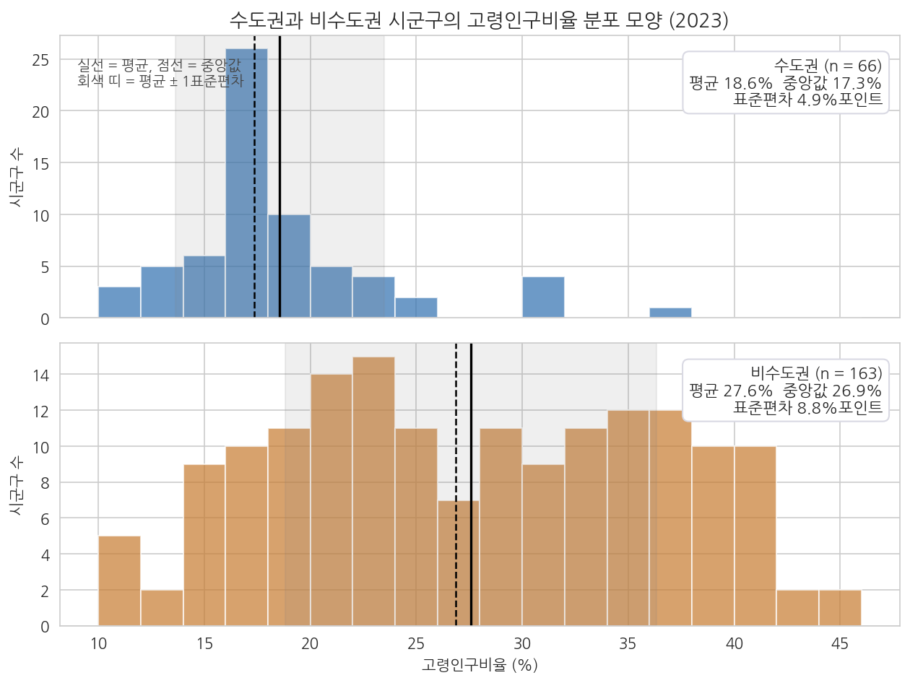
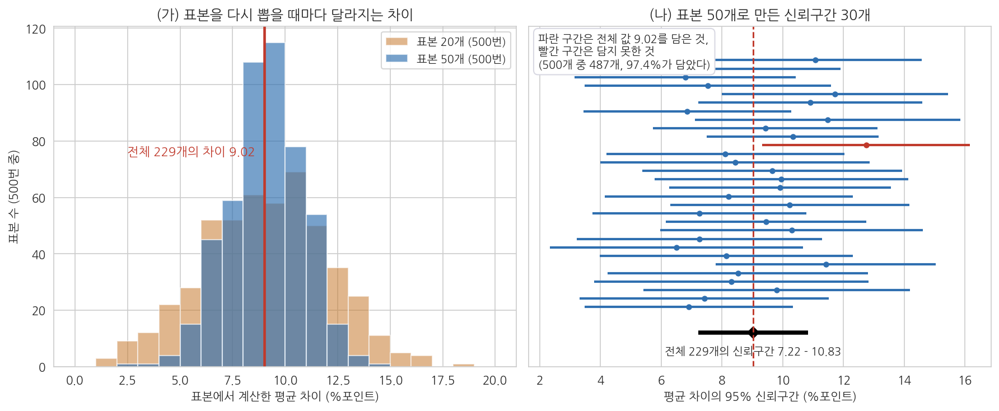
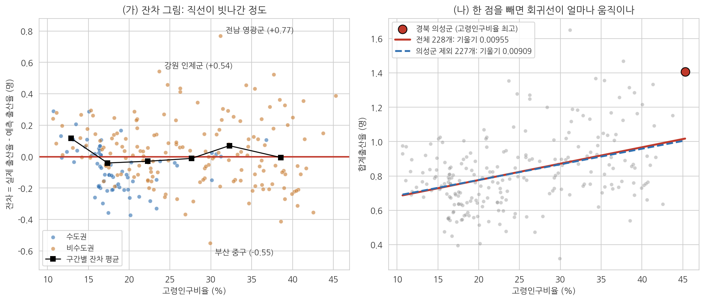

# 10주차 2회차. 에이전트로 통계 분석하기

## 이 실습에서 하는 것

1회차에서 t검정, 회귀, p값, 그리고 상관과 인과의 구분을 원리로 배웠다. 이번 실습에서는 그 도구들을 에이전트에게 실행시키고, 나온 결과표를 읽고, 에이전트가 쓴 해석문에서 과잉해석을 잡아내고, 최종적으로 정책 문장으로 번역한다. 계산은 전부 에이전트가 한다. 여러분이 훈련하는 것은 결과표를 읽는 눈과 해석의 선을 지키는 감각이다.

순서는 분석가가 실제로 일하는 순서를 따른다. 검정을 돌리기 전에 데이터의 생김새부터 확인하고(2.1), 두 집단을 비교하고(2.2), 그 차이가 얼마나 큰지를 p값과 나란히 읽고(2.3), 같은 절차를 다른 변수로 반복한 뒤(2.4) 표본을 줄이면 결과가 어떻게 흐려지는지 실험하고(2.5), 회귀를 돌린 뒤(2.6) 직선이 데이터에 잘 맞는지와 한두 지역이 결과를 흔들지 않는지 진단하고(2.7), 에이전트의 해석문을 심사하고(2.8), 해석문 두 버전을 견주고(2.9), 새 대화에서 숫자를 독립적으로 검산한 다음(2.10), 정책 문장으로 옮긴다(2.11). 마지막 선택 심화(2.12)에서는 통제변수 하나를 넣으면 결과가 어떻게 달라지는지 본다.

이 실습이 끝나면 다음이 만들어져 있어야 한다.

- 두 집단의 분포 모양과 흩어짐을 비교한 표와 그림 (분석 전 가정 확인)
- 수도권 vs 비수도권 고령인구비율 비교(t검정) 결과표와 그 해석, 그리고 평균 차이의 신뢰구간과 효과 크기
- 같은 비교 절차를 네 변수(고령인구비율, 합계출산율, 인구증가율, 유소년인구비율)로 반복한 결과표와, p값이 아니라 효과 크기로 읽은 요약
- 무작위 표본 50개와 20개로 같은 검정을 다시 돌려 신뢰구간이 얼마나 넓어지는지 확인한 표 두 개와 그림 하나
- 고령인구비율과 합계출산율의 회귀 결과(계수, R제곱)와 산점도 그림, 잔차 그림, 한 지역을 빼고 다시 돌린 비교표
- 에이전트의 과잉해석을 잡아 교정한 기록
- 같은 결과를 신중형과 과장형으로 쓴 두 문단, 그리고 과장형에서 짚어 낸 문제 표현의 목록
- 새 대화에서 결과표의 숫자 네 개를 원자료로부터 다시 계산한 독립 검산
- 위 결과를 정책 보고서의 언어로 옮긴 사실·해석·제언 세 층의 정리

특히 이번 실습에는 "에이전트가 통계적으로 맞는 계산을 해 놓고 해석에서 틀리는" 장면이 등장한다. 9주차까지의 검증이 주로 숫자의 검증이었다면, 이번 주부터는 문장의 검증이 더해진다. 에이전트가 틀리는 장면은 모두 네 번 나온다. 계산은 맞는데 상관을 인과로 서술하는 장면(2.8), p값을 "차이가 있을 확률"로 뒤집어 설명하는 장면(2.5), 결과표에서 빠져서는 안 될 관측치 수가 빠진 장면(2.12), 그리고 두 숫자가 서로 다른데 어느 쪽도 틀리지 않은 장면(2.10)이다. 마지막 것은 엄밀히 말해 틀린 것이 아니라 우리 지시가 모호했던 경우인데, 실무에서 가장 자주 시간을 잡아먹는 종류라 함께 다룬다.

## 준비물

| 구분 | 내용 |
|------|------|
| 데이터 | `data/sigungu_2023.csv` (전국 229개 시군구 인구 지표, 출처: 행정안전부 주민등록인구통계·국가데이터처(옛 통계청) 인구동향조사, KOSIS에서 수집) |
| 도구 | VSCode + Claude Code, 3주차에 구축한 uv 기반 Python 환경 (pandas, scipy, matplotlib, seaborn, koreanize-matplotlib 사용) |
| 참고 코드 | `code/ch09_analysis.py` (t검정과 회귀의 기준 결과), `code/ch10_practice.py` (가정 확인, 신뢰구간과 효과 크기, 변수 반복, 표본 크기 실험, 잔차와 영향력, 독립 검산, 통제변수 회귀. 막힐 때 참조), `code/fig10_practice.py` (그림 10-5부터 10-7까지의 생성 코드) |
| 선수 내용 | 10주차 1회차(t검정·회귀·p값·교란요인), 9주차 실습(EDA와 그림 읽기), 7주차 실습(결측 확인, 파생변수 만들기), 3주차(재현성과 uv 환경), 2주차(검증 손잡이, 같은 대화 재검산과 새 대화 독립 검산, 지시문 라이브러리) |

## 2.1 분석 전 가정 확인: 두 집단의 분포 모양과 흩어짐 보기

**무엇을 왜 하는가.** 체중계에 올라가기 전에 체중계가 평평한 바닥에 놓였는지 보듯, 검정을 돌리기 전에 데이터의 생김새를 본다. t검정은 두 가지를 전제로 설계된 도구다. 각 집단의 값이 대체로 종 모양(가운데가 볼록하고 양쪽으로 갈수록 드물어지는 모양)으로 퍼져 있다는 것과, 두 집단의 흩어짐이 엇비슷하다는 것이다. 앞의 전제를 정규성, 뒤의 전제를 등분산이라 부른다. 두 전제가 딱 들어맞는 데이터는 현실에 드물고, 관측치가 수십 개를 넘으면 모양이 좀 어긋나도 평균 비교는 꽤 견고하게 작동한다. 그래도 확인하는 이유는 두 가지다. 어느 방식의 t검정을 쓸지(흩어짐이 다르면 Welch 방식)를 근거를 갖고 정하기 위해서, 그리고 그림에서 예상 밖의 덩어리나 외딴 값이 보이면 검정보다 데이터 문제를 먼저 의심하기 위해서다. 9주차의 EDA를 통계 분석 직전에 한 번 더, 이번에는 비교할 두 집단에 초점을 맞춰 반복하는 셈이다.

<div style="border:1px solid #cfe3d4;border-left:5px solid #2f8f4e;background:#f4fbf6;padding:12px 16px;margin:18px 0;border-radius:4px;">
<strong>지시문 예시</strong><br>
"data 폴더의 sigungu_2023.csv를 읽고, 시도가 서울·경기·인천이면 수도권, 나머지는 전부 비수도권으로 나눈 뒤 고령인구비율의 분포를 집단별로 비교해 줘. (1) 집단별로 시군구 수, 최솟값, 1사분위수, 중앙값, 3사분위수, 최댓값, 표준편차, 왜도를 한 표로 정리하고, (2) 두 집단의 히스토그램을 위아래로 나란히 그려 평균과 중앙값 위치를 선으로 표시한 그림을 figures 폴더에 저장해 줘(한글 폰트는 koreanize_matplotlib). (3) 두 집단의 분산이 몇 배 차이 나는지 계산하고, 정규성과 등분산을 확인하는 검정을 하나씩만 실행해서 p값을 보고해 줘. 검정 결과만 말하지 말고, 표와 그림에서 보이는 모양을 세 문장으로 설명해 줘. 코드는 code 폴더에 저장해 줘."
</div>

**예상되는 에이전트의 행동과 결과.** 에이전트가 파일을 읽어 열 이름을 확인하고, 집단을 나누어 요약 표를 만들고 그림을 그리는 코드를 작성해 승인을 구한 뒤 실행한다. 정규성 검정으로는 샤피로-윌크(Shapiro-Wilk) 검정을, 등분산 검정으로는 레빈(Levene) 검정을 고를 가능성이 높다. 검정의 이름은 여기서 한 번 보고 지나가면 된다. 앞으로 결과표에서 이 이름들을 만나면 "정규성 검정", "등분산 검정"으로 읽으면 충분하다. 화면에는 대략 다음과 같은 출력이 보인다.

```
[분포 요약]  수도권  n=66   평균 18.56  표준편차 4.93  왜도 1.57
             비수도권 n=163  평균 27.58  표준편차 8.77  왜도 0.03
분산 비(비수도권/수도권) = 3.17
정규성 검정 p값: 수도권 0.001 미만, 비수도권 0.001
등분산 검정 p값: 1.5e-11
그림 저장: figures/assumption_check.png
```

에이전트가 요약해 주기 전에 scipy가 뱉은 원래 출력을 보여 달라고 하면 다음과 같은 줄이 나온다. 처음 보면 낯설지만 읽는 법은 간단하다. 괄호 안에 이름표가 붙은 값이 나열되어 있고, 우리에게 필요한 것은 그중 `pvalue` 하나다.

```
>>> stats.shapiro(수도권)
ShapiroResult(statistic=0.8584, pvalue=2.219e-06)
>>> stats.shapiro(비수도권)
ShapiroResult(statistic=0.9662, pvalue=0.0005152)
>>> stats.levene(수도권, 비수도권, center="median")
LeveneResult(statistic=50.5549, pvalue=1.4926e-11)
```

`statistic`은 검정이 계산한 통계량, `pvalue`가 p값이다. 세 줄 모두 p값이 0.05보다 작다. 정규성 검정 두 개는 "두 집단 다 완전한 종 모양은 아니다"라고 말하고, 등분산 검정은 "두 집단의 흩어짐이 같다고 보기 어렵다"라고 말한다. 앞의 둘은 아래 유의 박스에서 보듯 t검정을 포기할 이유가 되지 못하지만, 뒤의 하나는 방법 선택(Welch)의 근거가 된다. 같은 "p값 0.05 미만"이라도 결정에 쓰이는 무게가 다르다는 것을 여기서 한 번 짚고 간다.

요약 표는 표 10-1과 같은 값이어야 한다.

**표 10-1. 수도권과 비수도권 고령인구비율의 분포 요약 (기준 결과)**

| 항목 | 수도권 | 비수도권 |
|------|-----:|-----:|
| 시군구 수 | 66 | 163 |
| 최솟값 (%) | 10.69 | 10.68 |
| 1사분위수 (%) | 16.28 | 20.76 |
| 중앙값 (%) | 17.34 | 26.86 |
| 3사분위수 (%) | 19.84 | 35.30 |
| 최댓값 (%) | 36.81 | 45.28 |
| 표준편차 (%포인트) | 4.93 | 8.77 |
| 왜도 | 1.57 | 0.03 |

왜도는 분포가 한쪽으로 치우친 정도를 나타내는 수로, 0이면 좌우 대칭이고 양수면 오른쪽으로 긴 꼬리가 있다는 뜻이다. 표를 읽는 요령은 두 집단의 같은 행을 가로로 견주는 것이다. 최솟값은 거의 같은데(10.7%) 최댓값은 9%포인트 가까이 다르고, 1사분위수와 3사분위수 사이의 폭이 수도권은 3.6%포인트, 비수도권은 14.5%포인트다. 비수도권 시군구 절반이 20.8%에서 35.3% 사이에 넓게 깔려 있다는 뜻이다.



그림 10-5를 읽어 보자. 위가 수도권, 아래가 비수도권이고, 막대의 높이는 그 구간에 든 시군구의 수다. 실선이 평균, 점선이 중앙값, 회색 띠가 평균에서 표준편차만큼 좌우로 벌린 범위다. 위 패널에서 눈에 띄는 것은 16-18% 구간에 26개가 몰린 뾰족한 봉우리와 오른쪽으로 길게 늘어진 꼬리다. 30%를 넘는 수도권 시군구는 가평군, 양평군, 연천군, 강화군, 옹진군의 5곳뿐인데, 이 꼬리가 왜도 1.57을 만들고 평균(18.6%)을 중앙값(17.3%)보다 오른쪽으로 끌어당긴다. 아래 패널은 정반대다. 봉우리가 뚜렷하지 않고 10%대부터 45%까지 평평하게 깔려 있으며, 30%를 넘는 곳이 68곳, 40%를 넘는 곳도 14곳이다. 왜도 0.03으로 좌우는 대칭에 가깝지만 종 모양이라 하기는 어렵다. 회색 띠의 폭을 비교하면 위는 좌우 4.9, 아래는 8.8으로 1.8배 차이가 나고, 이를 제곱한 분산으로는 3.2배 차이다.

여기서 알 수 있는 것은 세 가지다. 첫째, 두 집단의 흩어짐이 뚜렷이 다르므로 등분산을 가정하는 t검정은 맞지 않고, 2.2에서 쓸 Welch 방식이 옳은 선택이다. 등분산 검정의 p값(소수점 아래 0이 10개)이 같은 말을 숫자로 해 준다. 둘째, 두 집단 다 교과서적인 종 모양은 아니지만 66개와 163개라는 관측치 수가 있으므로 평균 비교 자체는 안심하고 진행해도 된다. 셋째, 외딴 덩어리나 상식 밖의 값(음수, 100% 초과)은 없다. 데이터 문제로 되돌아갈 이유는 없다는 뜻이다.

<div style="border:1px solid #ecd9c6;border-left:5px solid #c77b2f;background:#fdf9f4;padding:12px 16px;margin:18px 0;border-radius:4px;">
<strong>유의 · 가정 확인의 목적은 검정 통과가 아니라 방법 선택이다</strong><br>
정규성 검정은 관측치가 많을수록 사소한 어긋남도 p값 0.05 아래로 잡아낸다. 우리 데이터도 두 집단 모두 정규성 검정의 p값이 0.001 이하다. 그렇다고 t검정을 버려야 하는 것은 아니다. 관측치가 수십 개 이상이면 평균 비교는 모양의 어긋남에 견고하기 때문이다. 가정 확인에서 정말 결정에 영향을 주는 것은 그림에서 읽는 모양과 흩어짐의 차이이고, 그것이 방법(Welch)의 선택과 보고서의 방법 서술로 이어진다. 검정의 p값은 그 판단을 뒷받침하는 참고 수치다.
</div>

**검증.** 세 가지를 확인한다. 첫째, 표 10-1의 시군구 수가 66과 163이고 합이 229인지 본다. 둘째, 표와 그림이 같은 데이터에서 나왔는지 중앙값 하나로 대조한다. 그림 10-5의 점선이 위 패널에서는 17과 18 사이, 아래 패널에서는 27 근처에 서 있는지 눈으로 확인하고, 표의 중앙값(17.34, 26.86)과 맞는지 본다. 어긋나면 표와 그림 중 하나가 다른 조건(예: 결측 처리, 집단 정의)으로 만들어진 것이다. 셋째, 에이전트가 덧붙인 세 문장 설명을 심사한다. "정규성 검정에서 p값이 0.05보다 작으므로 t검정을 사용할 수 없습니다"처럼 검정 p값 하나로 방법을 결정해 버리는 문장이 있으면, 위 유의 박스의 내용을 근거로 "관측치가 66개와 163개이므로 평균 비교는 진행하되, 흩어짐이 다르니 Welch 방식을 쓴다는 문장으로 고쳐 줘"라고 재지시한다.

## 2.2 집단 비교 실행과 결과표 읽기: 수도권 vs 비수도권

**무엇을 왜 하는가.** 이제 1회차 1.3절에서 본 비교를 여러분의 손으로 재현한다. 9주차 EDA에서 눈으로 보았던 수도권과 비수도권의 차이를, 이번에는 검정의 형식으로 확정한다. 지시문에서 눈여겨볼 것은 두 가지다. 수도권의 정의를 우리가 직접 명시한다는 것(에이전트에게 맡기면 세종이나 충청권을 어떻게 다룰지 제멋대로 정할 수 있다), 그리고 검정만이 아니라 기술통계(평균·표준편차·개수)를 함께 요구한다는 것이다. 1회차에서 배웠듯 p값만 있는 결과는 반쪽짜리이기 때문이다. 2.1에서 확인한 대로 두 집단의 흩어짐이 다르므로 Welch 방식을 지시문에 못 박는다.

<div style="border:1px solid #cfe3d4;border-left:5px solid #2f8f4e;background:#f4fbf6;padding:12px 16px;margin:18px 0;border-radius:4px;">
<strong>지시문 예시</strong><br>
"data 폴더의 sigungu_2023.csv를 읽고 시군구를 두 집단으로 나눠 줘. 시도가 서울·경기·인천이면 수도권, 나머지는 전부 비수도권이야. 두 집단의 고령인구비율에 대해 (1) 집단별 시군구 수, 평균, 표준편차, 중앙값을 표로 정리하고, (2) 두 집단의 평균 차이를 계산하고, (3) scipy로 등분산을 가정하지 않는 Welch t검정을 실행해서 t값과 p값을 보고해 줘. 계산 코드는 code 폴더에 저장하고, 각 집단에 어떤 시도가 몇 개씩 들어갔는지도 함께 출력해 줘."
</div>

**예상되는 에이전트의 행동과 결과.** 파일을 읽고, pandas로 집단을 나누고, scipy의 t검정 함수를 실행하는 코드를 만들어 승인을 요청한 뒤, 결과를 표로 보고한다. 화면에는 대략 다음과 같은 출력이 보인다.

```
수도권 시도 구성: 경기 31, 서울 25, 인천 10  (합 66)
비수도권: 나머지 14개 시도, 163개 시군구
수도권:   n=66,  평균=18.56, 표준편차=4.93, 중앙값=17.34
비수도권: n=163, 평균=27.58, 표준편차=8.77, 중앙값=26.86
평균 차이(비수도권 - 수도권) = 9.02 %포인트
Welch t검정: t = 9.85, p = 5.79e-19
```

결과는 표 10-2와 같은 값이어야 한다.

**표 10-2. 수도권 vs 비수도권 고령인구비율 비교 (기준 결과)**

| 항목 | 수도권 | 비수도권 |
|------|-----:|-----:|
| 시군구 수 | 66 | 163 |
| 평균 (%) | 18.56 | 27.58 |
| 표준편차 (%포인트) | 4.93 | 8.77 |
| 중앙값 (%) | 17.34 | 26.86 |

평균 차이 9.02%포인트, Welch t검정 결과 t = 9.85, p값은 0.05보다 비교도 안 되게 작다(소수점 아래 0이 18개). 화면의 p값이 `5.79e-19`처럼 보일 텐데, 이는 "10을 19번 나눈 크기"라는 과학적 표기법으로, 사실상 0에 가까운 수라는 뜻이다.

여기서도 scipy의 원래 출력을 한 번 보고 가자. 에이전트에게 "검정 함수가 돌려준 값을 그대로 보여 줘"라고 하면 다음 한 줄이 나온다.

```
>>> stats.ttest_ind(비수도권, 수도권, equal_var=False)
TtestResult(statistic=9.8467, pvalue=5.7909e-19, df=204.014)
```

세 값이 들어 있다. `statistic`이 t값 9.85, `pvalue`가 p값, `df`가 자유도(degrees of freedom) 204.014다. 자유도는 검정이 판정에 쓴 정보의 양을 나타내는 수로, 관측치가 229개인데 204로 나온 것은 Welch 방식이 두 집단의 흩어짐이 다른 것을 보정하면서 정보의 양을 조금 깎았기 때문이다. 자유도를 정확히 이해할 필요는 없지만, 2.3에서 신뢰구간을 계산할 때 이 204라는 숫자가 다시 나오므로 여기서 나왔다는 것만 기억해 두자. 참고로 흩어짐이 같다고 가정하는 보통의 t검정(Student 방식)을 돌리면 같은 데이터에서 t = 7.86, 자유도 227이 나온다. 결론은 같지만 숫자가 다르므로, 보고서에는 어느 방식을 썼는지 반드시 적는다.

**결과표 읽는 순서.** 결과를 받으면 다음 순서로 읽는 습관을 들이자. ① 각 집단의 개수(n)부터 본다. 66 + 163 = 229로 전체와 맞는가. ② 평균 차이의 크기와 방향을 본다(비수도권이 9%포인트 높다). ③ 그다음에야 t와 p를 본다(이 차이는 우연으로 보기 어렵다). p값부터 보는 습관은 크기를 잊게 만든다.

**검증.** 세 가지를 확인한다. 첫째, 집단 분류다. 에이전트가 출력한 시도 목록에서 수도권에 서울·경기·인천만 들어 있는지, 세종·충남 같은 지역이 슬쩍 들어가지 않았는지 본다. 둘째, 개수의 합이 229인지 본다. 셋째, 평균 하나를 교차 확인한다. 에이전트에게 "방금과 다른 방법으로(예: 피벗테이블로) 집단별 평균을 다시 계산해서 아까 값과 일치하는지 보여 줘"라고 시키면, 같은 값이 두 경로에서 나오는지 확인할 수 있다. 7주차에서 배운 표본 대조의 통계 버전이자, 2주차에서 배운 같은 대화 재검산이다. 새 대화에서 하는 독립 검산은 2.10에서 따로 한다.

## 2.3 차이의 크기 읽기: 신뢰구간과 효과 크기를 p값 옆에 놓기

**무엇을 왜 하는가.** 1회차 1.5절에서 p값은 차이의 크기가 아니라고 배웠다. 그렇다면 크기는 무엇으로 말하는가. 평균 차이 9.02%포인트가 첫 번째 답이지만, 여기에 두 숫자를 더 붙이면 결과표가 훨씬 정직해진다. 하나는 평균 차이의 95% 신뢰구간이다. 1회차 1.2절의 여론조사 오차범위처럼, "2023년을 다시 살게 한다면 두 집단의 차이는 대략 어느 범위에 들 것인가"를 알려 준다. 다른 하나는 효과 크기(effect size)다. 같은 5점 차이도 10점 만점 시험과 100점 만점 시험에서 무게가 다르듯, 평균 차이를 그 변수의 흩어짐이라는 자로 다시 잰 값이다. 1회차 1.3절 마지막 문단에서 "출산율 0.187명 차이는 결코 작지 않다"고 했던 판단을 숫자로 만드는 도구다.

<div style="border:1px solid #cfe3d4;border-left:5px solid #2f8f4e;background:#f4fbf6;padding:12px 16px;margin:18px 0;border-radius:4px;">
<strong>지시문 예시</strong><br>
"2.2의 t검정 결과에 두 가지를 덧붙여 줘. (1) 수도권과 비수도권 고령인구비율 평균 차이의 95% 신뢰구간을 Welch 방식의 표준오차와 자유도로 계산하고, 계산에 쓴 표준오차, 자유도, t임계값을 함께 보고해 줘. (2) 효과 크기로 Cohen의 d를 계산하되, 분모로 쓴 합동 표준편차가 얼마인지 보여 주고, d가 '평균 차이가 집단 안 흩어짐의 몇 배인가'를 뜻한다는 설명을 한 문장 붙여 줘. (3) 같은 계산을 합계출산율에 대해서도 해서 두 변수를 한 표에 나란히 놓아 줘. 결측이 있으면 몇 개를 뺐는지 밝혀 줘."
</div>

**예상되는 에이전트의 행동과 결과.** 에이전트가 2.2의 코드에 계산을 덧붙여 실행하고, 표 10-3과 같은 표를 보고한다.

**표 10-3. 두 집단 차이의 크기: 신뢰구간과 효과 크기 (기준 결과)**

| 항목 | 고령인구비율 | 합계출산율 |
|------|-----:|-----:|
| 시군구 수 (수도권 / 비수도권) | 66 / 163 | 66 / 162 |
| 평균 차이 (비수도권 - 수도권) | 9.02 %포인트 | 0.187명 |
| 95% 신뢰구간 | 7.22 - 10.83 %포인트 | 0.138 - 0.235명 |
| t값 (Welch) | 9.85 | 7.58 |
| 합동 표준편차 | 7.86 %포인트 | 0.196명 |
| 효과 크기 d | 1.15 | 0.95 |

신뢰구간이 어떻게 나오는지는 1회차 1.3절의 숫자를 그대로 이어 쓰면 된다.

```
1단계. 평균 차이 = 27.58 - 18.56 = 9.02 (%포인트)
2단계. 우연한 출렁임의 기준 크기(표준오차) = 0.916, 자유도 약 204,
       그 자유도에서 95%에 해당하는 t임계값 = 1.972
3단계. 오차 한계 = 1.972 x 0.916 = 약 1.81
4단계. 신뢰구간 = 9.02 - 1.81 에서 9.02 + 1.81 = 약 7.2 에서 10.8 (%포인트)
```

읽는 법은 이렇다. 관찰된 차이는 9.02%포인트이지만, 우연의 출렁임을 감안하면 진짜 차이는 대략 7%포인트에서 11%포인트 사이 어디쯤이다. 구간 안에 0이 없다는 것은 p값이 0.05보다 작다는 것과 같은 말인데, 신뢰구간은 거기에 더해 차이가 아무리 작게 잡아도 7%포인트는 된다는 크기 정보를 준다. 효과 크기 d는 평균 차이 9.02를 합동 표준편차 7.86으로 나눈 1.15다. 두 집단의 평균이 집단 안 흩어짐의 1.15배만큼 떨어져 있다는 뜻이다. 관례상 d가 0.2면 작은 차이, 0.5면 중간, 0.8이면 큰 차이로 부르므로 1.15는 큰 차이에 속한다. 합계출산율 쪽도 보자. 0.187명은 절대 숫자로는 작아 보이지만 d는 0.95로 역시 큰 차이다. 과제 10-B의 질문("출산율 차이는 고령화 차이보다 작은 차이인가")에 대한 답이 이 표에 들어 있다. 두 변수는 단위가 달라 평균 차이로는 비교할 수 없지만, 흩어짐의 자로 재면 비슷한 급의 차이다.

**에이전트가 틀리는 장면.** 표는 정확한데 에이전트가 표 아래에 덧붙이는 해설에서 선을 넘는 일이 있다. 예를 들어 다음과 같은 문장이 돌아왔다고 하자.

> "효과 크기 d = 1.15는 매우 큰 값으로, 수도권 여부가 시군구 고령화 수준을 결정하는 핵심 원인임을 확인할 수 있다."

크다는 것과 원인이라는 것은 다른 이야기다. d는 두 집단의 평균이 얼마나 떨어져 있는지를 잴 뿐, 무엇이 그 간격을 만들었는지는 말해 주지 않는다. 수도권 여부가 고령화를 만든 것이 아니라 청년층의 이동 같은 배경이 두 가지 모두를 갈라놓았을 수 있다는 것을 1회차 1.6절에서 배웠다. 발견하는 방법은 단어 사냥이다. "원인", "결정", "확인"이 결과 해설에 보이면 멈춘다. 그리고 재지시한다. "효과 크기는 차이의 크기이지 원인의 증거가 아니야. '원인', '결정한다'를 빼고, 수도권과 비수도권 시군구의 고령인구비율 평균이 집단 안 흩어짐의 약 1.15배만큼 떨어져 있다는 사실만 서술해 줘." 수정된 문장은 "두 집단의 고령인구비율 평균 차이는 집단 안 흩어짐의 약 1.15배로, 관례상 큰 차이에 해당한다" 정도가 되어야 한다.

**검증.** 세 가지를 손으로 확인한다. 첫째, 신뢰구간의 한가운데에 평균 차이가 놓이는가. 7.22와 10.83의 중간은 9.02다. 어긋나면 구간이 다른 차이(예: 수도권에서 비수도권을 뺀 값)로 계산된 것이다. 둘째, d를 직접 나눠 본다. 9.02 나누기 7.86은 1.15다. 합동 표준편차가 두 집단의 표준편차(4.93, 8.77) 사이에 있는지도 본다. 사이를 벗어나면 분모가 잘못 계산된 것이다. 셋째, 해설 문장에서 "원인", "결정", "효과가 있다"를 찾는다. 하나라도 있으면 위와 같이 재지시한다.

## 2.4 같은 절차를 다른 변수로 반복하기: 인구증가율과 유소년인구비율

**무엇을 왜 하는가.** 분석 실무의 대부분은 새 방법을 배우는 일이 아니라 익힌 절차를 다른 변수에 반복하는 일이다. 2.1부터 2.3까지 만든 절차, 곧 분포를 확인하고 Welch t검정을 돌린 뒤 신뢰구간과 효과 크기를 붙이는 절차를 이번에는 두 변수에 그대로 적용한다. 반복하는 이유는 두 가지다. 첫째, 지시문을 통째로 새로 쓰지 않고 변수 이름만 갈아 끼우면 된다는 것을 확인하기 위해서다. 그것을 확인하고 나면 앞으로 어떤 변수를 만나도 같은 틀로 접근할 수 있다. 둘째, 이쪽이 더 중요한데, 이번 두 변수에서는 2.3에서 배운 "p값과 크기를 나란히 읽기"가 실제로 판단을 갈라놓는다. 고령인구비율은 p값의 소수점 아래 0이 18개였고 효과 크기도 1.15로 컸다. 새 변수 둘은 p값이 0.05보다 작기는 하지만 크기가 그만 못하다. 네 결과를 한 표에 놓고 "모두 유의하다"고 한 줄로 요약해 버리면 무엇이 사라지는지 눈으로 보게 될 것이다. 한 가지가 더 있다. 유소년인구비율은 데이터에 없는 열이라 에이전트가 유소년 인구와 총인구로 직접 만들어야 한다. 7주차에서 배운 파생변수 만들기가 검증할 항목으로 하나 늘어나는 셈이다.

<div style="border:1px solid #cfe3d4;border-left:5px solid #2f8f4e;background:#f4fbf6;padding:12px 16px;margin:18px 0;border-radius:4px;">
<strong>지시문 예시</strong><br>
"data 폴더의 sigungu_2023.csv에서 2.2와 2.3에서 한 것과 똑같은 절차를 두 변수에 대해 반복해 줘. (1) 먼저 유소년인구비율이라는 열을 유소년 인구를 총인구로 나눈 뒤 100을 곱해 만들고, 만든 식과 함께 강릉시의 값을 계산 과정까지 보여 줘. (2) 인구증가율과 유소년인구비율 각각에 대해 수도권과 비수도권의 시군구 수, 평균, 표준편차, 평균 차이, Welch t값, p값, 95% 신뢰구간, 효과 크기 d를 계산해 줘. (3) 앞서 계산한 고령인구비율과 합계출산율까지 네 변수를 한 표에 나란히 놓고, 변수마다 결측이 몇 개인지도 표에 넣어 줘. (4) 표를 보고 네 변수의 p값과 효과 크기를 견주어 세 문장으로 설명하되, '모두 유의하다'로 뭉뚱그리지 말고 변수마다 다른 점을 말해 줘. 코드는 code 폴더에 저장해 줘."
</div>

**예상되는 에이전트의 행동과 결과.** 에이전트가 파생변수를 먼저 만들고, 2.3의 계산을 함수 하나로 묶어 네 변수에 반복해서 적용한다. 화면에는 대략 다음과 같은 출력이 보인다.

```
[파생변수] 유소년인구비율 = 유소년 / 총인구 x 100
  예: 강릉시 19,863 / 211,381 x 100 = 9.3968 (%)
[반복 결과] 차이는 모두 (비수도권 - 수도권)
변수            n(수도권/비수도권)    차이      95% 신뢰구간         t       p         d
고령인구비율        66 / 163       +9.023   [ 7.216, 10.829]    9.85   5.79e-19  +1.15
합계출산율         66 / 162       +0.187   [ 0.138,  0.235]    7.58   1.99e-12  +0.95
인구증가율         66 / 163       -0.715   [-1.284, -0.145]   -2.49   1.45e-02  -0.42
유소년인구비율       66 / 163       -1.115   [-1.877, -0.352]   -2.89   4.51e-03  -0.41
결측: 합계출산율 1건(경북 군위군), 나머지 세 변수는 0건
```

결과는 표 10-4와 같은 값이어야 한다.

**표 10-4. 같은 절차를 네 변수로 반복한 결과 (기준 결과)**

| 항목 | 고령인구비율 | 합계출산율 | 인구증가율 | 유소년인구비율 |
|------|-----:|-----:|-----:|-----:|
| 시군구 수 (수도권 / 비수도권) | 66 / 163 | 66 / 162 | 66 / 163 | 66 / 163 |
| 수도권 평균 | 18.56 % | 0.690 명 | 0.03 % | 10.42 % |
| 비수도권 평균 | 27.58 % | 0.877 명 | -0.69 % | 9.31 % |
| 표준편차 (수도권 / 비수도권) | 4.93 / 8.77 | 0.147 / 0.213 | 2.12 / 1.53 | 2.57 / 2.82 |
| 차이 (비수도권 - 수도권) | +9.02 %포인트 | +0.187 명 | -0.71 %포인트 | -1.11 %포인트 |
| 95% 신뢰구간 (하한) | 7.22 | 0.138 | -1.28 | -1.88 |
| 95% 신뢰구간 (상한) | 10.83 | 0.235 | -0.14 | -0.35 |
| t값 (Welch) | 9.85 | 7.58 | -2.49 | -2.89 |
| p값 | 0.001 미만 | 0.001 미만 | 0.015 | 0.005 |
| 효과 크기 d | 1.15 | 0.95 | -0.42 | -0.41 |

표는 세로로 한 열씩이 아니라 가로로 한 행씩 읽는다. p값 행만 보면 네 변수가 모두 0.05 아래이므로 "네 지표 모두 수도권과 비수도권 사이에 유의한 차이가 있다"는 한 문장으로 끝난다. 그런데 효과 크기 행을 보면 이야기가 둘로 갈라진다. 앞의 두 변수는 d가 1.15와 0.95로 관례상 큰 차이인 반면, 뒤의 두 변수는 절댓값이 0.42와 0.41로 중간(0.5)에도 못 미친다. 신뢰구간 행이 같은 말을 다른 방식으로 해 준다. 고령인구비율의 구간은 7.22에서 10.83으로 0에서 멀찍이 떨어져 있지만, 인구증가율의 구간은 0에 가까운 쪽 끝이 -0.14로 0에 거의 닿아 있다. 차이가 아무리 작게 잡아도 0.14%포인트는 된다는 뜻인데, 229개 시군구의 인구증가율이 -3.19%에서 +11.05% 사이에 퍼져 있고 그중 90%가 -2.24%에서 +2.55% 안에 든다는 점을 생각하면 이 하한은 "차이가 없는 것과 구별하기 어려운 크기"에 가깝다. 부호도 함께 읽어야 한다. 뒤의 두 변수는 차이가 음수, 곧 비수도권 쪽이 낮다. 비수도권 시군구는 인구가 평균적으로 줄고 있고(-0.69%), 유소년 비중도 낮다(9.31%로 수도권의 10.42%보다 1.11%포인트 낮다).

여기서 한 가지를 짚고 가야 한다. 표 안에 서로 어긋나 보이는 두 숫자가 있다. 비수도권은 합계출산율이 더 높은데(0.877명 대 0.690명) 유소년인구비율은 더 낮다(9.31% 대 10.42%). 어느 쪽이 틀린 것인가. 둘 다 맞다. 합계출산율은 여성 한 명이 평생 낳을 것으로 기대되는 아이 수이고, 유소년인구비율은 지금 그 지역에 사는 사람 중 유소년이 차지하는 몫이다. 아이를 낳을 나이의 인구 자체가 적으면 출산율이 높아도 태어나는 아이 수는 적고, 그 결과 유소년의 몫은 작아진다. 비율의 분모가 무엇인지를 확인하지 않으면 "출산율이 높은데 아이가 적다"는 문장을 모순으로 오해하게 된다. 2.10에서도 같은 종류의 사건을 한 번 더 만난다.

<div style="border:1px solid #ecd9c6;border-left:5px solid #c77b2f;background:#fdf9f4;padding:12px 16px;margin:18px 0;border-radius:4px;">
<strong>유의 · "유의하다"는 등급이 아니다</strong><br>
p값 0.015와 5.79e-19는 둘 다 "0.05보다 작다"는 같은 판정을 받는다. 뒤의 것이 소수점 아래로 열일곱 자리쯤 더 작지만, 그렇다고 차이가 그만큼 더 크다는 뜻은 아니다. p값은 크기를 재는 자가 아니기 때문이다. 반대로 p값이 0.015로 상대적으로 큰 인구증가율의 결과가 그래서 덜 중요하다는 뜻도 아니다. 중요한지 아닌지는 그 0.71%포인트가 정책적으로 무엇을 뜻하는지가 정한다. 표 10-4에서 크기를 말해 주는 칸은 차이, 신뢰구간, 효과 크기 세 개이고, p값 칸은 "우연으로 보기 어려운가"라는 예/아니오 판정 하나만 담고 있다. 보고서에 네 결과를 옮길 때는 "모두 유의했다"가 아니라 "고령인구비율과 합계출산율에서는 큰 차이가, 인구증가율과 유소년인구비율에서는 중간에 못 미치는 크기의 차이가 관찰되었다"처럼 크기를 함께 적는다.
</div>

**검증.** 네 가지를 확인한다. 첫째, 파생변수를 손으로 검산한다. VSCode에서 `data/sigungu_2023.csv`를 열어 강릉시 행의 유소년(19,863)과 총인구(211,381)를 눈으로 확인하고 나누어 본다. 19,863 나누기 211,381은 0.09397이고 100을 곱하면 9.40%다. 에이전트의 출력(9.3968)과 맞으면 파생 공식이 지시대로 적용된 것이다. 여기서 유소년 대신 생산가능인구를 쓰거나 총인구 대신 다른 열을 쓰는 실수가 종종 나온다. 둘째, 개수와 결측이다. 유소년인구비율은 결측이 없으므로 66과 163이어야 하고, 합계출산율만 162여야 한다. 네 변수의 관측치 수가 모두 같게 적혀 있다면 결측 처리가 빠진 것이다. 셋째, 부호의 방향이다. 에이전트에게 "인구증가율이 0보다 큰 시군구가 권역별로 몇 곳인지 세어 줘"라고 시키면 수도권 66곳 중 25곳(37.9%), 비수도권 163곳 중 28곳(17.2%)이 나온다. 표의 차이 부호가 음수(비수도권이 낮음)인 것과 같은 방향을 가리켜야 한다. 부호와 개수가 반대라면 두 집단을 빼는 순서가 뒤바뀐 것이다. 넷째, 요약 문장 심사다. "네 지표 모두 통계적으로 유의한 차이를 보였다"로 끝나는 문장이 있으면 유의 박스의 내용을 근거로 "변수마다 효과 크기가 얼마인지 밝히고, 크기가 큰 변수와 그렇지 않은 변수를 나누어 서술해 줘"라고 재지시한다.

## 2.5 표본을 줄이면 무엇이 달라지나: 229개에서 50개로

**무엇을 왜 하는가.** 1회차 1.5절에서 p값의 두 번째 오용, 곧 "유의하지 않음"을 "차이 없음의 증명"으로 읽는 잘못을 배웠다. 말로만 들으면 잘 와닿지 않는 이야기다. 그런데 우리는 전국 229개 시군구를 전부 갖고 있으므로 이것을 실험으로 직접 확인할 수 있다. 229개 중에서 무작위로 50개만 뽑아 2.2와 똑같은 검정을 돌려 보는 것이다. 수도권과 비수도권의 진짜 차이는 9.02%포인트로 그대로 있는데, 손에 든 관측치가 줄면 그 차이를 얼마나 흐릿하게 보게 되는지가 드러난다. 1회차 1.3절에서 우연한 출렁임이 관측치가 적을 때 커진다고 배운 그 문장을 숫자로 확인하는 단계이며, 동시에 여러분이 앞으로 만날 대부분의 자료(전수가 아니라 표본인 자료)에서 결과표를 어떻게 읽어야 하는지를 익히는 단계이기도 하다.

무작위가 끼어드는 실험에는 반드시 난수 시드(random seed)를 고정한다. 시드는 무작위 추출의 출발점을 정하는 숫자로, 같은 시드를 주면 몇 번을 돌려도 똑같은 표본이 뽑힌다. 3주차에서 배운 재현성을 무작위가 있는 자리에서 지키는 방법이다. 시드를 적어 두지 않으면 여러분의 결과와 옆 사람의 결과가 다르게 나오고, 그때는 무엇이 옳은지 가릴 방법이 없다.

<div style="border:1px solid #cfe3d4;border-left:5px solid #2f8f4e;background:#f4fbf6;padding:12px 16px;margin:18px 0;border-radius:4px;">
<strong>지시문 예시</strong><br>
"2.2의 고령인구비율 비교를 표본 크기를 바꿔 가며 다시 해 줘. (1) 229개에서 무작위로 50개를 뽑되 난수 시드는 2023으로 고정하고, 시드를 지정한 코드 줄을 화면에 그대로 보여 줘. (2) 그 50개로 2.2와 같은 Welch t검정을 하고 두 집단의 시군구 수, 평균 차이, 표준오차, t값, p값, 95% 신뢰구간과 그 폭, 효과 크기를 전체 229개의 결과와 한 표에 나란히 놓아 줘. (3) 같은 일을 20개 표본으로도 해 줘. (4) 표본 50개와 20개를 각각 500번씩 다시 뽑아, p값이 0.05보다 작게 나온 표본의 비율, p값의 중앙값, 신뢰구간 폭의 중앙값, 평균 차이의 최솟값과 최댓값을 표로 보고해 줘. (5) 500번의 평균 차이가 어떻게 흩어지는지 보여 주는 그림을 figures 폴더에 저장해 줘. 해석에서 p값을 '차이가 있을 확률'이라고 쓰지 마. 코드는 code 폴더에 저장해 줘."
</div>

**예상되는 에이전트의 행동과 결과.** 에이전트가 표본을 뽑는 코드에 시드를 넣고, 2.2의 검정 함수를 표본에 그대로 적용한 뒤, 500번 반복하는 반복문을 돌린다. 500번 반복도 몇 초면 끝난다. 화면에는 대략 다음과 같은 출력이 보인다.

```
표본 추출 코드: df.sample(n=50, random_state=2023)   # 시드 고정
[전체 229개] 수도권 66 / 비수도권 163  차이 9.02  표준오차 0.92  t = 9.85  p = 5.79e-19
             95% 신뢰구간 [ 7.22, 10.83]  폭 3.61  d = 1.15
[표본 50개 ] 수도권 16 / 비수도권 34   차이 7.86  표준오차 1.98  t = 3.97  p = 0.00025
             95% 신뢰구간 [ 3.88, 11.85]  폭 7.97  d = 1.01
[표본 20개 ] 수도권 5 / 비수도권 15    차이 8.95  표준오차 2.28  t = 3.92  p = 0.00100
             95% 신뢰구간 [ 4.15, 13.75]  폭 9.59  d = 1.28
[500번 반복] 50개: p < 0.05 비율 99.4%,  20개: p < 0.05 비율 72.8%
그림 저장: figures/sample_size.png
```

결과는 표 10-5, 표 10-6과 같은 값이어야 한다.

**표 10-5. 표본 크기에 따른 같은 검정의 결과 (고령인구비율, 난수 시드 2023)**

| 항목 | 전체 229개 | 무작위 50개 | 무작위 20개 |
|------|-----:|-----:|-----:|
| 시군구 수 (수도권 / 비수도권) | 66 / 163 | 16 / 34 | 5 / 15 |
| 평균 차이 (%포인트) | 9.02 | 7.86 | 8.95 |
| 표준오차 (%포인트) | 0.92 | 1.98 | 2.28 |
| 95% 신뢰구간 (하한) | 7.22 | 3.88 | 4.15 |
| 95% 신뢰구간 (상한) | 10.83 | 11.85 | 13.75 |
| 신뢰구간 폭 (%포인트) | 3.61 | 7.97 | 9.59 |
| t값 (Welch) | 9.85 | 3.97 | 3.92 |
| p값 | 5.79e-19 | 0.00025 | 0.00100 |
| 효과 크기 d | 1.15 | 1.01 | 1.28 |

**표 10-6. 같은 크기의 표본을 500번 다시 뽑았을 때 (고령인구비율)**

| 표본 크기 | p값이 0.05 미만인 비율 | p값 중앙값 | 신뢰구간 폭 중앙값 | 평균 차이의 최소 - 최대 |
|------|-----:|-----:|-----:|-----:|
| 229개 (전체) | 해당 없음 | 5.79e-19 | 3.61 %포인트 | 9.02 (하나뿐) |
| 50개 | 99.4% | 3.65e-05 | 7.80 %포인트 | 2.75 - 14.65 |
| 20개 | 72.8% | 8.74e-03 | 12.63 %포인트 | 1.35 - 18.58 |

표 10-5의 각 행을 왼쪽에서 오른쪽으로 읽어 보자. 평균 차이(9.02, 7.86, 8.95)는 크게 달라지지 않는다. 표본이 작아도 평균 차이는 대체로 제자리를 맴돈다. 반면 표준오차는 0.92에서 1.98, 2.28로 두 배 넘게 커지고, 그 결과 신뢰구간 폭이 3.61에서 7.97, 9.59로 벌어진다. t값은 9.85에서 4 근처로 떨어지고, p값은 소수점 아래 0이 18개 이어지던 것에서 두세 개로 줄어든다. 요컨대 표본을 줄여도 답은 비슷하게 나오되 그 답에 대한 자신감이 급격히 낮아진다. 20개 표본으로 얻은 "차이는 4.15%포인트에서 13.75%포인트 사이"라는 결론은 틀린 결론이 아니지만, 예산 배분에 쓰기에는 너무 헐렁하다.



그림 10-6을 읽어 보자. 왼쪽 (가)는 표본을 500번 다시 뽑아 매번 계산한 평균 차이를 히스토그램으로 쌓은 것이다. 가로축이 그 표본에서 계산된 평균 차이, 세로축이 그런 값이 나온 표본의 수이고, 파란 막대가 50개 표본, 주황 막대가 20개 표본이며, 빨간 세로선이 전체 229개로 계산한 9.02다. 두 히스토그램 모두 빨간 선 근처에서 가장 높지만, 주황 쪽이 훨씬 옆으로 퍼져 있다. 20개만 뽑으면 어떤 표본에서는 1.35%포인트, 어떤 표본에서는 18.58%포인트가 나온다는 뜻이다. 오른쪽 (나)는 50개 표본 중 처음 서른 개의 95% 신뢰구간을 가로 막대로 그린 것이다. 막대 하나가 표본 하나이고, 가운데 점이 그 표본의 평균 차이, 아래의 검은 굵은 막대가 전체 229개의 구간이다. 서른 개 중 스물아홉 개가 빨간 점선(9.02)을 가로지르고 하나만 비껴간다. 500개 전체로는 487개(97.4%)가 9.02를 담았다. 95% 신뢰구간이라는 이름이 무슨 뜻인지가 이 그림에 그대로 있다. 구간 하나하나는 맞을 수도 틀릴 수도 있지만, 이런 식으로 구간을 만들면 스무 번에 열아홉 번쯤은 진짜 값을 담는다는 것이다.

여기서 알 수 있는 것은 세 가지다. 첫째, 관측치 수는 답을 바꾸는 것이 아니라 답의 정밀도를 바꾼다. 둘째, 표 10-6의 20개 행을 보면 500번 중 27.2%에서는 p값이 0.05를 넘는다. 진짜 차이가 9.02%포인트로 분명히 있는데도 네 번에 한 번꼴로 "유의하지 않다"는 결과가 나온다는 뜻이다. 실제로 시드를 1로 두고 20개를 뽑으면 차이 4.34%포인트, t = 1.00, p = 0.353, 신뢰구간 -6.13에서 14.81이 나온다. 이 표본만 손에 쥔 분석가가 "차이가 없다"고 보고하면 그것은 틀린 보고다. 정확한 보고는 "이 자료로는 차이가 있다고 말할 근거가 부족하다"이며, 그 뒤에는 "구간이 -6.13에서 14.81로 매우 넓어 판단을 보류한다"가 따라와야 한다. 셋째, 그래서 결과표에서 관측치 수를 가장 먼저 보라고 하는 것이다(2.2의 읽는 순서 ①). n을 모르면 p값도 신뢰구간도 해석할 수 없다.

**에이전트가 틀리는 장면.** 이 단계에서 에이전트에게 결과 설명을 시키면 통계학에서 가장 흔한 오해가 문장으로 튀어나오는 것을 볼 수 있다. 예를 들어 다음과 같은 설명이 돌아왔다고 하자.

> "표본 20개에서도 p = 0.001로 매우 작게 나왔습니다. 즉 두 집단 사이에 차이가 있을 확률이 99.9%라는 뜻이며, 표본이 작아도 결론은 안전하다고 볼 수 있습니다."

첫째, 틀림. p값을 "차이가 있을 확률"로 뒤집어 읽었다. 1회차 1.5절의 정의를 다시 보자. p값은 "차이가 없다고 가정했을 때 우연만으로 이만한 차이가 관찰될 확률"이지, "차이가 있을 확률"이 아니다. 앞의 것은 차이가 없다는 가정 위에서 계산한 값이고, 뒤의 것은 차이가 있는지 없는지를 두고 매기는 확률이라 아예 다른 질문이다. 뒤따라 나온 "표본이 작아도 안전하다"는 문장도 틀렸다. 표 10-6이 보여 주듯 20개 표본은 500번 중 136번꼴로 유의성을 놓친다.

둘째, 발견. 단어 사냥으로 잡는다. 해설문에서 "차이가 있을 확률", "우연일 확률", "귀무가설이 참일 확률", "신뢰도 99.9%" 같은 표현을 찾는다. p값 뒤에 확률의 주어가 무엇인지를 물어 보면 대개 여기서 걸린다.

셋째, 재지시. "p값을 '차이가 있을 확률'로 설명했는데 이는 잘못이야. p값은 두 집단에 차이가 없다고 가정했을 때 우연만으로 관찰된 만큼의 차이가 나올 확률이야. (1) 그 정의에 맞게 문장을 고치고, (2) 표본 20개의 신뢰구간 폭(9.59%포인트)이 전체(3.61%포인트)보다 얼마나 넓은지를 근거로 '표본이 작아도 안전하다'는 문장을 다시 써 줘."

넷째, 수정. 고쳐진 문장은 "표본 20개에서도 p = 0.001로, 두 집단이 실제로 같다면 이만한 차이가 우연히 나올 가능성은 1,000번에 1번 정도다. 다만 신뢰구간이 4.15%포인트에서 13.75%포인트로 전체 자료의 두 배 넘게 넓어, 차이의 크기를 이 표본만으로 정밀하게 말하기는 어렵다" 정도가 되어야 한다.

**검증.** 네 가지를 확인한다. 첫째, 재현성이다. 에이전트에게 같은 지시를 한 번 더 실행시켜 표본 50개의 결과가 글자 그대로 같은지 본다. 값이 달라지면 시드가 실제로 고정되지 않은 것이며, 이 경우 표의 모든 숫자가 여러분의 것과 달라져 대조가 불가능해진다. 3주차의 재현성 확인을 무작위가 있는 코드에 적용한 것이다. 둘째, 개수의 합이다. 표본 50개의 16과 34를 더하면 50, 20개의 5와 15를 더하면 20이어야 한다. 셋째, 구간의 포함 관계다. 표본 50개의 신뢰구간(3.88에서 11.85)이 전체 229개의 값 9.02를 담고 있는지 본다. 담고 있지 않다면 그 표본이 운이 나빴거나(500번 중 13번은 실제로 그렇다) 계산이 틀린 것인데, 어느 쪽인지는 다른 시드로 두세 번 더 돌려 보면 갈린다. 넷째, 반복 계산을 실제로 했는지 확인한다. 표 10-6 같은 표는 지어내기 쉬운 표다. 에이전트에게 "500번 반복한 코드의 반복문 부분을 그대로 보여 주고, 500개의 p값을 담은 목록의 길이를 출력해 줘"라고 시켜 길이가 500인지 확인한다. 2주차에서 배운 검증 손잡이, 곧 근거의 위치를 보고하게 만드는 지시를 숫자 표에 적용한 것이다.

## 2.6 회귀분석 실행과 계수 해석

**무엇을 왜 하는가.** 이제 두 번째 도구, 회귀다. 1회차 1.4절의 분석을 재현하되, 이번에는 결측 처리까지 지시에 담는다. 합계출산율에는 결측이 하나 있다(7주차에서 확인한 경북 군위군이다). 결측을 어떻게 했는지 보고하게 만드는 것은, 에이전트가 조용히 데이터를 바꾸는 일을 막는 기본 안전장치다.

<div style="border:1px solid #cfe3d4;border-left:5px solid #2f8f4e;background:#f4fbf6;padding:12px 16px;margin:18px 0;border-radius:4px;">
<strong>지시문 예시</strong><br>
"같은 데이터에서 고령인구비율(가로축)과 합계출산율(세로축)의 관계를 분석해 줘. (1) 결측이 있으면 몇 개인지, 어느 시군구인지 보고하고 제외해. (2) 상관계수를 구하고, scipy로 단순회귀를 실행해서 절편, 기울기, 기울기의 p값, R제곱을 보고해 줘. (3) 산점도에 회귀선을 얹은 그림을 figures 폴더에 저장해 줘. 한글 폰트가 깨지지 않게 하고, 그림 안에 회귀식과 R제곱을 표시해 줘. (4) 기울기가 뜻하는 바를 '고령인구비율이 1%포인트 높은 시군구는...'으로 시작하는 한 문장으로 설명해 줘."
</div>

**예상되는 에이전트의 행동과 결과.** 결측 1개(군위군)를 보고하고 228개로 분석한 뒤, 대략 다음 값을 보고한다. 상관계수 0.393, 절편 0.585, 기울기 0.00955, 기울기의 p값은 매우 작음(소수점 아래 0이 9개), R제곱 0.154. 화면에는 대략 다음과 같은 출력이 보인다.

```
결측: 합계출산율 1개 (경북 군위군) 제외 -> 사용 관측치 228개
상관계수 r = 0.393
회귀식: 합계출산율 = 0.585 + 0.00955 x 고령인구비율
기울기의 표준오차 = 0.00149, p = 7.75e-10, R제곱 = 0.154
그림 저장: figures/reg_scatter.png
```

그림 파일에는 오른쪽 위로 느슨하게 흐르는 점 구름과 그것을 관통하는 회귀선이 보일 것이다. 회귀 함수가 돌려준 원래 출력도 한 번 보자. 값이 여섯 개나 들어 있어 복잡해 보이지만, 보고서에 옮겨 적는 것은 이 중 넷이다.

```
>>> stats.linregress(고령인구비율, 합계출산율)
LinregressResult(slope=0.0095524, intercept=0.5848461, rvalue=0.3929462,
                 pvalue=7.7527e-10, stderr=0.0014870, intercept_stderr=0.0392434)
```

`slope`가 기울기, `intercept`가 절편, `rvalue`가 상관계수다. R제곱은 따로 나오지 않고 `rvalue`를 제곱해서 얻는다(0.3929의 제곱은 0.1544다). `pvalue`는 기울기의 p값이고, `stderr`은 기울기의 표준오차다. 표준오차가 있으면 2.3에서 배운 방식으로 기울기에도 신뢰구간을 붙일 수 있다. 자유도 226에서 t임계값이 1.9705이므로 0.00955에서 1.9705 곱하기 0.00149만큼을 좌우로 벌리면 0.00662에서 0.01248이 된다. 구간 안에 0이 없다는 것이 p값이 작다는 것과 같은 말이며, 구간의 양 끝을 10%포인트로 환산하면 "고령인구비율이 10%포인트 높은 시군구의 출산율은 대략 0.07명에서 0.12명 높다"는 문장이 된다. 계수 하나만 적는 것보다 훨씬 정직한 보고다.

**계수 해석 연습.** 에이전트의 설명을 기다리기 전에 스스로 문장을 만들어 보라. 기울기 0.00955의 바른 해석은 "고령인구비율이 1%포인트 높은 시군구는 합계출산율이 평균적으로 약 0.01명 높은 경향이 있다"이다. 10%포인트 차이면 약 0.096명이다. R제곱 0.154는 "시군구 간 출산율 차이의 약 15%가 고령인구비율과 겹쳐서 설명되고, 85%는 이 직선 밖의 요인"이라는 뜻이다.

**검증.** 회귀 결과는 손으로 검산할 수 있는 드문 결과다. 회귀식에 숫자를 직접 넣어 보라.

```
고령인구비율 25%인 시군구의 예측 출산율
= 0.585 + 0.00955 x 25 = 0.585 + 0.239 = 0.824 (명)
```

이 값이 그림에서 가로축 25% 지점의 회귀선 높이와 눈대중으로 맞는지 확인한다(0.8과 0.85 사이). 다음으로 부호의 일관성을 본다. 상관계수(+0.393)와 기울기(+0.00955)의 부호가 같은가, 그림의 회귀선 방향(우상향)과 맞는가. 셋 중 하나라도 어긋나면 코드 어딘가에서 변수가 뒤바뀐 것이다. 마지막으로 관측치 수가 228인지(229가 아니라) 확인한다. 229로 보고되었다면 결측 처리가 지시대로 되지 않았다는 신호다.

## 2.7 회귀 진단: 잔차 그림 받아 보기와 한 점의 힘

**무엇을 왜 하는가.** 회귀선은 228개 점을 직선 하나로 요약한 것이다. 요약이 쓸 만한지는 두 질문으로 따진다. 직선이 데이터의 어느 구간에서 체계적으로 빗나가지 않는가, 그리고 한두 지역이 직선을 끌고 다니지 않는가. 첫 질문의 도구가 잔차(residual)다. 잔차는 실제값에서 예측값을 뺀 것으로, 예를 들어 전남 영광군의 합계출산율은 1.651명인데 회귀식이 예측한 값은 0.883명이므로 잔차는 +0.768명이다. 반 전체의 예상 점수와 실제 점수의 차이를 한 명씩 찍어 그린 그림을 떠올리면 된다. 예측이 쓸 만하다면 그 차이는 0 주위에 아무 패턴 없이 흩어져야 한다. 둘째 질문의 도구는 단순하다. 시군구를 하나씩 빼고 회귀를 다시 돌려 기울기가 얼마나 움직이는지 보는 것이다. 결과가 특정 지역 하나에 매달려 있다면 그 결과로 정책을 말하기 어렵다.

<div style="border:1px solid #cfe3d4;border-left:5px solid #2f8f4e;background:#f4fbf6;padding:12px 16px;margin:18px 0;border-radius:4px;">
<strong>지시문 예시</strong><br>
"2.6의 회귀 결과로 두 가지 진단을 해 줘. (1) 각 시군구의 잔차(실제 합계출산율 - 회귀식 예측값)를 계산해서, 가로축 고령인구비율, 세로축 잔차의 산점도를 그리고 0 위치에 가로선을 넣어 줘. 고령인구비율 5%포인트 구간별 잔차 평균도 점으로 이어 표시하고, 잔차 절댓값이 가장 큰 시군구 3곳에 이름을 붙여 줘. (2) 시군구를 하나씩 빼고 회귀를 다시 돌려 기울기가 가장 많이 변하는 시군구 5곳을 찾고, 그중 1위를 뺀 회귀와 원래 회귀의 관측치 수·기울기·R제곱을 표로 비교해 줘. 잔차가 가장 큰 시군구와 기울기를 가장 많이 흔드는 시군구가 같은지도 말해 줘. 그림은 figures 폴더에, 코드는 code 폴더에 저장해 줘."
</div>

**예상되는 에이전트의 행동과 결과.** 에이전트가 잔차를 계산하고 그림을 그린 뒤, 228번의 회귀를 반복하는 코드를 돌린다(몇 초면 끝난다). 보고에는 잔차의 요약(평균 0, 표준편차 0.197명), 잔차가 큰 시군구 목록(영광군 +0.768, 부산 중구 -0.550, 강원 인제군 +0.544), 그리고 기울기를 가장 많이 흔드는 시군구가 경북 의성군(고령인구비율 45.3%로 전국 최고, 합계출산율 1.406명)이라는 결과가 담긴다. 잔차가 가장 큰 곳과 기울기를 가장 흔드는 곳이 다르다는 것이 이 단계의 첫 번째 발견이다.



그림 10-7을 읽어 보자. 왼쪽 (가)는 잔차 그림이다. 가로축은 고령인구비율, 세로축은 잔차이고, 빨간 가로선이 0, 곧 예측이 정확히 맞은 자리다. 점이 0선 위에 있으면 실제 출산율이 예측보다 높은 시군구, 아래에 있으면 낮은 시군구다. 위아래로 대략 반씩(111곳과 117곳) 흩어져 있고, 잔차의 표준편차 0.197은 출산율 자체의 표준편차 0.213보다 조금 작을 뿐이다. 직선이 흩어짐을 별로 줄이지 못했다는 뜻이며, R제곱 0.154가 그림으로 보이는 셈이다. 검은 네모를 이은 선은 구간별 잔차 평균이다. 대부분 구간에서 -0.04에서 +0.07 사이로 0에 붙어 있는데, 가장 왼쪽 구간(고령인구비율 15% 이하, 21곳)만 +0.116으로 떠 있다. 이 21곳 중 18곳이 0선 위에 있다. 화성시, 세종, 울산 북구처럼 가장 젊은 시군구들의 출산율을 직선이 실제보다 낮게 예측한다는 뜻으로, 관계가 완전한 직선은 아니고 왼쪽 끝에서 살짝 굽어 있다는 단서다. 결론을 뒤집을 크기는 아니지만, 보고서에 "직선은 근사"라는 단서를 다는 근거가 된다. 오른쪽 (나)는 의성군(빨간 점)을 뺐을 때의 회귀선(파란 점선)을 원래 회귀선(빨간 실선) 위에 겹친 것이다. 두 선이 거의 포개진다. 표 10-7이 그 차이를 숫자로 보여 준다.

**표 10-7. 시군구를 빼고 다시 돌린 회귀의 비교 (기준 결과)**

| 제외한 시군구 | 제외 이유 | 관측치 수 | 기울기 | 원래 대비 변화 | R제곱 |
|------|------|-----:|-----:|-----:|-----:|
| 없음 (기준) | | 228 | 0.00955 | | 0.154 |
| 경북 의성군 | 기울기를 가장 많이 흔듦 (고령인구비율 45.3%, 전국 최고) | 227 | 0.00909 | -4.9% | 0.141 |
| 전남 영광군 | 잔차 최대 (+0.77명) | 227 | 0.00927 | -2.9% | 0.156 |
| 부산 중구 | 잔차 최소 (-0.55명) | 227 | 0.00971 | +1.7% | 0.163 |
| 잔차 상위 3곳 한꺼번에 | 영광군, 부산 중구, 인제군 | 225 | 0.00947 | -0.9% | 0.172 |

여기서 알 수 있는 것은 두 가지다. 첫째, 잔차가 가장 큰 영광군보다 잔차는 작은 의성군이 기울기를 더 흔든다. 의성군은 가로축의 맨 오른쪽 끝에 있기 때문이다. 시소의 끝에 앉은 사람이 가운데 앉은 사람보다 판을 크게 기울이듯, 가로축 끝에 있는 점은 지렛대처럼 직선을 움직인다. 둘째, 그럼에도 어느 시군구 하나를 빼도 기울기는 0.009에서 0.010 사이에 머물고 방향은 바뀌지 않는다. "고령인구비율이 높은 시군구일수록 출산율이 다소 높은 경향"이라는 결론은 특정 지역 하나에 매달린 결과가 아니라는 뜻이다. 보고서에는 이 사실을 한 문장으로 적을 수 있다.

<div style="border:1px solid #ecd9c6;border-left:5px solid #c77b2f;background:#fdf9f4;padding:12px 16px;margin:18px 0;border-radius:4px;">
<strong>유의 · 이상치는 지우는 것이 아니라 보고하는 것이다</strong><br>
빼고 다시 돌리는 것은 결과가 얼마나 견고한지 확인하는 절차이지, 마음에 안 드는 점을 치우는 절차가 아니다. 영광군의 1.651명은 입력 오류가 아니라 실제 값이다(전국 최고 출산율로 알려진 곳이다). 본 결과는 228개 전체로 보고하고, "특정 시군구를 제외해도 기울기는 0.009-0.010 범위"라는 민감도 확인 결과를 덧붙이는 것이 바른 형식이다. 에이전트가 "이상치를 제거한 모형을 최종 결과로 삼자"고 제안하면 거절한다. 7주차에서 배운 원칙 그대로, 데이터를 바꾸는 결정에는 근거와 기록이 필요하다.
</div>

**검증.** 세 가지를 확인한다. 첫째, 잔차 하나를 손으로 검산한다. 영광군의 고령인구비율은 31.19%이므로 예측값은 0.585 + 0.00955 x 31.19 = 0.883이고, 실제 1.651에서 이를 빼면 0.768이다. 에이전트의 잔차 목록과 맞는지 본다. 둘째, 표 10-7의 관측치 수가 227과 225인지 본다. 228이 그대로 적혀 있다면 실제로는 아무것도 빼지 않고 같은 회귀를 다시 돌린 것이다. 셋째, 그림 (가)의 세로축 라벨이 "잔차"이고 0선이 있는지, 이름표가 붙은 세 시군구가 실제로 가장 위와 가장 아래의 점인지 눈으로 본다. 이름표가 엉뚱한 점에 붙어 있으면 정렬 코드가 틀린 것이다.

## 2.8 에이전트의 해석문을 검증한다: 과잉해석 잡아내기

**무엇을 왜 하는가.** 여기가 이번 실습의 핵심이다. 계산이 다 맞아도 해석에서 분석이 무너질 수 있고, 에이전트는 바로 그 지점에서 자주 선을 넘는다. 실험으로 확인해 보자. 일부러 흔한 방식으로, 그러나 위험하게 지시해 본다.

<div style="border:1px solid #cfe3d4;border-left:5px solid #2f8f4e;background:#f4fbf6;padding:12px 16px;margin:18px 0;border-radius:4px;">
<strong>지시문 예시</strong> (일부러 위험하게)<br>
"방금 회귀 결과를 바탕으로, 고령화가 출산율에 미치는 영향을 요약한 보고서용 문단을 3문장으로 써 줘."
</div>

**예상되는 에이전트의 행동과 결과.** 이 지시는 "미치는 영향"이라는 인과의 틀을 이미 담고 있고, 에이전트는 지시의 틀을 충실히 따른다. 예를 들어 다음과 같은 문단이 돌아왔다고 하자(실제로 이와 비슷한 답이 흔히 나온다).

> "회귀분석 결과, 고령인구비율은 합계출산율에 통계적으로 유의한 양(+)의 영향을 미치는 것으로 나타났다(p < 0.001). 고령인구비율이 10%포인트 상승하면 합계출산율이 약 0.1명 증가한다. 따라서 고령화의 진전이 지역 출산율 제고에 기여하는 측면이 있음을 시사한다."

문장은 유창하고 숫자는 전부 정확하다. 그러나 1회차 1.6절을 배운 여러분은 이 문단이 세 군데서 선을 넘었음을 잡아낼 수 있어야 한다.

1. **"영향을 미치는 것으로 나타났다"**: 회귀는 함께 움직임(상관)을 보여 줬을 뿐이다. 영향(인과)은 이 분석이 보여 줄 수 있는 범위 밖이다.
2. **"상승하면 ... 증가한다"**: 한 지역의 고령화율을 올리는 조작을 하면 출산율이 따라 오른다는 뜻이 되어 버린다. 회귀가 말한 것은 "높은 지역이 높은 경향"이라는 지역 간 비교이지, 변화시켰을 때의 결과가 아니다.
3. **"출산율 제고에 기여"**: 인과 단정에 정책 함의까지 얹었다. 이 문장이 보고서에 실리면 "고령화 대응과 저출산 대책은 상충한다" 같은 엉뚱한 논쟁을 낳을 수 있다.

이제 교정을 지시한다. 잘못을 지적하고 다시 시키는 것까지가 검증이다.

<div style="border:1px solid #cfe3d4;border-left:5px solid #2f8f4e;background:#f4fbf6;padding:12px 16px;margin:18px 0;border-radius:4px;">
<strong>지시문 예시</strong> (교정)<br>
"방금 문단에는 상관을 인과처럼 서술한 표현('영향을 미친다', '상승하면 증가한다', '기여한다')이 있어. 이 분석은 관찰 데이터의 상관·회귀라서 인과를 말할 수 없어. (1) 인과로 읽히는 표현을 전부 '경향', '관련' 같은 상관의 표현으로 바꾸고, (2) 이 상관이 청년층 유출 같은 제3의 요인(교란요인) 때문에 나타났을 가능성을 한 문장으로 덧붙이고, (3) R제곱이 0.154로 설명력이 제한적이라는 점도 언급해서 다시 써 줘."
</div>

**검증.** 교정된 문단을 받으면 단어 사냥을 한다. "영향", "효과", "때문에", "높인다", "증가시킨다", "기여한다", "제고"가 남아 있는지 눈으로 훑는다(에이전트에게 검색을 시켜도 좋다). 하나라도 남았으면 다시 지적한다. 그리고 이 왕복(위험한 지시 → 과잉해석 → 교정 지시 → 수정문)이 제출 과제의 재료가 되므로 대화를 지우지 말고 남겨 둔다.

<div style="border:1px solid #ecd9c6;border-left:5px solid #c77b2f;background:#fdf9f4;padding:12px 16px;margin:18px 0;border-radius:4px;">
<strong>유의 · 과잉해석의 절반은 지시가 만든다</strong><br>
이 실험에서 에이전트가 인과의 언어를 쓴 데는 우리 책임도 있다. "고령화가 출산율에 미치는 영향"이라는 지시가 이미 인과의 프레임이었기 때문이다. 에이전트는 지시의 전제를 잘 의심하지 않는다. 처음부터 "고령인구비율과 합계출산율의 관계(상관)를 요약해 줘. 인과관계로 서술하지 말 것"이라고 지시했다면 대부분 무난한 문단이 나온다. 2주차에서 배운 제약 조건 명시가 통계 해석에서는 안전장치가 된다. 다만 좋은 지시가 검증을 대신하지는 않는다. 잘 지시하고도 반드시 읽고 확인한다.
</div>

## 2.9 해석문 두 버전 견주기: 신중형과 과장형

**무엇을 왜 하는가.** 2.8에서 과잉해석을 한 번 잡아냈다. 그런데 좋은 문장과 나쁜 문장을 그때그때의 감으로 가르면 다음번에는 놓친다. 특히 과장형 문장은 대개 더 매끄럽고 자신 있게 읽히기 때문에, 읽는 사람의 인상만으로는 오히려 좋은 글로 뽑히기 쉽다. 그래서 같은 결과를 두 가지 문체로 쓴 문단을 나란히 놓고, 어느 표현이 자료를 넘어섰는지 문장 단위로 짚어 본다. 한쪽은 신중형, 다른 쪽은 과장형인데, 과장형은 교재를 위해 일부러 비틀어 만든 문장이 아니라 실제 보고서에서 흔히 보이는 형태다.

<div style="border:1px solid #cfe3d4;border-left:5px solid #2f8f4e;background:#f4fbf6;padding:12px 16px;margin:18px 0;border-radius:4px;">
<strong>지시문 예시</strong><br>
"오늘의 회귀 결과(관측치 228개, 상관계수 0.393, 기울기 1%포인트당 0.00955명, R제곱 0.154, 기울기의 p값 0.001 미만)를 가지고 같은 내용을 두 가지 버전으로 써 줘. A는 신중형으로, 상관의 언어만 쓰고 한계를 밝히는 문단이야. B는 정부 보고서에서 흔히 보이는 과장형으로, 인과 표현과 정책 처방까지 나아가는 문단이야. 각각 세 문장으로 써 줘. 그다음 B에서 자료가 뒷받침하지 않는 표현을 모두 찾아 그 문단에서 그대로 인용하고, 무엇이 문제인지 한 줄씩 붙여 줘. 다음 네 가지를 기준으로 삼아. (1) 사실을 말하는 문장에 수치와 단위가 붙어 있는가. (2) 인과 표현 없이 상관 표현을 쓰는가. (3) 신뢰구간이나 p값 중 하나 이상과 설명력(R제곱)의 한계를 함께 밝히는가. (4) 결론이 자료가 다루는 단위(시군구), 연도(2023년), 지역(전국) 밖으로 나가지 않는가."
</div>

**예상되는 에이전트의 행동과 결과.** 에이전트가 두 문단을 쓰고 B의 문제 표현을 뽑는다. 두 문단은 대략 다음과 같다.

> **A (신중형)** "2023년 시군구 자료에서 합계출산율이 관측된 228곳을 대상으로 분석한 결과, 고령인구비율과 합계출산율은 양의 상관을 보였다(상관계수 0.393, 회귀 기울기 1%포인트당 0.0096명, p < 0.001). 다만 R제곱이 0.154로 시군구 간 출산율 차이의 약 15%만 설명하며, 나머지 85%는 이 직선 밖의 요인이 차지한다. 이 관계는 청년층 유출처럼 두 지표에 함께 작용하는 제3의 요인이 만든 겉보기 관계일 수 있으므로, 고령화 수준을 바꾸면 출산율이 따라 움직인다는 뜻으로 읽어서는 안 된다."

> **B (과장형)** "분석 결과 고령화는 지역 출산율에 유의한 정(+)의 영향을 미치는 것으로 확인되었다(p < 0.001). 특히 고령인구비율이 높은 지역일수록 출산율이 뚜렷하게 높아, 인구감소지역의 출산 여건이 오히려 양호함을 알 수 있다. 따라서 저출산 대응 예산은 출산 여건이 열악한 수도권에 집중 배분하는 것이 타당하다."

두 문단이 어디서 갈리는지 네 기준을 따라가 보자. 첫째, 숫자다. B에는 p값 하나만 있고 기울기도, R제곱도, 관측치 수도 없다. 숫자가 하나라도 있으면 근거가 있어 보이지만, "뚜렷하게 높아"의 뚜렷함은 어떤 수치로도 뒷받침되지 않는다. 둘째, 관계의 언어다. "영향을 미치는 것으로 확인되었다"와 마지막 문장의 "따라서"가 인과의 사슬을 만든다. 셋째, 불확실성이다. R제곱 0.154, 곧 설명하지 못하는 85%에 대한 언급이 B에는 아예 없다. 넷째, 범위인데 여기서는 두 군데가 걸린다. "출산 여건이 오히려 양호함"은 출산율이라는 지표를 여건이라는 다른 개념으로 바꿔치기한 것이고(자료에는 여건을 잰 변수가 없다), 마지막 문장의 예산 배분 처방은 오늘 자료에 근거가 전혀 없는 도약이다. 게다가 시군구 단위의 관계를 개인의 형편으로 옮겨 읽는 1회차 1.6절의 생태학적 오류까지 겹쳐 있다. 그렇다고 A가 흠 없는 문단인 것은 아니다. A의 문장은 모두 옳지만 숫자의 출처를 밝히지 않았다. "2.6의 회귀 결과와 표 10-7의 첫 행에서"처럼 근거 위치를 한 번만 달아 주면 읽는 사람이 문장마다 어느 표에서 나온 숫자인지 짚을 수 있다. 2주차의 검증 손잡이 가운데 근거 위치 보고를 문서에도 적용하는 셈이다.

<div style="border:1px solid #e0d8ea;border-left:5px solid #7a5fa8;background:#faf8fc;padding:12px 16px;margin:18px 0;border-radius:4px;">
<strong>왜 과장형이 더 잘 읽히는가?</strong><br>
B가 A보다 짧고 매끄러운 데는 이유가 있다. 한계와 조건을 빼면 문장이 짧아지고, 인과의 언어는 상관의 언어보다 문장 구조가 단순하기 때문이다. "관련이 있는 경향이 관찰된다"보다 "영향을 미친다"가 읽기 쉽다. 그래서 결재 라인을 올라가면서 보고서가 저절로 B 쪽으로 다듬어지는 일이 자주 생긴다. 이때 잃는 것은 문장의 멋이 아니라 판단의 근거다. 분석가가 문장 단위로 근거를 짚는 눈을 갖고 있어야 하는 이유가 여기에 있다. 13주차에는 이 심사를 검증 전담 서브에이전트에게 넘겨 보고서 초안을 자동으로 훑게 만든다. 오늘은 사람이 읽는다.
</div>

**검증.** 세 가지를 확인한다. 첫째, 여러분이 먼저 B에서 문제 표현을 짚고 나서 에이전트가 뽑은 목록과 대조한다. 순서가 중요하다. 에이전트의 목록을 먼저 보면 거기에 없는 표현은 문제로 보이지 않게 된다. 둘째, 에이전트가 자기가 쓴 B를 너그럽게 넘기지 않았는지 본다. 자기 글을 스스로 심사하게 하면 인과 표현 하나쯤은 그냥 지나치는 일이 흔하다. 빠진 것이 있으면 "마지막 문장의 예산 배분 처방이 오늘 자료의 어느 표에서 나왔는지 짚어 줘"라고 물으면 대개 짚을 표가 없다. 셋째, 문제 표현으로 인용한 말이 실제로 그 문단에 있는지 한 글자씩 대조한다. 문단에 없는 문장을 인용해 문제 삼았다면, 심사 자체보다 그쪽이 더 큰 문제다.

## 2.10 새 대화 독립 검산: 결과표의 숫자를 원자료에서 다시 만든다

**무엇을 왜 하는가.** 2주차에서 검증의 두 번째 겹으로 같은 대화 재검산과 새 대화 독립 검산을 배웠다. 2.2의 교차 확인은 같은 대화 안에서 한 것이다. 같은 대화의 에이전트는 자기가 방금 만든 숫자를 기억하고 있으므로, 다시 계산하라고 해도 그 숫자에 맞추어 가기 쉽다. 새 대화는 그 기억이 없다. 원자료와 지시문만 가지고 처음부터 계산하므로, 같은 값이 나오면 훨씬 강한 근거가 된다. 13주차에는 이 일을 검증 전담 서브에이전트(verifier)에게 맡기게 되는데, 오늘은 그 절차를 손으로 한 번 해 본다. 검산 대상은 결과표에서 결정적인 숫자 네 개로 정한다. 표 10-2의 수도권 고령인구비율 평균 18.56%, 2.6의 사용 관측치 228개, 기울기 0.00955, 그리고 회귀식의 절편 0.5848이다. 앞의 둘은 세어서 얻는 값이고 뒤의 둘은 계산해서 얻는 값인데, 종류가 다른 값을 섞어 고르는 데는 이유가 있다. 세는 값이 어긋나면 대개 자료를 다르게 골랐다는 뜻이고, 계산하는 값이 어긋나면 공식이나 변수의 순서가 달랐다는 뜻이라, 어긋남의 원인을 좁히기 쉬워진다.

절차는 이렇다. Claude Code에서 새 대화를 시작한다(2주차에서 한 그대로다). 앞 대화의 파일이나 결과를 첨부하지 않는다. 그리고 아래 지시문을 준다. 각 값마다 계산 방법을 한 줄씩 적게 하는 것이 2주차에서 배운 검증 손잡이다. 이 한 줄이 잠시 뒤 결정적인 역할을 한다.

<div style="border:1px solid #cfe3d4;border-left:5px solid #2f8f4e;background:#f4fbf6;padding:12px 16px;margin:18px 0;border-radius:4px;">
<strong>지시문 예시</strong> (새 대화에서)<br>
"이 대화는 검산 전용이야. 이전 분석 결과는 참고하지 말고 data/sigungu_2023.csv만 읽어서 다음 네 값을 처음부터 계산해 줘. (1) 수도권(시도가 서울·경기·인천) 시군구의 고령인구비율 평균과 그 계산에 쓴 시군구 수, (2) 고령인구비율과 합계출산율 두 열이 모두 채워진 행의 수, (3) 고령인구비율을 가로축, 합계출산율을 세로축으로 한 단순회귀의 기울기를 공분산을 분산으로 나누는 공식으로 계산한 값, (4) 같은 회귀의 절편을 '합계출산율 평균에서 기울기 곱하기 고령인구비율 평균을 뺀다'는 공식으로 계산한 값. 두 평균도 함께 보여 줘. 각 값마다 어떤 행을 세었고 어떤 식으로 계산했는지 한 줄씩 적어 줘. 계산할 수 없는 항목은 '계산 불가'라고 답해 줘. 회귀 함수를 쓰지 말고 네 값 모두 공식으로 계산해 줘."
</div>

**예상되는 에이전트의 행동과 결과.** 새 대화의 에이전트가 파일을 읽고 네 값을 계산해 보고한다. 여기서 이번 실습의 두 번째 사건이 일어날 수 있다. 다음과 같은 답이 돌아왔다고 하자.

```
(1) 수도권 고령인구비율: 16.75%
    [방법: 수도권 66개 시군구의 고령 인구 합계를 총인구 합계로 나누어 100을 곱함]
(2) 두 열이 모두 채워진 행: 228개
    [방법: 229행 중 합계출산율이 비어 있는 1행(경북 군위군) 제외]
(3) 기울기: 0.00955
    [방법: 두 변수의 공분산 0.73602를 고령인구비율의 분산 77.05로 나눔]
(4) 절편: 0.5848
    [방법: 합계출산율 평균 0.8227에서 0.00955 곱하기 고령인구비율 평균 24.8954를 뺌]
```

(2), (3), (4)는 결과표와 일치한다. 그런데 (1)이 18.56이 아니라 16.75다. 에이전트가 틀린 것인가. 방법 줄을 읽으면 답이 보인다. 표 10-2의 18.56은 시군구 66개의 고령인구비율 값을 단순히 평균한 것이고, 새 대화의 16.75는 수도권 전체의 65세 이상 인구를 전체 인구로 나눈 것이다. 인구가 많은 시군구(예: 수원시)가 더 큰 비중을 갖는 인구 가중 비율이다. 두 숫자는 모두 맞고, "수도권 고령인구비율"이라는 같은 말이 두 가지 다른 계산을 가리킨 것뿐이다. 지시문에 "평균"이라고만 썼기 때문에 생긴 일이다.

이때 할 일은 두 가지다. 먼저 정의를 명시해 재지시한다. "시군구 66개의 고령인구비율 값을 단순 평균해서, 합계와 개수를 함께 보여 줘." 그러면 합계 1224.79를 66으로 나눈 18.56이 돌아오고 표 10-2와 일치한다. 그다음, 보고서 쪽을 손본다. 표 10-2는 시군구를 단위로 비교한 표이므로 단순 평균이 맞지만, 표 제목이나 주석에 "시군구 단순 평균"이라고 적어 두어야 다음 독자가 같은 혼란을 겪지 않는다. 검산의 첫 질문은 "틀렸는가"가 아니라 "같은 것을 셌는가"다. 방법 줄을 요구하지 않았다면 16.75와 18.56의 차이를 놓고 한참을 헤맸을 것이다.

(4)의 절편은 계산기만 있으면 여러분이 직접 확인할 수 있는 값이다. 필요한 재료가 두 평균과 기울기뿐이기 때문이다.

```
합계출산율 평균 = 0.8227 (명, 228개)
고령인구비율 평균 = 24.8954 (%, 228개)
절편 = 0.8227 - 0.00955 x 24.8954
     = 0.8227 - 0.2378 = 0.5849
```

2.6의 절편 0.5848과 소수 넷째 자리에서 하나가 다르다. 반올림한 기울기 0.00955를 썼기 때문이며, 반올림하지 않은 0.0095524로 계산하면 0.58485가 되어 정확히 맞는다. 손 검산에서 마지막 자리가 하나쯤 어긋나는 것은 오류가 아니라 반올림의 흔적이므로, 반올림 범위 안에서 일치한 것으로 보면 된다. 이 공식에는 회귀선의 성질 하나가 담겨 있다. 회귀선은 두 변수의 평균이 만나는 점을 반드시 지난다는 것이다. 고령인구비율 24.8954%를 2.6의 회귀식에 넣으면 합계출산율 평균 0.8227이 그대로 나온다. 검산 항목으로 절편을 고른 이유가 여기에 있다. 기울기가 조금이라도 틀리면 절편도 함께 어긋나므로, 절편이 맞는다는 것은 기울기가 맞는다는 것을 다른 경로로 한 번 더 확인해 주는 셈이다.

**검증.** 네 항목의 검산 값을 결과표의 값과 하나씩 맞춰 보고, 어긋난 항목이 있으면 그 항목의 계산 방법 줄부터 읽는다. 그다음 사람의 눈으로 결정적 항목 하나를 파일에서 직접 확인한다. VSCode에서 `data/sigungu_2023.csv`를 열어 73번째 줄(첫 줄은 열 이름)에 경북 군위군이 있고 합계출산율 칸이 비어 있는지 본다. 이것이 228이라는 숫자의 근거다. 마지막으로 시도별 개수(경기 31, 서울 25, 인천 10)의 합이 66인지 더해 본다. 네 항목이 정의를 맞춘 뒤에도 어긋난다면 그때가 진짜 오류이며, 어느 대화가 틀렸는지는 두 대화 모두에 계산 코드를 보여 달라고 해서 가린다.

## 2.11 분석 결과를 정책 문장으로 번역하기

**무엇을 왜 하는가.** 마지막 필수 단계는 1주차부터 강조해 온 해석, 곧 숫자를 정책의 말로 옮기는 작업이다. 통계 결과의 번역에는 세 층이 있다. 층을 섞지 않는 것이 요령이다.

**표 10-8. 통계 결과를 정책 문장으로 번역하는 세 층**

| 층 | 무엇을 쓰나 | 이번 분석의 예 |
|------|------|------|
| 사실 | 데이터가 직접 보여 준 것 (숫자와 함께) | 비수도권 시군구의 고령인구비율 평균은 27.6%로 수도권(18.6%)보다 9.0%포인트 높고(95% 신뢰구간 7.2-10.8%포인트), 이 차이는 우연으로 보기 어렵다 |
| 해석 | 사실에 대한 그럴듯한 설명 (근거의 한계 명시) | 이 격차는 청년층의 수도권 이동이 누적된 결과로 해석되나, 본 분석은 그 인과를 직접 검증하지 않았다 |
| 제언 | 사실과 해석이 정책에 갖는 함의 (조건부로) | 고령화 대응 예산의 지역 배분에서 비수도권, 특히 고령인구비율 상위 시군구에 대한 가중을 검토할 필요가 있다 |

나쁜 보고서는 세 층을 한 문장에 뭉쳐 쓴다("고령화 격차 때문에 비수도권 예산을 늘려야 한다"). 좋은 보고서는 층을 나누고, 각 층이 어디까지 데이터에 근거하는지를 드러낸다. 이제 오늘의 결과 전체를 이 형식으로 정리한다.

<div style="border:1px solid #cfe3d4;border-left:5px solid #2f8f4e;background:#f4fbf6;padding:12px 16px;margin:18px 0;border-radius:4px;">
<strong>지시문 예시</strong><br>
"오늘 한 분석(수도권 vs 비수도권 고령인구비율 t검정, 네 변수로 반복한 집단 비교, 고령인구비율과 합계출산율의 회귀)을 한 쪽 분량으로 정리해 줘. 구성은 (1) 분석 개요(데이터, 방법. 가정 확인 결과와 Welch 방식을 쓴 이유 포함), (2) 결과표 두 개(집단 비교에는 신뢰구간과 효과 크기를, 회귀에는 관측치 수와 민감도 확인 결과를 포함), (3) 그림 1개, (4) '사실 / 해석 / 제언'을 구분한 요약, (5) 부록으로 네 변수 비교표. 규칙: 사실에는 반드시 숫자를 붙일 것, 인과 표현('영향', '효과', '때문에')은 해석 층에서도 쓰지 말고 '관련', '경향'으로 쓸 것, 해석에는 교란요인 가능성과 R제곱의 한계를 명시할 것, p값은 차이의 크기와 반드시 함께 제시할 것."
</div>

**예상되는 에이전트의 행동과 결과.** 에이전트가 오늘 대화의 결과를 모아 한 쪽 남짓한 정리를 내놓는다. 결과표에는 표 10-2와 표 10-3의 값이, 회귀 부분에는 228개라는 관측치 수와 "특정 시군구를 제외해도 기울기는 0.009-0.010 범위"라는 문장이, 부록에는 표 10-4의 네 변수 비교가 들어 있어야 한다. 요약은 사실, 해석, 제언의 세 소제목으로 나뉘어 있을 것이다. 이때 사실 층에 무엇을 넣고 무엇을 뺄지가 다시 판단의 자리가 된다. 오늘 계산한 모든 숫자를 사실 층에 쏟아 넣으면 읽는 사람이 무엇이 중요한지 알 수 없고, 반대로 효과 크기가 작았던 결과(인구증가율, 유소년인구비율)를 통째로 빼면 자료가 보여 준 것의 절반을 감추는 것이 된다. 본문에는 크기가 컸던 두 결과를 쓰고, 나머지 둘은 부록의 표로 보내되 본문에서 한 문장으로 언급하는 것이 무난한 처리다.

**검증.** 에이전트가 내놓은 정리에서 표 10-2와 표 10-3의 숫자와 2.6의 회귀 결과가 정확히 옮겨졌는지 대조한다(숫자 옮겨 적기에서 에이전트가 틀리는 일은 드물지 않다). 그다음 2.8절의 단어 사냥을 정리 전체에 한 번 더 실시한다. 마지막으로 제언 층을 읽고 자문한다. "이 제언은 오늘 데이터가 지지하는 범위 안에 있는가, 아니면 데이터 없이도 쓸 수 있는 상투적 문장인가." 제언의 마무리는 반드시 자기 문장으로 직접 다듬는다. 제언은 분석가가 이름을 거는 층이기 때문이다. 이 정리는 14주차 최종 보고서에서 분석 결과 절의 초안이 된다.

## 2.12 선택 심화: 통제변수 하나를 넣어 보기

**무엇을 왜 하는가.** 오늘의 두 결과를 나란히 놓으면 질문이 하나 생긴다. 수도권은 고령인구비율도 낮고(18.6% 대 27.6%) 합계출산율도 낮다(0.690명 대 0.877명). 그렇다면 2.6에서 본 고령인구비율과 출산율의 양의 관계는, 그 일부가 "수도권이냐 아니냐"라는 구분을 타고 나타난 것일 수 있다. 확인하는 방법은 같은 권역 안에서만 비교하는 것이다. 학년이 높을수록 키가 크다는 관계를 확인했을 때 "같은 학년 안에서도 그런가"를 따져 보는 것과 같다. 이렇게 다른 조건을 같게 놓고 비교하는 것을 통제(control)라 하고, 회귀에서는 그 조건을 변수로 하나 더 넣는 것으로 구현한다. 수도권이면 1, 아니면 0인 변수를 추가하는 것이다. 1회차 그림 10-4의 교란요인 삼각형을 실습으로 옮긴 것이라 보면 된다. 단, 미리 말해 두면, 통제를 해도 이 분석은 여전히 관찰 데이터의 상관이다. 하나의 조건을 같게 놓았을 뿐 다른 교란요인은 그대로이므로 인과의 언어는 여전히 쓸 수 없다.

<div style="border:1px solid #cfe3d4;border-left:5px solid #2f8f4e;background:#f4fbf6;padding:12px 16px;margin:18px 0;border-radius:4px;">
<strong>지시문 예시</strong><br>
"고령인구비율과 함께 수도권 여부(수도권 1, 비수도권 0)를 설명변수로 넣은 회귀를 실행해 줘. 이미 설치된 numpy나 scipy로 계산해도 되고, statsmodels를 설치하겠다면 승인할 테니 설치 전에 물어봐 줘. (1) 절편, 고령인구비율 계수, 수도권 계수와 각각의 p값, R제곱을 표로 보고하고, (2) 2.6의 단순회귀 계수와 나란히 놓아 고령인구비율 계수가 얼마나 달라졌는지 비율로 말해 줘. (3) 수도권 안에서만, 비수도권 안에서만 따로 돌린 단순회귀의 기울기도 보고해 줘. 해석은 상관의 언어로만 쓸 것."<br><br>
(이어서) "설명변수를 하나씩 더해 가며 계수가 어떻게 움직이는지도 보여 줘. (4) 모형 1은 고령인구비율만, 모형 2는 고령인구비율과 수도권 여부, 모형 3은 거기에 인구증가율까지 넣은 회귀를 각각 돌리고, 세 모형의 계수와 p값, 관측치 수, R제곱, 조정 R제곱을 한 표에 나란히 놓아 줘. (5) 각 모형의 표준화 계수도 함께 계산해 줘. 계수에 그 변수의 표준편차를 곱하고 합계출산율의 표준편차로 나누면 된다. 변수들의 표준편차도 같이 보여 줘. (6) statsmodels를 썼다면 계수표 출력을 그대로 한 번 붙여 줘. 해석에서 '가장 중요한 변수'라는 표현은 쓰지 마."
</div>

**예상되는 에이전트의 행동과 결과.** 에이전트가 계산을 마치고 표를 보고한다. 그런데 표를 받아 들었을 때 이번 실습의 세 번째 사건을 만날 수 있다. 표에 절편, 두 계수, p값, R제곱은 있는데 관측치 수가 없고, 표 아래 설명에 "229개 시군구 전체를 대상으로 분석했습니다"라고 적혀 있는 경우다. 2.2에서 익힌 읽기 순서(n부터 본다)가 여기서 작동해야 한다. 합계출산율에는 결측이 하나 있으므로 229개로 회귀를 돌렸을 리 없다. 결측을 조용히 뺐으면서 설명에는 전체라고 쓴 것이거나, 결측을 어떤 값으로 채운 것이다. 어느 쪽이든 보고 없이 넘어가면 안 된다. 재지시한다. "표에 사용한 관측치 수를 넣고, 결측 때문에 뺀 시군구가 있으면 이름을 밝혀 줘. 정말 229개라면 합계출산율 결측을 어떻게 처리했는지 설명해 줘." 수정된 표에는 관측치 228개와 군위군 제외가 명시되어야 한다. 그 결과는 표 10-9와 같다.

**표 10-9. 단순회귀와 수도권 여부를 통제한 회귀의 비교 (기준 결과)**

| 항목 | 단순회귀 (2.6) | 수도권 여부를 통제한 회귀 |
|------|-----:|-----:|
| 사용 관측치 수 | 228 | 228 (군위군 제외) |
| 절편 | 0.585 | 0.699 |
| 고령인구비율 계수 (1%포인트당, 명) | 0.00955 (p < 0.001) | 0.00647 (p < 0.001) |
| 수도권 계수 (명) | 없음 | -0.129 (p < 0.001) |
| R제곱 | 0.154 | 0.214 |

읽는 법은 이렇다. 고령인구비율 계수가 0.00955에서 0.00647로 약 3분의 1(32%) 줄었다. 원래 기울기의 일부는 권역 차이가 실어 나른 것이었고, 같은 권역 안에서 비교하면 고령인구비율 1%포인트당 출산율 차이는 약 0.0065명으로 작아진다는 뜻이다. 수도권 계수 -0.129는 고령인구비율이 같은 두 시군구 중 수도권 쪽이 평균 0.13명 낮다는 뜻이다. 두 변수를 함께 넣자 R제곱은 0.154에서 0.214로 올랐다. 권역을 따로 나누어 돌린 회귀도 같은 이야기를 한다. 수도권 66개 안에서의 기울기는 0.00405, 비수도권 162개 안에서는 0.00679로, 둘 다 전체를 섞어 돌린 0.00955보다 작다. 요컨대 고령인구비율과 출산율의 관계는 권역을 같게 놓아도 남아 있되 약해진다. 그리고 이 문장 어디에도 "때문에"나 "영향"이 들어갈 자리는 없다.

statsmodels를 설치했다면 계수표가 다음과 같은 모양으로 나온다. 회귀 결과표의 국제 표준 서식이므로 한 번 읽어 두면 앞으로 논문이나 보고서에서 만나는 표를 알아볼 수 있다.

```
                 coef    std err          t      P>|t|      [0.025      0.975]
------------------------------------------------------------------------------
Intercept      0.6988      0.047     14.880      0.000       0.606       0.791
고령인구비율      0.0065      0.002      3.994      0.000       0.003       0.010
수도권          -0.1288      0.031     -4.115      0.000      -0.190      -0.067
==============================================================================
R-squared = 0.214,  Adj. R-squared = 0.207,  No. Observations = 228
```

열 이름은 왼쪽부터 계수(coef), 표준오차(std err), t값, p값(P>|t|), 그리고 계수의 95% 신뢰구간의 하한과 상한이다. 마지막 두 열이 특히 쓸모 있다. 수도권 계수의 구간이 -0.190에서 -0.067로 전부 음수 쪽에 있다는 것은, 고령인구비율이 같을 때 수도권 시군구의 출산율이 낮다는 결론이 구간의 어느 끝을 잡아도 유지된다는 뜻이다. 반대로 구간이 0을 걸치면 부호조차 확정할 수 없다는 신호다. p값 대신 이 두 열을 먼저 보는 습관이 2.3에서 배운 크기 읽기의 연장이다.

**설명변수를 하나씩 더해 보기.** 통제변수를 하나 넣었더니 계수가 움직였다면, 하나 더 넣으면 또 움직일 것이다. 실제로 그렇다. 2.4에서 다룬 인구증가율을 세 번째 변수로 넣어 보자. 세 모형을 나란히 놓은 것이 표 10-10이다.

**표 10-10. 설명변수를 하나씩 더한 세 모형 (기준 결과, 모두 228개 관측치)**

| 항목 | 모형 1 | 모형 2 | 모형 3 |
|------|-----:|-----:|-----:|
| 절편 | 0.5848 | 0.6988 | 0.6807 |
| 고령인구비율 계수 | 0.00955 | 0.00647 | 0.00768 |
| 고령인구비율 p값 | 0.001 미만 | 0.0001 미만 | 0.0001 미만 |
| 수도권 계수 | 없음 | -0.1288 | -0.1337 |
| 인구증가율 계수 | 없음 | 없음 | 0.0221 |
| 인구증가율 p값 | 없음 | 없음 | 0.0033 |
| R제곱 | 0.1544 | 0.2136 | 0.2434 |
| 조정 R제곱 | 0.1507 | 0.2066 | 0.2333 |
| 표준화 계수 (고령인구비율) | 0.393 | 0.266 | 0.316 |
| 표준화 계수 (수도권) | 없음 | -0.274 | -0.285 |
| 표준화 계수 (인구증가율) | 없음 | 없음 | 0.181 |

고령인구비율 계수의 행을 왼쪽에서 오른쪽으로 따라가 보자. 0.00955에서 0.00647로 떨어졌다가 0.00768로 다시 올라간다. 계수는 어떤 변수와 함께 들어가느냐에 따라 오르내린다는 것, 그러므로 "고령인구비율의 진짜 계수"라는 하나의 숫자가 어딘가에 있는 것이 아니라는 것이 이 행이 가르쳐 주는 전부다. 각 모형의 계수는 서로 다른 질문에 대한 답이다. 모형 1은 "고령인구비율이 다른 시군구끼리 출산율이 얼마나 다른가", 모형 2는 "같은 권역 안에서 비교하면 얼마나 다른가", 모형 3은 "같은 권역이면서 인구증가율까지 비슷한 시군구끼리 비교하면 얼마나 다른가"에 답한다. 보고서에는 어느 질문에 답한 계수인지를 함께 적어야 하고, 여러 모형을 돌렸다면 그중 마음에 드는 하나만 남기지 말고 표처럼 나란히 보여 주는 것이 정직한 방식이다.

조정 R제곱은 R제곱과 함께 오르지만 항상 조금 낮다. 설명변수를 넣으면 R제곱은 그 변수가 쓸모없어도 반드시 올라가기 때문에, 변수를 넣은 대가를 빼고 다시 계산한 값이 조정 R제곱이다. 두 값의 간격(모형 3에서 0.2434와 0.2333)이 크게 벌어지면 변수를 너무 많이 넣었다는 신호다.

표준화 계수는 단위가 다른 계수를 견주기 위한 장치다. 모형 2의 고령인구비율 계수 0.00647과 수도권 계수 -0.1288을 그냥 비교하면 뒤의 것이 스무 배쯤 커 보이지만, 앞은 고령인구비율이 1%포인트 다를 때의 값이고 뒤는 수도권 여부가 0에서 1로 바뀔 때의 값이라 애초에 견줄 수 없다. 그래서 각 계수에 그 변수의 표준편차를 곱하고 합계출산율의 표준편차로 나눈다. 2.3의 효과 크기가 평균 차이를 흩어짐의 자로 다시 잰 것과 같은 발상이다. 모형 2에서 두 표준화 계수가 0.266과 -0.274로 거의 같은 크기라는 것은, 이 자료에서 두 변수가 출산율의 흩어짐과 비슷한 정도로 맞물려 있다는 뜻이다. 다만 표준화 계수가 큰 변수를 "더 중요한 변수"라고 부르는 것은 흔한 오용이다. 중요도는 정책적 판단이지 계수의 크기가 정해 주는 것이 아니고, 표준편차가 큰 변수일수록 표준화 계수가 커지는 성질도 있다.

**검증.** 다섯 가지를 확인한다. 첫째, 관측치 수가 228인가. 둘째, 통제 회귀식에 숫자를 넣어 손으로 검산한다. 고령인구비율 25%인 비수도권 시군구의 예측 출산율은 0.699 + 0.00647 x 25 = 0.861명이고, 같은 조건의 수도권 시군구는 여기서 0.129를 뺀 0.732명이다. 그림 10-3에서 가로축 25% 부근의 파란 점(수도권)들이 주황 점(비수도권)들보다 대체로 아래에 있는지 눈으로 확인한다. 셋째, 부호의 일관성이다. 수도권 계수가 음수인 것은 표 10-3에서 수도권의 출산율 평균이 낮았던 것과 방향이 같아야 한다. 넷째, 해설 문장 심사다. "통제했으므로 인과관계가 확인되었다"는 문장이 있으면 2.8절과 같은 방식으로 교정한다. 통제는 교란요인 하나를 같게 놓은 것이지, 모든 교란요인을 없앤 것이 아니다. 다섯째, 표준화 계수를 손으로 검산한다. 모형 1의 표준화 계수는 0.00955에 고령인구비율의 표준편차 8.7778을 곱하고 합계출산율의 표준편차 0.2134로 나눈 값이므로 0.0838 나누기 0.2134, 곧 0.393이다. 이 값이 2.6의 상관계수 0.393과 정확히 같다는 것을 확인한다. 설명변수가 하나뿐인 회귀에서는 표준화 계수와 상관계수가 같은 수가 되기 때문이며, 두 값이 다르게 나왔다면 표준화 공식에서 어느 변수의 표준편차를 썼는지 다시 물어야 한다.

## 검증 체크리스트

- [ ] 2.1에서 두 집단의 분포 요약 표(시군구 수 66/163)와 그림의 중앙값 위치가 서로 맞는 것을 확인했고, 분산 비(약 3.2배)를 근거로 Welch 방식을 선택했다
- [ ] 2.2에서 두 집단의 시군구 수 합이 229이고, 수도권에 서울·경기·인천만 포함된 것을 확인했다
- [ ] 2.2의 평균을 같은 대화에서 다른 계산 경로로 교차 확인했다
- [ ] 2.3에서 신뢰구간의 한가운데가 평균 차이(9.02)와 일치하고, d = 9.02 / 7.86 = 1.15를 손으로 확인했다
- [ ] 2.3에서 효과 크기를 원인으로 서술한 문장이 있는지 점검하고 교정했다
- [ ] 2.4에서 유소년인구비율을 유소년 나누기 총인구로 직접 만들었고, 강릉시 값(9.40%)을 손으로 검산했다
- [ ] 2.4에서 네 변수의 p값과 효과 크기를 함께 읽고, 크기가 큰 변수와 그렇지 않은 변수를 나누어 적었다
- [ ] 2.5에서 난수 시드를 2023으로 고정했고, 같은 지시를 두 번 실행해 표본 50개의 결과가 같은 것을 확인했다
- [ ] 2.5에서 표본이 작아질수록 신뢰구간 폭이 3.61에서 7.97, 9.59로 넓어지는 것을 표로 확인했다
- [ ] 2.5에서 p값을 "차이가 있을 확률"로 설명한 문장을 찾아 정의에 맞게 교정시켰다
- [ ] 2.6에서 결측 1개(군위군)가 보고·제외되어 관측치가 228개인 것을 확인했다
- [ ] 2.6에서 회귀식에 25를 넣어 예측값(약 0.82명)을 손으로 검산하고 그림과 대조했다
- [ ] 2.7에서 잔차 하나(영광군 +0.768)를 손으로 검산했고, 시군구를 뺀 회귀의 관측치 수가 227·225로 줄어든 것을 확인했다
- [ ] 2.7에서 어느 시군구 하나를 빼도 기울기가 0.009-0.010 범위에 머무는 것을 표로 확인했다
- [ ] 2.8에서 에이전트의 과잉해석 표현을 최소 2개 찾아 교정시켰고, 왕복 기록을 보존했다
- [ ] 2.9에서 과장형 문단의 인과 표현과 자료 밖으로 나간 문장을 직접 짚어 내고, 에이전트가 뽑은 목록과 대조했다
- [ ] 2.10에서 새 대화 독립 검산 네 항목을 결과표와 대조했고, 불일치가 있었다면 계산 방법의 차이(단순 평균과 인구 가중 등)로 설명했다
- [ ] 2.10에서 절편을 두 평균과 기울기로 손 검산해(0.8227 빼기 0.00955 곱하기 24.8954) 0.5848과 반올림 범위 안에서 맞는 것을 확인했다
- [ ] 2.10에서 CSV 파일의 73번째 줄(군위군)을 직접 열어 합계출산율 칸이 비어 있는 것을 확인했다
- [ ] 2.11의 정리에서 사실·해석·제언이 구분되어 있고, 사실 층의 모든 문장에 숫자가 붙어 있다
- [ ] 그 정리 전체에 "영향", "효과", "때문에" 같은 인과 표현이 남아 있지 않은 것을 확인했다
- [ ] (선택 심화) 통제 회귀의 관측치 수가 228이고, 고령인구비율 계수가 0.00955에서 0.00647로 줄어든 것을 확인했다
- [ ] (선택 심화) 표 10-10에서 설명변수를 하나씩 더할 때마다 고령인구비율 계수가 0.00955, 0.00647, 0.00768로 움직이는 것을 확인했다
- [ ] (선택 심화) 모형 1의 표준화 계수(0.393)가 2.6의 상관계수와 같은 값이 되는 것을 손으로 검산했다

## 자주 겪는 문제

| 증상 | 원인 | 해결 |
|------|------|------|
| p값이 `5.79e-19`처럼 이상하게 보인다 | 과학적 표기법 (10을 19번 나눈 수) | 오류가 아니다. "0.05보다 훨씬 작다"로 읽으면 된다. 보고서에는 "p < 0.001"로 옮겨 적는 관행을 쓴다 |
| 에이전트가 statsmodels 같은 새 패키지를 설치하려 한다 | 회귀 도구 선택을 에이전트에 맡김 | 2.6까지는 설치 승인을 거부하고 "이미 설치된 scipy로 해 줘"라고 지시. 2.12의 통제 회귀에서는 승인해도 된다(3주차에 배운 uv add로 설치되는지 지켜본다) |
| 관측치가 228이 아니라 229로 나온다 | 결측 처리 누락 (결측을 0으로 채우는 경우도 있다) | "합계출산율 결측이 몇 개인지 먼저 보고하고, 채우지 말고 제외해"라고 다시 지시 |
| 집단 개수가 66/163이 아니다 | 수도권 정의가 다르게 적용됨 (세종 포함 등) | 각 집단의 시도 목록을 출력시켜 분류 기준을 확인하고, 정의를 지시문에 명시해 재실행 |
| t값이 9.85가 아니라 7.9 근처(7.86)로 나온다 | Welch가 아닌 등분산 가정 t검정을 실행함 | 어느 방식인지 물어보고 "등분산을 가정하지 않는 Welch 방식으로" 재지시. 결론은 같지만 방법은 보고서에 정확히 적어야 한다 |
| 정규성 검정 p값이 0.05보다 작다며 에이전트가 t검정 대신 다른 검정(순위 검정)으로 바꾸어 실행한다 | 검정 p값을 규칙처럼 적용 | 관측치가 66개·163개면 평균 비교는 견고하다. "Welch t검정을 그대로 실행하고, 다른 검정은 참고로만 덧붙여 줘"라고 재지시 |
| 신뢰구간이 7.22-10.83과 조금 다르게 나온다 | Welch 자유도(약 204) 대신 다른 자유도나 정규분포 임계값(1.96)을 씀 | 방식을 물어보고 Welch 자유도로 재지시. 차이는 소수 둘째 자리 수준이며 결론은 같다 |
| 효과 크기 d가 1.15가 아니라 1.0이나 1.8 근처로 나온다 | 합동 표준편차 대신 한 집단의 표준편차(8.77 또는 4.93)로 나눔 | 분모가 무엇인지 물어보고 "두 집단의 합동 표준편차로" 재지시. 보고서에는 어느 분모를 썼는지 적는다 |
| 새 대화 검산 값이 결과표와 다르다 | 정의 차이(단순 평균과 인구 가중, 결측 처리 방식) | 두 대화의 계산 방법 줄을 대조한다. 정의를 지시문에 명시하고 재실행. 정의를 맞춘 뒤에도 다르면 그때 코드를 비교 |
| 시군구를 하나씩 빼는 회귀를 에이전트가 몇 개만 골라 시도한다 | 228번 반복을 부담으로 여김 | 228번이면 몇 초면 끝난다. "전체 시군구에 대해 빠짐없이 반복하고 표로 정리해 줘"라고 재지시 |
| 유소년인구비율이 100을 넘거나 0.09처럼 나온다 | 100을 곱하지 않았거나 분모를 총인구가 아닌 다른 열로 잡음 | 강릉시로 손 검산한다(19,863 나누기 211,381 곱하기 100 = 9.40). 식을 지시문에 그대로 적어 재실행 |
| 네 변수의 관측치 수가 모두 66과 163으로 같게 나온다 | 합계출산율의 결측 1건이 반영되지 않음 | "변수마다 결측을 따로 세어 표에 넣어 줘"라고 재지시 |
| 표본 50개의 결과가 실행할 때마다 달라진다 | 난수 시드를 고정하지 않음 | "표본을 뽑는 코드에 시드를 2023으로 고정하고 그 줄을 보여 줘"라고 재지시 |
| 표본 20개에서 한 집단의 시군구가 0개나 1개가 되어 검정이 실패한다 | 표본이 작으면 수도권이 거의 안 뽑히는 일이 생긴다 | 오류가 아니다. 다른 시드로 다시 뽑되, 표본이 작으면 그런 일이 생긴다는 것 자체가 2.5의 관찰 대상이다 |
| 500번 반복 결과를 표로만 주고 코드를 보여 주지 않는다 | 반복을 실제로 돌리지 않고 그럴듯한 값을 적었을 수 있다 | "반복문 코드와 p값 목록의 길이를 출력해 줘"라고 지시해 길이가 500인지 확인 |
| 에이전트가 p값을 "차이가 있을 확률"이라고 설명한다 | 통계학에서 가장 흔한 오해 | 1회차 1.5절의 정의로 교정 지시. "차이가 없다고 가정했을 때 이만한 차이가 우연히 나올 확률"로 다시 쓰게 한다 |
| 표준화 계수가 2.6의 상관계수(0.393)와 다르게 나온다 | 표준화 공식에서 세로축 변수의 표준편차 대신 다른 값을 씀 | 모형 1로 검산시킨다. 계수 곱하기 가로축 표준편차 나누기 세로축 표준편차가 맞는 식이다 |
| 에이전트가 표준화 계수가 큰 변수를 "가장 중요한 변수"라고 부른다 | 통계량의 크기를 정책적 중요도로 옮겨 읽음 | "중요도는 자료가 아니라 정책 판단이 정하는 것이야. 계수의 크기만 서술해 줘"라고 재지시 |
| 여러 모형을 돌린 뒤 R제곱이 가장 높은 모형만 보고한다 | 설명변수를 더하면 R제곱은 반드시 오른다는 성질을 모름 | 표 10-10처럼 모형을 모두 나란히 싣게 하고, 조정 R제곱도 함께 적게 한다 |
| 그림의 한글이 네모로 깨진다 | 한글 폰트 미설정 | 9주차와 같다. "koreanize_matplotlib를 import해서 다시 그려 줘" |

## 제출 과제

**과제 10-A. 과잉해석 사냥.** 2.8절의 왕복(위험한 지시 → 에이전트의 과잉해석 문단 → 여러분의 교정 지시 → 수정된 문단)을 반 쪽 이내로 정리하고, 에이전트가 넘은 선이 무엇이었는지 1회차의 개념(상관과 인과, 교란요인, R제곱)으로 설명한다. 에이전트가 처음부터 신중한 문단을 써서 잡을 것이 없었다면, 그 문단이 왜 잘 쓴 문단인지를 같은 개념으로 설명해도 된다.

**과제 10-B (선택). 두 번째 검정.** 같은 데이터에서 수도권과 비수도권의 합계출산율을 t검정으로 비교하라(기준 결과: 수도권 평균 0.690명, 비수도권 0.877명, t = 7.58). 이 차이가 고령인구비율의 차이(9.02%포인트, t = 9.85)보다 "작은 차이"라고 말할 수 있는지, 1회차 1.3절 마지막 문단과 표 10-3의 효과 크기를 참고해 두 문장으로 답하라.

**과제 10-C (선택). 표본을 줄여 보기.** 2.5의 실험을 여러분의 시드로 한 번 더 한다. 학번 끝 네 자리를 난수 시드로 삼아 시군구 50개를 뽑고 같은 Welch t검정을 실행한 뒤, 평균 차이, 95% 신뢰구간, p값을 표 10-5의 전체 229개 열과 나란히 적는다. 그리고 두 문장으로 답한다. 여러분의 표본에서 나온 신뢰구간은 전체 자료의 값 9.02%포인트를 담고 있는가. 담고 있지 않다면 그것이 계산 오류인지 표본의 운인지를 어떻게 가릴 수 있는가. 시드 번호를 반드시 적어 제출한다(적지 않으면 채점자가 재현할 수 없다).
