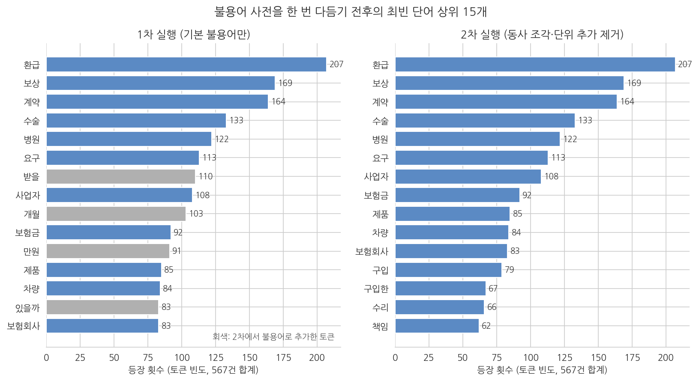
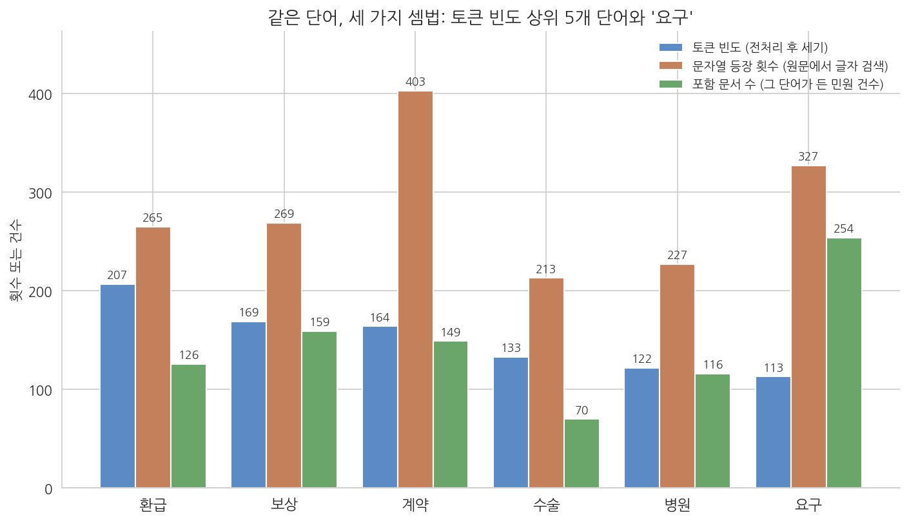
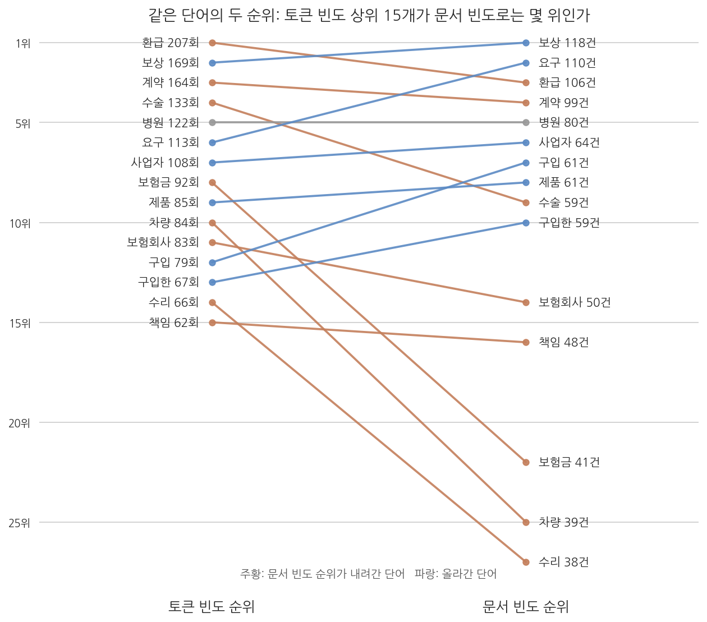
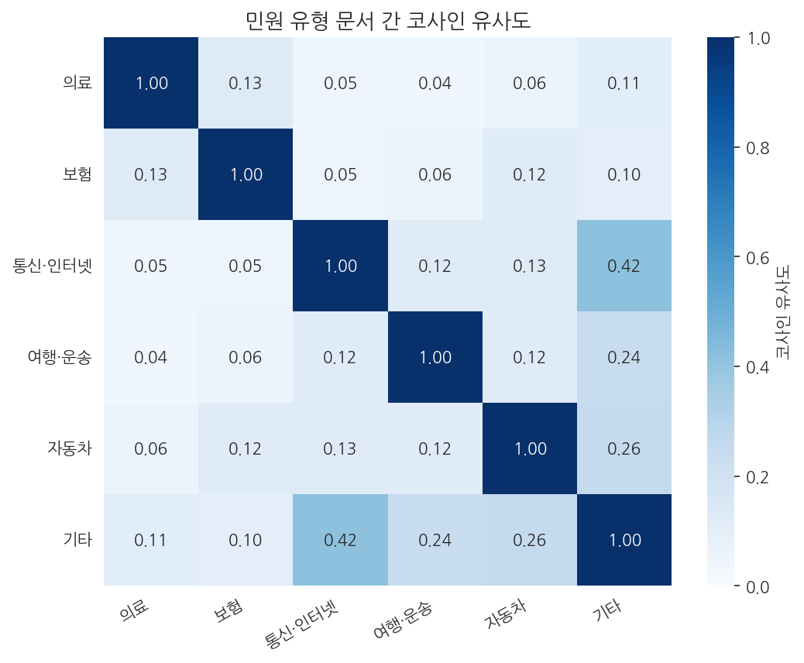
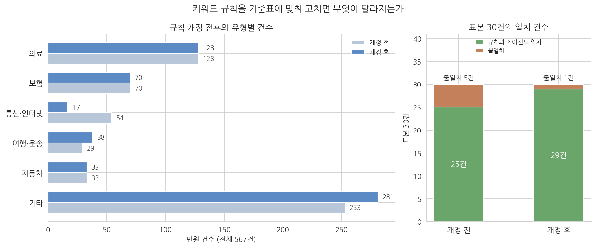

# 11주차 2회차. 에이전트로 민원 텍스트 분석하기

## 이 실습에서 하는 것

1회차에서 글을 숫자로 바꿔 분석하는 원리를 배웠다. 이번 실습에서는 그 전 과정을 에이전트와 함께 실제 데이터로 수행한다. 재료는 1회차에서 소개한 공정거래위원회의 소비자 민원 상담 사례 567건이다. 데이터를 입수하고, 한국어 텍스트를 전처리하고, 불용어 사전을 두 번 다듬고, 핵심어 빈도를 그림으로 그리고, 그 숫자를 새 대화에서 독립적으로 다시 센다. 그다음 민원을 유형별로 분류한다. 분류는 두 가지 방법으로 한다. 키워드 규칙에 따른 통계적 분류와, 에이전트가 민원을 직접 읽고 판단하는 분류다. 에이전트에게는 분류 기준표를 주기 전과 후로 나누어 두 번 시킨다. 그다음 두 결과가 어긋나는 지점을 표본으로 뽑아 내 눈으로 읽고, 누가 맞았는지 판정한다. 마지막에는 판정에서 알아낸 것을 기준표와 규칙에 되먹여 다시 돌리고, 일치율이 얼마나 달라지는지 잰다.

이 실습이 끝나면 다음 산출물이 폴더에 남는다.

- 정리된 민원 텍스트 데이터와 전처리 규칙(두 번 다듬은 불용어 목록 포함)
- 핵심어 빈도 막대그래프, 단어 빈도와 문서 빈도의 순위 비교 그림, 유형별 특징어 그림, 그리고 상위 단어의 독립 검산 기록
- 내가 만든 분류 기준표(`data/분류기준표.md`)와 눈가림 표본 파일, 그리고 경계 규칙 세 줄을 덧붙인 개정판
- 규칙 분류와 에이전트 분류의 30건 비교표, 불일치 사례에 대한 나의 판정 기록, 규칙 개정 전후의 일치율 대조표

오늘의 숨은 주제는 검증이다. 통계적 방법과 에이전트라는 두 분석기를 서로 맞세워 보면, 어느 한쪽만 쓸 때는 보이지 않던 오류가 드러난다. 그리고 오늘은 에이전트가 숫자를 잘못 옮기는 장면, 규칙이 단어에 속는 장면, 규칙이 만든 범주를 그 규칙의 단어로 설명하는 순환논법 장면, 표본을 다 읽지 않고 분류하는 장면을 모두 실제 예로 만난다.

## 준비물

| 구분 | 내용 |
|------|------|
| 폴더 | 학기 프로젝트 폴더 (data, code, figures 하위 폴더) |
| 데이터 | `data/minwon_cases_2021.csv` (공정거래위원회_소비자 민원학습데이터 모범상담 사례_20211227. 공공데이터포털 www.data.go.kr/data/15098335/fileData.do 에서 로그인 없이 내려받을 수 있다. 수업 자료실에도 같은 파일을 올려 둔다) |
| 도구 | VSCode + Claude Code, 3주차에 구축한 uv 환경 (pandas, scikit-learn, matplotlib, seaborn, koreanize-matplotlib) |
| 참고 코드 | `code/ch10_text.py` (기본 분석 전 과정의 완성 코드), `code/ch11_practice.py` (불용어 반복, 세 가지 셈법, 문서 빈도 비교, 유형별 상위 단어, 규칙 개정 실험, 분류 비교 집계, 대표 민원 추출), `code/fig11_practice.py` (그림 11-4부터 11-8까지). 막힐 때 참조 |
| 선수 내용 | 11주차 1회차 (문서-단어 행렬, TF-IDF, 코사인 유사도), 7주차 (전처리와 지저분한 데이터), 10주차 (표본과 모집단, 과잉해석 잡기), 2주차 (검증 손잡이, 새 대화 독립 검산, 비결정성), 4-5주차 (Skill. 과제 11-D에서 사용) |

## 2.1 텍스트 데이터 입수

**무엇을 왜 하는가.** 첫 단계는 데이터 확보다. 민원 원문 데이터는 사실 구하기가 쉽지 않다. 개인정보 때문에 민원 원문 자체는 대부분 기관 내부에만 있고, 포털에는 건수 통계만 개방된 경우가 많다. 이번 데이터는 그 가운데 원문이 공개된 드문 사례로, 소비자 상담이라는 민원의 실제 텍스트(제목, 내용, 답변)를 담고 있다. 공공데이터포털에서 "민원"으로 검색해 보면 이런 텍스트형 데이터와 통계형 데이터가 섞여 나오는데, 6주차에서 배운 대로 미리보기와 메타데이터를 확인해 원문이 든 쪽을 고르는 눈이 필요하다.

파일을 data 폴더에 넣었으면, 에이전트에게 첫 개관을 시킨다.

<div style="border:1px solid #cfe3d4;border-left:5px solid #2f8f4e;background:#f4fbf6;padding:12px 16px;margin:18px 0;border-radius:4px;">
<strong>지시문 예시</strong><br>
"data 폴더의 minwon_cases_2021.csv를 읽고 (1) 몇 건이 들어 있는지, (2) 어떤 열이 있는지, (3) 첫 3건의 제목과 내용을 보여 줘. 읽는 중에 문제가 생기면 어떤 문제인지 그대로 보고하고, 임의로 처리하지 말고 멈춰 줘."
</div>

**예상되는 에이전트의 행동과 결과.** 여기서 오늘의 첫 사건이 일어난다. 이 파일을 pandas로 그냥 읽으면 오류가 난다. 화면에는 다음과 같은 메시지가 보인다.

```
ParserError: Error tokenizing data. C error: Expected 4 fields in line 251, saw 5
```

원본 CSV에 형식이 어긋난 행이 3건 섞여 있기 때문이다. 1건은 쉼표 처리가 어긋나 열이 5개로 읽히고, 2건은 답변 열이 비어 있어 열이 3개다. 7주차에서 배운 그대로다. 현실의 공공데이터는 텍스트 데이터라고 예외가 아니다. 에이전트는 지시문의 마지막 문장 덕분에 임의로 처리하지 않고 이 문제를 보고할 것이다. 만약 지시문에 그 문장이 없었다면, 에이전트가 조용히 문제 행을 버리고 "잘 읽었습니다"라고 보고했을 수도 있다. 무엇을 버렸는지 사용자가 모른 채로.

보고를 받았으면 처리 방침을 여러분이 정해서 다시 지시한다. 우리는 제목과 내용만 분석하므로, 열이 5개로 읽히는 1건만 제외하고 답변이 빈 2건은 남기기로 한다. "열 개수가 어긋나는 행만 건너뛰고 읽은 뒤, 제외한 건수와 남은 건수를 보고해 줘." 이렇게 하면 568건 중 1건이 제외되어 567건이 남고, 에이전트는 "568건 중 1건 제외, 567건 읽음. 답변 열이 비어 있는 2건은 유지"라는 취지로 보고한다. 화면에 나오는 개관은 대략 이런 모양이다.

```
읽기 결과: 568행 중 1행 제외, 567건
열 이름: 사건번호(ACCIDENT_NO), 사건제목(ACCIDENT_TITLE),
        사건내용(ACCIDENT_CONTENT), 답변내용(ANS_CONTENT)
사건번호 고유값: 567개 (중복 없음)
답변 열이 비어 있는 건: 2건 (지시대로 유지)

첫 3건
1000504935  고지의무 위반과 인과관계 없는 암환자에 사망 보험금 지급 거부
1000507636  [내과] 위암 오진 건
1000507782  [내과] 고혈압약 복용 중 신부전증 진단에 따른 손해배상 유무
```

세 건의 제목만 보아도 데이터의 성격이 드러난다. 첫 건은 보험회사와 다투는 이야기이고, 뒤의 두 건은 제목 앞에 대괄호로 진료과가 붙은 의료 분쟁이다. 이 대괄호 표시는 뒤에서 분류 규칙을 만들 때 쓰이게 되니 기억해 두자.

**검증.** 두 가지를 확인한다. 첫째, 건수. 흥미롭게도 이 파일은 VSCode로 열어 줄 수를 세는 고전적 검증이 통하지 않는다. 민원 내용 안에 줄바꿈이 들어 있어 물리적 줄 수는 658줄로, 데이터 건수(568건)와 전혀 다르기 때문이다. 텍스트 데이터에서는 "1행 = 1건"이 깨질 수 있다는 것 자체가 오늘의 첫 교훈이다. 대신 에이전트에게 "사건번호가 고유한지, 몇 개인지 세어 줘"라고 별도의 방법으로 다시 세게 해 567건과 맞는지 대조한다. 둘째, 내용의 생김새. 첫 몇 건의 제목("고지의무 위반과 인과관계 없는 암환자에 사망 보험금 지급 거부" 등)과 내용을 읽고, 이것이 분석하려는 대상(민원 텍스트)이 맞는지 눈으로 확인한다. 열 이름이 "사건제목(ACCIDENT_TITLE)"처럼 한글과 영문 병기로 되어 있다는 것도 이때 알게 된다. 에이전트에게 열 이름을 제목, 내용, 답변으로 단순화해 달라고 해 두면 이후 작업이 편하다.

## 2.2 전처리 1차: 조사 떼기와 기본 불용어

**무엇을 왜 하는가.** 이제 글을 셀 수 있는 형태로 만든다. 1회차에서 배웠듯 한국어는 조사와 어미 때문에 그냥 공백으로 자르면 "쓰레기가"와 "쓰레기를"이 남남이 된다. 형태소 분석기가 정석이지만 우리 환경에는 설치되어 있지 않으므로, 단순 규칙으로 간다. 이 제약을 지시문에 명시하는 것이 중요하다. 그러지 않으면 에이전트가 형태소 분석기 패키지를 새로 설치하려 들 수 있다.

<div style="border:1px solid #cfe3d4;border-left:5px solid #2f8f4e;background:#f4fbf6;padding:12px 16px;margin:18px 0;border-radius:4px;">
<strong>지시문 예시</strong><br>
"민원의 제목과 내용을 합쳐 텍스트 분석을 준비해 줘. 형태소 분석기는 설치되어 있지 않고 새 패키지 설치도 하지 말 것. 대신 (1) 한글이 아닌 글자는 제거하고 공백으로 자른 뒤, (2) 단어 끝의 흔한 조사(가, 을, 는, 에서 등)를 떼고, (3) 두 글자 미만 단어와 불용어를 제거하는 간단한 규칙으로 토큰화해 줘. 그다음 scikit-learn의 CountVectorizer로 문서-단어 행렬을 만들고, 행렬의 크기와 전체 최빈 단어 20개를 보여 줘. 코드는 code 폴더에 저장해 줘."
</div>

**예상되는 에이전트의 행동과 결과.** 에이전트가 토큰화 함수를 짜고("저는", "그런데", "경우" 같은 기본 불용어 40여 개를 스스로 넣는다), 문서-단어 행렬을 만들어 크기와 최빈 단어를 보고한다. 토큰화가 실제로 무엇을 하는지는 문장 하나를 넣어 보면 바로 보인다. 첫 민원의 한 문장과 그 결과가 이렇다.

```
원문: 보험 회사는 과거 간경화로 치료 받은 사실이 있었는데도 보험을 청약할 때
      고지하지 않았으므로 고지의무 위반이라며 사망 보험금을 제외한
      암진단 급여금(1천만원)과 이미 납입한 보험료만 환급해 주었습니다.

토큰: 보험 / 회사 / 과거 / 간경화 / 치료 / 받은 / 보험 / 청약할 / 않았으므 /
      고지의무 / 위반이라며 / 사망 / 보험금 / 제외한 / 암진단 / 급여금 /
      천만원 / 이미 / 납입한 / 보험료 / 환급해
```

규칙이 제대로 작동한 대목을 먼저 보자. "회사는"에서 조사 "는"이 떨어져 "회사"가 되었고, 그래서 "보험을"과 "보험"이 한 단어로 합쳐졌다. "사실이"는 조사를 떼고 남은 "사실"이 기본 불용어에 걸려 사라졌다. 숫자와 괄호는 한글이 아니어서 없어지고 "천만원"만 남았다. 반면 어색한 조각도 그대로 남았다. "않았으므", "위반이라며", "청약할", "천만원"이 그렇다. 어미를 자르는 규칙이 문장 중간의 활용형까지 다 잡지는 못하기 때문이다. 스물한 개 토큰 가운데 넷이 이런 조각인데, 567건을 모으면 이 조각들이 최빈 단어 목록에까지 올라온다. 저자의 실행에서 행렬은 567행 x 6,248열이었고, 최빈 단어 목록의 앞부분은 다음과 같았다.

```
환급 207   보상 169   계약 164   수술 133   병원 122
요구 113   받을 110   사업자 108  개월 103   보험금 92
만원 91    제품 85    차량 84    있을까 83   보험회사 83
받은 81    구입 79    않아 73    원을 72    받고 71
```

이상한 손님들이 끼어 있다. "받을"(110회), "개월"(103회), "만원"(91회), "있을까"(83회), "받은", "않아", "원을", "받고"다. "받을"과 "있을까"는 동사 조각이고 "만원"과 "개월"은 단위다. 어느 쪽도 민원의 주제를 말해 주지 않는다. 이것이 전처리의 실제 모습이다. 한 번에 끝나지 않고, 결과를 눈으로 보고 규칙을 고쳐 다시 돌리는 순환이다.

**검증.** 첫 실행의 최빈 단어 20개를 처음부터 끝까지 읽으면서, 각 단어 옆에 "주제어"인지 "조각"인지 표시를 붙여 보라. 판단 기준은 하나다. 그 단어가 "이 민원이 무엇에 관한 것인지"를 말해 주는가. 위 목록에서는 20개 중 8개가 조각이다. 이 표시가 다음 단계에서 불용어에 추가할 목록이 된다. 표시를 마쳤으면, 에이전트가 만든 코드 파일을 열어 불용어 목록이 코드 안에 명시되어 있는지도 확인한다. 목록이 코드에 없고 에이전트의 머릿속에만 있다면, 다음에 다시 돌릴 때 같은 결과가 나오지 않는다.

## 2.3 불용어 사전 다듬기: 두 번 반복하고 멈추는 자리 정하기

**무엇을 왜 하는가.** 앞 단계에서 표시한 조각들을 불용어 목록에 추가해 다시 실행한다. 이 반복을 몇 번 해야 하는지는 정답이 없다. 그래서 "언제 멈출 것인가"를 스스로 정하는 연습이 이 단계의 목적이다. 기준은 두 가지다. 상위 단어가 전부 주제어가 되었는가, 그리고 더 빼는 것이 분석에 도움이 되는가.

<div style="border:1px solid #cfe3d4;border-left:5px solid #2f8f4e;background:#f4fbf6;padding:12px 16px;margin:18px 0;border-radius:4px;">
<strong>지시문 예시</strong><br>
"최빈 단어 목록에 '받을', '있을까' 같은 동사 조각과 '만원', '개월' 같은 단위가 섞여 있어. 이런 토큰들을 불용어 목록에 추가하고, '-습니다', '-하는'처럼 서술어로 끝나는 토큰을 거르는 규칙도 더해서 다시 실행해 줘. 추가한 불용어는 코드에서 '첫 실행 후 추가'라는 주석으로 구분해 두고, 1차와 2차의 최빈 단어 상위 10개를 나란히 표로 보여 줘."
</div>

**예상되는 에이전트의 행동과 결과.** 에이전트가 불용어 20개 안팎을 추가하고 재실행해 행렬 크기(567행 x 6,233열)와 대조표를 보고한다. 2차 실행의 최빈 단어 20개는 이렇게 나왔다.

```
환급 207    보상 169    계약 164    수술 133    병원 122
요구 113    사업자 108  보험금 92   제품 85     차량 84
보험회사 83  구입 79     구입한 67   수리 66     책임 62
진단 61     치료 60     반품 60     이유 58     배상 57
```

1차와 견주면 열이 6,248개에서 6,233개로 열다섯 개 줄었다. 불용어를 스무 개 넘게 추가했는데 열이 그만큼 줄지 않은 것은, 추가한 스무 개 가운데 다섯 개("되었", "됩니", "이었", "저런", "합니")가 애초에 이 데이터의 토큰 목록에 없었기 때문이다. 줄어든 자리는 6위 아래에 몰려 있고, 목록의 얼굴이 확실히 달라졌다. 표 11-4가 1차와 2차의 상위 10개를 나란히 놓은 저자의 실행 결과다.

**표 11-4. 불용어를 한 번 다듬기 전후의 최빈 단어 상위 10개 (실제 실행 결과)**

| 순위 | 1차 단어 | 1차 횟수 | 2차 단어 | 2차 횟수 |
|------|------|------|------|------|
| 1 | 환급 | 207 | 환급 | 207 |
| 2 | 보상 | 169 | 보상 | 169 |
| 3 | 계약 | 164 | 계약 | 164 |
| 4 | 수술 | 133 | 수술 | 133 |
| 5 | 병원 | 122 | 병원 | 122 |
| 6 | 요구 | 113 | 요구 | 113 |
| 7 | 받을 | 110 | 사업자 | 108 |
| 8 | 사업자 | 108 | 보험금 | 92 |
| 9 | 개월 | 103 | 제품 | 85 |
| 10 | 보험금 | 92 | 차량 | 84 |



그림 11-4를 읽어 보자. 왼쪽이 1차, 오른쪽이 2차 실행이고, 막대 길이는 토큰 빈도다. 왼쪽의 회색 막대("받을", "개월", "만원", "있을까")가 2차에서 불용어로 추가된 토큰이며, 오른쪽에서는 그 자리를 "제품", "차량", "구입", "수리" 같은 주제어가 채웠다. 여기서 알 수 있는 것은 두 가지다. 상위 6개는 두 실행에서 전혀 변하지 않았으므로 이 민원 뭉치의 큰 그림(환급, 보상, 계약, 의료)은 불용어 판단에 흔들리지 않는다. 반면 7위 아래의 순위는 불용어 목록에 따라 바뀐다. "10위권 단어"를 보고서에 쓸 때는 어떤 불용어 목록으로 얻은 결과인지 밝혀야 하는 이유다.

**검증.** 2차 결과의 상위 20개를 다시 읽고 남은 문제를 적어 본다. 실제 2차 결과에는 세 가지가 남는다. 첫째, "구입"(79회)과 "구입한"(67회)이 따로 세어진다. 단순 규칙의 한계로, 형태소 분석기가 있어야 합쳐진다. 둘째, "요구"(113회)가 6위에 있다. 1회차 1.3절에서 말한 민원이라는 장르의 상투어다. 셋째, "이유", "결과", "따른" 같은 말이 20위 언저리에 있다. 이제 3차 실행을 할지 결정한다. 저자는 여기서 멈추기로 했다. "요구"는 소비자 민원의 성격(무엇을 요구하는 글)을 말해 주는 단어이기도 하고, 상위 6개가 이미 안정되어 있으며, 더 빼면 1회차 그림 11-2와 결과가 달라져 재현성을 해치기 때문이다. 여러분은 다르게 결정해도 된다. 중요한 것은 결정과 이유를 코드 주석이나 분석 로그에 남기는 것이다. 7주차의 정제 로그와 같은 원리로, 누가 언제 다시 돌려도 같은 결과가 나오고 어떤 판단이 개입했는지 추적할 수 있어야 한다.

## 2.4 핵심어 빈도 분석과 시각화

**무엇을 왜 하는가.** 전처리가 자리 잡았으니 이제 세어서 그린다. 그림 한 장이 "이 민원 뭉치가 무엇에 관한 것인가"에 대한 첫 답이 된다.

<div style="border:1px solid #cfe3d4;border-left:5px solid #2f8f4e;background:#f4fbf6;padding:12px 16px;margin:18px 0;border-radius:4px;">
<strong>지시문 예시</strong><br>
"문서-단어 행렬에서 전체 최빈 단어 20개를 뽑아 가로 막대그래프로 그려 줘. 막대 옆에 등장 횟수 숫자를 붙이고, 한글이 깨지지 않게 koreanize_matplotlib를 사용하고, figures 폴더에 PNG로 저장해 줘. 그림을 보고 이 민원 뭉치의 성격을 세 문장으로 요약해 줘."
</div>

**예상되는 에이전트의 행동과 결과.** 1회차의 그림 11-2와 같은 그래프가 만들어진다. "환급"(207회)이 1위, "보상", "계약", "수술", "병원"이 뒤를 잇는 모습이다. 에이전트의 요약문도 함께 온다. "환불·보상 요구와 계약 분쟁이 중심이고, 의료 관련 민원이 큰 비중을 차지합니다" 같은 내용일 것이다. 이 요약문은 잠시 뒤 2.5에서 다시 검증한다.

**검증.** 여기서 텍스트 분석 특유의 검증 요령을 하나 배운다. 보고된 숫자를 다른 방법으로 다시 세어 보는 것이다. 에이전트에게 "환급이라는 글자가 원본 텍스트에 몇 번 나오는지, 토큰화를 거치지 않고 문자열 검색으로 세어 줘"라고 지시해 보라. 결과는 207이 아니라 265가 나온다. 셋째 방법으로 "환급이 들어간 민원이 몇 건인지" 물으면 126이 나온다. 세 숫자가 다 다르지만 모두 맞는 숫자다. 각각 "환급으로 정리된 토큰의 수"(환급을, 환급이 등이 합쳐진 것), "환급이라는 글자의 등장 횟수"(환급금, 환급받고 같은 다른 단어 속의 등장까지 센 것), "환급을 언급한 문서 수"를 센 것이기 때문이다. 보고서에 "환급 207회"라고 쓸 때는 무엇을 어떻게 센 숫자인지 정의를 함께 적어야 하고, 에이전트의 숫자를 검증할 때도 같은 정의로 세었는지부터 맞춰야 한다. 숫자가 다르다고 곧바로 "에이전트가 틀렸다"고 결론 내리면 그것도 오판이다.

<div style="border:1px solid #ecd9c6;border-left:5px solid #c77b2f;background:#fdf9f4;padding:12px 16px;margin:18px 0;border-radius:4px;">
<strong>유의 · 같은 질문, 다른 셈법</strong><br>
"이 단어가 얼마나 나오는가"에는 최소 세 가지 다른 답이 있다. 토큰 빈도, 문자열 등장 횟수, 포함 문서 수다. 실제 데이터에서 "환급"은 각각 207, 265, 126이었다. 분석 보고서의 수치 검증이 어긋날 때, 틀린 것이 아니라 정의가 다른 경우가 많다. 검증의 첫 질문은 "그 숫자, 무엇을 센 것인가"다.
</div>

## 2.5 새 대화 독립 검산: 상위 5개 단어를 원자료에서 다시 세기

**무엇을 왜 하는가.** 2.4의 검증은 같은 대화 안에서 했다. 같은 대화의 에이전트는 자기가 짠 코드와 자기가 낸 숫자를 맥락창에 갖고 있어서, 재검산을 시켜도 그 코드를 다시 돌리는 데 그치기 쉽다. 2주차에서 배운 독립 검산의 원리를 여기에 적용한다. 새 대화는 빈 책상에서 시작하므로, 앞선 코드를 모른 채 원자료에서 처음부터 세게 된다. 검산 대상은 그림에서 가장 눈에 띄는 상위 5개 단어와, 앞 단계에서 논란이 되었던 "요구"다.

<div style="border:1px solid #cfe3d4;border-left:5px solid #2f8f4e;background:#f4fbf6;padding:12px 16px;margin:18px 0;border-radius:4px;">
<strong>지시문 예시 (새 대화에서)</strong><br>
"data/minwon_cases_2021.csv를 읽어 줘. 열 개수가 어긋나는 행은 건너뛰고 몇 건을 건너뛰었는지 보고할 것. 제목과 내용을 합친 텍스트에서 다음 여섯 단어에 대해 (1) 글자 그대로의 등장 횟수와 (2) 그 단어가 한 번이라도 들어간 민원 건수를 세어 표로 정리해 줘. 단어: 환급, 보상, 계약, 수술, 병원, 요구. code 폴더의 기존 코드는 읽지 말고 처음부터 셀 것. 전체 건수도 함께 보고해 줘."
</div>

**예상되는 에이전트의 행동과 결과.** 새 대화의 에이전트는 파일을 읽고 1건을 건너뛰어 567건을 확인한 뒤, 단어별로 두 숫자를 센 표를 보고한다. 저자의 실행 결과를 앞 대화의 토큰 빈도와 합쳐 정리한 것이 표 11-5다.

**표 11-5. 상위 5개 단어와 "요구"의 세 가지 셈법 (실제 실행 결과, 567건 기준)**

| 단어 | 토큰 빈도 (2.4) | 문자열 등장 횟수 | 포함 문서 수 | 문서 비율 |
|------|------|------|------|------|
| 환급 | 207 | 265 | 126 | 22.2% |
| 보상 | 169 | 269 | 159 | 28.0% |
| 계약 | 164 | 403 | 149 | 26.3% |
| 수술 | 133 | 213 | 70 | 12.3% |
| 병원 | 122 | 227 | 116 | 20.5% |
| 요구 | 113 | 327 | 254 | 44.8% |



그림 11-5은 표 11-5를 막대로 옮긴 것이다. 단어마다 세 막대가 있고, 파랑이 토큰 빈도, 주황이 문자열 등장 횟수, 초록이 포함 문서 수다. 읽는 법은 막대 높이의 순서가 아니라 순위가 셈법에 따라 어떻게 뒤집히는가에 있다. 토큰 빈도로는 "환급"이 1위지만, 포함 문서 수로는 "보상"(159건)과 "계약"(149건)이 "환급"(126건)보다 앞선다. "계약"은 문자열 등장 횟수가 403회로 토큰 빈도의 2.5배인데, "계약서", "계약금", "계약해지" 같은 다른 단어 안에 들어 있는 경우가 많기 때문이다. 그리고 "요구"는 토큰 빈도로는 6위지만 567건 중 254건(44.8%)에 들어 있어 문서 수로는 압도적 1위다. 민원의 절반 가까이가 무엇인가를 "요구"하는 글이라는 뜻이고, 2.3에서 이 단어를 불용어 후보로 고민한 이유가 여기서 숫자로 확인된다.

**검증.** 새 대화의 문자열 등장 횟수와 포함 문서 수를 2.4에서 같은 대화가 낸 "환급" 265, 126과 대조한다. 두 대화가 서로의 코드를 보지 않고 같은 숫자를 냈다면, 그 숫자는 믿을 만하다. 하나라도 다르면 두 대화 중 어느 쪽이 무엇을 다르게 셌는지(예: 제목을 뺐는지, 건너뛴 행이 다른지) 캐물어야 한다. 13주차에서는 이 "새 대화에서 다시 세기"를 사람이 매번 열지 않아도 되도록 검증 전담 서브에이전트(verifier)에게 맡기는 방법을 배운다.

이제 에이전트가 틀리는 장면이다. 2.4의 요약 지시를 저자가 실제로 실행했을 때, 에이전트가 쓴 세 번째 문장은 다음과 같았다.

> "소비자들의 가장 큰 불만은 결함이나 사고 발생 후 사업자가 환급이나 보상 요구에 응하지 않는 것으로, 환급(207건)과 보상(169건)이 최빈 단어 1, 2위인 데서 이를 확인할 수 있습니다."

문장은 유창하지만 두 군데가 틀렸다. 첫째, 207과 169는 토큰 빈도이지 "건"이 아니다. 환급이 든 민원은 126건이고 보상이 든 민원은 159건이다. 에이전트가 숫자를 옮기면서 단위를 바꿔 버린 것이고, 이 문장이 그대로 보고서에 실리면 "민원 207건이 환급 관련"이라는 없는 사실이 만들어진다. 둘째, "가장 큰 불만"은 단어 빈도가 뒷받침하지 못하는 주장이다. 표 11-5의 문서 수로는 보상이 환급보다 앞서고, 규칙 분류(2.8)의 유형별로 "환급"이 든 민원의 비율을 세어 보면 여행·운송 55.2%, 통신·인터넷 31.5%, 기타 28.5%, 자동차 24.2%, 보험 7.1%, 의료 6.2%로 유형마다 전혀 다르다. 환급은 어떤 유형에서는 핵심이고 어떤 유형에서는 주변이다. 이 장면을 잡아낸 것은 표 11-5, 곧 새 대화에서 다시 센 숫자였다. 이제 재지시한다.

<div style="border:1px solid #cfe3d4;border-left:5px solid #2f8f4e;background:#f4fbf6;padding:12px 16px;margin:18px 0;border-radius:4px;">
<strong>지시문 예시 (재지시)</strong><br>
"요약의 세 번째 문장에서 207과 169는 토큰 빈도인데 '건'으로 적혀 있어. 수치를 쓸 때는 무엇을 센 것인지(토큰 빈도, 포함 문서 수) 단위를 명시하고, 순위 주장은 두 셈법에서 순위가 다르면 둘 다 적어 줘. 그리고 '가장 큰 불만'처럼 단어 빈도만으로는 뒷받침되지 않는 판단은 '단어 빈도로 보면 ... 경향이 있다'로 낮춰서 다시 써 줘."
</div>

수정된 요약은 "환급(토큰 207회, 포함 민원 126건)과 보상(169회, 159건)이 상위에 있어 금전적 구제 요구가 흔한 경향이 보이며, 어느 것이 더 큰 불만인지는 셈법에 따라 순위가 달라 단어 빈도만으로는 판단할 수 없다"는 취지가 되어야 한다. 10주차에서 배운 과잉해석 잡기가 텍스트 분석에서는 "단어 빈도를 불만의 크기로 읽는 것"의 형태로 나타난다.

## 2.6 단어 빈도와 문서 빈도: 넓은 말과 깊은 말 가려내기

**무엇을 왜 하는가.** 2.5에서는 여섯 단어를 세 가지 셈법으로 세어 보았다. 이제 그 비교를 상위 15개 단어 전체로 넓히되, 셈법은 보고서에서 실제로 쓰이는 둘로 좁힌다. 하나는 지금까지 써 온 토큰 빈도이고, 다른 하나는 문서 빈도(document frequency)다. 문서 빈도는 그 단어가 한 번이라도 나온 민원이 몇 건인지를 센 숫자로, 한 민원 안에서 열 번 나오든 한 번 나오든 1로 센다. 두 숫자를 나란히 놓아야 하는 이유는 이렇다. 어떤 단어는 소수의 민원에서 여러 번 반복되고, 어떤 단어는 많은 민원에 한 번씩 흩어져 나온다. 앞의 것은 특정 사안이 깊게 다투어진다는 뜻이고, 뒤의 것은 문제가 넓게 퍼져 있다는 뜻이다. 토큰 빈도만 보면 이 둘이 한 줄에 섞여 버린다. 과장에게 "가장 많은 민원이 걸린 문제"를 보고해야 한다면 필요한 것은 문서 빈도이고, "어떤 사안이 가장 길게 다투어지는가"를 보려면 토큰 빈도다.

<div style="border:1px solid #cfe3d4;border-left:5px solid #2f8f4e;background:#f4fbf6;padding:12px 16px;margin:18px 0;border-radius:4px;">
<strong>지시문 예시</strong><br>
"2차 불용어로 만든 문서-단어 행렬에서 토큰 빈도 상위 15개 단어를 뽑고, 각 단어에 대해 (1) 토큰 빈도, (2) 그 단어가 한 번이라도 등장한 민원 건수(문서 빈도)와 567건 대비 비율, (3) 문서 빈도로 매긴 순위, (4) 토큰 빈도를 문서 빈도로 나눈 건당 평균 등장 횟수를 표로 정리해 줘. 표는 토큰 빈도 순으로 정렬하고, 두 순위가 세 계단 이상 벌어진 단어에는 표시를 붙여 줘. 계산은 문서-단어 행렬에서 직접 하고, 어느 값을 어떻게 셌는지 한 줄로 설명하고, 코드는 code 폴더에 저장해 줘."
</div>

**예상되는 에이전트의 행동과 결과.** 에이전트는 "토큰 빈도는 행렬 각 열의 합, 문서 빈도는 각 열에서 0보다 큰 칸의 개수로 셌습니다"라고 셈법을 밝힌 뒤 표를 낸다. 화면에는 먼저 이런 출력이 지나간다.

```
   단어  토큰빈도  빈도순위  문서수  문서비율  문서순위  순위이동
   환급   207     1   106  18.7     3      -2
   보상   169     2   118  20.8     1      +1
   계약   164     3    99  17.5     4      -1
   수술   133     4    59  10.4     9      -5
   병원   122     5    80  14.1     5       0
   요구   113     6   110  19.4     2      +4
  사업자   108     7    64  11.3     6      +1
  보험금    92     8    41   7.2    22     -14
   차량    84    10    39   6.9    25     -15
   수리    66    14    38   6.7    27     -13
```

정리하면 표 11-6이다.

**표 11-6. 토큰 빈도 상위 15개 단어의 토큰 빈도와 문서 빈도 (실제 실행 결과, 567건, 2차 불용어 기준)**

| 단어 | 토큰 빈도 | 문서 빈도(건) | 문서 비율 | 문서 빈도 순위 | 건당 평균 |
|------|------|------|------|------|------|
| 환급 | 207 | 106 | 18.7% | 3위 | 1.95 |
| 보상 | 169 | 118 | 20.8% | 1위 | 1.43 |
| 계약 | 164 | 99 | 17.5% | 4위 | 1.66 |
| 수술 | 133 | 59 | 10.4% | 9위 | 2.25 |
| 병원 | 122 | 80 | 14.1% | 5위 | 1.52 |
| 요구 | 113 | 110 | 19.4% | 2위 | 1.03 |
| 사업자 | 108 | 64 | 11.3% | 6위 | 1.69 |
| 보험금 | 92 | 41 | 7.2% | 22위 | 2.24 |
| 제품 | 85 | 61 | 10.8% | 8위 | 1.39 |
| 차량 | 84 | 39 | 6.9% | 25위 | 2.15 |
| 보험회사 | 83 | 50 | 8.8% | 14위 | 1.66 |
| 구입 | 79 | 61 | 10.8% | 7위 | 1.30 |
| 구입한 | 67 | 59 | 10.4% | 10위 | 1.14 |
| 수리 | 66 | 38 | 6.7% | 27위 | 1.74 |
| 책임 | 62 | 48 | 8.5% | 16위 | 1.29 |

표의 마지막 열, 건당 평균부터 보자. "요구"는 1.03이다. 이 단어가 나오는 110건의 민원에서 거의 예외 없이 딱 한 번씩만 쓰였다는 뜻이다. 넓고 얕은 단어다. 반대쪽 끝에 "수술"(2.25), "보험금"(2.24), "차량"(2.15)이 있다. 이 단어들이 나오는 민원은 40-60건으로 적지만, 그 안에서는 두 번 넘게 되풀이된다. 좁고 깊은 단어다. 왜 그런지는 원문을 떠올려 보면 자명하다. 보험금 분쟁 민원은 처음부터 끝까지 보험금 이야기이므로 한 건 안에서 그 말이 여러 번 나오고, 요구는 어떤 주제의 민원이든 마지막에 한 번 나오는 상투어다.



그림 11-6을 읽어 보자. 왼쪽 줄이 토큰 빈도 순위, 오른쪽 줄이 문서 빈도 순위이고, 선 하나가 단어 하나다. 위로 갈수록 높은 순위다. 주황색 선은 오른쪽에서 순위가 내려간 단어, 파란색 선은 올라간 단어다. 여기서 알 수 있는 것은 두 가지다. 첫째, 순위가 크게 뒤집힌다. 토큰 빈도 1위였던 "환급"은 문서 빈도로는 3위로 내려가고 그 자리를 "보상"(118건)이 차지하며, 6위였던 "요구"는 2위로 올라온다. 보고서 첫 문장에 "가장 자주 등장한 단어는 환급"이라고 쓰는 것과 "가장 많은 민원에 등장한 단어는 보상"이라고 쓰는 것은 둘 다 사실이지만 읽는 사람에게는 다른 이야기다. 둘째, 아래쪽 세 선(보험금 8위에서 22위, 차량 10위에서 25위, 수리 14위에서 27위)의 낙차가 특히 크다. 이 단어들은 전체 순위표에 올라올 만큼 많이 나오지만 실제로는 40건 안팎의 민원에만 몰려 있다. 곧 뒤에서 분류를 시작하면, 이렇게 몰려 있는 단어가 유형을 구별하는 데 쓸모 있는 단어라는 것을 보게 된다.

<div style="border:1px solid #e0d8ea;border-left:5px solid #7a5fa8;background:#faf8fc;padding:12px 16px;margin:18px 0;border-radius:4px;">
<strong>왜 문서 빈도가 정책 보고에 더 안전한가?</strong><br>
민원 한 건이 유난히 길고 같은 말을 스무 번 되풀이하면, 토큰 빈도는 그 한 사람의 목소리를 스무 명분으로 세어 준다. 문서 빈도는 한 건을 1로 세므로 그런 일이 생기지 않는다. "몇 명이 이 문제를 제기했는가"는 정책 판단에서 거의 언제나 "그 말이 몇 번 나왔는가"보다 중요한 질문이므로, 보고서의 대표 수치로는 문서 빈도를 쓰고 토큰 빈도는 보조로 붙이는 편이 안전하다. 1회차에서 배운 TF-IDF가 문서 빈도를 계산에 쓰는 것도 같은 이치다. 여러 문서에 골고루 퍼진 말은 그 문서만의 특징이 아니라고 보는 것이다.
</div>

**검증.** 표 11-6과 표 11-5를 나란히 놓고 "환급"의 행을 비교하라. 표 11-5의 포함 문서 수는 126건인데 표 11-6의 문서 빈도는 106건이다. 같은 데이터, 같은 단어인데 20건이 다르다. 여기서 곧바로 "누가 틀렸다"고 판단하면 안 된다. 표 11-5는 원문에서 글자를 찾은 것이고 표 11-6은 전처리를 거친 토큰을 센 것이므로, 정의가 다르면 숫자도 다른 것이 정상이다. 확인은 에이전트에게 시킨다. "환급이라는 글자는 들어 있는데 토큰 환급은 없는 민원 20건을 찾아, 그 민원들에서 환급이 들어간 토큰이 무엇인지 세어 줘"라고 지시하면, 저자의 실행에서는 "환급받" 7회, "환급해줄" 3회, "환급해"와 "환급금"이 각 2회, "해약환급금", "잔액환급", "환급할", "환급받아야", "환급받고"가 각 1회로 나왔다. 두 숫자의 차이가 어디서 왔는지가 이 목록으로 설명된다. "요구"는 차이가 더 크다. 문자열로 세면 254건인데 토큰으로 세면 110건이다. "요구할"이라는 토큰이 따로 53건, "요구하였으나"가 41건, "요구하니"가 24건에 들어 있기 때문이다. 동사로 쓰이는 말일수록 활용형이 갈라져 이 차이가 벌어진다. 형태소 분석기가 있으면 이런 조각들이 하나로 합쳐지지만, 우리는 단순 규칙을 쓰기로 했으므로 차이를 없애는 대신 정의를 밝히는 쪽을 택한다. 이렇게 정의의 차이를 원자료에서 확인하고 나면, 보고서에 어느 숫자를 쓰든 각주 한 줄로 방어할 수 있다.

## 2.7 분류 기준표 만들기: 유형의 정의, 예시, 경계 사례

**무엇을 왜 하는가.** 이제 민원을 유형별로 나누는 본론에 들어간다. 1회차 유의 박스에서 "범주는 자연에 있는 것이 아니라 설계되는 것"이라고 했다. 그 설계를 이번에는 에이전트에게 맡기지 않고 여러분이 먼저 한다. 유형마다 정의, 포함 예시, 그리고 경계 사례를 어떻게 처리할지를 적은 표를 분류 기준표라 부르자. 기준표 없이 "여섯 유형으로 나눠 줘"라고 하면, 경계에 걸린 민원을 어디에 넣을지는 에이전트가 그때그때 정한다. 기준표가 있으면 그 판단이 여러분의 것이 되고, 결과를 기준표에 비추어 검사할 수 있게 된다.

기준표를 만들기 전에 데이터를 조금 들여다보면 어디에 경계가 필요한지 보인다. 저자가 세어 본 결과, 규칙 분류에서 통신·인터넷으로 배정될 54건 가운데 41건이 "인터넷"이라는 한 단어로만 걸린 건이었고, 그 41건 중 초고속인터넷이나 인터넷 요금·약정처럼 통신 서비스 자체에 관한 표현이 있는 건은 4건뿐이었다. 나머지는 인터넷으로 물건을 산 이야기다. 또 "택배"가 든 민원이 9건 있는데 여섯 유형 어디에도 자리가 없다. 그리고 내용이 "첨부파일 참조"뿐이거나 제목을 그대로 반복한 민원이 14건 있다. 이 세 곳이 경계 규칙이 필요한 자리다.

**표 11-7. 소비자 민원 분류 기준표 (학생이 작성하는 예. 저자의 판단이 들어 있으므로 여러분의 표는 달라도 된다)**

| 유형 | 정의 | 포함 예시 | 경계 사례 처리 |
|------|------|------|------|
| 의료 | 병원·의원의 진료, 수술, 시술, 검사 등 의료 행위의 결과나 과실에 관한 분쟁(상대방이 의료기관) | 수술 후 부작용, 오진, 시술 결과 불만 | 치료비를 보험회사가 안 준다는 분쟁은 보험. 제목에 [진료과] 표시가 있으면 의료 |
| 보험 | 보험 계약의 가입·유지·해지, 보험금 지급 여부와 금액에 관한 분쟁(상대방이 보험회사) | 보험금 삭감, 고지의무, 중복가입, 종피보험자 | 교통사고나 질병 치료 이야기가 나와도 상대방이 보험회사면 보험 |
| 통신·인터넷 | 통신 서비스(휴대폰, 초고속인터넷, 요금제, 약정) 자체의 계약·요금 분쟁(상대방이 통신사) | 약정 만료 후 요금 청구, 휴대폰 개통 분쟁 | 인터넷으로 물건이나 서비스를 산 것은 통신 분쟁이 아니다. 산 물건·서비스의 종류를 따라 분류한다(대부분 기타) |
| 여행·운송 | 여행, 항공, 숙박, 택배 등 이동과 운송 서비스에 관한 분쟁(상대방이 여행사·항공사·숙박업소·운송업체) | 항공 일정 변경, 여행 취소 위약금, 택배 분실·파손 | 인터넷 쇼핑으로 산 물건이 택배 과정에서 분실되면 운송 분쟁으로 본다 |
| 자동차 | 차량의 구매, 정비, 주유, 대여 등 자동차와 관련된 분쟁 | 중고차 하자, 정비 불량, 혼유 사고 | 자동차보험 분쟁은 보험 |
| 기타 | 위 다섯 유형에 들지 않는 상품·서비스 거래 분쟁 전부 | 의류 반품, 가전 수리, 학원·헬스장 해지, 금융 거래 | 내용이 비어 있거나 첨부 참조뿐이면 제목만으로 판단하고 비고에 "정보부족"이라고 표시 |

기준표의 핵심은 "상대방이 누구인가"라는 잣대다. 교통사고 이야기가 나와도 다투는 상대가 보험회사면 보험이고, 인터넷 이야기가 나와도 상대가 쇼핑몰 판매자면 통신이 아니다. 단어가 아니라 분쟁의 구조로 분류하겠다는 선언이며, 이것이 키워드 규칙과 사람(또는 에이전트)의 읽기가 갈리는 지점이다.

<div style="border:1px solid #cfe3d4;border-left:5px solid #2f8f4e;background:#f4fbf6;padding:12px 16px;margin:18px 0;border-radius:4px;">
<strong>지시문 예시</strong><br>
"내가 만든 분류 기준표를 data/분류기준표.md 로 저장해 줘 (표 내용은 내가 붙여 넣은 그대로, 고치지 말 것). 그다음 2.8에서 쓸 눈가림 파일을 만들어 줘. data/minwon_sample30.csv에서 유형_규칙 열을 뺀 사건번호, 제목, 내용 세 열만 data/minwon_sample30_blind.csv 로 저장하고, 두 파일의 사건번호 30개가 같은 집합인지 확인해서 보고해 줘."
</div>

**예상되는 에이전트의 행동과 결과.** 파일 두 개가 만들어지고, "분류기준표.md 저장, 눈가림 파일 30행 3열 저장, 사건번호 집합 일치"라는 보고가 온다. 눈가림 파일을 만드는 이유는 2.8에서 에이전트에게 규칙 분류 결과를 보여 주지 않기 위해서다. "규칙 분류 열은 보지 말고 읽어라"라는 지시는 지켜졌는지 확인할 방법이 없지만, 열을 뺀 파일을 주면 확인할 필요 자체가 없어진다. 검증할 수 없는 지시를 검증할 필요가 없는 구조로 바꾸는 것도 2주차에서 배운 검증 손잡이의 한 형태다.

**검증.** VSCode에서 `minwon_sample30_blind.csv`를 열어 첫 줄(헤더)에 유형 열이 없는지, 행이 30개인지 본다. `분류기준표.md`도 열어 여러분이 쓴 문장이 한 글자도 바뀌지 않았는지 경계 사례 열을 중심으로 대조한다. 에이전트는 표를 옮기면서 문장을 "다듬는" 경우가 있는데, 기준표의 문장은 판정의 잣대이므로 임의 수정은 허용되지 않는다.

## 2.8 규칙 분류 vs 에이전트 직접 분류: 기준표 전과 후

**무엇을 왜 하는가.** 두 분류기를 맞세운다. 하나는 특정 단어가 있으면 특정 유형으로 배정하는 키워드 규칙이고, 다른 하나는 에이전트가 민원을 직접 읽고 판단하는 방식이다. 에이전트 분류는 표본 30건에 대해 기준표 없이 한 번, 기준표를 주고 한 번 시켜서 기준표가 결과를 어떻게 바꾸는지도 본다.

**방법 1: 키워드 규칙 분류.** 통계적 방법의 가장 단순한 형태다.

<div style="border:1px solid #cfe3d4;border-left:5px solid #2f8f4e;background:#f4fbf6;padding:12px 16px;margin:18px 0;border-radius:4px;">
<strong>지시문 예시</strong><br>
"민원을 여섯 유형(의료, 보험, 통신·인터넷, 여행·운송, 자동차, 기타)으로 나누는 키워드 규칙 분류를 만들어 줘. 예를 들어 제목에 [내과] 같은 진료과 표시가 있거나 수술·진료가 나오면 의료, '보험'이 나오면 보험, '통신·휴대폰·인터넷'이 나오면 통신·인터넷 식으로. 규칙이 겹칠 때의 우선순위도 정해서 코드에 명시하고, 유형별 건수를 보여 줘. 그다음 유형별로 민원을 이어 붙인 여섯 개의 유형 문서를 만들어 TfidfVectorizer로 유형별 특징어 상위 5개를 뽑고, 유형 문서 간 코사인 유사도도 계산해 줘."
</div>

**예상되는 에이전트의 행동과 결과.** 실제로 실행하면 유형별 건수는 기타 253건, 의료 128건, 보험 70건, 통신·인터넷 54건, 자동차 33건, 여행·운송 29건이 된다. 유형별 TF-IDF 특징어(1회차 그림 11-3)를 보면 의료에서 "수술·병원", 보험에서 "보험회사·보험금", 여행·운송에서 "여행사·항공사"가 뽑혀, 분류가 대체로 말이 되는 방향임을 시사한다.

그런데 두 가지 경고 신호도 함께 온다. 첫째, 기타가 253건으로 전체의 45%나 된다. 1회차 유의 박스에서 말한 그대로, 잔여 범주가 절반에 육박하면 분류 체계가 데이터의 현실을 다 담지 못하고 있다는 신호다(실제로 기타의 특징어는 "사업자, 환급, 제품, 계약"으로, 일반 상품·서비스 계약 분쟁이라는 덩어리가 이름 없이 뭉쳐 있음을 보여 준다). 둘째, 유형 문서 간 코사인 유사도를 보면 문제 지점이 더 구체적으로 드러난다.



그림 11-7를 읽어 보자. 행과 열이 여섯 유형이고, 칸의 숫자는 두 유형 문서가 단어를 얼마나 비슷하게 쓰는지를 잰 코사인 유사도다(1에 가까울수록 닮음). 대각선의 1.00은 자기 자신이니 당연하고, 볼 것은 그 밖의 칸이다. 의료와 보험은 다른 유형들과의 유사도가 0.13 이하로 낮아 어휘가 뚜렷이 구별되는 반면, 통신·인터넷과 기타의 유사도는 0.42로 유독 높다. 두 범주가 어휘 면에서 잘 갈라지지 않는다는 뜻이며, 2.7에서 센 "인터넷 한 단어로만 걸린 41건"이 그 이유이고, 잠시 뒤 교차 검증에서 이 지점이 정확히 사고 현장으로 밝혀진다.

**방법 2: 에이전트 직접 분류 (기준표 없이).** 567건 전부를 읽히면 시간이 오래 걸리므로, 무작위 표본 30건으로 두 방법을 비교한다. 표본은 방법 1의 대화에서 뽑고, 분류는 새 대화에서 눈가림 파일로 시킨다.

<div style="border:1px solid #cfe3d4;border-left:5px solid #2f8f4e;background:#f4fbf6;padding:12px 16px;margin:18px 0;border-radius:4px;">
<strong>지시문 예시 (표본 추출, 방법 1의 대화에서)</strong><br>
"전체에서 무작위 표본 30건을 뽑아 규칙 분류 결과와 함께 data/minwon_sample30.csv 로 저장해 줘 (재현할 수 있게 난수 시드를 고정하고 시드 값을 알려 줘)."
</div>

<div style="border:1px solid #cfe3d4;border-left:5px solid #2f8f4e;background:#f4fbf6;padding:12px 16px;margin:18px 0;border-radius:4px;">
<strong>지시문 예시 (분류, 새 대화에서)</strong><br>
"data/minwon_sample30_blind.csv의 30건의 제목과 내용을 네가 직접 읽고, 각 건을 여섯 유형(의료, 보험, 통신·인터넷, 여행·운송, 자동차, 기타) 중 하나로 분류해 줘. 키워드 검색이 아니라 내용을 읽고 판단할 것. 각 건에 대해 유형과 한 줄 근거를 표로 정리하고, 사건번호, 유형, 근거 세 열로 data/분류_에이전트_A.csv 에 저장해 줘."
</div>

**예상되는 에이전트의 행동과 결과.** 에이전트가 30건을 읽고 표를 만들어 준다. 저자가 이 지시를 실행했을 때의 결과는 규칙 분류와 30건 중 25건 일치(83%), 5건 불일치였다. 유형 분포는 기타 18, 보험 4, 의료 4, 여행·운송 2, 자동차 1, 통신·인터넷 1이다.

**방법 2의 변형: 기준표를 주고 다시 분류.** 이번에는 같은 눈가림 파일을 또 다른 새 대화에서 2.7의 기준표와 함께 준다.

<div style="border:1px solid #cfe3d4;border-left:5px solid #2f8f4e;background:#f4fbf6;padding:12px 16px;margin:18px 0;border-radius:4px;">
<strong>지시문 예시 (새 대화에서)</strong><br>
"data/분류기준표.md를 읽은 뒤, data/minwon_sample30_blind.csv의 30건의 제목과 내용을 직접 읽고 기준표에 따라 여섯 유형 중 하나로 분류해 줘. 각 건에 대해 (1) 유형, (2) 기준표의 어느 정의나 경계 규칙을 적용했는지 한 줄 근거, (3) 경계 사례에 해당하면 '경계', 내용이 비어 있거나 첨부 참조뿐이면 '정보부족', 그 밖에는 '해당없음'으로 비고를 적어 줘. 사건번호, 유형, 근거, 비고 네 열로 data/분류_에이전트_B.csv 에 저장해 줘."
</div>

**예상되는 에이전트의 행동과 결과.** 저자는 두 지시를 각각 두 번씩, 모두 새 대화에서 실행했다. 집계가 표 11-8이다.

**표 11-8. 에이전트 직접 분류 네 번의 집계 (표본 30건, 실제 실행 결과)**

| 실행 | 기준표 | 규칙 분류와 일치 | 첫 실행(A1)과 유형 일치 | 비고 표시 |
|------|------|------|------|------|
| A1 | 없이 | 25/30 (83%) | (기준) | 없음 |
| A2 | 없이 | 25/30 (83%) | 30/30 | 없음 |
| B1 | 있이 | 25/30 (83%) | 30/30 | 경계 8건, 정보부족 2건 |
| B2 | 있이 | 25/30 (83%) | 30/30 | 경계 8건, 정보부족 2건 |

읽는 법은 이렇다. 네 번의 실행에서 30건의 유형은 전부 같았다. 기준표는 이 표본에서 답을 바꾸지 않았다. 그렇다면 기준표는 헛수고였는가. 아니다. 기준표가 바꾼 것은 답이 아니라 답의 검사 가능성이다. B 실행의 근거 열에는 "통신·인터넷 경계 규칙(인터넷 구매는 산 물건의 종류를 따라 분류)에 따라 기타"처럼 어떤 규칙을 적용했는지가 적혀 있어, 30건 각각을 기준표에 비추어 맞게 적용했는지 여러분이 검사할 수 있다. 반면 A 실행의 근거는 "전자상거래 반품 분쟁"처럼 결과의 요약이어서, 왜 그 유형인지는 에이전트의 판단을 믿는 수밖에 없다. 게다가 B 실행은 "정보부족" 2건을 찾아냈다. 하나는 예상대로 내용이 "첨부파일 참조"인 건이고, 다른 하나는 내용이 제목을 그대로 반복한 "가구를 탈없이 잘 구입하는 요령은?"이다. 이 건은 규칙도 에이전트도 기타로 분류해 일치 25건에 들어 있지만, 실은 분쟁이 아니라 일반 문의라 어느 유형에도 속하지 않는다. 기준표가 없었을 때는 아무도 이 건을 문제 삼지 않았다.

한 가지 더 눈여겨볼 것이 있다. 기준표의 정보부족 규칙은 "내용이 비어 있거나 첨부 참조뿐이면"이라고 되어 있는데, 에이전트는 "제목을 반복할 뿐인 경우"까지 넓혀 적용하고 그 사실을 보고문에서 스스로 밝혔다. 기준표의 문면에 틈이 있었던 것이고, 다음 개정에서 "내용이 제목과 같으면"을 추가해야 한다. 기준표는 한 번에 완성되지 않고, 에이전트가 틈을 알려 주면 고쳐 나가는 문서다. 2주차의 CLAUDE.md와 4-5주차의 SKILL.md가 그랬듯이.

**검증.** 두 가지를 확인한다. 첫째, 저장된 CSV의 사건번호 30개가 눈가림 파일의 사건번호와 같은 집합인지 에이전트에게 대조시킨다. 에이전트가 표를 만들다가 한 건을 빠뜨리거나 사건번호를 잘못 옮기는 일은 드물지 않으며, 집합 대조가 그것을 잡는다. 둘째, 유형 표기가 여섯 가지 안에만 있는지 본다("통신/인터넷", "여행" 같은 변형 표기가 섞이면 이후 집계가 어긋난다). LLM의 비결정성(2주차) 때문에 여러분의 결과는 저자와 한두 건 다를 수 있다. 저자의 네 번 실행이 모두 같았다는 것이 "항상 같다"는 보장은 아니다. 다르면 그 건을 기록하고 2.10에서 직접 읽는다.

## 2.9 유형별 핵심어 비교: 겹치는 단어를 어떻게 다룰 것인가

**무엇을 왜 하는가.** 유형별 건수를 얻었다고 분류가 끝난 것이 아니다. 나눈 유형이 정말로 서로 다른 이야기를 담고 있는지 확인해야 한다. 확인하는 방법 하나는 유형별로 말을 세어 보는 것이다. 각 유형에 속한 민원만 모아 그 안에서 다시 단어를 세면 유형마다 상위 10개 목록이 나오는데, 두 유형의 목록이 거의 겹치지 않으면 잘 갈린 것이고 많이 겹치면 두 범주가 사실상 같은 이야기를 나눠 담고 있다는 신호다. 1회차 그림 11-3에서는 이 작업을 TF-IDF로 했다. 이번에는 그 앞 단계인 단순 빈도로 해 본다. 단순 빈도로 하면 겹치는 단어 문제가 손질되지 않은 채로 드러나고, TF-IDF가 왜 필요한 도구인지도 그 자리에서 알게 된다.

<div style="border:1px solid #cfe3d4;border-left:5px solid #2f8f4e;background:#f4fbf6;padding:12px 16px;margin:18px 0;border-radius:4px;">
<strong>지시문 예시</strong><br>
"규칙 분류로 나눈 여섯 유형 가운데 의료, 보험, 통신·인터넷, 기타 네 유형에 대해, 각 유형에 속한 민원만 모아 그 안에서 토큰 빈도 상위 10개 단어를 뽑아 줘. 전처리 규칙과 불용어는 2차 실행과 같은 것을 쓸 것. 네 유형을 한 표에 나란히 놓고, 그다음 (1) 의료와 보험 사이에 겹치는 단어, (2) 통신·인터넷과 기타 사이에 겹치는 단어를 각각 목록으로 보여 줘. 마지막으로 각 유형의 상위 10개 중 전체 상위 10개와 겹치는 단어가 몇 개인지 세어 줘. 유형별 건수도 함께 적어 줘."
</div>

**예상되는 에이전트의 행동과 결과.** 네 유형의 목록이 표 11-9로 나오고, 그 아래에 겹치는 단어 목록이 붙는다.

**표 11-9. 네 유형의 상위 10개 단어 (유형 안에서만 센 토큰 빈도, 실제 실행 결과)**

| 순위 | 의료 (128건) | 보험 (70건) | 통신·인터넷 (54건) | 기타 (253건) |
|------|------|------|------|------|
| 1 | 수술 133 | 보험금 83 | 인터넷 33 | 환급 130 |
| 2 | 병원 111 | 보험회사 75 | 반품 30 | 계약 93 |
| 3 | 보상 85 | 지급 33 | 제품 25 | 사업자 72 |
| 4 | 진단 51 | 사고 31 | 청약철회 24 | 요구 61 |
| 5 | 결과 40 | 계약 30 | 사업자 23 | 제품 58 |
| 6 | 치료 38 | 보험료 29 | 전자상거래 23 | 보상 56 |
| 7 | 검사 36 | 보험 27 | 환급 23 | 수리 44 |
| 8 | 증상 35 | 차량 27 | 구입 21 | 구입한 41 |
| 9 | 병원측 34 | 보험계약 25 | 구입한 18 | 배상 40 |
| 10 | 요구할 32 | 본인 19 | 판매자 16 | 구입 37 |

겹침 계산의 결과는 이렇다. 의료와 보험의 상위 10개는 한 단어도 겹치지 않는다. 반면 통신·인터넷과 기타는 다섯 단어("사업자", "제품", "환급", "구입", "구입한")가 겹친다. 상위 10개 중 절반이 같다는 뜻이다. 그리고 전체 상위 10개와 겹치는 단어 수를 세어 보면 의료 3개, 보험 3개, 통신·인터넷 3개, 여행·운송 2개, 자동차 4개인데 기타만 6개다.

이 세 숫자가 각각 다른 것을 말해 준다. 첫째, 의료와 보험의 겹침이 0이라는 것은 그림 11-7에서 두 유형의 코사인 유사도가 0.13 이하로 낮았던 것과 같은 사실을 다른 방법으로 확인한 것이다. 완전히 다른 두 계산이 같은 곳을 가리키면 그 결론은 믿을 만하다. 2주차에서 배운 독립 검산의 원리가 수치 검증만이 아니라 분석 결과 자체에도 적용된다. 둘째, 통신·인터넷과 기타의 겹침 다섯 단어는 그림 11-7의 0.42라는 높은 유사도가 무엇으로 이루어져 있는지를 낱말 수준에서 보여 준다. 두 유형은 똑같이 "사업자에게서 제품을 구입했다가 환급을 요구하는" 이야기를 하고 있다. 셋째, 기타의 상위 10개 중 6개가 전체 상위 10개와 같다는 것은 이 범주에 고유한 말이 거의 없다는 뜻이다. 253건짜리 잔여 범주가 전체의 평균처럼 생겼다면, 그것은 유형이 아니라 아직 나누지 않은 덩어리다.

겹치는 단어를 다루는 방법은 세 가지다. 첫째, 전체 상위 단어를 유형별 비교에서 빼고 나머지만 본다. 기타에서 여섯 단어를 빼면 "수리", "구입한", "배상", "구입" 네 개만 남아, 이 범주가 제품 하자와 배상 이야기로 기울어 있음이 오히려 또렷해진다. 둘째, 1회차의 TF-IDF로 바꾼다. TF-IDF는 여러 유형에 두루 나오는 말의 점수를 자동으로 깎으므로 이 작업을 손으로 하지 않아도 된다. 셋째, 겹침을 없애야 할 잡음이 아니라 진단 신호로 읽는다. 겹침이 크다는 것 자체가 두 범주를 합치거나 다시 나누라는 권고다.

<div style="border:1px solid #ecd9c6;border-left:5px solid #c77b2f;background:#fdf9f4;padding:12px 16px;margin:18px 0;border-radius:4px;">
<strong>유의 · 규칙이 만든 유형의 특징어는 순환논법이 되기 쉽다</strong><br>
표 11-9에서 통신·인터넷 유형의 1위는 "인터넷"(33회)이고, 보험 유형의 상위에는 "보험금", "보험회사", "보험", "보험계약"이 줄지어 있다. 당연한 결과다. 그 단어가 있어서 그 유형으로 분류된 민원들만 모아 놓았기 때문이다. 규칙에 쓴 키워드가 그 유형의 특징어로 뽑히는 것은 발견이 아니라 계산의 그림자다. 이 유형이 무엇에 관한 것인지 알고 싶으면 규칙에 쓴 단어와 그 변형을 지운 뒤 남는 말을 봐야 한다. 의료에서는 "진단", "치료", "검사", "증상", "병원측"이, 통신·인터넷에서는 "반품", "청약철회", "전자상거래", "판매자"가 그렇게 남는 말이다. 그리고 통신·인터넷에서 남는 말이 통신이 아니라 전자상거래를 가리킨다는 사실이 이 유형의 진짜 문제를 다시 한번 알려 준다.
</div>

**검증.** 세 가지를 확인한다. 첫째, 표의 숫자가 유형 안에서 센 값인지 전체에서 센 값인지 확인한다. 의료 유형의 "수술"이 133인데 표 11-6의 전체 토큰 빈도도 133이다. 우연이 아니라 "수술"이 나온 민원은 규칙상 모두 의료로 분류되었기 때문이다. 반면 "보상"은 의료에서 85회인데 전체로는 169회이므로, 절반은 다른 유형에 흩어져 있다. 두 숫자가 같은 단어와 다른 단어를 구별할 수 있어야 표를 제대로 읽은 것이다. 둘째, 규칙 키워드를 지운 목록을 다시 요구한다. "각 유형의 상위 10개에서 그 유형의 규칙에 쓰인 키워드와 그 변형을 뺀 목록을 다시 만들어 줘"라고 지시하고, 남은 단어들이 그 유형의 이름과 어울리는지 사람이 판단한다. 셋째, 여기서 에이전트가 틀리는 장면이 나올 수 있다. (1) 틀림: 에이전트가 표를 해설하며 "통신·인터넷 유형의 핵심 관심사는 인터넷 서비스입니다"라고 쓴다. (2) 발견: 위의 유의 박스대로 규칙 키워드를 지우고 보면 남는 말이 "반품", "청약철회", "전자상거래", "판매자"이므로 해설과 정반대다. (3) 재지시: "유형별 특징어를 해석할 때는 그 유형의 규칙에 쓰인 키워드를 근거로 쓰지 말고, 그 단어를 뺀 나머지로 다시 설명해 줘." (4) 수정: "통신·인터넷으로 분류된 민원의 실제 내용은 전자상거래 반품과 청약철회 분쟁에 가깝다"는 문장으로 바뀐다. 규칙으로 나눈 범주를 규칙에 쓴 단어로 설명하는 순환논법은 텍스트 분석 보고서에서 흔히 나오는 오류이므로, 표를 읽을 때마다 이 자리를 의심하는 습관을 들인다.

## 2.10 교차 검증: 30건 일치·불일치 표를 만들고 어긋난 사례를 직접 읽기

**무엇을 왜 하는가.** 두 분류기가 어긋난 문서는 최소한 한쪽이 틀린 문서다. 그래서 불일치 사례만 골라 읽는 것은, 무작위로 읽는 것보다 훨씬 효율이 좋은 검증법이다. 먼저 30건 전체의 대조표를 만들고, 그다음 에이전트 없이 여러분이 직접 불일치 건을 읽고 심판이 된다.

<div style="border:1px solid #cfe3d4;border-left:5px solid #2f8f4e;background:#f4fbf6;padding:12px 16px;margin:18px 0;border-radius:4px;">
<strong>지시문 예시</strong><br>
"data/minwon_sample30.csv의 유형_규칙과 data/분류_에이전트_B.csv의 유형을 사건번호로 합쳐서 30행 대조표를 만들어 줘. 열은 사건번호, 제목(30자까지), 규칙, 에이전트, 일치 여부, 비고. 일치 건수와 비율을 보고하고, 행이 정확히 30개인지 확인해 줘. 불일치 건은 표 아래에 따로 모아 줘."
</div>

**예상되는 에이전트의 행동과 결과.** 두 파일을 합쳐 30행 표와 "25건 일치(83%)"라는 집계, 그리고 불일치 5건 목록을 보고한다. 저자의 결과가 표 11-10이다(제목은 요지로 줄였다).

**표 11-10. 표본 30건의 규칙 분류와 에이전트 분류 대조표 (실제 실행 결과)**

| 사건번호 | 제목 (요지) | 규칙 | 에이전트 | 일치 | 비고(기준표 실행) |
|------|------|------|------|------|------|
| 1000509527 | 이혼한 경우 배우자의 종피보험자 지위 | 보험 | 보험 | 일치 | |
| 1000506058 | [성형외과] 지방주입술 부위가 울퉁불퉁해진 경우 | 의료 | 의료 | 일치 | |
| 1000509134 | 교통 사고와의 관여도에 따라 보험금 삭감 | 보험 | 보험 | 일치 | 경계 |
| 1000514847 | 손해보험 여러 개 가입 시 모든 보험에서 수령 여부 | 보험 | 보험 | 일치 | 경계 |
| 1002909748 | 전자상거래 건강식품, 스티커 제거를 이유로 청약철회 제한 | 통신·인터넷 | 기타 | 불일치 | 경계 |
| 1000909776 | [내과] 정맥주사 후 피부가 괴사된 경우 | 의료 | 의료 | 일치 | |
| 1000926143 | 전화사기에 속아 이체한 예금 반환 요구 | 기타 | 기타 | 일치 | |
| 1001359846 | 전자상거래로 구입한 사이즈가 맞지 않는 코트 환급 요구 | 통신·인터넷 | 기타 | 불일치 | 경계 |
| 1001360312 | 세탁기 세탁 후 흰줄이 가는 바지 교환 문의 | 기타 | 기타 | 일치 | |
| 1001360120 | 세탁 의뢰 후 분실된 신사복 하의 보상 요구 | 기타 | 기타 | 일치 | |
| 1001518580 | 전자상거래로 구입한 의류 반품 가능 여부 | 기타 | 기타 | 일치 | 경계 |
| 1001911777 | 아파트 단체화재보험이 있을 때 개별 화재보험 가입 여부 | 보험 | 보험 | 일치 | |
| 1001912410 | [신경외과] 추간판돌출증 수술 후 족하수 발생 | 의료 | 의료 | 일치 | |
| 1001901173 | 경유차량에 휘발유가 주유되어 엔진이 손상된 경우 | 자동차 | 자동차 | 일치 | |
| 1001899140 | 미성년자가 구입한 다이어트 식품 반품 및 계약해지 | 기타 | 기타 | 일치 | |
| 1001905113 | 수리 지연되는 LCD TV 보상 방안 문의 | 기타 | 기타 | 일치 | |
| 1001902733 | TV홈쇼핑 온돌침대, 표시광고와 다른 소재 | 기타 | 기타 | 일치 | |
| 1001908313 | 애견분양 받고 10일째 폐사한 애완견의 환불 요구 | 기타 | 기타 | 일치 | |
| 1001904880 | 가구를 탈없이 잘 구입하는 요령은? | 기타 | 기타 | 일치 | 정보부족 |
| 1002061755 | 배송 중 분실된 전자기기에 대한 업체의 과실 여부 | 통신·인터넷 | 여행·운송 | 불일치 | 경계 |
| 1002543997 | 해외 구매대행으로 구입한 신발의 사이즈 차이 | 기타 | 기타 | 일치 | 경계 |
| 1003097124 | 예매 오류로 지정좌석에서 관람하지 못한 연극 공연 | 기타 | 기타 | 일치 | |
| 1003088380 | 초고속인터넷 약정계약 만료 후 요금발생 | 통신·인터넷 | 통신·인터넷 | 일치 | |
| 1003087655 | 방문판매로 계약한 방문교육 계약 청약철회 요구 | 통신·인터넷 | 기타 | 불일치 | |
| 1003096476 | 노트북 동일 불량 3회째 고장 발생한 제품의 환급 요구 | 기타 | 기타 | 일치 | |
| 1003098459 | 항공 출발일 전 변경된 스케줄 미고지로 인한 피해 | 여행·운송 | 여행·운송 | 일치 | |
| 1003097896 | 헬스장 이용 중 해지 시 과다한 위약금 공제 | 기타 | 기타 | 일치 | |
| 1003093891 | 컴퓨터의 불량화소로 인한 교환 및 구입가 환급 여부 | 기타 | 기타 | 일치 | 경계 |
| 1003102174 | 광고보다 과다한 전기료가 발생하는 전기온돌 | 기타 | 기타 | 일치 | |
| 1003059458 | 간암 진단이 지연된 사례 | 기타 | 의료 | 불일치 | 정보부족 |

교차표로 보면 불일치 5건 중 4건이 규칙의 통신·인터넷 5건에서 나왔다. 규칙이 통신·인터넷으로 보낸 5건 가운데 에이전트가 동의한 것은 초고속인터넷 요금 건 하나뿐이다. 이제 불일치 5건을 직접 읽는다.

**표 11-11. 규칙 분류와 에이전트 분류의 불일치 5건과 직접 읽은 판정**

| 민원 (요지) | 규칙 분류 | 에이전트 분류 | 직접 읽은 판정 |
|------|------|------|------|
| 인터넷으로 산 건강식품, 스티커 제거를 이유로 반품 거부 | 통신·인터넷 | 기타 | 에이전트가 타당. 물품 반품 분쟁인데 "인터넷"이라는 단어 때문에 통신으로 쓸려 감 |
| 인터넷 쇼핑몰에서 산 코트, 사이즈 불일치 반품 거부 | 통신·인터넷 | 기타 | 위와 같은 오류 유형 |
| 인터넷 주문 상품을 택배기사가 분실 | 통신·인터넷 | 여행·운송 | 기준표 없이는 판단 유보였던 건. 기준표에서 택배를 운송으로 정했으므로 에이전트가 타당. 범주 설계의 문제였음 |
| 홈페이지 보고 계약한 방문 음악교습 청약철회 | 통신·인터넷 | 기타 | 에이전트가 타당. 교육 서비스 분쟁인데 "인터넷 홈페이지"라는 표현에 규칙이 걸림 |
| 제목만 "간암 진단이 지연된 사례", 내용은 "첨부파일 참조" | 기타 | 의료 | 에이전트가 타당. 다만 내용이 비어 있어 어느 방법으로도 정보가 부족한 건 |

**검증.** 판정은 원문을 읽고 내린다. 세 건만 함께 읽어 보자. 코트 건의 원문은 "전자상거래를 통해 인터넷 쇼핑몰에서 85000원 상당의 코트를 구입하였습니다. 이후 배송된 제품을 착용하여 보니 쇼핑몰에서 설명한 사이즈가 맞지 않아 반품을 요구하였으나 판매자는 소재의 특성상 반품이 불가함을 미리 고지하였다며 거절하고 있습니다"로 시작한다. 상대방은 판매자이고 다투는 것은 반품이다. 기준표의 잣대("상대방이 누구인가")를 대면 통신이 아니라 기타이고, 규칙이 걸린 곳은 첫 문장의 "인터넷" 한 단어다. 택배 건의 원문은 "택배기사에게 현관 앞에 두고 가라고 하였습니다. 그러나 집에 와보니 택배물건이 없어 문의하니 제품을 지정된 장소에 두고 갔다며 책임이 없다고 합니다. 택배사측에 분실에 따른 책임 물을 수 있는지요?"로 끝난다. 묻는 상대가 택배사이므로 운송 분쟁이다. 기준표가 없던 처음 실행에서 저자는 이 건을 "판단 유보"로 적었는데, 기준표를 만들며 택배를 운송에 넣기로 정하자 유보가 풀렸다. 분류의 문제가 아니라 설계의 문제였던 것이다. 마지막으로 가구 요령 건은 내용이 제목과 같은 한 문장뿐이다. 규칙과 에이전트가 기타로 일치했지만 분쟁이 아닌 일반 문의이므로, 일치했다고 맞은 것이 아니다. 심화 박스에서 말하는 "둘 다 같은 방식으로 틀리는 경우"의 실물이다.

이 다섯 건이 가르쳐 주는 것이 오늘 실습의 결론이다.

첫째, 규칙 분류의 오류에는 패턴이 있다. 다섯 건 중 네 건이 "인터넷"이라는 키워드 때문에 통신·인터넷으로 잘못 쓸려 간 사례다. 규칙은 단어의 문맥을 모르기 때문에, 인터넷"으로 산" 코트와 인터넷 "요금" 분쟁을 구별하지 못한다. 그림 11-7에서 통신·인터넷과 기타의 유사도가 0.42로 유독 높았던 것이 바로 이 혼선의 예고편이었다. 표본만이 아니라 전체에서도 그렇다. 규칙에서 "인터넷" 키워드를 빼면 통신·인터넷은 54건에서 13건으로 줄고, 41건이 기타로 옮겨 간다.

둘째, 에이전트의 판단이 이 표본에서는 대체로 타당했지만, 그렇다고 "에이전트가 이겼으니 앞으로 다 맡기면 된다"는 결론은 성급하다. 이 판정 자체가 표본 30건짜리 검증일 뿐이고, 에이전트는 비결정적이며(같은 지시를 다시 주면 한두 건은 다르게 분류할 수 있다), 이번 데이터에서 규칙이 진 것은 규칙을 우리가 엉성하게 만든 탓이기도 하다. 규칙에서 "인터넷" 키워드를 빼고 "통신, 요금제, 휴대폰"만 남기면 네 건의 오류는 사라진다. 검증이 개선의 지도를 그려 준 셈이다.

셋째, 기계 둘이 모두 처리할 수 없는 문제도 있다. 택배 분쟁 건은 분류 체계 자체의 구멍이었고(기준표로 메웠다), "첨부파일 참조" 건과 가구 요령 건은 데이터의 구멍이다. 전체 567건에서 내용이 "첨부파일 참조"이거나 제목과 같은 건은 14건이고, 규칙 분류는 그중 12건을 기타로 보냈다. 이런 문제는 어떤 분류기도 대신 판단해 줄 수 없으며, 발견하는 유일한 방법이 사람이 원문을 읽는 것이다.

<div style="border:1px solid #e0d8ea;border-left:5px solid #7a5fa8;background:#faf8fc;padding:12px 16px;margin:18px 0;border-radius:4px;">
<strong>왜 불일치 사례부터 읽는가?</strong><br>
567건 전부를 읽을 수 없을 때, 어디부터 읽어야 검증 효율이 높을까. 무작위 표본도 좋지만, 서로 다른 방법으로 분석한 두 결과의 <strong>불일치 지점</strong>은 오류가 있을 확률이 특히 높은 곳이다. 두 분석기가 같은 답을 낸 문서는 둘 다 맞았을 가능성이 높고(둘 다 같은 방식으로 틀리는 경우도 있으니 확신은 금물이다), 어긋난 문서는 반드시 한쪽이 틀렸다. 저렴한 통계 분류를 전체에 돌리고, 에이전트 분류를 표본에 돌리고, 어긋난 곳을 사람이 읽는다. 이 삼단 구조는 텍스트 분석뿐 아니라 AI 산출물 검증 일반에 쓸 수 있는 틀이다.
</div>

## 2.11 기준표와 규칙 개정 실험: 경계 규칙 세 줄을 넣고 다시 분류하기

**무엇을 왜 하는가.** 발견한 것을 고치지 않으면 검증은 감상으로 끝난다. 2.10에서 나온 발견은 세 가지였다. 인터넷으로 물건을 산 민원이 통신 분쟁으로 쓸려 갔고, 택배 분쟁은 갈 자리가 아예 없었고, 내용이 비어 있는 민원이 아무 표시 없이 기타로 들어갔다. 이 세 가지를 먼저 기준표에 경계 규칙으로 적어 넣고, 같은 내용을 키워드 규칙에도 반영해 다시 돌린 뒤, 무엇이 얼마나 달라졌는지 잰다. 고치기 전과 후를 같은 잣대로 재는 것이 이 단계의 핵심이다. 고쳐 놓고 재지 않으면 나아졌는지 나빠졌는지 알 수 없고, 그런 개정은 개정이 아니라 손질이다.

기준표에 덧붙일 세 줄은 이렇다. 통신·인터넷 유형에는 "인터넷이나 전자상거래라는 말이 나와도 다투는 대상이 산 물건이나 서비스면 그 물건의 종류를 따라 분류하고, 통신 서비스 자체(개통, 요금, 약정, 회선 품질)의 분쟁만 이 유형에 넣는다"를 적는다. 여행·운송 유형에는 "택배의 분실, 파손, 지연 분쟁은 이 유형에 넣되, 택배라는 말이 배송 사실을 설명하느라 지나가듯 나온 경우는 제외한다"를 적는다. 기타 유형에는 2.8에서 에이전트가 알려 준 틈을 메워 "내용이 비어 있거나 첨부 참조뿐이거나 제목과 같은 문장만 있으면 제목만으로 판단하고 비고에 정보부족이라고 적는다"를 적는다.

<div style="border:1px solid #cfe3d4;border-left:5px solid #2f8f4e;background:#f4fbf6;padding:12px 16px;margin:18px 0;border-radius:4px;">
<strong>지시문 예시</strong><br>
"data/분류기준표.md의 경계 사례 칸에 내가 적어 준 세 줄을 덧붙여 줘 (기존 문장은 한 글자도 고치지 말고 덧붙이기만 할 것). 그다음 키워드 규칙을 이 기준표에 맞춰 고쳐 줘. (1) 통신·인터넷 규칙에서 '인터넷'을 빼고 '초고속인터넷', '인터넷 요금', '인터넷 약정'만 남길 것, (2) 여행·운송 규칙에 '택배'를 넣고 이 규칙을 통신·인터넷보다 먼저 적용할 것. 개정 전후의 유형별 건수를 나란히 표로 보여 주고, 유형이 바뀐 민원이 몇 건이며 어느 유형에서 어느 유형으로 옮겨 갔는지 교차표로 보여 줘. 마지막으로 표본 30건에 대해 개정한 규칙과 data/분류_에이전트_B.csv의 일치 건수를 다시 세어 줘 (개정 전 일치는 25건이었어). 개정 전 코드는 지우지 말고 남겨 둘 것."
</div>

**예상되는 에이전트의 행동과 결과.** 에이전트가 규칙 두 줄을 고치고 다시 돌린 뒤 대조표를 보고한다. 화면에는 이런 출력이 지나간다.

```
[개정 전후 건수]           [표본 30건]
유형          전     후     개정 전 일치: 25/30 (83%)
의료         128    128     개정 후 일치: 29/30 (97%)
보험          70     70
통신·인터넷    54     17    [유형이 바뀐 민원] 43건
여행·운송      29     38     통신·인터넷 -> 기타      34건
자동차         33     33     통신·인터넷 -> 여행·운송  3건
기타          253    281     기타      -> 여행·운송  6건
```

**표 11-12. 키워드 규칙 개정 전후의 유형별 건수와 표본 일치율 (실제 실행 결과)**

| 유형 | 개정 전 | 개정 후 | 변화 |
|------|------|------|------|
| 의료 | 128 | 128 | 0 |
| 보험 | 70 | 70 | 0 |
| 통신·인터넷 | 54 | 17 | -37 |
| 여행·운송 | 29 | 38 | +9 |
| 자동차 | 33 | 33 | 0 |
| 기타 | 253 | 281 | +28 |
| 표본 30건 일치 | 25건 (83%) | 29건 (97%) | +4건 |



그림 11-8을 읽어 보자. 왼쪽은 567건의 유형별 건수로, 옅은 막대가 개정 전이고 진한 막대가 개정 후다. 오른쪽은 표본 30건에서 규칙과 에이전트가 일치한 건수를 쌓은 막대다. 읽는 법은 왼쪽에서 길이가 달라진 막대만 찾는 것이다. 의료, 보험, 자동차는 막대가 완전히 같다. 개정한 규칙이 이 세 유형은 건드리지 않았다는 뜻이며, 이것 자체가 검증이다. 고치지 않기로 한 곳이 실제로 안 바뀌었는지 확인하는 것은 코드 수정 뒤에 늘 해야 하는 일이다. 달라진 것은 통신·인터넷(54건에서 17건)과 그 반대쪽의 기타(253건에서 281건), 여행·운송(29건에서 38건)이다. 오른쪽에서는 불일치가 5건에서 1건으로 줄었다.

일치율이 83%에서 97%로 오른 것은 좋은 소식이지만, 여기서 멈추면 절반만 읽은 것이다. 세 가지를 더 봐야 한다.

첫째, 남은 1건이 무엇인지다. 개정 후에도 어긋난 유일한 건은 "간암 진단이 지연된 사례"이고, 이 민원의 내용은 "첨부파일 참조" 한 줄이다. 규칙은 제목의 "간암"을 의료 키워드로 갖고 있지 않아 기타로 보냈고, 에이전트는 제목을 읽고 의료로 보았다. 규칙을 아무리 고쳐도 내용이 없는 민원을 제대로 분류할 수는 없다. 규칙 개정으로 고칠 수 있는 것은 범주 설계의 문제이고, 데이터의 구멍은 그 방법으로는 메워지지 않는다.

둘째, 개정이 새로 만든 오류다. 여행·운송으로 옮겨 간 9건 가운데 6건은 "택배 배송 지연에 대한 배상 문제", "택배 운송 중 파손된 컴퓨터의 수리비 요구"처럼 진짜 택배 분쟁이다. 그런데 나머지 3건은 택배라는 말이 지나가듯 나왔을 뿐이다. "포장만 개봉한 랜덤박스 환급 가능 여부"는 내용에 "상품 택배 박스만 뜯었고"라는 구절이 있어서 걸렸고, "스미싱 사기 피해를 입었는데 대금 환급 가능 문의"는 "택배 반품이 존재한다는 스미싱 문자를 받고"라는 구절 때문에, "인터넷 쇼핑몰에서 반품비용을 소비자에게 전가하는 경우"는 "반품비(택배비용)를"이라는 구절 때문에 운송 분쟁으로 옮겨졌다. 기준표에는 "지나가듯 나온 경우는 제외한다"고 적었지만, 키워드 규칙은 그 문장을 실행할 수 없다. 기준표가 사람의 언어로 쓴 판단이라면 키워드 규칙은 그 판단의 거친 근사치다.

셋째, 오류가 0이 되지는 않았다. 개정 후 통신·인터넷에 남은 17건을 읽어 보면 5건은 여전히 전자상거래 분쟁이다. "전자상거래로 구입한 광고내용과 다르게 제작된 게임기 환불" 같은 건들인데, 내용에 "통신판매"라는 법률 용어가 들어 있고 그 안에 "통신"이 있기 때문이다. 개정 전 41건이던 이 유형의 오류가 5건으로 줄었을 뿐이다. 규칙 고치기는 오류를 없애는 일이 아니라 줄이고 옮기는 일이며, 어디로 옮겼는지를 아는 것이 개정의 진짜 산출물이다. 과제 11-B는 여기서 손대지 않은 다른 축을 골라 같은 절차를 한 번 더 밟는 과제다. 예를 들어 의료 규칙의 "수술"과 "진료"를 제목에만 적용할지 내용까지 볼지, 또는 규칙의 적용 순서를 바꾸면 어느 유형이 얼마나 달라지는지를 실험해 볼 수 있다.

<div style="border:1px solid #ecd9c6;border-left:5px solid #c77b2f;background:#fdf9f4;padding:12px 16px;margin:18px 0;border-radius:4px;">
<strong>유의 · 같은 표본을 보고 고치면 그 표본에서는 늘 좋아진다</strong><br>
우리는 표본 30건의 불일치를 읽고 그 원인을 고쳤다. 그러니 같은 30건에서 일치율이 오르는 것은 어느 정도 당연한 일이지, 규칙이 일반적으로 좋아졌다는 증거가 아니다. 10주차에서 표본과 모집단을 구분한 것과 같은 문제다. 개정한 규칙이 정말 나아졌는지 알려면 고칠 때 보지 않았던 새 표본이 필요하다. 시드를 다르게 해서 30건을 새로 뽑고, 그 표본에 대해 개정 전 규칙과 개정 후 규칙의 일치율을 다시 재 보라. 과제 11-E가 그 실험이다.
</div>

**검증.** 네 가지를 확인한다. 첫째, `분류기준표.md`를 열어 기존 문장이 한 글자도 바뀌지 않았고 세 줄만 덧붙었는지 본다. 2.7에서 말한 것과 같은 이유로, 에이전트는 표를 손대면서 문장을 다듬는 버릇이 있다. 둘째, 개정 전후 교차표에서 대각선 밖 칸의 합이 43인지, 그리고 유형별 건수의 합이 개정 전후 모두 567인지 더해 본다. 건수가 보존되지 않으면 어딘가에서 민원이 사라진 것이다. 셋째, 개정 후 여행·운송 38건의 제목 목록을 받아 훑으면서 택배와 무관해 보이는 건을 표시한다. 저자는 3건을 찾았다. 넷째, 개정 후 통신·인터넷 17건의 제목을 모두 읽는다. 17건은 사람이 읽을 수 있는 분량이고, 이렇게 작아진 범주는 전수 확인이 가능해진다는 것도 개정의 부수적인 이득이다.

## 2.12 에이전트 분류의 안정성: 같은 30건을 두 번 시키기

**무엇을 왜 하는가.** 규칙 분류에는 없고 에이전트 분류에만 있는 위험이 하나 있다. 같은 지시를 같은 자료에 두 번 주어도 답이 똑같다는 보장이 없다는 것이다. 2주차에서 비결정성이라는 이름으로 배운 성질이다. 키워드 규칙은 같은 코드에 같은 파일을 넣으면 언제나 같은 답을 내지만, 에이전트는 그렇지 않다. 그래서 에이전트에게 판단을 맡길 때는 "맞았는가"만이 아니라 "다시 시켜도 같은가"를 재야 한다. 이것을 자기 일치율이라 부르자. 사람 두 명이 같은 자료를 각각 분류하고 서로 얼마나 맞는지 재는 내용분석의 오래된 절차를, 이번에는 에이전트 한 명이 두 번 한 결과에 적용하는 셈이다.

<div style="border:1px solid #cfe3d4;border-left:5px solid #2f8f4e;background:#f4fbf6;padding:12px 16px;margin:18px 0;border-radius:4px;">
<strong>지시문 예시 (또 다른 새 대화에서)</strong><br>
"data/분류기준표.md를 읽은 뒤, data/minwon_sample30_blind.csv의 30건을 기준표에 따라 여섯 유형 중 하나로 분류해 줘. 앞서 한 것과 같은 작업이지만 이번에는 파일의 행을 마지막 줄부터 거꾸로 읽어 판단하고, 각 건에 (1) 유형, (2) 기준표의 어느 규칙을 적용했는지, (3) 두 유형 사이에서 망설였다면 '흔들림'과 망설인 두 유형을 적어 줘. 결과는 사건번호 오름차순으로 정렬해 data/분류_에이전트_B3.csv에 저장하고, 행이 30개인지 확인해서 보고해 줘."
</div>

행 순서를 거꾸로 하게 한 데는 이유가 있다. 에이전트는 앞에서 내린 판단을 맥락창에 담은 채 뒤의 건을 읽으므로, 읽는 순서가 바뀌면 각 건이 놓이는 맥락도 바뀐다. 순서를 바꿔도 같은 답이 나오는 건은 튼튼한 건이고, 순서에 따라 흔들리는 건은 애초에 경계에 걸린 건이다. 같은 지시를 그대로 두 번 주는 것보다 이 편이 흔들림을 더 잘 드러낸다.

**예상되는 에이전트의 행동과 결과.** 저자의 실행에서는 기준표 없이 두 번(A1, A2), 기준표를 주고 두 번(B1, B2) 모두 30건의 유형이 완전히 같았다. 자기 일치율 30/30이다. 표 11-8에서 이미 본 숫자이지만, 이번에는 그 숫자를 안정성이라는 이름으로 다시 읽는 것이다. 다만 이 결과를 "에이전트 분류는 안정적이다"로 일반화하면 안 된다. 표본 30건 가운데 20건은 기준표 실행에서도 경계 표시가 붙지 않은 명확한 건이었고, 기준표가 경계를 미리 정해 두어 망설일 자리를 줄여 놓았기 때문이다. 표본이 더 크거나 경계 사례의 비중이 높으면 결과는 달라질 수 있다. 여러분의 실행에서 한두 건이 다르게 나온다면 그것이 잘못된 것이 아니라, 저자보다 흔들리기 쉬운 표본을 만난 것이다.

흔들릴 자리를 미리 알 방법이 있다는 것이 이 단계의 진짜 수확이다. 기준표 실행의 비고 열이 그 지도다.

**표 11-13. 에이전트가 붙인 비고와 규칙 분류와의 불일치 (표본 30건, 개정 전 규칙 기준, 실제 실행 결과)**

| 비고 (기준표 실행) | 건수 | 규칙 분류와 불일치 | 불일치 비율 |
|------|------|------|------|
| 경계 | 8 | 3 | 37.5% |
| 정보부족 | 2 | 1 | 50.0% |
| 해당없음 | 20 | 1 | 5.0% |
| 합계 | 30 | 5 | 16.7% |

읽는 법은 마지막 열이다. 에이전트가 스스로 "경계"라고 표시한 8건에서는 불일치가 3건(37.5%) 나왔고, "해당없음"이라고 한 20건에서는 1건(5.0%)만 나왔다. 곧 에이전트가 어렵다고 말한 자리와 두 방법이 실제로 갈린 자리가 상당히 겹친다. 이것이 실무에서 중요한 이유는 이렇다. 2.10의 심화 박스에서 불일치 지점부터 읽으라고 했는데, 불일치를 알려면 두 분류기를 모두 돌려야 한다. 비고 열은 분류기 하나만 돌리고도 "여기부터 읽으세요"라는 목록을 만들어 준다. 567건을 읽을 수 없는 상황에서 이 목록은 검증 예산을 배분하는 지도가 된다. 다만 완벽하지는 않다. 해당없음 20건에서도 1건이 어긋났고, 그 건이 바로 내용이 "첨부파일 참조"인 간암 진단 건이다. 이 건은 정보부족으로 표시되었어야 옳으며, 에이전트의 자기 표시도 놓치는 자리가 있다는 뜻이다.

여기서 오늘의 마지막 틀리는 장면을 만난다. 표본을 다 읽지 않고 분류하는 경우다. (1) 틀림: 결과 CSV의 근거 열이 "전자상거래 반품 분쟁", "의료 분쟁", "보험 분쟁"처럼 제목을 다른 말로 바꿔 쓴 문구로만 채워져 있고, 특히 뒤쪽 열 건의 근거가 짧고 서로 비슷하다. 30건의 내용을 다 읽지 않고 제목만으로 판단한 결과일 수 있다. (2) 발견: 지시문에 "기준표의 어느 규칙을 적용했는지"를 요구해 두었으므로, 근거에 기준표의 규칙 이름이 없는 건을 세면 드러난다. 더 확실한 방법은 내용 인용을 요구하는 것이다. (3) 재지시: "각 건의 근거에 그 민원 내용 본문에서 그대로 옮긴 구절을 열 글자 이상 하나씩 넣어 줘. 제목에만 있는 표현은 안 되고, 내용에 그런 구절이 없으면 '내용 없음'이라고 적어 줘." (4) 수정: 내용을 실제로 읽어야만 채울 수 있는 칸이 생기므로 근거가 구체화되고, 덤으로 "내용 없음"이 붙은 건이 정보부족 사례로 자동 분류된다. 전체 567건에는 그런 건이 14건 있고 표본 30건에는 2건이 들어 있으므로, 제대로 실행되었다면 "내용 없음"은 2건이어야 한다. 검증할 수 없는 지시("잘 읽어라")를 검증할 수 있는 지시("읽었다는 증거를 한 구절씩 적어라")로 바꾸는 것이 2주차에서 배운 검증 손잡이의 요령이다.

**검증.** 네 가지를 확인한다. 첫째, 두 번째 실행 결과와 첫 번째 실행 결과를 사건번호로 합쳐 유형이 다른 건이 몇 건인지 센다. 이 숫자가 자기 일치율이다. 둘째, 다른 건이 있으면 그 건의 원문을 여러분이 직접 읽고 어느 쪽이 타당한지 판정한다. 흔들린 건은 대개 기준표의 문면이 모호한 자리이므로, 판정과 함께 기준표를 한 줄 고칠 거리가 나온다. 셋째, 에이전트가 붙인 "흔들림" 표시와 실제로 달라진 건이 겹치는지 본다. 겹치면 그 표시를 앞으로 검증 우선순위로 쓸 수 있고, 겹치지 않으면 표시를 믿을 수 없다는 뜻이다. 넷째, 규칙 분류도 두 번 돌려 결과가 완전히 같은지 확인한다. 당연한 결과가 나올 것을 알면서도 확인하는 이유는, 그 당연함이 통계적 방법의 유일한 강점이자 에이전트와 나누어 맡는 근거이기 때문이다. 같은 지시를 두 번 돌리고 결과를 대조하는 이 절차 자체를 13주차에서는 검증 전담 서브에이전트의 일로 넘기게 된다.

마지막으로 예고 하나. 오늘 에이전트는 민원을 읽고 "판단"했다. 다음 주(12주차)에는 에이전트가 법령과 지침을 읽고 "근거를 인용하며 답하게" 만든다. 판단의 품질을 검증하는 오늘의 기술이, 근거의 품질을 검증하는 다음 주의 기초가 된다.

## 2.13 선택 심화: 유형별 대표 민원 추출과 정책 시사점 메모

**무엇을 왜 하는가.** 수업 시간에 못 해도 되는 단계다. 유형별 건수와 특징어를 얻었으면, 과장에게 보고할 때는 "이 유형의 전형적인 민원 한 건"을 보여 주는 것이 숫자보다 설득력이 있다. 대표 민원은 1회차에서 배운 TF-IDF와 코사인 유사도로 기계적으로 뽑을 수 있다. 유형에 속한 민원들의 TF-IDF 벡터를 평균해 유형의 중심을 만들고, 그 중심과 가장 닮은 민원을 고르는 것이다. 이 방법은 대표 민원을 뽑는 동시에, 유형이 제대로 묶였는지를 다른 각도에서 검증해 준다.

<div style="border:1px solid #cfe3d4;border-left:5px solid #2f8f4e;background:#f4fbf6;padding:12px 16px;margin:18px 0;border-radius:4px;">
<strong>지시문 예시</strong><br>
"567건 각각의 TF-IDF 벡터를 만들고, 규칙 분류의 유형별로 벡터의 평균(유형 중심)을 구한 뒤, 각 유형에서 중심과 코사인 유사도가 가장 높은 민원 1건씩을 뽑아 사건번호, 제목, 유사도를 표로 보여 줘. 그다음 이 표와 유형별 건수만을 근거로 정책 시사점 메모를 다섯 문장 이내로 써 줘. 수치는 표에 있는 것만 쓰고, 수치 제시와 해석을 문장으로 구분하고, 표에서 뒷받침되지 않는 주장은 하지 말 것."
</div>

**예상되는 에이전트의 행동과 결과.** 저자의 실행 결과가 표 11-14이다.

**표 11-14. 유형별 대표 민원 (유형 중심과 코사인 유사도가 가장 높은 1건, 실제 실행 결과)**

| 유형 (건수) | 대표 민원의 제목 | 유사도 |
|------|------|------|
| 의료 (128) | [정형외과] 병원 측의 수술 준비 지연으로 수술이 취소된 경우 피해보상 여부 | 0.42 |
| 보험 (70) | 보험금 청구권 소멸시효 경과하면 보험금 받지 못한다 | 0.48 |
| 통신·인터넷 (54) | 전자상거래를 통해 의류 구입 후 반품했더니 7일 이내 반품 완료되지 않았다는 이유로 청약철회를 거절한 경우 | 0.45 |
| 여행·운송 (29) | 여행전 소비자의 사정으로 국내숙박여행을 취소한 경우 | 0.51 |
| 자동차 (33) | 차량구입일로부터 1년이 경과한 시점에 주행 중 시동꺼짐현상 발생한 경우 차량을 교환받을 수 있나요? | 0.52 |
| 기타 (253) | 개인 사정으로 학원 수강이 불가하여 중도 해지한 학원 계약 대금 환급 가능 여부 | 0.32 |

이 표는 두 가지를 말해 준다. 첫째, 통신·인터넷 유형의 대표 민원이 통신 분쟁이 아니라 전자상거래 의류 반품이다. 2.10에서 표본으로 확인한 문제가 전체 54건의 중심에서도 그대로 드러난 것으로, 이 유형은 이름을 "전자상거래·반품"으로 바꾸거나 통신 서비스 분쟁만 남기도록 규칙을 고쳐야 한다. 둘째, 기타의 유사도(0.32)가 여섯 유형 중 가장 낮다. 253건이 하나의 중심 주위에 모여 있지 않고 흩어져 있다는 뜻이며, 기타 안에 학원·헬스장 같은 "계약 해지·환급" 덩어리와 가전·의류 같은 "제품 하자" 덩어리가 최소 둘 이상 숨어 있음을 시사한다. 정책 시사점 메모는 이런 관찰을 "표시광고, 청약철회, 계약 해지 환급 기준의 안내가 소비자 분쟁의 상당 부분과 관련된다"는 정도로, 표가 뒷받침하는 범위 안에서 써야 한다.

**검증.** 대표 민원 여섯 건의 원문을 직접 읽고 그 유형의 이름과 맞는지 판정한다. 하나라도 맞지 않으면(통신·인터넷처럼) 그 유형의 규칙이나 이름을 고칠 대상으로 기록한다. 메모의 문장마다 근거가 표 11-14과 유형별 건수 어디에 있는지 표시해 보고, 근거를 찾을 수 없는 문장은 지우게 재지시한다. 10주차의 사실·해석·제언 세 층 구분이 여기서도 잣대가 된다.

## 검증 체크리스트

- [ ] 원본 파일의 건수(568건)와 읽기에서 제외된 행(1건)을 에이전트 보고와 대조했다
- [ ] 첫 실행의 최빈 단어에서 이상한 토큰(동사 조각, 단위)을 찾아 불용어에 추가하고 재실행했다
- [ ] 1차와 2차의 상위 10개 대조표를 만들고, 어디서 멈출지와 그 이유를 코드 주석이나 로그에 남겼다
- [ ] 최종 최빈 단어 20개를 눈으로 읽고 각 단어가 주제어인지 확인했다
- [ ] "환급"의 세 가지 셈법(토큰 207, 문자열 265, 문서 126)의 차이를 설명할 수 있다
- [ ] 새 대화에서 상위 5개 단어를 다시 세어 앞 대화의 숫자와 대조했고, 셈법에 따라 순위가 바뀌는 단어를 찾았다
- [ ] 상위 15개 단어의 토큰 빈도와 문서 빈도를 나란히 놓고, 건당 평균이 1에 가까운 단어와 2를 넘는 단어를 각각 찾아 그 차이를 설명했다
- [ ] 표 11-6의 문서 빈도(환급 106)와 표 11-5의 포함 문서 수(환급 126)가 왜 다른지 원자료에서 확인했다
- [ ] 에이전트의 요약문에서 단위가 바뀐 수치나 빈도만으로 뒷받침되지 않는 주장을 찾아 재지시했다
- [ ] 분류 기준표에 유형별 정의, 예시, 경계 사례 처리를 모두 적었고, 저장된 파일이 내 문장 그대로인지 확인했다
- [ ] 눈가림 표본 파일에 규칙 분류 열이 없고 사건번호 30개가 원 표본과 같은 집합인지 확인했다
- [ ] 규칙 분류의 유형별 건수를 확인하고, 기타 비중(45%)이 의미하는 바를 한 문장으로 말할 수 있다
- [ ] 기준표 없이/있이 분류한 결과의 일치 건수와 비고(경계, 정보부족) 건수를 집계했다
- [ ] 유형별 상위 10개 단어를 비교해 의료와 보험의 겹침(0개)과 통신·인터넷과 기타의 겹침(5개)을 확인하고, 그 차이를 그림 11-7의 유사도와 연결해 설명했다
- [ ] 각 유형의 상위 단어에서 규칙 키워드와 그 변형을 뺀 뒤 남는 말로 유형을 다시 설명해 보았다(순환논법 점검)
- [ ] 에이전트 직접 분류와 규칙 분류의 불일치 사례를 모두 직접 읽고 판정을 기록했다
- [ ] 기준표에 경계 규칙 세 줄을 덧붙이고, 기존 문장이 한 글자도 바뀌지 않았는지 확인했다
- [ ] 규칙 개정 전후의 유형별 건수와 표본 30건 일치율(25건에서 29건)을 대조하고, 건수 합이 개정 전후 모두 567인지 확인했다
- [ ] 개정이 새로 만든 오류(택배가 지나가듯 나온 3건)와 개정으로도 남은 오류(통신판매에 걸린 5건)를 목록으로 적었다
- [ ] 같은 30건을 다시 분류시켜 자기 일치율을 재고, 달라진 건이 있으면 원문을 읽고 판정했다
- [ ] 에이전트가 붙인 비고(경계, 정보부족)와 실제 불일치가 겹치는지 표로 확인했다
- [ ] 분류 근거에 민원 내용 본문의 구절이 인용되어 있는지 점검해, 내용을 읽지 않고 분류한 흔적이 없는지 확인했다
- [ ] 난수 시드를 고정해 표본 30건을 다시 뽑아도 같은 표본이 나오는지 확인했다

## 자주 겪는 문제

| 증상 | 원인 | 해결 |
|------|------|------|
| CSV를 읽다가 "Expected 4 fields" 오류가 난다 | 원본에 쉼표 처리가 어긋난 행이 있음 | 형식이 어긋난 행은 건너뛰게 지시하되, 몇 건을 건너뛰었는지 보고받아 기록 |
| 에이전트가 형태소 분석기(konlpy 등)를 설치하려 한다 | 지시문에 환경 제약을 안 적음 | "새 패키지 설치 금지, 조사 떼기 규칙으로"를 지시문에 명시. 설치 승인 요청이 오면 거부 |
| 최빈 단어에 "받을", "있을까" 같은 조각이 계속 남는다 | 단순 토큰화의 한계 | 정상이다. 불용어 목록에 추가하며 반복 개선. 어디까지 다듬을지는 분석 목적에 따라 판단 |
| 불용어를 추가했는데 상위 단어 순위가 거의 안 바뀐다 | 상위권은 원래 주제어였음 | 정상이다. 그림 11-4처럼 바뀌는 곳은 7위 아래다. 상위 몇 개가 안정적이라는 것 자체가 결과의 견고함을 말해 준다 |
| 그래프의 한글이 네모(□)로 깨진다 | 한글 폰트 미설정 | koreanize_matplotlib를 import하도록 지시 (9주차와 동일) |
| 새 대화의 검산 숫자가 앞 대화와 다르다 | 세는 범위가 다름(제목 포함 여부, 건너뛴 행, 답변 열 포함 여부) | 어느 쪽이 틀렸다고 단정하지 말고 두 대화에 "무엇을 세었는지" 정의를 보고시켜 맞춘 뒤 재검산 |
| 에이전트가 토큰 빈도를 "건"으로 적는다 | 수치의 단위를 지시하지 않음 | 지시문에 "수치마다 무엇을 센 것인지 단위를 명시"를 넣고, 표 11-5 같은 셈법 대조표로 검증 |
| 에이전트가 567건 전체를 직접 읽고 분류하겠다며 한참 걸린다 | 표본 지시 누락 | 직접 분류는 표본 30건으로 제한. 전체는 규칙 분류가 맡는 분업 구조를 지시문에 명시 |
| 에이전트 분류 결과 CSV가 29행이거나 사건번호가 원 표본과 다르다 | 표를 옮기다 한 건을 빠뜨리거나 번호를 잘못 적음 | 저장 직후 사건번호 집합 대조를 지시. 빠진 건은 그 건만 다시 분류시킨다 |
| 기준표를 줬는데 에이전트가 기준표에 없는 규칙을 적용했다 | 기준표 문면에 틈이 있음 | 에이전트가 넓혀 적용한 대목을 기준표에 명문으로 추가하고 다시 실행. 기준표는 개정하는 문서다 |
| 같은 분류 지시를 다시 실행하니 몇 건의 유형이 달라졌다 | LLM의 비결정성 (2주차) | 이것 자체가 관찰 소재다. 달라진 건을 기록하고, 흔들리는 건일수록 직접 읽어 판정 |
| 문서 빈도가 표 11-5의 포함 문서 수와 다르다 | 하나는 토큰 기준, 다른 하나는 문자열 기준 | 정상이다. 차이 나는 건들을 뽑아 "환급받", "환급금" 같은 다른 토큰이 원인임을 확인하고, 보고서에는 어느 기준인지 각주로 밝힌다 |
| 유형별 상위 단어에 그 유형의 규칙 키워드가 1위로 올라온다 | 그 단어로 골라낸 묶음이므로 당연함 | 정상이지만 특징으로 읽으면 순환논법이다. 규칙 키워드와 그 변형을 뺀 목록으로 다시 해석 |
| 규칙을 고쳤더니 다른 유형의 건수까지 바뀌었다 | 규칙 적용 순서가 바뀌었음 | 규칙은 위에서부터 차례로 적용되므로 순서가 결과를 바꾼다. 개정 전후 교차표로 어디서 어디로 옮겼는지 확인하고, 바꾸지 않기로 한 유형의 건수가 그대로인지 대조 |
| 규칙 개정 뒤 표본 일치율이 크게 올랐다 | 그 표본을 보고 고쳤기 때문일 수 있음 | 시드를 바꿔 새 표본 30건을 뽑아 다시 재 본다(과제 11-E). 고칠 때 본 표본에서의 향상은 증거가 약하다 |
| 에이전트 분류의 근거 열이 제목을 바꿔 쓴 문구뿐이다 | 내용을 읽지 않고 제목만으로 판단했을 수 있음 | 근거에 내용 본문의 구절을 열 글자 이상 인용하도록 재지시. 인용할 구절이 없는 건은 정보부족 사례다 |
| 기준표를 고쳤더니 기존 문장의 표현도 조금씩 달라졌다 | 에이전트가 표를 옮기며 문장을 다듬음 | 개정 전 파일을 백업해 두고 대조. 덧붙이기만 하라고 지시문에 못 박고, 바뀐 문장은 원래대로 되돌린다 |

## 제출 과제

**과제 11-A. 민원 텍스트 분석 미니 보고서.** 오늘의 산출물을 2쪽 이내로 정리한다. (1) 데이터 출처와 전처리 규칙(두 번 다듬은 불용어 목록과 멈춘 이유 포함), (2) 핵심어 빈도 그래프와 세 문장 해석(수치마다 셈법 명시), (3) 규칙 분류와 에이전트 분류의 비교표, (4) 불일치 사례에 대한 나의 판정과 근거. 평가 기준은 그래프의 완성도가 아니라 검증 절차의 충실함, 특히 (4)에서 판정의 근거를 원문에서 끌어왔는지다.

**과제 11-B. 규칙 개선 실험.** 2.10절의 발견을 반영해 키워드 규칙을 한 군데 이상 수정하고(예: "인터넷" 키워드 제거), 표본 30건에 대한 일치율이 어떻게 달라지는지 실행해 보라. 일치율이 오르든 내리든, 왜 그렇게 되었는지 불일치 목록의 변화로 설명하라.

**과제 11-C (선택). 내 프로젝트에 적용.** 학기 프로젝트 데이터에 텍스트 열(기관명, 사업명, 비고 등)이 있다면, 오늘 배운 빈도 분석을 적용해 보고 흥미로운 단어 3개를 골라 그 단어가 든 행을 직접 확인해 보라.

**과제 11-D. 분류 절차의 스킬화.** 2.7의 기준표와 2.8의 분류 지시를 4-5주차 방식으로 하나의 Skill로 만든다. `.claude/skills/minwon-classify/SKILL.md`를 작성하되, 기준표는 `reference.md`로 옆에 두고 SKILL.md에서 링크하며, 인자로 CSV 경로를 받아 사건번호·유형·근거·비고 네 열의 CSV를 저장하고 마지막에 사건번호 집합 대조 결과를 보고하도록 절차에 넣는다. 만든 스킬을 새 대화에서 `/minwon-classify data/minwon_sample30_blind.csv`로 실행해 2.8의 결과와 일치 건수를 비교하고, 달라진 건이 있으면 직접 읽어 판정하라. 제출물은 SKILL.md, reference.md, 실행 결과 CSV, 비교 기록이다.

**과제 11-E. 새 표본으로 개정 규칙 다시 재기.** 2.11에서 고친 규칙이 정말 나아졌는지 확인한다. 우리가 고칠 때 본 표본 30건은 이미 답을 아는 표본이므로 증거로 쓸 수 없다. 시드를 10이 아닌 다른 값(예: 42)으로 바꿔 새 표본 30건을 뽑고, 유형 열을 뺀 눈가림 파일을 만들어 새 대화에서 기준표와 함께 분류시킨 뒤, 개정 전 규칙과 개정 후 규칙 각각에 대해 일치 건수를 세어 표로 정리하라. 그다음 세 가지를 적는다. (1) 새 표본에서도 일치율이 올랐는가, 올랐다면 몇 건인가. (2) 새 표본에서 새로 나온 불일치 건은 어떤 유형에서 나왔고, 2.10에서 본 것과 같은 종류의 오류인가 다른 종류인가. (3) 이번 표본에서 발견한 문제를 반영해 기준표에 덧붙일 경계 규칙 한 줄. 평가 기준은 일치율의 높낮이가 아니라 두 표본의 결과 차이를 표본 크기의 한계와 연결해 설명했는가이다. 표본 30건에서 한두 건의 차이는 우연으로도 충분히 생긴다는 점을 10주차의 관점에서 논하라.
