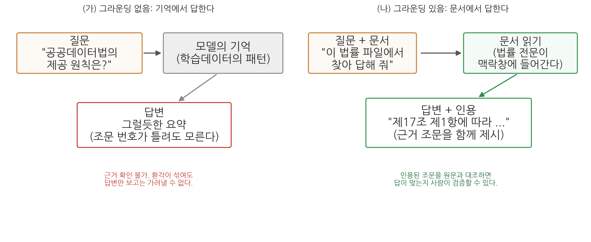
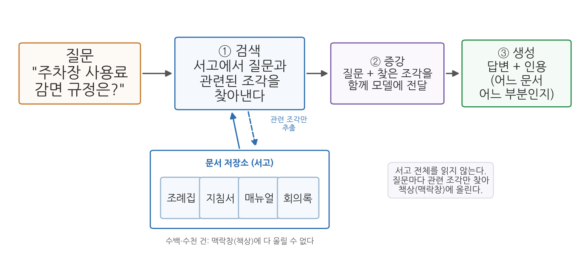
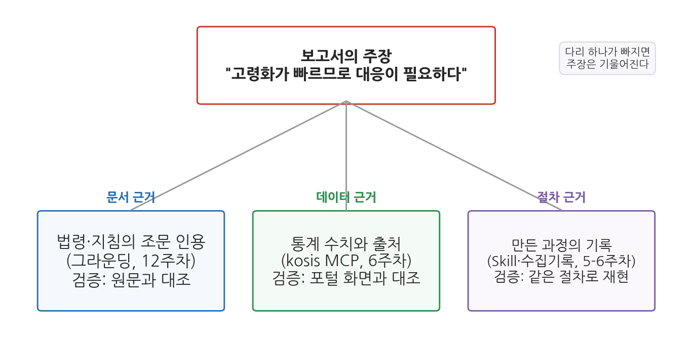

# 12주차 1회차. 문서 그라운딩과 RAG

> 신뢰하라, 그러나 검증하라.
> (러시아 속담. 로널드 레이건 미국 대통령이 즐겨 인용했다)

## 이 장에서 배우는 것

구청 인턴 생활도 두 달째다. 이번에는 과장이 이런 질문을 들고 왔다. "민간 업체가 우리 구의 주차장 데이터를 받아서 유료 앱을 만들겠다는데, 이거 법적으로 줘도 되는 건가? 영리 목적인데?" 여러분은 에이전트에게 물어볼 수 있다. 그리고 에이전트는 분명히 그럴듯한 답을 줄 것이다. 문제는 그다음이다. 과장에게 "AI가 된다고 했습니다"라고 보고할 수는 없다. 행정의 답변에는 근거 조문이 붙어야 한다. "「공공데이터의 제공 및 이용 활성화에 관한 법률」 제3조 제4항에 따르면 영리적 이용도 원칙적으로 제한할 수 없습니다"처럼, 누구든 원문을 펴서 확인할 수 있는 답이어야 한다.

2주차에서 우리는 에이전트가 기억에서 답할 때 환각이 생긴다는 것을 배웠고, 실습에서 직접 목격도 했다. 이 장의 전반부는 그 문제의 해법을 다룬다. 에이전트에게 문서를 주고, 그 문서에 근거해서만, 인용과 함께 답하게 만드는 방법이다. 이를 그라운딩이라 부른다.

후반부는 그라운딩을 두 방향으로 확장한다. 하나는 규모다. 문서가 한두 개가 아니라 수백, 수천 개라면 책상(맥락창)에 다 올릴 수 없다. 이때 필요한 발상이 RAG(검색 증강 생성)다. 실무에서 "우리 기관 챗봇은 RAG 기반입니다" 같은 말을 점점 자주 듣게 될 텐데, 그 구조를 원리 수준에서 이해한다. 다른 하나는 근거의 종류다. 보고서의 주장에는 문서 근거만 필요한 것이 아니다. 통계 근거와 절차 근거도 필요하며, 여기서 6주차에 배운 MCP와 5주차에 배운 Skill이 다시 등장한다. 다음 회차 실습에서 이 셋을 묶어 "근거 있는 답"을 실제로 만들어 본다.

이 장에서 구체적으로 다음을 배운다.

- 그라운딩이 무엇이고, 왜 환각을 줄이는지 (2주차와 연결)
- 법령·정책문서를 다루는 에이전트에게 인용과 출처를 요구하는 방법
- RAG의 세 단계(검색·증강·생성)와, 에이전트식 그라운딩과의 관계
- 주장을 받치는 세 종류의 근거: 문서(그라운딩), 데이터(MCP), 절차(Skill)

<strong>이 장의 로드맵</strong> 
이 장은 하나의 질문을 따라 전개된다. <em>"에이전트의 답을 어떻게 검증 가능한 근거 위에 세우는가?"</em>  
<strong>1.1</strong> 그라운딩: 기억이 아니라 문서에서 답하게 한다 →
<strong>1.2</strong> 법령 해석 에이전트: 인용과 출처를 요구한다 →
<strong>1.3</strong> RAG: 서고가 클 때는 검색해서 근거를 찾는다 →
<strong>1.4</strong> 근거의 삼각대: 문서, 데이터, 절차를 갖춘다.

## 1.1 그라운딩: 문서에 근거해 답하게 만들기

### 닫힌책 시험과 열린책 시험

2주차의 환각 실습을 떠올려 보자. "웹 검색이나 파일 확인 없이, 기억만으로" 의성군의 고령인구비율을 물었을 때, 에이전트는 그럴듯한 수치를 만들어 내거나 답을 유보했다. 반대로 데이터 파일을 주고 "이 파일에서 찾아서 답해 줘"라고 하면 정확한 값이 나왔다. 같은 원리가 법령이나 정책문서 같은 텍스트에도 그대로 적용된다.

시험에 비유하면 이렇다. 기억만으로 답하게 하는 것은 닫힌책 시험이다. 공부를 많이 한 학생(학습데이터가 풍부한 주제)은 잘 답하지만, 공부가 얕은 부분(자료가 드문 좁은 주제)에서는 어렴풋한 기억으로 답안을 채운다. 문서를 주고 답하게 하는 것은 열린책 시험이다. 책을 펴 놓고 해당 쪽을 찾아 읽고 답하므로, 기억이 흐려도 답이 정확해진다. 게다가 "몇 쪽에서 찾았는지"를 적게 하면 채점자가 대조할 수도 있다.

이렇게 AI의 답변을 주어진 자료에 붙들어 매는 것을 그라운딩(grounding)이라 부른다. 영어 ground(땅에 대다, 근거를 두다)에서 온 말로, 답변이 모델의 기억이라는 허공이 아니라 확인 가능한 문서라는 땅을 딛고 서게 한다는 뜻이다.

<strong>정의 · 그라운딩</strong> 
<strong>그라운딩</strong>(grounding)은 AI가 기억(학습데이터의 패턴)이 아니라 사용자가 제공한 자료(문서, 데이터, 웹페이지 등)에 근거해 답하도록 만드는 것이다. 자료를 맥락창에 넣어 주고, 그 자료의 범위 안에서 답하게 하며, 근거의 위치(조문, 쪽, 행)를 함께 제시하게 하는 세 요소로 이루어진다.

그림 12-1이 두 방식을 비교한다. 왼쪽(가)에서는 질문이 모델의 기억으로 들어가 그럴듯한 답변이 나온다. 답변만 보고는 환각이 섞였는지 가려낼 수 없다. 오른쪽(나)에서는 질문과 함께 문서가 주어지고, 에이전트가 문서를 읽은 뒤 근거 조문을 인용하며 답한다. 여기서 알 수 있는 핵심은 인용의 역할이다. 인용이 붙는 순간, 사용자는 인용된 부분을 원문과 대조해 답의 옳고 그름을 직접 확인할 수 있게 된다. 그라운딩은 환각을 줄이는 기술이면서 동시에 검증을 가능하게 만드는 기술이다.

### 그라운딩의 재료는 맥락창에 들어가야 한다

그라운딩이 작동하는 원리는 2주차의 맥락창으로 설명된다. 에이전트가 문서 파일을 읽으면 그 내용이 맥락창(작업 기억)에 들어가고, 이후의 답변은 그 내용을 참조해 생성된다. 기억 속의 흐릿한 패턴 대신 방금 읽은 선명한 원문이 눈앞에 있으니, "다음에 올 그럴듯한 말"이 원문과 일치하는 방향으로 강하게 끌려가는 것이다.

여기서 두 가지 실용적 결론이 나온다. 첫째, 문서를 주지 않고 "공공데이터법에 따르면"이라고 묻는 것은 그라운딩이 아니다. 에이전트가 실제로 그 법률 파일을 읽는 행동(도구 사용 로그에 파일 읽기가 나타나는 것)을 확인해야 한다. 둘째, 문서가 아주 길면 주의가 필요하다. 수백 쪽짜리 문서 여러 개를 한꺼번에 읽히면 맥락창이 가득 차고, 대화가 길어지면 앞서 읽은 내용이 밀려날 수 있다. 필요한 부분만 발췌해 주거나, 문서를 나누어 다루는 것이 안전하다. 그리고 문서가 아예 서고 수준으로 많다면, 1.3절의 RAG가 필요해진다.

<strong>유의 · 그라운딩은 환각을 줄이지, 없애지 않는다</strong> 
문서를 줘도 에이전트는 틀릴 수 있다. 문서를 읽고도 두 조문을 뒤섞어 요약하거나, 문서에 없는 내용을 아는 지식으로 슬쩍 보충하거나, "제17조"를 "제7조"로 잘못 옮겨 적는 일이 있다. 그래서 그라운딩 지시에는 반드시 두 가지를 함께 넣는다. <strong>"문서에 없는 내용은 없다고 답하라"</strong>는 범위 제한과, <strong>"근거 조문의 번호와 원문을 함께 인용하라"</strong>는 검증 고리다. 인용이 있어야 사람이 대조할 수 있고, 대조할 수 있어야 믿을 수 있다.

## 1.2 법령·정책문서 해석 에이전트: 인용과 출처

### 공공데이터 분석가가 법령을 만나는 순간

법령 해석은 법률가의 일 아닌가 싶겠지만, 공공데이터를 다루는 사람은 생각보다 자주 법령과 지침을 마주친다. 이 데이터를 개방해도 되는지(공공데이터법), 개인정보가 섞여 있으면 어떻게 해야 하는지(개인정보 보호법), 통계를 인용할 때 지켜야 할 규칙은 무엇인지(통계법), 데이터 파일에 딸려 온 이용약관은 무슨 뜻인지. 6주차에서 공공데이터 생태계를 배울 때 이런 규범들이 배경에 있었다.

이 교재에서 반복해 등장한 「공공데이터의 제공 및 이용 활성화에 관한 법률」(약칭 공공데이터법)을 예로 삼자. 국가법령정보센터(law.go.kr)에서 누구나 전문을 볼 수 있다. 이 법의 제1조는 법 전체의 목적을 이렇게 선언한다.

> **제1조(목적)** 이 법은 공공기관이 보유·관리하는 데이터의 제공 및 그 이용 활성화에 관한 사항을 규정함으로써 국민의 공공데이터에 대한 이용권을 보장하고, 공공데이터의 민간 활용을 통한 삶의 질 향상과 국민경제 발전에 이바지함을 목적으로 한다.

제2조는 용어를 정의한다. 우리가 한 학기 내내 써 온 "공공데이터"라는 말의 법적 정의가 여기에 있다.

> **제2조(정의) 제2호** "공공데이터"란 데이터베이스, 전자화된 파일 등 공공기관이 법령 등에서 정하는 목적을 위하여 생성 또는 취득하여 관리하고 있는 광(光) 또는 전자적 방식으로 처리된 자료 또는 정보를 말한다.

그리고 제3조가 제공의 기본원칙을, 제17조가 제공대상의 범위를 정한다. 도입부의 과장 질문("영리 목적인데 줘도 되나?")에 대한 근거가 바로 제3조 제4항이다. 공공기관은 다른 법률에 특별한 규정이 있는 경우 등을 제외하고는 공공데이터의 영리적 이용을 금지하거나 제한해서는 안 된다는 내용이다. 또 제17조 제1항은 공공기관의 장이 보유·관리하는 공공데이터를 국민에게 제공하여야 한다는 원칙을 밝히되, 비공개 대상 정보 등이 포함된 경우를 예외로 둔다. (이상 법률 제19408호, 2023. 11. 17. 시행 기준. 법령은 개정되므로 인용 시점의 현행 여부를 국가법령정보센터에서 확인해야 한다.)

### 인용을 요구하는 지시의 짜임새

이런 법률 전문을 파일로 저장해 에이전트에게 주면, 법령 질문에 근거를 붙여 답하는 해석 도우미가 만들어진다. 이때 지시문의 짜임새가 답변의 품질을 좌우한다. 3주차에서 배운 다섯 요소(역할·맥락·과제·제약·산출물)에 그라운딩 특유의 제약을 더한 것이 표 12-1이다.

**표 12-1. 법령 해석 에이전트에게 주는 그라운딩 지시의 구성**

| 구성 요소 | 내용 | 지시문 예 |
|------|------|------|
| 재료 지정 | 어느 파일에 근거할지 명시 | "data/laws 폴더의 공공데이터법.txt를 읽고" |
| 범위 제한 | 문서 밖 지식으로 답하지 않게 | "이 파일에 없는 내용은 '문서에서 확인되지 않는다'고 답해" |
| 인용 요구 | 근거의 위치와 원문 제시 | "근거가 되는 조문 번호와 해당 문장을 그대로 인용해" |
| 해석 분리 | 원문과 에이전트의 해석을 구분 | "원문 인용과 너의 해석을 구분해서 써" |
| 한계 고지 | 답변의 성격을 명시 | "이 답변이 법적 자문이 아니라는 점을 끝에 밝혀" |

특히 "해석 분리"가 중요하다. 법조문은 원문 그대로는 딱딱해서, 에이전트가 풀어 설명한 문장이 답변의 대부분을 차지하게 된다. 풀어 쓴 문장은 에이전트의 생성물이므로 오해나 과잉 일반화가 스밀 수 있다. 원문 인용과 해석이 구분되어 있으면, 독자는 "인용은 대조로 검증하고, 해석은 인용과 견주어 검증"할 수 있다.

<strong>왜 조문 번호까지 요구하는가?</strong> 
"법에 그렇게 되어 있다"는 답과 "제3조 제4항에 그렇게 되어 있다"는 답의 차이는 검증 비용이다. 앞의 답을 검증하려면 법률 전체를 읽어야 하지만, 뒤의 답은 해당 조문 하나만 펴 보면 된다. 검증 비용이 낮을수록 검증이 실제로 이루어지고, 검증이 이루어질 것을 "아는" 구조에서는 지어낸 인용이 설 자리가 좁아진다. 학술 논문이 출처 표기를 요구하는 것과 같은 원리다. 인용 요구는 에이전트를 위한 것이 아니라, <strong>검증하는 사람을 위한 장치</strong>다.

<strong>유의 · 에이전트의 법령 답변은 참고자료이지 유권해석이 아니다</strong> 
그라운딩을 잘해도 에이전트의 답변은 "문서를 잘 읽은 참고 의견"의 지위를 넘지 못한다. 법령의 공식 해석은 소관 부처와 법제처의 몫이고, 개별 사안의 판단은 판례와 구체적 사실관계에 달려 있다. 실무에서 법적 판단이 걸린 사안이라면, 에이전트의 답은 관련 조문을 빨리 찾아 주는 초벌 조사로 쓰고 최종 확인은 법제처 법령해석이나 전문가에게 맡겨야 한다. 5주차에서 배운 "자동화의 경계"가 여기서도 그대로 적용된다.

## 1.3 RAG: 서고가 클 때는 검색해서 근거를 찾는다

### 책상에 다 올릴 수 없는 날이 온다

그라운딩의 기본형은 단순하다. 문서를 읽혀서 맥락창에 넣는다. 공공데이터법 한 부라면 이걸로 충분하다. 그런데 실무의 서고는 금방 커진다. 우리 시의 자치법규 전체(수백 건), 지난 5년의 보도자료, 민원 상담 기록 수만 건. 2주차에서 배웠듯 맥락창은 한정된 책상이라, 이 서고를 통째로 올릴 수 없다. 그렇다고 질문마다 사람이 관련 문서를 골라 주는 것도 한계가 있다. 어느 문서에 답이 있는지 모르는 것이 바로 문제이기 때문이다.

도서관 사서를 떠올려 보자. 이용자가 "주차장 사용료 감면 규정이 궁금해요"라고 물으면, 사서는 서고의 책을 전부 읽지 않는다. 검색 시스템으로 관련된 책 몇 권을 찾아 책상에 올려놓고, 그것을 펴서 답한다. AI 시스템에 이 사서의 방식을 구현한 것이 RAG다.

<strong>정의 · RAG (검색 증강 생성)</strong> 
<strong>RAG</strong>(Retrieval-Augmented Generation, 검색 증강 생성)는 AI가 답을 생성하기 전에, 먼저 문서 저장소에서 질문과 관련된 부분을 검색해 찾아내고(검색), 그 발췌를 질문과 함께 모델에게 건네(증강), 그 근거 위에서 답을 만들게 하는(생성) 방식이다. 서고 전체를 맥락창에 넣는 대신, 질문마다 필요한 조각만 골라 넣는 그라운딩의 확장판이다.

그림 12-2가 그 흐름이다. 왼쪽에서 질문이 들어오면, 곧바로 모델에게 가는 것이 아니라 먼저 문서 저장소를 향한다(① 검색). 저장소에서 질문과 관련성이 높은 문서 조각들이 뽑혀 나오고, 이 조각들이 질문과 함께 묶여 모델에게 전달된다(② 증강). 모델은 그 근거를 딛고 인용이 달린 답을 만든다(③ 생성). 여기서 알 수 있는 것은, RAG의 답변 품질이 생성 단계 이전에 검색 단계에서 절반쯤 결정된다는 점이다. 검색이 엉뚱한 조각을 가져오면, 생성이 아무리 좋아도 답은 틀린다.

### 검색은 어떻게 "관련된" 조각을 찾는가

검색 단계의 기술을 개념만 짚어 두자. 가장 단순한 방법은 키워드 검색이다. 질문의 단어가 들어 있는 문서를 찾는 것인데, "주차 요금"으로 검색하면 "주차장 사용료"라고 쓴 규정을 놓치는 약점이 있다. 그래서 현대의 RAG는 의미 검색을 함께 쓴다. 문장을 그 뜻이 담긴 숫자 목록(임베딩, embedding)으로 바꿔 두면, 단어가 달라도 뜻이 가까운 문장들이 수치상 가까워진다. "주차 요금"과 "주차장 사용료"가 이웃으로 붙는 것이다. 이렇게 뜻 기반 검색이 되도록 문서 조각들을 미리 변환해 쌓아 둔 저장소를 벡터 데이터베이스라 부른다. 용어까지 외울 필요는 없다. "미리 색인해 둔 서고에서, 단어가 아니라 뜻으로 찾는다"가 알맹이다.

그런데 이 구조, 어딘가 낯익지 않은가. 여러분의 에이전트도 비슷한 일을 한다. 프로젝트 폴더에서 파일을 검색하고, 관련 파일을 골라 열어 읽고, 그 내용에 근거해 답한다. 미리 색인해 둔 저장소 대신 도구(파일 검색, 파일 읽기)로 그때그때 찾는다는 점이 다를 뿐, "다 읽지 않고, 관련된 것을 찾아 근거로 삼는다"는 정신은 같다. 그래서 이 과목에서 해 온 그라운딩은 RAG의 사촌이라 할 수 있다. 기관이 챗봇 서비스처럼 같은 서고에 수많은 질문을 반복해 받는 시스템을 만들 때는 색인형(RAG)이 유리하고, 여러분처럼 분석 프로젝트 폴더 안에서 일할 때는 에이전트의 즉석 탐색이 간편하다.

<strong>유의 · RAG도 환각을 없애지 못한다</strong> 
"우리 챗봇은 RAG 기반이라 정확합니다"라는 말은 절반만 믿어야 한다. RAG는 근거를 곁에 놓아 줄 뿐이며, 두 군데서 여전히 틀릴 수 있다. 첫째, <strong>검색이 놓치면</strong> 모델은 근거 없이(또는 엉뚱한 근거로) 답하게 된다. 둘째, 근거가 제대로 왔어도 <strong>생성이 근거를 비틀 수 있다</strong>. 조각을 뒤섞어 요약하거나 근거 밖 내용을 보태는, 1.1절에서 본 바로 그 문제다. 그래서 RAG 시스템의 답에도 이 장의 원칙이 그대로 적용된다. 인용(어느 문서 어느 부분에서 왔는가)을 표시하게 하고, 중요한 답은 사람이 원문과 대조한다.

## 1.4 근거의 삼각대: 문서(그라운딩), 데이터(MCP), 절차(Skill)

### 주장 하나에 근거는 세 종류

도입부 과장 질문의 답 메모를 완성한다고 하자. "영리 목적이라도 제공을 거부할 수 없습니다"라는 주장에 공공데이터법 제3조 제4항 인용을 붙였다. 문서 근거는 갖춰졌다. 그런데 좋은 보고서의 주장에는 대개 이것만으로 부족하다. "개방하면 실제로 쓰입니까?"라는 후속 질문에는 법조문이 아니라 통계가 필요하고, "이 메모의 숫자는 믿을 만합니까?"라는 질문에는 산출 과정의 기록이 필요하다. 정리하면, 공공부문 산출물의 주장은 세 다리 위에 선다.

**표 12-2. 근거의 삼각대**

| 근거의 종류 | 답하는 질문 | 이 과목의 도구 | 검증 방법 |
|------|------|------|------|
| 문서 근거 (규범·정책) | 무엇이 허용되고 요구되는가 | 그라운딩 (이 장) | 인용을 원문과 대조 |
| 데이터 근거 (사실·수치) | 실제로 얼마나, 어떻게 변하는가 | kosis MCP 수집 (6주차) | 값을 원천(포털 화면)과 대조 |
| 절차 근거 (산출 과정) | 이 결과를 어떻게 만들었는가 | Skill과 수집·검증 기록 (5-6주차) | 같은 절차로 재현 |

그림 12-3이 이 구조다. 가운데의 주장을 문서 근거, 데이터 근거, 절차 근거의 세 다리가 받친다. 여기서 알 수 있는 것은 다리 하나가 빠졌을 때의 모습이다. 문서 근거가 없으면 "좋아 보이는데 해도 되는 일인지" 모르고, 데이터 근거가 없으면 "말은 되는데 사실인지" 모르며, 절차 근거가 없으면 "숫자는 있는데 믿어도 되는지" 모른다. 삼각대는 다리 셋일 때만 선다.

### 배운 것이 여기서 합쳐진다

이 삼각대의 재료를 여러분은 이미 다 가지고 있다. 문서 근거는 이 장의 그라운딩 지시(표 12-1)로 만든다. 데이터 근거는 6주차의 kosis MCP로 만든다. MCP 수집의 미덕이 여기서 다시 빛난다. 에이전트가 통계를 원천(KOSIS)에서 직접 조회해 오고 출처 링크까지 함께 남기므로, 기억으로 지어낸 수치가 끼어들 틈이 좁다. 절차 근거는 5주차의 방식대로 만든다. 근거를 만드는 과정 자체를 Skill로 표준화하고, 수집·검증 기록을 남기는 것이다.

다음 회차 실습이 정확히 이 조립이다. 법령 파일을 그라운딩해 조문 인용을 받고, kosis MCP로 통계 근거를 붙이고, 이 절차 전체를 "근거 메모"라는 스킬 하나로 묶는다. 학기 초에 따로따로 배운 도구들이 근거 있는 산출물이라는 하나의 목적 아래 처음으로 합쳐지는 실습이며, 이 조합은 13주차의 파이프라인과 14주차의 최종 보고서로 그대로 이어진다.

## 요약

에이전트가 기억에서 답하면 환각의 위험을 감수하는 것이다(2주차). 그라운딩은 문서를 맥락창에 넣어 주고, 문서의 범위 안에서, 근거 위치를 인용하며 답하게 만드는 기술로, 환각을 줄이는 동시에 사람의 검증을 가능하게 한다. 법령·정책문서를 다룰 때는 재료 지정, 범위 제한, 인용 요구, 해석 분리, 한계 고지를 지시에 넣으며, 그래도 에이전트의 답변은 유권해석이 아닌 참고자료다. 문서가 서고 수준으로 많아 맥락창에 다 들어가지 않을 때는 RAG(검색 증강 생성)를 쓴다. 질문과 관련된 문서 조각을 검색하고, 질문에 붙여 증강하고, 그 근거 위에서 생성하는 세 단계로, 답변 품질의 절반은 검색 단계에서 결정되며 RAG라도 인용 확인은 여전히 사람의 몫이다. 에이전트가 파일을 찾아 읽으며 답하는 이 과목의 그라운딩은 RAG와 같은 정신("다 읽지 않고 관련된 것을 찾아 근거로 삼는다")의 즉석 탐색판이다. 마지막으로 공공부문 산출물의 주장은 문서 근거(그라운딩), 데이터 근거(kosis MCP), 절차 근거(Skill과 기록)의 삼각대 위에 서며, 다음 회차에서 이 셋을 하나의 절차로 조립한다.

## 연습문제

**12-1. 그라운딩 설계.** 후배가 에이전트에게 "개인정보 보호법상 가명정보가 뭐야?"라고 물어 받은 답을 그대로 과제에 옮겨 적으려 한다. 이 질문을 그라운딩된 질문으로 바꾸려면 (1) 무엇을 준비해서 (2) 지시문을 어떻게 고쳐야 하는지 쓰고, (3) 받은 답을 어떻게 검증할지 한 문장으로 써 보라.

**12-2. RAG 고장 진단.** 어느 시청의 민원 안내 챗봇은 시 자치법규 전체를 저장소로 삼는 RAG 시스템이다. 민원인이 "반려동물 놀이터 이용 시간"을 물었는데 챗봇이 틀린 답을 했다. (a) 이 시스템 내부에서 일어나는 세 단계를 순서대로 설명하라. (b) 틀린 답의 원인이 될 수 있는 지점을 검색 단계와 생성 단계에서 하나씩 들고, 각각을 어떻게 확인할 수 있을지 써 보라.

**12-3. 근거의 삼각대.** "우리 시는 고령화가 빠르게 진행되고 있으므로 노인 교통복지 예산을 확대할 필요가 있다"라는 보고서 문장이 있다. 표 12-2의 세 근거를 이 문장에 적용해, 각각 (1) 무엇을 근거로 삼을지, (2) 이 과목의 어느 도구로 확보할지, (3) 어떻게 검증할지를 표로 정리해 보라.
