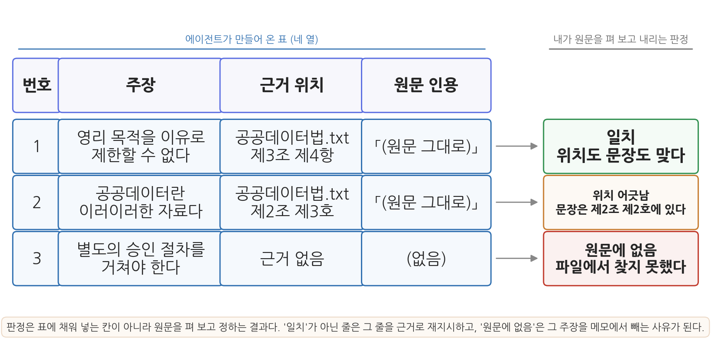
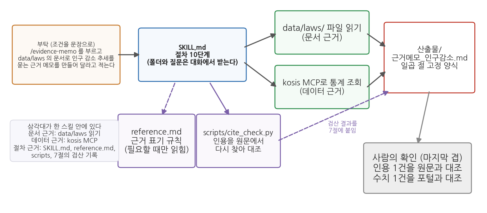

# 12주차 2회차. Skill과 MCP로 근거 있는 답 만들기

## 이 실습에서 하는 것

1회차에서 그라운딩(문서에 근거해 답하게 만들기)과 RAG, 그리고 근거의 삼각대(문서·데이터·절차)를 배웠다. 오늘은 그 삼각대를 실제로 조립한다. 1회차에서 배운 개념은 그것이 필요한 단계에서 화면에 나온 결과를 놓고 다시 짚는다. 단계마다 있는 "먼저 알아 둘 것"과 "짚고 가기"가 그 자리다. 전반부에서는 실제 법률 전문을 에이전트에게 주고 조문을 인용하는 답을 받아 본 뒤, 이 법이 무엇을 어느 조문에서 정하고 있는지 한 장짜리 항목 색인을 만든다. 이어서 답변의 주장을 한 줄씩 근거 위치와 맞대 보는 인용 대조표를 에이전트에게 만들게 하고, 문서가 둘로 늘었을 때 어느 문서에서 근거를 찾았는지 보고하게 한다. 후반부에서는 6주차에 등록해 둔 kosis MCP로 통계 근거를 붙이고, 근거 표기 규칙을 정해 손으로 검산한 뒤, 정의를 묻는 질문과 수치를 묻는 질문과 문서에 답이 없는 질문 셋에 같은 절차를 돌려 본다. 마지막으로 이 근거 만들기 절차 전체를 4주차에서 배운 방식대로 하나의 Skill로 표준화하고, 인용을 원문에서 다시 찾는 검산 스크립트를 붙이고, 새 대화에서 독립 검산까지 마친다.

이 실습이 끝나면 다음 산출물이 남는다.

- `data/laws/공공데이터법.txt`: 그라운딩 재료로 쓴 법률 전문
- `data/laws/데이터제공지침_예시.txt`: 두 번째 문서 (수업용으로 만든 가상의 지침)
- `산출물/법령색인_공공데이터법.md`: 어느 사항이 어느 조문에 있는지 정리한 항목 색인
- `산출물/근거메모_인구감소.md`, `산출물/근거메모_주차장.md`: 통계 근거가 붙은 메모와 법령 근거가 붙은 메모
- `.claude/skills/evidence-memo/`: 근거 메모 절차를 표준화한 Skill (`SKILL.md`, `reference.md`, `scripts/cite_check.py`)
- 에이전트가 만드는 인용 대조표와 새 대화의 독립 검산 대조표, 그리고 선택 심화로 만드는 종합 근거 메모

오늘의 실습은 답을 받는 데서 끝나지 않고, 그 답의 근거를 원문에서 직접 확인하는 데까지 간다. 특히 2.2의 색인과 2.3의 인용 대조에서는 에이전트가 틀리는 장면을 마주치게 되는데, 틀린 답이 나오면 실망할 일이 아니라 고칠 자리를 찾은 것이다.

## 준비물

| 구분 | 내용 |
|------|------|
| 폴더 | 학기 프로젝트 폴더 (안에 data, code, 산출물 폴더) |
| 데이터 1 | 「공공데이터의 제공 및 이용 활성화에 관한 법률」 전문. 국가법령정보센터(law.go.kr)에서 2.1 단계에 따라 직접 저장 (법률 제19408호, 2023. 11. 17. 시행 기준) |
| 데이터 2 | `data/laws/데이터제공지침_예시.txt`. 2.4 단계에서 에이전트에게 만들게 하는 가상의 지침 문서 (수업용 예시) |
| 데이터 3 | kosis MCP로 실습 중 직접 조회 (6주차에 등록한 서버. `/mcp`로 연결 상태 미리 확인) |
| 도구 | VSCode + Claude Code 확장, uv 기반 Python 환경 (3주차) |
| 선수 내용 | 12주차 1회차 (그라운딩, RAG, 근거의 삼각대), 6주차 (kosis MCP 등록·수집, kosis-collect 스킬), 4주차 (SKILL.md 만들기), 3주차 (uv로 파이썬 실행), 2주차 2회차 (검증 손잡이 실험, 새 대화 독립 검산) |

## 2.1 법령·지침 문서를 주고 근거 있는 답 받기

**무엇을 왜 하는가.** 첫 단계는 그라운딩의 재료 만들기다. 국가법령정보센터(law.go.kr)에 접속해 "공공데이터의 제공 및 이용 활성화에 관한 법률"을 검색하고, 법령 본문 화면에서 전체 조문을 복사한다. VSCode에서 새 파일 `data/laws/공공데이터법.txt`를 만들어 붙여 넣고 저장한다. 파일 맨 위에 출처와 기준을 한 줄 적어 두면 좋다 ("출처: 국가법령정보센터, 법률 제19408호, 시행 2023. 11. 17."). 법령은 개정되므로, 여러분이 접속한 시점의 현행 법령 번호를 화면에서 확인해 그대로 적는다.

재료를 사람이 직접 확인해서 준다는 점이 중요하다. 이 한 줄의 출처 표기가 앞으로 만들 모든 근거 메모의 뿌리가 된다. 어떤 판의 법령을 읽고 답한 것인지 적혀 있지 않으면, 옳은 인용인지 옛 조문인지 나중에 가릴 방법이 없다.

파일이 준비되면 1회차 도입부 과장의 질문을 그라운딩된 형태로 던져 본다.

**먼저 알아 둘 것.** 지금부터 던지는 질문은 닫힌책 시험이 아니라 열린책 시험이다. 에이전트에게 법률 파일을 먼저 읽히면 그 내용이 맥락창에 올라가고, 답은 기억 속의 흐릿한 패턴이 아니라 방금 읽은 원문을 참조해 만들어진다. 이것이 그라운딩이고, 세 요소로 이루어진다. 자료를 준다, 그 자료의 범위 안에서만 답하게 한다, 근거의 위치를 함께 적게 한다. 아래 지시문에서는 파일 경로를 지정한 첫 문장이 첫째를, 규칙 (1)이 둘째를, 규칙 (2)가 셋째를 맡는다.

<div style="border:1px solid #cdd9e5;border-left:5px solid #2f6fb0;background:#f5f9fd;padding:12px 16px;margin:18px 0;border-radius:4px;">
<strong>정의 · 그라운딩</strong><br>
<strong>그라운딩</strong>(grounding)은 AI가 기억(학습데이터의 패턴)이 아니라 사용자가 제공한 자료(문서, 데이터, 웹페이지 등)에 근거해 답하도록 만드는 것이다. 자료를 맥락창에 넣어 주고, 그 자료의 범위 안에서 답하게 하며, 근거의 위치(조문, 쪽, 행)를 함께 제시하게 하는 세 요소로 이루어진다.
</div>

<div style="border:1px solid #cfe3d4;border-left:5px solid #2f8f4e;background:#f4fbf6;padding:12px 16px;margin:18px 0;border-radius:4px;">
<strong>지시문 예시</strong><br>
"data/laws/공공데이터법.txt 파일을 읽고 다음 질문에 답해 줘. 질문: 민간 업체가 구청의 주차장 데이터를 받아 유료 앱을 만들려고 한다. 공공기관이 영리 목적이라는 이유로 제공을 거부할 수 있는가?<br><br>
규칙: (1) 반드시 이 파일의 내용에만 근거해서 답할 것. 파일에 없는 내용은 '문서에서 확인되지 않는다'라고 말할 것. (2) 근거가 되는 조문의 번호와 해당 문장을 원문 그대로 인용할 것. (3) 원문 인용과 너의 해석을 구분해서 쓸 것. (4) 답변 끝에 이 답변이 법적 자문이 아니며 최종 판단은 소관 기관 확인이 필요하다는 점을 밝힐 것."
</div>

**예상되는 에이전트의 행동과 결과.** 도구 사용 로그에 파일 읽기가 먼저 나타난다. 이것이 그라운딩의 물증이다. 파일이 길면 여러 번에 나누어 읽는 호출이 이어지기도 한다. 이어서 제3조(기본원칙)의 영리적 이용 관련 항과 제17조(제공대상 공공데이터의 범위) 등을 인용하며, "원칙적으로 영리적 이용을 이유로 거부할 수 없으나, 제외 사유에 해당하는 정보가 포함되면 다르다"는 취지의 답이 온다. 화면의 모양은 대략 다음과 같다. 인용문 자리는 여러분 파일에서 확인해야 하는 부분이라 비워 두었다.

```text
[근거 조문]
공공데이터법.txt 제3조 제4항
「(원문 그대로 옮긴 문장. 여러분 파일의 문장과 글자까지 같아야 한다)」
공공데이터법.txt 제17조 제1항
「(원문 그대로 옮긴 문장)」

[해석]
위 두 조문을 함께 읽으면, 영리 목적이라는 사유만으로는 제공을 거부하기 어렵다.
다만 제공 대상에서 제외되는 정보가 섞여 있는 경우는 따로 판단해야 한다.

[한계]
이 답변은 법적 자문이 아니며, 최종 판단은 소관 기관 확인이 필요하다.
```

**짚고 가기: 다섯 요소가 화면의 세 덩어리로 돌아온다.** 방금 받은 답을 지시문과 나란히 놓고 보면, 1회차 표 12-1이 말한 그라운딩 지시의 다섯 요소가 화면 어디에 나타났는지 하나씩 짚인다. 맨 먼저 도구 사용 로그에 뜬 파일 읽기가 재료 지정의 결과다. 이 줄이 없으면 나머지가 아무리 그럴듯해도 그라운딩이 아니라 기억에서 나온 답이다. `[근거 조문]` 덩어리는 인용 요구가, `[해석]` 덩어리는 해석 분리가, `[한계]` 덩어리는 한계 고지가 만들어 낸 것이다. 범위 제한만 아직 화면에 보이지 않는데, 파일에 없는 것을 물어야 비로소 "문서에서 확인되지 않는다"는 모습으로 나타나기 때문이다. 잠시 뒤 검증에서 그것을 확인한다.

세 덩어리로 나뉜 이 모양이 오늘 계속 쓰게 될 답변의 기본형이다. 나뉘어 있어야 검증 방법이 갈라지기 때문이다. 인용은 원문과 대조해서 검증하고, 해석은 그 인용에서 따라 나오는지를 보아 검증하며, 한계 고지는 이 문서의 지위를 밝힌다. 세 덩어리가 섞여 한 문단으로 나왔다면 규칙 (3)이 지켜지지 않은 것이므로 "인용과 해석을 절로 나눠서 다시 써 줘"라고 재지시한다. (자세한 설명은 1회차 1.1, 1.2, 표 12-1)

**검증.** 에이전트가 인용한 조문을 하나 골라 원문과 대조한다. 세 가지를 본다. (1) 인용된 조문 번호가 실제로 존재하는가. (2) 인용문이 원문과 같은가 (요약이나 변형을 인용처럼 표시하지 않았는가). (3) 에이전트의 해석이 인용된 원문에서 실제로 따라 나오는가. 셋째가 특히 사람의 몫이다. 조문을 정확히 옮겨 놓고도 그 조문이 말하지 않은 결론을 붙일 수 있기 때문이다. 하나라도 어긋나면 어긋난 자리를 짚어 "제3조 인용이 원문과 다르다. 원문을 다시 확인해서 고쳐 줘"라고 재지시해 보라.

한 걸음 더. 파일에 없는 것도 물어보라. 문서 맨 끝 조문보다 큰 번호를 하나 골라 "이 법 제○○조의 내용을 알려 줘"라고 묻는 것이다. 범위 제한 규칙이 잘 걸려 있다면 "문서에서 확인되지 않는다"는 답이 와야 한다. 그럴듯한 조문을 지어내면, 확인 없이 생성된 답이 그라운딩 지시의 틈을 뚫고 나온 장면이다. 이 장면은 2.3에서 본격적으로 다룬다.

## 2.2 법령 항목 색인 만들기: 어느 사항이 어느 조문에 있는가

**무엇을 왜 하는가.** 2.1에서는 질문 하나에 답 하나를 받았다. 그런데 실무에서 같은 법률에 던지는 질문은 하나로 끝나지 않는다. 이번 주에는 영리 목적 제공을 묻고, 다음 주에는 제공 범위를 묻고, 보고서를 쓰다가 또 정의 조문을 찾는다. 질문이 올 때마다 전문을 처음부터 훑는 대신, 이 법이 무엇을 어느 조문에서 정하고 있는지 한 장짜리 색인을 만들어 두면 그다음부터는 색인을 펴는 것으로 시작할 수 있다. 오늘 만드는 색인은 오늘 하루짜리가 아니다. 2.4에서 문서가 둘로 늘 때 비교할 기준이 되고, 2.8의 스킬이 문서 근거를 적을 때 같은 표기를 쓰며, 14주차 최종 보고서에서 법령을 인용할 때 그대로 꺼내 쓴다.

색인에 넣을 사항은 분석가가 이 법에서 실제로 찾아볼 만한 것들로 고른다. 네 가지는 아래 지시문에 적어 두었고, 다섯째 자리는 여러분의 학기 프로젝트에서 궁금한 사항 하나를 직접 적는다.

<div style="border:1px solid #cfe3d4;border-left:5px solid #2f8f4e;background:#f4fbf6;padding:12px 16px;margin:18px 0;border-radius:4px;">
<strong>지시문 예시</strong><br>
"data/laws/공공데이터법.txt를 읽고 이 법의 항목 색인을 만들어 산출물/법령색인_공공데이터법.md 로 저장해 줘. 표의 열은 (1) 번호, (2) 사항, (3) 근거 조문, (4) 원문 인용, (5) 확인한 낱말, 이렇게 다섯 개야.<br><br>
사항은 다음 다섯이야. ① 이 법의 목적 ② '공공데이터'의 법적 정의 ③ 영리 목적을 이유로 제공을 제한할 수 있는지 ④ 제공 대상이 되는 공공데이터의 범위와 그 예외 ⑤ (여기에 내가 궁금한 사항을 한 줄로 적는다)<br><br>
규칙: (1) 이 파일에서 읽은 내용만 쓸 것. 다른 법령이나 아는 지식으로 보충하지 말 것. (2) 근거 조문은 항과 호까지 적고, 원문 인용은 파일의 문장을 그대로 옮길 것. 읽기 쉽게 다듬거나 줄이지 말 것. (3) 이 파일에서 근거를 찾지 못한 사항은 근거 조문 칸에 '이 파일에서 확인되지 않음'이라고 적을 것. 비슷해 보이는 조문으로 대신 채우지 말 것. (4) 다섯째 열에는 그 사항을 찾을 때 파일에서 검색한 낱말을 적을 것. (5) 표 아래에 이 색인이 어느 파일의 어느 판을 읽고 만든 것인지 한 줄 적을 것. 파일 맨 위의 출처 줄을 그대로 옮기면 돼. (6) 표와 그 한 줄만 쓰고 해설은 붙이지 마."
</div>

**예상되는 에이전트의 행동과 결과.** 도구 사용 로그에 파일 읽기가 나타나고(파일이 길면 여러 번에 나누어 읽는다), 표 하나와 그 아래 한 줄이 온다. 화면의 모양은 다음과 같다. 원문 인용 자리는 여러분 파일에서 확인해야 하는 부분이라 비워 두었다.

```text
| 번호 | 사항 | 근거 조문 | 원문 인용 | 확인한 낱말 |
|---|---|---|---|---|
| 1 | 이 법의 목적 | 공공데이터법.txt 제1조 | 「...」 | 목적 |
| 2 | 공공데이터의 정의 | 공공데이터법.txt 제2조 제2호 | 「...」 | 정의, 공공데이터 |
| 3 | 영리 목적을 이유로 한 제한 | 공공데이터법.txt 제3조 제4항 | 「...」 | 영리 |
| 4 | 제공 대상의 범위와 예외 | 공공데이터법.txt 제17조 제1항 | 「...」 | 제공대상, 제외 |
| 5 | (내가 고른 사항) | ... | ... | ... |

이 색인은 data/laws/공공데이터법.txt(법률 제19408호, 시행 2023. 11. 17.)를 읽고 만들었다.
```

앞의 네 행은 2.1에서 이미 마주친 조문들이라 낯익을 것이다. 다섯째 행은 여러분이 고른 사항이므로 결과가 사람마다 갈린다. 해당 조문이 있으면 앞의 네 행과 같은 모양으로 채워지고, 찾지 못하면 근거 조문 칸에 "이 파일에서 확인되지 않음"이 적히고 다섯째 열에 어떤 낱말로 찾아봤는지가 남는다. 뒤의 경우가 나왔다고 해서 실습이 잘못된 것이 아니다. 하나의 법률이 그 주제의 모든 것을 정하지는 않으므로 답이 다른 법령이나 소관 기관의 지침에 있을 수 있고, 그런 사항을 근거 있는 답으로 다루는 법은 2.7에서 이어 본다. 중요한 것은 그 칸이 비어 있지 않고 "여기까지 찾아봤으나 없었다"고 적혀 있다는 점이다.

**틀리는 장면. 인용 칸이 요약으로 채워진다.** 법조문은 문장이 길고 괄호와 한자가 섞여 있어 그대로 옮기기가 번거롭다. 그래서 인용 칸에 "공공기관이 관리하는 전자적 자료를 말한다"처럼 매끄럽게 줄인 문장이 들어오는 일이 잦다. 내용이 크게 틀리지는 않았지만 낫표 안에 있는 이상 이것은 인용이 아니라 요약이고, 원문과 글자 단위로 대조할 수 없게 된다. **발견.** 인용 칸의 문장이 조문 특유의 투(호 번호, 괄호 속 한자, 긴 수식)를 잃고 매끄러워졌으면 의심하고, 그 문장의 앞부분으로 파일을 찾아본다. 그대로 나오지 않으면 요약이다. **재지시.** "2번 행의 인용이 원문과 다르다. 파일의 그 조문을 다시 읽고 줄바꿈까지 그대로 옮겨 줘. 읽기 쉽게 다듬지 마"라고 시킨다. 다시 온 표에서는 인용 칸이 길어지고 조문의 투가 그대로 남는다.

**짚고 가기: 거의 맞는 답은 원문을 펴기 전에는 가려지지 않는다.** 색인의 가운데 세 열(사항, 근거 조문, 원문 인용) 가운데 어느 하나만 빠져도 색인의 쓸모가 크게 준다. 사항과 인용만 있고 조문 번호가 없으면 그 인용을 확인하려고 법률 전체를 다시 뒤져야 하고, 사항과 조문 번호만 있고 인용이 없으면 그 조문이 정말 그 내용인지 알기 위해 또 파일을 열어야 한다. 셋이 함께 있을 때만 한 행을 확인하는 일이 조문 하나를 펴 보는 것으로 끝난다. 1회차에서 조문 번호까지 요구하는 이유로 든 검증 비용이 이 이야기다. 법령을 다룰 때 검증 비용이 특히 중요한 까닭은 틀림의 모양에 있다. 완전히 엉뚱한 답은 읽자마자 걸러지지만, 취지는 맞는데 호 번호가 하나 어긋났거나 개정 전 문구가 현행처럼 적힌 답은 원문을 펴 보기 전에는 가려낼 수 없다. 그리고 그런 답을 가려내는 데 1분이 걸리면 우리는 확인하고, 30분이 걸리면 확인하지 않는다. 근거의 위치를 집요하게 요구하는 것은 에이전트를 못 믿어서가 아니라, 확인이 실제로 일어날 만큼 싸게 만들기 위해서다. (자세한 설명은 1회차 1.2)

**검증.** ① 색인에서 한 행을 골라 원문과 대조한다. 조문 번호가 그 자리를 가리키는지, 인용이 요약으로 바뀌지 않았는지, 그리고 그 조문이 그 사항의 근거로 알맞은지를 본다. 셋째가 사람의 몫이다. 번호와 문장이 다 맞아도 그 사항과 상관없는 조문을 끌어온 경우가 있는데, 표만 보면 말끔해 보인다. ② "이 파일에서 확인되지 않음"으로 적힌 행이 있으면 다섯째 열에 찾아본 낱말이 적혀 있는지 본다. 정말 없는지를 사람이 되짚는 방법은 2.7에서 다룬다. ③ 표 아래 한 줄의 파일명과 법령 번호가 2.1에서 파일 맨 위에 적어 둔 출처와 같은지 본다.

<div style="border:1px solid #ecd9c6;border-left:5px solid #c77b2f;background:#fdf9f4;padding:12px 16px;margin:18px 0;border-radius:4px;">
<strong>유의 · 색인은 그 판의 색인이다</strong><br>
색인 맨 아래에 파일명과 법령 번호를 적게 한 데는 이유가 있다. 법령은 개정되고, 개정되면 조문 번호가 밀리거나 항이 새로 들어간다. 오늘 만든 색인은 오늘 읽은 판에 대해서만 맞는 문서다. 몇 달 뒤 같은 사항을 인용하면서 색인만 믿고 조문 번호를 옮겨 적으면 옛 번호를 현행처럼 쓰게 된다. <strong>색인은 원문으로 가는 지름길이지 원문의 대체물이 아니다.</strong> 보고서에 넣을 인용은 색인에서 위치를 찾고, 그 위치의 원문을 그때 다시 펴서 확인한다.
</div>

## 2.3 인용 검증표: 주장 하나에 근거 한 줄씩 대조하기

**무엇을 왜 하는가.** 2.1의 검증에는 빈틈이 있다. 인용 하나를 골라 대조했을 뿐, 답변의 나머지 문장들은 확인하지 않았다. 그런데 답변에서 분량을 차지하는 것은 인용이 아니라 해석이고, 해석 문장 사이에는 근거 표시가 없는 주장이 조용히 섞여 들어오기 쉽다. 그래서 답변을 통째로 읽지 말고 주장 단위로 쪼갠 다음, 주장마다 근거 위치를 붙이고, 그 위치를 원문에서 확인한다. 이 네 열짜리 표가 오늘 배우는 가장 실용적인 도구인 인용 검증표다.

표를 만드는 일은 에이전트에게 맡긴다. 답변을 주장 단위로 쪼개고 근거 위치를 옮겨 적는 것은 기계적인 일이기 때문이다. 사람의 몫은 그 표를 들고 원문으로 가는 일이다.

<div style="border:1px solid #cfe3d4;border-left:5px solid #2f8f4e;background:#f4fbf6;padding:12px 16px;margin:18px 0;border-radius:4px;">
<strong>지시문 예시</strong><br>
"방금 네가 준 답변을 주장 단위로 쪼개서 표로 만들어 줘. 열은 (1) 번호, (2) 주장 한 문장, (3) 근거 위치(파일명과 조문 번호), (4) 근거가 되는 원문 인용, 이렇게 네 개야.<br><br>
규칙: (1) 답변에 실제로 있던 문장만 쓰고 새 내용을 보태지 말 것. (2) 근거 위치를 댈 수 없는 주장은 근거 위치 칸에 '근거 없음'이라고 적고 그 행을 지우지 말 것. (3) 원문 인용은 파일에서 다시 확인해서 옮길 것. 기억으로 채우지 말 것. (4) 표만 출력하고 해설은 붙이지 마."
</div>

**예상되는 에이전트의 행동과 결과.** 도구 사용 로그에 파일 읽기가 한 번 더 나타나고(규칙 3 때문이다), 네 열짜리 표가 온다. 주장은 대개 세 개에서 다섯 개로 쪼개진다. 화면의 모양은 다음과 같다.

```text
| 번호 | 주장 | 근거 위치 | 원문 인용 |
|---|---|---|---|
| 1 | 영리 목적이라는 이유만으로 제공을 제한할 수 없다 | 공공데이터법.txt 제3조 제4항 | 「...」 |
| 2 | 다만 제공 대상에서 제외되는 정보는 따로 판단한다 | 공공데이터법.txt 제17조 제1항 | 「...」 |
| 3 | 별도의 승인 절차를 거쳐야 한다 | 근거 없음 | (없음) |
```

3번 행에 주목하라. 답변을 통째로 읽었을 때는 앞뒤 문장에 묻혀 지나쳤을 문장이, 표로 쪼개 놓으니 근거 없이 홀로 서 있다.



그림 12-4가 그 표와 판정이다. 읽는 법은 왼쪽에서 오른쪽이다. 왼쪽의 네 열이 방금 에이전트가 만들어 온 표이고, 화살표 건너 오른쪽에 떨어져 있는 것은 여러분이 원문을 펴 본 뒤 내리는 판정이다. 판정은 표에 채워 넣는 칸이 아니라 읽고 정하는 결과다. 세 행이 각각 다른 판정으로 간다. 첫 행은 위치도 문장도 맞는 일치, 둘째 행은 문장은 있는데 위치 표기가 틀린 위치 어긋남, 셋째 행은 그 문장 자체가 원문에 없는 경우다. 여기서 알 수 있는 것은 검증의 결과가 맞음과 틀림의 둘이 아니라 셋이라는 점이다. 위치 어긋남은 내용이 맞으므로 위치만 고치면 되지만, 원문에 없음은 그 주장을 메모에서 빼야 하는 사유다. 둘을 뭉뚱그려 "조금 틀렸다"고 적으면 무엇을 고쳐야 하는지 알 수 없다.

**짚고 가기: 문서를 줘도 세 가지 방식으로 틀린다.** 표의 세 판정은 그라운딩된 답변이 틀리는 세 가지 방식과 하나씩 맞물린다. 첫째는 조문 번호를 잘못 옮기는 것이다. 내용은 그 문서에서 왔는데 "제17조"가 "제7조"로 적히는 식이고, 표에서는 위치 어긋남으로 잡힌다. 둘째는 두 조문을 한 문장으로 뒤섞어 요약하는 것이다. 이때는 인용부호 안의 문장이 어느 조문에도 그대로는 없으므로 원문에 없음이 된다. 셋째는 문서에 없는 내용을 아는 지식으로 슬쩍 보충하는 것이고, 방금 표의 3번 행이 그 장면이다. 셋 다 답변을 통째로 읽을 때는 잘 보이지 않다가 주장 단위로 쪼개 놓으면 드러난다. 그라운딩은 이런 틀림이 생길 확률을 낮출 뿐 없애지는 못하며, 그래서 지시문에 범위 제한과 인용 요구를 함께 넣는 것이다. 인용이 있어야 사람이 대조할 수 있고, 대조할 수 있어야 믿을 수 있다. (자세한 설명은 1회차 1.1)

**틀리는 장면. 문서에 없는 조항이 그럴듯하게 덧붙는다.** 3번 행 같은 문장이 어떻게 들어오는지 보자. 에이전트가 다음과 같이 답했다고 하자. "영리적 이용을 이유로 제한할 수 없습니다(제3조 제4항). 다만 상업적 이용의 경우에는 별도의 이용 신청과 승인 절차를 거쳐야 합니다." 뒷문장에는 조문 번호가 없다. 그런데 앞문장에 번호가 붙어 있으므로, 빠르게 읽으면 뒷문장까지 같은 조문에서 나온 것처럼 읽힌다. 실무의 일반적인 관행을 아는 대로 보탠 문장이거나, 다른 법령의 내용이 섞여 들어온 문장일 수 있다. 어느 쪽이든 이 파일에서 나온 문장이 아니다.

**발견.** 표의 3번 행에서 근거 위치가 "근거 없음"이므로 곧바로 눈에 띈다. 확인은 두 단계다. 먼저 파일에서 "승인"이나 "신청"처럼 그 문장의 핵심 낱말을 Ctrl+F로 찾아본다. 그런 취지의 조문이 정말 있으면 판정은 위치 어긋남이 된다. 찾아지지 않거나, 찾아진 조문이 이 주장과 다른 이야기를 하고 있으면 판정은 원문에 없음이다.

**재지시.** 판정이 정해지면 그 판정을 근거로 다시 시킨다. 문장을 고쳐 달라고만 하지 말고, 앞으로도 같은 일이 생기지 않도록 규칙을 한 줄 덧붙이는 것이 요령이다.

<div style="border:1px solid #cfe3d4;border-left:5px solid #2f8f4e;background:#f4fbf6;padding:12px 16px;margin:18px 0;border-radius:4px;">
<strong>지시문 예시</strong><br>
"표의 3번 주장('별도의 승인 절차를 거쳐야 한다')은 내가 파일에서 찾아봤는데 근거가 되는 문장이 없어. 답변을 다시 써 줘. 규칙: (1) 파일에서 근거 문장을 찾을 수 없는 주장은 답변에서 빼거나, 빼기 어려우면 '이 부분은 문서에서 확인되지 않는다'라고 문장 안에 명시할 것. (2) 실무 관행이나 다른 법령에서 아는 내용을 보태지 말 것. (3) 고친 뒤 인용 검증표를 다시 만들어서, 어느 행을 어떻게 바꿨는지 표 아래에 한 줄로 적어 줘."
</div>

**수정.** 다시 온 답변에서는 3번 주장이 사라지거나 "이 부분은 문서에서 확인되지 않는다"는 문장으로 바뀐다. 사라지는 쪽이 기본이고, 남기는 쪽은 그 사항을 소관 부서에 확인해야 한다는 뜻이 되므로 나중에 근거 메모의 "확인 필요" 절로 넘어간다. 어느 쪽이든 답변에 남은 문장은 모두 근거를 갖게 된다. 틀림, 발견, 재지시, 수정의 한 바퀴가 이렇게 돈다.

**검증.** 표가 오면 두 행을 골라 원문에서 직접 확인한다. 한 행은 근거 위치가 적힌 행으로, 다른 한 행은 "근거 없음"이라고 적힌 행으로 고르고, 각각의 확인 결과를 그림 12-4의 세 판정 중 하나로 정한다. 표 전체를 사람이 다시 훑는 것이 목표가 아니라, 표가 원문과 이어져 있는지를 두어 건으로 확인하는 것이 목표다. 이때 두 가지를 함께 본다. 첫째, 주장이 두 개뿐이면 대개 덜 쪼갠 것이므로 "해석 문장도 주장 단위로 더 쪼개 줘"라고 다시 시킨다. 둘째, 표가 말끔할수록 대조를 건너뛰고 싶어진다는 점을 경계한다. 이것이 자동화 편향의 가장 흔한 모습이다.

## 2.4 문서가 둘일 때: 어느 파일 어디에서 찾았는지 보고하게 하기

**무엇을 왜 하는가.** 지금까지 문서는 하나였다. 실무에서는 그런 일이 드물다. 법률이 있고 시행령이 있고 기관의 내부 지침이 있으며, 세 문서가 같은 사안을 조금씩 다르게 다룬다. 이때 답변이 "제4조에 따르면"이라고만 적혀 있으면 어느 문서의 제4조인지 알 수 없다. 조문 번호는 문서마다 다시 시작하기 때문이다. 그래서 문서가 둘 이상이 되는 순간, 근거 표기에는 조문 번호만이 아니라 파일명이 반드시 붙어야 한다.

문서가 둘뿐인 오늘은 에이전트가 두 파일을 다 읽을 수 있다. 그래도 답이 어느 쪽에서 나왔는지 보고하게 만드는 것은, 이 습관이 문서가 수백 개로 늘어나도 그대로 쓰이기 때문이다. 그 사정은 실행 결과를 본 뒤에 짚는다.

먼저 두 번째 문서를 만든다. 실제 지자체 지침은 기관마다 다르고 공개 여부도 제각각이므로, 오늘은 수업용으로 만든 가상의 지침을 쓴다. 에이전트에게 파일을 만들게 하되, 내용은 아래 그대로 넣게 한다.

<div style="border:1px solid #cfe3d4;border-left:5px solid #2f8f4e;background:#f4fbf6;padding:12px 16px;margin:18px 0;border-radius:4px;">
<strong>지시문 예시</strong><br>
"data/laws/데이터제공지침_예시.txt 파일을 만들어 줘. 내용은 내가 아래에 붙여 넣는 그대로 넣고, 한 글자도 바꾸거나 보태지 마. 인코딩은 UTF-8로 저장하고, 저장한 뒤 파일 전체를 다시 읽어서 화면에 보여 줘."
</div>

```text
○○구 공공데이터 제공 운영지침 (수업용 예시 문서)
※ 이 문서는 실습을 위해 만든 가상의 지침이다. 실재하지 않으며 실무 근거로 쓸 수 없다.

제1조(목적) 이 지침은 ○○구가 보유한 데이터의 제공 절차와 방법에 관한 사항을
정함을 목적으로 한다.

제4조(제공 신청의 처리) ① 데이터 제공 신청을 접수한 부서는 접수일부터 10일 이내에
제공 여부를 결정하여 신청인에게 통지하여야 한다.
② 제1항의 기간은 부득이한 사유가 있는 경우 10일의 범위에서 한 차례 연장할 수 있다.

제7조(제공의 방법) ① 데이터는 기계판독이 가능한 형식으로 제공하는 것을 원칙으로 한다.
② 부서의 장은 제공한 데이터의 항목, 기준시점, 갱신주기를 함께 안내하여야 한다.

제9조(제공의 제한) 부서의 장은 다른 법령에 따라 공개가 제한되는 정보가 포함된
경우 해당 부분을 분리한 후 제공하여야 한다.
```

이 파일의 둘째 줄을 꼭 남겨 두라. 문서 자체에 "가상"이라고 적혀 있어야, 나중에 이 파일이 다른 폴더로 복사되어 돌아다녀도 오해가 생기지 않는다. 실습용 자료에 출처와 성격을 적어 두는 습관은 6주차의 수집기록과 같은 원리다.

이제 두 문서를 함께 써야 답할 수 있는 질문을 던진다.

<div style="border:1px solid #cfe3d4;border-left:5px solid #2f8f4e;background:#f4fbf6;padding:12px 16px;margin:18px 0;border-radius:4px;">
<strong>지시문 예시</strong><br>
"data/laws 폴더의 파일을 모두 읽고 다음 질문에 답해 줘. 질문: 민간 업체가 주차장 데이터를 영리 목적으로 제공해 달라고 신청했다. (가) 영리 목적이라는 이유로 거부할 수 있는가, (나) 접수 후 언제까지 답을 주어야 하는가, (다) 어떤 형식으로 제공해야 하는가?<br><br>
규칙: (1) (가)(나)(다)마다 답을 따로 쓰고, 각 답의 끝에 근거를 '[파일명 제N조 제M항]' 형식으로 붙일 것. 파일명은 확장자까지 정확히 쓸 것. (2) 두 파일 중 어느 쪽에서 찾았는지가 답마다 분명히 드러나야 해. (3) 두 파일 어디에도 없는 항목은 '두 문서에서 확인되지 않는다'라고 쓸 것. (4) 답변 맨 끝에 이번에 읽은 파일 목록을 적어 줘."
</div>

**예상되는 에이전트의 행동과 결과.** 도구 사용 로그에 파일 읽기가 두 번(또는 폴더 조회 한 번과 파일 읽기 두 번) 나타난다. 답변은 세 부분으로 나뉘고 각 부분 끝에 대괄호 표기가 붙는다.

```text
(가) 영리 목적이라는 이유만으로 거부하기는 어렵다.
     [공공데이터법.txt 제3조 제4항]
(나) 접수일부터 10일 이내에 제공 여부를 결정해 통지해야 한다. 부득이한 사유가
     있으면 10일 범위에서 한 차례 연장할 수 있다.
     [데이터제공지침_예시.txt 제4조 제1항, 제2항]
(다) 기계판독이 가능한 형식으로 제공하는 것이 원칙이다.
     [데이터제공지침_예시.txt 제7조 제1항]

읽은 파일: data/laws/공공데이터법.txt, data/laws/데이터제공지침_예시.txt
```

이 답의 값어치는 대괄호 안에 있다. (나)와 (다)의 근거가 지침에서 왔다는 사실이 표시되어 있으므로, 다른 구청에 이 답을 그대로 옮기면 안 된다는 것을 읽는 사람이 즉시 안다. 지침은 기관마다 다르지만 법률은 같기 때문이다. 근거의 출처 파일을 밝히는 일은 답의 적용 범위를 밝히는 일이기도 하다.

**짚고 가기: 방금 로그가 RAG의 축소판이다.** 도구 사용 로그를 위에서 아래로 다시 읽어 보라. 폴더를 조회해 어떤 파일이 있는지 보고, 그중 필요한 파일을 골라 읽고, 그 내용으로 답을 만들었다. 이 세 동작이 1회차에서 배운 RAG의 세 단계와 그대로 겹친다.


그림 12-2와 여러분의 화면을 맞춰 읽으면 이렇다. 그림 가운데의 문서 저장소가 `data/laws` 폴더이고, ① 검색은 폴더 조회와 파일 고르기이며, 읽어 들인 내용이 질문과 함께 맥락창에 놓인 상태가 ② 증강이고, 그렇게 놓인 근거로 대괄호 표기가 붙은 답이 나온 것이 ③ 생성이다. 다른 점은 검색 방법 하나다. 실제 RAG 시스템은 서고를 문장 단위로 미리 색인해 두고 뜻이 가까운 조각을 뽑아내지만, 여러분의 에이전트는 색인 없이 파일 목록과 파일 읽기 도구로 그때그때 찾는다. 오늘은 파일이 둘뿐이라 둘 다 읽어 버리면 그만이지만, 서고가 수백 건이 되면 무엇을 여는가가 답을 결정한다. 1회차에서 "답변 품질의 절반은 검색 단계에서 결정된다"고 한 말이 이 뜻이다. 그래서 어느 파일에서 찾았는지 보고하게 하는 것이고, 그 보고가 있어야 답이 틀렸을 때 검색이 어긋난 것인지 생성이 비튼 것인지 갈라 볼 수 있다. (자세한 설명은 1회차 1.3, 그림 12-2)

**틀리는 장면. 출처 파일이 뒤섞인다.** 두 문서를 함께 읽히면 새로운 종류의 틀림이 생긴다. 내용은 맞는데 출처가 어긋나는 것이다. (나)의 답에 "[공공데이터법.txt 제4조 제1항]"이라고 적히는 경우가 대표적이다. 10일이라는 내용은 지침에서 온 것이 맞지만, 파일명이 법률로 적혀 있다. 조문 번호만 보고 두 문서를 오간 결과다. 또 다른 형태는 출처를 아예 생략하고 세 답을 한 문단으로 요약해 버리는 것이다. 이 경우 답은 매끄럽고 사실도 대체로 맞지만, 어느 문장이 법률이고 어느 문장이 그 구청의 지침인지 구별할 수 없게 된다.

**발견.** 대괄호에 적힌 파일을 열어 그 조문이 정말 그 자리에 있는지 세 답 모두 확인한다. 파일명이 틀렸다면 지목된 파일의 그 조문에는 다른 내용이 있거나 그 조문 자체가 없다. (나)와 (다)를 먼저 보면 빠르다. 두 답은 지침에서 나왔어야 하는데, 법률과 지침은 조문 번호가 겹치므로 출처가 뒤바뀌어도 겉으로는 멀쩡해 보이기 때문이다.

**재지시와 수정.** 파일명이 어긋난 행을 찾았으면 "(나)의 근거로 적은 공공데이터법.txt 제4조를 열어 봤는데 처리 기한 문장이 없다. 두 파일 중 그 문장이 실제로 있는 파일을 다시 확인해서 근거 표기를 고쳐 줘"라고 지시한다. 요약해 버린 경우라면 "답을 (가)(나)(다)로 나누고 문장마다 파일명이 붙은 근거 표기를 달아 줘"라고 다시 시킨다. 고친 답의 세 근거 표기를 다시 짚어 보면 파일명과 조문이 모두 제자리를 가리켜야 한다.

**검증.** 두 가지를 더 본다. ① 답변 맨 끝의 읽은 파일 목록이 도구 사용 로그와 맞는지 대조한다. 목록에는 두 파일이 적혀 있는데 로그에는 한 번만 읽은 흔적이 있다면, 목록 쪽이 지어진 것이다. ② 두 문서 어디에도 답이 없는 질문을 하나 더 던져 본다. "제공을 거부당한 신청인은 어디에 이의를 제기하는가"가 그런 질문이다. "두 문서에서 확인되지 않는다"는 답이 오면 규칙 (3)이 작동한 것이고, 그럴듯한 절차를 지어내면 2.3의 재지시를 다시 적용한다. 이 질문은 2.7에서 다시 쓴다.

<div style="border:1px solid #e0d8ea;border-left:5px solid #7a5fa8;background:#faf8fc;padding:12px 16px;margin:18px 0;border-radius:4px;">
<strong>왜 문서가 둘일 때 파일명을 요구하는가?</strong><br>
문서가 하나일 때는 파일명이 군더더기처럼 보인다. 그러나 근거 표기의 목적은 읽는 사람이 원문으로 찾아가게 하는 것이고, 찾아가려면 어느 책의 몇 쪽인지가 다 필요하다. 조문 번호만 있는 표기는 쪽 번호만 적어 둔 인용과 같다. 게다가 문서가 늘어나는 방향은 한쪽이다. 오늘 두 개인 폴더는 학기가 끝날 때쯤 대여섯 개가 되어 있을 것이고, 그때 옛 메모의 표기를 일일이 고치는 것보다 지금부터 파일명을 붙이는 편이 싸다. 1회차 1.3절에서 본 대로, 서고가 커질 때 무너지는 것은 답을 만드는 능력이 아니라 근거를 되짚는 능력이다.
</div>

## 2.5 kosis MCP로 통계 근거 붙이기

**무엇을 왜 하는가.** 삼각대의 두 번째 다리, 데이터 근거다. 과장이 후속 요청을 보냈다고 하자. "다음 보고서에 '우리나라 인구는 감소 추세다'라는 문장이 들어가는데, 뒷받침할 숫자를 붙여 줄래요?" 이 문장의 근거는 법조문이 아니라 통계다. 그리고 통계 근거를 만드는 가장 안전한 길은, 6주차에서 배운 대로 에이전트가 원천(KOSIS)에서 직접 조회해 출처와 함께 가져오게 하는 것이다. 법령 그라운딩에서 "파일을 읽고 답하라"고 했던 것과 같은 원리로, 이번에는 "MCP로 조회해서 답하라"고 못박는다.

<div style="border:1px solid #cfe3d4;border-left:5px solid #2f8f4e;background:#f4fbf6;padding:12px 16px;margin:18px 0;border-radius:4px;">
<strong>지시문 예시</strong><br>
"보고서에 '우리나라 인구는 감소 추세다'라는 문장을 쓰려고 해. kosis MCP로 최근 5년(2019-2023) 전국 주민등록 총인구를 조회해서 근거 메모를 만들어 줘.<br><br>
규칙: (1) 수치는 반드시 kosis MCP 조회 결과만 쓸 것. 기억으로 보충하지 말 것. (2) 메모에는 연도별 수치 표, 이 수치가 위 문장을 뒷받침하는지에 대한 판단(수치 제시와 판단을 구분해서), 통계표 이름·ID와 출처 링크, 그리고 이 통계의 기준(주민등록 기준이라는 점)을 담을 것. (3) 증감은 계산하지 말고 값만 보여 줄 것. 증감은 내가 직접 계산한다. (4) 결과는 산출물/근거메모_인구감소.md 로 저장해 줘."
</div>

**예상되는 에이전트의 행동과 결과.** 도구 사용 로그에 kosis 도구 호출이 나타나고, 저자가 실제로 수행했을 때 조회 결과는 다음과 같았다 (통계표 "행정구역(시군구)별 성별 인구수", DT_1B040A3, 단위 명).

| 연도 | 전국 주민등록 총인구 (명) |
|------|------|
| 2019 | 51,849,861 |
| 2020 | 51,829,023 |
| 2021 | 51,638,809 |
| 2022 | 51,439,038 |
| 2023 | 51,325,329 |

2019년 이후 4년 연속 감소했고, 2023년은 2019년보다 약 52만 명 적다. "인구는 감소 추세다"라는 문장이 수치로 뒷받침되는 것이다. 메모에는 이 표와 판단, 그리고 KOSIS 출처 링크가 담겨 있어야 한다. 응답 첫머리에는 6주차에서 본 시범서비스 안내가 붙는다. 이 안내문의 출처 링크가 메모의 출처 칸 재료가 되므로, 요약되지 않고 원문 그대로 왔는지 확인한다.

이 다섯 값은 6주차 2.6절에서 수집해 `data/korea_pop_2019_2023.csv`로 저장해 둔 값과 같아야 한다. 같은 통계표를 같은 조건으로 조회했기 때문이며, 어긋난다면 두 수집의 조회 조건을 나란히 놓고 어디가 다른지 찾는다.

**짚고 가기: 두 번째 다리는 원천에서 끌어온다.** 방금 화면에 나타난 kosis 도구 호출이 2.1의 파일 읽기 로그와 같은 자리에 있는 물증이다. 문서 근거에서 "파일을 읽고 답하라"고 못박았듯, 데이터 근거에서는 "MCP로 조회해서 답하라"고 못박는다. 둘 다 에이전트가 기억에서 꺼낸 것이 아니라 바깥의 원천에서 끌어왔음을 로그로 남기는 장치다. 다만 되짚어 갈 자리가 다르다. 문서 근거는 파일의 조문으로 돌아가고, 데이터 근거는 통계표와 조회 조건으로 돌아간다. 그래서 인용 대신 통계표 이름, 표 ID, 항목, 지역, 기간이 근거 표기에 들어가는 것이다. 1회차 표 12-2의 삼각대에서 데이터 근거가 맡는 질문은 "실제로 얼마나, 어떻게 변하는가" 하나뿐이라는 점도 기억해 두자. 이 다섯 값은 인구가 줄고 있다는 사실을 말해 줄 뿐, 그래서 무엇을 해야 하는지는 말하지 않는다. (자세한 설명은 1회차 1.4, 표 12-2)

**검증.** ① 도구 사용 로그에 kosis 도구 호출이 실제로 있는지 확인한다. 없다면 기억으로 답한 것이므로 재지시한다(6주차에서 연습한 그 검증이다). ② 값 하나(예: 2023년 51,325,329명)를 KOSIS 웹 화면에서 같은 통계표·같은 조건으로 열어 자릿수 하나까지 맞춘다. ③ 해석이 수치에서 따라 나오는지 본다. 법령 그라운딩의 "해석 분리" 원칙이 통계에도 그대로 적용된다. 수치는 수치대로 제시되고, "감소 추세"라는 판단이 그 수치로부터 나오는 구조인가. 이 셋째 항목은 사람만 판단할 수 있다. ④ 메모에 증감 값이 들어 있지 않은지 본다. 규칙 (3)으로 금지했는데도 계산해 넣었다면 지시 하나가 무시된 것이므로 지워 달라고 하고, 계산은 2.6에서 여러분이 직접 한다.

한 가지 함정도 확인해 두자. 지시문에서 "주민등록 기준이라는 점"을 명시하게 한 이유다. 이 통계는 주민등록표에 올라 있는 사람의 수이며, 국내 거주 외국인 등은 다른 통계로 잡힌다. 6주차 메타데이터 원칙("같은 인구라도 기준에 따라 값이 다르다")이 근거 메모에서도 살아 있어야, "인구"라는 한 단어가 뜻하는 바를 놓고 생기는 오해를 막을 수 있다. 근거는 수치만이 아니라 수치의 정의까지 포함해야 완전해진다.

<div style="border:1px solid #ecd9c6;border-left:5px solid #c77b2f;background:#fdf9f4;padding:12px 16px;margin:18px 0;border-radius:4px;">
<strong>유의 · 통계 근거에서 정의를 빠뜨리면 생기는 일</strong><br>
"2023년 우리나라 인구는 5,132만 명"이라는 문장만 놓고 보면 어디서도 틀린 데가 없어 보인다. 그러나 같은 해의 인구를 인구총조사 기준으로 말하는 자료와 나란히 놓이는 순간, 두 숫자가 달라 보고서를 읽는 사람이 어느 쪽이 맞는지 묻게 된다. 그때 답할 수 있는 근거는 "주민등록 기준이고, 통계표는 이것이며, 조회일은 언제"라는 표기뿐이다. 수치 옆에 정의와 출처를 붙이는 일은 꼼꼼함의 문제가 아니라, 나중에 받을 질문에 답할 수 있는 상태를 지금 만들어 두는 일이다.
</div>

## 2.6 근거 표기 규칙 정하고 손으로 검산하기

**무엇을 왜 하는가.** 지금까지 만든 근거는 형식이 제각각이다. 문서 근거에는 "[파일명 제N조 제M항]"이라는 표기를 썼는데 통계 근거에는 통계표 이름만 붙어 있거나, 어느 메모에는 조회일이 있고 어느 메모에는 없다. 표기가 흔들리면 두 가지가 곤란해진다. 첫째, 읽는 사람이 원문으로 찾아가는 길이 메모마다 달라진다. 둘째, 나중에 스킬로 굳힐 때 무엇을 반드시 넣으라고 적어야 할지 정할 수 없다. 그래서 근거의 종류별로 반드시 붙일 항목을 표 하나로 고정한다. 이 표는 잠시 뒤 스킬의 참조 파일이 된다.

**표 12-3. 근거 표기 규칙**

| 근거 종류 | 반드시 붙일 항목 | 표기 예 |
|------|------|------|
| 문서 근거 | 파일명(확장자 포함), 조문 번호(항·호까지), 원문 인용, 확인일 | `[공공데이터법.txt 제3조 제4항] 「(원문 그대로)」 (확인일 예: 2026-11-20)` |
| 데이터 근거 | 통계표 이름, 통계표 ID, 항목, 지역, 기간, 단위, 조회 경로, 조회일 | `행정구역(시군구)별 성별 인구수(DT_1B040A3), 항목 총인구수, 전국, 2019-2023년, 단위 명, kosis MCP 조회, 조회일 예: 2026-11-20` |
| 계산 결과 | 계산식, 입력값의 출처, 계산한 주체 | `524,532명 감소 = 51,849,861 - 51,325,329 (두 값 모두 위 데이터 근거, 손 계산)` |
| 없음의 근거 | 확인한 문서·통계표의 범위, 확인 방법 | `data/laws의 두 파일에서 "이의"로 검색. 해당 조문 없음` |

넷째 행이 낯설 것이다. "없다"는 것도 근거가 필요하다는 뜻이다. "문서에서 확인되지 않는다"는 답만 적혀 있으면, 읽는 사람은 정말 없는 것인지 대충 찾다 만 것인지 알 수 없다. 어느 범위를 어떤 방법으로 확인했는지가 함께 적혀야 그 문장도 검증 가능한 문장이 된다. 2.4에서 던진 이의 제기 질문의 답이 이 형식으로 적혀야 한다.

<div style="border:1px solid #cfe3d4;border-left:5px solid #2f8f4e;background:#f4fbf6;padding:12px 16px;margin:18px 0;border-radius:4px;">
<strong>지시문 예시</strong><br>
"산출물/근거메모_인구감소.md 를 열어서 근거 표기를 아래 규칙에 맞게 고쳐 줘.<br><br>
규칙: (1) 문서 근거는 '[파일명 제N조 제M항] 「원문 인용」' 형식으로 쓰고 확인일을 괄호에 적는다. (2) 데이터 근거는 통계표 이름, 통계표 ID, 항목, 지역, 기간, 단위, 조회 경로, 조회일을 한 줄에 모두 적는다. (3) 문서나 조회 결과에 없는 항목은 '없음'이라고만 쓰지 말고, 어느 범위를 어떻게 확인했는지 함께 적는다. (4) 조회일과 확인일은 네가 임의로 정하지 말고 빈칸으로 두고 나에게 물어봐. (5) 수치 자체는 한 글자도 바꾸지 말고 표기만 고칠 것. 고친 뒤 바뀐 줄만 목록으로 보여 줘."
</div>

**예상되는 에이전트의 행동과 결과.** 메모의 2절과 3절이 다시 쓰이고, 바뀐 줄의 목록이 화면에 온다. 데이터 근거 절은 대략 다음 모양이 된다.

```text
## 3. 데이터 근거

행정구역(시군구)별 성별 인구수(DT_1B040A3), 항목 총인구수, 전국,
2019-2023년, 단위 명, kosis MCP 조회, 조회일 (      )
출처: (서버 안내문의 KOSIS 링크)

| 연도 | 총인구(명) |
|---|---|
| 2019 | 51,849,861 |
...
```

조회일이 빈칸으로 온 것이 규칙 (4) 때문이다. 날짜는 에이전트가 지어내기 쉬운 항목이면서 동시에 근거의 유효기간을 정하는 항목이라, 사람이 채우게 두는 편이 안전하다. 여러분이 실제로 조회한 날짜를 빈칸에 적는다.

**손 검산.** 이제 계산 결과 근거를 만든다. 2.5의 지시문에서 증감 계산을 금지한 이유가 여기 있다. 사람이 먼저 계산하고 에이전트의 계산은 나중에 받아 대조해야, 에이전트의 숫자를 보고 "맞는 것 같다"고 넘어가는 일이 생기지 않는다. 계산기로 표 12-4의 빈칸을 채워라. 6주차 2.6절에서 같은 계산을 한 적이 있는데, 그때의 목적이 수집 결과 확인이었다면 오늘의 목적은 보고서 문장마다 계산 근거를 붙이는 것이다.

**표 12-4. 보고서 문장과 그 계산 근거 (수치 칸은 직접 채운다)**

| 보고서에 쓸 문장 | 수치 | 계산식 | 입력값의 출처 |
|------|------|------|------|
| 2019년 이후 4년 연속 감소했다 | | 연도별 값을 앞 해와 차례로 비교 | 데이터 근거의 다섯 값 |
| 2023년은 2019년보다 (   )명 적다 | | 51,325,329 - 51,849,861 | 데이터 근거의 두 값 |
| 5년 사이 감소율은 약 (   )%다 | | 위 감소분 ÷ 51,849,861 | 위 계산 결과와 데이터 근거 |
| 한 해 감소 폭은 (   )명에서 (   )명 사이다 | | 전년 대비 차 4건 중 최소와 최대 | 데이터 근거의 다섯 값 |

다 채웠으면 아래 값과 맞춰 본다. 손 검산을 끝낸 뒤에만 보라. 전년 대비 증감은 2020년 -20,838명, 2021년 -190,214명, 2022년 -199,771명, 2023년 -113,709명이다. 네 값이 모두 음수이므로 첫 문장의 "4년 연속 감소"가 성립한다. 2019년 대비 누적 증감은 -524,532명이고 네 값의 합과 같다. 감소율은 524,532를 51,849,861로 나눈 약 1.0%다. 한 해 감소 폭은 20,838명에서 199,771명 사이로 열 배 가까이 벌어진다. 마지막 사실이 중요하다. "감소 추세"라는 한마디는 맞지만, 그 속도가 해마다 크게 다르다는 것까지 적어야 정직한 요약이 된다. 추세의 방향과 속도는 다른 이야기다.

**검증.** ① 네 개의 전년 대비 증감을 모두 더한 값이 누적 증감 -524,532명과 같은지 확인한다. 다르면 어느 해의 뺄셈이 틀린 것이다. ② 이제 에이전트에게 같은 계산을 시켜 여러분의 값과 대조한다. "이 다섯 값으로 전년 대비 증감과 2019년 대비 누적 증감, 감소율을 계산해서 표로 보여 줘. 계산식도 함께 적어 줘"라고 지시하면 된다. 네 칸이 모두 같으면 사람과 에이전트가 독립적으로 같은 결과에 이른 것이고, 다르면 계산식을 나란히 놓고 어느 쪽이 틀렸는지 가린다. ③ 고쳐진 메모의 데이터 근거 줄에 여덟 항목(통계표 이름, ID, 항목, 지역, 기간, 단위, 조회 경로, 조회일)이 모두 있는지 보고, 빠진 항목이 있으면 지목해 다시 채우게 한다.

## 2.7 질문 세 유형으로 같은 절차 돌리기

**무엇을 왜 하는가.** 지금까지 다룬 질문은 성격이 제각각이었다. 정의를 묻는 질문(2.2), 수치를 묻는 질문(2.5), 문서에 답이 없는 질문(2.4의 마지막)이다. 세 질문에 같은 절차를 돌려 보면, 근거의 종류에 따라 검증 방법과 위험한 실패의 모양이 어떻게 달라지는지가 한눈에 들어온다. 이 비교가 오늘 배운 것을 정리하는 자리이면서, 잠시 뒤 만들 스킬이 세 경우를 모두 감당할 수 있는지 미리 시험하는 자리이기도 하다.

세 질문을 새 대화에서 차례로 던진다. 같은 대화에서 이어 물으면 앞 질문의 답이 뒤 질문에 스며들 수 있다.

<div style="border:1px solid #cfe3d4;border-left:5px solid #2f8f4e;background:#f4fbf6;padding:12px 16px;margin:18px 0;border-radius:4px;">
<strong>지시문 예시</strong> (질문 부분만 바꿔 세 번 실행)<br>
"data/laws 폴더의 파일을 모두 읽고, 필요하면 kosis MCP로 조회해서 다음 질문에 답해 줘. 질문: (여기에 아래 세 질문 중 하나를 넣는다)<br><br>
규칙: (1) 답의 근거를 표 12-3의 표기 규칙대로 붙일 것. 문서 근거는 파일명과 조문 번호, 원문 인용을, 데이터 근거는 통계표 이름과 ID, 조회 조건을 적을 것. (2) 문서에도 통계에도 없는 내용이면 '확인되지 않는다'라고 답하고, 어느 범위를 어떻게 확인했는지 적을 것. (3) 답을 지어내지 말고, 확인이 필요한 사항은 답 끝에 질문 형태로 남길 것.<br><br>
질문 A(정의): 이 법에서 '공공데이터'를 어떻게 정의하고 있는가?<br>
질문 B(수치): 우리나라 주민등록 인구는 최근 5년 동안 어떻게 변했는가?<br>
질문 C(문서에 없는 것): 데이터 제공을 거부당한 신청인은 어디에 이의를 제기할 수 있는가?"
</div>

**예상되는 에이전트의 행동과 결과.** 세 답의 모양이 뚜렷이 갈린다. 질문 A에서는 파일 읽기 호출만 나타나고 답은 조문 인용 한 덩어리다. 질문 B에서는 kosis 도구 호출이 나타나고 답은 표와 출처다. 질문 C에서는 파일 읽기 호출이 나타난 뒤 "두 문서에서 확인되지 않는다"는 답과 확인 범위가 온다. 화면의 모양을 견주면 이렇다.

```text
[A] 파일 읽기 1회
    [공공데이터법.txt 제2조 제2호] 「(원문 그대로)」

[B] kosis 도구 호출 1회 이상
    행정구역(시군구)별 성별 인구수(DT_1B040A3), 항목 총인구수, 전국, 2019-2023년
    | 2019 | 51,849,861 | ... | 2023 | 51,325,329 |

[C] 파일 읽기 2회
    두 문서에서 확인되지 않는다. data/laws의 두 파일에서 "이의", "불복",
    "재심"으로 검색했으나 관련 조문이 없다. 확인 필요: 소관 부서 또는
    상위 법령에서 이의 제기 절차를 확인해야 한다.
```

**틀리는 장면. 없는 답을 만들어 낸다.** 질문 C가 오늘의 마지막 함정이다. 이 질문에는 답할 만한 상식이 넉넉히 있다. 행정 절차에는 대개 이의 신청이나 심판 같은 길이 있고, 에이전트는 그런 일반적인 지식을 가지고 있다. 그래서 규칙 (2)가 약하게 걸리면 "○○에 이의를 제기할 수 있습니다"라는 답이 근거 표기 없이 나온다. 내용이 아주 틀리지 않을 수도 있다는 점이 이 실패를 더 위험하게 만든다. 그럴듯하고 아마 대체로 맞는 답이, 우리가 가진 두 문서와는 아무 상관 없이 나온 것이다. 보고서에 이 문장을 옮겨 적고 "근거는 공공데이터법입니다"라고 말하는 순간, 대조할 수 없는 인용이 하나 생긴다.

**발견과 재지시.** 발견은 간단하다. 답에 근거 표기가 붙어 있는지 보고, 붙어 있다면 그 자리를 열어 본다. 표기가 없으면 그 자체로 규칙 위반이다. 재지시는 다음과 같이 한다. "방금 답에 근거 표기가 없어. data/laws의 두 파일에서 이의 제기 절차를 다룬 조문을 찾아보고, 없으면 '두 문서에서 확인되지 않는다'라고만 답해 줘. 어떤 낱말로 검색했는지도 적어 줘. 다른 법령이나 일반적인 행정 절차 지식으로 보충하지 마." 다시 온 답에는 검색한 낱말이 적히고, 확인 필요 절에 "소관 부서 확인"이 남는다. 이것이 오늘 배운 세 겹 검증 중 첫째 겹, 곧 "없다고 답할 자리"를 지시문에 마련해 두는 일의 결과다.

**표 12-5. 질문 세 유형 비교표**

| 비교 항목 | 질문 A (정의) | 질문 B (수치) | 질문 C (없는 것) |
|------|------|------|------|
| 근거의 종류 | 문서 근거 | 데이터 근거 | 없음의 근거 |
| 로그에 나타나야 할 도구 | 파일 읽기 | kosis 도구 호출 | 파일 읽기 |
| 답에 붙어야 할 표기 | 파일명·조문·원문 | 통계표 이름·ID·조회 조건 | 확인 범위와 검색 방법 |
| 내가 검증하는 방법 | 원문과 글자 대조 | 포털 화면과 값 대조 | 같은 낱말로 직접 검색 |
| 위험한 실패의 모양 | 거의 맞는 인용 | 기억으로 답한 수치 | 그럴듯한 절차 지어내기 |

가로로 읽으면 근거의 종류가 바뀔 때 검증 방법과 실패의 모양이 함께 바뀐다는 것이 보인다. 세 유형을 한자리에 놓는 이유가 여기 있다. 검증은 하나의 요령이 아니라 근거의 종류마다 다른 요령이다.

**검증.** ① 세 답이 각각 다른 도구를 썼는지 로그로 확인한다. 질문 B에서 파일 읽기만 있고 kosis 호출이 없다면 기억으로 답한 것이다. ② 질문 A의 답을 2.2에서 만든 색인의 정의 행과 대조한다. 같은 사항이므로 같은 호 번호, 같은 원문이 나와야 한다. 다르면 둘 중 하나가 틀렸으므로 원문을 다시 연다. ③ 질문 C에서 에이전트가 검색했다고 적은 낱말로 여러분도 직접 파일을 검색해 본다. 정말 없는지 확인하는 것이 "없음의 근거"를 검증하는 유일한 방법이다.

## 2.8 근거 메모 절차를 Skill로 표준화하기

**무엇을 왜 하는가.** 오늘 2.1부터 2.7까지 한 일을 돌아보면, 이것은 앞으로 계속 반복될 절차다. 질문을 받는다, 관련 법령과 지침을 그라운딩해 조문을 인용한다, 인용을 원문과 대조한다, 필요한 통계를 MCP로 조회해 출처와 함께 붙인다, 해석과 한계를 구분해 적는다. 4주차의 기준으로 말하면 "같은 지시를 세 번째 치기" 전에 스킬로 내릴 때다. 이번에는 4주차 과제에서 연습한 분업을 쓴다. 초안은 에이전트에게 맡기고, 기준은 사람이 다듬는다.

<div style="border:1px solid #cfe3d4;border-left:5px solid #2f8f4e;background:#f4fbf6;padding:12px 16px;margin:18px 0;border-radius:4px;">
<strong>지시문 예시</strong><br>
"오늘 이 대화에서 한 작업(법령 파일 그라운딩 답변, 인용 검증, kosis MCP 통계 근거)을 표준 절차로 묶은 스킬을 만들려고 해. .claude/skills/evidence-memo/SKILL.md 초안을 작성해 줘.<br><br>
요구사항: (1) 질문은 내가 스킬을 부르면서 같은 대화에 문장으로 적어 줄 테니, 그 문장을 그대로 받아 쓴다. (2) 절차에 다음을 포함할 것. 질문과 관련된 문서가 data/laws 폴더에 있으면 읽고 파일명과 조문 번호, 원문을 인용한다. 통계 근거가 필요한 질문이면 kosis MCP 도구로 조회하고 통계표 이름·ID·링크를 남긴다. 원문 인용과 해석을 구분한다. 문서와 조회 결과에 없는 내용은 없다고 쓴다. (3) 산출물은 산출물/근거메모_<주제>.md 로 저장하고, 형식은 질문, 문서 근거, 데이터 근거, 해석, 확인 필요(사람 검토용), 한계 고지의 여섯 절로 할 것. (4) 초안을 만든 뒤 내가 다듬을 테니, 절차마다 왜 넣었는지 한 줄씩 설명해 줘."
</div>

**예상되는 에이전트의 행동과 결과.** 에이전트가 SKILL.md 초안을 만들어 준다(에이전트가 만드는 초안은 그때그때 조금씩 다르다. 2주차의 비결정성이다). 여러분이 할 일은 오늘 지켜 온 기준들이 절차에 박혀 있는지 검토하고 다듬는 것이다. 재료 지정, 범위 제한, 인용 요구, 해석 분리, 한계 고지의 다섯이 그것이고, 여기에 통계 근거의 조회 조건 표기가 더해진다. 다듬은 뒤의 모습은 대략 다음과 같아야 한다.

```markdown
---
name: evidence-memo
description: 질문을 받아 법령·지침(문서 근거)과 KOSIS 통계(데이터 근거)를 갖춘
  근거 메모를 만든다. 근거 메모, 근거 붙여, 조문과 통계로 답해 달라는 요청에 사용.
---

사용자가 물은 질문에 대한 근거 메모를 작성한다.
질문이 분명하지 않으면 메모를 쓰기 전에 묻는다.

## 절차

1. data/laws 폴더에서 질문과 관련된 문서 파일을 찾아 읽는다. 관련 파일이
   없으면 "관련 문서 파일 없음"이라고 메모에 적는다.
2. 문서 근거: 근거 조문의 파일명과 번호, 원문을 그대로 인용한다. 파일에 없는
   내용은 "문서에서 확인되지 않는다"라고 쓴다.
3. 데이터 근거: 통계로 뒷받침할 부분이 있으면 kosis MCP 도구로 조회한다.
   통계표 이름, 표 ID, 출처 링크, 수치의 기준(정의)을 함께 남긴다.
   기억 속의 수치를 쓰지 않는다.
4. 해석: 인용·수치와 구분되는 별도 절에 쓴다.
5. 판단이 필요한 사항은 결정하지 말고 "확인 필요" 절에 질문 형태로 남긴다.
6. 메모 끝에 이 문서가 참고자료이며 법적 자문이 아니라는 한계를 밝힌다.
7. 산출물/근거메모_<주제>.md 로 저장한다.

## 산출물 형식

# 근거 메모: <질문 요약>
## 1. 질문
## 2. 문서 근거 (파일명·조문 인용)
## 3. 데이터 근거 (출처 링크 포함)
## 4. 해석
## 5. 확인 필요 (사람 검토용)
## 6. 한계 고지
```

**짚고 가기: 스킬 파일 자체가 세 번째 다리다.** 방금 받은 초안에서 절차 3을 다시 보라. 스킬이 에이전트에게 MCP 도구 사용을 지시하고 있다. 4주차의 csv-profile이 "파일을 읽고 계산하라"는 절차였다면, 이 스킬은 문서를 읽는 단계(1-2)와 통계를 조회하는 단계(3)를 한 절차 안에 엮는다. 1회차의 근거의 삼각대 가운데 두 다리가 파일 하나에 구현된 셈이다. 그런데 이 파일이 맡는 몫은 앞의 두 다리를 엮는 데서 그치지 않는다. 표 12-2에서 절차 근거가 답하는 질문은 "이 결과를 어떻게 만들었는가"였고, 그 검증 방법은 같은 절차로 다시 만들어 보는 것이었다. 메모가 어떤 단계를 거쳐 만들어졌는지 SKILL.md에 글로 적혀 있으면, 메모를 받은 사람이 같은 스킬을 같은 질문에 돌려 같은 결과가 나오는지 볼 수 있다. 수치와 인용이 맞는가와는 별개로, 만들어진 경위를 따져 볼 수 있는 상태가 되는 것이다. (자세한 설명은 1회차 1.4, 표 12-2)

**중간 테스트.** 여기까지의 초안을 한 번 돌려 본다. `/evidence-memo` 뒤에 같은 줄로 "주차장 데이터를 민간 업체에 영리 목적으로 제공해도 되는가"라고 적어, 2.1의 답과 같은 취지의 메모가 여섯 절 형식으로 나오는지 본다. 나온다면 절차가 굴러가는 것이고, 이제 스킬을 키울 차례다.

**심화. 세 방향으로 스킬을 키운다.** 초안을 다시 읽으면 아쉬운 데가 셋 보인다. 첫째, 문서 폴더가 본문에 `data/laws`로 못박혀 있다. 다른 폴더의 문서로 메모를 만들려면 그때마다 SKILL.md를 고쳐야 한다. 둘째, 표 12-3의 표기 규칙이 어디에도 없다. 본문에 넣으면 본문이 길어지고, 넣지 않으면 표기가 메모마다 흔들린다. 셋째, 산출물에 검산 결과를 남길 자리가 없다. 2.9에서 붙일 검산 스크립트의 출력이 메모와 따로 놀면, 이 메모가 어디까지 대조된 것인지 나중에 알 수 없다. 처방도 셋이다. 메모마다 달라지는 조건은 파일에 못 박지 말고 사용자가 말해 준 것을 따르게 하고, 매번 참조하는 규칙은 옆의 파일로 빼고, 판단이 필요 없는 대조는 스크립트에 맡긴다. 앞의 둘을 지금 적용하고 스크립트는 2.9에서 붙인다.

먼저 조건이다. 이 스킬이 알아야 할 것은 셋이다. 어느 폴더의 문서를 쓸지, 산출물 파일 이름에 무엇을 넣을지, 그리고 질문이 무엇인지다. 셋 다 메모마다 달라지므로 SKILL.md에 못 박지 않고, 스킬을 부르면서 같은 대화에 문장으로 적어 준다. 본문 첫머리에는 그 셋을 어디서 받는지와 빠졌을 때 어떻게 할지를 적어 둔다.

```markdown
사용자가 지정한 문서 폴더와 질문으로 근거 메모를 만든다.
문서 폴더를 말해 주지 않으면 data/laws 로 간주하고,
질문이 분명하지 않으면 메모를 쓰기 전에 묻는다.
산출물 파일 이름에 넣을 주제도 사용자가 말한 것을 쓴다.
```

호출은 "/evidence-memo data/laws의 문서로 '우리나라 인구는 감소 추세인가'에 답하는 근거 메모를 만들어 줘. 주제는 인구감소야"처럼 적는다. 스킬 이름을 부르고, 폴더와 주제와 질문을 평범한 문장으로 이어 붙이면 된다. 이름을 대지 않고 "data/laws의 법령을 근거로 이 질문에 답하는 메모를 만들어 줘"라고만 부탁해도 되는데, 4주차에서 본 대로 머리말의 `description`이 자동 호출의 판단 근거이기 때문이다.

다음은 참조 파일이다. 표 12-3의 표기 규칙과 산출물 양식을 `.claude/skills/evidence-memo/reference.md`로 옮긴다. 본문에서 이 파일을 가리켜 두면 에이전트는 절차가 표기 단계에 이르렀을 때 비로소 그 파일을 읽는다. 늘 필요하지는 않은 긴 규칙을 옆에 두고 필요할 때만 꺼내 보는 방식이며, 4주차 1회차에서 SKILL.md 본문을 짧게 유지하라고 한 이유가 여기에 있다.

```markdown
# evidence-memo 참조 자료

## 1. 근거 표기 규칙

| 근거 종류 | 반드시 붙일 항목 | 표기 형식 |
|---|---|---|
| 문서 근거 | 파일명, 조문 번호(항·호까지), 원문 인용, 확인일 | - [파일명 제N조 제M항] 「원문 그대로」 (확인일: ) |
| 데이터 근거 | 통계표 이름, ID, 항목, 지역, 기간, 단위, 조회 경로, 조회일 | 통계표 이름(ID), 항목, 지역, 기간, 단위, 조회 경로, 조회일: |
| 계산 결과 | 계산식, 입력값의 출처, 계산한 주체 | 값 = 계산식 (입력값의 출처, 계산한 주체) |
| 없음의 근거 | 확인한 범위, 확인 방법 | <폴더>의 파일 <n>개에서 "낱말"로 검색. 해당 조문 없음 |

문서 근거 줄은 대괄호와 낫표까지 위 형식 그대로 쓴다.

## 2. 산출물 양식

# 근거 메모: <질문 요약>
## 1. 질문
## 2. 문서 근거 (파일명·조문 인용)
## 3. 데이터 근거 (통계표·조회 조건·출처)
## 4. 해석
## 5. 확인 필요 (사람 검토용)
## 6. 한계 고지
## 7. 검산 기록

파일 이름은 산출물/근거메모_<주제>.md 로 하고, <주제>에는 사용자가 말한
주제를 그대로 쓴다. 1절의 질문에는 사용자가 물은 문장을 줄이지 말고
그대로 옮긴다.

## 3. "5. 확인 필요" 작성 지침

- 결정하지 말고 선택지를 나열해 사람이 고르게 한다.
- 근거가 한쪽만 있는 주장은 반드시 여기에 남긴다.
  예: "문서 근거는 있으나 데이터 근거가 없다. 통계로 확인할 것인가."
- 비어 있으면 "없음"이라고 쓰되, 정말 물을 것이 없는지 다시 본다.

## 4. "7. 검산 기록" 작성 지침

- 검산 스크립트의 출력을 그대로 붙이는 자리다. 요약하거나 고쳐 쓰지 않는다.
- 스크립트가 아직 없으면 "검산 전"이라고만 적는다.
- 확인하지 않은 것을 확인했다고 적지 않는다. 스크립트가 답하지 못하는 것
  (항·호 번호, 해석의 타당성)은 이 절에 적지 말고 5절에 남긴다.
```

산출물이 여섯 절에서 일곱 절이 되었다. 새로 생긴 7절은 이 메모가 어디까지 대조되었는지를 메모 안에 남기는 자리다. 근거와 그 근거를 대조한 기록이 한 파일에 함께 있으면, 나중에 이 메모를 읽는 사람이 무엇이 어디까지 확인된 문서인지 한자리에서 볼 수 있다. 다만 이 절은 사람이 손으로 채우는 양식이 아니다. 지금은 스크립트가 없으므로 "검산 전"이라는 한 줄만 들어가고, 2.9에서 검산 스크립트를 붙이면 그 출력이 이 자리에 그대로 들어간다. 스크립트가 원리상 잡지 못하는 것을 사람이 확인하는 일은 따로 표에 적어 내는 것이 아니라 2.9와 2.10의 검증 단계에서 한다.

두 수정을 반영한 SKILL.md 전문이다.

```markdown
---
name: evidence-memo
description: 질문을 받아 법령·지침(문서 근거)과 KOSIS 통계(데이터 근거)를 갖춘
  근거 메모를 만든다. 근거 메모, 근거 붙여, 조문과 통계로 답해 달라는 요청에 사용.
---

사용자가 지정한 문서 폴더와 질문으로 근거 메모를 만든다.
문서 폴더를 말해 주지 않으면 data/laws 로 간주하고,
질문이 분명하지 않으면 메모를 쓰기 전에 묻는다.
산출물 파일 이름에 넣을 주제도 사용자가 말한 것을 쓴다.

## 절차

1. 지정된 문서 폴더의 파일 목록을 확인하고, 질문과 관련된 파일을 모두 읽는다.
   관련 파일이 없으면 2절에 "관련 문서 파일 없음"이라고 적고 3으로 넘어간다.
   단, 그 폴더가 실제로 없거나 질문이 한 낱말뿐이면 메모를 쓰지 말고
   멈춘 뒤 사용자에게 묻는다.
2. 문서 근거: 근거 조문마다 reference.md의 표기 형식대로 한 줄씩 적는다.
   파일에 없는 내용은 "문서에서 확인되지 않는다"라고 쓰고, 어떤 낱말로
   검색했는지 함께 적는다. 다른 법령이나 일반 지식으로 보충하지 않는다.
3. 데이터 근거: 통계로 뒷받침할 부분이 있으면 kosis MCP 도구로 조회하고
   reference.md의 데이터 근거 항목을 빠짐없이 적는다. 기억 속의 수치를 쓰지
   않는다. 증감과 비율은 계산하지 않는다. 그 계산은 사람이 한다.
4. 조회일과 확인일은 스스로 정하지 말고 빈칸으로 두고 사용자에게 묻는다.
5. 해석: 인용·수치와 구분되는 별도 절에 쓴다. 인용에서 따라 나오지 않는
   문장은 쓰지 않는다.
6. 판단이 필요한 사항은 결정하지 말고 "확인 필요" 절에 질문 형태로 남긴다.
7. 메모 끝에 이 문서가 참고자료이며 법적 자문이 아니라는 한계를 밝히고,
   7절 검산 기록에는 "검산 전"이라고만 적는다.
8. 산출물/근거메모_<주제>.md 로 저장하고, 저장 경로를 보고한다.

## 규칙

- 산출물 양식과 근거 표기 규칙은 reference.md를 따른다.
- 모든 인용과 수치는 파일 읽기 또는 MCP 조회 결과에서 가져온다.
- 7절에는 검산 스크립트의 출력만 옮긴다. 확인하지 않은 것을 확인했다고 적지 않는다.
```

**테스트.** 저장했으면 오늘의 두 질문으로 시험한다. 먼저 `/evidence-memo` 뒤에 같은 줄로 "data/laws의 문서로 '주차장 데이터를 민간 업체에 영리 목적으로 제공해도 되는가'에 답해 줘. 주제는 주차장이야"라고 적어 2.1의 답과 같은 취지의 메모가 일곱 절 형식으로 나오는지 보고, 이어서 같은 방식으로 주제를 인구감소로 하고 "우리나라 인구는 감소 추세인가"를 물어 2.5와 같은 수치와 출처가 담기는지 본다. 각 실행에서 도구 사용 로그(파일 목록 조회, 파일 읽기, reference.md 읽기, kosis 도구 호출)를 확인하고, 인용 하나와 수치 하나를 원문·포털과 대조한다. 4주차에서 배운 대로, 자동 호출이 필요하면 description을 다듬는다.

**검증.** ① 두 메모가 reference.md의 양식대로 일곱 절을 갖추었고, 파일 이름이 `산출물/근거메모_주차장.md`와 `산출물/근거메모_인구감소.md`인지, 1절의 질문이 한 낱말이 아니라 내가 물은 문장 그대로인지 본다. 어긋나면 부탁하는 문장에서 주제와 질문이 또렷하지 않았던 것이므로 둘을 갈라 적어 다시 부른다. ② 도구 사용 로그에서 reference.md 읽기가 스킬 호출 직후가 아니라 표기 단계 근처에 나타나는지 본다. 참조 파일을 필요한 시점에만 꺼내 읽는 방식이 이 스킬에서도 작동하는지 보는 것이다. ③ 7절에 "검산 전"이라고만 적혀 있는지 본다. 아직 스크립트가 없는데 "인용을 모두 확인했다"는 식의 문장이 들어 있다면, 하지 않은 확인을 했다고 적은 것이므로 지우게 한다. ④ 두 메모의 "확인 필요" 절이 비어 있지 않은지 본다. 매번 비어 있다면 스킬이 판단을 사람에게 넘기지 않고 스스로 결정하고 있다는 뜻일 수 있다.

<div style="border:1px solid #ecd9c6;border-left:5px solid #c77b2f;background:#fdf9f4;padding:12px 16px;margin:18px 0;border-radius:4px;">
<strong>유의 · 표준화된 근거에도 검증은 사라지지 않는다</strong><br>
근거 메모가 스킬로 표준화되면, 메모마다 인용과 출처가 말끔하게 붙어 나온다. 바로 그래서 4주차의 자동화 편향 경고가 여기서 가장 무겁다. 인용이 붙어 있다는 것과 인용이 맞다는 것은 다른 문제다. 형식이 완비된 문서일수록 사람은 대조를 건너뛰고 싶어진다. 스킬 산출물에서도 최소 검증(인용 1건 원문 대조, 수치 1건 포털 대조)을 상시 습관으로 유지하라. "확인 필요" 절이 비어 있지 않은지 보는 것도 좋은 신호다.
</div>

## 2.9 스킬에 검산 스크립트 붙이기: 인용을 원문에서 다시 찾게 한다

**무엇을 왜 하는가.** 2.3에서 사람이 한 일을 다시 보자. 인용문을 복사하고, 파일에서 검색하고, 있는지 없는지 확인했다. 이 가운데 앞의 둘은 판단이 필요 없는 기계적인 일이다. 이렇게 판단이 끼어들지 않는 대조는 스크립트로 고정하고 스킬은 그것을 실행만 하게 하는 편이 낫다. 스킬 폴더 안에 파이썬 파일을 하나 두고 절차에서 그 파일을 실행하게 적어 두면 된다. 인용 다섯 건짜리 메모를 손으로 대조하면 5분이 걸리지만 스크립트는 한순간에 끝내고, 무엇보다 매번 같은 방식으로 대조한다.

나누는 기준을 분명히 해 두자. 스크립트가 답하는 질문은 하나다. "이 문장이 이 파일에 그대로 있는가." 항 번호가 맞는지, 해석이 그 조문에서 따라 나오는지, 그 조문이 이 질문에 알맞은 근거인지는 스크립트가 답하지 못한다. 그것은 2.3의 셋째 열과 넷째 열, 곧 사람의 몫으로 남는다. 스크립트는 사람의 검증을 대신하는 것이 아니라 사람이 볼 곳을 좁혀 준다.

<div style="border:1px solid #cfe3d4;border-left:5px solid #2f8f4e;background:#f4fbf6;padding:12px 16px;margin:18px 0;border-radius:4px;">
<strong>지시문 예시</strong><br>
"evidence-memo 스킬에 인용 검산 스크립트를 붙이려고 해. .claude/skills/evidence-memo/scripts/cite_check.py를 만들어 줘.<br><br>
요구사항: (1) 실행할 때 근거 메모 경로와 문서 폴더 경로를 순서대로 받는다. (2) 메모에서 '- [파일명 제N조 제M항] 「원문」' 형식의 줄을 모두 찾는다. (3) 인용마다 문서 폴더의 그 파일을 열어, 조문 제목('제N조(')이 파일에 있는지와 인용문이 원문에 있는지를 확인한다. 공백과 줄바꿈 차이는 무시하고 비교할 것. (4) 인용마다 한 줄로 결과를 출력하고, 찾은 경우 원본 파일의 몇 번째 줄인지도 적는다. (5) 마지막에 인용 건수와 일치·불일치 건수를 요약하고, '항 번호와 해석의 타당성은 사람이 확인한다'는 문장을 덧붙인다. (6) 불일치가 하나라도 있으면 종료 코드 1로 끝낸다. (7) 외부 패키지를 쓰지 말고 출력 인코딩은 UTF-8로 고정할 것. 만든 뒤 오늘 만든 메모로 한 번 실행해서 출력을 보여 줘."
</div>

**예상되는 에이전트의 행동과 결과.** 에이전트가 90줄 안팎의 파일을 만들고 실행한다. 코드 전체를 읽을 필요는 없고, 다음 다섯 줄만 알아보면 된다(이 장의 참고 구현은 `code/ch12_cite_check.py`에 있다).

```python
PAT = re.compile(r"^\s*- \[(?P<file>[^\s\]]+)\s+(?P<art>제\d+조[^\]]*)\]\s*「(?P<quote>.+?)」", re.M | re.S)

def squeeze(s):                      # 공백과 줄바꿈을 모두 지운다
    return re.sub(r"\s+", "", s)

text, line_of = load_doc(path)       # 공백을 뺀 원문과, 글자마다의 원본 줄 번호
k = text.find(jo + "(")              # 조문 제목이 파일에 있는가
j = text.find(squeeze(quote))        # 인용문이 원문에 있는가
```

읽는 요령은 두 군데다. 첫째, `squeeze`가 공백과 줄바꿈을 모두 지운 뒤에 비교한다. 원문의 한 문장이 두 줄에 걸쳐 있어도 찾아내기 위해서다. 사람이 인용문을 통째로 복사해 검색하면 줄바꿈이나 공백 하나 때문에 "찾을 수 없음"이 뜨기 쉬운데, 스크립트는 이렇게 그 문제를 피해 간다. 둘째, `line_of`가 있어 찾은 자리의 원본 줄 번호를 함께 알려 준다. 사람이 그 줄로 곧장 가서 눈으로 확인할 수 있게 하려는 것이다.

2.4에서 만든 지침 파일과, 그 지침을 인용한 메모로 실행하면 다음과 같은 출력이 나온다. 저자가 실제로 실행한 결과다.

```text
[1] 데이터제공지침_예시.txt 제4조 제1항 | 조문 있음 (7번째 줄) | 인용 일치 (7번째 줄)
[2] 데이터제공지침_예시.txt 제7조 제1항 | 조문 있음 (11번째 줄) | 인용 일치 (11번째 줄)
[3] 데이터제공지침_예시.txt 제9조 제1항 | 조문 있음 (14번째 줄) | 인용 불일치: 원문에서 이 문장을 찾을 수 없음
요약: 인용 3건 중 일치 2건, 불일치 1건. 항 번호(제○항)와 해석의 타당성은 사람이 확인한다.
```

3번 줄을 자세히 보라. "조문 있음"인데 "인용 불일치"다. 제9조는 지침에 실제로 있지만, 메모가 제9조의 내용이라며 적어 둔 문장은 그 자리에 없다. 2.3에서 본 "원문에 없음" 판정이 스크립트의 출력으로 나타난 것이고, 조문 번호가 맞는다고 해서 인용이 맞는 것은 아니라는 사실이 한 줄에 드러난다. 공공데이터법.txt를 인용한 줄에서는 줄 번호가 여러분 파일에 따라 다르게 나온다.

이제 스킬이 이 스크립트를 실행하도록 고친다. 세 곳을 손본다. 머리말에 사전 승인 한 줄을 넣고, 절차에 실행 단계를 더하고, reference.md에 형식을 지키라는 이유를 한 줄 적는다.

```markdown
allowed-tools: Bash(uv run python ${CLAUDE_SKILL_DIR}/scripts/cite_check.py *)
```

```markdown
9. 저장한 메모로 다음 명령을 실행하고, 7절 검산 기록의 "검산 전"을 지운 자리에
   출력을 그대로 붙인다. 출력을 요약하거나 고쳐 쓰지 않는다.
   uv run python ${CLAUDE_SKILL_DIR}/scripts/cite_check.py <저장한 메모 경로> <문서 폴더>
10. 불일치가 있으면 해당 인용을 2절에서 고치거나 "문서에서 확인되지 않는다"로
    바꾸고, 9를 다시 실행한다. 두 번 고쳐도 불일치가 남으면 멈추고 보고한다.
```

`${CLAUDE_SKILL_DIR}`는 이 스킬이 놓인 폴더를 가리키는 이름이다. 경로를 통째로 적는 대신 이 이름을 쓰면 스킬 폴더를 다른 자리로 옮겨도 명령이 깨지지 않는다. reference.md의 1절 끝에는 "문서 근거 줄의 대괄호와 낫표 모양이 달라지면 scripts/cite_check.py가 그 줄을 찾지 못한다"는 문장을 덧붙인다. 형식을 지켜야 하는 이유를 규칙 옆에 적어 두면, 나중에 형식을 바꾸려 할 때 무엇이 함께 깨지는지 알 수 있다.



그림 12-5가 완성된 스킬의 모습이다. 읽는 법은 왼쪽에서 오른쪽이다. 왼쪽 끝에서 문서 폴더와 질문을 담은 부탁이 들어오면 SKILL.md의 절차 열 단계가 실행되고, 위쪽 두 갈래로 문서 근거(data/laws 읽기)와 데이터 근거(kosis MCP 조회)를 모은다. 아래쪽 두 상자가 보조 파일이다. reference.md는 표기 단계에 이르렀을 때만 읽히고, cite_check.py는 저장 뒤에 실행되어 그 결과가 산출물의 7절로 들어간다. 오른쪽 끝의 회색 상자가 사람의 확인이다. 여기서 알 수 있는 것은 1회차에서 배운 근거의 삼각대가 폴더 구조로 구현되었다는 점이다. 문서 근거는 data/laws 읽기로, 데이터 근거는 MCP 조회로, 절차 근거는 SKILL.md와 reference.md와 스크립트와 7절의 검산 기록으로 남는다. 그리고 어느 다리도 사람의 확인을 대신하지 않는다.

**검증.** ① 로그에서 스크립트 실행에 승인 창이 뜨지 않는지 본다. 떴다면 `allowed-tools`의 문구와 절차 9의 명령이 글자 단위로 같은지 대조한다. ② 7절에 붙은 출력이 화면에 나온 출력과 같은지 대조한다. 에이전트가 "인용 3건 모두 확인했습니다"처럼 요약해 붙였다면 절차 9의 "그대로 붙인다"가 무시된 것이다. ③ 마지막으로 스크립트가 "일치"라고 한 인용 하나를 골라, 알려 준 줄 번호로 파일을 열어 눈으로 확인한다. 스크립트가 대조한 것은 문장이지 항 번호가 아니다. 제4조 제1항이라 적혀 있는데 그 문장이 실제로는 제2항일 수 있고, 그것은 사람만 잡는다.

<div style="border:1px solid #e0d8ea;border-left:5px solid #7a5fa8;background:#faf8fc;padding:12px 16px;margin:18px 0;border-radius:4px;">
<strong>왜 스크립트를 붙여도 사람이 봐야 하는가?</strong><br>
검산 스크립트는 세 가지를 못 한다. 첫째, 항과 호의 번호를 확인하지 못한다. 문장이 어느 조문 안에 있는지까지는 알아도, 그 안의 몇 번째 항인지는 문서마다 표기가 달라 기계적으로 세기 어렵다. 둘째, 해석이 인용에서 따라 나오는지 판단하지 못한다. 원문을 정확히 인용해 놓고 정반대로 해석해도 스크립트는 "일치"라고 말한다. 셋째, 인용하지 않은 주장을 잡지 못한다. 근거 표시 없이 슬쩍 들어온 문장은 애초에 검사 대상이 아니다. 2.3의 인용 검증표가 여전히 필요한 이유가 여기 있다. 자동 검산은 검증의 첫 겹을 두껍게 할 뿐, 마지막 겹인 사람의 눈을 대신하지 않는다.
</div>

## 2.10 새 대화에서 독립 검산: 인용 셋을 원문에서 다시 찾기

**무엇을 왜 하는가.** 검증의 둘째 겹, 곧 별도의 대화에 검증을 맡기는 차례다. 2주차 실습과 4주차 2.8절에서 배운 새 대화 독립 검산을 근거 메모에 적용한다. 같은 대화에서 "이 메모 맞는지 봐 줘"라고 하면 에이전트는 맥락창에 남아 있는 자기 메모를 다시 읽고 동의하기 쉽다. 새 대화는 책상이 비어 있어서 문서와 통계에서 처음부터 찾을 수밖에 없다. 요령은 4주차와 같다. 검산하는 쪽에 답을 미리 보여 주지 않는 것이다. 메모는 재계산이 끝난 뒤에 연다.

<div style="border:1px solid #cfe3d4;border-left:5px solid #2f8f4e;background:#f4fbf6;padding:12px 16px;margin:18px 0;border-radius:4px;">
<strong>지시문 예시</strong> (새 대화에서)<br>
"산출물 폴더의 메모는 아직 열지 마. 먼저 data/laws 폴더의 파일을 읽고 다음 세 가지를 직접 찾아 줘. (1) 공공데이터의 법적 정의가 어느 파일 어느 조문 몇 호에 있는지와 그 원문, (2) 데이터 제공 신청의 처리 기한이 어느 파일 어느 조문에 있는지와 그 원문, (3) 제공 형식에 관한 원칙이 어느 파일 어느 조문에 있는지와 그 원문.<br><br>
세 가지를 다 찾은 뒤에 산출물/근거메모_주차장.md 를 열어서, 네가 찾은 것과 메모의 문서 근거 절을 '항목 | 메모의 표기 | 내가 찾은 위치 | 원문 일치 | 위치 일치' 표로 대조해 줘. 차이가 있으면 어느 쪽이 맞는지 판정하지 말고 무엇이 어떻게 다른지만 적어 줘. 찾지 못한 항목은 '확인 불가'라고 쓸 것."
</div>

**예상되는 에이전트의 행동과 결과.** 도구 사용 로그에서 순서를 확인할 수 있다. 먼저 data/laws의 파일 읽기가 나타나고, 그다음에 산출물 폴더의 메모 읽기가 나타나야 한다. 순서가 뒤바뀌었다면 메모를 먼저 보고 그것을 확인하는 방식으로 흘렀을 가능성이 있으므로 새 대화에서 다시 시킨다. 돌아오는 대조표는 다음과 같은 모양이다.

**표 12-6. 독립 검산 대조표 (오른쪽 세 열은 새 대화가 채운다)**

| 항목 | 메모의 표기 | 새 대화가 찾은 위치 | 원문 일치 | 위치 일치 |
|------|------|------|------|------|
| 공공데이터의 정의 | 공공데이터법.txt 제2조 제○호 | | | |
| 제공 신청의 처리 기한 | 데이터제공지침_예시.txt 제4조 제1항 | | | |
| 제공 형식의 원칙 | 데이터제공지침_예시.txt 제7조 제1항 | | | |

두 개의 일치 열을 나눈 이유가 있다. 2.3에서 판정을 셋으로 나눈 것과 같은 이유다. 원문은 같은데 위치 표기만 다른 경우와, 원문 자체가 다른 경우는 고치는 방법이 다르다. 앞의 경우는 표기를 고치면 되고, 뒤의 경우는 인용을 다시 받아야 한다. 한 열로 뭉뚱그리면 이 구분이 사라진다.

**검증.** ① 대조표에서 결정적 항목 하나를 골라 여러분이 직접 파일을 연다. 정의 조문이 결정적 항목이다. 새 대화와 메모가 서로 다른 호를 가리키고 있다면, 둘 중 어느 쪽이 맞는지는 파일을 여는 사람만 정할 수 있다. 나머지 두 항목은 새 대화와 2.9의 스크립트가 이미 원문과 맞춰 본 것이므로 다시 세지 않는다. ② 새 대화가 "확인 불가"라고 적은 항목이 있으면 그 이유를 살핀다. 파일 경로를 못 찾은 것인지, 정말 문서에 없는 것인지에 따라 할 일이 다르다.

여기까지가 오늘 배운 검증의 세 겹이다. 첫째 겹은 지시문의 손잡이(근거 위치 보고, 문서에 없으면 없다고 답하기)와 스킬 안의 검산 스크립트, 둘째 겹은 새 대화의 독립 검산, 셋째 겹은 파일을 직접 여는 사람의 눈이다. 13주차에서는 둘째 겹을 대화가 아니라 검증 전담 서브에이전트(`.claude/agents/verifier.md`)에게 맡긴다. 그때 verifier에게 건네는 지시서의 재료가 오늘의 표 12-6이고, 오늘 만든 evidence-memo 스킬은 파이프라인의 한 단계로 들어간다.

## 2.11 선택 심화: 삼각대를 한 질문에 모두 적용한 종합 메모

**무엇을 왜 하는가.** 오늘 다룬 질문들은 근거가 한 종류였다. 정의는 문서로, 인구 추이는 통계로 답했다. 실제 보고서의 문장은 그렇게 얌전하지 않다. "인구가 줄고 있으니 관련 데이터를 개방해 민간의 대응을 돕자"라는 한 문장에는 통계 근거와 문서 근거가 함께 필요하고, 그 문장을 만든 과정에 대한 절차 근거까지 요구된다. 1회차 표 12-2의 삼각대를 한 질문에 모두 세워 보는 것이 오늘의 마지막 단계다. 수업 시간에 다 못 해도 되고, 과제 12-B를 준비하며 해 보아도 좋다.

<div style="border:1px solid #cfe3d4;border-left:5px solid #2f8f4e;background:#f4fbf6;padding:12px 16px;margin:18px 0;border-radius:4px;">
<strong>지시문 예시</strong> (두 번에 나누어 부탁한다)<br>
"/evidence-memo data/laws의 문서와 kosis 통계로 다음 질문에 답하는 근거 메모를 만들어 줘. 주제는 종합이야. 질문은 '우리 구가 인구 감소에 대응하려고 주민등록 인구 자료를 가공해 민간 개발자에게 개방하려 한다. 개방해도 되는가, 그리고 인구 감소는 실제로 얼마나 진행되었는가'야."<br><br>
"방금 만든 메모에 '8. 절차 근거' 절을 덧붙여 줘. 담을 것: 사용한 스킬 이름과 이번에 쓴 SKILL.md의 절차 개수, 실행일(빈칸으로 두고 나에게 물어볼 것), 읽은 문서 파일 목록과 각 파일의 줄 수, kosis MCP 조회에 넘긴 조건(통계표 ID·항목·지역·기간), 검산 스크립트 출력 요약, 그리고 사람이 확인해야 할 항목 목록. 이 절은 '이 메모를 어떻게 만들었는가'에 대한 답이어야 해."
</div>

**예상되는 에이전트의 행동과 결과.** 한 번의 호출에 파일 읽기와 MCP 조회가 모두 나타나고, 메모의 2절과 3절이 함께 채워진다. 이어지는 두 번째 지시로 8절이 붙는다. 완성된 메모의 뼈대는 다음과 같은 모양이다.

```text
## 2. 문서 근거
- [공공데이터법.txt 제3조 제4항] 「(원문)」 (확인일: )
- [공공데이터법.txt 제17조 제1항] 「(원문)」 (확인일: )
## 3. 데이터 근거
행정구역(시군구)별 성별 인구수(DT_1B040A3), 항목 총인구수, 전국,
2019-2023년, 단위 명, kosis MCP 조회, 조회일 (      )
## 4. 해석  개방 가능 여부는 문서 근거에서, 감소 추세는 데이터 근거에서 나온다.
## 5. 확인 필요  가공 자료에 개인 식별 가능 정보가 섞이는지는 소관 부서 확인
## 8. 절차 근거  evidence-memo 스킬(절차 10단계), 읽은 파일 2개, 조회 조건,
                 cite_check 출력: 인용 2건 중 일치 2건
```

4절을 눈여겨보라. 해석에서 두 근거가 각각 어느 물음에 답하는지가 갈라져 있다. 하나의 문단으로 뭉뚱그리면 "인구가 줄고 있으므로 개방해야 한다"처럼 통계에서 규범을 끌어내는 문장이 만들어지기 쉽다. 통계는 얼마나 변했는지를 말할 뿐 무엇을 해야 하는지를 말하지 않고, 법령은 무엇이 허용되는지를 말할 뿐 얼마나 급한지를 말하지 않는다. 근거의 종류를 나누어 적는 습관이 이 뒤섞임을 막아 준다.

**짚고 가기: 삼각대가 메모의 절 번호로 서 있다.** 방금 만든 메모의 절 번호를 다시 훑어보면 1회차에서 그림으로만 보았던 삼각대가 그대로 서 있다. 2절이 문서 근거, 3절이 데이터 근거, 8절이 절차 근거다.


그림 12-3의 세 상자에 적힌 검증 방법이 오늘 여러분이 실제로 한 일과 하나씩 맞는다. 문서 근거는 원문과 대조했고(2.1과 2.3), 데이터 근거는 포털 화면과 값을 맞췄으며(2.5), 절차 근거는 같은 스킬을 다시 돌려 확인했다(2.8). 그림 위쪽의 주장 자리에 오늘의 질문을 놓고 다리 하나씩을 빼 보면 왜 셋이 다 필요한지 드러난다. 문서 근거를 빼면 인구가 준다는 사실은 알아도 자료를 개방해도 되는 일인지 모르고, 데이터 근거를 빼면 개방이 허용된다는 것은 알아도 인구가 정말 줄었는지 말할 수 없으며, 절차 근거를 빼면 두 근거가 다 적혀 있어도 그 숫자와 인용이 어디서 어떻게 나왔는지 되짚을 수 없다. 오늘 만든 메모가 여덟 절인 이유가 여기에 있다. (자세한 설명은 1회차 1.4, 표 12-2)

**틀리는 장면. 한 근거로 두 질문에 답한다.** 질문이 둘인데 답이 하나로 오는 경우가 있다. 개방 가능 여부만 길게 답하고 인구 감소는 "최근 감소 추세입니다"라는 한마디로 지나가거나, 반대로 통계표만 잔뜩 붙이고 개방 가능 여부는 얼버무리는 것이다. 도구 사용 로그를 보면 원인이 보인다. 파일 읽기만 있고 MCP 호출이 없거나, 그 반대다. 발견했으면 "질문이 둘이야. (가) 개방 가능 여부는 문서 근거로, (나) 감소 정도는 데이터 근거로 각각 답하고, 두 답을 절로 나눠 줘. 한쪽 근거가 없으면 없다고 적어 줘"라고 재지시한다. 스킬 절차에 이 요구를 넣고 싶다면 절차 5의 해석 항목에 "질문이 여럿이면 질문마다 답을 나누어 쓴다"를 덧붙인다.

**검증.** ① 8절의 조회 조건과 읽은 파일 목록을 3절의 데이터 근거, 도구 사용 로그와 각각 대조한다. 통계표 ID나 기간이 다르면 한쪽이 기억으로 적힌 것이다. ② 4절의 문장 하나를 골라, 그 문장이 2절과 3절 중 어디에서 나왔는지 짚어 본다. 어느 쪽도 짚을 수 없는 문장이 있으면 그것이 2.3에서 배운 "원문에 없음"에 해당하는 문장이다. 사람이 읽어야만 걸러지는 대목이 여기다. ③ 8절의 실행일 빈칸을 여러분이 채운다.

이 종합 메모가 오늘의 도착점이자 다음 두 주의 출발점이다. 13주차에서는 이 메모를 만드는 일이 파이프라인의 한 단계가 되고, 오늘 사람이 한 독립 검산은 검증 전담 서브에이전트 verifier의 일이 된다. 14주차의 최종 보고서에서는 이 형식의 메모 여러 개가 보고서 각 주장의 근거 절이 된다. 그때 보고서를 읽는 사람이 던질 질문은 오늘 여러분이 던진 질문과 같다. 이 문장의 근거는 무엇이고, 나는 그것을 어떻게 확인할 수 있는가.

## 검증 체크리스트

- [ ] `data/laws/공공데이터법.txt`에 출처와 법령 번호를 적어 두었다
- [ ] 2.1에서 인용한 조문 하나를 원문과 대조하고, 에이전트의 해석이 그 조문에서 따라 나오는지 보았다
- [ ] 파일에 없는 조문을 물었을 때 "문서에서 확인되지 않는다"고 답하는지 확인했다
- [ ] `산출물/법령색인_공공데이터법.md`를 만들었고, 한 행을 골라 조문 번호와 원문 인용을 파일에서 대조했다
- [ ] 2.3에서 인용 검증표의 두 행(근거 위치가 적힌 행 하나, "근거 없음" 행 하나)을 원문에서 확인하고, "원문에 없음" 판정이 나온 주장을 재지시해 고쳤다
- [ ] `data/laws/데이터제공지침_예시.txt`를 만들었고 둘째 줄의 가상 문서 표시가 남아 있다
- [ ] 2.4에서 세 답의 근거 파일명과 조문이 실제 파일과 맞는지 확인했다
- [ ] 2.5에서 kosis 도구 호출을 로그로 확인하고, 수치 하나(예: 2023년 51,325,329명)를 KOSIS 화면과 대조했다
- [ ] 표 12-3의 표기 규칙대로 메모를 고쳤고, 데이터 근거 줄에 여덟 항목이 모두 있다
- [ ] 표 12-4의 손 검산을 마쳤고, 전년 대비 증감 네 값의 합이 누적 증감 -524,532명과 같음을 확인했다
- [ ] 질문 세 유형을 각각 새 대화에서 실행해 표 12-5와 맞는지 보았고, 질문 C의 검색 낱말로 내가 직접 파일을 검색해 보았다
- [ ] 스킬을 부르며 문서 폴더와 주제와 질문을 문장으로 적어 주었고, 산출물이 일곱 절 형식에 내가 말한 주제가 들어간 파일 이름으로 나왔다
- [ ] `reference.md`를 분리했고, 로그에서 그 파일이 표기 단계 근처에 읽히는 것을 확인했다
- [ ] 스크립트를 붙이기 전 메모의 7절에 "검산 전"만 적혀 있다 (하지 않은 확인이 적혀 있지 않다)
- [ ] `scripts/cite_check.py`를 붙여 실행했고, 그 출력이 메모 7절에 요약 없이 그대로 붙었다
- [ ] 스크립트가 "일치"라고 한 인용 하나를 열어 항 번호까지 사람이 확인했다
- [ ] 새 대화 독립 검산을 수행했고(로그에서 문서 읽기가 메모 읽기보다 먼저), 표 12-6의 결정적 항목(정의 조문)을 내가 직접 파일에서 확인했다
- [ ] (선택) 종합 메모의 8절 절차 근거가 3절의 조회 조건, 도구 사용 로그와 서로 맞는다

## 자주 겪는 문제

| 증상 | 원인 | 해결 |
|------|------|------|
| 에이전트에게 law.go.kr에서 법령을 받아 오라고 했더니 실패하거나 빈 내용을 가져온다 | 국가법령정보센터 본문 화면은 동적으로 그려져 에이전트의 웹 열람 도구가 본문을 못 읽는 경우가 있다 | 브라우저에서 직접 본문을 복사해 txt로 저장하는 것이 확실하다. 이 과정 자체가 "재료는 사람이 확인하고 준다"는 그라운딩의 취지에도 맞는다 |
| 그라운딩 지시를 했는데 파일 읽기 로그가 안 보인다 | 에이전트가 기억으로 답했거나 이전 대화의 내용을 재사용했다 | "먼저 파일을 읽고 답하라"를 명시하고, 로그에 파일 읽기가 나타나는지 확인. 새 대화라면 파일 경로가 정확한지 확인 |
| 인용문을 Ctrl+F로 찾으면 "찾을 수 없음"이 뜨는데 눈으로는 그 문장이 보인다 | 줄바꿈이나 공백, 가운뎃점 같은 기호가 원문과 다르다 | 문장 전체가 아니라 앞부분 예닐곱 글자로 검색한다. 그래도 없으면 진짜 불일치이므로 그 인용을 고치게 한다 |
| 인용 검증표에 근거 없는 주장이 한 행도 나오지 않는다 | 답변이 짧아 주장을 덜 쪼갰다 | 주장이 두 개 이하이면 "해석 문장도 주장 단위로 더 쪼개 줘"라고 재지시. 다시 만든 표에서 한 행을 골라 원문과 대조 |
| 두 문서를 읽혔는데 근거 표기에 파일명이 없다 | 지시문에 파일명 요구가 빠졌거나 조문 번호만으로 충분하다고 판단했다 | "근거는 [파일명 제N조 제M항] 형식으로 파일명까지 붙여 줘"라고 재지시. 파일명 없는 표기는 원문 대조가 불가능하므로 그대로 두지 않는다 |
| 근거 표기의 파일명은 맞는데 조문 번호가 그 파일에 없다 | 두 문서의 조문 번호를 오가며 섞었다 | 지목된 파일의 그 조문을 열어 확인하고, "그 문장이 실제로 있는 파일을 다시 확인해서 표기를 고쳐 줘"라고 지시 |
| 통계 근거를 요청했는데 kosis 도구 호출 없이 수치가 나온다 | 에이전트가 기억 속 수치로 답했다 | "반드시 kosis MCP 도구로 조회해서 답해 줘"라고 재지시. 기억의 수치는 근거로 쓸 수 없다 |
| kosis 도구가 목록에 없거나 연결 실패다 | MCP 서버 미등록 또는 연결 문제 | 6주차 2.2의 등록 절차와 `/mcp` 확인을 다시 수행 |
| 메모의 조회일·확인일에 엉뚱한 날짜가 적혀 있다 | 에이전트가 날짜를 스스로 채웠다 | 지시문에 "날짜는 빈칸으로 두고 물어보라"를 넣고, 실제 조회한 날짜를 사람이 적는다 |
| 손 검산 값과 에이전트의 계산이 다르다 | 뺄셈의 방향이 반대이거나(올해에서 작년을 뺀다) 어느 해를 기준으로 삼았는지가 다르다 | 계산식을 나란히 놓고 대조. 표 12-4의 계산식 칸이 그래서 필요하다 |
| 문서에 답이 없는 질문에 그럴듯한 답이 온다 | "없다고 답할 자리"가 지시문에 없거나 약하다 | "두 문서에서 확인되지 않는다고만 답하고, 어떤 낱말로 검색했는지 적어 줘"라고 재지시 |
| "확인되지 않는다"고만 적혀 있어 정말 없는지 알 수 없다 | 없음의 근거(확인 범위와 방법)가 빠졌다 | 표 12-3의 넷째 행 형식으로 검색 낱말과 확인 범위를 함께 적게 한다 |
| 색인의 원문 인용 칸이 매끄럽게 다듬어져 있다 | 긴 조문을 읽기 좋게 요약해 넣었다 | "읽기 쉽게 다듬지 말고 줄바꿈까지 그대로 옮겨 줘"라고 재지시. 낫표 안은 요약이 아니라 인용이어야 대조가 된다 |
| 색인에 "이 파일에서 확인되지 않음" 행이 나왔다 | 그 사항이 이 법률의 소관이 아니거나 다른 법령·지침에 있다 | 오류가 아니다. 다섯째 열의 검색 낱말이 적혀 있는지 보고, 그 사항은 2.7의 질문 C와 같은 방식으로 다룬다 |
| `/evidence-memo`가 자동완성에 안 뜬다 | 폴더·파일 이름 오타 또는 폴더를 대화 도중 처음 만든 경우 | 경로가 `.claude/skills/evidence-memo/SKILL.md`인지 확인. Claude Code를 재시작하면 인식된다 (4주차와 동일) |
| 스킬이 법령 인용 없이 해석만 쓴다 | 절차의 인용 요구가 약하거나 관련 파일을 못 찾음 | data/laws에 관련 문서 파일이 있는지 확인하고, SKILL.md 절차 2에 "원문 그대로"를 명시 |
| 스킬이 메모를 쓰지 않고 문서 폴더나 질문을 되묻는다 | 부탁하는 문장에 폴더나 질문이 빠졌거나 질문이 한 낱말뿐이다 | 오류가 아니라 절차 1이 시킨 대로 물은 것이다. 폴더 경로와 질문 문장을 갖추어 다시 적어 준다 |
| reference.md를 스킬 호출 직후에 읽거나 아예 안 읽는다 | SKILL.md에서 그 파일을 가리키는 문구가 없거나 모호함 | 절차 2·3과 규칙에 "reference.md의 표기 형식을 따른다"를 명시 |
| 스크립트를 붙이기도 전에 7절에 "인용을 모두 확인했다"고 적혀 있다 | 하지 않은 확인을 했다고 적었다 | 그 문장을 지우고 "검산 전"으로 되돌린다. SKILL.md 규칙의 "확인하지 않은 것을 확인했다고 적지 않는다"를 다시 강조한다 |
| 검산 스크립트가 "인용 줄을 찾지 못했다"며 끝난다 | 메모의 문서 근거 줄이 `- [파일명 제N조] 「원문」` 형식이 아니다 | reference.md의 표기 형식과 메모의 줄을 글자 단위로 대조. 대괄호·낫표·앞의 하이픈이 모두 있어야 한다 |
| 스크립트가 모든 인용을 "일치"라고 하는데 항 번호가 틀렸다 | 스크립트는 문장만 대조하고 항·호는 세지 않는다 | 정상이다. 항 번호와 해석은 2.3의 인용 검증표로 사람이 확인한다 |
| 스크립트 실행마다 승인 창이 뜬다 | `allowed-tools`의 문구와 절차의 명령이 다름 | 두 문구를 글자 단위로 맞춘다. 승인해도 실행 자체는 된다 |
| 독립 검산이 메모와 똑같은 답만 되풀이한다 | 검산 대화가 메모를 먼저 읽었다 | 로그에서 읽기 순서를 확인하고, "메모는 마지막에 열어라"를 지시문 첫 문장에 둔 새 대화에서 다시 수행 |
| 종합 메모에서 한 질문의 답만 길고 다른 질문은 한 줄이다 | 근거 한 종류만 모으고 끝냈다 | 로그에서 파일 읽기와 MCP 호출이 모두 있는지 확인하고, 질문마다 절을 나누어 답하도록 재지시 |

## 제출 과제

**과제 12-A. 법령 색인과 인용 대조.** 2.1부터 2.4까지의 결과를 한 쪽으로 정리해 제출한다. 포함할 것: (1) `산출물/법령색인_공공데이터법.md` 전문과, 그중 한 행(다섯째 행을 고르면 좋다)을 원문에서 대조한 결과, (2) 2.3이나 2.4에서 "일치"가 아닌 판정이 나온 주장 하나를 골라 틀림, 발견, 재지시, 수정의 네 단계로 정리한 반 쪽 분량의 기록(재지시 지시문 전문과 고쳐진 답변을 포함할 것), (3) "보고서에 법령 인용이 필요할 때 나는 앞으로 어떻게 묻겠는가"를 지시문 형태로 한 개. 평가 기준은 대조의 정확성과 판정 근거의 구체성(파일의 어느 자리를 어떻게 확인했는가)이다.

**과제 12-B. 내 프로젝트의 근거 메모.** 자신의 학기 프로젝트(6주차 계획서)의 핵심 주장 하나를 골라 `/evidence-memo`로 근거 메모를 만들어 제출한다. 주장에 따라 문서 근거(관련 법령·조례를 data/laws에 추가)와 데이터 근거(kosis MCP 조회) 중 한쪽이 비어도 되지만, 왜 비었는지를 메모에 밝혀야 한다. 제출물: (1) 근거메모 전문, (2) 자신이 수행한 검증 기록(인용 대조, 수치 대조 각 1건 이상), (3) 스킬을 자기 프로젝트에 맞게 고친 부분이 있다면 그 내역. 평가 기준은 근거의 검증 가능성(인용·출처가 대조 가능한 형태인가)과 검증 기록의 구체성이다. 이 메모는 14주차 최종 보고서의 근거 절 초안이 된다.

**과제 12-C. 질문 세 유형 실행 보고.** 2.7의 세 질문을 각각 새 대화에서 실행하고 결과를 정리해 제출한다. 포함할 것: (1) 세 답변에 붙은 근거 표기를 표 12-3의 규칙과 대조해 빠진 항목을 표시한 목록, (2) 질문 C에서 에이전트가 적은 검색 낱말로 자신이 직접 파일을 검색해 본 결과, (3) 표 12-4의 손 검산표. 평가 기준은 세 유형의 검증 방법이 왜 달라지는지를 자기 문장으로 설명했는가와 손 검산이 에이전트의 계산과 독립적으로 이루어졌는가다.

**과제 12-D. evidence-memo 스킬 꾸러미와 검산.** 2.8부터 2.10까지 만든 스킬 일체를 제출한다. 포함할 것: (1) `SKILL.md`, `reference.md`, `scripts/cite_check.py`의 전문, (2) 스킬로 만든 근거 메모 하나의 전문(7절 검산 기록에 붙은 스크립트 출력을 포함할 것), (3) 새 대화 독립 검산의 표 12-6과, 그중 내가 파일에서 직접 확인한 항목 하나의 위치(파일명과 줄 번호). 평가 기준은 세 층의 구분이다. 스크립트가 자동으로 잡는 것, 새 대화가 잡는 것, 사람만 잡을 수 있는 것을 각각 한 문장으로 적었는가를 본다.
