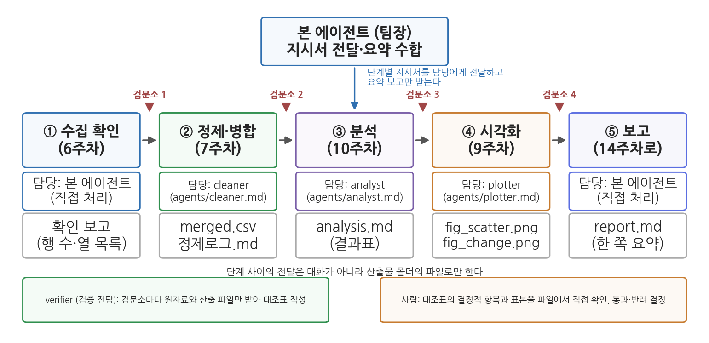
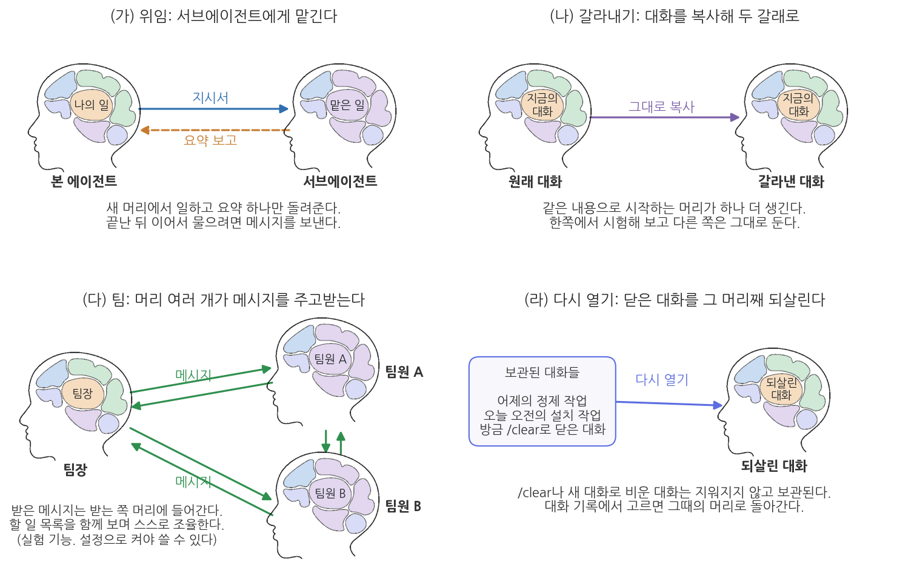
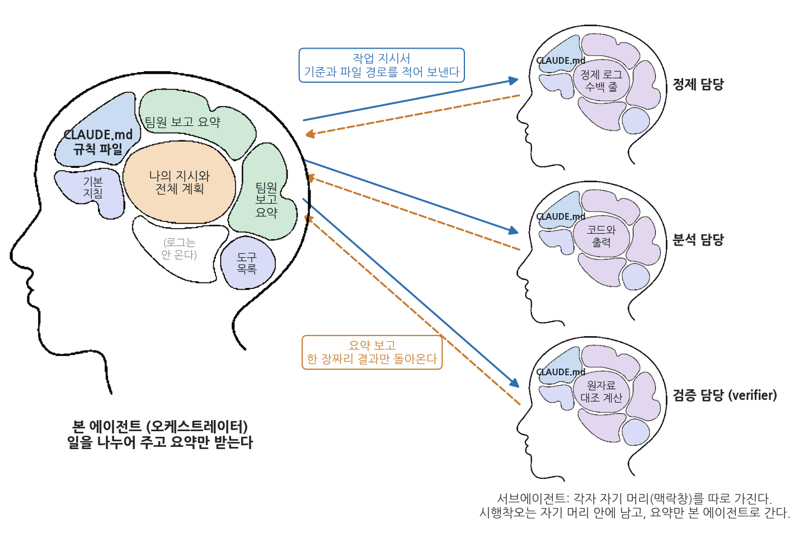
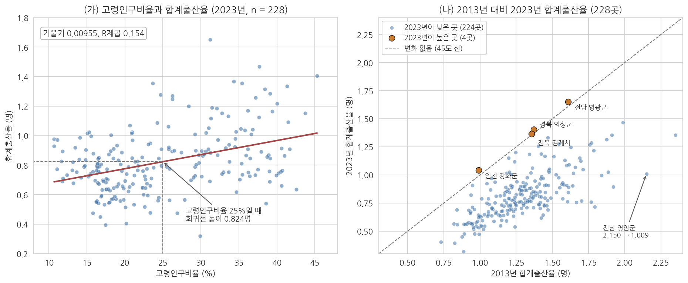
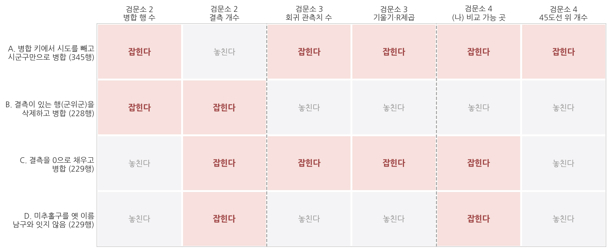

# 13주차 2회차. 전 과정 파이프라인 구축하기

## 이 실습에서 하는 것

1회차에서 서브에이전트, 파이프라인, 검증 지점을 개념으로 배웠다. 오늘은 그것을 전부 실행한다. 1회차에서 배운 개념은 그것이 필요한 단계에서 화면에 나온 결과를 놓고 다시 짚는다. 단계마다 있는 "먼저 알아 둘 것"과 "짚고 가기"가 그 자리다. 학기 내내 써 온 시군구 데이터에서 출발해, 정제·병합(7주차) → 통계 분석(10주차) → 시각화(9주차) → 요약 보고까지를 **하나의 지시**로 묶어 오케스트레이터가 서브에이전트에게 분업시키고, 단계마다 검증 지점에서 직접 확인한다. 서브에이전트는 정제·분석·시각화 담당과 검증 전담 verifier의 넷이며, 각각을 `.claude/agents/` 폴더의 파일로 등록한다. 마지막에는 빈 폴더에 데이터와 지시문만 복사해 처음부터 다시 돌리는 재현성 테스트로 마무리한다. 지난 몇 주 동안 따로 배운 기술을 하나의 절차로 연결하는 실습이다.

이 실습이 끝나면 다음 산출물이 폴더에 남는다.

- `파이프라인.md`: 파이프라인 명세서 (단계·입력·출력·담당·검증 항목)
- `.claude/agents/` 폴더의 서브에이전트 정의 파일 4개: `cleaner.md`, `analyst.md`, `plotter.md`, `verifier.md`
- `보고서식.md`: 담당이 오케스트레이터에게 올리는 요약 보고의 형식 (2.3에서 정한다)
- `지시문_파이프라인.md`: 전 과정을 한 번에 시키는 완결된 지시문
- `산출물/` 폴더: 병합 데이터, 분석 결과표, 그림, 요약 보고서, verifier의 대조표 네 장

이 산출물 묶음이 그대로 14주차 최종 보고서의 재료이자 재현 패키지의 기본 구성이 된다.

오늘의 작업 순서는 명세서 쓰기(2.1) → 서브에이전트 정의 파일 등록(2.2) → 보고 서식 정하기(2.3) → 파이프라인 실행(2.4) → 검증 지점 운영(2.5) → 재현성 테스트(2.6)이고, 마지막 2.7은 시간이 남을 때 하는 선택 심화다. 일곱 단계가 많아 보이지만 2.1부터 2.3까지는 실행 전에 하는 설계이고, 2.5는 2.4가 돌아가는 동안 곁에서 하는 일이다. 파일을 만들고 실행하는 것은 모두 에이전트가 하고, 사람은 지시문을 입력하고 검증 지점에서 통과와 반려를 결정한다.

## 준비물

| 구분 | 내용 |
|------|------|
| 폴더 | 학기 프로젝트 폴더 `공공데이터분석` |
| 데이터 | `data/sigungu_2023.csv` (229개 시군구 인구·출산 지표, 출처: 행정안전부 주민등록인구통계·국가데이터처(옛 통계청) 인구동향조사, KOSIS 수집), `data/sigungu_tfr_2013.csv` (2013년 시군구 합계출산율, 같은 출처) |
| 도구 | VSCode + Claude Code, uv 파이썬 환경 (3주차에 구축한 것), 4주차에 만든 csv-profile 스킬 |
| 참고 코드 | `code/ch13_practice.py` (검증 지점별 대조표의 정답 수치, 오류 시나리오 네 가지의 결과. 본문 수치가 어떻게 나왔는지 확인할 때 참조) |
| 선수 내용 | 13주차 1회차 (서브에이전트, 파이프라인, 검증 지점), 7주차 (병합), 9주차 (시각화), 10주차 (회귀), 4주차 (Skill 만들기), 2주차 (검증 조건, 계획 모드, CLAUDE.md) |

오늘의 공통 예제는 "지난 10년 사이 시군구 출산율은 어떻게 변했고, 고령화와 어떤 관계가 있는가"라는 질문이다. 두 데이터 파일은 이미 확보되어 있으므로 수집 단계는 확인만 하고 지나간다. (1회차 1.3절에서 본 대로 6주차의 kosis MCP를 연결하면 수집이 사람이 미리 내려받아 두는 일에서 에이전트가 실행하는 한 단계로 바뀌고, 그때부터는 "새 데이터로 다시"라는 요청이 파이프라인 재실행 한 번이 된다. 오늘은 두 파일이 이미 있으므로 단계 사이의 연결과 검증에 집중한다.) 실습은 이 공통 예제로 진행하고, 뒤의 혼자서 해 보는 실습에서 같은 절차를 자기 프로젝트 데이터에 적용한다.

## 2.1 파이프라인 명세서 쓰기: 단계·파일·담당·검증 항목

**무엇을 왜 하는가.** 서브에이전트에게 분업시키려면 단계 설계가 먼저다. 에이전트에게 지시하기 전에, 무엇을 몇 단계로 나누고 각 단계가 무엇을 받아 무엇을 내놓으며 누가 맡는지를 사람이 먼저 정한다. 1회차 표 13-1의 단계 정의서에 담당 열을 더한 것이 오늘의 파이프라인 명세서다. 명세서의 각 칸은 사람이 정하는 설계이고, 그것을 파일로 만드는 일은 에이전트에게 시킨다. 아래 표 13-3의 내용으로 프로젝트 폴더에 `파이프라인.md`를 만들게 한다.

**표 13-3. 오늘 실습의 파이프라인 명세서 (`파이프라인.md`의 내용)**

| 단계 | 입력 | 처리 | 출력 | 담당 | 검증 항목 |
|------|------|------|------|------|------|
| ① 수집 확인 | `data/`의 CSV 2개 | 파일 존재·행 수·열 목록 확인 | 확인 보고 | 본 에이전트 | 2023년 229행, 2013년 264행이 맞는가 |
| ② 정제·병합 | ①의 CSV 2개 | 2023년 파일을 기준으로 시도·시군구 키 병합, 결측 보존, 짝 없는 행 보고 | `산출물/merged.csv`, `산출물/정제로그.md` | cleaner | 병합 후 229행인가, 짝을 못 찾아 2013년 값이 빈 행은 몇이고 왜인가, 결측은 보존되었는가 |
| ③ 분석 | `산출물/merged.csv` | 수도권 vs 비수도권 비교, 고령인구비율과 출산율의 회귀 | `산출물/analysis.md` | analyst | 관측치 수가 228인가, 대표 수치 하나를 재검산 |
| ④ 시각화 | `산출물/merged.csv`, ③의 결과 | 산점도+회귀선, 2013 대비 2023 변화 그림 | `산출물/fig_scatter.png`, `산출물/fig_change.png` | plotter | 그림의 값이 결과표와 일치하는가 |
| ⑤ 보고 | ②③④의 산출물 | 개요·방법·결과·한계를 한 쪽으로 요약 | `산출물/report.md` | 본 에이전트 | 보고서의 모든 숫자가 산출물에서 나왔는가 |

담당 열의 cleaner, analyst, plotter는 2.2에서 파일로 등록할 서브에이전트의 이름이다. ①은 파일을 확인하는 일뿐이고 ⑤는 모든 산출물을 종합해야 하는 오케스트레이터의 일이므로 본 에이전트가 직접 맡는다.



그림 13-6은 표 13-3을 그림으로 옮긴 것이다(그림 안의 '검문소'는 검증 지점, '팀장'은 오케스트레이터를 뜻한다). 맨 위의 본 에이전트가 단계별 지시서를 담당에게 내려보내고 요약 보고만 받으며, 다섯 단계는 왼쪽에서 오른쪽으로 파일을 통해 이어진다. 각 단계 아래 두 줄이 담당과 산출 파일이고, 단계 사이의 붉은 표시가 검증 지점이다. 맨 아래 두 상자는 검증 지점에서 검증을 맡는 두 주체, 곧 verifier와 사람이다. 1회차 그림 13-5대로 verifier가 대조표를 만들고 사람이 결정적 항목과 표본을 확인해 통과·반려를 결정한다. 여기서 알 수 있는 것은 담당이 넷으로 늘어도 사람이 볼 곳은 단계 사이의 검증 지점뿐이라는 점이다.

<div style="border:1px solid #cfe3d4;border-left:5px solid #2f8f4e;background:#f4fbf6;padding:12px 16px;margin:18px 0;border-radius:4px;">
<strong>지시문 예시</strong><br>
"프로젝트 폴더에 파이프라인.md를 만들고, 내가 붙여 넣는 표 13-3의 내용을 그대로 적어 줘. 만든 뒤 이 명세서를 점검해 줘. 아직 아무것도 실행하지는 마. (1) 각 단계의 입력이 앞 단계의 출력과 정확히 이어지는지, (2) 출력 파일명이 서로 겹치거나 빠진 것이 없는지, (3) 이 데이터로 실행할 때 미리 예상되는 문제(병합 키, 결측, 인코딩 등)가 있는지, (4) 검증 항목이 그 문제를 잡을 수 있게 되어 있는지 검토 의견만 말해 줘."
</div>

**예상되는 에이전트의 행동과 결과.** 에이전트가 `파이프라인.md`를 만들고, 두 데이터 파일의 앞부분을 읽은 뒤 검토 의견을 낸다. 2주차에 배운 계획 모드의 응용이다. 화면에는 대략 다음과 같은 의견이 보인다.

```
[검토 의견]
1. 입력·출력 연결: ②의 산출물/merged.csv가 ③④의 입력으로 이어짐. 이상 없음.
2. 파일명: 겹침 없음. ④의 fig_change.png는 ③의 결과를 쓰지 않으므로 ③과 동시에 실행 가능.
3. 예상 문제: 두 파일의 행 수가 다름(229 대 264). 2013년 파일에는 분당구 같은
   일반구 행이 있고, '남구'만 여섯 곳(부산·대구·인천·광주·울산·경북)이라
   시군구 이름만으로 병합하면 뒤섞임. 2023년 합계출산율에 결측 1건.
4. 검증 항목: ②에 '결측 보존'이 있으나 결측 처리 방법이 명세서에 없음.
```

**짚고 가기: 단계를 나눈다는 것은 파일을 정하는 일이다.** 방금 점검한 표 13-3에서 출력 열을 세로로 훑어보라. 다섯 칸이 전부 파일 이름이다. ②의 출력은 "정제가 끝났습니다"라는 대화 속 보고가 아니라 폴더에 저장된 `산출물/merged.csv`다. 단계의 출력을 파일로 고정하면 세 가지가 따라온다. 사람이 아무 때나 열어 확인할 수 있고(2.5의 검증 지점이 이것으로 성립한다), ③에서 실패해도 ②의 출력부터 다시 시작하면 되고, 입력 파일과 처리가 남아 있으니 나중에 같은 결과를 다시 만들 수 있다(2.6의 재현성 테스트가 이것을 시험한다). 대화로 넘기면 셋 다 사라진다. 대화는 맥락창이 차면 밀려나고 새 대화를 열면 없어지기 때문이다.

입력 열도 같은 기준으로 확인하라. ③분석과 ④시각화의 입력이 `data/`의 원본 CSV가 아니라 `산출물/merged.csv`로 적혀 있다. 각 단계의 입력은 반드시 앞 단계의 출력 파일이어야 한다는 규칙이고, 이것이 깨지면 결과가 어긋난다. ④가 병합 파일 대신 원자료를 읽어 그림을 그리면 그림의 점 개수와 분석표의 관측치 수가 어긋나는데, 두 숫자가 다른 문서에 흩어져 있어 발견되지 않은 채 보고서까지 간다. 방금 에이전트가 낸 검토 의견의 1번이 확인해 준 것이 바로 이 연결이며, 2.2에서 만들 서브에이전트 정의 파일에 "무엇만 읽을 수 있는가"를 적어 두는 것도 같은 규칙을 담당별로 고정하는 일이다. (자세한 설명은 1회차 1.2, 표 13-1)

**검증.** 에이전트의 검토 의견 중 "예상되는 문제"를 명세서의 검증 항목과 대조해, 명세서에 없던 위험은 검증 항목에 추가한다. 위 예라면 "②의 처리 칸에 결측은 채우거나 삭제하지 않고 개수만 보고한다고 추가해 줘"라고 시키며, 이 한 줄이 2.5 검증 지점 2에서 결정적인 기준이 된다.

## 2.2 서브에이전트 정의 파일 만들기: 담당 서브에이전트와 verifier 등록

**무엇을 왜 하는가.** 1회차 1.1절의 셋째 방법, 곧 전담 서브에이전트를 파일로 정의해 두는 일을 실제로 한다. 왜 말로 시키지 않고 파일을 만드는가. 1회차 유의 박스에서 본 대로 서브에이전트는 본 대화를 보지 못하므로, 본 에이전트의 작업 지시서에서 빠진 규칙은 담당에게 전달되지 않는다. 담당별 파일에 규칙을 적어 두면 그 담당은 어떤 지시서를 받든 규칙을 먼저 안다. 파일에는 한 가지를 더 적는다. 담당이 일을 마쳤을 때 본 에이전트에게 무엇을 보고해야 하는지의 형식이다. 보고 형식이 없으면 어떤 담당은 "완료했습니다" 한 줄을, 어떤 담당은 코드 전체를 올려 오케스트레이터의 맥락창이 다시 채워진다.

**표 13-4. 오늘 등록할 서브에이전트 정의 파일 4개**

| 파일 | 담당 단계 | 핵심 규칙 | 보고 항목 |
|------|------|------|------|
| `cleaner.md` | ② 정제·병합 | 원본 불변, 키는 시도+시군구, 결측과 짝 없는 행은 보고만 | 산출 파일, 행 수·열 수, 처리한 것과 하지 않은 것, 확인 필요 사항 |
| `analyst.md` | ③ 분석 | `merged.csv`만 입력, 결측 제외 개수 보고, 상관·인과 구분 | 관측치 수, 결과표, 해석 문장, 확인 필요 사항 |
| `plotter.md` | ④ 시각화 | `merged.csv`와 `analysis.md`만 입력, 제목·축·단위, 한글 폰트 | 그림 파일, 점 개수, 그림에 쓴 수치 |
| `verifier.md` | 검증 지점 | 산출물을 만들지 않은 독립 검증자, 원자료에서 재계산 | 항목별 일치 여부, 대조한 행 번호, 계산 방법 |

세 담당의 파일은 틀이 같으므로 `cleaner.md` 전문만 보인다. 4주차의 SKILL.md처럼 머리말과 본문으로 되어 있고, 머리말의 `name`과 `description`은 필수다.

```markdown
---
name: cleaner
description: 파이프라인의 정제·병합 단계 담당. CSV 병합, 결측 보고, 정제로그 작성에 사용.
---

너는 정제·병합 담당이다. 입력은 data 폴더의 원본 CSV, 출력은
산출물/merged.csv와 산출물/정제로그.md다.
1. 원본 파일은 수정하지 않는다.
2. 병합 키는 시도와 시군구 두 열의 조합이며, 병합 후 행 수가 기준 파일(2023년)과
   같은지 확인한다.
3. 짝을 못 찾은 행과 결측값은 삭제하거나 채우지 않는다. 목록과 개수로 보고한다.
4. 보고는 다음 네 줄로만 한다. 산출 파일 경로 / 행 수·열 수 / 처리한 것과
   하지 않은 것 / 사용자 확인이 필요한 사항.
```

<div style="border:1px solid #cfe3d4;border-left:5px solid #2f8f4e;background:#f4fbf6;padding:12px 16px;margin:18px 0;border-radius:4px;">
<strong>지시문 예시</strong><br>
".claude/agents 폴더에 서브에이전트 정의 파일 세 개를 만들어 줘. 첫째 cleaner.md는 내가 지금 붙여 넣는 내용 그대로 만들고, 둘째 analyst.md와 셋째 plotter.md는 같은 틀로 만들되 표 13-4의 규칙과 보고 항목을 본문에 넣어 줘. analyst의 입력은 산출물/merged.csv만, plotter의 입력은 산출물/merged.csv와 산출물/analysis.md만이다. 만든 뒤 세 파일의 전문을 보여 줘. 내용을 지어 보태지 말고 내가 준 규칙만 적어 줘."
</div>

에이전트가 만들어 온 두 파일은 다음과 비슷해야 한다. 먼저 분석 담당이다.

```markdown
---
name: analyst
description: 파이프라인의 분석 단계 담당. 집단 비교와 회귀, 결과표 작성에 사용.
---

너는 분석 담당이다. 입력은 산출물/merged.csv 하나뿐이고, 출력은
산출물/analysis.md다.
1. data 폴더의 원본은 열지 않는다. merged.csv에 없는 값이 필요하면
   계산하지 말고 사용자에게 묻는다.
2. 결측이 있는 행은 삭제하지 않는다. 계산에서 제외한 개수와 그 이유를
   결과표에 적는다.
3. 결과표에는 반드시 사용한 관측치 수를 함께 적는다.
4. 해석 문장에서 상관과 인과를 구분한다. "영향", "효과", "때문에"를 쓰지
   않고 "관련", "경향"으로 쓴다.
5. 보고는 다음 네 줄로만 한다. 산출 파일 경로 / 관측치 수 / 대표 수치
   세 개 / 사용자 확인이 필요한 사항.
```

다음은 시각화 담당이다. 규칙 1이 이 서브에이전트에게 가장 중요하다. 1회차 1.2절에서 배운 대로 시각화가 원자료를 읽으면 그림과 분석표의 숫자가 어긋나기 때문이다.

```markdown
---
name: plotter
description: 파이프라인의 시각화 단계 담당. 산점도·비교 그림 작성에 사용.
---

너는 시각화 담당이다. 입력은 산출물/merged.csv와 산출물/analysis.md
두 개뿐이고, 출력은 산출물 폴더의 PNG 파일이다.
1. data 폴더의 원본은 열지 않는다. 그림에 쓰는 값은 전부 merged.csv에서
   온 것이어야 한다.
2. 모든 그림에 제목, 두 축의 이름, 단위를 넣는다. 축을 자를 때는 자른
   범위를 그림 제목이나 축 이름에 밝힌다.
3. 한글은 koreanize_matplotlib로 처리하고 dpi 150으로 저장한다.
4. 그림에 찍힌 점의 개수를 세어 보고한다. analysis.md의 관측치 수와
   다르면 그리기를 멈추고 차이를 먼저 보고한다.
5. 보고는 다음 네 줄로만 한다. 그림 파일 경로 / 점 개수 / 그림에 쓴
   수치 / 사용자 확인이 필요한 사항.
```

세 파일을 나란히 놓고 보면 공통 구조가 드러난다. 첫 줄은 역할 선언, 그다음은 입력과 출력의 고정, 그다음이 하지 말아야 할 일, 마지막이 보고 형식이다. 이 네 덩어리가 서브에이전트 정의 파일의 표준 틀이며, 자기 프로젝트에서 새 담당을 만들 때도 같은 순서로 쓰면 된다. 특히 둘째 덩어리를 주목하라. 세 서브에이전트 모두 "무엇을 읽을 수 있는가"가 아니라 "무엇만 읽을 수 있는가"로 적혀 있다. 파이프라인에서 담당의 권한은 넓히는 것이 아니라 좁히는 것이 안전하다.

이어서 검증 전담 서브에이전트를 만든다. 1회차 1.1절의 검증 에이전트를 그대로 파일로 옮기는 것이다. 이 파일도 에이전트가 만든다.

<div style="border:1px solid #cfe3d4;border-left:5px solid #2f8f4e;background:#f4fbf6;padding:12px 16px;margin:18px 0;border-radius:4px;">
<strong>지시문 예시</strong><br>
"검증 전담 서브에이전트를 등록하려고 해. .claude/agents/verifier.md 파일을 만들어 줘. 머리말의 name은 verifier, description은 '분석 산출물을 원자료와 대조해 검산하는 검증 전담 에이전트. 검증, 검산, 대조, 확인해 달라는 요청에 사용'으로 하고, 본문에는 다음 지침을 적어 줘. (1) 너는 결과를 만든 사람이 아니라 감사하는 사람이다. (2) 검증 대상 파일과 원자료 경로를 받으면 원자료에서 처음부터 다시 계산하고, 결과 파일의 값을 베끼지 않는다. (3) 행 수, 대표 수치, 무작위 표본 5행을 대조해 항목별 일치 여부를 표로 보고하고, 대조에 쓴 행 번호와 계산 방법을 함께 적는다. (4) 차이가 있으면 어느 행·열이 얼마나 다른지 적고 원인은 추측하지 않는다. (5) 확인할 수 없는 항목은 '확인 불가'라고 쓴다. 그리고 머리말에 skills 항목을 두고 4주차에 만든 csv-profile 스킬을 실어 줘. 만든 뒤 파일 전문을 보여 줘."
</div>

**verifier에게 스킬을 미리 로드하기.** 서브에이전트 정의 파일의 머리말에는 `skills:` 항목을 둘 수 있다. 여기에 스킬 이름을 적으면 그 스킬의 본문이 서브에이전트의 맥락창에 처음부터 로드된다. 위 지시로 verifier의 머리말은 다음처럼 된다.

```markdown
---
name: verifier
description: 분석 산출물을 원자료와 대조해 검산하는 검증 전담 에이전트.
  검증, 검산, 대조, 확인해 달라는 요청에 사용.
skills:
  - csv-profile
---
```

이렇게 해 두면 verifier는 CSV를 받을 때마다 4주차의 표준 절차(행 수, 열 목록, 결측 위치)로 진단을 시작하므로 대조표의 첫 줄이 늘 같은 형식으로 나온다. 제약이 하나 있다. `disable-model-invocation: true`로 사용자만 부르게 만든 스킬은 로드할 수 없다. 에이전트가 스스로 꺼내 쓰지 못하도록 설명을 에이전트 맥락에서 감춘 스킬이기 때문이다. 4주차에는 사람이 스킬을 불러 절차를 실행했다면, 오늘은 에이전트가 스킬을 로드한 상태에서 그 절차를 따른다.

**예상되는 에이전트의 행동과 결과.** 파일 네 개가 만들어지고 각 전문이 화면에 표시된다. 서브에이전트 정의 파일은 새 세션에서 인식되므로 Claude Code를 재시작한 뒤 "지금 등록된 서브에이전트의 이름과 설명을 보여 줘"라고 물어 목록을 확인한다(대화창 명령 `/agents`는 에이전트 파일의 위치를 출력한다).

```
등록된 서브에이전트 (.claude/agents/)
- cleaner : 파이프라인의 정제·병합 단계 담당. CSV 병합, 결측 보고, 정제로그 작성에 사용.
- analyst : 파이프라인의 분석 단계 담당. 집단 비교와 회귀, 결과표 작성에 사용.
- plotter : 파이프라인의 시각화 단계 담당. 산점도·비교 그림 작성에 사용.
- verifier: 분석 산출물을 원자료와 대조해 검산하는 검증 전담 에이전트. (skills: csv-profile)
```

**짚고 가기: 방금 등록한 넷은 대화 내용 없이 시작한다.** 목록에 뜬 네 이름이 그림 13-3의 어느 기능에 해당하는지 확인해 두자. 1회차 그림 13-3은 맥락창을 여러 개 다루는 기능 네 가지를 머리 그림으로 나타냈는데, 오늘 등록한 것은 그중 (가) 위임에 쓸 서브에이전트들이다.



그림 13-3의 (가)를 방금 화면에 뜬 목록과 맞춰 읽어 보자. 왼쪽이 본 에이전트, 오른쪽이 서브에이전트이고 지시서만 내려가고 요약만 올라온다. 오른쪽 머리에 우리 대화가 담겨 있지 않다는 점이 오늘 서브에이전트 정의 파일을 만든 이유다. cleaner는 지금 이 대화에서 우리가 주고받은 말을 하나도 모르는 채로 일을 시작하므로, "원본은 수정하지 않는다"와 "결측은 채우지 않는다"를 지금 대화에서 아무리 강조해도 그에게는 닿지 않는다. 파일에 적어 둔 규칙만이 cleaner가 지시서와 함께 갖고 시작하는 정보의 전부다. 오른쪽 위의 (나) 갈라내기와 비교하면 차이가 분명해진다. 갈라낸 대화는 지금까지의 대화를 통째로 복사해 가지고 시작하지만, 위임받은 서브에이전트는 그렇지 않다. (다) 팀과 (라) 다시 열기는 이름과 그림만 알아 두면 되고, 오늘 쓰는 것은 (가) 하나다.

한 가지를 덧붙이면, 목록의 설명 줄은 부가 정보가 아니다. 이 설명이 4주차 스킬의 `description`과 같은 일을 한다. 본 에이전트는 평소에 서브에이전트의 이름과 설명만 알고 있다가 요청이 설명과 맞으면 그 서브에이전트에게 일을 넘기므로, cleaner의 설명에 "병합", analyst에 "회귀", verifier에 "검증, 검산, 대조"라는 낱말이 들어 있어야 이름을 부르지 않아도 자동으로 위임한다. 2.4에서는 지시문에 이름을 직접 적어 부를 것이므로 설명이 부실해도 돌아가지만, 학기 프로젝트에서 서브에이전트가 늘어나면 이 한 줄이 누가 불려 나오는지를 정한다. (자세한 설명은 1회차 1.1, 그림 13-3)

**검증.** 에이전트가 요청하지 않은 규칙을 덧붙이지 않았는지 네 파일의 본문을 훑는다. "결측은 평균으로 채운다" 같은 줄이 있으면 지우게 하며, 정의 파일의 규칙은 이후 모든 실행에서 반복되므로 여기서 들어간 한 줄이 가장 오래 남는다.

## 2.3 오케스트레이터가 받을 보고 서식 정하기

**무엇을 왜 하는가.** 서브에이전트 정의 파일마다 보고 항목을 네 줄로 적어 두었다. 그런데 항목만 정하고 형식을 정하지 않으면 세 담당이 제각기 다른 모양으로 보고한다. 어떤 담당은 코드 전체를 화면에 쏟아 놓고, 어떤 담당은 "정제를 완료했습니다"라고만 쓴다. 둘 다 오케스트레이터의 확인 작업을 늘린다. 앞의 보고는 본 에이전트의 맥락창을 산출물 내용으로 채워 1회차에서 본 맥락창 포화 문제를 다시 일으키고, 뒤의 보고는 검증 지점에서 볼 것이 아무것도 없다. 보고 서식을 미리 정하는 일은 예의의 문제가 아니라 검증의 문제다. **보고 서식은 검증 지점의 입력 양식이다.** 서식의 각 줄이 검증 항목 하나와 짝을 이루면, 보고를 읽는 것만으로 검증의 절반이 끝난다.

좋은 보고가 어떤 모양인지는 다음 예에서 볼 수 있다.

```
- 산출 파일: 산출물/merged.csv (229행 13열), 산출물/정제로그.md
- 핵심 수치(행 수·열 수): 입력 229행 -> 출력 229행 (변동 없음)
- 처리한 것 / 하지 않은 것: 인천 미추홀구를 2013년 남구와 연결함 /
  결측 2건(경북 군위군의 합계출산율·출생아수)은 채우지 않고 보존
- 확인 필요: 2013년 파일 쪽 짝 없는 행 36건은 일반구 단위로 보입니다.
  버려도 되는지 판단이 필요합니다.
```

이 보고에는 파일 경로, 숫자, 그리고 판단이 필요한 지점이 있어서 사람이 검산할 수 있다. "큰 문제는 없었다" 같은 문장만 오면 검산할 것이 없다. 2주차에서 배운 검증 조건을 보고 서식으로 옮긴 것이다. 표 13-5가 네 줄의 뜻이다.

**표 13-5. 담당 보고의 네 줄 서식과 그것이 여는 검증 항목**

| 줄 | 무엇을 적는가 | 짝이 되는 검증 항목 | 비어 있으면 |
|------|------|------|------|
| 1. 산출 파일 | 저장한 파일의 경로와 크기(행·열, 그림이면 점 개수) | 약속한 파일이 약속한 자리에 있는가 | 파일을 못 찾거나 다른 이름으로 저장했다 |
| 2. 핵심 수치 | 그 단계의 결정적 수치 두세 개 (행 수, 관측치 수, 대표 통계량) | 앞뒤 단계와 수가 맞는가 | 검증 지점에서 볼 것이 없어 파일을 처음부터 뒤져야 한다 |
| 3. 처리한 것 / 하지 않은 것 | 규칙대로 한 일과 일부러 하지 않은 일을 짝으로 | 규칙이 보고 없이 바뀌지 않았는가 | 결측과 짝 없는 행의 처리가 바뀌어도 드러나지 않는다 |
| 4. 확인 필요 | 담당이 스스로 정할 수 없다고 판단한 것 | 사람이 결정할 자리가 남아 있는가 | 담당이 대신 결정해 버렸다는 뜻이다 |

넷째 줄이 특히 중요하다. 2주차의 검증 조건 가운데 "없다고 답할 자리"를 여러 서브에이전트가 일하는 구조로 옮긴 것이 이 줄이다. 확인 필요 칸이 매번 "없음"으로 오는 서브에이전트가 있다면 일을 잘하는 것이 아니라 판단을 대신하고 있을 가능성이 크다.

<div style="border:1px solid #cfe3d4;border-left:5px solid #2f8f4e;background:#f4fbf6;padding:12px 16px;margin:18px 0;border-radius:4px;">
<strong>지시문 예시</strong><br>
"프로젝트 폴더에 보고서식.md를 만들어 줘. 내용은 담당 서브에이전트가 오케스트레이터에게 올리는 보고의 네 줄 서식이야. 1줄 산출 파일(경로와 행·열 또는 점 개수), 2줄 핵심 수치(그 단계의 결정적 수치 두세 개), 3줄 처리한 것과 하지 않은 것, 4줄 확인 필요. 각 줄에 '무엇을 적는가'와 '좋은 예 한 줄'을 함께 적어 줘. 그리고 .claude/agents의 cleaner.md, analyst.md, plotter.md 세 파일의 보고 규칙을 이 서식과 같은 문장으로 맞춰 줘. 고친 부분만 보여 주고, 규칙 번호나 다른 내용은 건드리지 마."
</div>

**예상되는 에이전트의 행동과 결과.** 에이전트가 `보고서식.md`를 만들고, 서브에이전트 정의 파일 세 개를 열어 보고 규칙 줄만 고친 뒤 바뀐 부분을 보여 준다. VSCode의 diff 패널에 세 파일의 변경이 각각 한두 줄씩 표시된다. 화면에는 대략 다음과 같은 요약이 보인다.

```
보고서식.md 생성 (4줄 서식 + 줄별 설명과 예시)
.claude/agents/cleaner.md  규칙 4 수정  (보고 4줄의 문구를 서식과 일치)
.claude/agents/analyst.md  규칙 5 수정  (2줄을 '관측치 수와 대표 수치 셋'으로)
.claude/agents/plotter.md  규칙 5 수정  (2줄을 '점 개수와 그림에 쓴 수치'로)
세 파일 모두 '4. 확인 필요' 줄을 동일 문구로 통일했습니다.
```

**검증.** diff 패널에서 세 서브에이전트의 넷째 줄 문구가 글자 그대로 같아졌는지, 그리고 cleaner의 "원본 파일은 수정하지 않는다" 같은 다른 규칙이 함께 사라지지 않았는지만 본다. 서식이 실제로 작동하는지는 2.4의 첫 보고에서 확인한다.

## 2.4 서브에이전트에게 단계 분업시키기

**무엇을 왜 하는가.** 이제 파이프라인 전체를 하나의 지시로 묶어 실행한다. 지시문의 구성 요소는 세 가지다. 단계를 담당 서브에이전트에게 나눠 맡길 것, 단계 사이는 파일로 이을 것, 그리고 단계가 끝날 때마다 멈춰서 사람의 확인을 받을 것. 아래 지시문은 그대로 입력할 수 있는 완결된 형태다. 지시문 박스의 맨 앞에 "아래 지시문을 지시문_파이프라인.md로 먼저 저장한 뒤 그대로 실행해 줘."를 붙여 대화창에 입력한다. 파일로 남겨 두는 이유는 2.6의 재현성 테스트에서 똑같은 지시문이 다시 필요하기 때문이다.

<div style="border:1px solid #cfe3d4;border-left:5px solid #2f8f4e;background:#f4fbf6;padding:12px 16px;margin:18px 0;border-radius:4px;">
<strong>지시문 예시</strong> (전 과정 파이프라인. `지시문_파이프라인.md`로 저장해 둘 것)<br>
"시군구 출산율 분석 파이프라인을 실행해 줘. ② 정제·병합은 cleaner, ③ 분석은 analyst, ④ 시각화는 plotter 서브에이전트에게 맡기고, ①과 ⑤는 네가 직접 처리해. 아래 공통 규칙을 지켜 줘.<br><br>
[공통 규칙]<br>
1. 모든 산출물은 산출물 폴더에 파일로 저장한다.<br>
2. 각 단계의 입력은 반드시 앞 단계의 출력 파일만 사용한다.<br>
3. 한 단계가 끝날 때마다 다음 단계로 넘어가지 말고 멈춰서, 산출물 파일명과 내가 확인해야 할 핵심 수치를 보고한 뒤 내 승인을 기다린다.<br>
4. 그림의 한글은 koreanize_matplotlib로 처리하고, 모든 그림은 dpi 150의 PNG로 저장한다.<br>
5. 각 담당의 보고는 보고서식.md에 정한 네 줄 형식 그대로 나에게 전달하고, 네가 요약하거나 고쳐 쓰지 않는다.<br><br>
[단계]<br>
① 수집 확인: data/sigungu_2023.csv와 data/sigungu_tfr_2013.csv를 열어 행 수와 열 목록을 보고해 줘. 데이터는 이미 확보되어 있으므로 새로 수집하지 마.<br>
② 정제·병합: 2023년 파일을 기준으로 두 파일을 시도와 시군구를 키로 병합해(2023년의 229행이 모두 남는 왼쪽 병합) 산출물/merged.csv로 저장해 줘. 병합에서 짝을 찾지 못한 행은 마음대로 버리지 말고, 어느 쪽 파일의 어떤 행이 짝을 못 찾았는지 전부 목록으로 보고해 줘. 결측값은 삭제하지 말고 그대로 두되 개수를 보고해 줘. 무엇을 어떻게 처리했는지 산출물/정제로그.md에 기록해 줘.<br>
③ 분석: 산출물/merged.csv만 사용해서, (가) 수도권(서울·경기·인천)과 비수도권의 2023년 합계출산율 평균을 비교하고, (나) 고령인구비율을 설명변수, 2023년 합계출산율을 반응변수로 하는 단순회귀를 실행해 줘. 사용한 관측치 수, 기울기, p값, R제곱을 포함한 결과표를 산출물/analysis.md로 저장해 줘. 해석 문장은 상관과 인과를 구분해서 써 줘.<br>
④ 시각화: 산출물/merged.csv와 ③의 결과로, (가) 고령인구비율과 2023년 합계출산율의 산점도에 회귀선을 얹은 그림을 산출물/fig_scatter.png로, (나) 2013년과 2023년 합계출산율을 비교하는 그림을 산출물/fig_change.png로 저장해 줘. 제목과 축 이름, 단위를 반드시 넣어 줘.<br>
⑤ 보고: 위 산출물만 근거로 산출물/report.md를 작성해 줘. 구성은 데이터 개요, 방법, 주요 결과(수치 인용), 한계 및 유의점의 네 부분, 분량은 한 쪽 이내. 산출물에 없는 숫자나 주장을 새로 만들어 넣지 마."
</div>

**예상되는 에이전트의 행동과 결과.** 대화창의 진행 방식이 지금까지와 다르다. 본 에이전트가 단계 ①을 직접 처리해 보고하고 멈춘다. "계속해"라고 답하면 cleaner에게 ②를 넘기는데, 이때 화면에 별도의 작업 항목이 생기고 그 안에서 파일 읽기·코드 실행·저장이 진행된다. cleaner가 끝나면 본 에이전트가 그 보고를 서브에이전트 정의 파일의 형식 그대로 전달하고, 공통 규칙 3에 따라 다시 멈춘다.

```
[② 정제·병합 담당 cleaner 보고]
- 산출 파일: 산출물/merged.csv (229행 13열), 산출물/정제로그.md
- 핵심 수치: 입력 229행 -> 출력 229행. 2013년 값이 붙은 행 228, 빈 행 1
- 처리한 것: 시도+시군구 키로 왼쪽 병합. 짝 없는 행은 2023년 쪽 1행(인천 미추홀구),
  2013년 쪽 36행(일반구 등, 목록은 정제로그.md)
- 하지 않은 것: 결측(합계출산율 1건, 출생아수 1건, 경북 군위군)은 채우지 않고 보존
- 확인 필요: 미추홀구의 2013년 값은 비어 있음. 연결 여부는 사용자 판단 대기
다음 단계로 넘어가기 전에 승인을 기다립니다.
```

**짚고 가기: 내려간 것과 올라온 것.** 방금 화면에서 벌어진 일을 1회차의 머리 그림과 맞춰 읽어 보자.



그림 13-2의 왼쪽 큰 머리가 방금 우리와 대화한 본 에이전트, 곧 오케스트레이터다. 오른쪽 작은 머리 셋이 cleaner, analyst, plotter다. 파란 실선이 내려간 작업 지시서이고, 주황 점선이 돌아온 요약이다. 화면과 대조해 보라. cleaner의 작업 항목 안에서는 파일 읽기와 코드 실행이 여러 차례 오갔고, 짝을 못 찾은 2013년 쪽 36행의 목록도 그 안에서 만들어졌다. 그런데 우리 대화창으로 올라온 것은 위의 네 줄뿐이다. 36행 목록은 `정제로그.md`라는 파일에 들어갔고 cleaner의 머리 안에 머물렀다. 그림에서 왼쪽 머리에 "(로그는 안 온다)"라고 적힌 빈자리가 바로 지금 화면의 상태다.

이 구조의 이점은 파이프라인이 길어질수록 드러난다. 다섯 단계의 중간 출력이 전부 한 대화에 쌓였다면, ⑤보고를 쓸 무렵에는 ②에서 정한 "결측은 채우지 않는다"가 이미 밀려나 있기 쉽다. 담당별로 맥락창을 따로 쓰면 본 에이전트의 맥락창에는 나의 지시와 전체 계획, 그리고 네 줄짜리 요약들만 남으므로 마지막 단계까지 여유가 있다. 그림의 각 작은 머리 왼쪽 위에 CLAUDE.md 조각이 붙어 있는 것도 주목하라. 프로젝트 규칙은 모든 서브에이전트에게 함께 전달되지만 지금까지의 대화는 전달되지 않는다. 2.2에서 규칙을 대화가 아니라 서브에이전트 정의 파일에 적은 이유가 이것이며, 2.6의 재현성 테스트에서 서브에이전트 정의 파일을 빠뜨리면 규칙이 전달되지 않는다는 점도 같은 구조에서 나온다.

한 가지 덧붙이면, 에이전트가 담당 서브에이전트를 쓰지 않고 어떤 단계를 직접 처리할 수도 있다. 그것 자체는 실패가 아니다. 다만 그 단계는 본 에이전트의 맥락창에서 처리되므로 중간 출력이 그대로 대화에 쌓이고 보고 형식도 흐트러지기 쉬우니, 어느 단계를 직접 처리했는지는 알아 두어야 한다. (자세한 설명은 1회차 1.1, 그림 13-2)

**검증.** 이 절에서는 파이프라인이 설계대로 도는지만 본다. 각 단계가 끝날 때 멈추는지(멈추지 않으면 공통 규칙 3을 다시 강조한다)와 담당의 보고가 2.3의 네 줄 형식으로 오는지(무너져 있으면 공통 규칙 5를 다시 지시한다)를 확인하고, 산출물 내용의 검증은 다음 절의 검증 지점에서 한다.

<div style="border:1px solid #ecd9c6;border-left:5px solid #c77b2f;background:#fdf9f4;padding:12px 16px;margin:18px 0;border-radius:4px;">
<strong>유의 · 맥락창이 차는 담당은 누구인가</strong><br>
1회차에서 본 맥락창 포화 문제는 서브에이전트로 나눈 뒤에도 사라지지 않고 담당별로 나타난다. 맥락창이 가장 먼저 차는 담당은 대개 정제 담당이다. 진단 출력, 짝 없는 행 목록, 재실행 기록이 한 담당에게 쌓이기 때문이다. 담당이 갑자기 느려지거나 앞서 정한 규칙을 잊은 듯한 보고를 하면 그 담당의 맥락창을 의심한다. 대처법은 세 가지다. 파일 내용을 화면에 출력하지 말고 저장만 시키기, 한 담당에게 두 단계를 몰아주지 않기, 그리고 규칙은 대화가 아니라 서브에이전트 정의 파일과 CLAUDE.md에 적어 두어 맥락창이 정리되어도 남게 하기다. 사용량 걱정도 같은 처방으로 준다. 긴 CSV를 통째로 화면에 출력하는 습관 하나가 시간과 사용량을 함께 잡아먹는다.
</div>

## 2.5 검증 지점 운영: 대조표 읽기와 반려

**무엇을 왜 하는가.** 검증 지점에서 여러분은 단계가 멈출 때마다 담당의 보고와 verifier의 대조표를 읽고 통과 또는 반려를 결정한다. 오늘 사람이 하는 일의 대부분이 여기에 모여 있다. 값을 하나하나 세는 노동은 2.2에서 등록한 verifier가 맡고, 사람은 그 결과를 읽고 다음 단계로 보낼지 앞 단계로 돌려보낼지를 정한다.

**먼저 알아 둘 것.** 통과와 반려를 결정하려면 검증 지점이 무엇을 하는 자리인지부터 분명해야 한다.

<div style="border:1px solid #cdd9e5;border-left:5px solid #2f6fb0;background:#f5f9fd;padding:12px 16px;margin:18px 0;border-radius:4px;">
<strong>정의 · 검증 지점</strong><br>
<strong>검증 지점</strong>(checkpoint)은 파이프라인에서 단계 산출물이 다음 단계의 입력으로 넘어가기 전에 사람이 품질을 확인하는 지점이다. 검증 지점을 통과하지 못한 산출물은 다음 단계로 보내지 않고 해당 단계를 수정·재실행한다.
</div>

정의의 뒷문장이 오늘 지켜야 할 규율이다. 문제를 발견하고도 통과시키면 오류가 하류의 모든 단계를 지나가므로 통과는 결정이고, 결정에는 근거가 남아야 하며 오늘 만드는 대조표 네 장이 그 근거다. (자세한 설명은 1회차 1.4, 표 13-2)

**검증 지점 2 (정제·병합 뒤).** 오늘 가장 중요한 검증 지점이며, 볼 것은 cleaner 보고의 둘째 줄(핵심 수치)과 셋째 줄(처리한 것과 하지 않은 것)이다. 이 데이터에는 실제로 문제가 하나 있다. 시도·시군구 이름을 그대로 키로 쓰면 229곳 가운데 **228곳만** 2013년 값을 얻고 인천 미추홀구의 2013년 칸이 빈 채로 남는다. 미추홀구가 2013년 자료에는 옛 이름인 인천 "남구"로 실려 있어 짝을 찾지 못하기 때문이다(2018년에 이름이 바뀌었다. 7주차에 배운 명칭 불일치 문제다). 행 수만 보는 검증은 이것을 발견하지 못하므로 짝을 못 찾은 행의 목록과 **2013년 값이 빈 행의 개수**를 함께 본다. cleaner의 보고에 이 목록이 없으면 "2013년 값이 빈 행은 몇 개인가"를 되묻고, 어느 쪽이든 사람이 처리를 결정해 지시한다.

<div style="border:1px solid #cfe3d4;border-left:5px solid #2f8f4e;background:#f4fbf6;padding:12px 16px;margin:18px 0;border-radius:4px;">
<strong>지시문 예시</strong> (검증 지점 2에서 반려할 때)<br>
"병합에서 인천 미추홀구만 짝을 찾지 못해 2013년 값이 비어 있다. 미추홀구는 2018년까지 인천 남구였으니, 2013년 파일의 인천 남구 값을 미추홀구의 2013년 값으로 연결해서 cleaner에게 다시 병합시켜 줘. 이 결정과 근거를 산출물/정제로그.md에 기록하고, 다시 병합한 뒤 행 수가 229로 그대로인지와 2013년 값이 비어 있는 행이 0이 되는지를 함께 보고해 줘."
</div>

수정 후 `merged.csv`가 229행이고 2013년 값이 빈 행이 0인지 확인한 뒤 verifier에게 검증을 시킨다. 2013년 파일 쪽의 짝 없는 행(분당구 같은 일반구 단위 행 등 36개)은 정상적인 잉여이므로 목록만 정제로그에 남기고 통과시킨다.

<div style="border:1px solid #cfe3d4;border-left:5px solid #2f8f4e;background:#f4fbf6;padding:12px 16px;margin:18px 0;border-radius:4px;">
<strong>지시문 예시</strong><br>
"verifier 서브에이전트를 써서 산출물/merged.csv를 data/sigungu_2023.csv, data/sigungu_tfr_2013.csv와 대조해 줘. 확인할 것: (1) 행 수가 229인가, (2) 2013년 값이 비어 있는 행이 몇 개인가, (3) 인천 미추홀구의 2013년 값이 2013년 파일의 인천 남구 값과 같은가, (4) 강원 고성군과 경남 고성군의 값이 서로 바뀌지 않았는가, (5) 무작위 5개 시군구의 2023년·2013년 값이 원본과 같은가. 항목별 일치 여부, 대조한 행 번호, 계산 방법을 표로 보고하고 산출물/대조표_검문소2.md로 저장해 줘."
</div>

**예상되는 에이전트의 행동과 결과.** verifier가 원본 두 파일을 다시 읽어 항목별 대조표를 돌려준다. 표 13-6은 이 데이터에서 나와야 하는 대조표이며, 행 번호는 VSCode가 표시하는 줄 번호(1행이 열 이름)이고 무작위 표본은 실행마다 달라진다.

**표 13-6. verifier 대조표의 예 (검증 지점 2, 실제 파일 기준 정답)**

| 항목 | merged.csv | 원본 | 일치 | 대조한 행 번호와 방법 |
|------|------|------|------|------|
| 행 수 | 229 | 2023년 파일 229 | 일치 | 두 파일을 다시 읽어 행 수 계산 |
| 2013년 값이 빈 행 | 0 | 0 | 일치 | merged 229행을 전수로 세어 확인 |
| 인천 미추홀구 2013년 값 | 1.107 | 2013년 파일 인천 남구 1.107 | 일치 | merged 161행, 2013년 파일 53행 |
| 강원 고성군 2023 / 2013 | 0.870 / 1.309 | 0.870 / 1.309 | 일치 | merged 3행, 2013년 파일 145행 |
| 경남 고성군 2023 / 2013 | 0.619 / 1.422 | 0.619 / 1.422 | 일치 | merged 53행, 2013년 파일 257행 |
| 표본 1: 강원 홍천군 | 1.118 / 1.238 | 1.118 / 1.238 | 일치 | merged 17행, 2013년 파일 136행 |
| 표본 2: 전남 화순군 | 0.898 / 1.279 | 0.898 / 1.279 | 일치 | merged 188행, 2013년 파일 204행 |
| 표본 3: 충북 청주시 | 0.880 / 1.341 | 0.880 / 1.341 | 일치 | merged 229행, 2013년 파일 147행 |

**짚고 가기: 검증 지점의 이중 검증 구조.** 표 13-6은 병합을 한 cleaner와 별도의 맥락창에서 원자료부터 다시 계산한 1차 검증이고, 사람은 마지막 열의 행 번호와 계산 방법을 근거로 통과와 반려를 결정하는 2차 검증을 맡는다. 두 고성군의 값이 서로 바뀌어 있으면 병합 키에서 시도가 빠졌다는 증거이므로 반려한다. (자세한 설명은 1회차 1.4, 그림 13-5)

**검증 지점 3 (분석 뒤).** 숫자는 verifier가 분석 결과표를 `merged.csv`에서 다시 계산해 대조하고, 해석문은 사람이 본다. 다시 계산할 항목은 지시문에 지정한다.

<div style="border:1px solid #cfe3d4;border-left:5px solid #2f8f4e;background:#f4fbf6;padding:12px 16px;margin:18px 0;border-radius:4px;">
<strong>지시문 예시</strong> (검증 지점 3의 1차 대조)<br>
"verifier 서브에이전트를 써서 산출물/analysis.md를 산출물/merged.csv와 대조해 줘. analysis.md의 숫자를 베끼지 말고 merged.csv에서 먼저 다시 계산한 다음에 결과표를 열어. 다시 계산할 항목은 (1) 합계출산율 결측을 제외한 관측치 수, (2) 2023년 합계출산율의 전체 평균과 중앙값, (3) 수도권(서울·경기·인천)과 비수도권의 2023년 평균과 각 집단의 시군구 수, (4) 고령인구비율을 설명변수로 한 단순회귀의 절편·기울기·R제곱이야. 항목별로 결과표의 값, 재계산 값, 일치 여부, 계산에 쓴 값의 개수를 표로 만들어 산출물/대조표_검문소3.md로 저장해 줘. 차이가 있으면 얼마나 다른지만 적고 원인은 추측하지 마."
</div>

**예상되는 에이전트의 행동과 결과.** verifier가 집계와 회귀를 새로 돌려 표 13-7과 같은 대조표를 돌려준다.

**표 13-7. verifier 대조표의 예 (검증 지점 3, 실제 데이터 기준 정답)**

| 항목 | analysis.md | verifier 재계산 | 일치 | 계산에 쓴 값의 개수 |
|------|------|------|------|------|
| 사용 관측치 수 | 228 | 228 (229행에서 결측 1건 제외) | 일치 | 229 중 1 제외 |
| 2023년 전체 평균 | 0.823 | 0.823 | 일치 | 228 |
| 2023년 중앙값 | 0.790 | 0.790 | 일치 | 228 |
| 수도권 평균 | 0.690 | 0.690 | 일치 | 66 |
| 비수도권 평균 | 0.877 | 0.877 | 일치 | 162 |
| 평균 차이 (비수도권 - 수도권) | 0.187 | 0.187 | 일치 | 66 / 162 |
| 회귀 절편 | 0.585 | 0.585 | 일치 | 228 |
| 회귀 기울기 | 0.00955 | 0.00955 | 일치 | 228 |
| R제곱 | 0.154 | 0.154 | 일치 | 228 |

표를 읽는 요령은 값보다 마지막 열에 있다. 수도권 66곳과 비수도권 162곳의 합은 228이지 229가 아니며, 163이 적혀 있다면 결측 처리가 지시와 다르게 된 것이다.

**해석문은 사람이 본다.** 대조표의 아홉 항목이 전부 일치해도 `analysis.md`의 해석문은 과도한 결론을 담을 수 있다. 계수의 부호와 p값은 두 변수가 함께 움직인다는 것까지만 말해 주는데, 해석문이 "효과", "이끄는 요인"처럼 인과를 나타내는 표현으로 바뀌는 일이 흔하다. 10주차에서 연습한 인과 표현 점검으로 해석문에서 "효과", "영향", "때문에", "이끈다", "작용"을 찾아, 있으면 "이 분석은 관찰 데이터의 상관이라 인과를 말할 수 없어. '관련', '경향'으로 바꾸고, R제곱 0.154가 뜻하는 설명력의 한계와 제3의 요인 가능성을 각각 한 문장으로 덧붙여 줘"라고 되묻는다. 고쳐진 문장은 "고령인구비율이 1%포인트 높은 시군구는 합계출산율이 평균적으로 약 0.01명 높은 경향이 있다. 다만 이 직선이 설명하는 몫은 크지 않으며 인과로 읽을 수는 없다" 정도가 되어야 한다. 숫자가 맞는지는 verifier가 보지만 그 숫자를 어떤 문장으로 옮겼는지는 사람이 본다.

**짚고 가기: 오늘 사람이 한 일은 실행이 아니라 설계와 판정이다.** 병합도 회귀도 작도도 여러분 손으로 하지 않았고, 2.1에서 단계와 입력·출력과 담당을 정했고, 2.5에서 대조표를 근거로 통과와 반려를 결정했으며, 해석문을 심사했다. 앞의 둘은 절차로 만들어 위임할 수 있지만 계수 0.00955가 정책적으로 무엇을 뜻하는지 판단하는 일은 물려줄 수 없으며, 서브에이전트가 늘어도 `report.md`의 책임자는 한 사람이다. (자세한 설명은 1회차 1.5)

**검증 지점 1, 4, 5.** 나머지 세 검증 지점은 같은 방식으로 짧게 운영한다. 검증 지점 1(수집 확인 뒤)에서는 보고된 행 수와 열 수만 보며, `sigungu_2023.csv`는 229행 12열, `sigungu_tfr_2013.csv`는 264행 3열이어야 한다. 검증 지점 4(시각화 뒤)에서는 그림에서 값을 읽어 내려 애쓰지 않고 plotter가 보고한 점 개수와 그림에 쓴 수치를 표 13-8과 맞추며, 기준 모습은 그림 13-7이다(회귀선은 우상향하며 25%에서 0.824, 변화 그림은 228곳 중 45도선 위가 4곳). 의심스러우면 verifier에게 `merged.csv`에서 다시 세게 한다. 검증 지점 5(보고 뒤)에서는 verifier에게 `report.md`의 모든 수치가 `analysis.md`·`정제로그.md`의 어느 줄에서 왔는지 표로 만들게 하고, 출처 없는 수치는 '출처 없음'으로 표시하게 한다.



**표 13-8. 검증 지점 4에서 대조할 결정적 항목 (실제 데이터 기준 정답)**

| 그림 | 항목 | 정답 값 | 어긋나면 의심할 것 |
|------|------|------|------|
| (가) 산점도 | 점 개수 | 228 | 229면 결측 행이 0으로 들어갔다 |
| (가) 산점도 | 가로축 값의 범위 | 10.68 - 45.28 (%) | 범위가 좁으면 일부 시군구가 빠졌다 |
| (가) 산점도 | 세로축 값의 범위 | 0.320 - 1.651 (명) | 0이 포함되면 결측을 채운 것이다 |
| (가) 산점도 | 회귀선의 높이 | 15%에서 0.728, 25%에서 0.824, 35%에서 0.919 | 방향이나 높이가 다르면 다른 데이터로 그렸다 |
| (나) 변화 그림 | 점 개수 | 228 | 227이면 미추홀구가 연결되지 않았다 |
| (나) 변화 그림 | 45도선 위의 점 | 4곳 (경북 의성군, 인천 강화군, 전남 영광군, 전북 김제시) | 개수가 다르면 두 해의 값이 뒤바뀌었다 |
| (나) 변화 그림 | 가로축 값의 범위 | 0.729 - 2.349 (명) | 2013년 값이 아니라 다른 열을 그렸다 |
| (나) 변화 그림 | 가장 크게 내린 곳 | 전남 영암군, 2.150에서 1.009로 | 다른 곳이면 계산식의 뺄셈 방향이 반대다 |

**검증 지점이 다섯 개 필요한 이유.** 검증 지점 하나로는 모든 오류를 발견할 수 없다. 오류를 네 가지 가정하고 각 검증 지점의 결정적 항목이 그 오류에 반응하는지 세어 보면 확인된다. 그림 13-8은 이 데이터로 실제 계산해 본 결과다.



그림 13-8의 세로는 네 가지 오류, 가로는 검증 지점별 결정적 항목 여섯 개이고, 각 칸은 그 항목의 값이 정상 실행과 달라지는지(잡힌다) 똑같은지(놓친다)를 나타낸다. A는 병합 키에서 시도를 빼고 시군구 이름만으로 병합한 경우로, 같은 이름의 시군구가 여럿 있어(강원 고성군과 경남 고성군, 여섯 시도의 남구) 229행이 345행으로 불어나며 여섯 항목 중 다섯이 반응한다. B는 결측이 있는 군위군 행을 삭제한 경우로, 검증 지점 2의 두 항목만 반응하고 하류 넷은 전부 놓친다. 군위군은 회귀에서 어차피 제외되므로 기울기와 R제곱이 그대로이기 때문이며, 행 수 하나가 다른 항목이 놓치는 오류를 잡는다. C는 결측을 0으로 채운 경우로, 행 수가 229로 정상이라 행 수만 보면 통과하지만 결측 개수, 회귀 관측치(229), 기울기(0.00847)와 R제곱(0.116)에서 걸린다. D는 미추홀구를 옛 이름 남구와 잇지 않은 경우로, 2013년 값이 비어 있다는 사실(검증 지점 2)과 변화 그림의 점이 227개로 줄어든다는 사실(검증 지점 4)에서만 걸린다.

여기서 알 수 있는 것은 두 가지다. 첫째, 표면에 드러나는 오류일수록 발견하기 쉽고 드러나지 않는 오류일수록 위험하다. 345행으로 늘어난 A는 행 수만으로 즉시 드러나지만, 229행을 유지하는 C와 D는 행 수만 보는 검증을 통과한다. 둘째, 어느 한 검증 지점도 네 오류를 다 잡지 못한다. 검증 지점을 단계마다 두고 각 검증 지점에 서로 다른 결정적 항목을 두라는 1회차의 원칙이 이 그림의 "놓친다" 칸으로 확인된다.

**검증.** 대조표의 근거가 실제와 맞는지 한 번만 확인한다. "일치"로 표시된 표본 한 행을 골라 적힌 행 번호로 원본을 열어 값이 그 자리에 있는지 본다(표 13-6의 예라면 `sigungu_tfr_2013.csv` 136행에 홍천군의 1.238이 있는지). 대조표 네 장(`대조표_검문소2.md`부터 `대조표_검문소5.md`까지)은 통과 판단의 근거이므로 `산출물` 폴더에 그대로 둔다.

## 2.6 재현성 테스트: 처음부터 다시 돌려도 같은 결과인가

**무엇을 왜 하는가.** 재현성은 1회차에서 말한 품질 관리의 최종 시험이다. 에이전트에게 바탕화면에 `파이프라인_재현테스트` 폴더를 만들어 `data/`의 CSV 두 파일, `지시문_파이프라인.md`, `.claude/agents/`의 정의 파일 4개만 복사하게 한다. `산출물/` 폴더는 복사하지 않는다. 남은 산출물을 에이전트가 재활용하면 시험이 무효가 되기 때문이다. 그 폴더를 VSCode 새 창으로 열고 새 대화에서 아래 지시문을 실행한다(uv 환경이 없으면 3주차에 배운 대로 에이전트에게 환경 준비부터 맡긴다). 2.5에서 내린 미추홀구 판단이 이번에는 지시문에 처음부터 들어가는데, 사람의 판단이 지시문에 성문화되는 것이 재현 가능한 분석의 핵심이다.

<div style="border:1px solid #cfe3d4;border-left:5px solid #2f8f4e;background:#f4fbf6;padding:12px 16px;margin:18px 0;border-radius:4px;">
<strong>지시문 예시</strong> (재현 실행)<br>
"이 폴더는 재현성 테스트용이다. 지시문_파이프라인.md를 읽고 그 지시를 처음부터 끝까지 그대로 실행해 줘. 추가 규칙 하나: 병합에서 인천 미추홀구가 2013년 파일과 짝을 못 찾으면, 2013년 파일의 인천 남구(미추홀구의 옛 이름) 값과 연결해 줘. 이번에는 단계마다 멈추지 말고 끝까지 실행한 뒤, 마지막에 (1) merged.csv의 행 수, (2) 회귀분석의 관측치 수·기울기·R제곱, (3) 2023년 합계출산율 전체 평균을 한 번에 보고해 줘."
</div>

**예상되는 에이전트의 행동과 결과.** 에이전트가 ①부터 ⑤까지 멈춤 없이 다시 실행하고, 마지막에 다음 세 줄을 보고한다.

```
[재현 실행 결과]
(1) merged.csv: 229행
(2) 회귀: 관측치 228, 기울기 0.00955, R제곱 0.154
(3) 2023년 합계출산율 평균: 0.823
```

**검증.** 같아야 하는 것은 문장 표현이 아니라 숫자다. 위 세 줄이 원본 실행과 같으면 통과이고, 보고 문장의 표현, verifier의 무작위 표본, 날짜, 행 순서는 달라도 된다(행 순서가 다르면 시도·시군구 키로 맞춰 비교한다). 숫자가 하나라도 다르면 두 정제로그를 대조해 갈라진 단계를 찾고, 지시문에 빠진 기준을 성문화해 다시 시험한다. 이 시험을 미리 통과해 두면 14주차 재현 패키지의 절반이 완성된다. (자세한 설명은 1회차 1.4)

## 2.7 선택 심화: 파이프라인 실행을 스킬로 저장하기

**무엇을 왜 하는가.** 지시문 파일을 매번 붙여 넣는 대신, 4주차에 배운 방법으로 파이프라인 실행 자체를 스킬로 만들 수 있다. 핵심은 머리말의 `disable-model-invocation: true`다. 이 스킬은 사용자가 `/run-pipeline`을 입력할 때만 실행되고, 에이전트가 설명을 보고 스스로 꺼내 쓰지는 못한다. 전 과정 파이프라인은 파일을 여러 개 덮어쓰는 무거운 작업이므로 실행 시점은 사람이 정해야 한다. 이 스킬은 2.2에서 본 제약 때문에 서브에이전트 정의 파일의 `skills:`에 로드할 수 없는데, 그 제약이 여기서는 의도하지 않은 실행을 막는 역할을 한다.

```markdown
---
name: run-pipeline
description: 시군구 출산율 분석 파이프라인을 처음부터 끝까지 실행한다.
disable-model-invocation: true
---

지시문_파이프라인.md를 읽고 그 지시를 그대로 실행하라. 담당은 cleaner, analyst,
plotter 서브에이전트이고, 검증 지점마다 verifier의 대조표를 받은 뒤 멈춰 사용자
승인을 기다린다. 사용자가 끝까지 멈추지 말고 실행하라고 하면 승인을 기다리지 않고
실행한 뒤 마지막에 merged.csv 행 수, 회귀의 관측치 수·기울기·R제곱, 2023년
출산율 평균을 보고한다.
```

<div style="border:1px solid #cfe3d4;border-left:5px solid #2f8f4e;background:#f4fbf6;padding:12px 16px;margin:18px 0;border-radius:4px;">
<strong>지시문 예시</strong><br>
".claude/skills/run-pipeline/SKILL.md를 내가 붙여 넣는 내용 그대로 만들어 줘. 만든 뒤 /run-pipeline이 스킬 목록에 보이는지, 그리고 그 설명이 에이전트 맥락에 실리지 않는 스킬로 등록되었는지 알려 줘."
</div>

**예상되는 에이전트의 행동과 결과.** 스킬 파일이 만들어지고, 대화창에 `/`를 입력하면 자동완성 목록에 `/run-pipeline`이 뜬다. `/run-pipeline`을 부르고 같은 줄에 "끝까지 멈추지 말고 실행해 줘"라고 적으면 스킬 본문의 그 조건이 작동해 멈춤 없이 실행되고, 마지막에 핵심 수치 세 가지가 보고된다.

**짚고 가기: 절차를 저장한 파일과 담당 역할을 정의한 파일.** 이제 프로젝트의 `.claude` 폴더 안에 두 종류의 파일이 나란히 있다. `skills/run-pipeline/SKILL.md`와 `agents/cleaner.md` 이하 넷이다. 생김새는 똑같다. 둘 다 머리말과 본문으로 된 텍스트 파일이고, 머리말에 이름과 설명을 적는다. 그런데 저장하는 것이 다르다. 스킬은 일하는 절차를 저장하고, 서브에이전트 정의 파일은 담당 역할을 정의한다. 방금 만든 run-pipeline에는 "지시문을 읽고 그대로 실행하라"는 절차가 적혀 있을 뿐 누가 할지는 적혀 있지 않고, cleaner.md에는 "원본은 수정하지 않는다"처럼 그 담당이 어떤 일을 하든 지킬 규칙이 적혀 있다.

그래서 둘은 서로를 대체하지 않고 겹쳐서 쓰인다. 방금 `/run-pipeline`을 부른 한 번의 실행 안에서, 절차는 스킬이 정하고 그 절차의 ②번 줄에 적힌 이름에 따라 cleaner가 자신의 맥락창에서 일했다. 오늘 실습 전체를 이 관점으로 다시 보면 층이 셋이다. 맨 아래에 담당의 역할과 규칙을 정한 서브에이전트 정의 파일, 그 위에 단계의 순서를 정한 지시문, 맨 위에 그 지시문을 한 줄로 호출하는 스킬이다. 아래 두 층은 2.6에서 확인했듯 재현 패키지에 반드시 함께 실려야 하고, 맨 위의 스킬은 호출을 간편하게 하는 편의 기능이다. (자세한 설명은 1회차 1.1)

**검증.** 멈춤 없이 실행한 결과의 보고 수치 세 가지가 2.6의 재현 실행과 같으면, 파이프라인이 지시문, 서브에이전트 정의 파일, 스킬의 세 층으로 구성된 것이다.

## 검증 체크리스트

- [ ] `파이프라인.md`, `보고서식.md`, `지시문_파이프라인.md`를 만들었고, `.claude/agents/`에 서브에이전트 정의 파일 4개를 등록했다(verifier의 머리말에 `skills: csv-profile`)
- [ ] 검증 지점 2에서 병합 행 수(229)와 2013년 값이 빈 행의 개수를 함께 확인했고, 미추홀구가 짝을 찾지 못한 것을 발견·처리했다
- [ ] `산출물/`에 `merged.csv`, `analysis.md`(관측치 228), 그림 두 장, `report.md`, verifier 대조표 네 장이 있다
- [ ] `analysis.md`의 해석문에서 인과로 읽히는 표현을 찾아보았고, 있었다면 되물어 고쳤다
- [ ] 빈 폴더에서 재현 실행을 했고, 행 수(229), 관측치 수(228), 기울기(0.00955), R제곱(0.154), 평균(0.823)이 원본과 같았다

## 자주 겪는 문제

| 증상 | 원인 | 해결 |
|------|------|------|
| 에이전트가 단계마다 멈추지 않고 끝까지 진행한다 | 멈춤 규칙이 지시문에서 눈에 띄지 않았거나 잊힘 | 실행을 중단시키고 "공통 규칙 3을 지켜라. 지금부터 단계가 끝나면 반드시 멈춰라"라고 다시 지시. 규칙을 CLAUDE.md에 넣어 두면 더 안정적이다 |
| 병합 후 행 수가 229가 아니라 345처럼 크게 불어난다 | 시군구 이름의 공백·표기 차이, 또는 키를 시군구 하나만 써서 동명 지역(예: 여섯 시도의 "남구")이 뒤섞임 | "병합 키로 시도와 시군구를 함께 썼는지 확인하고, 키 값의 앞뒤 공백을 제거한 뒤 다시 병합해 줘"라고 지시 |
| 서브에이전트가 이전 단계에서 정한 규칙을 모른다 | 1회차에서 배운 대로 서브에이전트는 본 대화를 못 본다 | 규칙을 대화가 아니라 서브에이전트 정의 파일·지시문·CLAUDE.md·정제로그 같은 파일에 적고, 지시문에 "먼저 정제로그.md를 읽어라"를 포함 |
| 만든 서브에이전트(cleaner 등)가 목록에 안 보이거나 위임되지 않는다 | 파일 위치·이름 오류, 머리말 `name` 불일치, 또는 재시작 전 | 경로가 `.claude/agents/이름.md`이고 `name`이 파일 이름과 같은지 확인. Claude Code 재시작. 지시문에서 서브에이전트 이름을 직접 부른다 |
| verifier 대조표가 전부 "일치"인데 계산 방법 칸이 비어 있다 | verifier가 원자료를 다시 읽지 않고 결과 파일의 값을 베낌 | "원자료 경로만 주고 결과 파일은 마지막에 비교용으로만 열어라"라고 다시 지시 |
| 담당 서브에이전트가 맥락창이 찼다고 하거나 느려진다 | 원본 전체를 화면에 출력하게 했거나 한 담당에게 여러 단계를 몰아줌 | 단계마다 담당을 분리하고 보고는 네 줄 형식으로 제한. 파일 내용은 출력하지 말고 저장만 시킨다 |
| 두 담당이 같은 파일명에 저장해 앞 결과가 덮어써졌다 | 명세서의 출력 파일명이 겹쳤거나 담당이 임의로 경로를 정함 | 2.1의 검토 항목 (2)로 돌아가 파일명을 고정하고 서브에이전트 정의 파일에 출력 경로를 못박는다 |
| 재현 실행에서 회귀 수치가 미세하게 다르다 | 두 실행의 입력이 실제로 달랐을 가능성이 크다 (미추홀구 처리 여부, 결측 처리 방식 차이) | 두 정제로그를 대조해 어느 단계에서 관측치 수가 갈라졌는지 추적. 처리 기준을 지시문에 성문화하고 서브에이전트 정의 파일을 함께 복사해 재시험 |
| 재현 실행에서 에이전트가 산출물을 "이미 있다"며 건너뛴다 | 새 폴더에 이전 산출물이 딸려 들어감 | 새 폴더에는 data와 지시문 파일(그리고 서브에이전트 정의 파일)만 복사했는지 확인하고, 산출물 폴더를 지우고 다시 실행 |
| 그림의 한글이 네모로 깨진다 | 한글 폰트 설정 누락 | 9주차에서 한 대로 "koreanize_matplotlib를 임포트해서 다시 그려 줘"라고 지시 |
| 담당의 보고가 매번 "확인 필요: 없음"으로 온다 | 보고 서식이 서브에이전트 정의 파일에 반영되지 않았거나, 담당이 판단이 필요한 지점을 스스로 정해 버림 | `보고서식.md`의 넷째 줄 문구가 세 서브에이전트 정의 파일에 같은 문장으로 들어갔는지 확인하고, "확인 필요가 없다면 왜 없는지 한 줄로 적어라"를 규칙에 추가 |
| verifier 대조표는 전부 "일치"인데 보고서 문장이 이상하다 | 대조표는 숫자만 본다. 해석문은 검증 에이전트의 검사 대상이 아니다 | 해석문 심사는 사람이 맡는다. 10주차의 인과 표현 점검("효과", "영향", "때문에", "이끈다")으로 찾아 반려 |
| 재현 실행의 merged.csv가 원본과 모든 행이 다르게 보인다 | 두 파일의 행 순서가 다르다. 정렬이 다르면 229행 전부의 행 번호가 어긋난다 | "시도·시군구 키로 맞춘 뒤 셀을 비교해 줘"라고 다시 지시하고, 날짜·시각 줄은 비교에서 제외 |
| 그림의 값을 눈으로 읽을 수 없어 검증 지점 4에서 막힌다 | 그림에서 값을 읽어 내려 하고 있다 | plotter에게 점 개수와 그림에 쓴 수치를 말로 보고하게 하고, 의심스러우면 verifier에게 `merged.csv`에서 다시 세게 한다 (표 13-8) |
| 서브에이전트 정의 파일의 `skills:`에 적은 스킬이 로드되지 않는다 | 그 스킬의 머리말에 `disable-model-invocation: true`가 있어 에이전트가 꺼내 쓸 수 없는 스킬이다 | 스킬 머리말을 열어 확인한다. 사용자 전용 스킬은 서브에이전트에 로드할 수 없으므로, 필요한 절차라면 서브에이전트 정의 파일 본문에 직접 적는다 |

## 혼자서 해 보는 실습

**혼자 해 보기 13-A. 공통 예제 파이프라인 패키지.** 오늘 실습의 산출물 일체를 한곳에 모아 둔다. `파이프라인.md`, `.claude/agents/`의 서브에이전트 정의 파일 4개, `지시문_파이프라인.md`, `산출물/` 폴더(verifier 대조표 포함). 스스로 확인할 것은 두 가지다. (1) 검증 지점 2에서 미추홀구 문제를 발견하고 근거 있게 처리했는가, (2) 재현성 테스트에서 숫자 일치를 확인했는가.

**혼자 해 보기 13-B. 내 프로젝트 파이프라인 설계서.** 6주차에 정한 자기 학기 프로젝트 데이터에 대해 표 13-3 형식의 명세서와 완결된 파이프라인 지시문을 작성해 본다. 실행까지 해 보기를 권하지만, 이번 주에 꼭 해야 할 것은 설계다. 스스로 확인할 것은 단계 사이의 입력·출력이 파일로 정확히 이어지는가와 검증 항목이 그 데이터의 실제 위험(병합 키, 결측, 단위)을 확인할 수 있게 되어 있는가이다. 이 설계서는 14주차 최종 보고서 실습에서 그대로 사용한다.

**혼자 해 보기 13-C. 반려 기록.** 오늘 실습에서 검증 지점이 산출물을 반려한 사례 하나(미추홀구의 2013년 값 빈칸, 해석문의 인과 표현 중 하나)를 골라, 에이전트에게 (1) 담당의 원래 보고, (2) 그것을 잡아낸 검증 항목과 대조표의 해당 줄, (3) 반려 지시문, (4) 재실행 후 확인한 값을 반 쪽 이내로 정리하게 하고 내용이 맞는지 확인한다. 반려할 일이 없었다면 표 13-6의 각 항목이 어떤 오류를 잡도록 설계되었는지 설명하는 것으로 대신할 수 있다.
