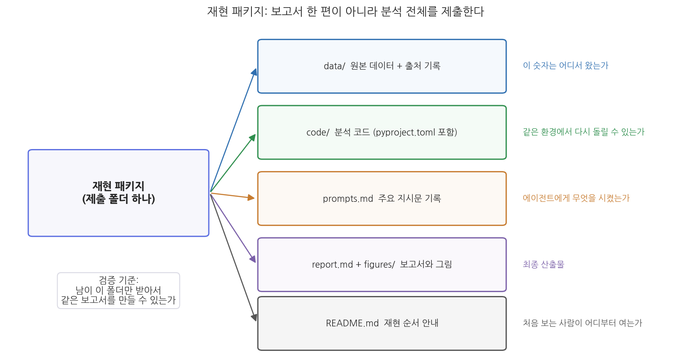

# 13주차 2회차. 종합 프로젝트: 나의 분석 보고서

## 이 실습에서 하는 것

한 학기의 마지막 실습이다. 5주차에 정한 학기 프로젝트 주제로, 12주차까지 다듬어 온 데이터와 파이프라인 산출물을 한 편의 정책 분석 보고서로 완성한다. 오늘의 목표는 새로운 분석을 추가하는 것이 아니라, 이미 검증된 분석을 남이 믿고 쓸 수 있는 문서와 패키지로 만드는 것이다.

완성 산출물은 두 가지다.

- **보고서**: 1회차의 표준 구조(요약-배경-데이터와 방법-발견-제언-부록)를 갖추고, 삼중 대조를 통과했으며, AI 활용 내역이 명시된 `report.md`
- **재현 패키지**: 데이터, 코드, 지시문 기록, 보고서를 한 폴더에 담아 "남이 이 폴더만 받아서 같은 결과를 재현할 수 있는" 상태로 꾸린 제출 폴더

작업 순서는 초안 작성(2.1) → 일관성 점검(2.2) → 동료 검토(2.3) → 패키지 꾸리기(2.4)다. 특히 2.3의 동료 검토에서는 옆 사람의 보고서를 검증하는 심사자 역할을 직접 해 본다. 검증하는 눈은 검증받아 볼 때 가장 빨리 자란다.

## 준비물

| 구분 | 내용 |
|------|------|
| 프로젝트 | 5주차에 시작해 12주차까지 다듬어 온 학기 프로젝트 폴더 (정제 데이터, 분석 코드, 그림, 12주차 파이프라인 산출물) |
| 데이터 | 각자의 프로젝트 데이터. 예시 시연은 `data/sigungu_2023.csv`(전국 229개 시군구 인구·합계출산율, 출처: 행정안전부 주민등록인구통계·국가데이터처(옛 통계청) 인구동향조사, KOSIS에서 수집) 기준 |
| 도구 | VSCode + Claude Code, uv 환경(4주차) |
| 선수 내용 | 13주차 1회차 (보고서 구조, 삼중 대조, AI 사용 명시), 12주차 2회차 (파이프라인, 재현성 테스트), 3주차 (계획 모드, 지시문 라이브러리) |

## 2.1 보고서 초안을 에이전트와 함께 작성하기

보고서 초안은 한 번의 지시로 만들지 않는다. 3주차에서 배운 대로 큰 일은 쪼갠다. 뼈대를 먼저 합의하고, 장별로 따로 지시하고, 장마다 검증한다. 특히 각 장은 성격이 달라서 지시문도 달라야 한다. "데이터와 방법"은 사실의 기록이므로 파일에 근거하게 하고, "발견"은 해석이 들어가므로 과잉해석을 막는 제약을 걸고, "요약"은 본문이 완성된 뒤 본문에서만 뽑게 한다.

**1단계: 뼈대 잡기 (계획 모드).**

<strong>지시문 예시</strong> 
"내 학기 프로젝트의 최종 보고서를 쓰려고 한다. 계획 모드로 목차 초안부터 잡아 줘. 구조는 요약-배경-데이터와 방법-발견-제언-부록의 6개 장으로 하고, 이 폴더의 분석 산출물(figures 폴더의 그림, results 폴더의 분석 결과)을 훑어본 뒤 '발견' 장에 들어갈 소절 후보를 그림·결과와 짝지어 제안해 줘. 아직 본문은 쓰지 마."

**예상되는 에이전트의 행동.** 계획 모드에서 에이전트가 폴더의 그림과 결과 파일을 읽고, 장별 소절과 근거 자료를 짝지은 목차안을 제시한다. 본문 작성은 시작하지 않고 계획 승인을 기다린다.

**검증.** 제안된 목차에서 "발견" 소절들이 실제 존재하는 그림·결과와 짝지어졌는지 파일 이름을 하나씩 확인한다. 폴더에 없는 그림을 전제로 한 소절이 있으면 이 단계에서 걸러 낸다. 목차는 여러분이 고쳐서 확정한다. 무엇을 말할 보고서인지는 에이전트가 아니라 여러분이 정한다.

**2단계: "데이터와 방법"과 "발견" 장 초안.**

<strong>지시문 예시</strong> 
"확정한 목차대로 '데이터와 방법' 장과 '발견' 장의 초안을 report.md에 작성해 줘. 제약이 세 가지 있다. (1) 모든 수치는 results 폴더의 분석 결과 파일에서 가져오고, 기억이나 추정으로 숫자를 쓰지 마. (2) '발견'의 각 소절은 질문 한 문장으로 시작하고, 근거 숫자를 제시한 뒤, 함의와 한계를 한 문장씩 붙이는 구조로 써. (3) 상관관계를 인과관계처럼 서술하지 마. 각 수치 옆에 어느 파일의 어느 값에서 가져왔는지 주석을 임시로 달아 줘."

**예상되는 에이전트의 행동.** 결과 파일들을 읽고 두 장의 초안을 작성한다. 제약 (2) 덕분에 1회차에서 본 질문-근거-함의 문단이 만들어지고, 출처 주석이 수치마다 붙는다.

**검증.** 초안을 처음부터 끝까지 읽는다. 이때 에이전트가 틀리는 전형적 장면을 하나 보자. 시군구 출산율 예시 프로젝트에서 이 지시를 실행했을 때, 에이전트가 "수도권 평균 0.690은 비수도권 평균 0.877의 절반 수준이다"라고 쓴 일이 있다. 숫자 두 개는 결과 파일과 정확히 일치했다. 그러나 0.690은 0.877의 약 79퍼센트이지 절반이 아니다. 숫자는 옮겨 오면서, 숫자 사이의 관계는 문장을 유창하게 만들다가 지어낸 것이다. 이런 오류는 숫자 대조만으로는 안 잡히고, 문장이 주장하는 비교("절반", "두 배", "가장 크다")를 직접 암산해 봐야 잡힌다. 초안을 읽을 때는 숫자만 보지 말고 숫자를 잇는 동사와 수식어를 의심하라.

**3단계: 제언, 배경, 그리고 마지막에 요약.**

<strong>지시문 예시</strong> 
"report.md의 '발견' 장은 내가 수정을 마쳤다. 이제 (1) 각 제언이 어느 발견에서 나왔는지 괄호로 표시하는 방식으로 '제언' 장 초안을 쓰고, (2) 본문 전체에서만 근거를 가져와 '요약'을 1쪽 이내로 작성해 줘. 요약에는 핵심 질문, 주요 발견 3개(수치 포함), 제언을 담아. 본문에 없는 내용을 요약에 새로 만들어 넣지 마."

**예상되는 에이전트의 행동.** 발견과 짝지어진 제언, 그리고 1쪽 요약이 만들어진다. "본문에 없는 내용 금지" 제약은 요약 단계에서 환각이 끼어드는 것을 막는 장치다.

**검증.** 요약의 모든 문장에 대해 "본문 몇 장에 이 내용이 있는가"를 손가락으로 짚어 본다. 본문에 짝이 없는 문장이 하나라도 있으면 삭제하거나 본문을 보강한다. 제언 장에서는 발견과의 연결 표시가 실제로 그 발견을 가리키는지 확인한다.

## 2.2 데이터·그림·본문 일관성 점검

초안이 완성되었으니 1회차 1.3절의 삼중 대조를 실행한다. 요령은 대조표 작성은 에이전트에게 맡기고, 판정은 사람이 하는 것이다.

**대조 1: 숫자.**

<strong>지시문 예시</strong> 
"report.md 본문에 등장하는 모든 수치를 추출해서 검증표를 만들어 줘. 열은 4개다: 본문의 문장(수치 포함), 본문 수치, 원본 데이터에서 다시 계산한 값(계산에 쓴 코드도 함께), 일치 여부. 재계산은 반드시 data 폴더의 원본 데이터에서 새 코드로 해. 기존 결과 파일을 베끼면 안 된다. 결과를 check_numbers.md로 저장해 줘."

**예상되는 에이전트의 행동.** 본문에서 수치가 든 문장을 뽑고, 원본 데이터에서 재계산하는 코드를 실행해 대조표를 만든다. "기존 결과 파일을 베끼지 말라"는 제약이 핵심이다. 결과 파일 자체가 틀렸을 가능성까지 잡으려면 대조 기준은 원본 데이터여야 한다.

**검증.** 검증표에서 불일치 행을 모두 확인해 본문 또는 분석을 고친다. 그리고 "일치"로 표시된 행 중 핵심 수치 3개를 골라 여러분이 직접 재계산한다. 에이전트에게 계산 과정을 한 단계씩 보여 달라고 해도 좋고, 데이터 파일을 열어 손으로 세어도 좋다. 검증표 자체도 에이전트의 산출물이므로 표본 검사를 거쳐야 한다는 것, 7주차의 표본 대조 원칙 그대로다.

**대조 2와 3: 인용과 그림.** 인용문이 있다면 원문 문서를 화면에 나란히 띄워 문장을 눈으로 대조한다(11주차에서 연습한 방식이다). 그림은 다음 지시로 점검을 시작한다.

<strong>지시문 예시</strong> 
"report.md에서 그림을 참조하는 문장을 모두 찾아서, 그림 번호별로 (1) 본문이 그 그림에 대해 주장하는 내용 한 줄, (2) 그림 파일 경로를 표로 정리해 줘. 그림이 실제로 그 주장을 보여 주는지는 내가 눈으로 판단하겠다."

**예상되는 에이전트의 행동.** 그림 참조 문장과 파일 경로가 짝지어진 표가 나온다. 판단을 사람 몫으로 남겨 두었다는 점에 주의하라. "그림이 서술과 일치하는지 판단해 줘"라고 맡길 수도 있지만, 그림과 본문의 일치는 보고서 신뢰의 마지막 방어선이므로 최종 판정은 눈으로 한다.

**검증.** 표의 각 행에 대해 그림 파일을 실제로 열어 본문의 주장과 맞는지 확인한다. 축 라벨, 단위, 연도가 본문 서술과 같은지, 본문이 "가장 낮다"고 말한 항목이 그림에서도 가장 낮은지 본다. 불일치가 하나도 없었다면 그것대로 기록하고, 있었다면 무엇을 고쳤는지 기록한다.

## 2.3 동료 검토: 다른 사람의 보고서를 검증해 보기

실무의 보고서는 반드시 남의 검토를 거친다. 오늘은 그 절차를 워크숍으로 압축해 본다. 목적은 두 가지다. 내 보고서의 빈틈을 남의 눈으로 찾는 것, 그리고 남의 보고서를 검증하는 경험으로 내 검증 감각을 기르는 것.

**워크숍 절차 (2인 1조, 약 40분).**

1. **교환 (5분).** 짝과 보고서 초안, 데이터, 코드가 든 프로젝트 폴더를 통째로 교환한다. 보고서 파일만 주고받으면 검증이 불가능하다. 이 경험은 2.4에서 재현 패키지가 왜 필요한지 몸으로 알려 준다.
2. **숫자 검증 (15분).** 상대 보고서의 요약과 발견 장에서 핵심 주장에 쓰인 수치 3개를 고른다. 상대의 원본 데이터에서 그 수치를 직접 재계산한다. 이때 자신의 에이전트를 써도 된다. 단, 상대의 분석 코드를 실행해 베끼는 것이 아니라 원본 데이터에서 새로 계산하게 한다.
3. **독자 검증 (10분).** 요약만 읽고 다음 세 질문에 답을 써 본다. 이 보고서의 핵심 질문은 무엇인가. 가장 중요한 발견은 무엇인가. 제언은 발견과 연결되는가. 답이 막히는 지점이 곧 요약의 결함이다.
4. **의견서 작성과 전달 (10분).** 아래 양식으로 검토 의견서를 써서 상대에게 준다. 받은 의견서에 대해 수용 여부와 이유를 정리하는 것까지가 오늘 과제다.

**표 13-2. 동료 검토 의견서 양식**

| 항목 | 기록 내용 |
|------|------|
| 검증한 수치 3개 | 본문 값 / 내 재계산 값 / 일치 여부 |
| 재계산 방법 | 무엇으로 어떻게 계산했나 (지시문 또는 계산 과정) |
| 요약만 읽고 파악한 핵심 질문·발견·제언 | 각 한 문장 |
| 가장 설득력 있던 문단 | 어디가, 왜 |
| 고치면 좋을 점 2가지 | 구체적 위치와 함께 |

<strong>유의 · 불일치가 나왔을 때가 진짜 시작이다</strong> 
동료의 재계산 값이 내 본문 값과 다르다고 해서 곧장 누가 틀렸다고 단정하지 말 것. 먼저 두 사람이 같은 것을 계산했는지 확인한다. 결측을 뺐는가 포함했는가, 단순 평균인가 가중 평균인가, 어느 시점 데이터인가에 따라 값은 정당하게 달라질 수 있다. 7주차에서 배운 대로 처리 기준이 다르면 숫자가 달라진다. 기준을 맞춘 뒤에도 다르면 그때 오류를 찾는다. 그리고 이 확인이 쉬우려면 보고서의 "데이터와 방법" 장에 그 기준들이 적혀 있어야 한다. 동료 검토는 그 장의 완성도를 시험하는 자리이기도 하다.

## 2.4 최종 제출물 꾸리기: 재현 패키지

마지막 단계다. 검토를 반영한 보고서를 포함해, 분석 전체를 재현 패키지로 꾸린다.

그림 13-3을 읽는 법은 이렇다. 왼쪽이 제출 폴더 하나이고, 오른쪽 다섯 개가 그 안에 들어갈 구성 요소다. 각 요소의 오른쪽 글씨는 그 요소가 답하는 질문이다. 데이터는 숫자의 출처를, 코드는 재실행 가능성을, 지시문 기록은 에이전트에게 시킨 내용의 투명성을, README는 진입로를 책임진다. 다섯 가운데 하나라도 빠지면 "남이 재현할 수 있는가"라는 검증 기준이 무너진다는 것이 이 그림의 요점이다.

구성 요소 중 지시문 기록(`prompts.md`)이 낯설 수 있다. 코드가 "컴퓨터에게 시킨 일"의 기록이라면, 지시문은 "에이전트에게 시킨 일"의 기록이다. 에이전트 기반 분석에서는 같은 코드라도 어떤 지시로 만들어졌는지가 분석 과정의 일부이므로, 주요 지시문을 남기는 것이 1회차에서 배운 투명성의 실천이다. 3주차부터 지시문 라이브러리를 쌓아 왔다면 이 파일은 거의 완성되어 있다.

<strong>지시문 예시</strong> 
"제출용 재현 패키지를 꾸리자. submission 폴더를 만들고 (1) data 폴더(원본 데이터와 출처·수집일 기록), (2) code 폴더(분석 코드와 pyproject.toml), (3) 이번 학기 주요 지시문을 단계별로 정리한 prompts.md, (4) report.md와 figures 폴더, (5) 처음 보는 사람이 재현하는 순서를 담은 README.md를 채워 줘. README에는 uv로 환경을 만들고 코드를 실행하는 명령을 순서대로 적어. 다 만들면 빠진 파일이 없는지 폴더 구조를 보여 줘."

**예상되는 에이전트의 행동.** 폴더를 만들고 파일을 복사·정리한 뒤 구조를 트리 형태로 보여 준다. README에는 4주차에서 배운 uv 명령 기반의 재현 순서가 담긴다.

**검증: 최종 재현성 테스트.** 12주차의 재현성 테스트를 제출 패키지에 그대로 적용한다. submission 폴더를 다른 위치에 복사한 뒤, 새 대화에서 에이전트에게 "이 폴더의 README.md만 보고 분석을 처음부터 재실행해서, 나오는 결과가 report.md의 수치·그림과 같은지 확인해 줘"라고 지시한다. 재실행이 막히는 지점(빠진 파일, 잘못된 경로, README에 없는 단계)이 곧 패키지의 구멍이다. 구멍을 메우고 다시 통과할 때까지 반복한다. 마지막으로 report.md에 1회차의 예시 문구를 참고한 AI 활용 내역이 들어 있는지 확인하면 끝이다.

## 검증 체크리스트

- [ ] 보고서가 요약-배경-데이터와 방법-발견-제언-부록의 구조를 갖추었다
- [ ] 요약은 1쪽 이내이고, 요약의 모든 문장이 본문에 근거를 가진다
- [ ] 숫자 검증표(check_numbers.md)를 만들었고, 불일치를 모두 해결했으며, 핵심 수치 3개는 내가 직접 재계산했다
- [ ] 숫자 사이의 관계를 주장하는 표현("절반", "두 배", "가장")을 하나씩 암산으로 확인했다
- [ ] 인용문을 원문과, 그림을 본문 서술과 대조했다
- [ ] 동료 검토 의견서를 주고받았고, 받은 의견의 수용 여부와 이유를 정리했다
- [ ] 재현 패키지 5개 요소(data, code, prompts.md, report.md와 figures, README.md)가 모두 있다
- [ ] 복사한 패키지에서 README만 보고 재실행하는 최종 재현성 테스트를 통과했다
- [ ] 보고서에 도구·범위·검증·책임을 담은 AI 활용 내역을 명시했다

## 자주 겪는 문제

| 증상 | 원인 | 해결 |
|------|------|------|
| 초안이 전반적으로 과장되어 있다 ("급증", "심각한 붕괴") | LLM이 유창하고 극적인 문장을 선호함 | 지시에 "수치로 뒷받침되지 않는 강조 표현 금지"를 추가하고, 남은 수식어는 직접 걷어 낸다 (1회차 1.4절의 모델 편향) |
| 숫자 검증표가 전부 "일치"인데 미심쩍다 | 에이전트가 재계산 대신 본문·결과 파일을 베꼈을 가능성 | 검증표의 계산 코드를 열어 원본 데이터를 읽는지 확인하고, 핵심 수치를 직접 재계산해 표본 검사 |
| 요약에 본문에 없는 제언이 들어 있다 | 요약 생성 시 에이전트가 내용을 창작함 | "본문에 없는 내용 금지" 제약을 걸고 재생성한 뒤, 문장별로 본문 근거를 짚는 검증을 반복 |
| 동료가 내 결과를 재현하지 못한다 | 데이터 파일 누락, 경로 문제, README의 단계 누락 | 재현이 막힌 첫 지점을 동료에게 물어 그 단계부터 README를 보강. 이것이 동료 검토의 수확이다 |
| 재현 패키지에서 코드 재실행 결과가 보고서 그림과 미묘하게 다르다 | 보고서 작성 중 데이터나 코드를 수정하고 그림을 다시 만들지 않음 | 그림을 전부 최종 코드로 재생성한 뒤 본문 서술과 다시 대조 (12주차 재현성 테스트의 교훈) |

## 제출 과제

**과제 13-A. 재현 패키지 (기말 프로젝트 최종 제출물).** submission 폴더 전체를 제출한다. 평가 기준은 네 가지다. (1) 보고서의 구조와 질문-근거-함의 서술의 완성도, (2) 삼중 대조의 증빙(검증표와 수정 기록), (3) 재현성(채점자가 README만 보고 재현을 시도한다), (4) AI 활용 내역 명시의 충실성.

**과제 13-B. 동료 검토 기록.** 내가 작성한 검토 의견서(표 13-2 양식)와, 내가 받은 의견서에 대한 수용 여부·이유 정리(반 쪽 이내)를 제출한다. 평가 기준은 재계산의 정확성과 수용·거절 판단의 논리다.

**과제 13-C. 성장 계획 (선택).** 이 과목에서 만든 자산(지시문 라이브러리, CLAUDE.md, Skill, 재현 패키지)을 앞으로 어디에 어떻게 쓸지, 그리고 새 에이전트 도구를 만나면 무엇부터 실험해 볼지 한 쪽 이내로 쓴다. 1회차 1.5절을 참고하라.
