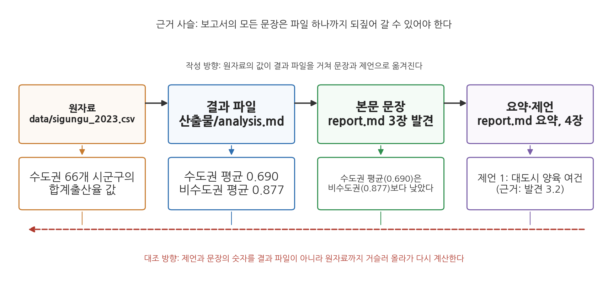
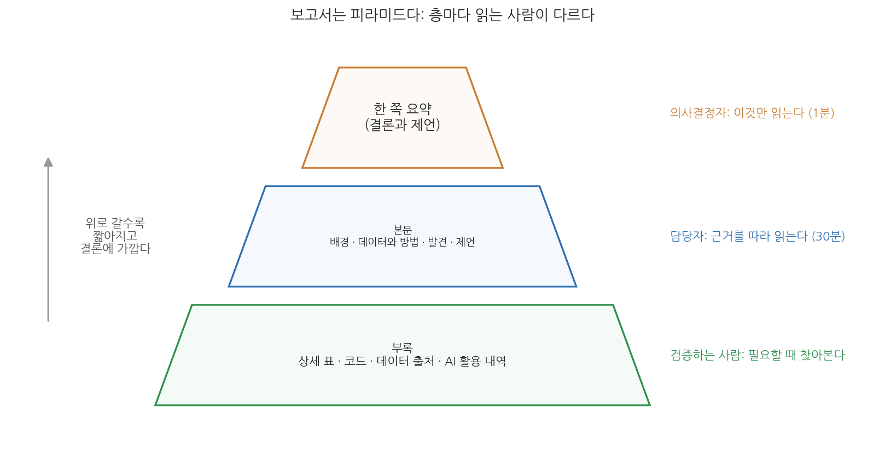
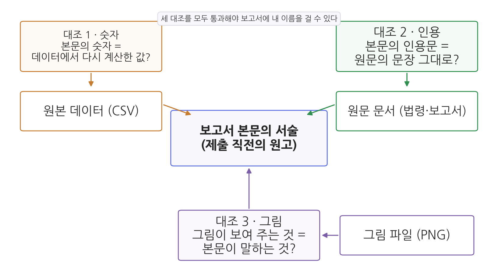
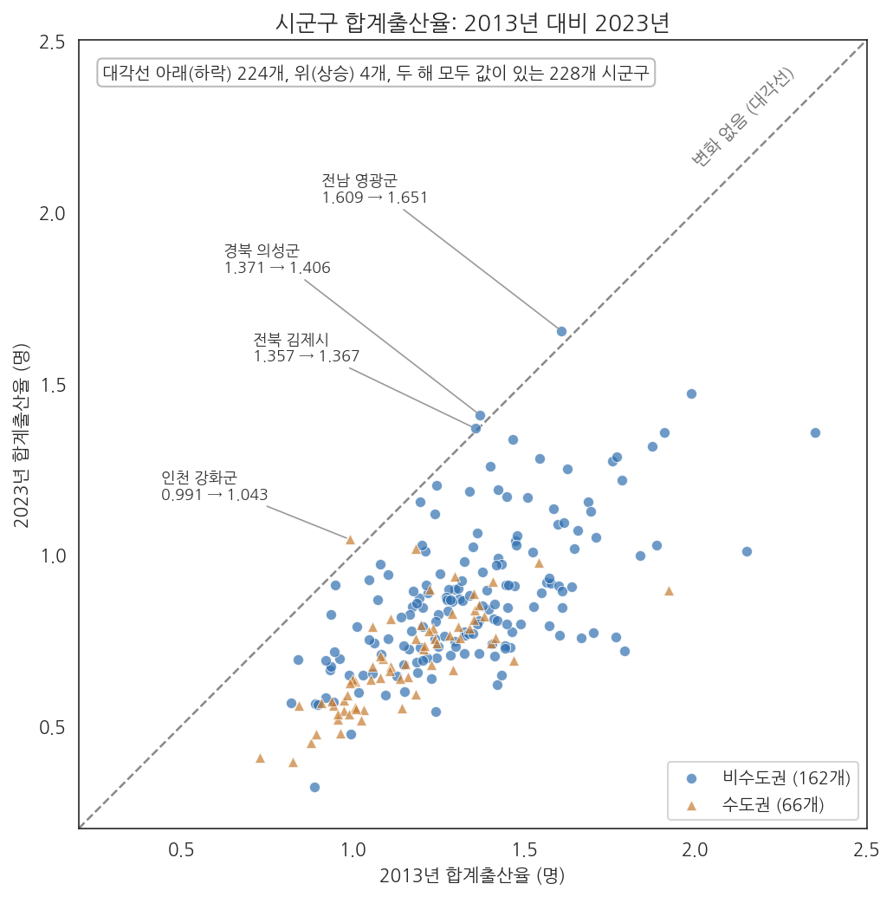
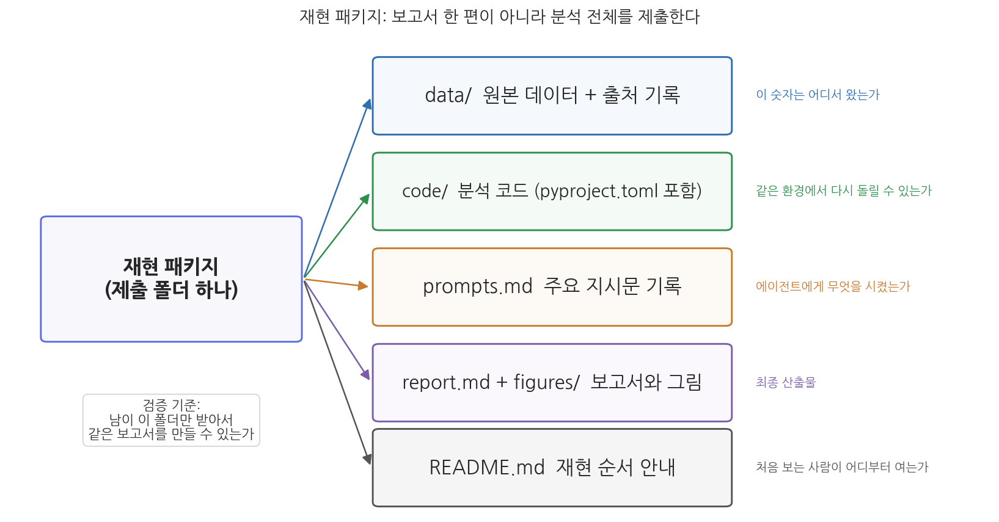

# 14주차 2회차. 종합 프로젝트: 나의 분석 보고서

## 이 실습에서 하는 것

한 학기의 마지막 실습이다. 6주차에 정한 학기 프로젝트 주제로, 13주차까지 다듬어 온 데이터와 파이프라인 산출물을 한 편의 정책 분석 보고서로 완성한다. 오늘의 목표는 새로운 분석을 추가하는 것이 아니라, 이미 검증된 분석을 남이 믿고 쓸 수 있는 문서와 패키지로 만드는 것이다. 1회차에서 배운 개념은 그것이 필요한 단계에서 화면에 나온 결과를 놓고 다시 짚는다. 단계마다 있는 "먼저 알아 둘 것"과 "짚고 가기"가 그 자리다.

완성 산출물은 두 가지다.

- **보고서**: 1회차의 표준 구조(요약-배경-데이터와 방법-발견-제언-부록)를 갖추고, 삼중 대조를 통과했으며, AI 활용 내역이 명시된 `report.md`
- **재현 패키지**: 데이터, 코드, 지시문 기록, 보고서를 한 폴더에 담아 "남이 이 폴더만 받아서 같은 결과를 재현할 수 있는" 상태로 꾸린 제출 폴더

작업 순서는 구조 정하기(2.1) → 초안 작성(2.2) → 삼중 대조(2.3) → 제언과 근거 잇기(2.4) → 한계 절 작성(2.5) → 요약 다시 쓰기(2.6) → 동료 검토(2.7) → 패키지 꾸리기와 재실행(2.8) → AI 활용 내역 작성(2.9) → 최종 점검 문답(2.10)이다. 마지막 2.11은 시간이 남을 때 하는 선택 심화다. 단계가 많아 보이지만 2.3부터 2.6까지는 모두 "초안을 읽고 고치는" 한 덩어리의 일을 대조 대상별로 나눈 것이고, 실제로는 두 번의 수업(초안과 대조, 검토와 제출)에 걸쳐 진행한다. 특히 2.7의 동료 검토에서는 옆 사람의 보고서를 검토하는 역할을 직접 해 본다.

시연은 13주차 공통 예제("지난 10년 사이 시군구 출산율은 어떻게 변했고, 고령화와 어떤 관계가 있는가")로 진행한다. 13주차 `산출물/` 폴더의 `merged.csv`, `analysis.md`, 그림 두 장, `report.md`가 그대로 오늘의 재료다. 본문의 수치는 모두 `data/` 폴더의 원본에서 계산한 값이며, 각자의 프로젝트에서는 자기 데이터로 같은 절차를 밟는다.

## 준비물

| 구분 | 내용 |
|------|------|
| 프로젝트 | 6주차에 시작해 13주차까지 다듬어 온 학기 프로젝트 폴더 (정제 데이터, 분석 코드, 그림, 13주차 파이프라인의 `산출물/` 폴더) |
| 데이터 | 각자의 프로젝트 데이터. 예시 시연은 `data/sigungu_2023.csv`(전국 229개 시군구 인구·합계출산율, 출처: 행정안전부 주민등록인구통계·국가데이터처(옛 통계청) 인구동향조사, KOSIS에서 수집), `data/sigungu_tfr_2013.csv`(2013년 시군구 합계출산율), 7주차에 병합한 `data/sigungu_tfr_2013_2023.csv` 기준 |
| 도구 | VSCode + Claude Code, uv 환경(3주차), 13주차에 등록한 verifier 서브에이전트(`.claude/agents/verifier.md`) |
| 선수 내용 | 14주차 1회차 (보고서 구조, 삼중 대조, AI 사용 명시), 13주차 2회차 (파이프라인, 재현성 테스트, verifier), 10주차 2회차 (사실·해석·제언의 세 층, 단위 표기), 2주차 (계획 모드, 검증 조건, 독립 검산, 지시문 라이브러리) |

## 2.1 보고서 구조 정하기: 근거 대응표 만들기

**무엇을 왜 하는가.** 보고서 초안은 한 번의 지시로 만들지 않는다. 2주차에서 배운 대로 큰 일은 쪼갠다. 구조를 먼저 합의하고, 장별로 따로 지시하고, 장마다 검증한다. 그런데 구조를 정할 때 목차만 정하면 절반이다. 나머지 절반은 각 소절이 어느 파일의 어느 값을 근거로 하는지를 미리 확인해 두는 일, 곧 근거 대응표다. 그림 14-3이 그 원리를 보여 준다.



그림 14-3를 읽는 법은 이렇다. 위쪽 네 상자는 숫자가 거쳐 가는 네 단계다. 원자료의 값이 결과 파일의 통계량이 되고, 그 통계량이 본문 문장에 인용되며, 문장이 요약과 제언의 근거가 된다. 아래 상자는 시연 예제에서 실제로 옮겨지는 값이다. 검은 화살표가 작성 방향이고, 붉은 점선 화살표가 대조 방향이다. 여기서 알 수 있는 것은 두 가지다. 보고서의 어느 문장이든 왼쪽으로 되짚어 가면 파일 하나에 닿아야 한다는 것, 그리고 대조가 결과 파일에서 멈추지 않고 원자료까지 가야 한다는 것이다. 결과 파일 자체가 틀렸을 가능성은 결과 파일로는 잡을 수 없다.

무엇을 말할 보고서인지는 에이전트가 아니라 여러분이 정한다. 장마다 어떤 질문에 답할 것인지 한 문장으로 정하고, 그 답이 어느 파일의 어느 값에 기대는지는 에이전트에게 파일을 열어 확인시킨다. 시연 예제라면 배경은 12주차 근거 메모에, 데이터와 방법은 `산출물/정제로그.md`에, 발견 세 소절은 `산출물/analysis.md`와 그림 두 장을 근거로 한다.

<div style="border:1px solid #cfe3d4;border-left:5px solid #2f8f4e;background:#f4fbf6;padding:12px 16px;margin:18px 0;border-radius:4px;">
<strong>지시문 예시</strong><br>
"내 학기 프로젝트의 최종 보고서를 쓰려고 한다. 계획 모드로 목차 초안부터 잡아 줘. 구조는 요약-배경-데이터와 방법-발견-제언-부록의 6개 장으로 하고, 산출물 폴더의 결과 파일과 그림을 하나씩 열어 소절마다 실제로 근거가 있는지 확인해 줘. 근거 파일이 없는 소절은 '근거 없음'이라고 표시하고, 필요한 계산이 무엇인지 적어 줘. 아직 본문은 쓰지 마."
</div>

**예상되는 에이전트의 행동과 결과.** 계획 모드에서 에이전트가 `산출물/` 폴더의 파일을 차례로 읽는다. 도구 사용 로그의 순서는 대개 산출물 폴더 목록 조회, `analysis.md`와 `정제로그.md` 읽기, 그림 파일 존재 확인의 차례이며, 소절 수만큼 파일 읽기가 나타난다. 그리고 다음과 같은 목차안을 돌려준다.

```
3. 발견
  3.1 10년 사이 출산율은 얼마나 내려갔나
      근거: 산출물/fig_change.png (그림만 있음) -> 근거 없음
      필요한 계산: merged.csv에서 2013·2023년 평균, 상승·하락 시군구 수
  3.2 수도권과 비수도권은 다른가
      근거: 산출물/analysis.md [1] 수도권 0.690 (n=66), 비수도권 0.877 (n=162)
  3.3 고령화와 출산율은 어떤 관계인가
      근거: 산출물/analysis.md [3] 기울기 0.00955, R제곱 0.154, fig_scatter.png
```

본문 작성은 시작하지 않고 계획 승인을 기다린다. 3.1에 "근거 없음"이 표시된 것은 지시문의 검증 조건(없다고 답할 자리)이 의도대로 작동한 결과다. 13주차 `analysis.md`에는 수도권 비교와 회귀만 있고 10년 변화의 통계량은 없기 때문이다. 그림은 있는데 숫자 파일이 없는 소절이 이렇게 드러나면 초안 전에 결과 파일부터 만들어야 한다는 신호이며, 구조를 정하는 단계에서 발견하는 것과 초안을 다 쓴 뒤 발견하는 것은 수정 비용이 크게 다르다. 근거를 그림 파일로만 적어 놓았으면 "그림은 근거 파일이 아니다. 숫자가 적힌 결과 파일이 있는지만 확인해"라고 되묻는다.

**짚고 가기: 목차의 여섯 장은 읽는 사람이 다른 세 층으로 나뉜다.** 방금 받은 목차안은 순서를 매긴 목록이 아니라 읽는 사람이 다른 세 층으로 구성한 것이다. 그림 14-1이 그 층을 보여 준다.



그림 14-1을 지금 화면의 목차안과 맞춰 읽어 보자. 맨 위의 한 쪽 요약은 결론과 제언만 담은 층으로, 의사결정자가 1분 안에 읽고 판단하는 자리다. 가운데 본문은 배경, 데이터와 방법, 발견, 제언이 들어가는 층이고, 목차안에서 근거 파일 이름이 붙은 "3. 발견"의 소절들이 모두 여기에 있다. 맨 아래 부록은 상세 표와 코드, 데이터 출처, AI 활용 내역이 들어가는 층으로, 검증하려는 사람이 필요할 때만 찾아본다. 여기서 알 수 있는 것은 두 가지다. 어느 층에 무엇을 둘지 정하는 일이 곧 보고서 설계라는 것, 그리고 맨 위 층은 아래 두 층이 완성된 뒤에야 쓸 수 있다는 것이다. 요약을 2.2의 마지막에 쓰고 2.6에서 다시 쓰는 까닭이 여기에 있다. (자세한 설명은 1회차 1.2, 표 14-1)

**검증.** 목차안의 근거 파일 이름을 `산출물/` 폴더의 실제 파일과 대조하고, "근거 없음" 소절은 초안에 앞서 결과 파일을 먼저 만든다. 시연 예제라면 "산출물/merged.csv에서 두 해 모두 값이 있는 시군구의 2013년·2023년 평균과 상승·하락 시군구 수를 계산해 산출물/change.md로 저장해 줘"라고 지시하고, 결과(228개 중 하락 224개, 상승 4개, 2013년 평균 1.289명에서 2023년 0.823명으로 0.467명 하락)를 받는다. 목차는 여러분이 고쳐서 확정한다.

## 2.2 보고서 초안을 에이전트와 함께 작성하기

**무엇을 왜 하는가.** 각 장은 성격이 달라서 지시문도 달라야 한다. "데이터와 방법"은 사실의 기록이므로 파일에 근거하게 하고, "발견"은 해석이 들어가므로 과잉해석을 막는 제약을 걸고, "요약"은 본문이 완성된 뒤 본문에서만 뽑게 한다. 그리고 각 문단에 근거 파일과 그림 번호를 달게 한다. 2.1의 근거 대응표가 초안 문단 하나하나에 적용되는 것이다.

**1단계: "데이터와 방법"과 "발견" 장 초안.**

<div style="border:1px solid #cfe3d4;border-left:5px solid #2f8f4e;background:#f4fbf6;padding:12px 16px;margin:18px 0;border-radius:4px;">
<strong>지시문 예시</strong><br>
"확정한 목차대로 '데이터와 방법' 장과 '발견' 장의 초안을 report.md에 작성해 줘. 제약이 네 가지 있다. (1) 모든 수치는 산출물 폴더의 결과 파일(analysis.md, change.md, 정제로그.md)에서 가져오고, 기억이나 추정으로 숫자를 쓰지 마. (2) '발견'의 각 소절은 질문 한 문장으로 시작하고, 근거 숫자를 제시한 뒤, 함의와 한계를 한 문장씩 붙이는 구조로 써. (3) 상관관계를 인과관계처럼 서술하지 마. (4) 각 문단 끝에 근거 파일명과 항목, 그림 번호를 대괄호 주석으로 임시로 달아 줘. 결과 파일에 없는 수치가 필요하면 쓰지 말고 '계산 필요'라고 표시해."
</div>

**예상되는 에이전트의 행동과 결과.** 결과 파일 세 개를 읽고 두 장의 초안을 작성한다. "데이터와 방법" 장은 정제로그를 산문으로 옮긴 꼴이 된다. "2023년 시군구 인구·출산 지표(229행)와 2013년 합계출산율(264행)을 시도·시군구를 키로 병합했다. 2013년 파일의 인천 남구는 현재 이름인 미추홀구로 연결했고, 2023년 합계출산율 결측 1곳(경북 군위군)은 제외했으며, 두 해 모두 값이 있는 228개 시군구를 분석했다. [근거: 정제로그.md]" 같은 문단이다. "발견" 장에서는 제약 (2) 덕분에 1회차에서 본 질문-근거-함의 문단이 만들어지고, 제약 (4)에 따라 문단마다 다음과 같은 근거 주석이 붙는다.

```
3.2 수도권과 비수도권은 다른가
수도권 66개 시군구의 2023년 합계출산율 평균은 0.690명으로, 비수도권 162개
시군구의 0.877명보다 0.187명 낮았다. (...) 다만 이는 권역 평균의 차이이며,
수도권 안에도 인천 강화군(1.043)처럼 비수도권 평균을 넘는 곳이 있다.
[근거: analysis.md 항목 [1]. 강화군 값은 merged.csv] (그림 없음)
```

**짚고 가기: 두 장은 성격이 다르다.** 화면에 나온 "데이터와 방법" 문단부터 보자. 병합의 키, 이름이 바뀐 지역의 연결, 결측 1곳 제외, 분석에 쓴 228개라는 숫자가 한 문단에 들어 있다. 발견만 궁금한 독자에게는 지루한 대목이지만, 모든 표준 구조가 이 장을 요구하는 이유는 이 장이 보고서의 검증 가능성을 담보하기 때문이다. 무슨 데이터를 어디서 받아 무엇을 제외하고 어떤 방법을 썼는지가 적혀 있어야 남이 같은 결과를 재현하거나 반박할 수 있다. 6주차의 메타데이터와 코드북이 데이터의 출처와 정의를 기록하듯 이 장은 분석의 출처와 처리 과정을 기록하며, 2.7에서 동료가 내 숫자를 다시 계산할 때 가장 먼저 읽는 곳도 여기다.

"발견" 장의 문단은 성격이 다르다. 3.2 소절을 보면 질문이 소제목으로 서고, 수도권 0.690명과 비수도권 0.877명이라는 근거가 이어지고, 마지막에 "다만 이는 권역 평균의 차이이며"라는 한계 단서가 붙는다. 같은 숫자라도 나열하면 그 의미가 드러나지 않지만, 질문에 답하는 순서로 배열하면 주장의 근거가 된다. 숫자를 고르고 배열하는 판단은 에이전트가 아니라 사람이 하며, 지시문의 제약 (2)는 그 배열의 틀을 미리 정해 준 것이다. (자세한 설명은 1회차 1.1, 1.2)

**검증.** 숫자 사이의 관계를 나타내는 표현("절반", "두 배", "가장 크다")은 직접 암산한다. 예를 들어 수도권 평균 0.690은 비수도권 평균 0.877의 약 79퍼센트이지 절반이 아니다. 근거 주석이 가리키는 항목에서 숫자를 찾을 수 없는 문단은 결과 파일이 아니라 기억에서 나온 것이다.

**2단계: 제언, 배경, 그리고 마지막에 요약.**

<div style="border:1px solid #cfe3d4;border-left:5px solid #2f8f4e;background:#f4fbf6;padding:12px 16px;margin:18px 0;border-radius:4px;">
<strong>지시문 예시</strong><br>
"report.md의 '발견' 장은 내가 수정을 마쳤다. 이제 (1) 각 제언이 어느 발견에서 나왔는지 괄호로 표시하는 방식으로 '제언' 장 초안을 쓰고, (2) 본문 전체에서만 근거를 가져와 '요약'을 1쪽 이내로 작성해 줘. 요약에는 핵심 질문, 주요 발견 3개(수치 포함), 제언을 담아. 본문에 없는 내용을 요약에 새로 만들어 넣지 마."
</div>

**예상되는 에이전트의 행동과 결과.** 발견과 짝지어진 제언, 그리고 1쪽 요약이 만들어진다. "본문에 없는 내용 금지" 제약은 요약 단계에서 본문에 없는 내용이 끼어드는 것을 막는 장치다. 화면에는 "제언 1. (...) (발견 3.2)"처럼 발견 번호가 붙은 제언 문단과, 핵심 질문 한 줄, 발견 세 줄, 제언 두세 줄로 된 요약이 보인다.

**짚고 가기: 한 쪽 요약만으로 의사결정이 가능해야 한다.** 화면의 요약은 핵심 질문 한 줄, 발견 세 줄, 제언 두세 줄로 짧지만, 이것만 읽어도 의사결정이 가능한 독립된 문서여야 한다. 하루에 수십 건의 문서를 받는 사람은 보고서를 읽을지 말지를 첫 쪽에서 정하므로, 첫 쪽에 결론이 없는 보고서는 결론까지 읽히지 못한다. 발견 세 줄에 수치를 하나씩 넣게 한 것도 그래서다. 수치가 빠진 요약은 "출산율이 낮아졌다"는 인상만 전하고, 읽는 사람은 본문을 펴야 판단할 수 있다.

요약을 쓰는 일은 분석의 핵심 주장이 정리되어 있는지 점검하는 일이기도 하다. 한 학기 분석을 한 쪽으로 줄이지 못한다면 대개 분량이 문제가 아니라 핵심 주장이 무엇인지 스스로 정리되지 않았다는 신호다. 줄이기가 막히는 자리가 있다면 그 자리를 기억해 두었다가 2.6에서 다시 쓸 때 확인한다. (자세한 설명은 1회차 1.2)

**검증.** 요약에 본문에 없는 내용이 끼어들었는지, 제언의 발견 연결 표시가 실제로 그 발견을 가리키는지만 본다. 요약은 2.6에서 다시 쓰고 제언의 근거 연결은 2.4에서 점검한다.

## 2.3 삼중 대조 실행: 숫자·인용·그림

**무엇을 왜 하는가.** 초안이 완성되었으니 제출 직전에 보고서를 숫자, 인용, 그림의 세 방향에서 원본과 맞춰 본다. 분석이 맞아도 문장을 다듬다가 0.690이 0.609가 되거나, 본문에는 옛 분석의 숫자가 남고 그림만 새 분석으로 바뀌는 오류가 보고서를 쓰는 단계에서 새로 생기기 때문이다. 요령은 대조표 작성은 에이전트에게 맡기고 판정은 사람이 하는 것이다.

**먼저 알아 둘 것.** 세 대조의 기준은 서로 다른 파일이어서 하나를 생략하면 그 방향의 오류는 어디에서도 걸러지지 않는다. 그림 14-2의 가운데 상자가 지금 화면에 열려 있는 `report.md`이고, 왼쪽 위의 대조 1은 본문의 숫자를 원본 데이터에서 다시 계산한 값과, 오른쪽 위의 대조 2는 인용문을 법령이나 보고서 원문과, 아래의 대조 3은 그림이 보여 주는 것과 본문이 말하는 것을 맞춘다. (자세한 설명은 1회차 1.3)



<div style="border:1px solid #cfe3d4;border-left:5px solid #2f8f4e;background:#f4fbf6;padding:12px 16px;margin:18px 0;border-radius:4px;">
<strong>지시문 예시</strong><br>
"verifier 서브에이전트를 써서 report.md를 세 방향으로 한꺼번에 대조해 줘. (1) 본문의 모든 수치를 추출해 다섯 열(본문의 문장, 본문 수치, 결과 파일의 값과 항목, 원본 데이터에서 다시 계산한 값과 계산 코드, 일치 여부)의 대조표로 만들어 줘. 재계산은 반드시 data 폴더의 원본 데이터에서 새 코드로 하고, 결과 파일이나 본문을 베끼지 마. 결과 파일에 없는 수치는 '결과 파일 없음'이라고 표시하고, 결과는 check_numbers.md로 저장해 줘. (2) 인용문이 있으면 조문 번호와 문구가 저장해 둔 원문 파일과 글자 단위로 같은지 확인하고, 인용이 없으면 없다고 보고해 줘. (3) 그림을 참조하는 문장마다 그림 번호, 본문이 그 그림에 대해 주장하는 내용 한 줄, 그림 파일 경로, 그림의 제목·축 이름·연도를 표로 정리해 check_figures.md로 저장해 줘. 그림이 그 주장을 실제로 보여 주는지는 내가 눈으로 판단하겠다."
</div>

**예상되는 에이전트의 행동과 결과.** verifier가 원자료와 보고서만 받아 독립적으로 대조하고, 13주차 지침대로 "대조 대상: report.md, 원자료: data/sigungu_2023.csv(229행), data/sigungu_tfr_2013_2023.csv(229행), 추출한 수치 14개, 일치 13개, 불일치 1개, 확인 불가 0개"처럼 머리말로 시작한 뒤 대조표를 이어 준다. 시연 예제의 대조표 일부가 표 14-2다.

**표 14-2. 숫자 대조표 `check_numbers.md`의 예 (시연 예제, 일부)**

| 본문 문장 | 본문 수치 | 결과 파일 | 원자료 재계산 | 판정 |
|------|------|------|------|------|
| 수도권 66개 시군구의 평균은 0.690명 | 0.690 | analysis.md [1] 0.690 | sigungu_2023.csv, 서울·경기·인천 66개 평균 0.6901 | 일치 |
| 비수도권 평균 0.877명보다 0.187명 낮았다 | 0.877 / 0.187 | analysis.md [1] 0.877 | 162개 평균 0.8766, 차이 0.1865 | 일치 |
| 인구밀도와의 상관계수는 -0.599 | -0.599 | 결과 파일 없음 | sigungu_2023.csv 228개, r = -0.5990 | 일치. 결과 파일에 추가 |
| 10년 사이 약 90%의 시군구에서 출산율이 하락했다 | 약 90% | 결과 파일 없음 | merged.csv 228개 중 하락 224개 = 98.2% | 불일치 |
| 2013년 평균 1.289명에서 2023년 0.823명으로 | 1.289 / 0.823 | change.md 1.289 / 0.823 | 228개 평균 1.2892 / 0.8227 | 일치 |

넷째 행은 결과 파일에 없는 수치가 "결과 파일 없음" 표시로 드러난 경우다. `change.md`에는 하락 시군구 수(224개)와 비율(98.2%)이 있을 뿐 "약 90%"는 어디에도 없고, 원자료에서 다시 세면 228개 중 224개, 98.2%다. 이런 행이 나오면 "발견 3.1의 '약 90%'는 결과 파일에 없는 수치다. change.md의 값으로 고치고, 상승한 4곳의 이름을 함께 적어 줘"라고 되묻는다. 수정된 문장은 "228개 중 224개(98.2%)에서 하락했고, 상승한 곳은 경북 의성군, 인천 강화군, 전남 영광군, 전북 김제시 4곳뿐이었다"가 된다.

**사람이 보는 항목: 그림 대조.** `check_figures.md`의 행마다 그림 파일을 열어 본문의 주장과 맞는지 눈으로 판정한다. 축 라벨, 단위, 연도가 본문 서술과 같은지, 본문이 "가장 낮다"고 말한 항목이 그림에서도 가장 낮은지 본다. 시연 예제의 그림 2(10년 변화)를 교재의 그림 14-4로 다시 그려 두었다.



그림 14-4를 읽는 법은 이렇다. 가로축이 2013년, 세로축이 2023년의 합계출산율이고, 점 하나가 시군구 하나다. 점선 대각선은 두 해의 값이 같은 자리이므로, 대각선 아래의 점은 10년 사이 출산율이 내려간 곳이다. 세모가 수도권, 동그라미가 비수도권이다. 여기서 알 수 있는 것은 거의 모든 점이 대각선 아래에 있다는 것(하락 224개), 대각선 위의 점은 이름이 표시된 4개뿐이라는 것, 그리고 2013년에 값이 높았던 곳(가로축 오른쪽)일수록 대각선에서 멀리 떨어져 있다는 것이다.

그림 대조가 잡는 것은 그림이 보여 주지 않는 주장이다. 본문이 "그림에서 보듯 수도권의 하락 폭이 비수도권보다 컸다"고 썼다면, 그림 14-4에서 세모와 동그라미가 대각선에서 떨어진 정도는 비슷해 보인다. 원자료로 재계산하면 수도권은 평균 0.458명, 비수도권은 0.470명 하락이므로 문장은 "두 권역의 하락 폭은 비슷했다(수도권 0.458명, 비수도권 0.470명)"로 고친다.

**검증.** 대조표의 불일치 행을 모두 확인해 본문 또는 분석을 고친다. 일치로 표시된 행 가운데 결정적 수치 하나만 새 대화에서 "data/sigungu_2023.csv에서 서울·경기·인천 시군구의 합계출산율 평균을 계산해 줘. 결측은 제외하고 개수도 보고해"라고 물어 독립 검산하고, 0.690과 66이 나오지 않으면 대조표부터 다시 만든다.

## 2.4 제언과 근거 잇기: 과잉 제언 걸러내기

**무엇을 왜 하는가.** 제언은 분석가가 책임을 지는 층이다(10주차 표 10-8). 그래서 제언 장의 흔한 오류는 숫자가 틀리는 것이 아니라, 데이터가 지지하지 않는 제언이 포함되는 것이다. 각 제언이 어느 발견에 기대는지를 표로 잇고, 연결이 끊긴 제언을 걸러 낸다.

<div style="border:1px solid #cfe3d4;border-left:5px solid #2f8f4e;background:#f4fbf6;padding:12px 16px;margin:18px 0;border-radius:4px;">
<strong>지시문 예시</strong><br>
"report.md의 제언 장에 있는 제언을 모두 뽑아서 표로 정리해 줘. 열은 4개다: 제언 문장, 근거가 되는 발견 번호와 그 발견의 핵심 수치, 이 제언이 그 발견에서 따라 나오는지에 대한 너의 판단(따라 나옴 / 부분적 / 근거 없음), 판단 이유 한 줄. 판단이 '근거 없음'이어도 제언을 고치지 말고 표시만 해. 최종 판단은 내가 한다."
</div>

**예상되는 에이전트의 행동과 결과.** 제언 장을 읽고 발견 장의 수치를 찾아 붙인 표를 돌려준다. 시연 예제에서 나온 표가 표 14-3이다.

**표 14-3. 제언-근거 연결표 (시연 예제)**

| 제언 | 근거 발견과 수치 | 판단 | 이유 |
|------|------|------|------|
| 저출산 대응의 초점을 지방 소멸 지역만이 아니라 청년이 밀집한 대도시의 주거·양육 여건으로 넓힐 필요가 있다 | 발견 3.2 (수도권 0.690 vs 비수도권 0.877, 인구밀도 상관 -0.599) | 따라 나옴 | 밀도가 높고 수도권일수록 낮다는 사실에서 초점 확장을 조건부로 제안 |
| 고령인구비율이 높은 지역의 출산 지원은 줄여도 된다 | 발견 3.3 (기울기 0.00955, R제곱 0.154) | 근거 없음 | 상관을 인과로 읽었고, 설명력 15%의 관계로 예산 축소를 말할 수 없음 |
| 수도권 신혼부부 주거 지원 예산을 20% 늘려야 한다 | 발견 3.2 | 근거 없음 | 20%라는 규모는 어떤 분석에서도 나오지 않음. 데이터 밖의 숫자 |
| 출산율이 오른 4곳(의성·강화·영광·김제)의 정책 사례를 조사할 필요가 있다 | 발견 3.1 (상승 4곳) | 부분적 | 조사 필요성은 따라 나오나, 상승이 정책 효과라고 말할 근거는 없음 |

둘째와 셋째 제언은 에이전트가 초안에 넣은 것이다. 둘 다 문장은 매끄럽고 발견 번호도 달려 있다. 그러나 둘째는 10주차에서 다룬 과잉해석이 제언의 형태로 다시 나타난 것이고, 셋째는 데이터에 없는 숫자(20%)가 제언을 구체적으로 보이게 하는 데 쓰인 것이다. 연결표가 없으면 "발견 3.2"라는 표시만 보고 통과시키기 쉽다.

**짚고 가기: 제언은 발견의 숫자를 넘을 수 없다.** 표 14-3의 둘째와 셋째 제언은 서술이 근거보다 앞선 사례다. 주장하려는 결론이 먼저 정해지면 그 결론에 맞는 숫자만 고르거나 데이터에 없는 숫자를 가져오기 쉽다. "예산을 20% 늘려야 한다"는 문장이 "예산을 늘릴 필요가 있다"보다 구체적으로 보이는 것이 그 예다. 그러나 서술은 숫자를 배열하는 방식이지 숫자를 선별하는 기준이 아니다. 질문에 답하는 순서로 숫자를 배열하는 것은 보고서의 서술 방식이지만, 결론에 맞춰 숫자를 고르거나 없는 숫자를 만들어 넣는 것은 근거의 조작이다.

제언 장은 그 경계가 가장 자주 무너지는 자리다. 발견 장에서는 결과 파일이 숫자를 제한하지만, 제언 장에는 대조할 원본이 따로 없기 때문이다. 대신 쓸 수 있는 원본이 발견 장이고, 표 14-3이 하는 일이 제언마다 그 원본을 붙여 주는 것이다. 결론에 불리한 숫자, 예컨대 수도권 안에도 비수도권 평균을 넘는 인천 강화군(1.043)이 있다는 사실을 본문에 남겨 두는 편이 보고서의 신뢰성을 높이기도 한다. (자세한 설명은 1회차 1.1)

**검증.** 판단 열은 에이전트의 의견이므로 행마다 다시 판정한다. 기준은 제언의 숫자와 방향이 발견에서 나오는가, 상관을 인과로 바꾸지 않았는가, 제언의 규모가 데이터 밖에서 오지 않았는가의 셋이다. "근거 없음" 제언은 삭제하거나 "추가 분석이 필요하다"는 조건부 제언으로 바꾼다. 시연 예제에서는 둘째와 셋째를 삭제하고 넷째를 "상승 원인은 본 분석의 범위 밖이므로 사례 조사가 선행되어야 한다"는 조건부 제언으로 바꾸게 해 제언 2개가 남았고, 남은 제언마다 근거 발견을 괄호로 본문에 남긴다. 그것이 1회차 표 14-1의 "발견과 제언의 연결 고리를 명시"다.

## 2.5 한계 절 작성과 근거 연결

**무엇을 왜 하는가.** 1회차 1.1절에서 좋은 문단은 함의로 끝맺되 한계를 함께 적는다고 배웠고, 1.4절에서 데이터에 기록되지 않은 사람을 한계에 포함하라고 배웠다. 그런데 한계 절은 에이전트가 가장 상투적으로 쓰는 절이기도 하다. 어떤 분석에나 붙일 수 있는 문장("표본 크기의 한계", "추가 연구가 필요하다")은 이 분석의 한계가 아니라 형식적인 문장이다. 이 단계에서는 한계를 정제로그와 결과 파일에서 뽑아, 각 한계가 어느 발견에 어떻게 영향을 주는지 표로 잇는다. 2.4에서 제언을 발견에 이었던 것과 같은 원리를 한계에 적용하는 것이다.

<div style="border:1px solid #cfe3d4;border-left:5px solid #2f8f4e;background:#f4fbf6;padding:12px 16px;margin:18px 0;border-radius:4px;">
<strong>지시문 예시</strong><br>
"report.md의 '발견' 장 끝에 넣을 '한계' 소절의 재료를 표로 만들어 줘. 산출물/정제로그.md와 산출물/analysis.md, 그리고 '데이터와 방법' 장을 읽고, 이 분석의 결과 해석에 영향을 주는 한계를 뽑아. 열은 4개다: 한계, 근거 파일과 위치, 영향을 받는 발견 번호, 그 발견의 해석을 어떻게 제한하는가 한 문장. 파일에서 근거를 찾을 수 없는 한계는 넣지 마. 다만 상관과 인과의 구분, 집계 데이터의 성격, 데이터에 기록되지 않은 사람에 관한 한계는 파일 근거가 없어도 넣되 '방법상 한계'라고 표시해."
</div>

**예상되는 에이전트의 행동과 결과.** 정제로그의 처리 기록(미추홀구 연결, 군위군 결측, 2013년 파일에만 있는 36행, 청주시 관할 변경)과 `analysis.md`의 R제곱을 근거로 표를 만든다. 시연 예제의 결과가 표 14-4다.

**표 14-4. 한계-근거 연결표 (시연 예제)**

| 한계 | 근거 파일과 위치 | 영향받는 발견 | 해석의 제한 |
|------|------|------|------|
| 2023년 합계출산율 결측 1곳(경북 군위군, 2023년 7월 대구 편입) | 정제로그.md 결측 항목 | 3.1, 3.2, 3.3 | 모든 평균·상관은 228개 기준이며 229개가 아니다 |
| 충북 청주시의 2013년 값은 2014년 통합 전 옛 청주시의 값 | 정제로그.md 병합 항목 | 3.1 | 청주시의 10년 변화는 관할 범위가 다른 두 값의 비교다 |
| 2013년 파일에만 있어 짝이 없는 36행(대부분 큰 시의 일반구)은 제외 | 정제로그.md 병합 항목 | 3.1 | 정보 손실은 아니나, 큰 시 안의 구별 변화는 볼 수 없다 |
| 고령인구비율의 설명력이 R제곱 0.154에 그침 | analysis.md [3] | 3.3 | 시군구 간 출산율 차이의 약 85%는 이 관계 밖의 요인이다 |
| 관찰 자료의 상관·회귀 (방법상 한계) | 없음 | 3.2, 3.3 | 인구밀도나 고령화가 출산율을 낮추거나 높인다고 말할 수 없다 |
| 시군구 단위 집계 자료 (방법상 한계) | 없음 | 3.2, 3.3 | 지역 평균의 관계를 개인의 선택으로 읽을 수 없다 |
| 주민등록 기준 인구 (방법상 한계) | 데이터와 방법 장 출처 | 3.2 | 등록지와 실제 거주지가 다른 사람은 그 지역 값에 반영되지 않는다 |
| 표본 크기가 작아 일반화에 한계가 있다 | 없음 | (전체) | 근거 없음. 229개 시군구 전수 자료이므로 표본 문제가 아니다 |

마지막 행처럼 근거 열이 "없음"인데 방법상 한계 표시도 없으면 상투구다. 이 분석은 전국 229개 시군구 전수 자료이므로 표본 크기는 한계가 아니다. 이런 행이 나오면 "마지막 행은 근거가 없고 이 자료는 전수 자료다. 삭제하고, 대신 '2023년 한 해의 단면 자료라 3.1의 두 시점 비교 외에는 시간에 따른 변동을 다루지 않았다'는 한계로 바꿔 줘"라고 되묻는다.

**짚고 가기: 데이터에 기록되지 않은 사람.** 표 14-4의 "주민등록 기준 인구" 행을 다시 보자. 이 한계는 파일이 틀렸다는 말이 아니라, 데이터가 세상의 중립적 기록이 아니라 특정한 수집 절차의 산물이라는 말이다. 주민등록은 등록지를 기록하므로 등록지와 실제 사는 곳이 다른 사람은 그 지역의 값에 잡히지 않는다. 학업이나 일 때문에 옮겨 살면서 등록을 옮기지 않은 청년이 많은 지역이라면, 그 지역의 인구와 출산 지표는 실제 생활 인구와 어긋난다. 11주차의 민원 데이터도 같은 성질이었다. 민원 데이터는 주민의 불편이 아니라 민원을 제기한 주민의 불편을 기록하며, 제도를 모르거나 접근이 어려운 사람의 불편은 데이터에 아예 없다.

그래서 한계 절에는 "이 데이터에 기록되지 않은 사람은 누구인가"라는 질문의 답을 한 줄이라도 넣는다. 이것이 편향에 대한 최소한의 대응이다. 데이터에 없는 사람을 적어 두지 않으면, 그들은 분석에서 제외된 데 이어 정책 논의에서도 제외된다. 표 14-4의 집계 자료 행도 같은 계열의 한계다. 지역 평균의 관계를 개인의 선택으로 읽는 순간, 평균에 포함된 개인별 차이가 하나의 숫자로 합쳐진다. (자세한 설명은 1회차 1.4)

**검증.** 사람이 볼 것은 근거 열이 "없음"인데 방법상 한계 표시도 없는 행, 곧 상투구다. 근거가 파일의 그 위치에 있는지는 에이전트에게 위치를 짚어 보고하게 한다. 표를 산문으로 옮긴 한계 소절 초안에는 표에 없는 문장이 끼어들지 않았는지, 한계 중 하나 이상이 2.4에서 조건부로 바꾼 제언의 조건("사례 조사가 선행되어야 한다")과 이어지는지만 본다.

## 2.6 요약 다시 쓰기와 본문 대조

**무엇을 왜 하는가.** 2.2에서 요약을 한 번 썼다. 그 뒤 2.3-2.5에서 본문이 여러 군데 바뀌었다. 숫자가 고쳐졌고(약 90%에서 98.2%로), 문장이 바뀌었고(하락 폭 비교), 제언이 줄었고(4개에서 2개로), 한계가 추가되었다. 요약은 자동으로 따라오지 않는다. 그래서 본문 수정이 끝난 지금 요약을 처음부터 다시 쓰고, 요약의 문장마다 본문에 짝이 있는지 확인한다.

<div style="border:1px solid #cfe3d4;border-left:5px solid #2f8f4e;background:#f4fbf6;padding:12px 16px;margin:18px 0;border-radius:4px;">
<strong>지시문 예시</strong><br>
"report.md의 본문(배경, 데이터와 방법, 발견, 한계, 제언)은 수정이 끝났다. 기존 요약을 지우고 본문만 근거로 요약을 다시 써 줘. 구성은 핵심 질문 1문장, 데이터와 방법 1문장, 주요 발견 3개(각각 수치 1개 이상), 한계 1문장, 제언(본문 제언 장에 지금 남아 있는 것만)이다. 문장마다 본문의 어느 장 어느 문단에서 왔는지를 괄호로 표시하고, 본문에 없는 문장은 쓰지 마."
</div>

**예상되는 에이전트의 행동과 결과.** 새 요약이 나오고 문장마다 "(3.1 첫 문단)"처럼 본문 위치가 붙는다. 이미 삭제한 제언이 요약에 다시 들어가 있으면 "4장 제언 장을 다시 읽고 지금 남아 있는 제언 2개만으로 다시 써 줘"라고 되묻는다. 요약처럼 마지막에 쓰는 문서는 새 대화에서 파일만 주고 쓰게 하는 편이 안전하다(2주차에서 배운 맥락창의 성질).

**검증.** 위치 표시가 장 단위로만 뭉뚱그려진 문장은 본문에 짝이 없을 가능성이 높으므로 삭제하거나 본문을 보강하고, 수치가 든 문장은 자리수까지 본문과 같은지 본다. 확인이 끝나면 괄호 표시는 지운다.

## 2.7 동료 검토: 다른 사람의 보고서를 검증해 보기

**무엇을 왜 하는가.** 실무의 보고서는 반드시 남의 검토를 거친다. 오늘은 그 절차를 워크숍으로 압축해 본다. 목적은 두 가지다. 내 보고서의 빈틈을 다른 사람의 관점에서 찾는 것, 그리고 남의 보고서를 검증하는 경험으로 내 검증 감각을 기르는 것.

**워크숍 절차 (2인 1조, 약 40분).**

1. **교환 (5분).** 짝과 보고서 초안, 데이터, 코드가 든 프로젝트 폴더를 통째로 교환한다. 보고서 파일만 주고받으면 검증이 불가능하다. 이 경험은 2.8에서 재현 패키지가 왜 필요한지 직접 보여 준다.
2. **숫자 검증 (15분).** 상대 보고서의 요약과 발견 장에서 핵심 주장에 쓰인 수치 3개를 고른다. 상대의 원본 데이터에서 그 수치를 직접 재계산한다. 이때 자신의 에이전트를 써도 된다. 단, 상대의 분석 코드를 실행해 베끼는 것이 아니라 원본 데이터에서 새로 계산하게 한다.
3. **독자 검증 (10분).** 요약만 읽고 다음 세 질문에 답해 본다. 이 보고서의 핵심 질문은 무엇인가. 가장 중요한 발견은 무엇인가. 제언은 발견과 연결되는가. 답이 막히는 지점이 곧 요약의 결함이다.
4. **의견 전달 (10분).** 재계산한 세 수치의 일치 여부, 요약만 읽고 파악되지 않았던 것, 고치면 좋을 점 두 가지를 상대에게 말로 전한다. 숫자나 결론이 바뀌는 문제를 먼저 말하고, 서술이나 근거 연결의 문제를 다음에, 표현과 형식의 문제를 마지막에 말한다. 무엇부터 고쳐야 할지가 그 순서로 정해진다.

<div style="border:1px solid #cfe3d4;border-left:5px solid #2f8f4e;background:#f4fbf6;padding:12px 16px;margin:18px 0;border-radius:4px;">
<strong>지시문 예시</strong><br>
"이 폴더는 동료의 프로젝트다. 동료의 코드는 실행하지 말고 data 폴더의 원본 데이터만 써서 다음 세 수치를 새로 계산해 줘. (1) 서울·경기·인천 시군구의 2023년 합계출산율 평균, (2) 2013년 대비 2023년에 합계출산율이 하락한 시군구 수와 두 해 모두 값이 있는 시군구 수, (3) 고령인구비율과 합계출산율의 상관계수. 계산에 쓴 파일, 행 수, 결측 처리 방식을 함께 보고해."
</div>

**예상되는 에이전트의 행동과 결과.** 에이전트가 `data/` 폴더의 파일만 읽어 세 값을 계산하고, "sigungu_2023.csv 229행, 합계출산율 결측 1개(경북 군위군) 제외, 수도권 66개 평균 0.690" 같은 형식으로 보고한다. 동료의 코드를 열어 보려 하면 막는다. 코드를 보는 순간 독립 검산이 아니게 된다.

**검증.** 받은 의견은 하나씩 수용 여부를 정하고 그 자리에서 보고서를 고친다. 수용이든 거절이든 그 이유를 그 자리에서 댈 수 있어야 하며, 분석 방법의 선택에 관한 의견을 거절한다면 그렇게 선택한 이유를 데이터와 방법 장에 적는 것으로 대신한다.

<div style="border:1px solid #ecd9c6;border-left:5px solid #c77b2f;background:#fdf9f4;padding:12px 16px;margin:18px 0;border-radius:4px;">
<strong>유의 · 불일치가 나왔을 때의 대응</strong><br>
동료의 재계산 값이 내 본문 값과 다르다고 해서 곧장 누가 틀렸다고 단정하지 말 것. 먼저 두 사람이 같은 것을 계산했는지 확인한다. 결측을 뺐는가 포함했는가, 단순 평균인가 가중 평균인가, 어느 시점 데이터인가에 따라 값은 정당하게 달라질 수 있다. 7주차에서 배운 대로 처리 기준이 다르면 숫자가 달라진다. 기준을 맞춘 뒤에도 다르면 그때 오류를 찾는다. 그리고 이 확인이 쉬우려면 보고서의 "데이터와 방법" 장에 그 기준들이 적혀 있어야 한다. 동료 검토는 그 장의 완성도를 시험하는 자리이기도 하다.
</div>

## 2.8 재현 패키지 꾸리기와 다른 폴더에서 재실행

**무엇을 왜 하는가.** 검토를 반영한 보고서를 포함해, 분석 전체를 재현 패키지로 꾸린다. 그리고 꾸린 패키지를 다른 폴더에서 처음부터 다시 실행해 같은 수치가 나오는지 본다. 13주차의 재현성 테스트가 파이프라인의 시험이었다면, 오늘은 제출물 전체의 시험이다. 이 폴더는 학기의 마지막 제출물이자, 과목이 끝난 뒤에도 "데이터 분석을 할 줄 안다"는 말을 증명하는 실물로 남는다(1회차 1.5).



그림 14-5을 읽는 법은 이렇다. 왼쪽이 제출 폴더 하나이고, 오른쪽 다섯 개가 그 안에 들어갈 구성 요소다. 각 요소의 오른쪽 글씨는 그 요소가 답하는 질문이다. 데이터는 숫자의 출처를, 코드는 재실행 가능성을, 지시문 기록은 에이전트에게 시킨 내용의 투명성을, README는 재현 순서를 각각 보장한다. 다섯 가운데 하나라도 빠지면 "남이 재현할 수 있는가"라는 검증 기준이 무너진다는 것이 이 그림의 요점이다.

**먼저 알아 둘 것.** 구성 요소 중 지시문 기록(`prompts.md`)이 낯설 수 있다. 코드가 "컴퓨터에게 시킨 일"의 기록이라면, 지시문은 "에이전트에게 시킨 일"의 기록이다. 에이전트 기반 분석에서는 같은 코드라도 어떤 지시로 만들어졌는지가 분석 과정의 일부다. 그래서 이 파일은 읽는 사람이 "무엇을 어디까지 에이전트에게 맡겼는가"를 직접 확인할 수 있게 해 주며, 그 확인 가능성이 곧 투명성이다. 2.9에서 쓸 AI 활용 내역도 기억이 아니라 이 파일을 근거로 쓴다. 2주차부터 지시문 라이브러리를 쌓아 왔다면 이 파일은 거의 완성되어 있다. (자세한 설명은 1회차 1.4)

<div style="border:1px solid #cfe3d4;border-left:5px solid #2f8f4e;background:#f4fbf6;padding:12px 16px;margin:18px 0;border-radius:4px;">
<strong>지시문 예시</strong><br>
"제출용 재현 패키지를 꾸리자. submission 폴더를 만들고 (1) data 폴더(원본 데이터와 출처·수집일 기록), (2) code 폴더(분석 코드와 pyproject.toml), (3) 이번 학기 주요 지시문을 단계별로 정리한 prompts.md, (4) report.md와 산출물 폴더, (5) 처음 보는 사람이 재현하는 순서를 담은 README.md를 채워 줘. README에는 uv로 환경을 만들고 코드를 실행하는 명령을 순서대로 적어. 코드가 읽는 모든 데이터 파일이 data 폴더에 있는지 코드를 열어 확인하고, 다 만들면 폴더 구조를 보여 줘."
</div>

**예상되는 에이전트의 행동과 결과.** 폴더를 만들고 파일을 복사·정리한 뒤 구조를 트리 형태로 보여 준다. README에는 3주차에서 배운 uv 명령 기반의 재현 순서가 담긴다.

```
submission/
  README.md            재현 순서 (uv sync -> uv run python code/run_all.py)
  report.md            최종 보고서 (AI 활용 내역 포함)
  prompts.md           주요 지시문 (수집·정제·분석·시각화·보고 순)
  data/  sigungu_2023.csv, sigungu_tfr_2013.csv, 출처.md
  code/  pyproject.toml, run_all.py, merge.py, analysis.py, figures.py
  산출물/  fig_scatter.png, fig_change.png
  check/  check_numbers.md, check_figures.md, 제언연결표.md, 한계연결표.md
```

README의 본문은 다음처럼 짧고 순서가 분명해야 한다.

```
# 재현 순서
1. uv sync                          code/pyproject.toml 기준으로 환경을 만든다
2. uv run python code/run_all.py    merge -> analysis -> figures 순서로 실행된다
3. 산출물/의 analysis.md, change.md, 그림을 report.md의 수치·그림과 대조한다
필요한 데이터: data/sigungu_2023.csv, data/sigungu_tfr_2013.csv (출처는 data/출처.md)
```

`check/` 폴더는 지시문에 없었지만 에이전트가 2.3-2.5의 검증 산출물을 모아 두었다면 그대로 둔다. 삼중 대조의 증빙이 혼자 해 보기 14-A에서 스스로 확인할 항목이기 때문이다.

**짚고 가기: 제출 폴더에 넣는 데이터.** 방금 만든 트리에서 `data/`를 보자. 시연 예제의 두 파일은 시군구 단위로 합산된 집계 데이터라 특정 개인을 식별할 수 없다. 그러나 각자의 프로젝트 데이터가 개인 단위이거나 칸이 잘게 쪼개진 표라면 폴더에 넣기 전에 세 가지를 확인한다. 이 데이터를 제출물에 그대로 담아도 되는 이용허락 범위인가(6주차), 보고서에 실린 결과가 집계 수준인가, 그리고 표에 "어느 면의 30대 외국인 여성 1명"처럼 한 사람이 드러나는 칸이 없는가. 통계 기관들이 이런 작은 칸을 비공개로 처리하거나 반올림하는 이유가 여기에 있다.

각각은 익명인 데이터도 여러 개를 이어 붙이면 개인이 다시 식별될 수 있으므로, 7주차에서 병합을 많이 한 프로젝트일수록 이 확인이 필요하다. 개인정보가 든 파일을 웹 검색이나 외부 서비스로 보내는 작업을 에이전트가 제안하면 승인하지 않는 것도 같은 이유다. 재현 패키지는 남에게 건네려고 만드는 폴더이므로, 검토 없이 넣은 원본 파일 하나가 그대로 퍼진다. (자세한 설명은 1회차 1.4)

**검증.** 최종 재현성 테스트다. 먼저 에이전트에게 "submission 폴더를 바탕화면의 새 폴더 repro_test로 통째로 복사해 줘"라고 시키고, 복사가 끝나면 VSCode에서 repro_test 폴더를 열고 새 대화를 시작한다(폴더를 여는 일과 새 대화는 사람이 한다).

<div style="border:1px solid #cfe3d4;border-left:5px solid #2f8f4e;background:#f4fbf6;padding:12px 16px;margin:18px 0;border-radius:4px;">
<strong>지시문 예시</strong><br>
"이 폴더는 다른 사람이 만든 재현 패키지다. README.md만 보고 분석을 처음부터 재실행해 줘. 이 폴더 밖의 파일은 절대 읽거나 복사하지 마. 막히는 지점이 있으면 스스로 고치지 말고 어디서 왜 막혔는지 보고하고 멈춰. 끝까지 실행되면 report.md의 요약에 있는 수치와 재실행 결과를 나란히 표로 보여 줘."
</div>

재실행이 데이터 파일 누락으로 막히거나 에이전트가 원본 프로젝트 폴더에서 파일을 가져오려 하면 시험이 무효가 되므로 "이 폴더 밖으로 나가지 마. 빠진 파일 이름만 보고해"라고 되묻는다. 보고받은 누락 항목은 원본 프로젝트의 `submission/`에 보완하고 복사부터 다시 한다.

끝까지 실행되면 마지막 표에서 수도권 평균 0.690, 비수도권 0.877, 하락 224개, 기울기 0.00955가 재실행에서도 같은 값인지 본다. 13주차 2.6절의 기준 그대로 숫자는 완전히 같아야 하고 문장 표현은 달라도 된다. 하나라도 다르면 보고서 작성 중 데이터나 코드를 고치고 그림이나 결과 파일을 다시 만들지 않았을 가능성이 크므로 그 원인부터 찾는다.

## 2.9 AI 활용 내역 작성

**무엇을 왜 하는가.** 1회차 1.4절에서 AI 사용 명시의 네 요소(도구·범위·검증·책임)를 배웠다. 그 문구를 쓰려면 먼저 이번 학기에 무엇을 에이전트가 했고 무엇을 사람이 확인했는지가 여러분의 머릿속에 정리되어 있어야 한다. 시연 예제라면 에이전트는 수집(kosis MCP 조회), 정제와 병합, 분석·시각화 코드, 초안 작성, 그리고 verifier의 숫자 대조를 했고, 사람은 수집한 값 하나를 포털과 대조하고, 병합 결과 229행과 미추홀구 연결을 확인하고, 결정적 수치 하나를 새 대화의 독립 검산으로 확인했으며, 그림 두 장을 본문 서술과 눈으로 맞추고, 근거 없는 제언 2개와 상투적 한계 1개를 걷어 냈다. 이 내용은 `prompts.md`와 `check/` 폴더의 파일에 이미 기록으로 남아 있다.

<div style="border:1px solid #cfe3d4;border-left:5px solid #2f8f4e;background:#f4fbf6;padding:12px 16px;margin:18px 0;border-radius:4px;">
<strong>지시문 예시</strong><br>
"prompts.md와 check 폴더의 파일을 읽고, report.md의 '데이터와 방법' 장 끝에 넣을 AI 활용 내역 문단을 5문장 이내로 써 줘. 도구와 버전, 활용 범위, 검증 절차, 최종 책임의 네 요소를 모두 담되, 파일에 흔적이 없는 검증을 했다고 쓰지 말고 실제 활용 범위를 줄여서 쓰지도 마."
</div>

**예상되는 에이전트의 행동과 결과.** 1회차의 예시 문구와 비슷한 꼴의 문단이 나온다. "이 보고서는 AI 에이전트(Claude Code, VSCode 확장, 2026년 6월 기준 버전)를 활용하여 작성되었다. 활용 범위는 데이터 수집·정제·분석 코드의 작성과 실행, 그림 생성, 본문 초안 작성 보조다. 분석 질문의 설정, 방법의 선택, 결과의 해석과 제언은 작성자가 수행하였다. 본문의 모든 수치는 검증 전담 서브에이전트가 원본 데이터에서 재계산하여 대조하였고, 그중 핵심 수치 1개는 작성자가 별도의 대화에서 독립적으로 재계산하여 확인하였으며, 그림은 본문 서술과 대조하였고 인용문은 없었다. 최종 책임은 작성자에게 있다." 활용 범위가 실제보다 좁게 적혀 있으면(예를 들어 초안 작성 보조가 빠져 있으면) `prompts.md`에 장별 초안을 시킨 지시문이 남아 있으므로 바로 드러나고, 범위를 실제대로 넓혀 다시 쓰게 한다. 활용 범위를 실제보다 좁게 적는 것은 검증을 부풀리는 것만큼 투명성을 해친다.

**짚고 가기: 네 요소가 화면의 문단에 어떻게 들어갔나.** 방금 받은 문단을 문장 단위로 끊어 보자. 첫 문장이 도구(무엇을, 어느 버전으로), 둘째와 셋째 문장이 범위(에이전트에게 맡긴 일과 사람이 한 일의 경계), 넷째 문장이 검증(누가 무엇을 어떻게 확인했는가), 마지막 문장이 책임이다. 네 요소를 요구하는 이유는 각각이 다른 질문에 답하기 때문이다. 도구와 범위가 없으면 어디까지가 사람의 판단인지 알 수 없고, 검증이 없으면 밝혔다는 사실만 남으며, 책임 문장이 없으면 오류가 나왔을 때 이름을 걸 사람이 없다. AI를 저자로 올리지 않는 국내외 관행도 같은 이유에서 나온다. 책임은 사람만 질 수 있다.

AI 사용 명시는 보고서의 약점을 인정하는 일이 아니다. 검증 절차까지 함께 적힌 이 문단은 "이 보고서는 어디까지 믿을 수 있고 어떻게 확인할 수 있는가"를 알려 주는 품질 정보다. 위 예시 문단에서 서브에이전트의 대조와 작성자의 독립 검산, 그림 대조가 적힌 대목이 바로 그 정보에 해당한다. 반대로 사용을 숨겼다가 드러나면 무너지는 것은 그 보고서 하나가 아니라 작성자가 앞으로 쓸 모든 보고서에 대한 신뢰다. (자세한 설명은 1회차 1.4)

**검증.** 문단을 실제로 한 일과 한 문장씩 대조해 네 요소가 모두 있는지, 활용 범위와 검증 절차의 서술이 실제보다 넓거나 좁지 않은지("모든 그림을 재생성하여" 같은 하지 않은 일이 없는지) 본다. 문단을 `report.md`에 넣었으면 에이전트에게 `submission/report.md`도 같은 판본으로 맞추게 한다.

## 2.10 제출 전 최종 점검: 에이전트와 문답으로

**무엇을 왜 하는가.** 실무에서 보고서를 올리기 전에는 "이 숫자는 어디서 나왔나", "이 제언의 근거는 무엇인가" 같은 질문에 답해야 하는 자리가 있고, 답이 막히면 보고서는 되돌아온다. 그 자리를 에이전트와 미리 연습한다. 이번에는 에이전트가 심사관이 되어 묻고 여러분이 답하며, 파일 위치를 대며 답할 수 있으면 통과, 댈 수 없으면 보고서의 누락이다.

<div style="border:1px solid #cfe3d4;border-left:5px solid #2f8f4e;background:#f4fbf6;padding:12px 16px;margin:18px 0;border-radius:4px;">
<strong>지시문 예시</strong><br>
"너는 이 보고서를 심사하는 상급자다. report.md와 check 폴더의 검증 기록을 읽고, 내가 답해야 할 질문 10개를 만들어 줘. 질문은 (1) 특정 수치의 출처와 계산 조건, (2) 제언과 발견의 연결, (3) 한계가 결론에 미치는 영향, (4) 재현 방법의 네 범주에서 골고루 내고, 각 질문에 '답의 근거가 있어야 할 파일'을 붙여 줘. 질문만 하고 답은 하지 마. 내가 답하면 그 답이 보고서의 어느 문장과 맞는지, 안 맞는지, 보고서에 아예 없는지만 판정해 줘."
</div>

**예상되는 에이전트의 행동과 결과.** 질문 10개가 번호와 근거 파일과 함께 나온다. 시연 예제에서 나온 질문은 다음과 같은 꼴이다.

```
1. 수도권 평균 0.690명은 몇 개 시군구의 어떤 평균인가. 가중 평균인가. [근거: 2장, 정제로그.md]
2. 하락 224개는 몇 개 중 224개인가. 229개가 아닌 이유는. [근거: 3.1, 한계 첫 행]
3. 제언 1(대도시 양육 여건)은 어느 발견의 어떤 수치에서 나오는가. [근거: 4장, 제언연결표.md]
4. 고령화와 출산율의 관계가 인과가 아니라면, 그 관계를 보고서에 넣은 이유는. [근거: 3.3, 한계]
5. 청주시의 2013년 값은 어느 관할의 값인가. 본문에 밝혔는가. [근거: 정제로그.md, 한계]
6. 그림 2의 대각선 위 4곳을 조사하자는 제언은 상승의 원인을 아는가. [근거: 4장]
7. 채점자가 README만으로 재현할 때 필요한 데이터 파일은 몇 개이며 모두 data 폴더에 있는가. [근거: README.md]
8. 본문 수치 중 사람이 직접 검산한 것은 어느 것인가. [근거: 부록 검증 기록]
9. 인용문이 없다면 배경 장의 정책 맥락 서술은 무엇에 근거하는가. [근거: 1장]
10. 이 보고서에서 AI가 하지 않은 일은 무엇인가. [근거: AI 활용 내역]
```

여러분이 질문마다 한 줄로 답하고 근거 파일을 함께 대면 에이전트가 각 답을 "일치 / 불일치 / 보고서에 없음"으로 판정한다. 답을 대신 쓰게 하면 이 단계가 또 하나의 초안 작성이 되므로 시키지 않는다.

**검증.** "일치"는 통과, "불일치"는 어느 쪽이 맞는지 파일로 확인해 고치고, "보고서에 없음"은 누락이므로 보고서에 보완한다. 시연 예제의 5번처럼 답이 정제로그에 있어도 한계 소절의 산문에 옮기지 않았으면 이 경우다. 6번처럼 "모른다"가 정답인 질문도 있다. 상승 4곳의 원인은 분석하지 않았으므로 "원인은 분석하지 않았고, 그래서 제언을 사례 조사의 필요성으로 한정했다"가 바른 답이다. 고친 내용은 `submission/report.md`에도 반영한다.

<div style="border:1px solid #ecd9c6;border-left:5px solid #c77b2f;background:#fdf9f4;padding:12px 16px;margin:18px 0;border-radius:4px;">
<strong>유의 · 에이전트 심사관은 파일 안에서만 묻는다</strong><br>
에이전트가 만든 질문은 보고서와 기록에 적힌 범위 안이다. "이 데이터로 이 질문을 다루는 것이 애초에 적절한가" 같은 분석 바깥의 질문은 2.7의 동료나 담당 교수에게서만 나오므로 이 문답은 동료 검토를 대신하지 못한다.
</div>

## 2.11 선택 심화: 발표용 한 쪽 요약

**무엇을 왜 하는가.** 보고서는 대개 발표를 동반한다. 발표용 한 쪽 요약을 따로 만들면 같은 숫자가 두 문서에 실리고, 두 문서가 따로 고쳐지는 순간 어긋난다. 발표 자료의 숫자가 보고서와 다른 것은 실무에서 가장 자주 지적되는 결함 중 하나다.

<div style="border:1px solid #cfe3d4;border-left:5px solid #2f8f4e;background:#f4fbf6;padding:12px 16px;margin:18px 0;border-radius:4px;">
<strong>지시문 예시</strong><br>
"report.md의 요약을 바탕으로 5분 발표용 한 쪽 요약 brief.md를 만들어 줘. 핵심 질문 1줄, 발견 3개(각 수치 1개씩), 제언 2개, 한계 1줄로 구성해. 수치는 report.md에 있는 것만 쓰고, 반올림 자리수도 보고서와 같게 유지해."
</div>

**예상되는 에이전트의 행동과 결과.** 한 쪽 분량의 `brief.md`가 나온다. 자주 나오는 어긋남은 반올림이다. 보고서의 0.690이 발표문에서 0.69로, 98.2%가 "98%"로 바뀌는 식이다. 값은 같지만 자리수가 다르면 청중이 두 문서를 대조할 때 다른 숫자로 읽는다.

**검증.** 두 문서의 수치를 자리수까지 맞춰 보는 일은 에이전트에게 대조표로 시킨다. 사람이 볼 것은 발표문에 새로 등장한 강조 표현("급감", "절반")이며, 2.2의 암산 검증을 그 표현들에 다시 한다. 짧게 줄일수록 숫자 대신 수식어가 들어가기 쉽다.

## 검증 체크리스트

- [ ] 보고서가 요약-배경-데이터와 방법-발견-제언-부록의 구조를 갖추었고, "근거 없음" 소절의 결과 파일을 초안 전에 만들었으며, 요약을 본문 수정 뒤에 다시 써서 모든 문장이 본문에 근거를 가진다
- [ ] 숫자 대조표(check_numbers.md)의 불일치를 모두 해결했고, 결과 파일에 없는 수치가 본문에 남아 있지 않으며, 그림을 본문 서술과 눈으로 대조했다
- [ ] 제언-근거 연결표와 한계-근거 연결표를 만들어 "근거 없음" 제언과 상투적 한계를 걷어 냈고, "데이터에 기록되지 않은 사람"에 관한 한계를 한 줄 이상 넣었다
- [ ] 재현 패키지 5개 요소(data, code, prompts.md, report.md와 산출물, README.md)가 있고, 복사한 패키지에서 README만 보고 재실행한 수치가 같으며, 두 report.md가 같은 판본이다
- [ ] 보고서에 도구·범위·검증·책임을 담은 AI 활용 내역을 명시했고, 실제로 한 일과 어긋나지 않는다

## 자주 겪는 문제

| 증상 | 원인 | 해결 |
|------|------|------|
| 초안이 전반적으로 과장되어 있다 ("급증", "심각한 붕괴") | LLM이 유창하고 극적인 문장을 선호함 | 지시에 "수치로 뒷받침되지 않는 강조 표현 금지"를 추가하고, 남은 수식어는 직접 걷어 낸다 (1회차 1.4절의 모델 편향) |
| 숫자 검증표가 전부 "일치"인데 미심쩍다 | 에이전트가 재계산 대신 본문·결과 파일을 베꼈을 가능성 | 계산 코드가 원본 데이터를 읽는지 확인하고, 결정적 수치 하나를 새 대화에서 독립 검산 |
| 요약에 본문에 없는 제언이 들어 있다 | 요약 생성 시 에이전트가 내용을 창작함 | "본문에 없는 내용 금지" 제약을 걸고 재생성한다 |
| 동료가 내 결과를 재현하지 못한다 | 데이터 파일 누락, 경로 문제, README의 단계 누락 | 재현이 막힌 첫 지점을 동료에게 물어 그 단계부터 README를 보강. 이것이 동료 검토의 수확이다 |
| 재현 패키지에서 코드 재실행 결과가 보고서 그림과 미묘하게 다르다 | 보고서 작성 중 데이터나 코드를 수정하고 그림을 다시 만들지 않음 | 그림을 전부 최종 코드로 재생성한 뒤 본문 서술과 다시 대조 (13주차 재현성 테스트의 교훈) |
| 본문의 비율·개수가 결과 파일 어디에도 없다 | 에이전트가 인상("대부분")을 반올림 숫자("약 90%")로 바꿔 씀 | 대조표에 "결과 파일 없음" 열을 두고, 없는 수치는 원자료에서 계산해 결과 파일에 추가한 뒤 본문을 고친다 |
| 제언마다 발견 번호는 붙어 있는데 읽어 보면 연결이 안 된다 | 표시만 형식적으로 달림 | 제언-근거 연결표(표 14-3)로 제언의 숫자·방향·규모가 발견에서 나오는지 판정하고, 아니면 조건부 제언으로 바꾼다 |
| 한계 절이 어느 보고서에나 있을 법한 문장으로 채워져 있다 | 근거 파일 없이 관습적 한계를 씀 | 한계-근거 연결표(표 14-4)를 먼저 만들고, 근거 파일이나 방법상 한계 표시가 없는 행은 삭제 |
| 다시 쓴 요약에 이미 삭제한 제언이나 옛 수치가 다시 나타난다 | 같은 대화에 남아 있던 옛 판본의 문장을 재활용 | 요약은 새 대화에서 report.md 파일만 주고 쓰게 하고, 요약의 문장마다 본문의 짝을 문단 단위로 확인 |
| 재실행 중 에이전트가 원본 프로젝트 폴더의 파일을 가져온다 | 막힌 지점을 스스로 고치려는 성향 | "이 폴더 밖은 읽지 마, 막히면 보고하고 멈춰"를 지시문에 넣고, 빠진 파일은 패키지에 추가한 뒤 복사부터 다시 한다 |
| 최종 점검 문답에서 에이전트가 질문과 답을 한꺼번에 써 버린다 | "질문만 하라"는 제약이 약함 | "답은 쓰지 마. 내가 답한 뒤에 판정만 해"를 다시 지시하고, 이미 쓴 답은 읽지 않는다. 답을 읽으면 독립된 답이 아니게 된다 |
| AI 활용 내역이 실제보다 좁거나 넓다 | 파일을 보지 않고 기억으로 씀 | prompts.md와 check 폴더의 파일에서 실제로 시킨 일과 확인한 일을 짚어 문단을 고친다 |

## 혼자서 해 보는 실습

**혼자 해 보기 14-A. 재현 패키지 (기말 프로젝트 최종 제출물).** submission 폴더 전체를 완성한다. 스스로 확인할 것은 네 가지다. (1) 보고서의 구조와 질문-근거-함의 서술의 완성도, (2) 삼중 대조의 증빙(`check/` 폴더의 검증 산출물), (3) 재현성(처음 보는 사람이 README만 보고 재현을 시도한다고 가정하고 점검한다), (4) AI 활용 내역 명시의 충실성.

**혼자 해 보기 14-B. 성장 계획 (선택).** 이 과목에서 만든 자산(지시문 라이브러리, CLAUDE.md, Skill, 재현 패키지)을 앞으로 어디에 어떻게 쓸지, 그리고 새 에이전트 도구를 만나면 무엇부터 실험해 볼지 한 쪽 이내로 쓴다. 도구는 바뀌어도 지시·검증·해석의 원칙은 남는다는 것이 1회차 1.5의 논지였으므로, 새 도구에서도 그대로 유지할 절차가 무엇인지를 함께 적으면 된다.
